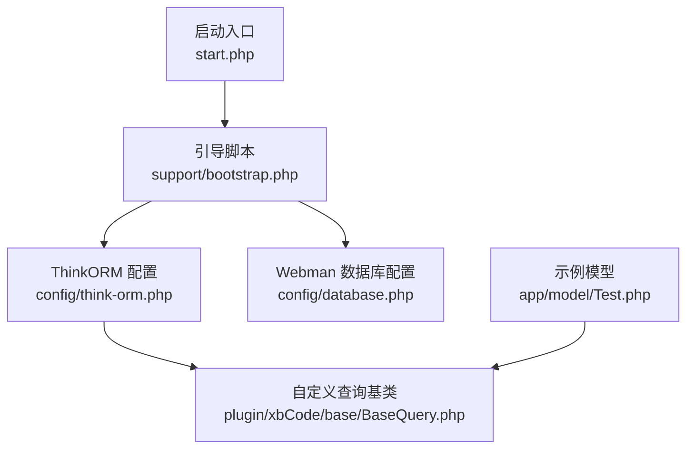
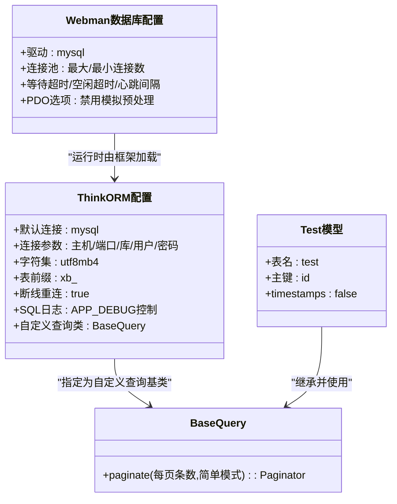
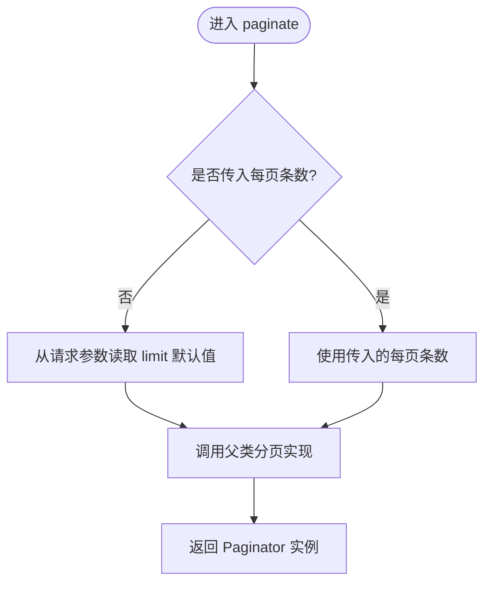
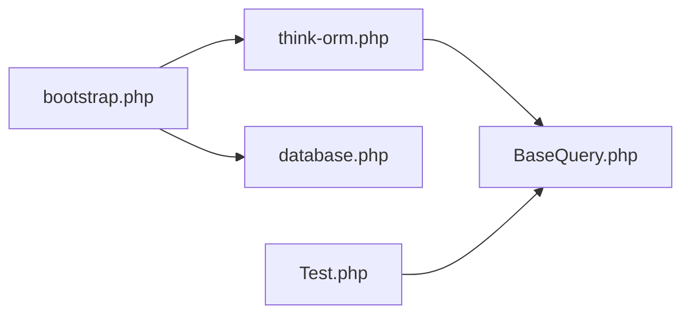

# 数据库操作

<cite>
**本文引用的文件**   
- [server/config/database.php](file://server/config/database.php)
- [server/config/think-orm.php](file://server/config/think-orm.php)
- [server/app/model/Test.php](file://server/app/model/Test.php)
- [server/plugin/xbCode/base/BaseQuery.php](file://server/plugin/xbCode/base/BaseQuery.php)
- [server/support/bootstrap.php](file://server/support/bootstrap.php)
- [server/start.php](file://server/start.php)
</cite>

## 目录
1. [简介](#简介)
2. [项目结构](#项目结构)
3. [核心组件](#核心组件)
4. [架构总览](#架构总览)
5. [详细组件分析](#详细组件分析)
6. [依赖分析](#依赖分析)
7. [性能考虑](#性能考虑)
8. [故障排查指南](#故障排查指南)
9. [结论](#结论)
10. [附录](#附录)

## 简介
本文件面向使用 ThinkORM 的 PHP 后端（基于 Webman），系统化梳理数据库配置、模型定义、查询构建器扩展、事务与连接池、索引优化、软删除与时间戳等实践要点，并结合仓库中现有代码给出可落地的建议与示例路径。文档兼顾初学者与进阶读者，提供从概念到实现细节的分层说明。

## 项目结构
本项目在 server 目录下集成 ThinkORM，并通过配置文件完成数据库连接、驱动参数、连接池与分页行为定制；应用模型位于 app/model 下，基础查询类在插件 xbCode 中进行扩展。

图示来源
- [server/start.php:1-6](file://server/start.php#L1-L6)
- [server/support/bootstrap.php:1-147](file://server/support/bootstrap.php#L1-L147)
- [server/config/think-orm.php:1-40](file://server/config/think-orm.php#L1-L40)
- [server/config/database.php:1-35](file://server/config/database.php#L1-L35)
- [server/plugin/xbCode/base/BaseQuery.php:1-30](file://server/plugin/xbCode/base/BaseQuery.php#L1-L30)
- [server/app/model/Test.php:1-29](file://server/app/model/Test.php#L1-L29)

章节来源
- [server/start.php:1-6](file://server/start.php#L1-L6)
- [server/support/bootstrap.php:1-147](file://server/support/bootstrap.php#L1-L147)
- [server/config/think-orm.php:1-40](file://server/config/think-orm.php#L1-L40)
- [server/config/database.php:1-35](file://server/config/database.php#L1-L35)
- [server/plugin/xbCode/base/BaseQuery.php:1-30](file://server/plugin/xbCode/base/BaseQuery.php#L1-L30)
- [server/app/model/Test.php:1-29](file://server/app/model/Test.php#L1-L29)

## 核心组件
- ThinkORM 配置：定义默认连接、MySQL 类型、主机名、端口、库名、用户、密码、字符集、表前缀、断线重连、SQL 日志开关以及自定义查询基类。
- Webman 数据库配置：定义 MySQL 驱动、连接池参数（最大/最小连接数、等待超时、空闲超时、心跳间隔）及 PDO 选项。
- 自定义查询基类 BaseQuery：重写分页方法，支持从请求参数读取默认每页条数。
- 示例模型 Test：展示表名、主键、是否自动维护时间戳等常用属性。

章节来源
- [server/config/think-orm.php:1-40](file://server/config/think-orm.php#L1-L40)
- [server/config/database.php:1-35](file://server/config/database.php#L1-L35)
- [server/plugin/xbCode/base/BaseQuery.php:1-30](file://server/plugin/xbCode/base/BaseQuery.php#L1-L30)
- [server/app/model/Test.php:1-29](file://server/app/model/Test.php#L1-L29)

## 架构总览
下图展示了 ThinkORM 在本项目中的装配位置与关键依赖关系：启动流程加载配置，ThinkORM 通过配置启用自定义查询基类，模型继承该基类以获得统一的分页行为。

图示来源
- [server/config/think-orm.php:1-40](file://server/config/think-orm.php#L1-L40)
- [server/config/database.php:1-35](file://server/config/database.php#L1-L35)
- [server/plugin/xbCode/base/BaseQuery.php:1-30](file://server/plugin/xbCode/base/BaseQuery.php#L1-L30)
- [server/app/model/Test.php:1-29](file://server/app/model/Test.php#L1-L29)

## 详细组件分析

### ThinkORM 配置与连接
- 默认连接与驱动：默认使用 mysql 连接，类型设置为 mysql。
- 连接参数：主机名、端口、库名、用户名、密码均通过环境变量注入，便于多环境管理。
- 字符集与前缀：字符集 utf8mb4，表前缀 xb_，有利于多租户或模块化命名隔离。
- 断线重连与 SQL 日志：开启断线重连；SQL 日志受 APP_DEBUG 控制，便于调试。
- 自定义查询基类：将 Query 替换为 plugin\xbCode\base\BaseQuery，使所有查询共享统一分页策略。

章节来源
- [server/config/think-orm.php:1-40](file://server/config/think-orm.php#L1-L40)

### Webman 数据库配置与连接池
- 驱动与连接：driver=mysql，host/port/database/username/password/charset/collation/prefix 等字段齐全。
- 连接池：max_connections/min_connections/wait_timeout/idle_timeout/heartbeat_interval 等参数用于协程环境下的高并发连接复用与保活。
- PDO 选项：关闭模拟预处理，提升安全性与执行计划稳定性。

章节来源
- [server/config/database.php:1-35](file://server/config/database.php#L1-L35)

### 自定义查询基类 BaseQuery
- 功能点：重写 paginate，当未显式传入每页条数时，从请求参数 limit 获取默认值，简化控制器调用。
- 影响范围：由于 ThinkORM 配置已将 query 指向 BaseQuery，所有使用该 ORM 的查询都会获得此行为。

图示来源
- [server/plugin/xbCode/base/BaseQuery.php:1-30](file://server/plugin/xbCode/base/BaseQuery.php#L1-L30)

章节来源
- [server/plugin/xbCode/base/BaseQuery.php:1-30](file://server/plugin/xbCode/base/BaseQuery.php#L1-L30)

### 模型定义与时间戳
- 表名与主键：Test 模型显式声明表名与主键，便于非约定命名场景。
- 时间戳：timestamps=false 表示不自动维护 created_at/updated_at，如需开启可在模型中设为 true 或在迁移中创建对应字段。

章节来源
- [server/app/model/Test.php:1-29](file://server/app/model/Test.php#L1-L29)

### 启动与引导流程
- 启动入口 start.php 引入自动加载并运行应用。
- support/bootstrap.php 负责加载 .env、中间件、路由、插件配置等，ThinkORM 与 Webman 数据库配置在此阶段被框架读取并生效。

章节来源
- [server/start.php:1-6](file://server/start.php#L1-L6)
- [server/support/bootstrap.php:1-147](file://server/support/bootstrap.php#L1-L147)

## 依赖分析
- 配置耦合：ThinkORM 配置与 Webman 数据库配置分别服务于不同层面（ORM 层与底层驱动/连接池）。两者共同决定最终连接行为。
- 查询扩展：BaseQuery 作为全局查询基类，被 ThinkORM 配置引用，形成“配置→基类→模型”的单向依赖链，避免循环依赖。
- 运行时加载：bootstrap.php 负责加载各配置与路由，确保 ThinkORM 与数据库连接在请求处理前就绪。

图示来源
- [server/support/bootstrap.php:1-147](file://server/support/bootstrap.php#L1-L147)
- [server/config/think-orm.php:1-40](file://server/config/think-orm.php#L1-L40)
- [server/config/database.php:1-35](file://server/config/database.php#L1-L35)
- [server/plugin/xbCode/base/BaseQuery.php:1-30](file://server/plugin/xbCode/base/BaseQuery.php#L1-L30)
- [server/app/model/Test.php:1-29](file://server/app/model/Test.php#L1-L29)

## 性能考虑
- 连接池调优
  - max_connections/min_connections：根据并发量与数据库承载能力设置，避免过多连接导致上下文切换开销。
  - wait_timeout/idle_timeout/heartbeat_interval：合理设置等待与空闲回收，配合心跳检测保持连接健康。
- 字符集与排序规则：utf8mb4_general_ci 兼容性好，若对排序有严格要求可评估 utf8mb4_unicode_ci。
- SQL 日志：仅在开发环境开启 trigger_sql，生产环境关闭以减少 I/O 开销。
- 分页策略：利用 BaseQuery 的默认 limit 读取，减少重复逻辑；复杂列表建议使用覆盖索引与只读副本。
- 预编译与模拟预处理：关闭模拟预处理有助于执行计划稳定与性能提升。

[本节为通用指导，无需源码引用]

## 故障排查指南
- 连接失败
  - 检查环境变量 DB_HOST/DB_PORT/DB_NAME/DB_USER/DB_PASS 是否正确。
  - 确认防火墙与安全组放行 3306 端口。
- 连接池异常
  - 观察 wait_timeout 与 idle_timeout 是否过小导致频繁重建连接。
  - heartbeat_interval 建议小于 60 秒，确保长连接存活。
- 分页结果异常
  - 确认请求参数 limit 是否存在且为正整数；必要时在控制器层做校验。
- SQL 日志定位慢查询
  - 在开发环境开启 trigger_sql，结合数据库慢查询日志定位热点语句。

章节来源
- [server/config/think-orm.php:1-40](file://server/config/think-orm.php#L1-L40)
- [server/config/database.php:1-35](file://server/config/database.php#L1-L35)
- [server/plugin/xbCode/base/BaseQuery.php:1-30](file://server/plugin/xbCode/base/BaseQuery.php#L1-L30)

## 结论
本项目通过 ThinkORM 与 Webman 数据库配置的协同工作，实现了高可用的数据库访问能力。借助自定义 BaseQuery 统一分页行为、合理的连接池参数与字符集配置，能够在保证一致性的同时提升性能与可维护性。建议在后续迭代中补充数据验证、软删除、事务封装与缓存策略，以进一步完善数据层工程化能力。

[本节为总结性内容，无需源码引用]

## 附录

### 模型定义与关联关系（实践建议）
- 模型属性
  - 表名与主键：显式声明，避免约定不一致导致的歧义。
  - 时间戳：按需开启 timestamps，并在迁移中创建 created_at/updated_at。
- 关联关系
  - 一对一/一对多/多对多：在模型中定义 belongsTo/hasMany/belongsToMany 等方法，配合查询构建器进行关联查询。
  - 延迟加载与预加载：合理使用 with() 预加载，避免 N+1 问题。
- 查询构建器
  - 条件构造：where/whereBetween/whereIn 等组合条件。
  - 聚合与分组：count/sum/avg/groupBy/having。
  - 子查询与原生 SQL：在必要场景使用 raw 表达式，注意参数绑定与注入防护。
- 事务处理
  - 使用事务包裹写操作，确保一致性；捕获异常后回滚并记录日志。
- 数据验证
  - 在控制器或服务层对输入进行校验，结合错误码与国际化消息返回。
- 软删除
  - 在模型中启用软删除特性，查询默认过滤已删除记录，并提供恢复与永久删除接口。
- 索引优化
  - 针对高频查询字段建立单列或多列索引；联合索引遵循最左前缀原则。
  - 定期分析慢查询与执行计划，剔除冗余索引。
- 缓存策略
  - 读多写少场景采用 Redis 缓存；注意缓存穿透、击穿与雪崩防护。
  - 缓存失效策略：过期时间+主动更新+布隆过滤器。

[本节为通用实践建议，无需源码引用]

### SQL 查询示例（参考路径）
- 基础查询与分页
  - 参考：[server/plugin/xbCode/base/BaseQuery.php:1-30](file://server/plugin/xbCode/base/BaseQuery.php#L1-L30)
- 模型定义
  - 参考：[server/app/model/Test.php:1-29](file://server/app/model/Test.php#L1-L29)
- 连接与连接池
  - 参考：[server/config/database.php:1-35](file://server/config/database.php#L1-L35)
- ORM 配置
  - 参考：[server/config/think-orm.php:1-40](file://server/config/think-orm.php#L1-L40)

### 数据迁移脚本编写方法（实践建议）
- 版本化管理：按版本号或时间戳命名迁移文件，确保可回滚。
- 幂等设计：使用 createTable/ifNotExists/dropTable/ifExists 等幂等操作。
- 字段变更：新增字段设置默认值与注释；修改字段类型时评估数据迁移成本。
- 索引与约束：在迁移中声明索引与外键约束，保持一致性。
- 回滚策略：每个 up 方法配套 down 方法，确保可逆。

[本节为通用实践建议，无需源码引用]