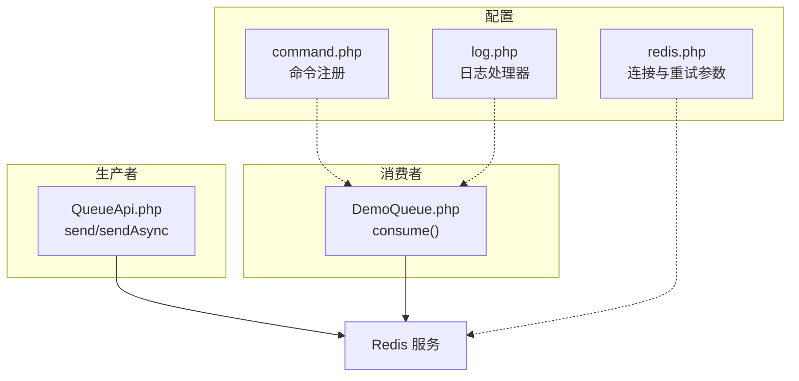
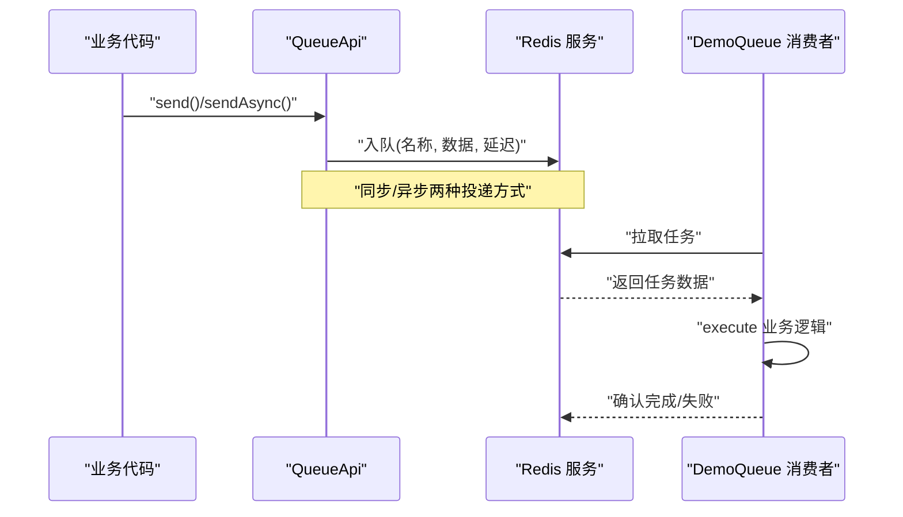
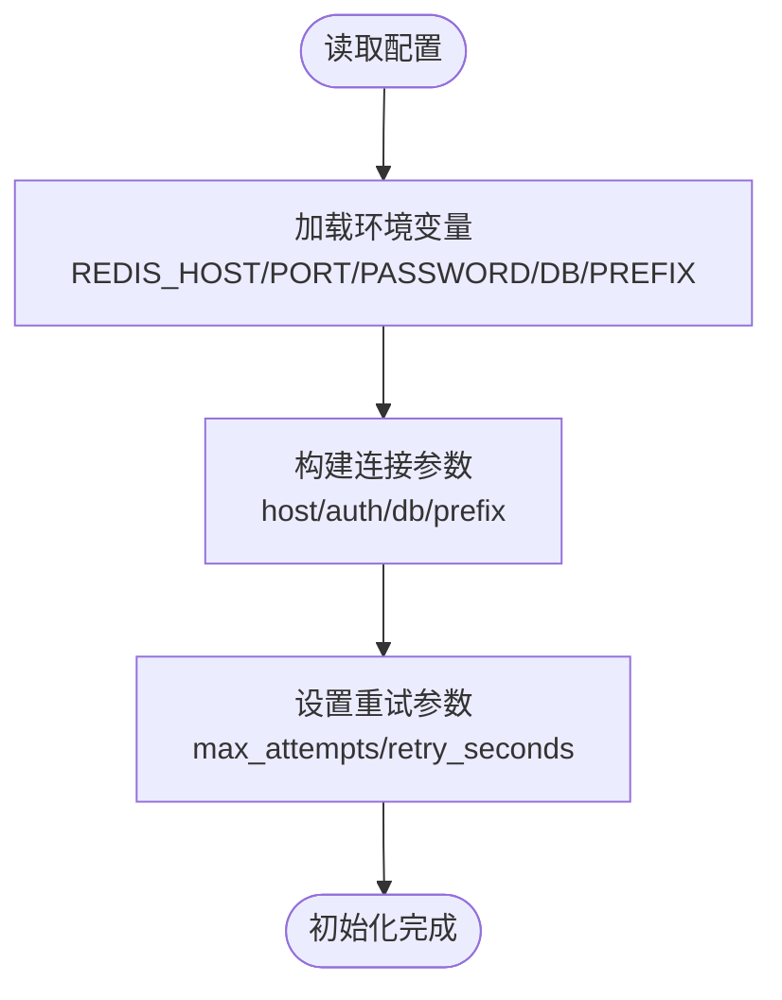
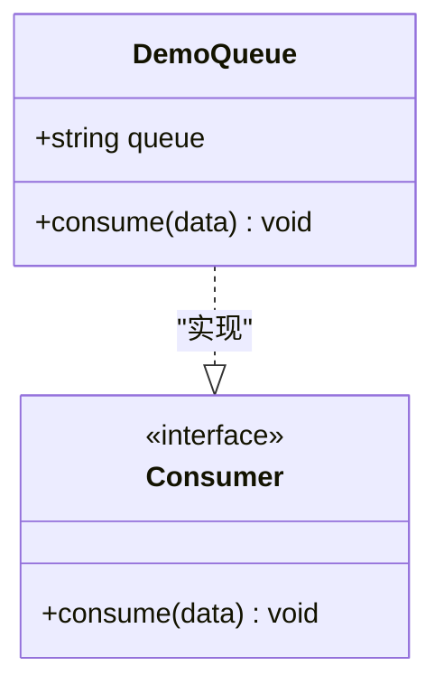
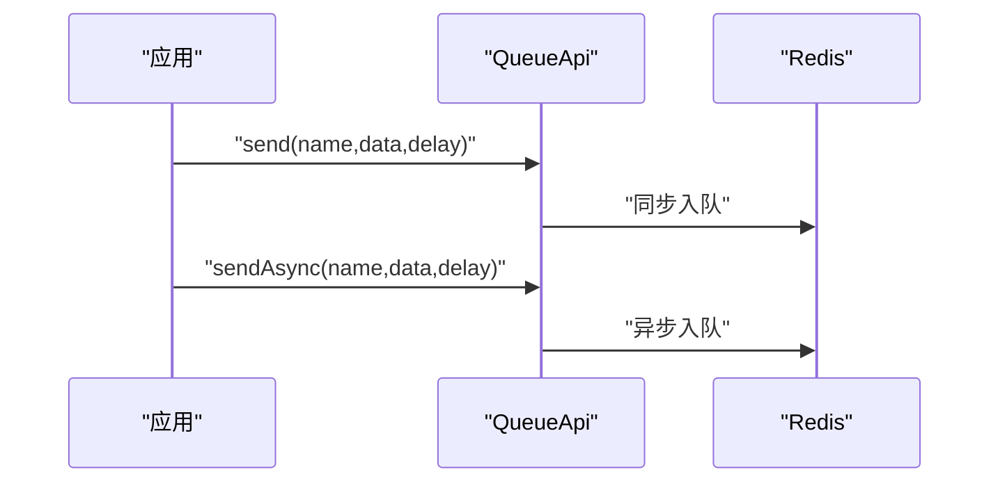
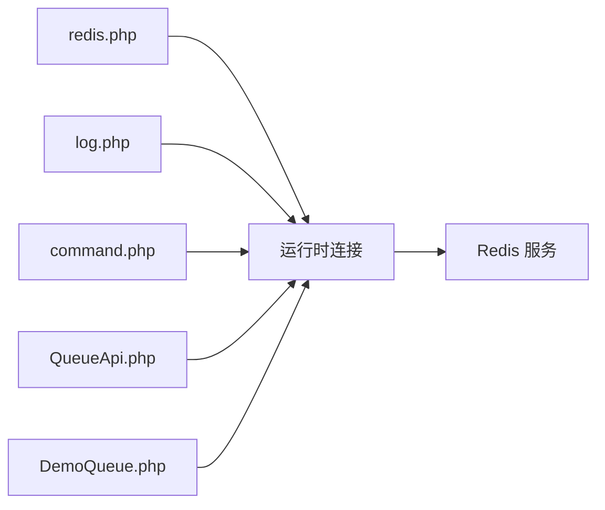

# 缓存与队列

<cite>
**本文引用的文件**   
- [server/config/plugin/webman/redis-queue/redis.php](file://server/config/plugin/webman/redis-queue/redis.php)
- [server/config/plugin/webman/redis-queue/command.php](file://server/config/plugin/webman/redis-queue/command.php)
- [server/config/plugin/webman/redis-queue/log.php](file://server/config/plugin/webman/redis-queue/log.php)
- [server/plugin\xbAiAsset/app/queue/DemoQueue.php](file://server/plugin/xbAiAsset/app/queue/DemoQueue.php)
- [server/plugin\xbCode/api/QueueApi.php](file://server/plugin/xbCode/api/QueueApi.php)
</cite>

## 目录
1. [简介](#简介)
2. [项目结构](#项目结构)
3. [核心组件](#核心组件)
4. [架构总览](#架构总览)
5. [详细组件分析](#详细组件分析)
6. [依赖分析](#依赖分析)
7. [性能考虑](#性能考虑)
8. [故障排查指南](#故障排查指南)
9. [结论](#结论)
10. [附录](#附录)

## 简介
本章节聚焦于项目中基于 Redis 的缓存与消息队列能力，涵盖以下主题：
- Redis 连接与队列配置
- 生产者投递（同步/异步）
- 消费者开发与运行
- 重试机制与日志记录
- 分布式锁、任务调度、死信队列等高级特性的设计与落地建议
- 监控指标与常见问题定位方法

## 项目结构
围绕“缓存与队列”的关键代码位于 server 目录下，主要涉及：
- 队列插件配置：Redis 连接、命令注册、日志输出
- 示例消费者：实现 Consumer 接口的消费类
- 生产端封装：提供统一发送接口（同步/异步）

**图示来源** 
- [server/config/plugin/webman/redis-queue/redis.php:1-28](file://server/config/plugin/webman/redis-queue/redis.php#L1-L28)
- [server/config/plugin/webman/redis-queue/command.php:1-7](file://server/config/plugin/webman/redis-queue/command.php#L1-L7)
- [server/config/plugin/webman/redis-queue/log.php:1-33](file://server/config/plugin/webman/redis-queue/log.php#L1-L33)
- [server/plugin/xbCode/api/QueueApi.php:1-62](file://server/plugin/xbCode/api/QueueApi.php#L1-L62)
- [server/plugin/xbAiAsset/app/queue/DemoQueue.php:1-33](file://server/plugin/xbAiAsset/app/queue/DemoQueue.php#L1-L33)

**章节来源**
- [server/config/plugin/webman/redis-queue/redis.php:1-28](file://server/config/plugin/webman/redis-queue/redis.php#L1-L28)
- [server/config/plugin/webman/redis-queue/command.php:1-7](file://server/config/plugin/webman/redis-queue/command.php#L1-L7)
- [server/config/plugin/webman/redis-queue/log.php:1-33](file://server/config/plugin/webman/redis-queue/log.php#L1-L33)
- [server/plugin/xbCode/api/QueueApi.php:1-62](file://server/plugin/xbCode/api/QueueApi.php#L1-L62)
- [server/plugin/xbAiAsset/app/queue/DemoQueue.php:1-33](file://server/plugin/xbAiAsset/app/queue/DemoQueue.php#L1-L33)

## 核心组件
- 连接与重试配置
  - 通过环境变量注入 Redis 主机、端口、密码、库号与前缀
  - 支持 max_attempts 与 retry_seconds 控制失败重试次数与间隔
- 命令与进程
  - 注册 MakeConsumerCommand 以生成消费者骨架
  - 实际消费者由独立进程常驻拉取并执行
- 日志
  - 使用 Monolog 轮转文件处理器，默认写入 runtime/logs/redis-queue/queue.log
- 生产者 API
  - QueueApi::send 同步投递
  - QueueApi::sendAsync 异步投递
- 消费者示例
  - DemoQueue 实现 Consumer 接口，定义 consume 处理逻辑

**章节来源**
- [server/config/plugin/webman/redis-queue/redis.php:1-28](file://server/config/plugin/webman/redis-queue/redis.php#L1-L28)
- [server/config/plugin/webman/redis-queue/command.php:1-7](file://server/config/plugin/webman/redis-queue/command.php#L1-L7)
- [server/config/plugin/webman/redis-queue/log.php:1-33](file://server/config/plugin/webman/redis-queue/log.php#L1-L33)
- [server/plugin/xbCode/api/QueueApi.php:1-62](file://server/plugin/xbCode/api/QueueApi.php#L1-L62)
- [server/plugin/xbAiAsset/app/queue/DemoQueue.php:1-33](file://server/plugin/xbAiAsset/app/queue/DemoQueue.php#L1-L33)

## 架构总览
下图展示了从业务调用到 Redis 再到消费者的完整链路。

**图示来源**
- [server/plugin/xbCode/api/QueueApi.php:1-62](file://server/plugin/xbCode/api/QueueApi.php#L1-L62)
- [server/plugin/xbAiAsset/app/queue/DemoQueue.php:1-33](file://server/plugin/xbAiAsset/app/queue/DemoQueue.php#L1-L33)

## 详细组件分析

### 组件一：Redis 连接与重试策略
- 关键配置项
  - host：Redis 地址（支持 redis:// 协议）
  - options.auth：认证密码
  - options.db：数据库编号
  - options.prefix：键名前缀
  - options.max_attempts：消费失败最大重试次数
  - options.retry_seconds：重试间隔秒数
- 设计要点
  - 通过环境变量集中管理，便于多环境切换
  - 重试策略可避免瞬时异常导致任务丢失
  - prefix 可用于隔离不同环境或租户的键空间

**图示来源**
- [server/config/plugin/webman/redis-queue/redis.php:1-28](file://server/config/plugin/webman/redis-queue/redis.php#L1-L28)

**章节来源**
- [server/config/plugin/webman/redis-queue/redis.php:1-28](file://server/config/plugin/webman/redis-queue/redis.php#L1-L28)

### 组件二：命令与消费者生命周期
- 命令注册
  - command.php 注册 MakeConsumerCommand，用于快速生成消费者类
- 消费者实现
  - DemoQueue 实现 Consumer 接口，需实现 consume($data) 方法
  - 可通过类属性 queue 指定队列名（未显式设置时按类名推断）
- 运行方式
  - 通常以独立进程常驻，循环拉取并执行任务

**图示来源**
- [server/plugin/xbAiAsset/app/queue/DemoQueue.php:1-33](file://server/plugin/xbAiAsset/app/queue/DemoQueue.php#L1-33)
- [server/config/plugin/webman/redis-queue/command.php:1-7](file://server/config/plugin/webman/redis-queue/command.php#L1-7)

**章节来源**
- [server/config/plugin/webman/redis-queue/command.php:1-7](file://server/config/plugin/webman/redis-queue/command.php#L1-7)
- [server/plugin/xbAiAsset/app/queue/DemoQueue.php:1-33](file://server/plugin/xbAiAsset/app/queue/DemoQueue.php#L1-33)

### 组件三：生产者 API（同步/异步）
- 同步投递
  - QueueApi::send(name, data, delay=0)
  - 适用于需要立即落盘且对延迟不敏感的场景
- 异步投递
  - QueueApi::sendAsync(name, data, delay=0)
  - 适用于高吞吐场景，降低主流程阻塞
- 设计建议
  - 根据业务 SLA 选择同步/异步
  - 合理设置 delay 实现延时任务
  - 为每个队列明确命名规范，便于监控与限流

**图示来源**
- [server/plugin/xbCode/api/QueueApi.php:1-62](file://server/plugin/xbCode/api/QueueApi.php#L1-62)

**章节来源**
- [server/plugin/xbCode/api/QueueApi.php:1-62](file://server/plugin/xbCode/api/QueueApi.php#L1-62)

### 组件四：日志与可观测性
- 日志位置
  - runtime/logs/redis-queue/queue.log
- 日志格式
  - 使用 Monolog LineFormatter，包含时间戳
- 建议
  - 结合错误码与上下文信息，便于问题追踪
  - 定期轮转与归档，避免磁盘占满

**章节来源**
- [server/config/plugin/webman/redis-queue/log.php:1-33](file://server/config/plugin/webman/redis-queue/log.php#L1-33)

### 组件五：分布式锁（设计建议）
说明：当前仓库未直接提供分布式锁实现，以下为通用实践建议，供扩展参考。
- 典型用法
  - 使用 SETNX/SET NX EX 获取锁，过期时间防止死锁
  - 释放锁前校验持有者身份（如唯一 token）
- 适用场景
  - 热点资源竞争、定时任务去重、幂等控制
- 注意事项
  - 锁粒度尽量小，避免长事务持有锁
  - 配合重试与退避策略，避免雪崩

[本节为概念性内容，不涉及具体源码]

### 组件六：任务调度（设计建议）
说明：当前仓库未直接提供任务调度实现，以下为通用实践建议，供扩展参考。
- 方案选型
  - 基于 Redis ZSET 的延迟队列
  - 外部调度器（如系统 crontab 或专用调度服务）
- 关键指标
  - 任务积压长度、平均处理时长、超时率
- 治理手段
  - 动态扩缩容消费者数量
  - 分级队列与优先级

[本节为概念性内容，不涉及具体源码]

### 组件七：重试机制与死信队列（设计建议）
说明：当前仓库在连接配置中提供了 max_attempts 与 retry_seconds，但未展示死信队列的具体实现。以下为通用实践建议，供扩展参考。
- 重试策略
  - 指数退避 + 抖动，避免集中重试
  - 区分可重试与不可重试异常
- 死信队列
  - 超过最大重试次数的任务转入死信队列
  - 提供人工干预与补偿通道
- 监控告警
  - 死信堆积量、重复消费比例、处理耗时分布

[本节为概念性内容，不涉及具体源码]

## 依赖分析
- 配置层
  - redis.php 提供连接与重试参数
  - log.php 提供日志处理器
  - command.php 提供消费者生成命令
- 运行时
  - 生产者通过 QueueApi 调用底层 Redis 客户端
  - 消费者通过 Consumer 接口接收并处理任务

**图示来源**
- [server/config/plugin/webman/redis-queue/redis.php:1-28](file://server/config/plugin/webman/redis-queue/redis.php#L1-L28)
- [server/config/plugin/webman/redis-queue/log.php:1-33](file://server/config/plugin/webman/redis-queue/log.php#L1-33)
- [server/config/plugin/webman/redis-queue/command.php:1-7](file://server/config/plugin/webman/redis-queue/command.php#L1-7)
- [server/plugin/xbCode/api/QueueApi.php:1-62](file://server/plugin/xbCode/api/QueueApi.php#L1-62)
- [server/plugin/xbAiAsset/app/queue/DemoQueue.php:1-33](file://server/plugin/xbAiAsset/app/queue/DemoQueue.php#L1-33)

**章节来源**
- [server/config/plugin/webman/redis-queue/redis.php:1-28](file://server/config/plugin/webman/redis-queue/redis.php#L1-L28)
- [server/config/plugin/webman/redis-queue/log.php:1-33](file://server/config/plugin/webman/redis-queue/log.php#L1-33)
- [server/config/plugin/webman/redis-queue/command.php:1-7](file://server/config/plugin/webman/redis-queue/command.php#L1-7)
- [server/plugin/xbCode/api/QueueApi.php:1-62](file://server/plugin/xbCode/api/QueueApi.php#L1-62)
- [server/plugin/xbAiAsset/app/queue/DemoQueue.php:1-33](file://server/plugin/xbAiAsset/app/queue/DemoQueue.php#L1-33)

## 性能考虑
- 连接复用与池化
  - 确保连接池大小与并发度匹配，避免频繁创建销毁
- 批量与压缩
  - 大对象序列化前考虑压缩；必要时拆分任务
- 背压与限流
  - 消费者侧增加速率限制，防止下游过载
- 幂等与去重
  - 为任务引入唯一 ID，消费端做幂等校验
- 监控指标
  - 入队/出队速率、P99 延迟、失败率、重试次数、死信堆积

[本节为通用指导，不涉及具体源码]

## 故障排查指南
- 连接失败
  - 检查 REDIS_HOST/PORT/PASSWORD/DB 是否正确
  - 确认网络连通性与防火墙策略
- 任务未消费
  - 确认消费者进程是否启动
  - 核对队列名称与消费者绑定关系
- 频繁重试
  - 查看重试次数与间隔配置
  - 分析异常类型，区分可重试与不可重试
- 日志定位
  - 查看 runtime/logs/redis-queue/queue.log
  - 结合请求 ID 与任务 ID 进行关联分析

**章节来源**
- [server/config/plugin/webman/redis-queue/redis.php:1-28](file://server/config/plugin/webman/redis-queue/redis.php#L1-L28)
- [server/config/plugin/webman/redis-queue/log.php:1-33](file://server/config/plugin/webman/redis-queue/log.php#L1-33)

## 结论
本项目已具备基于 Redis 的队列基础能力：统一的连接与重试配置、同步/异步投递 API、消费者骨架与日志记录。在此基础上，可按需扩展分布式锁、任务调度与死信队列等高级特性，并结合完善的监控与排障体系，提升系统的稳定性与可维护性。

[本节为总结性内容，不涉及具体源码]

## 附录
- 常用命令
  - 使用命令生成消费者类（参考 command.php 中的命令注册）
- 配置清单
  - 环境变量：REDIS_HOST、REDIS_PORT、REDIS_PASSWORD、REDIS_DB、REDIS_PREFIX
  - 重试参数：max_attempts、retry_seconds
- 日志路径
  - runtime/logs/redis-queue/queue.log

**章节来源**
- [server/config/plugin/webman/redis-queue/command.php:1-7](file://server/config/plugin/webman/redis-queue/command.php#L1-7)
- [server/config/plugin/webman/redis-queue/redis.php:1-28](file://server/config/plugin/webman/redis-queue/redis.php#L1-L28)
- [server/config/plugin/webman/redis-queue/log.php:1-33](file://server/config/plugin/webman/redis-queue/log.php#L1-33)