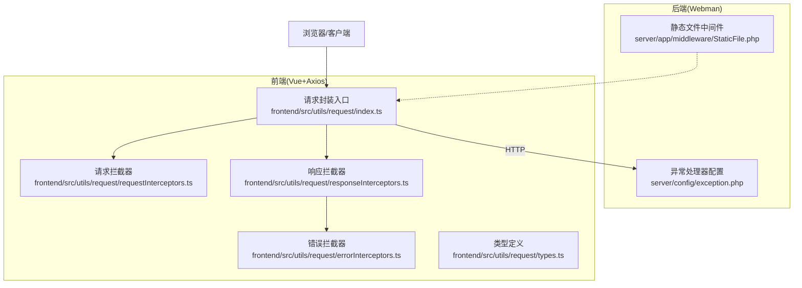
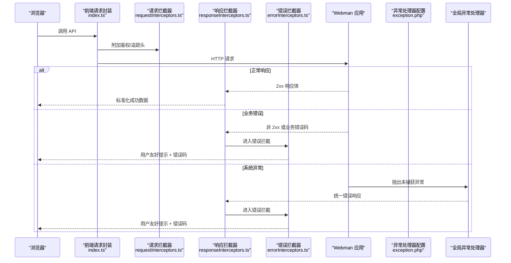
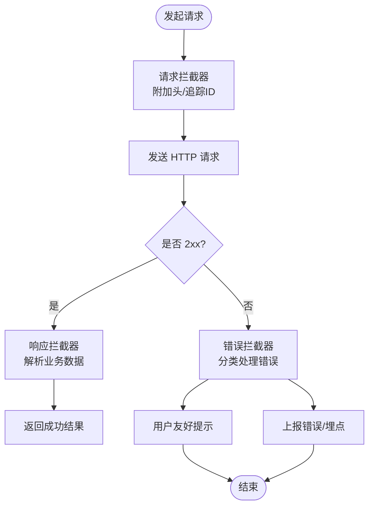
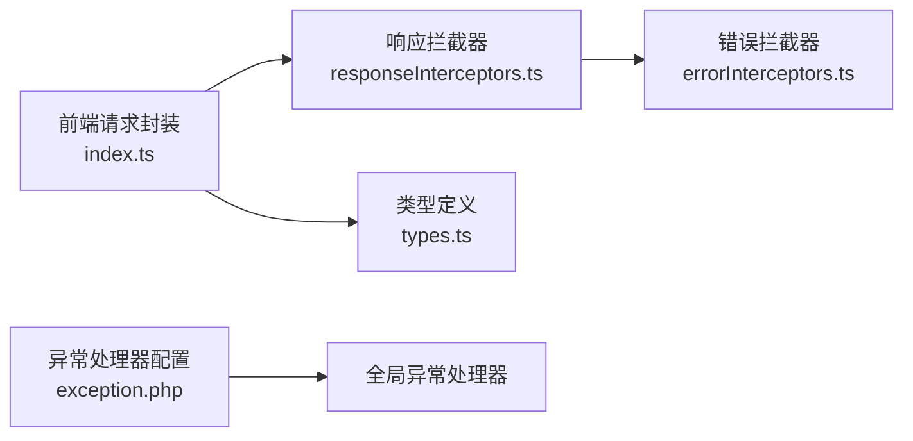

# 错误处理

<cite>
**本文引用的文件**
- [server/config/exception.php](file://server/config/exception.php)
- [server/app/middleware/StaticFile.php](file://server/app/middleware/StaticFile.php)
- [frontend/src/utils/request/errorInterceptors.ts](file://frontend/src/utils/request/errorInterceptors.ts)
- [frontend/src/utils/request/responseInterceptors.ts](file://frontend/src/utils/request/responseInterceptors.ts)
- [frontend/src/utils/request/types.ts](file://frontend/src/utils/request/types.ts)
- [frontend/src/utils/request/index.ts](file://frontend/src/utils/request/index.ts)
</cite>

## 目录
1. [简介](#简介)
2. [项目结构](#项目结构)
3. [核心组件](#核心组件)
4. [架构总览](#架构总览)
5. [详细组件分析](#详细组件分析)
6. [依赖分析](#依赖分析)
7. [性能考虑](#性能考虑)
8. [故障排查指南](#故障排查指南)
9. [结论](#结论)
10. [附录](#附录)

## 简介
本章节聚焦于前后端一致的错误处理体系，涵盖 Webman 异常处理机制、全局错误处理器、日志记录策略、业务异常分类与错误码规范、用户友好提示、调试信息输出、前后端一致性设计、错误监控告警以及性能分析工具的使用建议。目标是帮助团队在开发、测试与生产环境中建立稳定、可观测且用户体验友好的错误处理方案。

## 项目结构
后端基于 Webman 框架，通过配置文件注册全局异常处理器；前端基于 TypeScript/Vue 工程，使用 Axios 拦截器统一处理请求与响应错误。关键位置如下：
- 后端全局异常处理器映射配置：server/config/exception.php
- 静态资源访问中间件（含简单错误响应示例）：server/app/middleware/StaticFile.php
- 前端请求封装与拦截器：frontend/src/utils/request/*

图表来源
- [server/config/exception.php:1-17](file://server/config/exception.php#L1-L17)
- [server/app/middleware/StaticFile.php:1-43](file://server/app/middleware/StaticFile.php#L1-L43)
- [frontend/src/utils/request/index.ts](file://frontend/src/utils/request/index.ts)
- [frontend/src/utils/request/errorInterceptors.ts](file://frontend/src/utils/request/errorInterceptors.ts)
- [frontend/src/utils/request/responseInterceptors.ts](file://frontend/src/utils/request/responseInterceptors.ts)
- [frontend/src/utils/request/types.ts](file://frontend/src/utils/request/types.ts)

章节来源
- [server/config/exception.php:1-17](file://server/config/exception.php#L1-L17)
- [server/app/middleware/StaticFile.php:1-43](file://server/app/middleware/StaticFile.php#L1-L43)
- [frontend/src/utils/request/index.ts](file://frontend/src/utils/request/index.ts)
- [frontend/src/utils/request/errorInterceptors.ts](file://frontend/src/utils/request/errorInterceptors.ts)
- [frontend/src/utils/request/responseInterceptors.ts](file://frontend/src/utils/request/responseInterceptors.ts)
- [frontend/src/utils/request/types.ts](file://frontend/src/utils/request/types.ts)

## 核心组件
- 全局异常处理器映射：通过配置文件将空字符串键映射到默认异常处理器类，用于捕获未处理异常并统一返回格式。
- 静态文件中间件：演示了快速返回错误响应的模式，可作为自定义错误页面的参考。
- 前端请求封装：集中管理 Axios 实例、拦截器链路与错误类型定义，确保前后端错误协议一致。

章节来源
- [server/config/exception.php:1-17](file://server/config/exception.php#L1-L17)
- [server/app/middleware/StaticFile.php:1-43](file://server/app/middleware/StaticFile.php#L1-L43)
- [frontend/src/utils/request/index.ts](file://frontend/src/utils/request/index.ts)
- [frontend/src/utils/request/types.ts](file://frontend/src/utils/request/types.ts)

## 架构总览
下图展示了从浏览器发起请求到后端异常处理的完整链路，以及前端拦截器的职责边界。

图表来源
- [server/config/exception.php:1-17](file://server/config/exception.php#L1-L17)
- [frontend/src/utils/request/index.ts](file://frontend/src/utils/request/index.ts)
- [frontend/src/utils/request/responseInterceptors.ts](file://frontend/src/utils/request/responseInterceptors.ts)
- [frontend/src/utils/request/errorInterceptors.ts](file://frontend/src/utils/request/errorInterceptors.ts)

## 详细组件分析

### 后端：Webman 全局异常处理
- 异常处理器注册：通过配置文件将空字符串键映射到默认异常处理器类，实现全局异常捕获与统一响应。
- 扩展方式：可在该配置中增加特定异常类的映射，以覆盖默认行为，例如针对业务异常的专用处理器。
- 最佳实践：
  - 所有业务异常应继承统一的基类，便于识别与分类。
  - 统一返回结构包含错误码、消息、可选的调试信息（仅开发环境）。
  - 在生产环境隐藏敏感堆栈，避免泄露内部细节。

章节来源
- [server/config/exception.php:1-17](file://server/config/exception.php#L1-L17)

### 后端：中间件中的错误响应示例
- 静态文件中间件展示了直接返回错误响应的模式，可用于快速返回 403 等状态码。
- 建议：
  - 对安全相关错误（如禁止访问）返回明确的状态码与简短消息。
  - 复杂错误页面可通过视图渲染或 JSON 响应，保持与全局异常处理器一致的返回结构。

章节来源
- [server/app/middleware/StaticFile.php:1-43](file://server/app/middleware/StaticFile.php#L1-L43)

### 前端：请求封装与拦截器
- 请求封装入口：集中创建 Axios 实例、设置基础 URL、超时、通用头等。
- 请求拦截器：注入鉴权令牌、请求追踪 ID、时间戳等，便于问题定位。
- 响应拦截器：解析后端统一响应体，提取业务数据与错误码，进行成功路径的数据透传。
- 错误拦截器：统一处理网络错误、超时、HTTP 状态码异常与业务错误码，提供用户友好提示与重试策略。
- 类型定义：为响应体、错误对象、拦截器参数提供 TS 类型约束，提升可维护性。

图表来源
- [frontend/src/utils/request/index.ts](file://frontend/src/utils/request/index.ts)
- [frontend/src/utils/request/responseInterceptors.ts](file://frontend/src/utils/request/responseInterceptors.ts)
- [frontend/src/utils/request/errorInterceptors.ts](file://frontend/src/utils/request/errorInterceptors.ts)
- [frontend/src/utils/request/types.ts](file://frontend/src/utils/request/types.ts)

章节来源
- [frontend/src/utils/request/index.ts](file://frontend/src/utils/request/index.ts)
- [frontend/src/utils/request/responseInterceptors.ts](file://frontend/src/utils/request/responseInterceptors.ts)
- [frontend/src/utils/request/errorInterceptors.ts](file://frontend/src/utils/request/errorInterceptors.ts)
- [frontend/src/utils/request/types.ts](file://frontend/src/utils/request/types.ts)

### 业务异常分类与错误码规范
- 分类建议：
  - 认证与授权错误（如未登录、权限不足）
  - 参数校验错误（如必填项缺失、格式不正确）
  - 业务规则错误（如库存不足、重复提交）
  - 第三方服务错误（如支付失败、短信发送失败）
  - 系统内部错误（如数据库连接失败、未知异常）
- 错误码规范：
  - 采用分层编码：模块前缀 + 场景码 + 具体错误码，便于定位。
  - 成功码固定为 0，失败码按类别划分区间。
  - 每个错误码附带可读消息与可选的调试信息。
- 用户友好提示：
  - 面向用户的消息应避免技术细节，提供可操作建议。
  - 对于可重试错误，提供“重试”按钮与次数限制。
- 调试信息输出：
  - 仅在开发环境输出堆栈、请求 ID、耗时等。
  - 生产环境仅保留必要上下文，避免泄露敏感信息。

[本节为概念性说明，不直接分析具体文件]

### 前后端一致性设计
- 统一响应结构：
  - 成功：{ code, data, message }
  - 失败：{ code, message, debug? }
- 状态码约定：
  - HTTP 层尽量使用标准状态码（200、400、401、403、404、500）。
  - 业务层通过 code 字段表达更细粒度的错误语义。
- 错误传播：
  - 后端异常处理器统一包装业务异常为统一响应结构。
  - 前端拦截器根据 code 与 message 展示提示，必要时上报监控。

[本节为概念性说明，不直接分析具体文件]

### 错误监控告警
- 上报维度：
  - 错误类型（网络、业务、系统）、错误码、用户标识、设备信息、请求路径、耗时。
- 上报时机：
  - 前端错误拦截器捕获后异步上报。
  - 后端全局异常处理器记录结构化日志并触发告警。
- 告警策略：
  - 阈值告警（单位时间内错误数超过阈值）。
  - 严重级别告警（如 5xx 比例上升、关键业务失败率升高）。

[本节为概念性说明，不直接分析具体文件]

### 性能分析工具使用方法
- 前端：
  - 使用浏览器开发者工具的 Network 面板查看请求耗时与错误详情。
  - 使用 Performance 面板分析长任务与阻塞点。
  - 结合错误上报平台（如 Sentry）进行线上问题定位。
- 后端：
  - 使用 Webman 内置日志与外部日志系统（如 ELK）聚合分析。
  - 通过请求追踪 ID 关联前后端日志，快速定位问题链路。

[本节为概念性说明，不直接分析具体文件]

## 依赖分析
- 后端依赖：
  - Webman 框架的异常处理机制由配置文件驱动，支持扩展自定义处理器。
- 前端依赖：
  - Axios 拦截器链式处理请求与响应，错误拦截器负责统一错误处理逻辑。
- 耦合关系：
  - 前后端通过统一响应结构与错误码约定解耦，降低集成成本。

图表来源
- [frontend/src/utils/request/index.ts](file://frontend/src/utils/request/index.ts)
- [frontend/src/utils/request/responseInterceptors.ts](file://frontend/src/utils/request/responseInterceptors.ts)
- [frontend/src/utils/request/errorInterceptors.ts](file://frontend/src/utils/request/errorInterceptors.ts)
- [frontend/src/utils/request/types.ts](file://frontend/src/utils/request/types.ts)
- [server/config/exception.php:1-17](file://server/config/exception.php#L1-L17)

章节来源
- [frontend/src/utils/request/index.ts](file://frontend/src/utils/request/index.ts)
- [frontend/src/utils/request/responseInterceptors.ts](file://frontend/src/utils/request/responseInterceptors.ts)
- [frontend/src/utils/request/errorInterceptors.ts](file://frontend/src/utils/request/errorInterceptors.ts)
- [frontend/src/utils/request/types.ts](file://frontend/src/utils/request/types.ts)
- [server/config/exception.php:1-17](file://server/config/exception.php#L1-L17)

## 性能考虑
- 减少不必要的错误上报频率，避免雪崩效应。
- 对高频错误进行采样上报，平衡可观测性与开销。
- 在后端全局异常处理器中避免重型计算，仅记录必要上下文。
- 前端错误提示去重与节流，提升用户体验。

[本节为概念性说明，不直接分析具体文件]

## 故障排查指南
- 常见问题：
  - 跨域错误：检查 CORS 配置与中间件是否放行。
  - 鉴权失败：确认请求拦截器是否正确注入令牌。
  - 业务错误：核对后端错误码与前端映射表是否一致。
  - 网络超时：调整前端超时配置与后端处理耗时。
- 定位步骤：
  - 前端：打开 Network 面板，查看请求与响应体，定位错误码与消息。
  - 后端：根据请求追踪 ID 检索日志，定位异常堆栈与上下文。
  - 联调：对比前后端错误码映射，确保一致性。

章节来源
- [server/app/middleware/StaticFile.php:1-43](file://server/app/middleware/StaticFile.php#L1-L43)
- [frontend/src/utils/request/errorInterceptors.ts](file://frontend/src/utils/request/errorInterceptors.ts)
- [frontend/src/utils/request/responseInterceptors.ts](file://frontend/src/utils/request/responseInterceptors.ts)

## 结论
通过 Webman 的全局异常处理器与前端 Axios 拦截器协同，构建前后端一致的错误处理体系，能够显著提升系统的稳定性与可观测性。建议团队遵循统一的错误码规范、用户友好提示策略与监控告警机制，持续优化错误处理体验与运维效率。

[本节为总结性内容，不直接分析具体文件]

## 附录
- 推荐实践清单：
  - 定义统一响应结构与错误码规范。
  - 在后端全局异常处理器中统一包装业务异常。
  - 在前端拦截器中统一处理网络与业务错误。
  - 接入错误监控平台，建立告警策略。
  - 定期复盘高频错误，推动根因治理。

[本节为补充性内容，不直接分析具体文件]