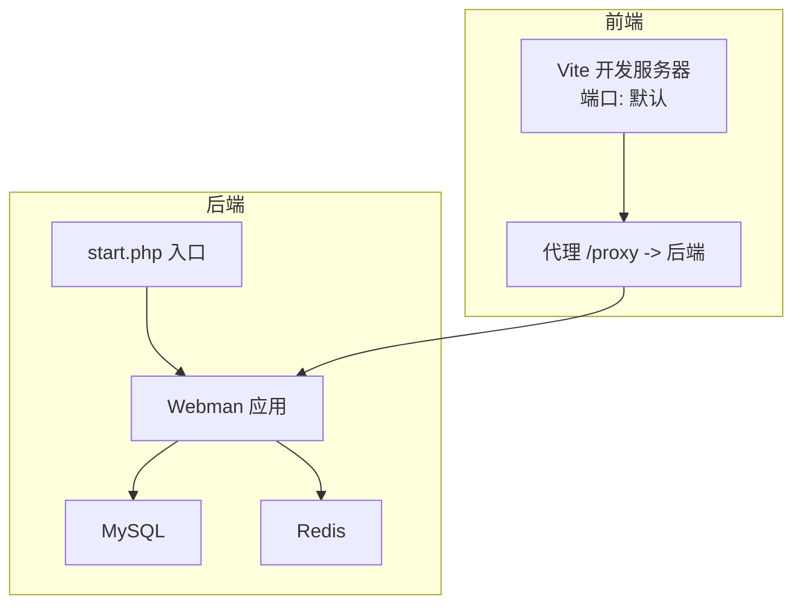
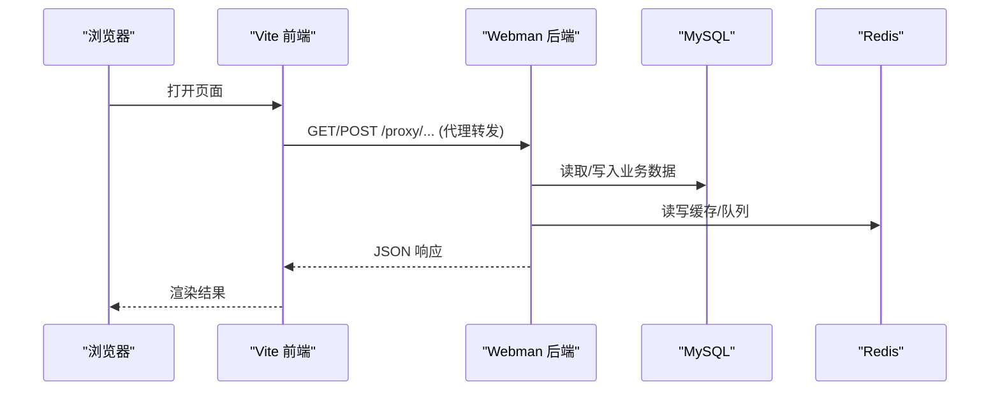
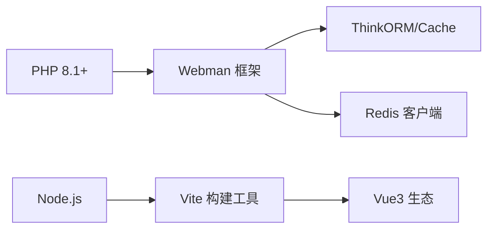

# 快速开始

<cite>
**本文引用的文件**
- [frontend/package.json](file://frontend/package.json)
- [frontend/vite.config.ts](file://frontend/vite.config.ts)
- [frontend/src/utils/request/config.ts](file://frontend/src/utils/request/config.ts)
- [server/README.md](file://server/README.md)
- [server/composer.json](file://server/composer.json)
- [server/start.php](file://server/start.php)
- [server/config/database.php](file://server/config/database.php)
- [server/config/redis.php](file://server/config/redis.php)
- [server/plugin\xbCode\install.sql](file://server/plugin\xbCode\install.sql)
</cite>

## 目录
1. [简介](#简介)
2. [项目结构](#项目结构)
3. [核心组件](#核心组件)
4. [架构总览](#架构总览)
5. [详细组件分析](#详细组件分析)
6. [依赖关系分析](#依赖关系分析)
7. [性能考虑](#性能考虑)
8. [故障排查指南](#故障排查指南)
9. [结论](#结论)
10. [附录](#附录)

## 简介
本指南面向首次接触“积木云AI创作平台”的开发者，帮助你在最短时间内完成环境准备、前后端依赖安装、数据库初始化与开发服务器启动，并给出常见问题解决方案与验证方法。后端基于 Webman（PHP 8.1+），前端基于 Vite + Vue3；数据层使用 MySQL 与 Redis。

## 项目结构
- 前端：位于 frontend 目录，使用 Vite 构建，提供本地开发代理以转发 API 请求到后端。
- 后端：位于 server 目录，基于 Webman 框架，通过 start.php 启动进程；数据库与缓存配置集中在 config 目录；插件化能力由 plugin 目录承载。

图表来源
- [frontend/vite.config.ts:19-31](file://frontend/vite.config.ts#L19-L31)
- [server/start.php:1-6](file://server/start.php#L1-L6)
- [server/config/database.php:1-35](file://server/config/database.php#L1-L35)
- [server/config/redis.php:1-17](file://server/config/redis.php#L1-L17)

章节来源
- [frontend/package.json:1-35](file://frontend/package.json#L1-L35)
- [frontend/vite.config.ts:1-32](file://frontend/vite.config.ts#L1-L32)
- [server/start.php:1-6](file://server/start.php#L1-L6)
- [server/README.md:49-85](file://server/README.md#L49-L85)

## 核心组件
- 前端工程
  - 包管理与脚本：package.json 定义了 dev/build/preview 等脚本，便于本地开发与预览。
  - 开发服务器与代理：vite.config.ts 配置了 /proxy 代理至后端地址，便于跨域联调。
  - 请求基地址：src/utils/request/config.ts 中 BASE_URL 支持环境变量覆盖，默认走代理路径。
- 后端服务
  - 运行环境：composer.json 声明 PHP >= 8.1 及 Webman 生态依赖。
  - 启动入口：start.php 加载自动加载器并启动应用。
  - 数据库与缓存：config/database.php 与 config/redis.php 通过环境变量注入连接信息。
  - 基础表结构：plugin\xbCode\install.sql 包含系统管理员、角色、菜单、配置、插件等基础表。

章节来源
- [frontend/package.json:1-35](file://frontend/package.json#L1-L35)
- [frontend/vite.config.ts:1-32](file://frontend/vite.config.ts#L1-L32)
- [frontend/src/utils/request/config.ts:1-39](file://frontend/src/utils/request/config.ts#L1-L39)
- [server/composer.json:31-68](file://server/composer.json#L31-L68)
- [server/start.php:1-6](file://server/start.php#L1-L6)
- [server/config/database.php:1-35](file://server/config/database.php#L1-L35)
- [server/config/redis.php:1-17](file://server/config/redis.php#L1-L17)
- [server/plugin\xbCode\install.sql:1-91](file://server/plugin\xbCode\install.sql#L1-L91)

## 架构总览
下图展示了从浏览器发起请求到后端处理、访问数据库与缓存的整体流程。

图表来源
- [frontend/vite.config.ts:23-29](file://frontend/vite.config.ts#L23-L29)
- [server/start.php:1-6](file://server/start.php#L1-L6)
- [server/config/database.php:1-35](file://server/config/database.php#L1-L35)
- [server/config/redis.php:1-17](file://server/config/redis.php#L1-L17)

## 详细组件分析

### 环境准备
- 必需软件
  - Node.js（用于前端构建与开发）
  - PHP 8.1+（后端运行环境）
  - MySQL 5.7 或 8.0（数据存储）
  - Redis（缓存与队列）
- 推荐工具
  - Composer（PHP 依赖管理）
  - pnpm 或 npm/yarn（前端依赖管理）
  - Nginx（生产部署时作为反向代理）

章节来源
- [server/README.md:49-56](file://server/README.md#L49-L56)

### 后端安装与配置
- 安装 PHP 扩展与依赖
  - 确保 PHP >= 8.1，并在 server 目录下执行依赖安装。
- 创建数据库与用户
  - 在 MySQL 中创建数据库与用户，并授予相应权限。
- 导入基础表结构
  - 将 plugin\xbCode\install.sql 导入目标数据库，以生成系统所需的基础表。
- 配置数据库与缓存
  - 通过环境变量设置 DB_HOST、DB_PORT、DB_NAME、DB_USER、DB_PASS、DB_PREFIX。
  - 通过环境变量设置 REDIS_HOST、REDIS_PORT、REDIS_PASSWORD、REDIS_DB。
- 启动后端服务
  - 在项目根目录执行启动命令，使 Webman 应用运行。

章节来源
- [server/composer.json:31-68](file://server/composer.json#L31-L68)
- [server/plugin\xbCode\install.sql:1-91](file://server/plugin\xbCode\install.sql#L1-L91)
- [server/config/database.php:1-35](file://server/config/database.php#L1-L35)
- [server/config/redis.php:1-17](file://server/config/redis.php#L1-L17)
- [server/start.php:1-6](file://server/start.php#L1-L6)

### 前端安装与配置
- 安装依赖
  - 进入 frontend 目录，使用 pnpm/npm/yarn 安装依赖。
- 配置 API 基地址
  - 可通过环境变量 VITE_API_BASE_URL 覆盖默认代理路径，或直接使用 /proxy 进行本地联调。
- 启动开发服务器
  - 执行开发脚本，Vite 会监听变更并热重载。

章节来源
- [frontend/package.json:1-35](file://frontend/package.json#L1-L35)
- [frontend/vite.config.ts:19-31](file://frontend/vite.config.ts#L19-L31)
- [frontend/src/utils/request/config.ts:1-39](file://frontend/src/utils/request/config.ts#L1-L39)

### 首次运行步骤（从零到可访问）
- 启动顺序建议
  - 先启动 MySQL 与 Redis。
  - 再启动后端服务，确认日志无报错。
  - 最后启动前端开发服务器，访问本地页面并通过 /proxy 调用后端接口。
- 关键检查点
  - 后端能连上数据库与 Redis。
  - 前端能通过 /proxy 成功转发请求到后端。
  - 基础表已导入，系统可正常初始化。

章节来源
- [server/start.php:1-6](file://server/start.php#L1-L6)
- [frontend/vite.config.ts:23-29](file://frontend/vite.config.ts#L23-L29)
- [server/config/database.php:1-35](file://server/config/database.php#L1-L35)
- [server/config/redis.php:1-17](file://server/config/redis.php#L1-L17)
- [server/plugin\xbCode\install.sql:1-91](file://server/plugin\xbCode\install.sql#L1-L91)

## 依赖关系分析
- 后端依赖
  - PHP >= 8.1
  - Webman 框架与生态组件（事件、日志、JWT、验证码、ThinkORM/Cache、Redis、队列等）
- 前端依赖
  - Vue3、Vue Router、Pinia、Axios、Vite、TypeScript、TailwindCSS 等

图表来源
- [server/composer.json:31-68](file://server/composer.json#L31-L68)
- [frontend/package.json:12-33](file://frontend/package.json#L12-L33)

章节来源
- [server/composer.json:31-68](file://server/composer.json#L31-L68)
- [frontend/package.json:1-35](file://frontend/package.json#L1-L35)

## 性能考虑
- 数据库连接池
  - 后端数据库配置中包含连接池参数（最大/最小连接数、等待超时、空闲回收、心跳检测），可根据并发量调整。
- Redis 连接池
  - Redis 配置同样提供连接池参数，有助于在高并发场景下稳定复用连接。
- 前端代理
  - 开发阶段使用 Vite 代理可减少跨域问题，但生产环境建议使用 Nginx 统一反向代理以提升性能与安全性。

章节来源
- [server/config/database.php:17-32](file://server/config/database.php#L17-L32)
- [server/config/redis.php:8-14](file://server/config/redis.php#L8-L14)
- [frontend/vite.config.ts:23-29](file://frontend/vite.config.ts#L23-L29)

## 故障排查指南
- 无法连接数据库
  - 检查环境变量 DB_HOST、DB_PORT、DB_NAME、DB_USER、DB_PASS 是否正确。
  - 确认 MySQL 服务已启动且允许本机或指定 IP 访问。
  - 确认基础表已通过 install.sql 导入。
- 无法连接 Redis
  - 检查环境变量 REDIS_HOST、REDIS_PORT、REDIS_PASSWORD、REDIS_DB。
  - 确认 Redis 服务已启动并可被后端访问。
- 前端请求失败或跨域
  - 确认 Vite 代理 /proxy 指向的后端地址正确。
  - 若自定义 BASE_URL，请确保该地址可达且与后端一致。
- 后端启动异常
  - 确认 PHP 版本满足要求。
  - 确认 composer 依赖已安装完成。
  - 查看启动日志定位具体错误。

章节来源
- [server/config/database.php:1-35](file://server/config/database.php#L1-L35)
- [server/config/redis.php:1-17](file://server/config/redis.php#L1-L17)
- [frontend/vite.config.ts:23-29](file://frontend/vite.config.ts#L23-L29)
- [frontend/src/utils/request/config.ts:1-39](file://frontend/src/utils/request/config.ts#L1-L39)
- [server/start.php:1-6](file://server/start.php#L1-L6)
- [server/plugin\xbCode\install.sql:1-91](file://server/plugin\xbCode\install.sql#L1-L91)

## 结论
按照本指南完成环境准备、依赖安装、数据库初始化与服务启动后，即可在本地运行完整的“积木云AI创作平台”。建议在后续开发中结合插件体系逐步启用功能模块，并根据实际负载调整数据库与 Redis 的连接池参数以获得更优性能。

## 附录
- 常用命令参考
  - 后端启动：在项目根目录执行启动脚本。
  - 前端开发：进入 frontend 目录执行开发脚本。
- 环境变量清单（示例键名）
  - 数据库：DB_HOST、DB_PORT、DB_NAME、DB_USER、DB_PASS、DB_CHARSET、DB_PREFIX
  - Redis：REDIS_HOST、REDIS_PORT、REDIS_PASSWORD、REDIS_DB
  - 前端：VITE_API_BASE_URL（可选，覆盖默认代理路径）

章节来源
- [server/config/database.php:1-35](file://server/config/database.php#L1-L35)
- [server/config/redis.php:1-17](file://server/config/redis.php#L1-L17)
- [frontend/src/utils/request/config.ts:1-39](file://frontend/src/utils/request/config.ts#L1-L39)
- [server/start.php:1-6](file://server/start.php#L1-L6)
- [frontend/package.json:1-35](file://frontend/package.json#L1-L35)