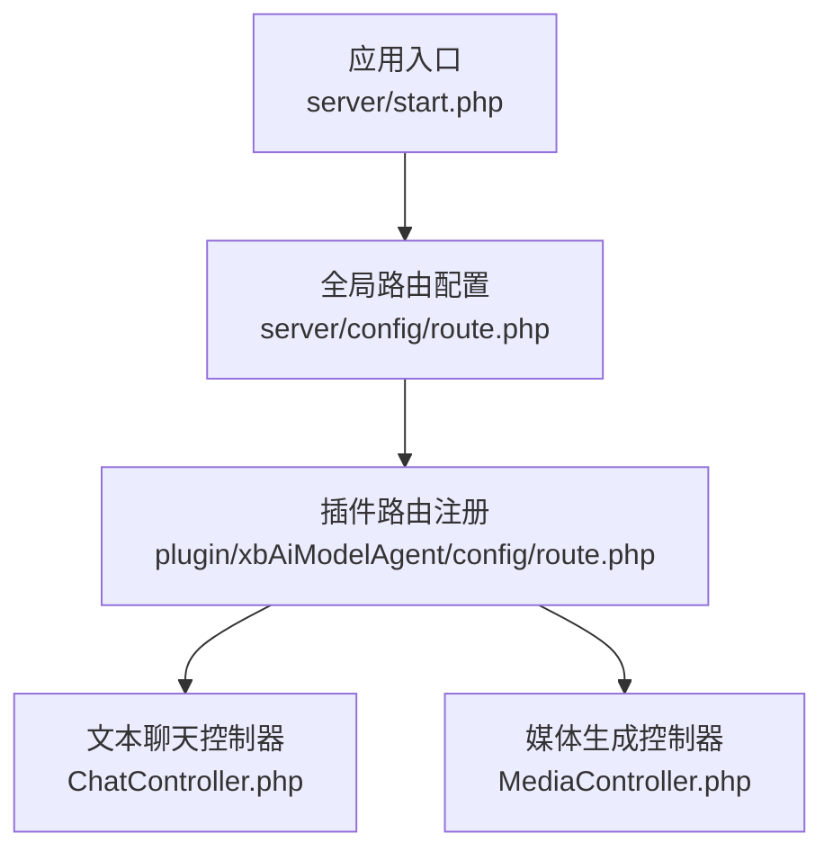
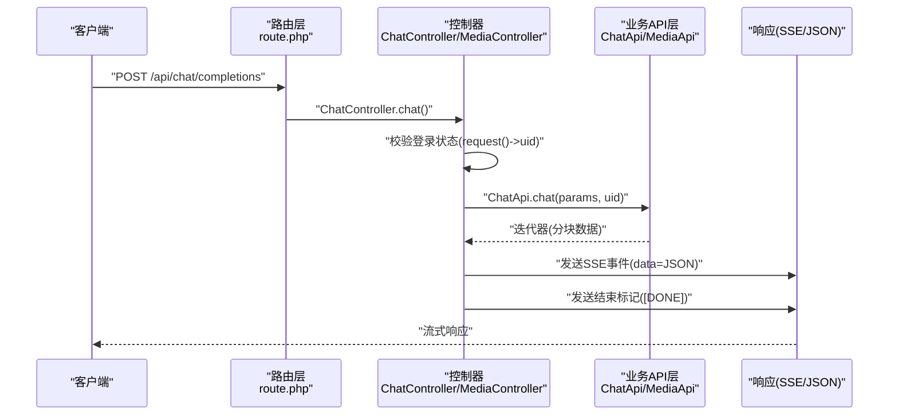
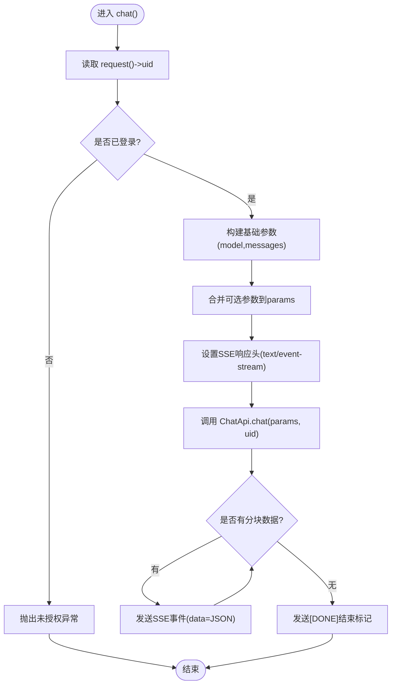
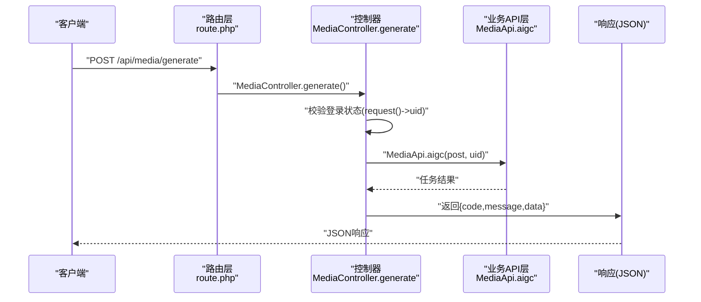
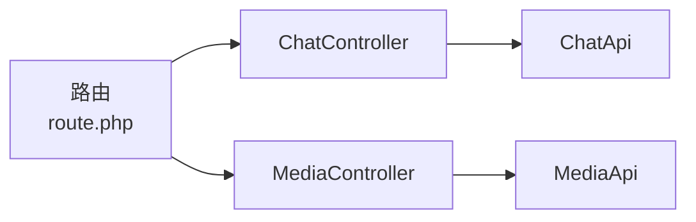

# 插件API设计

<cite>
**本文引用的文件**   
- [server/start.php](file://server/start.php)
- [server/config/route.php](file://server/config/route.php)
- [server/plugin/xbAiModelAgent/config/route.php](file://server/plugin/xbAiModelAgent/config/route.php)
- [server/plugin/xbAiModelAgent/app/api/controller/ChatController.php](file://server/plugin/xbAiModelAgent/app/api/controller/ChatController.php)
- [server/plugin/xbAiModelAgent/app/api/controller/MediaController.php](file://server/plugin/xbAiModelAgent/app/api/controller/MediaController.php)
</cite>

## 目录
1. [简介](#简介)
2. [项目结构](#项目结构)
3. [核心组件](#核心组件)
4. [架构总览](#架构总览)
5. [详细组件分析](#详细组件分析)
6. [依赖关系分析](#依赖关系分析)
7. [性能考虑](#性能考虑)
8. [故障排查指南](#故障排查指南)
9. [结论](#结论)
10. [附录](#附录)

## 简介
本指南面向“积木云AI创作平台”的插件API设计与实现，聚焦以下目标：
- RESTful API设计规范、URL路由约定、请求与响应格式、错误码标准
- 认证授权机制、参数验证规则、数据格式转换与分页处理
- WebSocket/SSE实时接口设计与连接管理
- API版本控制策略、向后兼容性与废弃接口处理
- API文档自动生成、测试用例编写与性能优化建议

说明：本文所有具体实现细节均基于仓库中实际代码进行分析与总结。

## 项目结构
本项目采用Webman框架，应用入口位于 server/start.php；全局路由定义在 server/config/route.php；各插件通过自身 config/route.php 注册路由。当前已实现的AI相关插件为 xbAiModelAgent，其路由集中在 plugin/xbAiModelAgent/config/route.php，控制器位于 app/api/controller 下。

图示来源
- [server/start.php:1-6](file://server/start.php#L1-L6)
- [server/config/route.php:1-22](file://server/config/route.php#L1-L22)
- [server/plugin/xbAiModelAgent/config/route.php:1-13](file://server/plugin/xbAiModelAgent/config/route.php#L1-L13)

章节来源
- [server/start.php:1-6](file://server/start.php#L1-L6)
- [server/config/route.php:1-22](file://server/config/route.php#L1-L22)
- [server/plugin/xbAiModelAgent/config/route.php:1-13](file://server/plugin/xbAiModelAgent/config/route.php#L1-L13)

## 核心组件
- 文本聊天接口（SSE流式）
  - 路由：POST /api/chat/completions
  - 控制器：ChatController.chat
  - 能力：支持多轮对话、可选采样参数、工具调用、结构化输出等
- 媒体生成接口（异步任务）
  - 路由：POST /api/media/generate
  - 控制器：MediaController.generate
  - 能力：图片/音频/视频等多模态生成任务创建

章节来源
- [server/plugin/xbAiModelAgent/config/route.php:8-13](file://server/plugin/xbAiModelAgent/config/route.php#L8-L13)
- [server/plugin/xbAiModelAgent/app/api/controller/ChatController.php:24-116](file://server/plugin/xbAiModelAgent/app/api/controller/ChatController.php#L24-L116)
- [server/plugin/xbAiModelAgent/app/api/controller/MediaController.php:89-99](file://server/plugin/xbAiModelAgent/app/api/controller/MediaController.php#L89-L99)

## 架构总览
整体流程：客户端发起HTTP请求 → Webman路由分发至插件控制器 → 控制器进行鉴权与参数组装 → 调用业务API层（如 ChatApi/MediaApi）→ 返回JSON或SSE事件流。

图示来源
- [server/plugin/xbAiModelAgent/config/route.php:8-13](file://server/plugin/xbAiModelAgent/config/route.php#L8-L13)
- [server/plugin/xbAiModelAgent/app/api/controller/ChatController.php:46-114](file://server/plugin/xbAiModelAgent/app/api/controller/ChatController.php#L46-L114)

## 详细组件分析

### 文本聊天接口（SSE流式）
- 路由与方法
  - POST /api/chat/completions
- 请求体字段（示例）
  - model: string，必填
  - messages: array，必填，元素包含 role/content
  - temperature/top_p/n/max_tokens/max_completion_tokens/stop/presence_penalty/frequency_penalty/user/tools/tool_choice/response_format/seed/reasoning_effort 等可选
- 响应格式
  - Content-Type: text/event-stream
  - 事件内容 data: JSON对象（增量片段），结束时发送 data=[DONE]
- 认证与鉴权
  - 从 request()->uid 获取用户ID，未登录抛出未授权异常
- 错误处理
  - 捕获异常后以SSE事件返回 error.message，并发送[DONE]结束

图示来源
- [server/plugin/xbAiModelAgent/app/api/controller/ChatController.php:46-114](file://server/plugin/xbAiModelAgent/app/api/controller/ChatController.php#L46-L114)

章节来源
- [server/plugin/xbAiModelAgent/app/api/controller/ChatController.php:24-116](file://server/plugin/xbAiModelAgent/app/api/controller/ChatController.php#L24-L116)

### 媒体生成接口（异步任务）
- 路由与方法
  - POST /api/media/generate
- 请求体字段（示例）
  - model_id: string，必填
  - prompt: string，必填
  - width/height/duration/negative_prompt/reference_image_urls 等按模态不同而不同
- 响应格式
  - JSON，包含 code/message/data
- 认证与鉴权
  - 从 request()->uid 获取用户ID，未登录抛出未授权异常
- 业务处理
  - 调用 MediaApi.aigc(post, uid)，返回统一成功响应

图示来源
- [server/plugin/xbAiModelAgent/config/route.php:11-13](file://server/plugin/xbAiModelAgent/config/route.php#L11-L13)
- [server/plugin/xbAiModelAgent/app/api/controller/MediaController.php:89-99](file://server/plugin/xbAiModelAgent/app/api/controller/MediaController.php#L89-L99)

章节来源
- [server/plugin/xbAiModelAgent/app/api/controller/MediaController.php:22-100](file://server/plugin/xbAiModelAgent/app/api/controller/MediaController.php#L22-L100)

### 认证与授权机制
- 认证方式
  - 通过 request()->uid 判断是否已登录，未登录则抛出未授权异常
- 建议扩展
  - 可在中间件层统一解析Token并注入uid，便于跨插件复用

章节来源
- [server/plugin/xbAiModelAgent/app/api/controller/ChatController.php:48-56](file://server/plugin/xbAiModelAgent/app/api/controller/ChatController.php#L48-L56)
- [server/plugin/xbAiModelAgent/app/api/controller/MediaController.php:91-95](file://server/plugin/xbAiModelAgent/app/api/controller/MediaController.php#L91-L95)

### 参数验证与数据格式
- 必填字段
  - 文本聊天：model、messages
  - 媒体生成：model_id、prompt
- 可选字段
  - 文本聊天：temperature、top_p、n、max_tokens、max_completion_tokens、stop、presence_penalty、frequency_penalty、user、tools、tool_choice、response_format、seed、reasoning_effort
  - 媒体生成：width、height、duration、negative_prompt、reference_image_urls 等
- 数据格式
  - 文本聊天：JSON请求体，SSE事件data为JSON字符串
  - 媒体生成：表单/JSON混合（根据注解ParamType(formdata)），返回JSON

章节来源
- [server/plugin/xbAiModelAgent/app/api/controller/ChatController.php:26-45](file://server/plugin/xbAiModelAgent/app/api/controller/ChatController.php#L26-L45)
- [server/plugin/xbAiModelAgent/app/api/controller/MediaController.php:25-77](file://server/plugin/xbAiModelAgent/app/api/controller/MediaController.php#L25-L77)

### 分页处理
- 现状
  - 当前插件未实现分页逻辑
- 建议
  - 列表接口统一使用 page/page_size 或 cursor 分页
  - 响应体包含 total/has_more 等元信息

[本节为通用建议，不直接分析具体文件]

### 实时接口与消息协议（SSE）
- 协议
  - Content-Type: text/event-stream
  - 事件格式：data=JSON，结束标记 data=[DONE]
- 连接管理
  - 服务端逐块推送，客户端需处理断线重连与乱序容错

章节来源
- [server/plugin/xbAiModelAgent/app/api/controller/ChatController.php:87-111](file://server/plugin/xbAiModelAgent/app/api/controller/ChatController.php#L87-L111)

### API版本控制与兼容性
- 现状
  - 当前路由未显式包含版本前缀
- 建议
  - 采用URL路径版本化：/v1/api/...
  - 对废弃接口提供弃用响应头与过渡期兼容
  - 变更遵循语义化版本，保持向后兼容

[本节为通用建议，不直接分析具体文件]

### 文档自动生成
- 现状
  - 控制器使用 Apidoc 注解描述接口，可集成 hg/apidoc 生成文档
- 建议
  - 完善每个接口的 Title/Method/Param/Returned 注解
  - 将文档站点纳入CI流水线自动发布

章节来源
- [server/plugin/xbAiModelAgent/app/api/controller/ChatController.php:26-45](file://server/plugin/xbAiModelAgent/app/api/controller/ChatController.php#L26-L45)
- [server/plugin/xbAiModelAgent/app/api/controller/MediaController.php:25-77](file://server/plugin/xbAiModelAgent/app/api/controller/MediaController.php#L25-L77)

### 测试用例编写
- 建议
  - 单元测试：覆盖参数校验、鉴权失败、异常分支
  - 集成测试：端到端调用SSE与JSON接口，校验事件序列与结束标记
  - 契约测试：基于Apipost/Postman集合或OpenAPI规范进行回归

[本节为通用建议，不直接分析具体文件]

## 依赖关系分析
- 路由到控制器映射
  - /api/chat/completions → ChatController.chat
  - /api/media/generate → MediaController.generate
- 控制器到业务层
  - ChatController → ChatApi
  - MediaController → MediaApi

图示来源
- [server/plugin/xbAiModelAgent/config/route.php:8-13](file://server/plugin/xbAiModelAgent/config/route.php#L8-L13)
- [server/plugin/xbAiModelAgent/app/api/controller/ChatController.php:96-96](file://server/plugin/xbAiModelAgent/app/api/controller/ChatController.php#L96-L96)
- [server/plugin/xbAiModelAgent/app/api/controller/MediaController.php:96-96](file://server/plugin/xbAiModelAgent/app/api/controller/MediaController.php#L96-L96)

章节来源
- [server/plugin/xbAiModelAgent/config/route.php:8-13](file://server/plugin/xbAiModelAgent/config/route.php#L8-L13)

## 性能考虑
- SSE流式传输
  - 避免缓冲：确保响应头禁用代理缓冲
  - 合理分块：上游模型返回粒度适中，降低延迟
- 鉴权与参数校验
  - 前置中间件完成鉴权，减少控制器内重复逻辑
- 并发与资源
  - 长连接需限制单用户并发数，防止资源耗尽
  - 媒体生成走队列/异步任务，避免阻塞HTTP线程

[本节为通用建议，不直接分析具体文件]

## 故障排查指南
- 未登录访问
  - 现象：返回未授权异常
  - 定位：检查 request()->uid 是否正确注入
- SSE中断
  - 现象：客户端无法收到[DONE]或中途断开
  - 定位：检查网络代理是否缓存或缓冲SSE响应
- 参数缺失
  - 现象：业务层报错或返回空结果
  - 定位：核对必填字段与类型约束

章节来源
- [server/plugin/xbAiModelAgent/app/api/controller/ChatController.php:54-56](file://server/plugin/xbAiModelAgent/app/api/controller/ChatController.php#L54-L56)
- [server/plugin/xbAiModelAgent/app/api/controller/MediaController.php:93-95](file://server/plugin/xbAiModelAgent/app/api/controller/MediaController.php#L93-L95)
- [server/plugin/xbAiModelAgent/app/api/controller/ChatController.php:87-93](file://server/plugin/xbAiModelAgent/app/api/controller/ChatController.php#L87-L93)

## 结论
当前插件已实现文本聊天的SSE流式接口与媒体生成的异步任务接口，具备清晰的鉴权与错误处理基础。建议在后续迭代中补充版本化路由、统一参数校验、分页与更完善的文档与测试体系，以提升可维护性与可扩展性。

## 附录
- 关键实现位置参考
  - 应用入口：[server/start.php:1-6](file://server/start.php#L1-L6)
  - 全局路由：[server/config/route.php:1-22](file://server/config/route.php#L1-L22)
  - 插件路由：[server/plugin/xbAiModelAgent/config/route.php:1-13](file://server/plugin/xbAiModelAgent/config/route.php#L1-L13)
  - 文本聊天控制器：[server/plugin/xbAiModelAgent/app/api/controller/ChatController.php:24-116](file://server/plugin/xbAiModelAgent/app/api/controller/ChatController.php#L24-L116)
  - 媒体生成控制器：[server/plugin/xbAiModelAgent/app/api/controller/MediaController.php:22-100](file://server/plugin/xbAiModelAgent/app/api/controller/MediaController.php#L22-L100)