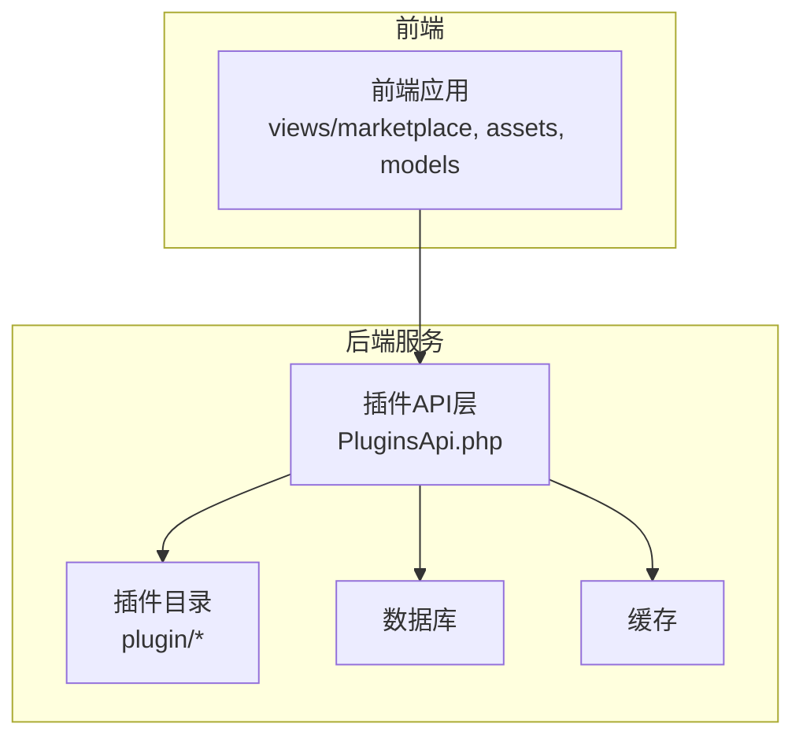
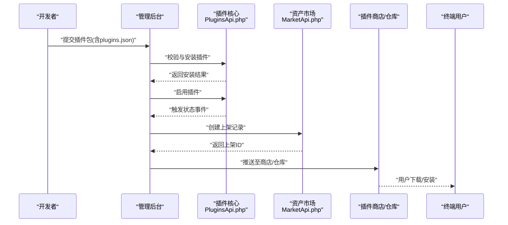
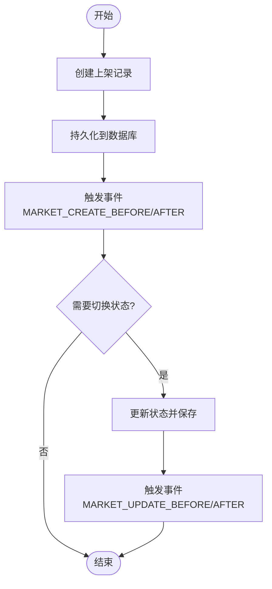
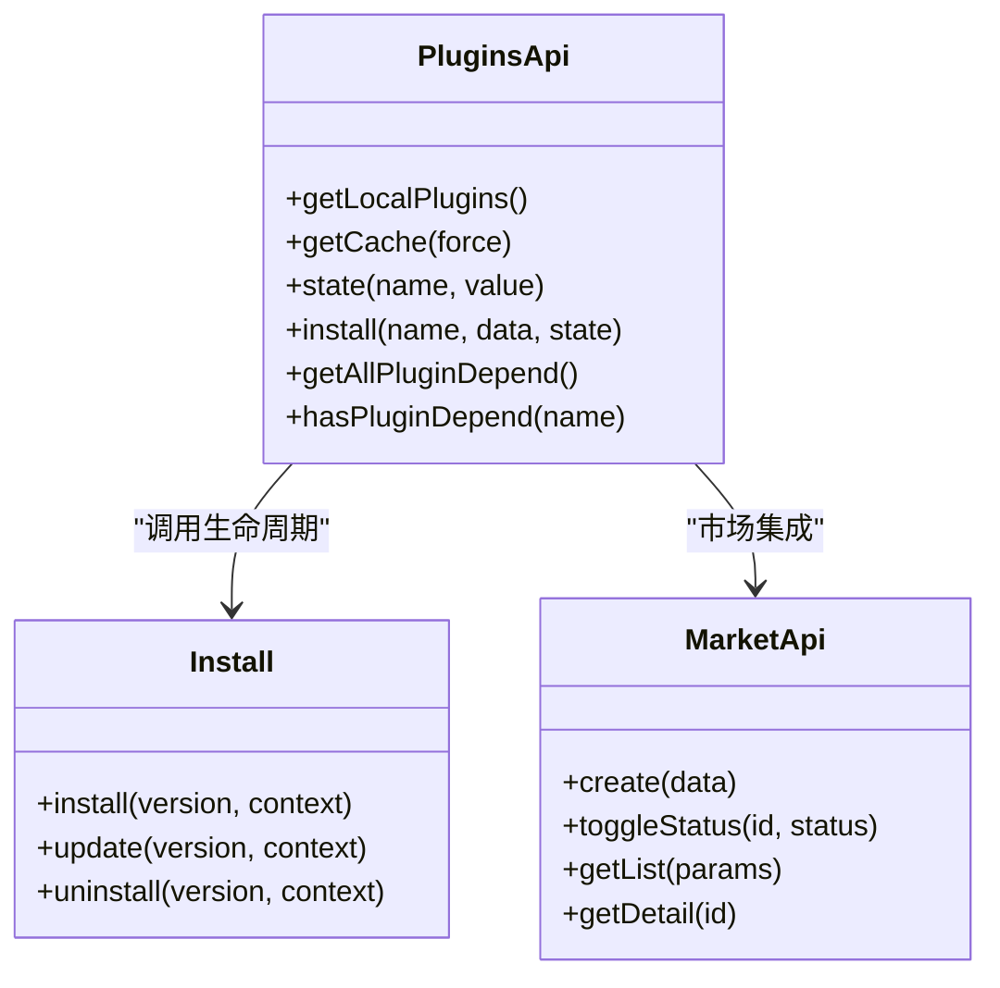

# 插件发布部署

<cite>
**本文引用的文件**   
- [server/plugin/xbCode/api/PluginsApi.php](file://server/plugin/xbCode/api/PluginsApi.php)
- [server/plugin/xbAiAsset/plugins.json](file://server/plugin/xbAiAsset/plugins.json)
- [server/plugin/xbAiModelAgent/plugins.json](file://server/plugin/xbAiModelAgent/plugins.json)
- [server/plugin/xbCode/plugins.json](file://server/plugin/xbCode/plugins.json)
- [server/plugin/xbDeveloper/README.md](file://server/plugin/xbDeveloper/README.md)
- [server/plugin/xbAiAsset/api/MarketApi.php](file://server/plugin/xbAiAsset/api/MarketApi.php)
- [server/plugin/xbAiAsset/api/Install.php](file://server/plugin/xbAiAsset/api/Install.php)
</cite>

## 目录
1. [简介](#简介)
2. [项目结构](#项目结构)
3. [核心组件](#核心组件)
4. [架构总览](#架构总览)
5. [详细组件分析](#详细组件分析)
6. [依赖分析](#依赖分析)
7. [性能考虑](#性能考虑)
8. [故障排查指南](#故障排查指南)
9. [结论](#结论)
10. [附录](#附录)

## 简介
本指南面向积木云AI创作平台的插件开发者与运维人员，围绕“打包规范、版本标签管理、依赖声明与元数据配置、上传与审核分发、生产部署与优化、监控告警与日志、安全扫描与性能测试、兼容性验证、商店发布规范、用户手册编写与售后支持”等全链路流程进行系统化说明。文档以仓库中实际实现为依据，结合可视化图示帮助快速理解并落地执行。

## 项目结构
本项目采用前后端分离与插件化架构：
- 前端（Vue）提供市场、资产、模型等页面能力
- 后端（Webman + ThinkORM）通过插件机制扩展功能，插件统一位于 server/plugin 下
- 每个插件包含 plugins.json 元数据、api 安装/卸载入口、app 业务逻辑、config 配置、enum 枚举、public 静态资源等

图表来源
- [server/plugin/xbCode/api/PluginsApi.php:76-136](file://server/plugin/xbCode/api/PluginsApi.php#L76-L136)

章节来源
- [server/plugin/xbCode/api/PluginsApi.php:76-136](file://server/plugin/xbCode/api/PluginsApi.php#L76-L136)

## 核心组件
- 插件元数据与清单解析：plugins.json 作为插件描述与依赖声明的核心文件，被系统统一扫描与校验
- 插件生命周期管理：安装、启用/禁用、卸载、更新由 PluginsApi 与 Install 类协同完成
- 插件市场上架：xbAiAsset 插件提供 MarketApi 用于素材/资产的上架、状态切换、详情浏览等
- 开发辅助：xbDeveloper 提供创建、克隆、导出、安装、更新的命令行与后台界面

章节来源
- [server/plugin/xbCode/api/PluginsApi.php:337-548](file://server/plugin/xbCode/api/PluginsApi.php#L337-L548)
- [server/plugin/xbAiAsset/api/MarketApi.php:22-191](file://server/plugin/xbAiAsset/api/MarketApi.php#L22-L191)
- [server/plugin/xbAiAsset/api/Install.php:19-62](file://server/plugin/xbAiAsset/api/Install.php#L19-L62)
- [server/plugin/xbDeveloper/README.md:1-102](file://server/plugin/xbDeveloper/README.md#L1-L102)

## 架构总览
下图展示插件从本地到市场的端到端流程：开发者准备插件包 -> 平台校验与安装 -> 启用后进入市场 -> 审核通过后对外分发。

图表来源
- [server/plugin/xbCode/api/PluginsApi.php:608-625](file://server/plugin/xbCode/api/PluginsApi.php#L608-L625)
- [server/plugin/xbCode/api/PluginsApi.php:578-598](file://server/plugin/xbCode/api/PluginsApi.php#L578-L598)
- [server/plugin/xbAiAsset/api/MarketApi.php:94-111](file://server/plugin/xbAiAsset/api/MarketApi.php#L94-L111)

## 详细组件分析

### 插件元数据与打包规范
- 元数据文件：每个插件根目录必须包含 plugins.json，字段至少包括 title、version、author、desc；可选 home_url、composer、plugins 等
- 预览图：插件根目录需包含 preview.svg，否则在获取插件信息时会抛出异常
- README：支持 readme.md 或 README.md，系统会优先读取其一并标记 has_readme
- 包格式：上传的插件包必须是 zip 格式，且内部必须包含 plugins.json

关键校验点
- 包存在性与类型校验
- 压缩包内必须包含 plugins.json
- 必填字段校验（title、version、author），desc 为空时默认空字符串
- 预览图存在性校验

章节来源
- [server/plugin/xbCode/api/PluginsApi.php:411-462](file://server/plugin/xbCode/api/PluginsApi.php#L411-L462)
- [server/plugin/xbCode/api/PluginsApi.php:484-548](file://server/plugin/xbCode/api/PluginsApi.php#L484-L548)

示例元数据参考
- [server/plugin/xbAiAsset/plugins.json:1-9](file://server/plugin/xbAiAsset/plugins.json#L1-L9)
- [server/plugin/xbAiModelAgent/plugins.json:1-9](file://server/plugin/xbAiModelAgent/plugins.json#L1-L9)
- [server/plugin/xbCode/plugins.json:1-34](file://server/plugin/xbCode/plugins.json#L1-L34)

### 版本标签管理与变更控制
- 版本号：plugins.json 中的 version 字段为插件版本标识，建议遵循语义化版本（主.次.修订）
- 安装/更新/卸载：插件需提供 api/Install.php，继承基础类并提供 install/update/uninstall 方法，便于系统调用
- 变更记录：建议在插件根目录维护 update.sql 或变更脚本，配合 update 钩子执行

章节来源
- [server/plugin/xbAiAsset/api/Install.php:29-62](file://server/plugin/xbAiAsset/api/Install.php#L29-L62)
- [server/plugin/xbDeveloper/README.md:28-46](file://server/plugin/xbDeveloper/README.md#L28-L46)

### 依赖声明与解析
- 插件间依赖：plugins.json 中的 plugins 字段声明对其他插件的依赖，系统可检测是否已安装及是否存在子依赖
- 第三方库依赖：plugins.json 中的 composer 字段声明 PHP 包依赖，键为命名空间或类名，值为 composer 包名与版本约束
- 依赖列表解析：系统会将 plugins 与 composer 转为数组列表，供安装前检查与提示

章节来源
- [server/plugin/xbCode/api/PluginsApi.php:512-517](file://server/plugin/xbCode/api/PluginsApi.php#L512-L517)
- [server/plugin/xbCode/api/PluginsApi.php:633-684](file://server/plugin/xbCode/api/PluginsApi.php#L633-L684)
- [server/plugin/xbCode/plugins.json:7-32](file://server/plugin/xbCode/plugins.json#L7-L32)

### 插件市场上传、审核与分发
- 上架接口：MarketApi 提供 create/getList/getDetail/toggleStatus/delete 等方法，用于管理上架记录与状态
- 状态流转：上架记录包含 status 字段，支持切换上下架状态，并在更新前后触发事件
- 分发机制：上架成功后，可将制品推送至插件商店/仓库，供用户检索与安装

图表来源
- [server/plugin/xbAiAsset/api/MarketApi.php:94-111](file://server/plugin/xbAiAsset/api/MarketApi.php#L94-L111)
- [server/plugin/xbAiAsset/api/MarketApi.php:170-189](file://server/plugin/xbAiAsset/api/MarketApi.php#L170-L189)

章节来源
- [server/plugin/xbAiAsset/api/MarketApi.php:47-87](file://server/plugin/xbAiAsset/api/MarketApi.php#L47-87)
- [server/plugin/xbAiAsset/api/MarketApi.php:119-137](file://server/plugin/xbAiAsset/api/MarketApi.php#L119-L137)
- [server/plugin/xbAiAsset/api/MarketApi.php:144-162](file://server/plugin/xbAiAsset/api/MarketApi.php#L144-L162)

### 生产环境部署与配置优化
- 插件发现：系统通过 glob 扫描 plugin/*/plugins.json 发现所有插件
- 缓存策略：插件列表使用缓存键 xb-plugins-list，减少重复 IO 与解析开销
- 状态事件：启用/禁用插件时触发 xbCode.Plugins.state 事件，可用于热重载或通知
- 配置项：插件可通过 api/Install.php 暴露 config() 方法，系统动态加载

章节来源
- [server/plugin/xbCode/api/PluginsApi.php:76-93](file://server/plugin/xbCode/api/PluginsApi.php#L76-L93)
- [server/plugin/xbCode/api/PluginsApi.php:144-153](file://server/plugin/xbCode/api/PluginsApi.php#L144-L153)
- [server/plugin/xbCode/api/PluginsApi.php:594-598](file://server/plugin/xbCode/api/PluginsApi.php#L594-L598)
- [server/plugin/xbCode/api/PluginsApi.php:205-221](file://server/plugin/xbCode/api/PluginsApi.php#L205-L221)

### 监控告警与日志收集
- 调试日志：当 Debug 模式开启时，插件信息获取异常会被记录到日志
- 事件驱动：插件状态变化、市场操作均触发事件，可作为监控埋点来源
- 建议：将关键事件写入结构化日志，接入集中式日志系统，设置阈值告警

章节来源
- [server/plugin/xbCode/api/PluginsApi.php:350-355](file://server/plugin/xbCode/api/PluginsApi.php#L350-L355)
- [server/plugin/xbCode/api/PluginsApi.php:594-598](file://server/plugin/xbCode/api/PluginsApi.php#L594-L598)

### 安全扫描、性能测试与兼容性验证
- 安全扫描：对上传的 zip 包进行白名单校验（仅允许 zip）、内容完整性校验（必须包含 plugins.json）
- 性能测试：关注插件列表缓存命中率、数据库查询分页、事件处理耗时
- 兼容性验证：确保插件依赖的 PHP 版本、扩展、第三方包满足要求；避免破坏性升级

章节来源
- [server/plugin/xbCode/api/PluginsApi.php:411-462](file://server/plugin/xbCode/api/PluginsApi.php#L411-L462)
- [server/plugin/xbCode/api/PluginsApi.php:144-153](file://server/plugin/xbCode/api/PluginsApi.php#L144-L153)

### 插件商店发布规范、用户手册与售后支持
- 发布规范：
  - 插件根目录包含 plugins.json、preview.svg、README.md/readme.md
  - 版本号遵循语义化版本，作者与描述清晰准确
  - 依赖声明完整，避免运行时缺失
- 用户手册：
  - 提供安装步骤、配置项说明、常见问题与回滚方案
  - 使用 xbDeveloper 提供的 CLI/GUI 工具生成与维护文档
- 售后服务：
  - 建立问题反馈渠道，收集错误日志与复现步骤
  - 定期发布补丁版本，保持向后兼容

章节来源
- [server/plugin/xbDeveloper/README.md:28-46](file://server/plugin/xbDeveloper/README.md#L28-L46)
- [server/plugin/xbCode/api/PluginsApi.php:557-567](file://server/plugin/xbCode/api/PluginsApi.php#L557-L567)

## 依赖分析
- 插件间依赖：通过 plugins.json 的 plugins 字段声明，系统可检测是否已安装以及是否存在子依赖冲突
- 第三方依赖：通过 composer 字段声明，安装时可自动拉取对应包
- 系统保护：内置系统插件集合，禁止随意操作

图表来源
- [server/plugin/xbCode/api/PluginsApi.php:76-136](file://server/plugin/xbCode/api/PluginsApi.php#L76-L136)
- [server/plugin/xbCode/api/PluginsApi.php:578-598](file://server/plugin/xbCode/api/PluginsApi.php#L578-L598)
- [server/plugin/xbAiAsset/api/MarketApi.php:94-111](file://server/plugin/xbAiAsset/api/MarketApi.php#L94-L111)
- [server/plugin/xbAiAsset/api/Install.php:29-62](file://server/plugin/xbAiAsset/api/Install.php#L29-L62)

章节来源
- [server/plugin/xbCode/api/PluginsApi.php:633-684](file://server/plugin/xbCode/api/PluginsApi.php#L633-L684)
- [server/plugin/xbCode/api/PluginsApi.php:40-45](file://server/plugin/xbCode/api/PluginsApi.php#L40-L45)

## 性能考虑
- 列表缓存：插件列表通过缓存键存储，避免频繁 IO 与 JSON 解析
- 分页查询：市场列表使用分页，降低大数据量下的内存占用
- 事件解耦：通过事件驱动减少同步阻塞，提升吞吐
- 建议：合理设置缓存过期时间，监控缓存命中率与事件队列堆积情况

章节来源
- [server/plugin/xbCode/api/PluginsApi.php:144-153](file://server/plugin/xbCode/api/PluginsApi.php#L144-L153)
- [server/plugin/xbAiAsset/api/MarketApi.php:47-69](file://server/plugin/xbAiAsset/api/MarketApi.php#L47-69)

## 故障排查指南
- 插件不存在或信息为空：检查插件路径与 plugins.json 内容
- 预览图缺失：确认插件根目录包含 preview.svg
- 包格式错误：确保上传的是 zip 包
- 依赖未满足：根据提示先安装或卸载相关插件
- 状态设置失败：检查数据库连接与权限，查看日志输出

章节来源
- [server/plugin/xbCode/api/PluginsApi.php:484-548](file://server/plugin/xbCode/api/PluginsApi.php#L484-L548)
- [server/plugin/xbCode/api/PluginsApi.php:411-462](file://server/plugin/xbCode/api/PluginsApi.php#L411-L462)
- [server/plugin/xbCode/api/PluginsApi.php:578-598](file://server/plugin/xbCode/api/PluginsApi.php#L578-L598)

## 结论
通过统一的插件元数据规范、严格的包校验与依赖解析、完善的市场上架流程与事件驱动机制，积木云AI创作平台实现了插件的全生命周期管理与高效分发。在生产环境中，结合缓存、日志与监控，可保障系统的稳定性与可观测性。建议持续完善安全扫描、性能基准与兼容性矩阵，以提升整体质量与用户体验。

## 附录
- 插件清单字段建议：
  - 必填：title、version、author、desc
  - 可选：home_url、composer、plugins、readme、preview
- 版本策略：
  - 主版本：不兼容变更
  - 次版本：向后兼容的新特性
  - 修订：向后兼容的问题修复
- 发布清单：
  - plugins.json、preview.svg、README.md/readme.md、install.sql/update.sql（如有）
  - 依赖声明完整，无敏感信息与硬编码密钥