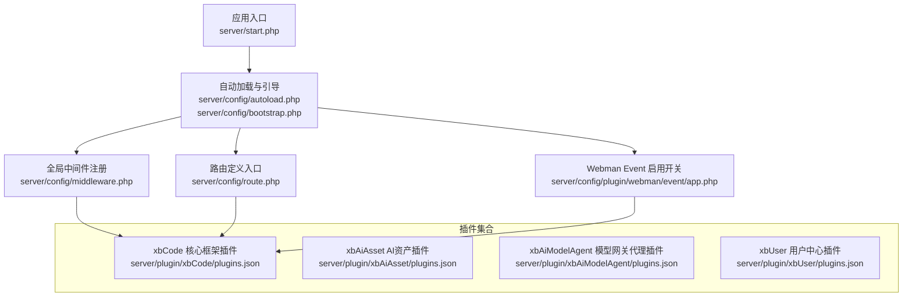
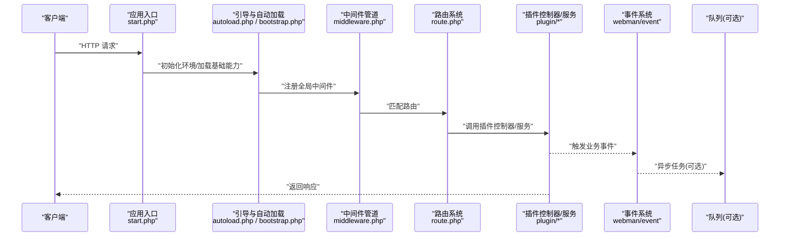
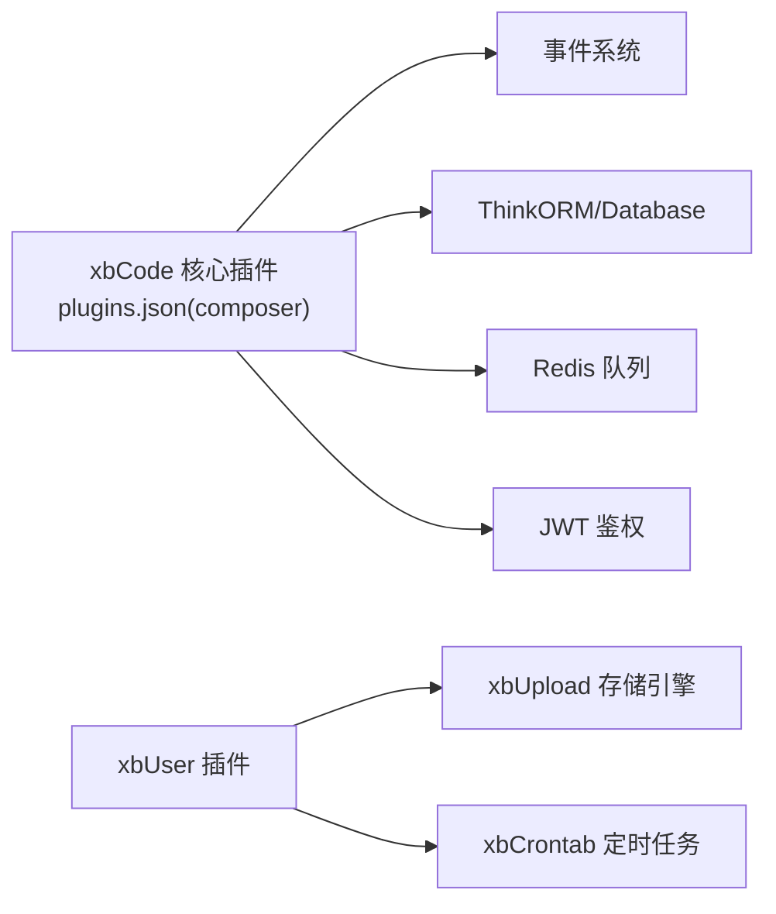

# 插件开发指南

<cite>
**本文引用的文件**   
- [start.php](file://server/start.php)
- [config/autoload.php](file://server/config/autoload.php)
- [config/bootstrap.php](file://server/config/bootstrap.php)
- [config/middleware.php](file://server/config/middleware.php)
- [config/route.php](file://server/config/route.php)
- [config/plugin/webman/event/app.php](file://server/config/plugin/webman/event/app.php)
- [plugin/xbCode/plugins.json](file://server/plugin/xbCode/plugins.json)
- [plugin/xbAiAsset/plugins.json](file://server/plugin/xbAiAsset/plugins.json)
- [plugin/xbAiModelAgent/plugins.json](file://server/plugin/xbAiModelAgent/plugins.json)
- [plugin/xbUser/plugins.json](file://server/plugin/xbUser/plugins.json)
</cite>

## 目录
1. [简介](#简介)
2. [项目结构](#项目结构)
3. [核心组件](#核心组件)
4. [架构总览](#架构总览)
5. [详细组件分析](#详细组件分析)
6. [依赖分析](#依赖分析)
7. [性能考虑](#性能考虑)
8. [故障排查指南](#故障排查指南)
9. [结论](#结论)
10. [附录](#附录)

## 简介
本指南面向希望在积木云AI创作平台上进行插件开发的开发者，系统阐述基于 Webman 的插件化架构、插件生命周期管理、API 钩子与事件总线机制、中间件管道、插件目录结构与配置规范、控制器与服务层实现、数据库迁移与静态资源管理，并提供完整的开发示例、调试测试方法与发布部署流程。读者无需深入底层即可快速上手，同时为高级定制提供扩展点说明。

## 项目结构
服务器端采用 Webman 框架，插件位于 server/plugin 目录下，每个插件以独立目录组织，包含 api、app、config、public、enum、service、setting、data、skills 等标准目录；根级配置文件位于 server/config，应用入口在 server/start.php。

图表来源
- [start.php:1-6](file://server/start.php#L1-L6)
- [config/autoload.php:15-21](file://server/config/autoload.php#L15-L21)
- [config/bootstrap.php:15-18](file://server/config/bootstrap.php#L15-L18)
- [config/middleware.php:1-12](file://server/config/middleware.php#L1-L12)
- [config/route.php:1-22](file://server/config/route.php#L1-L22)
- [config/plugin/webman/event/app.php:1-4](file://server/config/plugin/webman/event/app.php#L1-L4)
- [plugin/xbCode/plugins.json:1-34](file://server/plugin/xbCode/plugins.json#L1-L34)
- [plugin/xbAiAsset/plugins.json:1-9](file://server/plugin/xbAiAsset/plugins.json#L1-L9)
- [plugin/xbAiModelAgent/plugins.json:1-9](file://server/plugin/xbAiModelAgent/plugins.json#L1-L9)
- [plugin/xbUser/plugins.json:1-12](file://server/plugin/xbUser/plugins.json#L1-L12)

章节来源
- [start.php:1-6](file://server/start.php#L1-L6)
- [config/autoload.php:15-21](file://server/config/autoload.php#L15-L21)
- [config/bootstrap.php:15-18](file://server/config/bootstrap.php#L15-L18)
- [config/middleware.php:1-12](file://server/config/middleware.php#L1-L12)
- [config/route.php:1-22](file://server/config/route.php#L1-L22)
- [config/plugin/webman/event/app.php:1-4](file://server/config/plugin/webman/event/app.php#L1-L4)
- [plugin/xbCode/plugins.json:1-34](file://server/plugin/xbCode/plugins.json#L1-L34)
- [plugin/xbAiAsset/plugins.json:1-9](file://server/plugin/xbAiAsset/plugins.json#L1-L9)
- [plugin/xbAiModelAgent/plugins.json:1-9](file://server/plugin/xbAiModelAgent/plugins.json#L1-L9)
- [plugin/xbUser/plugins.json:1-12](file://server/plugin/xbUser/plugins.json#L1-L12)

## 核心组件
- 应用启动与引导
  - 入口脚本负责初始化工作目录并加载自动加载器，随后启动支持类应用运行器。
  - 自动加载配置用于引入公共函数与请求响应对象。
  - Bootstrap 阶段注册会话与 ThinkORM 等基础能力。
- 中间件管道
  - 全局中间件通过统一配置注入，典型包括鉴权与插件路由解析等。
- 路由系统
  - 路由入口文件为空模板，实际路由由插件或框架扩展动态注册。
- 事件系统
  - Webman Event 插件通过配置启用，为插件间解耦通信提供基础。
- 插件元数据与依赖
  - 各插件 plugins.json 描述标题、版本、作者、依赖与可选依赖关系，供平台管理与安装使用。

章节来源
- [start.php:1-6](file://server/start.php#L1-L6)
- [config/autoload.php:15-21](file://server/config/autoload.php#L15-L21)
- [config/bootstrap.php:15-18](file://server/config/bootstrap.php#L15-L18)
- [config/middleware.php:1-12](file://server/config/middleware.php#L1-L12)
- [config/route.php:1-22](file://server/config/route.php#L1-L22)
- [config/plugin/webman/event/app.php:1-4](file://server/config/plugin/webman/event/app.php#L1-L4)
- [plugin/xbCode/plugins.json:1-34](file://server/plugin/xbCode/plugins.json#L1-L34)
- [plugin/xbAiAsset/plugins.json:1-9](file://server/plugin/xbAiAsset/plugins.json#L1-L9)
- [plugin/xbAiModelAgent/plugins.json:1-9](file://server/plugin/xbAiModelAgent/plugins.json#L1-L9)
- [plugin/xbUser/plugins.json:1-12](file://server/plugin/xbUser/plugins.json#L1-L12)

## 架构总览
下图展示从请求进入、中间件处理、路由分发到插件控制器与服务层的整体流程，以及事件系统与队列能力的集成位置。

图表来源
- [start.php:1-6](file://server/start.php#L1-L6)
- [config/autoload.php:15-21](file://server/config/autoload.php#L15-L21)
- [config/bootstrap.php:15-18](file://server/config/bootstrap.php#L15-L18)
- [config/middleware.php:1-12](file://server/config/middleware.php#L1-L12)
- [config/route.php:1-22](file://server/config/route.php#L1-L22)
- [config/plugin/webman/event/app.php:1-4](file://server/config/plugin/webman/event/app.php#L1-L4)

## 详细组件分析

### 插件目录结构与配置规范
- 推荐目录
  - api：对外 API 接口（如 Install、MarketApi 等）
  - app：控制器、模型、队列处理器、业务逻辑
  - config：插件级配置（app、autoload、container、dict、exception、log、menu、middleware、process、redis、route、static、translation、view、xbcode 等）
  - public：静态资源
  - enum：枚举定义
  - service：服务层封装
  - setting：后台设置项
  - data：数据字典/种子数据
  - skills：技能/提示词模板
- 插件元数据
  - plugins.json 必填字段：title、version、author、desc；可选 home_url、composer、plugins（声明依赖插件）
  - 依赖声明示例：用户插件依赖“储存引擎”和“定时任务”插件
- 配置覆盖与合并
  - 插件 config 下的同名配置可与全局配置合并，具体策略遵循框架约定

章节来源
- [plugin/xbCode/plugins.json:1-34](file://server/plugin/xbCode/plugins.json#L1-L34)
- [plugin/xbAiAsset/plugins.json:1-9](file://server/plugin/xbAiAsset/plugins.json#L1-L9)
- [plugin/xbAiModelAgent/plugins.json:1-9](file://server/plugin/xbAiModelAgent/plugins.json#L1-L9)
- [plugin/xbUser/plugins.json:1-12](file://server/plugin/xbUser/plugins.json#L1-L12)

### 插件生命周期管理
- 安装与初始化
  - 通过插件 api/Install.php 执行数据库迁移、默认数据写入、菜单注册等
- 启停与热重载
  - 结合 process 与 queue 进程，插件可注册自定义进程与消费者
- 卸载与清理
  - 提供卸载钩子清理数据与资源（建议实现）

章节来源
- [plugin/xbAiAsset/api/Install.php](file://server/plugin/xbAiAsset/api/Install.php)
- [plugin/xbAiModelAgent/process/TaskServer.php](file://server/plugin/xbAiModelAgent/process/TaskServer.php)

### API 钩子系统与路由注册
- 路由注册
  - 插件可在自身 config/route.php 中定义路由，或通过框架提供的路由注册方法动态挂载
- 控制器与服务分层
  - 控制器负责参数校验与响应组装，服务层承载核心业务逻辑
- 鉴权与限流
  - 借助全局中间件与插件中间件完成鉴权、签名、限流等横切关注点

章节来源
- [config/middleware.php:1-12](file://server/config/middleware.php#L1-L12)
- [plugin/xbAiAsset/app/api/controller/*.php](file://server/plugin/xbAiAsset/app/api/controller)
- [plugin/xbAiModelAgent/app/api/controller/*.php](file://server/plugin/xbAiModelAgent/app/api/controller)

### 事件总线机制
- 启用与配置
  - 通过 webman/event 插件配置启用事件能力
- 事件发布与监听
  - 业务模块在关键节点发布事件，其他插件订阅处理，实现解耦
- 与队列集成
  - 事件监听器可将耗时操作投递至队列异步执行

章节来源
- [config/plugin/webman/event/app.php:1-4](file://server/config/plugin/webman/event/app.php#L1-L4)
- [plugin/xbAiAsset/app/queue/*.php](file://server/plugin/xbAiAsset/app/queue)
- [plugin/xbAiModelAgent/app/queue/*.php](file://server/plugin/xbAiModelAgent/app/queue)

### 中间件管道
- 全局中间件
  - 在 middleware.php 中注册，按顺序执行，适合做通用鉴权、日志、跨域等
- 插件中间件
  - 插件可定义自身中间件并在其 config/middleware.php 中按需挂载
- 执行顺序与短路
  - 中间件可按需短路后续处理，注意顺序对性能与安全的影响

章节来源
- [config/middleware.php:1-12](file://server/config/middleware.php#L1-L12)
- [plugin/xbCode/app/middleware/XbMiddleware.php](file://server/plugin/xbCode/app/middleware/XbMiddleware.php)
- [plugin/xbCode/app/middleware/PluginMiddleware.php](file://server/plugin/xbCode/app/middleware/PluginMiddleware.php)

### 数据库迁移与静态资源管理
- 数据库迁移
  - 插件 install.sql 定义建表与初始数据，Install.php 中执行迁移
- 静态资源
  - 插件 public 目录资源可通过静态路由或 CDN 暴露
- 视图与模板
  - 插件 view 目录配合模板引擎渲染页面

章节来源
- [plugin/xbAiAsset/install.sql](file://server/plugin/xbAiAsset/install.sql)
- [plugin/xbAiModelAgent/install.sql](file://server/plugin/xbAiModelAgent/install.sql)
- [plugin/xbAiAsset/public/remarks.txt](file://server/plugin/xbAiAsset/public/remarks.txt)
- [plugin/xbAiModelAgent/public/remarks.txt](file://server/plugin/xbAiModelAgent/public/remarks.txt)

### 完整插件开发示例（端到端）
以下以一个“示例插件”为例，演示从零到发布的步骤。该示例仅作为流程参考，不直接引用仓库代码。

- 创建插件骨架
  - 在 server/plugin 下新建 my_plugin 目录
  - 编写 plugins.json，填写 title、version、author、desc、home_url、composer、plugins
- 定义路由与控制器
  - 在 my_plugin/config/route.php 注册路由
  - 在 my_plugin/app/api/controller 实现控制器方法
- 实现服务层
  - 在 my_plugin/app/service 封装业务逻辑
- 注册中间件
  - 在 my_plugin/config/middleware.php 挂载插件中间件
- 事件与队列
  - 在 my_plugin/app/queue 定义消费者，在业务中发布事件
- 数据库迁移
  - 编写 install.sql，在 api/Install.php 中执行
- 静态资源
  - 将前端资源放入 public，并通过静态路由暴露
- 调试与测试
  - 使用本地开发模式，开启详细日志，逐步验证路由、中间件、事件与队列
- 打包与发布
  - 校验 plugins.json 与依赖，生成安装包，上传至市场或私有仓库

[本节为概念性流程说明，未直接分析具体源码文件]

## 依赖分析
- 插件间依赖
  - xbUser 插件声明依赖“储存引擎”与“定时任务”，体现功能组合式扩展
- 第三方依赖
  - xbCode 插件 composer 字段声明了事件、缓存、队列、ORM、控制台、工作流、进程、多会话、验证码、JWT 等依赖，表明核心框架能力边界
- 运行时依赖
  - 应用启动后，bootstrap 阶段加载会话与 ORM，中间件与路由生效

图表来源
- [plugin/xbCode/plugins.json:1-34](file://server/plugin/xbCode/plugins.json#L1-L34)
- [plugin/xbUser/plugins.json:1-12](file://server/plugin/xbUser/plugins.json#L1-L12)

章节来源
- [plugin/xbCode/plugins.json:1-34](file://server/plugin/xbCode/plugins.json#L1-L34)
- [plugin/xbUser/plugins.json:1-12](file://server/plugin/xbUser/plugins.json#L1-L12)

## 性能考虑
- 中间件顺序优化
  - 将轻量且通用的中间件前置，减少不必要的分支判断
- 事件与队列
  - 将耗时操作异步化，避免阻塞主请求链路
- 静态资源
  - 使用 CDN 或反向代理缓存静态资源，降低后端压力
- 数据库访问
  - 合理使用索引与查询条件，避免 N+1 查询

[本节提供通用指导，未直接分析具体源码文件]

## 故障排查指南
- 启动失败
  - 检查入口与自动加载是否成功，确认 vendor 与 autoload 路径正确
- 路由未命中
  - 确认 route.php 是否正确注册，插件路由是否被覆盖
- 中间件异常
  - 检查 middleware.php 注册顺序与异常抛出位置
- 事件未触发
  - 确认 webman/event 已启用，监听器是否正确注册
- 队列无消费
  - 检查队列进程是否启动，消费者类名与通道配置是否正确

章节来源
- [start.php:1-6](file://server/start.php#L1-L6)
- [config/autoload.php:15-21](file://server/config/autoload.php#L15-L21)
- [config/middleware.php:1-12](file://server/config/middleware.php#L1-L12)
- [config/route.php:1-22](file://server/config/route.php#L1-L22)
- [config/plugin/webman/event/app.php:1-4](file://server/config/plugin/webman/event/app.php#L1-L4)

## 结论
本指南基于现有仓库结构梳理出积木云平台的插件化体系：以 Webman 为核心，通过中间件、路由、事件与队列构建可扩展的插件生态。遵循插件目录与配置规范，结合生命周期钩子与依赖声明，可实现高内聚、低耦合的功能扩展。建议在开发过程中重视错误处理、性能优化与文档沉淀，确保插件质量与可维护性。

[本节为总结性内容，未直接分析具体源码文件]

## 附录
- 术语
  - 插件：具备独立目录与配置的模块化功能单元
  - 钩子：在特定生命周期触发的扩展点
  - 事件总线：插件间解耦通信的消息机制
  - 中间件：请求处理链路上的横切逻辑
- 最佳实践
  - 明确插件职责边界，避免过度耦合
  - 使用枚举与常量统一管理状态码与类型
  - 为所有外部依赖提供降级方案
  - 完善日志与监控，便于问题定位

[本节为补充信息，未直接分析具体源码文件]