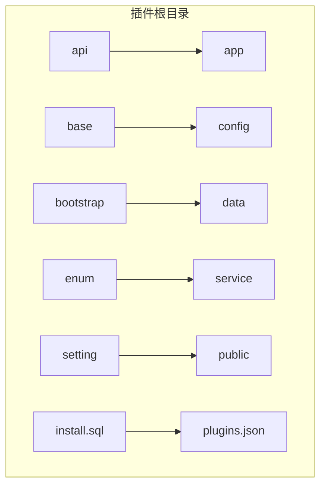
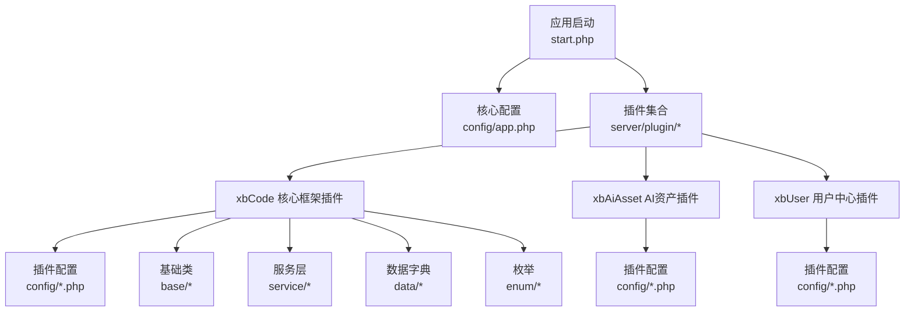
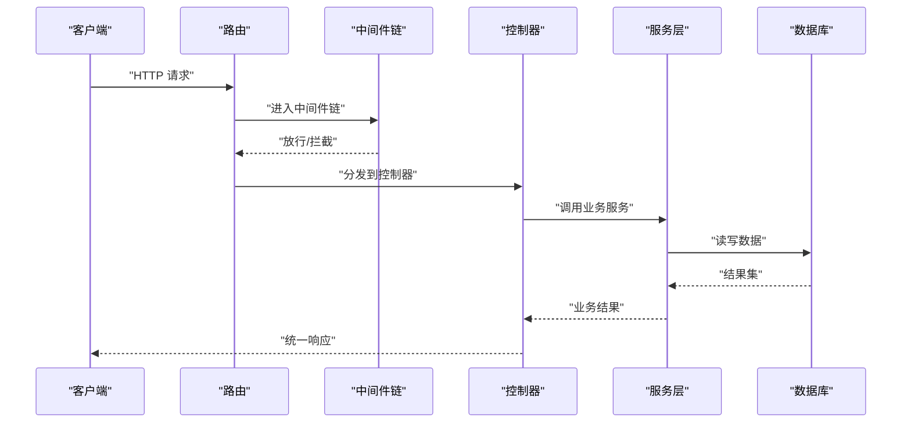
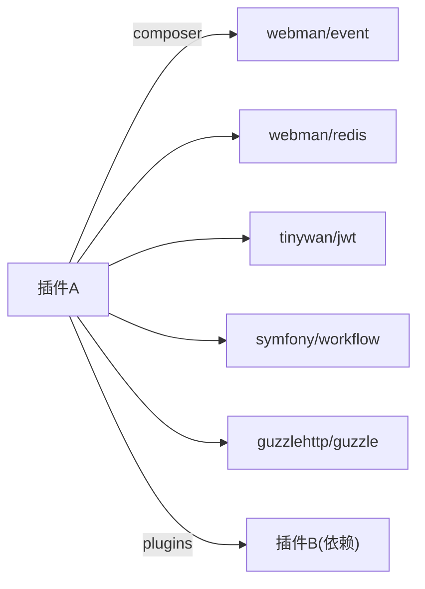

# 插件开发规范

<cite>
**本文引用的文件**   
- [server/start.php](file://server/start.php)
- [server/config/app.php](file://server/config/app.php)
- [server/plugin/xbCode/plugins.json](file://server/plugin/xbCode/plugins.json)
- [server/plugin/xbAiAsset/plugins.json](file://server/plugin/xbAiAsset/plugins.json)
- [server/plugin/xbUser/plugins.json](file://server/plugin/xbUser/plugins.json)
- [server/plugin/xbCode/config/app.php](file://server/plugin/xbCode/config/app.php)
- [server/plugin/xbAiAsset/api/Install.php](file://server/plugin/xbAiAsset/api/Install.php)
- [server/plugin/xbAiModelAgent/api/Install.php](file://server/plugin/xbAiModelAgent/api/Install.php)
- [server/plugin/xbCdKey/api/Install.php](file://server/plugin/xbCdKey/api/Install.php)
- [server/plugin/xbCoupon/api/Install.php](file://server/plugin/xbCoupon/api/Install.php)
- [server/plugin/xbCrontab/api/Install.php](file://server/plugin/xbCrontab/api/Install.php)
- [server/plugin/xbEmail/api/Install.php](file://server/plugin/xbEmail/api/Install.php)
- [server/plugin/xbHelp/api/Install.php](file://server/plugin/xbHelp/api/Install.php)
- [server/plugin/xbMovieApp/api/Install.php](file://server/plugin/xbMovieApp/api/Install.php)
- [server/plugin/xbPromptTemplate/api/Install.php](file://server/plugin/xbPromptTemplate/api/Install.php)
- [server/plugin/xbSms/api/Install.php](file://server/plugin/xbSms/api/Install.php)
- [server/plugin/xbUpload/api/Install.php](file://server/plugin/xbUpload/api/Install.php)
- [server/plugin/xbUserWork/api/Install.php](file://server/plugin/xbUserWork/api/Install.php)
- [server/plugin/xbWebMessage/api/Install.php](file://server/plugin/xbWebMessage/api/Install.php)
- [server/plugin/xbAiAsset/install.sql](file://server/plugin/xbAiAsset/install.sql)
- [server/plugin/xbAiModelAgent/install.sql](file://server/plugin/xbAiModelAgent/install.sql)
- [server/plugin/xbCdKey/install.sql](file://server/plugin/xbCdKey/install.sql)
- [server/plugin/xbCoupon/install.sql](file://server/plugin/xbCoupon/install.sql)
- [server/plugin/xbCrontab/install.sql](file://server/plugin/xbCrontab/install.sql)
- [server/plugin/xbEmail/install.sql](file://server/plugin/xbEmail/install.sql)
- [server/plugin/xbHelp/install.sql](file://server/plugin/xbHelp/install.sql)
- [server/plugin/xbMovieApp/install.sql](file://server/plugin/xbMovieApp/install.sql)
- [server/plugin/xbPromptTemplate/install.sql](file://server/plugin/xbPromptTemplate/install.sql)
- [server/plugin/xbSms/install.sql](file://server/plugin/xbSms/install.sql)
- [server/plugin/xbUpload/install.sql](file://server/plugin/xbUpload/install.sql)
- [server/plugin/xbUserWork/install.sql](file://server/plugin/xbUserWork/install.sql)
- [server/plugin/xbWebMessage/install.sql](file://server/plugin/xbWebMessage/install.sql)
- [server/plugin/xbCode/XbController.php](file://server/plugin/xbCode/XbController.php)
- [server/plugin/xbCode/Model.php](file://server/plugin/xbCode/Model.php)
- [server/plugin/xbCode/config/route.php](file://server/plugin/xbCode/config/route.php)
- [server/plugin/xbCode/config/middleware.php](file://server/plugin/xbCode/config/middleware.php)
- [server/plugin/xbCode/config/event.php](file://server/plugin/xbCode/config/event.php)
- [server/plugin/xbCode/config/translation.php](file://server/plugin/xbCode/config/translation.php)
- [server/plugin/xbCode/config/static.php](file://server/plugin/xbCode/config/static.php)
- [server/plugin/xbCode/config/process.php](file://server/plugin/xbCode/config/process.php)
- [server/plugin/xbCode/config/container.php](file://server/plugin/xbCode/config/container.php)
- [server/plugin/xbCode/config/autoload.php](file://server/plugin/xbCode/config/autoload.php)
- [server/plugin/xbCode/config/log.php](file://server/plugin/xbCode/config/log.php)
- [server/plugin/xbCode/config/redis.php](file://server/plugin/xbCode/config/redis.php)
- [server/plugin/xbCode/config/view.php](file://server/plugin/xbCode/config/view.php)
- [server/plugin/xbCode/config/dict.php](file://server/plugin/xbCode/config/dict.php)
- [server/plugin/xbCode/config/menu.php](file://server/plugin/xbCode/config/menu.php)
- [server/plugin/xbCode/config/exception.php](file://server/plugin/xbCode/config/exception.php)
- [server/plugin/xbCode/config/xbcode.php](file://server/plugin/xbCode/config/xbcode.php)
- [server/plugin/xbCode/public/index.html](file://server/plugin/xbCode/public/index.html)
- [server/plugin/xbCode/data/models.php](file://server/plugin/xbCode/data/models.php)
- [server/plugin/xbCode/data/groups.php](file://server/plugin/xbCode/data/groups.php)
- [server/plugin/xbCode/service/xbservice/ExampleService.php](file://server/plugin/xbCode/service/xbservice/ExampleService.php)
- [server/plugin/xbCode/service/xbcode/ExampleXbCode.php](file://server/plugin/xbCode/service/xbcode/ExampleXbCode.php)
- [server/plugin/xbCode/enum/ExampleEnum.php](file://server/plugin/xbCode/enum/ExampleEnum.php)
- [server/plugin/xbCode/trait/ExampleTrait.php](file://server/plugin/xbCode/trait/ExampleTrait.php)
- [server/plugin/xbCode/utils/ExampleUtil.php](file://server/plugin/xbCode/utils/ExampleUtil.php)
- [server/plugin/xbCode/command/ExampleCommand.php](file://server/plugin/xbCode/command/ExampleCommand.php)
- [server/plugin/xbCode/bootstrap/ExampleBootstrap.php](file://server/plugin/xbCode/bootstrap/ExampleBootstrap.php)
- [server/plugin/xbCode/process/ExampleProcess.php](file://server/plugin/xbCode/process/ExampleProcess.php)
- [server/plugin/xbCode/event/ExampleEvent.php](file://server/plugin/xbCode/event/ExampleEvent.php)
- [server/plugin/xbCode/exception/ExampleException.php](file://server/plugin/xbCode/exception/ExampleException.php)
- [server/plugin/xbCode/base/BaseController.php](file://server/plugin/xbCode/base/BaseController.php)
- [server/plugin/xbCode/base/BaseModel.php](file://server/plugin/xbCode/base/BaseModel.php)
- [server/plugin/xbCode/base/BaseService.php](file://server/plugin/xbCode/base/BaseService.php)
- [server/plugin/xbCode/base/BaseApi.php](file://server/plugin/xbCode/base/BaseApi.php)
- [server/plugin/xbCode/base/BaseAdmin.php](file://server/plugin/xbCode/base/BaseAdmin.php)
- [server/plugin/xbCode/base/BaseHome.php](file://server/plugin/xbCode/base/BaseHome.php)
- [server/plugin/xbCode/base/BaseQueue.php](file://server/plugin/xbCode/base/BaseQueue.php)
- [server/plugin/xbCode/base/BaseListener.php](file://server/plugin/xbCode/base/BaseListener.php)
- [server/plugin/xbCode/base/BaseMiddleware.php](file://server/plugin/xbCode/base/BaseMiddleware.php)
- [server/plugin/xbCode/base/BaseSetting.php](file://server/plugin/xbCode/base/BaseSetting.php)
- [server/plugin/xbCode/base/BaseTask.php](file://server/plugin/xbCode/base/BaseTask.php)
- [server/plugin/xbCode/base/BaseEngine.php](file://server/plugin/xbCode/base/BaseEngine.php)
- [server/plugin/xbCode/base/BaseBuilder.php](file://server/plugin/xbCode/base/BaseBuilder.php)
- [server/plugin/xbCode/builder/ExampleBuilder.php](file://server/plugin/xbCode/builder/ExampleBuilder.php)
</cite>

## 目录
1. [简介](#简介)
2. [项目结构](#项目结构)
3. [核心组件](#核心组件)
4. [架构总览](#架构总览)
5. [详细组件分析](#详细组件分析)
6. [依赖分析](#依赖分析)
7. [性能考虑](#性能考虑)
8. [故障排查指南](#故障排查指南)
9. [结论](#结论)
10. [附录](#附录)

## 简介
本规范面向积木云AI创作平台的插件开发者，统一插件目录结构、命名约定、PHP命名空间与代码组织方式；明确 plugins.json 配置字段、版本管理与依赖声明；规定控制器、模型、服务层组织、API路由、中间件与事件监听器实现；给出数据库迁移文件规范、静态资源管理、语言包与本地化支持；并提供完整插件模板与开发检查清单。

## 项目结构
插件根目录位于 server/plugin/{插件名}，每个插件遵循统一的目录约定：
- api：安装脚本与对外API（如 Install.php、MarketApi.php）
- app：业务代码（admin、api/controller、home、model、queue等）
- base：基础类（BaseController、BaseModel、BaseService等）
- bootstrap：插件启动引导
- builder：构建器（可选）
- command：命令行工具（可选）
- config：插件配置（app、route、middleware、event、translation、static、process、container、autoload、log、redis、view、dict、menu、exception、xbcode等）
- data：数据字典与初始化数据（models.php、groups.php等）
- enum：枚举定义
- event：事件定义（可选）
- exception：异常定义（可选）
- listener：事件监听器（可选）
- middleware：中间件（可选）
- process：常驻进程（可选）
- public：静态资源（可选）
- service：服务层与引擎（service/xbservice、service/xbcode、engine等）
- setting：后台设置项（config/tabs）
- skills：技能/提示词模板（可选）
- trait：通用特性（可选）
- utils：工具函数（可选）
- install.sql/update.sql：数据库迁移脚本
- plugins.json：插件元信息与依赖
- README.md：说明文档



图表来源
- [server/plugin/xbCode/plugins.json:1-34](file://server/plugin/xbCode/plugins.json#L1-L34)
- [server/plugin/xbCode/config/app.php:1-7](file://server/plugin/xbCode/config/app.php#L1-L7)

章节来源
- [server/start.php:1-6](file://server/start.php#L1-L6)
- [server/config/app.php:1-13](file://server/config/app.php#L1-L13)
- [server/plugin/xbCode/plugins.json:1-34](file://server/plugin/xbCode/plugins.json#L1-L34)

## 核心组件
- 插件入口与生命周期
  - 应用启动入口通过 server/start.php 加载框架并运行。
  - 插件通过各自 plugins.json 声明元信息、Composer 依赖与插件间依赖。
  - 插件配置集中在 plugin/{插件}/config/*.php，覆盖或扩展全局配置。
- 基础能力
  - 基础控制器、模型、服务、API、队列任务、监听器、中间件、设置页等由 base 目录提供统一基类。
  - 数据字典与菜单在 data 目录集中维护。
  - 枚举在 enum 目录集中维护。
  - 服务层在 service 目录按 xbservice/xbcode/engine 分层组织。
- 外部依赖
  - 通过 composer 字段声明第三方库，便于自动加载与版本约束。

章节来源
- [server/start.php:1-6](file://server/start.php#L1-L6)
- [server/plugin/xbCode/plugins.json:1-34](file://server/plugin/xbCode/plugins.json#L1-L34)
- [server/plugin/xbCode/config/app.php:1-7](file://server/plugin/xbCode/config/app.php#L1-L7)

## 架构总览
插件体系采用“插件即模块”的架构，各插件独立目录、独立配置、独立依赖，通过统一的基础类与约定式目录进行协作。



图表来源
- [server/start.php:1-6](file://server/start.php#L1-L6)
- [server/config/app.php:1-13](file://server/config/app.php#L1-L13)
- [server/plugin/xbCode/plugins.json:1-34](file://server/plugin/xbCode/plugins.json#L1-L34)
- [server/plugin/xbAiAsset/plugins.json:1-9](file://server/plugin/xbAiAsset/plugins.json#L1-L9)
- [server/plugin/xbUser/plugins.json:1-12](file://server/plugin/xbUser/plugins.json#L1-L12)

## 详细组件分析

### 插件元信息与依赖声明（plugins.json）
- 必填字段
  - title：插件标题
  - version：语义化版本号（建议遵循主.次.修订）
  - author：作者
  - desc：描述
  - home_url：插件主页或访问路径
- 可选字段
  - composer：声明插件所需的 Composer 包映射（类名 => 包名:版本约束）
  - plugins：声明插件间的依赖关系（插件标识 => 依赖说明）
- 版本管理策略
  - 使用语义化版本控制，变更需同步更新 version 字段。
  - 升级时配合 update.sql 记录增量变更。
- 依赖声明
  - 通过 composer 字段声明第三方库，避免重复引入。
  - 通过 plugins 字段声明对其他插件的依赖，确保加载顺序与可用性。

章节来源
- [server/plugin/xbCode/plugins.json:1-34](file://server/plugin/xbCode/plugins.json#L1-L34)
- [server/plugin/xbAiAsset/plugins.json:1-9](file://server/plugin/xbAiAsset/plugins.json#L1-L9)
- [server/plugin/xbUser/plugins.json:1-12](file://server/plugin/xbUser/plugins.json#L1-L12)

### 控制器、模型与服务层组织
- 控制器
  - API 控制器位于 app/api/controller，继承自 BaseApi。
  - 后台控制器位于 app/admin/controller，继承自 BaseAdmin。
  - 前台控制器位于 app/home/controller，继承自 BaseHome。
  - 所有控制器统一后缀 Controller，可通过配置 controller_suffix 指定。
- 模型
  - 模型位于 app/model，继承自 BaseModel 或 Model。
  - 表名、字段、关联、验证规则在模型中集中定义。
- 服务层
  - 业务逻辑下沉至 service/xbservice 与 service/xbcode。
  - 复杂流程封装为 Service，保持控制器轻量。
- 基础类
  - base 目录提供 BaseController、BaseModel、BaseService、BaseApi、BaseAdmin、BaseHome、BaseQueue、BaseListener、BaseMiddleware、BaseSetting、BaseTask、BaseEngine、BaseBuilder 等基类，供插件复用。

```mermaid
classDiagram
class BaseApi {
+响应处理()
+参数校验()
+权限检查()
}
class BaseAdmin {
+后台鉴权()
+菜单渲染()
}
class BaseHome {
+前台渲染()
+公共上下文()
}
class BaseApi <|-- ApiUserController
class BaseAdmin <|-- AdminMenuController
class BaseHome <|-- HomeController
```

图表来源
- [server/plugin/xbCode/base/BaseApi.php](file://server/plugin/xbCode/base/BaseApi.php)
- [server/plugin/xbCode/base/BaseAdmin.php](file://server/plugin/xbCode/base/BaseAdmin.php)
- [server/plugin/xbCode/base/BaseHome.php](file://server/plugin/xbCode/base/BaseHome.php)

章节来源
- [server/plugin/xbCode/XbController.php](file://server/plugin/xbCode/XbController.php)
- [server/plugin/xbCode/Model.php](file://server/plugin/xbCode/Model.php)
- [server/plugin/xbCode/base/BaseController.php](file://server/plugin/xbCode/base/BaseController.php)
- [server/plugin/xbCode/base/BaseModel.php](file://server/plugin/xbCode/base/BaseModel.php)
- [server/plugin/xbCode/base/BaseService.php](file://server/plugin/xbCode/base/BaseService.php)
- [server/plugin/xbCode/base/BaseApi.php](file://server/plugin/xbCode/base/BaseApi.php)
- [server/plugin/xbCode/base/BaseAdmin.php](file://server/plugin/xbCode/base/BaseAdmin.php)
- [server/plugin/xbCode/base/BaseHome.php](file://server/plugin/xbCode/base/BaseHome.php)

### API 路由配置规范
- 路由文件位置：plugin/{插件}/config/route.php
- 路由分组
  - 按功能域划分路由组，如 /api/v1/{module}。
  - 使用中间件保护敏感接口（鉴权、限流、日志）。
- 命名与返回
  - 统一返回结构（code、message、data）。
  - 错误码集中定义于 enum 或 dict。
- 示例参考
  - 可参考 xbCode 的路由配置文件组织方式。

章节来源
- [server/plugin/xbCode/config/route.php](file://server/plugin/xbCode/config/route.php)

### 中间件与事件监听器
- 中间件
  - 注册位置：plugin/{插件}/config/middleware.php
  - 常用中间件：鉴权、跨域、请求日志、限流、签名校验。
  - 自定义中间件放在 plugin/{插件}/middleware 目录，并在 middleware.php 注册。
- 事件与监听器
  - 事件定义：plugin/{插件}/event
  - 监听器实现：plugin/{插件}/listener
  - 事件绑定：plugin/{插件}/config/event.php
  - 参考基础监听器基类：base/BaseListener.php



图表来源
- [server/plugin/xbCode/config/middleware.php](file://server/plugin/xbCode/config/middleware.php)
- [server/plugin/xbCode/config/event.php](file://server/plugin/xbCode/config/event.php)
- [server/plugin/xbCode/base/BaseListener.php](file://server/plugin/xbCode/base/BaseListener.php)

章节来源
- [server/plugin/xbCode/config/middleware.php](file://server/plugin/xbCode/config/middleware.php)
- [server/plugin/xbCode/config/event.php](file://server/plugin/xbCode/config/event.php)
- [server/plugin/xbCode/base/BaseListener.php](file://server/plugin/xbCode/base/BaseListener.php)

### 数据库迁移文件规范
- 安装脚本
  - 首次安装：plugin/{插件}/install.sql
  - 增量升级：plugin/{插件}/update.sql（按版本号递增）
- 命名与内容
  - 表名前缀建议以插件标识开头，避免冲突。
  - 字段类型与索引设计遵循平台规范，包含 created_at、updated_at、is_deleted 等通用字段。
  - 提供回滚注释或反向脚本说明。
- 执行时机
  - 插件启用时执行 install.sql。
  - 插件升级时根据 version 执行对应 update.sql。

章节来源
- [server/plugin/xbAiAsset/install.sql](file://server/plugin/xbAiAsset/install.sql)
- [server/plugin/xbAiModelAgent/install.sql](file://server/plugin/xbAiModelAgent/install.sql)
- [server/plugin/xbCdKey/install.sql](file://server/plugin/xbCdKey/install.sql)
- [server/plugin/xbCoupon/install.sql](file://server/plugin/xbCoupon/install.sql)
- [server/plugin/xbCrontab/install.sql](file://server/plugin/xbCrontab/install.sql)
- [server/plugin/xbEmail/install.sql](file://server/plugin/xbEmail/install.sql)
- [server/plugin/xbHelp/install.sql](file://server/plugin/xbHelp/install.sql)
- [server/plugin/xbMovieApp/install.sql](file://server/plugin/xbMovieApp/install.sql)
- [server/plugin/xbPromptTemplate/install.sql](file://server/plugin/xbPromptTemplate/install.sql)
- [server/plugin/xbSms/install.sql](file://server/plugin/xbSms/install.sql)
- [server/plugin/xbUpload/install.sql](file://server/plugin/xbUpload/install.sql)
- [server/plugin/xbUserWork/install.sql](file://server/plugin/xbUserWork/install.sql)
- [server/plugin/xbWebMessage/install.sql](file://server/plugin/xbWebMessage/install.sql)

### 静态资源管理
- 资源目录
  - 插件静态资源存放于 plugin/{插件}/public，按需挂载。
- 配置挂载
  - 在 plugin/{插件}/config/static.php 中声明静态资源路径与缓存策略。
- 最佳实践
  - 资源路径以插件前缀隔离，避免冲突。
  - 生产环境开启压缩与缓存。

章节来源
- [server/plugin/xbCode/config/static.php](file://server/plugin/xbCode/config/static.php)
- [server/plugin/xbCode/public/index.html](file://server/plugin/xbCode/public/index.html)

### 语言包与本地化支持
- 语言包目录
  - 插件语言包存放于 plugin/{插件}/lang/{locale}，按模块拆分文件。
- 配置与加载
  - 在 plugin/{插件}/config/translation.php 中注册语言包路径与默认语言。
- 使用规范
  - 文本键名使用英文小写下划线，值提供多语言翻译。
  - 动态文本通过翻译函数读取，禁止硬编码。

章节来源
- [server/plugin/xbCode/config/translation.php](file://server/plugin/xbCode/config/translation.php)

### 进程与队列
- 进程
  - 常驻进程定义于 plugin/{插件}/config/process.php，具体实现位于 plugin/{插件}/process。
- 队列
  - 队列任务位于 plugin/{插件}/app/queue，继承 BaseQueue。
  - 消费端通过命令或进程启动。

章节来源
- [server/plugin/xbCode/config/process.php](file://server/plugin/xbCode/config/process.php)
- [server/plugin/xbCode/process/ExampleProcess.php](file://server/plugin/xbCode/process/ExampleProcess.php)
- [server/plugin/xbCode/base/BaseQueue.php](file://server/plugin/xbCode/base/BaseQueue.php)

### 容器与自动加载
- 容器绑定
  - 在 plugin/{插件}/config/container.php 中注册服务到容器，便于依赖注入。
- 自动加载
  - 在 plugin/{插件}/config/autoload.php 中声明 PSR-4 命名空间映射。

章节来源
- [server/plugin/xbCode/config/container.php](file://server/plugin/xbCode/config/container.php)
- [server/plugin/xbCode/config/autoload.php](file://server/plugin/xbCode/config/autoload.php)

### 日志与异常
- 日志
  - 插件日志配置在 plugin/{插件}/config/log.php，按模块与级别输出。
- 异常
  - 自定义异常位于 plugin/{插件}/exception，统一错误码与消息。

章节来源
- [server/plugin/xbCode/config/log.php](file://server/plugin/xbCode/config/log.php)
- [server/plugin/xbCode/config/exception.php](file://server/plugin/xbCode/config/exception.php)
- [server/plugin/xbCode/exception/ExampleException.php](file://server/plugin/xbCode/exception/ExampleException.php)

### Redis 与视图
- Redis
  - 插件级 Redis 配置在 plugin/{插件}/config/redis.php。
- 视图
  - 视图模板与渲染配置在 plugin/{插件}/config/view.php。

章节来源
- [server/plugin/xbCode/config/redis.php](file://server/plugin/xbCode/config/redis.php)
- [server/plugin/xbCode/config/view.php](file://server/plugin/xbCode/config/view.php)

### 数据字典与菜单
- 数据字典
  - 字典与枚举映射在 plugin/{插件}/config/dict.php 与 data 目录维护。
- 菜单
  - 后台菜单在 plugin/{插件}/config/menu.php 定义。

章节来源
- [server/plugin/xbCode/config/dict.php](file://server/plugin/xbCode/config/dict.php)
- [server/plugin/xbCode/data/models.php](file://server/plugin/xbCode/data/models.php)
- [server/plugin/xbCode/data/groups.php](file://server/plugin/xbCode/data/groups.php)
- [server/plugin/xbCode/config/menu.php](file://server/plugin/xbCode/config/menu.php)

### 插件模板与示例
- 模板目录
  - 参考 xbCode 插件的完整目录结构与文件组织，作为新插件的模板。
- 示例服务与构建器
  - service/xbservice/ExampleService.php 展示服务层写法。
  - service/xbcode/ExampleXbCode.php 展示扩展点用法。
  - builder/ExampleBuilder.php 展示构建器模式。

章节来源
- [server/plugin/xbCode/service/xbservice/ExampleService.php](file://server/plugin/xbCode/service/xbservice/ExampleXbCode.php)
- [server/plugin/xbCode/service/xbcode/ExampleXbCode.php](file://server/plugin/xbCode/service/xbcode/ExampleXbCode.php)
- [server/plugin/xbCode/builder/ExampleBuilder.php](file://server/plugin/xbCode/builder/ExampleBuilder.php)

## 依赖分析
- 插件内依赖
  - 通过 plugins.json 的 composer 字段声明第三方库，避免重复引入。
  - 通过 plugins 字段声明对其他插件的依赖，保证加载顺序。
- 典型依赖
  - 事件、Redis、日志、JWT、验证码、环境变量、工作流、进程、多会话、ThinkORM、Redis队列、Guzzle、部署器等。



图表来源
- [server/plugin/xbCode/plugins.json:1-34](file://server/plugin/xbCode/plugins.json#L1-L34)
- [server/plugin/xbUser/plugins.json:1-12](file://server/plugin/xbUser/plugins.json#L1-L12)

章节来源
- [server/plugin/xbCode/plugins.json:1-34](file://server/plugin/xbCode/plugins.json#L1-L34)
- [server/plugin/xbUser/plugins.json:1-12](file://server/plugin/xbUser/plugins.json#L1-L12)

## 性能考虑
- 路由与中间件
  - 精简中间件链，避免阻塞性操作。
  - 对热点接口启用缓存与连接池。
- 数据库
  - 合理使用索引，避免 N+1 查询。
  - 批量写入与分页查询优化。
- 队列与进程
  - 长耗时任务放入队列，合理设置消费者数量与重试策略。
- 静态资源
  - 启用压缩与浏览器缓存，CDN 加速。
- 内存与GC
  - 避免大对象常驻内存，及时释放引用。

[本节为通用指导，不直接分析具体文件]

## 故障排查指南
- 常见问题
  - 插件未生效：检查 plugins.json 是否完整、依赖是否满足、config 是否注册。
  - 路由404：确认 route.php 是否正确注册，中间件是否拦截。
  - 数据库缺失：确认 install.sql 已执行，表前缀一致。
  - 静态资源404：检查 static.php 挂载路径与权限。
  - 日志无输出：核对 log.php 配置与运行时目录权限。
- 定位步骤
  - 查看 runtime/logs 下插件日志。
  - 开启 debug 模式，捕获详细堆栈。
  - 使用命令工具检查插件状态与依赖。

章节来源
- [server/plugin/xbCode/config/log.php](file://server/plugin/xbCode/config/log.php)
- [server/plugin/xbCode/config/exception.php](file://server/plugin/xbCode/config/exception.php)

## 结论
本规范明确了积木云AI创作平台插件的目录结构、命名约定、PHP命名空间与代码组织方式，定义了 plugins.json 字段与版本管理策略，提供了控制器、模型、服务层、API路由、中间件与事件监听器的实现方法，以及数据库迁移、静态资源、语言包与本地化的最佳实践。遵循本规范可显著提升插件的可维护性与可移植性。

## 附录

### 插件目录结构标准与文件命名约定
- 目录
  - api、app、base、bootstrap、builder、command、config、data、enum、event、exception、listener、middleware、process、public、service、setting、skills、trait、utils
- 文件命名
  - 控制器：{模块}Controller.php
  - 模型：{实体}.php
  - 服务：{领域}Service.php
  - 监听器：{事件}Listener.php
  - 中间件：{名称}Middleware.php
  - 进程：{名称}Process.php
  - 命令：{名称}Command.php
  - 枚举：{名称}Enum.php
  - 工具：{名称}Util.php
  - 特性：{名称}Trait.php
  - 构建器：{名称}Builder.php
  - 引擎：{名称}Engine.php
  - 任务：{名称}Task.php
  - 设置：{名称}Setting.php
  - 异常：{名称}Exception.php
  - 引导：{名称}Bootstrap.php
  - 路由：route.php
  - 中间件：middleware.php
  - 事件：event.php
  - 翻译：translation.php
  - 静态：static.php
  - 进程：process.php
  - 容器：container.php
  - 自动加载：autoload.php
  - 日志：log.php
  - Redis：redis.php
  - 视图：view.php
  - 字典：dict.php
  - 菜单：menu.php
  - 异常：exception.php
  - 插件元信息：plugins.json
  - 安装脚本：install.sql / update.sql

### PHP命名空间规范
- 命名空间前缀
  - 插件根命名空间：Plugin\{插件标识}\...
- 目录映射
  - app、service、enum、event、listener、middleware、process、trait、utils、builder、command、exception 等目录对应相应命名空间。
- 自动加载
  - 在 autoload.php 中声明 PSR-4 映射。

### 代码组织最佳实践
- 单一职责：控制器仅负责参数校验与响应组装，业务逻辑下沉至服务层。
- 分层清晰：controller -> service -> model，必要时引入 builder/engine。
- 配置外置：所有可变参数放入 config，避免硬编码。
- 可测试性：服务与工具函数尽量无副作用，便于单元测试。
- 可观测性：关键路径埋点与日志输出。

### API路由配置规范
- 分组与版本：/api/v1/{module}/{resource}
- 鉴权与限流：通过中间件统一处理
- 统一响应：{code, message, data}
- 错误码：集中定义，便于前端处理

### 中间件与事件监听器实现方法
- 中间件
  - 注册于 middleware.php，实现 before/after 钩子
  - 常见场景：鉴权、签名、限流、日志
- 事件监听器
  - 事件定义于 event，监听器实现于 listener
  - 绑定于 event.php，支持异步与重试

### 数据库迁移文件规范
- 安装与升级分离：install.sql 与 update.sql
- 幂等性：支持重复执行不报错
- 回滚说明：提供反向操作注释

### 静态资源管理
- 路径隔离：/plugin/{插件}/public
- 挂载配置：static.php
- 缓存策略：生产环境开启压缩与缓存

### 语言包与本地化支持
- 目录：plugin/{插件}/lang/{locale}
- 注册：translation.php
- 使用：通过翻译函数读取

### 完整的插件模板
- 参考 xbCode 插件目录结构与文件组织，复制后替换占位符即可快速创建新插件。

### 开发检查清单
- 元信息
  - plugins.json 字段完整、version 正确、composer 依赖齐全、plugins 依赖声明无误
- 代码
  - 控制器/模型/服务分层清晰，命名符合约定
  - 路由、中间件、事件、进程、队列均已注册
  - 枚举与字典集中维护
- 数据
  - install.sql/update.sql 完备且幂等
  - 表前缀与字段规范一致
- 资源
  - 静态资源路径正确，缓存策略合理
  - 语言包齐全，默认语言可用
- 配置
  - 容器绑定、自动加载、日志、Redis、视图、菜单、字典等配置完善
- 质量
  - 错误码统一，异常处理完善
  - 日志输出充分，便于排障
  - 性能优化到位（索引、缓存、队列）