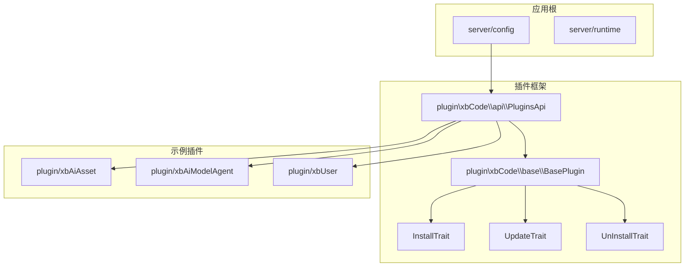
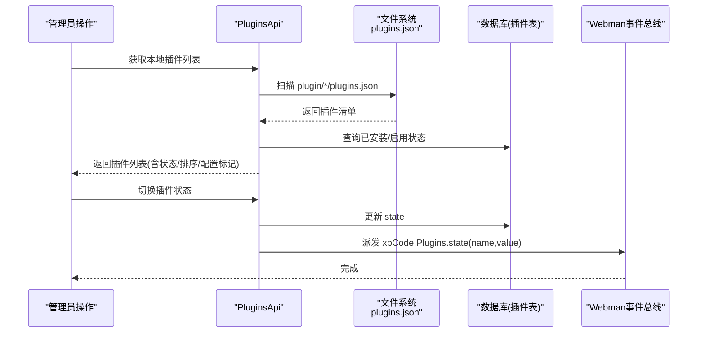
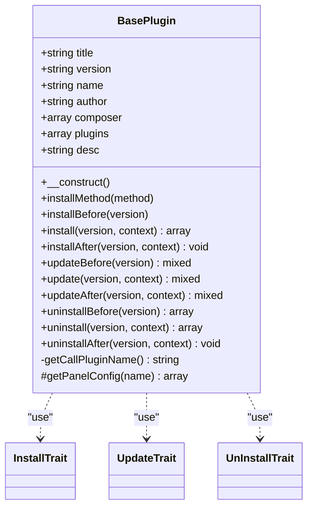
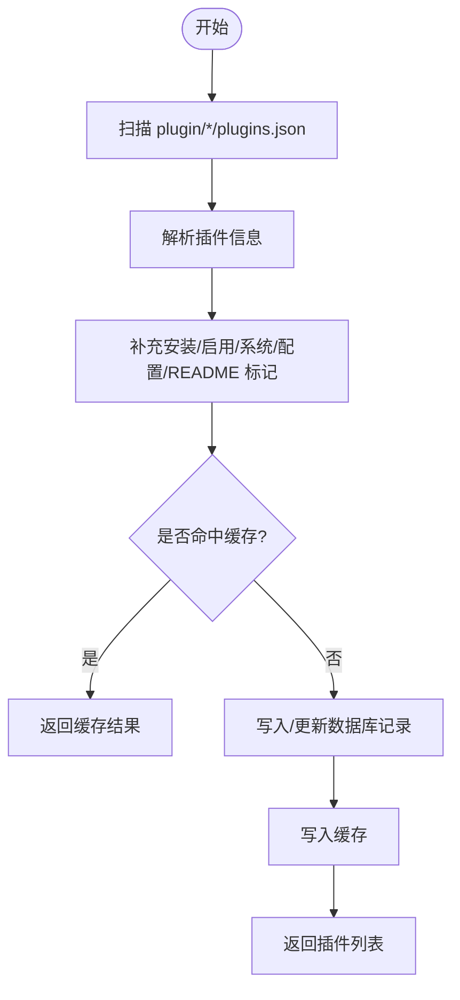
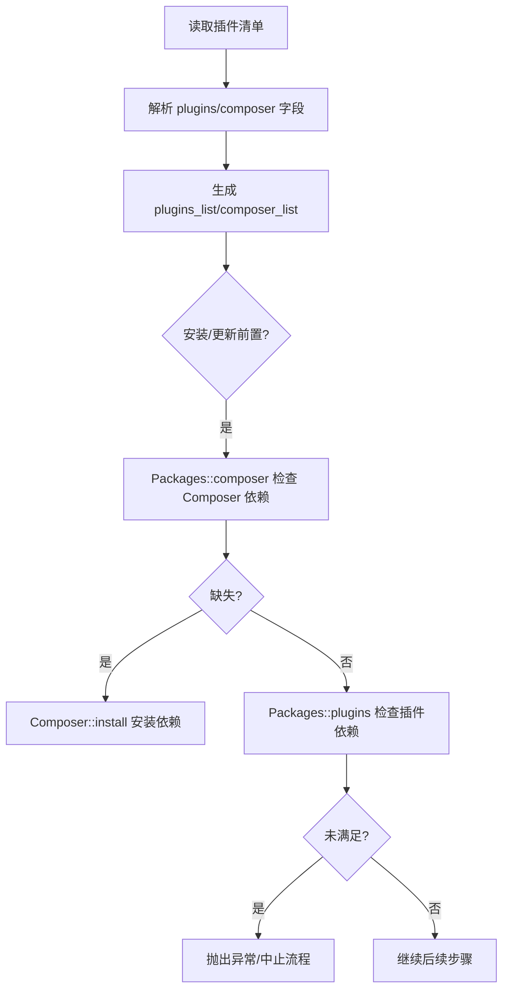
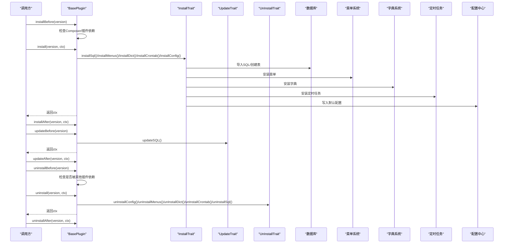
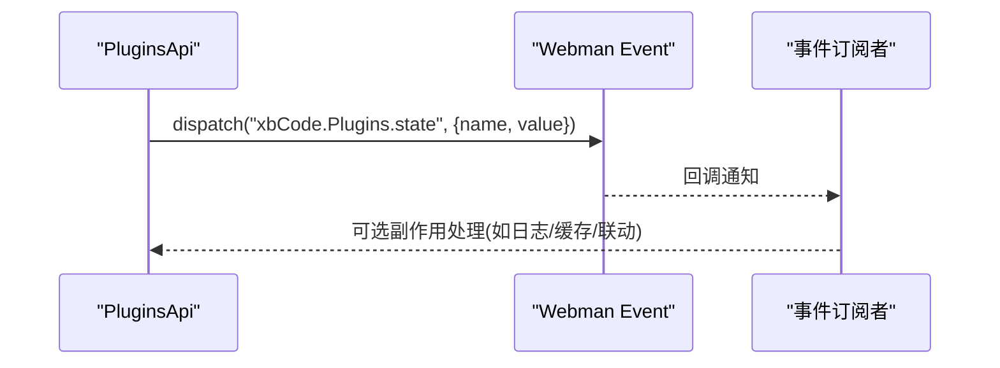
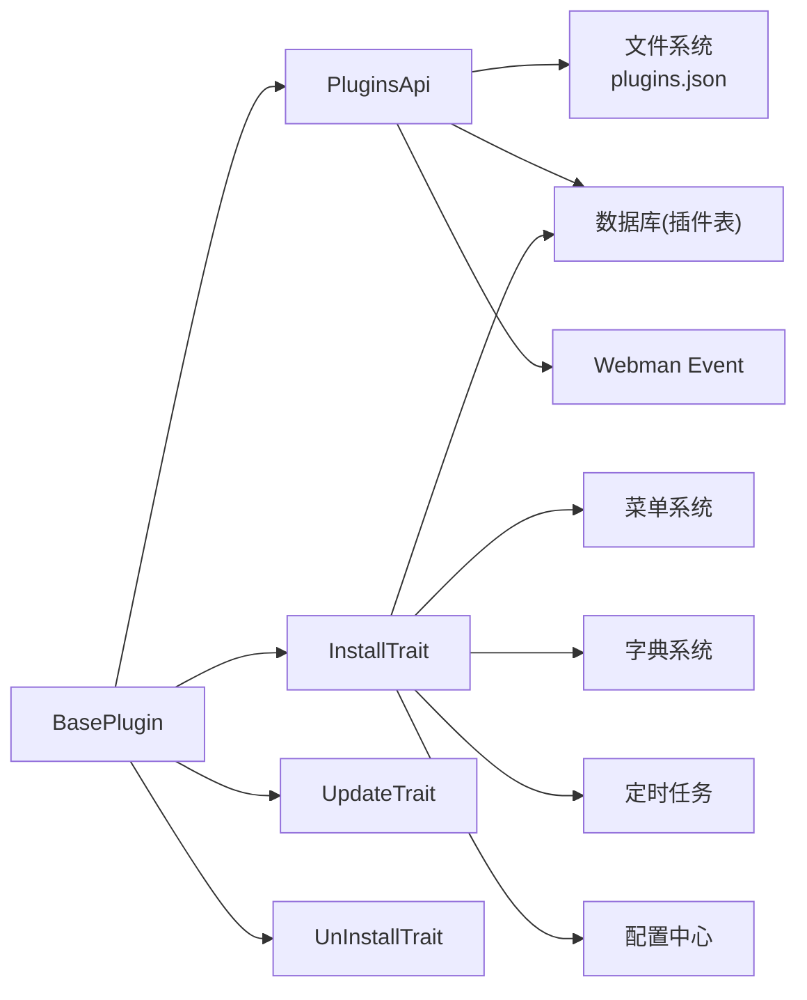

# 插件架构原理

<cite>
**本文引用的文件**   
- [BasePlugin.php](file://server/plugin\xbCode\base\BasePlugin.php)
- [PluginsApi.php](file://server/plugin\xbCode\api\PluginsApi.php)
- [InstallTrait.php](file://server/plugin\xbCode\base\plugin\InstallTrait.php)
- [UpdateTrait.php](file://server/plugin\xbCode\base\plugin\UpdateTrait.php)
- [UnInstallTrait.php](file://server/plugin\xbCode\base\plugin\UnInstallTrait.php)
- [BasePlugins.php](file://server/plugin\xbDeveloper\base\BasePlugins.php)
- [event.php](file://server/config/event.php)
</cite>

## 目录
1. [简介](#简介)
2. [项目结构](#项目结构)
3. [核心组件](#核心组件)
4. [架构总览](#架构总览)
5. [详细组件分析](#详细组件分析)
6. [依赖关系分析](#依赖关系分析)
7. [性能与缓存](#性能与缓存)
8. [故障排查指南](#故障排查指南)
9. [结论](#结论)
10. [附录：插件目录结构与约定](#附录插件目录结构与约定)

## 简介
本文件系统性阐述积木云AI创作平台基于Webman的插件架构原理，重点覆盖以下方面：
- 插件基类 BasePlugin 的设计模式与职责边界
- 插件生命周期管理（安装、更新、卸载）及前后置钩子
- 插件依赖关系管理与发现机制
- 插件目录结构规范、配置文件格式、命名空间约定与自动加载
- 插件注册流程、钩子系统工作原理与事件总线实现
- 如何继承 BasePlugin 并实现自定义插件逻辑（以路径引用代替代码片段）

## 项目结构
本项目采用“按功能/插件”组织方式，核心插件框架位于 server/plugin 目录下。每个插件是一个独立目录，包含 API、配置、模型、枚举、设置等模块。系统通过统一的插件发现与生命周期管理机制，将各插件能力接入 Webman 运行时。

图表来源
- [PluginsApi.php:70-136](file://server/plugin\xbCode\api\PluginsApi.php#L70-L136)
- [BasePlugin.php:26-109](file://server/plugin\xbCode\base\BasePlugin.php#L26-L109)

章节来源
- [PluginsApi.php:70-136](file://server/plugin\xbCode\api\PluginsApi.php#L70-L136)
- [BasePlugin.php:26-109](file://server/plugin\xbCode\base\BasePlugin.php#L26-L109)

## 核心组件
- 插件基类 BasePlugin：定义插件元数据、生命周期入口方法（install/update/uninstall 及其 Before/After），并通过 Trait 组合数据库、菜单、字典、定时任务、配置的自动化安装/卸载能力。
- 插件接口 PluginsApi：负责插件发现、信息解析、状态管理、依赖校验、缓存、以及事件触发。
- 生命周期 Trait：
  - InstallTrait：安装 SQL、菜单、字典、定时任务、配置项
  - UpdateTrait：按版本执行增量 SQL
  - UnInstallTrait：卸载 SQL、菜单、字典、定时任务、配置项
- 开发者服务基类 BasePlugins：提供脚本执行器，动态加载插件 api/Install.php 中的安装/更新/卸载脚本，支持 Before/After 上下文传递。

章节来源
- [BasePlugin.php:26-350](file://server/plugin\xbCode\base\BasePlugin.php#L26-L350)
- [PluginsApi.php:24-684](file://server/plugin\xbCode\api\PluginsApi.php#L24-L684)
- [InstallTrait.php:25-173](file://server/plugin\xbCode\base\plugin\InstallTrait.php#L25-L173)
- [UpdateTrait.php:20-48](file://server/plugin\xbCode\base\plugin\UpdateTrait.php#L20-L48)
- [UnInstallTrait.php:25-173](file://server/plugin\xbCode\base\plugin\UnInstallTrait.php#L25-L173)
- [BasePlugins.php:12-157](file://server/plugin\xbDeveloper\base\BasePlugins.php#L12-L157)

## 架构总览
下图展示了插件从发现到启用的关键交互，包括插件清单解析、依赖检查、状态变更与事件广播。

图表来源
- [PluginsApi.php:70-136](file://server/plugin\xbCode\api\PluginsApi.php#L70-L136)
- [PluginsApi.php:578-598](file://server/plugin\xbCode\api\PluginsApi.php#L578-L598)

## 详细组件分析

### 插件基类 BasePlugin 设计
- 使用 Trait 注入安装/更新/卸载能力，保持单一职责与可复用性
- 构造函数通过反射推断调用类的插件名，并从 PluginsApi 拉取插件元数据填充属性
- 提供 installBefore/install/installAfter、updateBefore/update/updateAfter、uninstallBefore/uninstall/uninstallAfter 完整生命周期钩子
- 内部封装了 getPanelConfig 读取面板配置的能力

图表来源
- [BasePlugin.php:26-350](file://server/plugin\xbCode\base\BasePlugin.php#L26-L350)
- [InstallTrait.php:25-173](file://server/plugin\xbCode\base\plugin\InstallTrait.php#L25-L173)
- [UpdateTrait.php:20-48](file://server/plugin\xbCode\base\plugin\UpdateTrait.php#L20-L48)
- [UnInstallTrait.php:25-173](file://server/plugin\xbCode\base\plugin\UnInstallTrait.php#L25-L173)

章节来源
- [BasePlugin.php:26-350](file://server/plugin\xbCode\base\BasePlugin.php#L26-L350)

### 插件发现与注册流程
- 插件发现：遍历 server/plugin/*/plugins.json，解析元数据并补充安装/启用/系统插件/是否有配置/README 等标记
- 插件注册：在数据库中写入或更新插件记录，维护 name/title/version/author/desc/state 等字段
- 缓存策略：对插件列表进行缓存，键名为固定值，支持强制刷新
- 选项生成：为启用状态的插件生成下拉选项，便于在其他插件中引用

图表来源
- [PluginsApi.php:70-136](file://server/plugin\xbCode\api\PluginsApi.php#L70-L136)
- [PluginsApi.php:144-153](file://server/plugin\xbCode\api\PluginsApi.php#L144-L153)
- [PluginsApi.php:608-625](file://server/plugin\xbCode\api\PluginsApi.php#L608-L625)

章节来源
- [PluginsApi.php:70-136](file://server/plugin\xbCode\api\PluginsApi.php#L70-L136)
- [PluginsApi.php:144-153](file://server/plugin\xbCode\api\PluginsApi.php#L144-L153)
- [PluginsApi.php:608-625](file://server/plugin\xbCode\api\PluginsApi.php#L608-L625)

### 插件依赖关系管理
- 声明式依赖：插件可在其清单中声明对其他插件与第三方 Composer 包的依赖
- 依赖解析：解析 plugins 与 composer 字段，生成 plugins_list/composer_list 供上层使用
- 依赖校验：
  - 安装前：检查 Composer 依赖与插件依赖是否满足
  - 卸载前：检测是否存在其他插件依赖当前插件，若存在则阻止卸载并提示
- 依赖聚合：提供获取所有插件依赖的方法，用于全局依赖图构建

图表来源
- [PluginsApi.php:484-548](file://server/plugin\xbCode\api\PluginsApi.php#L484-L548)
- [PluginsApi.php:633-684](file://server/plugin\xbCode\api\PluginsApi.php#L633-L684)
- [BasePlugin.php:136-154](file://server/plugin\xbCode\base\BasePlugin.php#L136-L154)

章节来源
- [PluginsApi.php:484-548](file://server/plugin\xbCode\api\PluginsApi.php#L484-L548)
- [PluginsApi.php:633-684](file://server/plugin\xbCode\api\PluginsApi.php#L633-L684)
- [BasePlugin.php:136-154](file://server/plugin\xbCode\base\BasePlugin.php#L136-L154)

### 生命周期与钩子系统
- 安装流程：installBefore -> install -> installAfter；失败时尝试回滚 uninstall
- 更新流程：updateBefore -> update -> updateAfter；支持上下文透传
- 卸载流程：uninstallBefore -> uninstall -> uninstallAfter；先检查依赖再清理资源
- 脚本执行：BasePlugins 动态加载插件 api/Install.php，支持 method 参数与 Before/After 钩子

图表来源
- [BasePlugin.php:136-305](file://server/plugin\xbCode\base\BasePlugin.php#L136-L305)
- [InstallTrait.php:33-173](file://server/plugin\xbCode\base\plugin\InstallTrait.php#L33-L173)
- [UpdateTrait.php:28-47](file://server/plugin\xbCode\base\plugin\UpdateTrait.php#L28-L47)
- [UnInstallTrait.php:33-173](file://server/plugin\xbCode\base\plugin\UnInstallTrait.php#L33-L173)
- [BasePlugins.php:86-148](file://server/plugin\xbDeveloper\base\BasePlugins.php#L86-L148)

章节来源
- [BasePlugin.php:136-305](file://server/plugin\xbCode\base\BasePlugin.php#L136-L305)
- [InstallTrait.php:33-173](file://server/plugin\xbCode\base\plugin\InstallTrait.php#L33-L173)
- [UpdateTrait.php:28-47](file://server/plugin\xbCode\base\plugin\UpdateTrait.php#L28-L47)
- [UnInstallTrait.php:33-173](file://server/plugin\xbCode\base\plugin\UnInstallTrait.php#L33-L173)
- [BasePlugins.php:86-148](file://server/plugin\xbDeveloper\base\BasePlugins.php#L86-L148)

### 事件总线与钩子
- 状态变更事件：当插件启用/禁用状态变化时，PluginsApi 会向 Webman 事件总线派发事件，事件名为 xbCode.Plugins.state，携带 name 与 value 两个参数
- 全局事件配置：server/config/event.php 作为事件注册入口，可按需在此处订阅上述事件以实现扩展行为

图表来源
- [PluginsApi.php:578-598](file://server/plugin\xbCode\api\PluginsApi.php#L578-L598)
- [event.php:1-6](file://server/config/event.php#L1-L6)

章节来源
- [PluginsApi.php:578-598](file://server/plugin\xbCode\api\PluginsApi.php#L578-L598)
- [event.php:1-6](file://server/config/event.php#L1-L6)

### 插件目录结构与配置文件约定
- 插件根目录：server/plugin/{插件标识}/
- 清单文件：plugins.json（必填），包含 title、version、author、desc、plugins、composer 等字段
- 安装脚本：api/Install.php（可选），支持 config()、{method}Before/{method}/{method}After 等方法
- 资源与静态：public/、preview.svg（预览图）、README.md/readme.md（文档）
- 配置项：config/ 下可放置路由、中间件、进程、视图、翻译等配置；setting/ 下存放可配置项分组与面板配置
- 数据库：install.sql（安装）、update/{version}.sql（增量升级）
- 命名空间约定：插件类统一位于 plugin/{插件标识}\... 命名空间下，便于自动加载与反射定位

章节来源
- [PluginsApi.php:484-548](file://server/plugin\xbCode\api\PluginsApi.php#L484-L548)
- [BasePlugins.php:99-121](file://server/plugin\xbDeveloper\base\BasePlugins.php#L99-L121)
- [InstallTrait.php:53-109](file://server/plugin\xbCode\base\plugin\InstallTrait.php#L53-L109)
- [UnInstallTrait.php:132-173](file://server/plugin\xbCode\base\plugin\UnInstallTrait.php#L132-L173)

### 如何继承 BasePlugin 实现自定义插件逻辑
- 新建一个继承自 BasePlugin 的类，位于插件命名空间下
- 按需重写生命周期方法，例如：
  - installBefore：准备依赖、预检环境
  - install：执行业务初始化（通常由 Trait 自动完成 SQL/菜单/字典/任务/配置）
  - installAfter：执行后置逻辑（如缓存预热、索引重建）
  - updateBefore/update/updateAfter：实现版本迁移与数据修复
  - uninstallBefore/uninstall/uninstallAfter：安全清理资源
- 如需自定义安装方法，可在插件 api/Install.php 中实现 installMethod，并由 BasePlugins 动态调用

章节来源
- [BasePlugin.php:117-305](file://server/plugin\xbCode\base\BasePlugin.php#L117-L305)
- [BasePlugins.php:131-148](file://server/plugin\xbDeveloper\base\BasePlugins.php#L131-L148)

## 依赖关系分析
- 组件耦合
  - BasePlugin 依赖 PluginsApi 获取元数据，依赖 Traits 完成具体安装/更新/卸载动作
  - PluginsApi 依赖文件系统（plugins.json）、数据库（插件表）、缓存、事件总线
  - Traits 依赖数据库、菜单、字典、定时任务、配置中心等子系统
- 外部依赖
  - Webman Event：用于状态变更事件广播
  - ThinkORM/Db：用于数据库访问
  - ZipArchive：用于插件包解析与校验

图表来源
- [BasePlugin.php:26-109](file://server/plugin\xbCode\base\BasePlugin.php#L26-L109)
- [PluginsApi.php:70-136](file://server/plugin\xbCode\api\PluginsApi.php#L70-L136)
- [PluginsApi.php:578-598](file://server/plugin\xbCode\api\PluginsApi.php#L578-L598)
- [InstallTrait.php:33-173](file://server/plugin\xbCode\base\plugin\InstallTrait.php#L33-L173)

章节来源
- [BasePlugin.php:26-109](file://server/plugin\xbCode\base\BasePlugin.php#L26-L109)
- [PluginsApi.php:70-136](file://server/plugin\xbCode\api\PluginsApi.php#L70-L136)
- [PluginsApi.php:578-598](file://server/plugin\xbCode\api\PluginsApi.php#L578-L598)
- [InstallTrait.php:33-173](file://server/plugin\xbCode\base\plugin\InstallTrait.php#L33-L173)

## 性能与缓存
- 插件列表缓存：PluginsApi 对插件列表进行缓存，避免频繁 IO 与解析开销
- 按需刷新：状态变更后主动刷新缓存，保证一致性
- 建议
  - 合理拆分大插件，减少单次解析成本
  - 使用增量 SQL 而非全量替换，降低更新耗时
  - 对大型配置项采用懒加载或分片加载

[本节为通用指导，不直接分析具体文件]

## 故障排查指南
- 常见问题
  - 插件包不完整：缺少 plugins.json 或 preview.svg
  - 依赖缺失：Composer 包或插件依赖未满足
  - 卸载受阻：存在其他插件依赖当前插件
  - 状态变更无响应：事件订阅未正确注册
- 定位要点
  - 查看插件清单与路径是否正确
  - 检查数据库表与配置项是否存在
  - 确认事件订阅是否在 event.php 中注册
  - 关注日志输出（安装/更新/卸载异常均记录日志）

章节来源
- [PluginsApi.php:411-462](file://server/plugin\xbCode\api\PluginsApi.php#L411-L462)
- [PluginsApi.php:674-684](file://server/plugin\xbCode\api\PluginsApi.php#L674-L684)
- [BasePlugin.php:177-186](file://server/plugin\xbCode\base\BasePlugin.php#L177-L186)
- [BasePlugin.php:287-290](file://server/plugin\xbCode\base\BasePlugin.php#L287-L290)
- [event.php:1-6](file://server/config/event.php#L1-L6)

## 结论
本架构通过 BasePlugin 抽象出统一的插件生命周期与能力组合，借助 PluginsApi 完成插件的发现、注册、依赖校验与状态管理，并以 Webman 事件总线实现松耦合的扩展点。配合规范的目录结构与配置文件约定，使得插件具备高内聚、低耦合、易扩展的特性，适合积木云AI创作平台的持续演进与生态建设。

[本节为总结性内容，不直接分析具体文件]

## 附录：插件目录结构与约定
- 必备
  - plugins.json：插件清单（title、version、author、desc、plugins、composer 等）
  - preview.svg：插件预览图
  - README.md 或 readme.md：说明文档（可选但推荐）
- 推荐
  - api/Install.php：安装/更新/卸载脚本与配置项定义
  - config/：路由、中间件、进程、视图、翻译等配置
  - setting/：可配置项分组与面板配置
  - public/：静态资源
  - app/：控制器、模型、队列、服务等业务代码
  - enum/：枚举定义
  - data/：数据种子或初始数据
  - skills/：技能或模板资源
- 命名空间
  - 插件类统一位于 plugin/{插件标识}\... 命名空间下
- 自动加载
  - 通过 Composer 与框架自动加载机制，结合插件命名空间约定实现类自动发现与加载

[本节为通用约定说明，不直接分析具体文件]