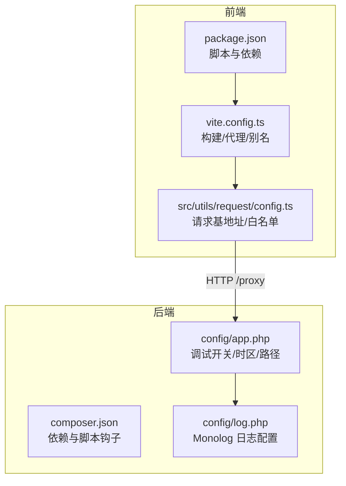
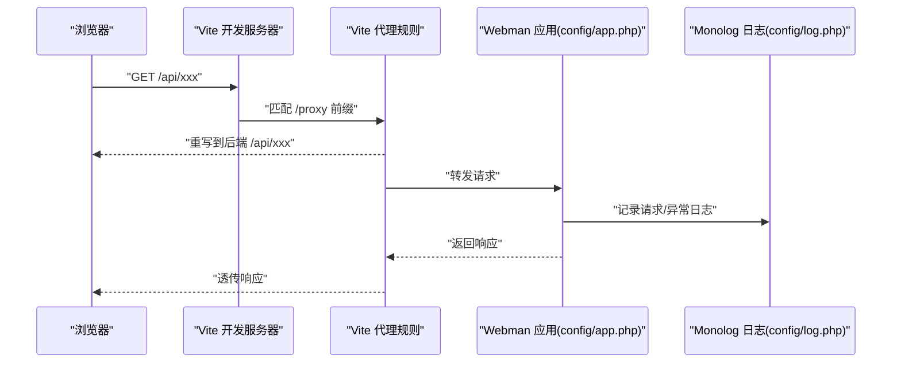
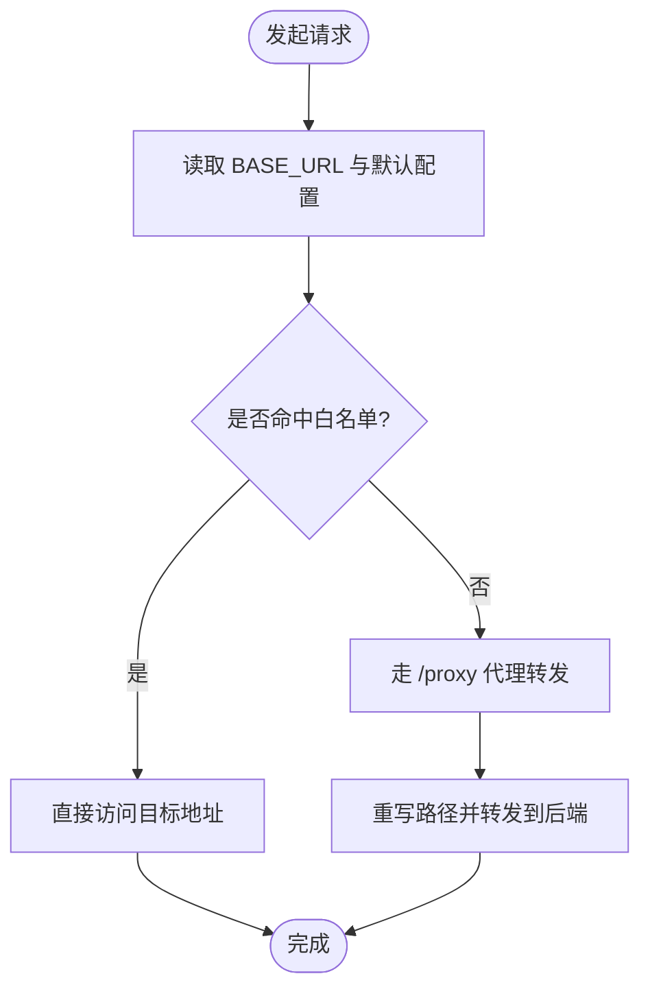
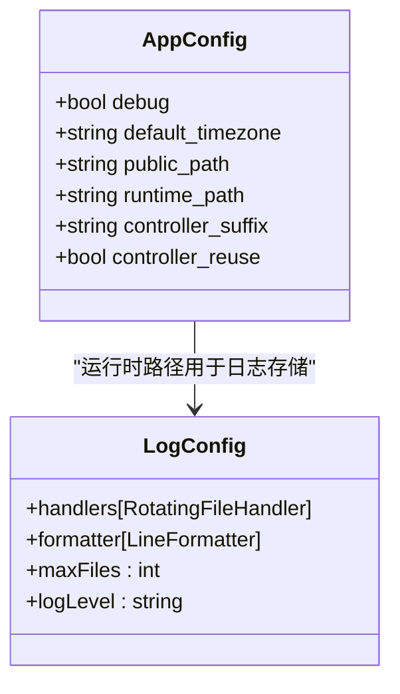
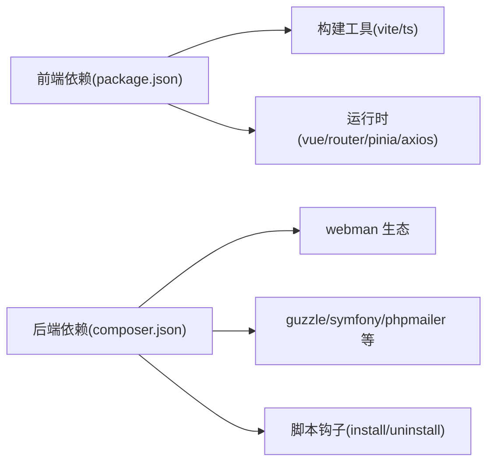

# 插件测试调试

<cite>
**本文引用的文件**
- [frontend/package.json](file://frontend/package.json)
- [frontend/vite.config.ts](file://frontend/vite.config.ts)
- [frontend/src/utils/request/config.ts](file://frontend/src/utils/request/config.ts)
- [server/composer.json](file://server/composer.json)
- [server/config/app.php](file://server/config/app.php)
- [server/config/log.php](file://server/config/log.php)
</cite>

## 目录
1. [简介](#简介)
2. [项目结构](#项目结构)
3. [核心组件](#核心组件)
4. [架构总览](#架构总览)
5. [详细组件分析](#详细组件分析)
6. [依赖分析](#依赖分析)
7. [性能考虑](#性能考虑)
8. [故障排查指南](#故障排查指南)
9. [结论](#结论)
10. [附录](#附录)

## 简介
本指南面向积木云AI创作平台的插件开发与维护人员，聚焦“测试与调试”的实战方法。内容覆盖：
- 单元测试、集成测试、端到端测试策略与实践
- 调试工具使用、日志规范、错误追踪与性能分析
- 开发环境搭建、热重载配置、模拟数据生成
- 常见问题定位、性能瓶颈分析与安全漏洞检测
- 测试覆盖率要求、持续集成配置与自动化部署流程

## 项目结构
前端采用 Vite + Vue3 + TypeScript 技术栈，后端基于 Webman（Workerman）框架，插件位于 server/plugin 下。前后端通过 HTTP API 交互，前端默认通过 Vite 代理转发到本地后端服务。

图表来源
- [frontend/package.json:1-35](file://frontend/package.json#L1-L35)
- [frontend/vite.config.ts:1-32](file://frontend/vite.config.ts#L1-L32)
- [frontend/src/utils/request/config.ts:1-39](file://frontend/src/utils/request/config.ts#L1-L39)
- [server/composer.json:1-99](file://server/composer.json#L1-L99)
- [server/config/app.php:1-13](file://server/config/app.php#L1-L13)
- [server/config/log.php:1-33](file://server/config/log.php#L1-L33)

章节来源
- [frontend/package.json:1-35](file://frontend/package.json#L1-L35)
- [frontend/vite.config.ts:1-32](file://frontend/vite.config.ts#L1-L32)
- [frontend/src/utils/request/config.ts:1-39](file://frontend/src/utils/request/config.ts#L1-L39)
- [server/composer.json:1-99](file://server/composer.json#L1-L99)
- [server/config/app.php:1-13](file://server/config/app.php#L1-L13)
- [server/config/log.php:1-33](file://server/config/log.php#L1-L33)

## 核心组件
- 前端构建与开发服务器
  - 脚本入口：dev/build/preview 等命令由 package.json 定义
  - 热重载与代理：vite.config.ts 中启用 watch、代理转发至本地后端
  - 请求基址与白名单：src/utils/request/config.ts 提供 BASE_URL 与 isWhitelisted 逻辑
- 后端运行与日志
  - 依赖与脚本钩子：composer.json 声明 webman 生态及安装/卸载钩子
  - 应用配置：config/app.php 控制 debug、时区、运行时路径等
  - 日志系统：config/log.php 使用 Monolog 写入 runtime/logs/webman.log

章节来源
- [frontend/package.json:1-35](file://frontend/package.json#L1-L35)
- [frontend/vite.config.ts:1-32](file://frontend/vite.config.ts#L1-L32)
- [frontend/src/utils/request/config.ts:1-39](file://frontend/src/utils/request/config.ts#L1-L39)
- [server/composer.json:1-99](file://server/composer.json#L1-L99)
- [server/config/app.php:1-13](file://server/config/app.php#L1-L13)
- [server/config/log.php:1-33](file://server/config/log.php#L1-L33)

## 架构总览
下图展示从浏览器发起请求到后端处理与日志落盘的完整链路，并标注关键配置文件位置。

图表来源
- [frontend/vite.config.ts:19-30](file://frontend/vite.config.ts#L19-L30)
- [frontend/src/utils/request/config.ts:4-10](file://frontend/src/utils/request/config.ts#L4-L10)
- [server/config/app.php:4-12](file://server/config/app.php#L4-L12)
- [server/config/log.php:15-31](file://server/config/log.php#L15-L31)

## 详细组件分析

### 前端请求与代理链路
- 请求基地址与环境变量
  - BASE_URL 优先读取环境变量，否则回退到 /proxy
  - 默认超时与基础配置在统一文件中集中管理
- 白名单机制
  - 支持精确匹配与通配符匹配，自动补全前导斜杠
  - 便于在测试阶段对特定接口放行或跳过鉴权
- 开发代理
  - Vite server.proxy 将 /proxy 前缀重写后转发到本地后端
  - watch.ignored 可排除敏感文件变更触发重建

图表来源
- [frontend/src/utils/request/config.ts:4-38](file://frontend/src/utils/request/config.ts#L4-L38)
- [frontend/vite.config.ts:23-28](file://frontend/vite.config.ts#L23-L28)

章节来源
- [frontend/src/utils/request/config.ts:1-39](file://frontend/src/utils/request/config.ts#L1-L39)
- [frontend/vite.config.ts:19-30](file://frontend/vite.config.ts#L19-L30)

### 后端应用与日志
- 应用配置
  - debug 开关影响错误堆栈输出与调试信息
  - 时区、控制器后缀、运行时路径等关键参数集中配置
- 日志配置
  - 使用 RotatingFileHandler 按天轮转，保留最近 N 个文件
  - LineFormatter 统一时间格式，便于检索与分析

图表来源
- [server/config/app.php:4-12](file://server/config/app.php#L4-L12)
- [server/config/log.php:15-31](file://server/config/log.php#L15-L31)

章节来源
- [server/config/app.php:1-13](file://server/config/app.php#L1-L13)
- [server/config/log.php:1-33](file://server/config/log.php#L1-L33)

### 插件体系与扩展点（概念性说明）
- 插件目录位于 server/plugin，每个插件包含 api、app、config、enum、data、setting 等标准结构
- 插件生命周期通常由 composer 脚本钩子驱动（安装/更新/卸载），便于初始化资源与路由注册
- 建议为每个插件建立独立的测试套件与文档，遵循统一的命名与目录约定

章节来源
- [server/composer.json:80-90](file://server/composer.json#L80-L90)

## 依赖分析
- 前端依赖
  - 构建与开发：vite、@vitejs/plugin-vue、typescript、vue-tsc
  - 运行时：vue、vue-router、pinia、axios
- 后端依赖
  - 框架与中间件：webman-framework、event、log、redis、channel、redis-queue
  - 第三方库：guzzlehttp/guzzle、symfony/workflow、phpmailer/phpmailer 等
  - 脚本钩子：post-package-install/update、pre-package-uninstall 调用 support\Plugin

图表来源
- [frontend/package.json:12-33](file://frontend/package.json#L12-L33)
- [server/composer.json:31-68](file://server/composer.json#L31-L68)
- [server/composer.json:80-90](file://server/composer.json#L80-L90)

章节来源
- [frontend/package.json:1-35](file://frontend/package.json#L1-L35)
- [server/composer.json:1-99](file://server/composer.json#L1-L99)

## 性能考虑
- 前端
  - 合理设置 vite.watch.ignored，避免无关文件变更导致频繁重建
  - 按需引入与分包，减少首屏体积
- 后端
  - 开启 ext-event 扩展以获得更高并发性能（见 suggest）
  - 调整日志级别与轮转策略，避免 I/O 成为瓶颈
  - 合理使用缓存与队列，降低数据库压力

章节来源
- [frontend/vite.config.ts:19-22](file://frontend/vite.config.ts#L19-L22)
- [server/composer.json:69-71](file://server/composer.json#L69-L71)
- [server/config/log.php:19-28](file://server/config/log.php#L19-L28)

## 故障排查指南
- 开发环境问题
  - 确认 Vite 代理端口与后端监听端口一致
  - 检查 BASE_URL 与白名单配置，确保测试接口可达
- 日志与错误定位
  - 打开 APP_DEBUG=true 获取更详细的错误信息
  - 查看 runtime/logs/webman.log，结合时间戳与请求路径快速定位
- 常见现象与建议
  - 跨域问题：确保 changeOrigin 与 rewrite 规则正确
  - 大文件上传/生成任务：关注队列与进程状态，必要时扩容消费者
  - 权限与鉴权：核对白名单与中间件顺序

章节来源
- [frontend/vite.config.ts:23-28](file://frontend/vite.config.ts#L23-L28)
- [frontend/src/utils/request/config.ts:4-38](file://frontend/src/utils/request/config.ts#L4-L38)
- [server/config/app.php:5-6](file://server/config/app.php#L5-L6)
- [server/config/log.php:19-28](file://server/config/log.php#L19-L28)

## 结论
通过统一的前后端配置与清晰的日志策略，可以快速搭建稳定高效的插件测试与调试环境。建议在插件层面完善单测、集成测试与 E2E 用例，配合 CI 流水线实现质量门禁与自动化发布。

## 附录

### 单元测试编写方法（建议）
- 前端
  - 使用 Vite 生态下的测试工具（如 Vitest），针对工具函数与组件进行断言
  - 对请求层封装进行 Mock，验证拦截器与白名单逻辑
- 后端
  - 使用 PHPUnit 对控制器与服务层进行单元与集成测试
  - 借助 Composer 脚本钩子准备测试数据与清理环境

### 集成测试策略（建议）
- 启动最小化后端服务与必要依赖（数据库、Redis、队列）
- 构造真实请求链路，校验接口契约与副作用（日志、消息队列）
- 使用固定测试数据集，保证结果可重复

### 端到端测试方案（建议）
- 使用浏览器自动化（如 Playwright/Cypress）模拟用户操作
- 覆盖关键业务流：登录、资产生成、模型调用、支付与下载
- 结合 Mock 外部服务（短信、邮件、对象存储）提升稳定性

### 调试工具使用与日志规范
- 前端
  - 利用浏览器开发者工具 Network/Console 面板
  - 在请求拦截器中打印结构化日志（URL、耗时、状态码）
- 后端
  - 统一日志格式与级别，区分 info/warn/error
  - 关键路径埋点：入参、出参、异常堆栈、耗时

### 错误追踪与性能分析
- 错误追踪
  - 收集未捕获异常与 Promise Rejection，上报到统一平台
- 性能分析
  - 前端：Performance 面板、Lighthouse、Bundle 分析
  - 后端：Xdebug/Profiler、队列消费耗时、慢查询分析

### 开发环境与热重载配置
- 前端
  - 使用 npm run dev 启动 Vite，修改代码即时生效
  - 通过 proxy 转发到本地后端，避免 CORS
- 后端
  - 开启 APP_DEBUG 以便本地调试
  - 合理配置日志轮转与保留天数

### 模拟数据生成
- 使用工厂类或脚本批量生成测试数据
- 将种子数据纳入版本管理，确保多环境一致性

### 测试覆盖率要求（建议）
- 核心业务模块覆盖率 ≥ 80%
- 公共工具与拦截器覆盖率 ≥ 90%
- 新增功能需附带相应用例，禁止无覆盖提交

### 持续集成配置（建议）
- 触发条件：push/PR
- 步骤：安装依赖 → 类型检查 → 单元测试 → 集成测试 → 构建产物 → 静态扫描
- 报告：生成覆盖率报告与测试报告，失败则阻断合并

### 自动化部署流程（建议）
- 构建前端产物并上传静态资源
- 同步后端代码与依赖，执行迁移与缓存预热
- 灰度发布与健康检查，失败自动回滚