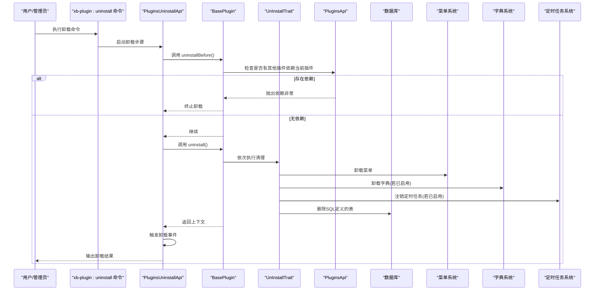
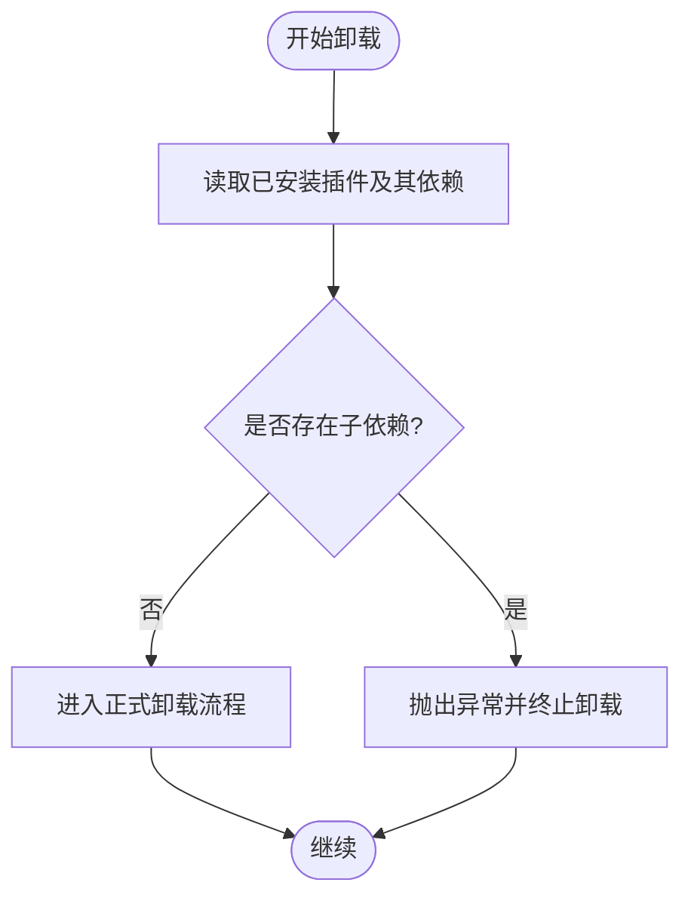
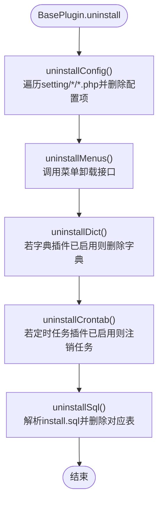
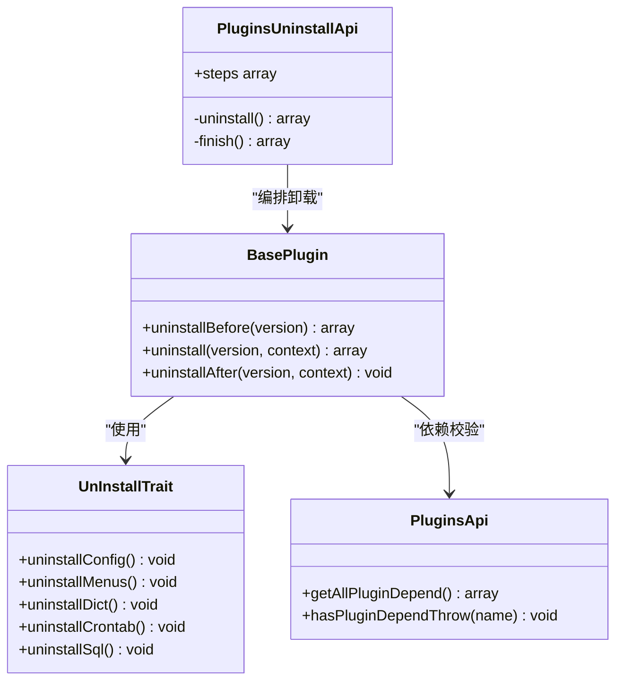

# 插件卸载流程

<cite>
**本文引用的文件**
- [BasePlugin.php](file://server/plugin\xbCode\base\BasePlugin.php)
- [UnInstallTrait.php](file://server/plugin\xbCode\base\plugin\UnInstallTrait.php)
- [PluginsApi.php](file://server/plugin\xbCode\api\PluginsApi.php)
- [PluginsUninstallApi.php](file://server/plugin\xbCode\api\PluginsUninstallApi.php)
- [Install.php（xbAiAsset）](file://server/plugin\xbAiAsset\api\Install.php)
- [Install.php（xbAiModelAgent）](file://server/plugin\xbAiModelAgent\api\Install.php)
- [Install.php（xbCdKey）](file://server/plugin\xbCdKey\api\Install.php)
- [PluginUnInstall.php（开发者命令）](file://server/plugin\xbDeveloper\command\PluginUnInstall.php)
</cite>

## 目录
1. [简介](#简介)
2. [项目结构](#项目结构)
3. [核心组件](#核心组件)
4. [架构总览](#架构总览)
5. [详细组件分析](#详细组件分析)
6. [依赖关系分析](#依赖关系分析)
7. [性能与一致性考虑](#性能与一致性考虑)
8. [故障排查指南](#故障排查指南)
9. [结论](#结论)
10. [附录：卸载脚本编写规范与最佳实践](#附录：卸载脚本编写规范与最佳实践)

## 简介
本文件面向插件开发者与维护者，系统化阐述插件卸载的完整技术流程。内容覆盖卸载前置检查、依赖关系验证与安全确认机制；详述配置清理、菜单移除、字典删除、定时任务注销与数据库表清理的执行顺序与实现要点；并提供数据备份策略、软删除机制建议与误操作恢复方案；最后给出卸载脚本编写规范与资源清理的最佳实践。

## 项目结构
围绕卸载能力的相关代码主要分布在以下位置：
- 插件基类与卸载通用逻辑：base/BasePlugin.php、base/plugin/UnInstallTrait.php
- 插件管理与卸载编排：api/PluginsApi.php、api/PluginsUninstallApi.php
- 各插件的卸载入口（可选扩展点）：plugin/*/api/Install.php
- 命令行卸载入口（开发者工具）：plugin\xbDeveloper\command\PluginUnInstall.php

```mermaid
graph TB
subgraph "卸载核心"
BP["BasePlugin<br/>卸载编排"]
UIT["UnInstallTrait<br/>通用卸载方法"]
PAPI["PluginsApi<br/>依赖检测/状态管理"]
PUA["PluginsUninstallApi<br/>卸载步骤编排"]
end
subgraph "插件侧扩展点"
I1["xbAiAsset Install.php"]
I2["xbAiModelAgent Install.php"]
I3["xbCdKey Install.php"]
end
subgraph "CLI"
CLI["xb-plugin:uninstall 命令"]
end
CLI --> PUA
PUA --> BP
BP --> UIT
BP --> PAPI
I1 --> BP
I2 --> BP
I3 --> BP
```

图表来源
- [BasePlugin.php:252-305](file://server/plugin\xbCode\base\BasePlugin.php#L252-L305)
- [UnInstallTrait.php:25-173](file://server/plugin\xbCode\base\plugin\UnInstallTrait.php#L25-L173)
- [PluginsApi.php:627-684](file://server/plugin\xbCode\api\PluginsApi.php#L627-L684)
- [PluginsUninstallApi.php:17-85](file://server/plugin\xbCode\api\PluginsUninstallApi.php#L17-L85)
- [Install.php（xbAiAsset）:49-62](file://server/plugin\xbAiAsset\api\Install.php#L49-L62)
- [Install.php（xbAiModelAgent）:54-66](file://server/plugin\xbAiModelAgent\api\Install.php#L54-L66)
- [Install.php（xbCdKey）:49-62](file://server/plugin\xbCdKey\api\Install.php#L49-L62)
- [PluginUnInstall.php（开发者命令）:15-58](file://server/plugin\xbDeveloper\command\PluginUnInstall.php#L15-L58)

章节来源
- [BasePlugin.php:252-305](file://server/plugin\xbCode\base\BasePlugin.php#L252-L305)
- [UnInstallTrait.php:25-173](file://server/plugin\xbCode\base\plugin\UnInstallTrait.php#L25-L173)
- [PluginsApi.php:627-684](file://server/plugin\xbCode\api\PluginsApi.php#L627-L684)
- [PluginsUninstallApi.php:17-85](file://server/plugin\xbCode\api\PluginsUninstallApi.php#L17-L85)
- [Install.php（xbAiAsset）:49-62](file://server/plugin\xbAiAsset\api\Install.php#L49-L62)
- [Install.php（xbAiModelAgent）:54-66](file://server/plugin\xbAiModelAgent\api\Install.php#L54-L66)
- [Install.php（xbCdKey）:49-62](file://server/plugin\xbCdKey\api\Install.php#L49-L62)
- [PluginUnInstall.php（开发者命令）:15-58](file://server/plugin\xbDeveloper\command\PluginUnInstall.php#L15-L58)

## 核心组件
- BasePlugin：提供安装/更新/卸载的统一生命周期钩子与编排，其中卸载流程包含“卸载前置—卸载—卸载后置”三段式调用，并在卸载前进行依赖校验。
- UnInstallTrait：封装通用的卸载动作，包括配置项清理、菜单移除、字典删除、定时任务注销、数据库表删除等。
- PluginsApi：提供插件元信息、依赖关系查询与抛出依赖异常的能力，用于卸载前的依赖安全校验。
- PluginsUninstallApi：定义卸载步骤（如“卸载数据”“卸载完成”），在步骤中执行脚本并触发事件，最终清理插件记录。
- 各插件 Install.php：可覆写 uninstall 以追加自定义卸载逻辑（例如业务数据归档、外部资源清理）。
- xb-plugin:uninstall 命令：提供命令行卸载入口，驱动卸载脚本执行。

章节来源
- [BasePlugin.php:252-305](file://server/plugin\xbCode\base\BasePlugin.php#L252-L305)
- [UnInstallTrait.php:25-173](file://server/plugin\xbCode\base\plugin\UnInstallTrait.php#L25-L173)
- [PluginsApi.php:627-684](file://server/plugin\xbCode\api\PluginsApi.php#L627-L684)
- [PluginsUninstallApi.php:17-85](file://server/plugin\xbCode\api\PluginsUninstallApi.php#L17-L85)
- [Install.php（xbAiAsset）:49-62](file://server/plugin\xbAiAsset\api\Install.php#L49-L62)
- [Install.php（xbAiModelAgent）:54-66](file://server/plugin\xbAiModelAgent\api\Install.php#L54-L66)
- [Install.php（xbCdKey）:49-62](file://server/plugin\xbCdKey\api\Install.php#L49-L62)
- [PluginUnInstall.php（开发者命令）:15-58](file://server/plugin\xbDeveloper\command\PluginUnInstall.php#L15-L58)

## 架构总览
下图展示了从命令到具体卸载动作的调用链与关键分支。



图表来源
- [PluginUnInstall.php（开发者命令）:15-58](file://server/plugin\xbDeveloper\command\PluginUnInstall.php#L15-L58)
- [PluginsUninstallApi.php:17-85](file://server/plugin\xbCode\api\PluginsUninstallApi.php#L17-L85)
- [BasePlugin.php:252-305](file://server/plugin\xbCode\base\BasePlugin.php#L252-L305)
- [UnInstallTrait.php:25-173](file://server/plugin\xbCode\base\plugin\UnInstallTrait.php#L25-L173)
- [PluginsApi.php:627-684](file://server/plugin\xbCode\api\PluginsApi.php#L627-L684)

## 详细组件分析

### 卸载前置检查与依赖关系验证
- 依赖校验：在卸载前置阶段，通过插件接口获取所有已安装插件的依赖关系，若发现有其他插件依赖当前插件，则直接抛出异常并终止卸载，避免破坏系统稳定性。
- 安全确认：卸载属于高危操作，建议在UI层或CLI层增加二次确认提示，确保管理员明确知晓将删除的数据范围。



图表来源
- [PluginsApi.php:627-684](file://server/plugin\xbCode\api\PluginsApi.php#L627-L684)
- [BasePlugin.php:252-264](file://server/plugin\xbCode\base\BasePlugin.php#L252-L264)

章节来源
- [PluginsApi.php:627-684](file://server/plugin\xbCode\api\PluginsApi.php#L627-L684)
- [BasePlugin.php:252-264](file://server/plugin\xbCode\base\BasePlugin.php#L252-L264)

### 卸载主流程与清理顺序
卸载主流程由 BasePlugin 统一编排，按固定顺序执行：
1) 卸载配置项
2) 卸载菜单
3) 卸载字典
4) 注销定时任务
5) 删除数据库表



图表来源
- [BasePlugin.php:274-293](file://server/plugin\xbCode\base\BasePlugin.php#L274-L293)
- [UnInstallTrait.php:25-173](file://server/plugin\xbCode\base\plugin\UnInstallTrait.php#L25-L173)

章节来源
- [BasePlugin.php:274-293](file://server/plugin\xbCode\base\BasePlugin.php#L274-L293)
- [UnInstallTrait.php:25-173](file://server/plugin\xbCode\base\plugin\UnInstallTrait.php#L25-L173)

### 配置清理
- 扫描路径：插件目录下 setting 子目录中的分组配置文件（如 setting/groupA.php、setting/groupB.php）。
- 清理规则：根据配置项 name/type/value 字段定位 config 表记录并删除。
- 容错处理：若目标表不存在或配置项缺失，跳过该项；删除失败需抛出异常以便回滚。

章节来源
- [UnInstallTrait.php:126-173](file://server/plugin\xbCode\base\plugin\UnInstallTrait.php#L126-L173)

### 菜单移除
- 调用统一的菜单卸载接口，传入插件标识，由菜单系统批量移除该插件注册的所有菜单项。
- 幂等性：重复执行不会报错，但会忽略不存在的菜单项。

章节来源
- [UnInstallTrait.php:48-58](file://server/plugin\xbCode\base\plugin\UnInstallTrait.php#L48-L58)

### 字典删除
- 条件判断：仅当字典插件已安装且处于启用状态，且字典表存在时执行。
- 执行方式：调用字典插件提供的卸载接口，按插件标识清理其注册的字典项。

章节来源
- [UnInstallTrait.php:60-83](file://server/plugin\xbCode\base\plugin\UnInstallTrait.php#L60-L83)

### 定时任务注销
- 条件判断：仅当定时任务插件已安装且处于启用状态，且 crontab 表存在时执行。
- 执行方式：读取插件 config/crontab.php 定义的任务清单，调用定时任务卸载接口进行注销。

章节来源
- [UnInstallTrait.php:85-124](file://server/plugin\xbCode\base\plugin\UnInstallTrait.php#L85-L124)

### 数据库表清理
- 依据：插件根目录 install.sql 文件中声明的建表语句。
- 行为：解析 SQL 文件提取表名，批量删除对应表。
- 注意：此操作不可逆，务必在执行前做好数据备份。

章节来源
- [UnInstallTrait.php:27-46](file://server/plugin\xbCode\base\plugin\UnInstallTrait.php#L27-L46)

### 卸载步骤编排与事件
- 步骤定义：卸载数据、卸载完成两个步骤，分别负责执行脚本与收尾工作。
- 事件触发：在关键节点触发卸载相关事件，便于监听器执行额外清理或审计日志。
- 记录清理：完成后删除插件记录，使插件不再出现在已安装列表中。

章节来源
- [PluginsUninstallApi.php:17-85](file://server/plugin\xbCode\api\PluginsUninstallApi.php#L17-L85)

### 插件侧卸载扩展点
- 各插件可在 api/Install.php 中覆写 uninstall 方法，在父类卸载流程之后追加自定义清理逻辑（如业务数据归档、第三方资源释放等）。
- 典型示例：xbAiAsset、xbAiModelAgent、xbCdKey 均提供了 uninstall 扩展点。

章节来源
- [Install.php（xbAiAsset）:49-62](file://server/plugin\xbAiAsset\api\Install.php#L49-L62)
- [Install.php（xbAiModelAgent）:54-66](file://server/plugin\xbAiModelAgent\api\Install.php#L54-L66)
- [Install.php（xbCdKey）:49-62](file://server/plugin\xbCdKey\api\Install.php#L49-L62)

### 命令行卸载入口
- 命令名称：xb-plugin:uninstall
- 参数：插件标识（必填）
- 行为：实例化卸载脚本并执行 start('script') 与 start('complete')，输出成功信息。

章节来源
- [PluginUnInstall.php（开发者命令）:15-58](file://server/plugin\xbDeveloper\command\PluginUnInstall.php#L15-L58)

## 依赖关系分析
- 耦合关系：
  - BasePlugin 依赖 UnInstallTrait 提供的通用卸载方法。
  - UnInstallTrait 依赖菜单、字典、定时任务、数据库等子系统接口。
  - BasePlugin 在卸载前置阶段依赖 PluginsApi 进行依赖关系校验。
  - PluginsUninstallApi 编排卸载步骤，并通过事件系统与外部解耦。
- 潜在风险：
  - 若字典或定时任务插件未启用，卸载流程会跳过相应清理，可能导致残留数据。
  - 若 install.sql 未正确声明表名，数据库清理可能不完整。



图表来源
- [BasePlugin.php:252-305](file://server/plugin\xbCode\base\BasePlugin.php#L252-L305)
- [UnInstallTrait.php:25-173](file://server/plugin\xbCode\base\plugin\UnInstallTrait.php#L25-L173)
- [PluginsApi.php:627-684](file://server/plugin\xbCode\api\PluginsApi.php#L627-L684)
- [PluginsUninstallApi.php:17-85](file://server/plugin\xbCode\api\PluginsUninstallApi.php#L17-L85)

章节来源
- [BasePlugin.php:252-305](file://server/plugin\xbCode\base\BasePlugin.php#L252-L305)
- [UnInstallTrait.php:25-173](file://server/plugin\xbCode\base\plugin\UnInstallTrait.php#L25-L173)
- [PluginsApi.php:627-684](file://server/plugin\xbCode\api\PluginsApi.php#L627-L684)
- [PluginsUninstallApi.php:17-85](file://server/plugin\xbCode\api\PluginsUninstallApi.php#L17-L85)

## 性能与一致性考虑
- 事务与回滚：
  - 对数据库表删除、配置项删除等关键操作建议使用事务包裹，任一环节失败整体回滚，保证一致性。
- 幂等设计：
  - 卸载接口应支持幂等执行，重复运行不会产生副作用。
- 分批与限流：
  - 对于大量配置项或字典项的删除，建议分批处理，避免单次请求过大导致超时。
- 缓存刷新：
  - 卸载完成后及时刷新相关缓存（如插件列表缓存），避免显示不一致。

[本节为通用指导，无需源码引用]

## 故障排查指南
- 常见错误与定位：
  - 依赖冲突：卸载前置检测到有子依赖，抛出异常。解决方案：先卸载依赖方插件。
  - 字典/定时任务未启用：卸载流程跳过对应清理。解决方案：启用后再执行卸载，或在插件侧补充清理逻辑。
  - SQL 表缺失：install.sql 未声明或表名不一致。解决方案：核对 SQL 文件与数据库实际表名。
  - 配置项删除失败：config 表不存在或权限不足。解决方案：检查数据库连接与权限。
- 日志与事件：
  - 关注卸载过程中的错误日志与事件输出，快速定位问题环节。

章节来源
- [PluginsApi.php:627-684](file://server/plugin\xbCode\api\PluginsApi.php#L627-L684)
- [UnInstallTrait.php:25-173](file://server/plugin\xbCode\base\plugin\UnInstallTrait.php#L25-L173)
- [BasePlugin.php:274-293](file://server/plugin\xbCode\base\BasePlugin.php#L274-L293)

## 结论
插件卸载是一个涉及多子系统协同的高危操作。通过统一的生命周期编排、严格的依赖校验与清晰的清理顺序，可以最大程度降低误删与残留风险。结合数据备份、软删除与完善的脚本规范，能够显著提升系统的可维护性与安全性。

[本节为总结性内容，无需源码引用]

## 附录：卸载脚本编写规范与最佳实践

- 脚本结构与命名
  - 在插件 api/Install.php 中覆写 uninstall 方法，作为卸载扩展点。
  - 保持方法签名与上下文传递一致，便于框架统一编排。

- 数据备份策略
  - 在执行任何删除之前，优先导出受影响的数据（配置、字典、业务表等）至独立备份目录或对象存储。
  - 备份文件名建议包含插件标识、版本号与时间戳，便于追溯。

- 软删除机制
  - 对重要业务数据采用软删除（标记字段），而非物理删除，保留恢复窗口。
  - 对系统级资源（菜单、字典、定时任务、数据库表）可采用硬删除，但需在 UI/CLI 层强制二次确认。

- 误操作恢复方案
  - 提供一键恢复脚本，基于最近一次备份还原数据与配置。
  - 建立版本快照，支持回滚到指定版本的插件状态。

- 资源清理最佳实践
  - 文件与目录：仅删除插件自有目录下的资源，避免误删共享资源。
  - 外部服务：如云存储、消息队列、第三方API密钥等，应在卸载时同步清理或禁用。
  - 权限与缓存：清理后刷新相关缓存，确保系统状态一致。

- 安全与审计
  - 所有卸载操作必须记录审计日志，包含操作人、时间、影响范围与结果。
  - 对高风险操作增加审批流程与二次确认。

- 测试与验收
  - 在预生产环境充分演练卸载流程，验证依赖校验、清理顺序与恢复方案的有效性。
  - 制定回滚预案，确保出现问题时可快速恢复。

[本节为通用规范与实践建议，无需源码引用]