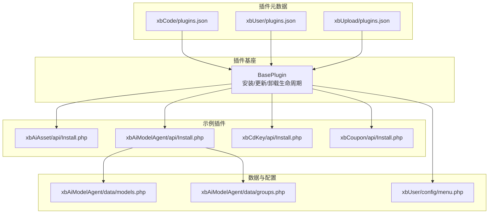
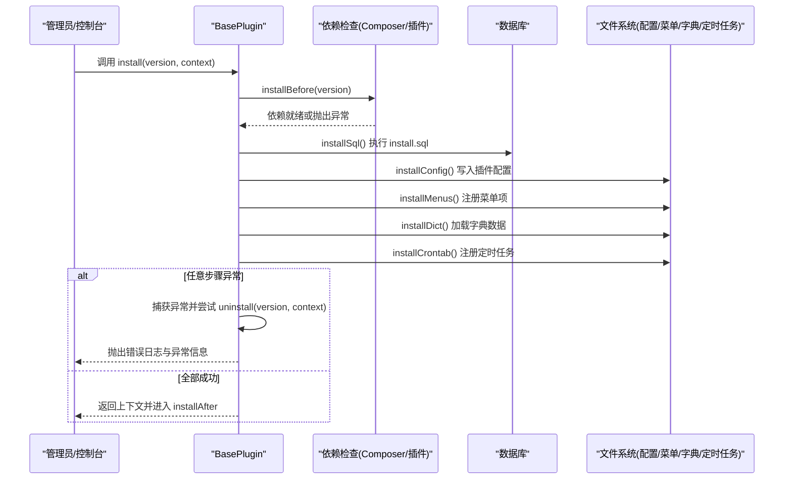
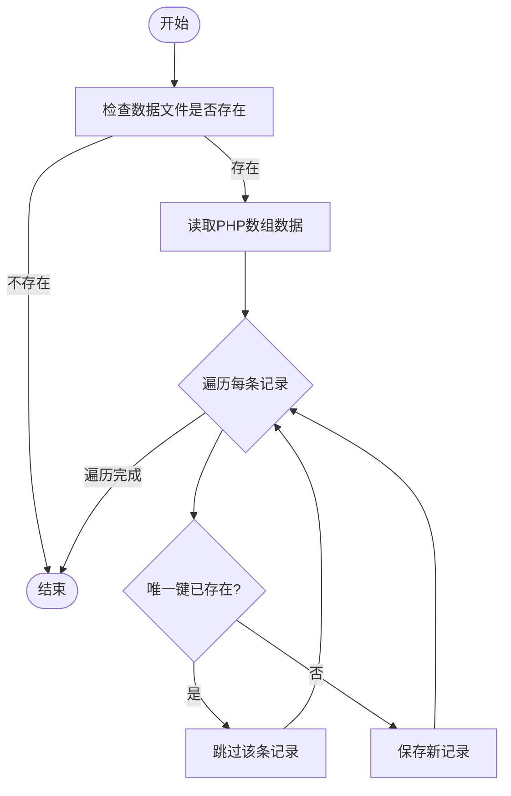
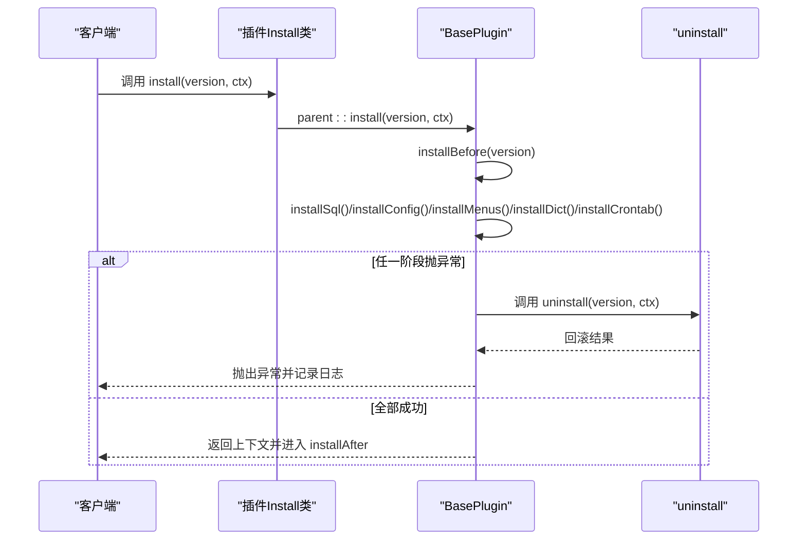
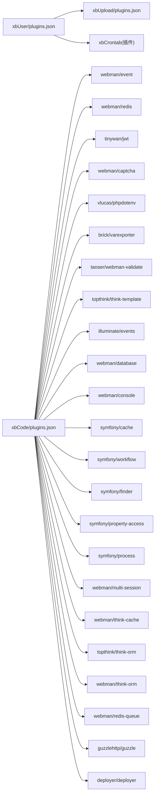

# 插件安装流程

<cite>
**本文引用的文件**   
- [BasePlugin.php](file://server/plugin\xbCode\base\BasePlugin.php)
- [Install.php（xbAiAsset）](file://server/plugin\xbAiAsset\api\Install.php)
- [Install.php（xbAiModelAgent）](file://server/plugin\xbAiModelAgent\api\Install.php)
- [Install.php（xbCdKey）](file://server/plugin\xbCdKey\api\Install.php)
- [Install.php（xbCoupon）](file://server/plugin\xbCoupon\api\Install.php)
- [plugins.json（xbCode）](file://server/plugin\xbCode\plugins.json)
- [plugins.json（xbUser）](file://server/plugin\xbUser\plugins.json)
- [plugins.json（xbUpload）](file://server/plugin\xbUpload\plugins.json)
- [models.php（xbAiModelAgent）](file://server/plugin\xbAiModelAgent\data\models.php)
- [groups.php（xbAiModelAgent）](file://server/plugin\xbAiModelAgent\data\groups.php)
- [menu.php（xbUser）](file://server/plugin\xbUser\config\menu.php)
</cite>

## 目录
1. [简介](#简介)
2. [项目结构](#项目结构)
3. [核心组件](#核心组件)
4. [架构总览](#架构总览)
5. [详细组件分析](#详细组件分析)
6. [依赖关系分析](#依赖关系分析)
7. [性能与一致性考虑](#性能与一致性考虑)
8. [故障排查指南](#故障排查指南)
9. [结论](#结论)
10. [附录：安装脚本编写规范](#附录安装脚本编写规范)

## 简介
本文件面向插件开发者与维护者，系统化阐述插件安装流程的技术实现与最佳实践。内容覆盖前置检查（Composer 依赖、插件依赖、环境检测）、数据库表创建、初始数据导入、配置文件写入、菜单项注册、字典数据加载、定时任务设置，以及异常处理、事务回滚和数据一致性保证。同时提供安装脚本编写规范与常见问题解决方案，帮助快速构建稳定可靠的插件安装能力。

## 项目结构
本项目采用“插件化”组织方式，每个插件位于 server/plugin/<插件名> 目录下，包含 API、配置、数据、枚举、服务、设置等子目录。安装入口统一由 BasePlugin 提供的生命周期方法驱动，具体插件通过 api/Install.php 扩展安装逻辑。

图表来源
- [BasePlugin.php:164-189](file://server/plugin\xbCode\base\BasePlugin.php#L164-L189)
- [Install.php（xbAiModelAgent）:31-39](file://server/plugin\xbAiModelAgent\api\Install.php#L31-L39)
- [plugins.json（xbCode）:1-34](file://server/plugin\xbCode\plugins.json#L1-L34)
- [plugins.json（xbUser）:1-12](file://server/plugin\xbUser\plugins.json#L1-L12)
- [plugins.json（xbUpload）:1-9](file://server/plugin\xbUpload\plugins.json#L1-L9)
- [models.php（xbAiModelAgent）:1-800](file://server/plugin\xbAiModelAgent\data\models.php#L1-L800)
- [groups.php（xbAiModelAgent）:1-83](file://server/plugin\xbAiModelAgent\data\groups.php#L1-L83)
- [menu.php（xbUser）:1-189](file://server/plugin\xbUser\config\menu.php#L1-L189)

章节来源
- [BasePlugin.php:164-189](file://server/plugin\xbCode\base\BasePlugin.php#L164-L189)
- [plugins.json（xbCode）:1-34](file://server/plugin\xbCode\plugins.json#L1-L34)
- [plugins.json（xbUser）:1-12](file://server/plugin\xbUser\plugins.json#L1-L12)
- [plugins.json（xbUpload）:1-9](file://server/plugin\xbUpload\plugins.json#L1-L9)

## 核心组件
- 插件基类 BasePlugin：提供 installBefore/install/installAfter/update/updateAfter/uninstallBefore/uninstall/uninstallAfter 完整生命周期；在 install 中按序执行数据库、配置、菜单、字典、定时任务的安装；在异常时尝试回滚卸载以保证一致性。
- 各插件 Install.php：继承 BasePlugin，按需重写 install/update/uninstall，并在 install 中调用 parent::install 后追加业务初始化（如导入模型与分组数据）。
- 插件元数据 plugins.json：声明插件标题、版本、作者、描述、Composer 依赖、插件间依赖等，供安装前置检查使用。
- 数据与配置：data/*.php 用于初始数据导入；config/menu.php 定义菜单树；install.sql 用于建表与初始数据（由基类自动执行）。

章节来源
- [BasePlugin.php:136-189](file://server/plugin\xbCode\base\BasePlugin.php#L136-L189)
- [Install.php（xbAiModelAgent）:31-39](file://server/plugin\xbAiModelAgent\api\Install.php#L31-L39)
- [plugins.json（xbCode）:1-34](file://server/plugin\xbCode\plugins.json#L1-L34)
- [plugins.json（xbUser）:1-12](file://server/plugin\xbUser\plugins.json#L1-L12)
- [plugins.json（xbUpload）:1-9](file://server/plugin\xbUpload\plugins.json#L1-L9)

## 架构总览
下图展示从触发安装到完成资源注册的端到端流程，包括前置检查、SQL 执行、配置/菜单/字典/定时任务注册，以及失败时的回滚策略。

图表来源
- [BasePlugin.php:136-189](file://server/plugin\xbCode\base\BasePlugin.php#L136-L189)

## 详细组件分析

### 安装前置检查机制
- Composer 依赖检查与安装
  - 先尝试检测已安装的 Composer 包；若未安装且错误码指示需要安装，则触发 Composer 安装流程。
  - 插件的 composer 字段声明了所需包的映射关系，供检查与安装使用。
- 插件依赖验证
  - 校验当前插件是否依赖其他插件，确保被依赖插件已安装；否则抛出异常阻止继续安装。
- 环境检测
  - 可在 installBefore 中扩展更多环境检查（如 PHP 扩展、数据库连接、外部服务可达性等），此处为预留扩展点。

章节来源
- [BasePlugin.php:136-154](file://server/plugin\xbCode\base\BasePlugin.php#L136-L154)
- [plugins.json（xbCode）:7-32](file://server/plugin\xbCode\plugins.json#L7-L32)
- [plugins.json（xbUser）:8-11](file://server/plugin\xbUser\plugins.json#L8-L11)
- [plugins.json（xbUpload）:7-8](file://server/plugin\xbUpload\plugins.json#L7-L8)

### 数据库表结构与初始数据
- 建表与初始数据
  - 基类在 install 阶段自动执行插件根目录下的 install.sql，完成建表与基础数据导入。
- 增量数据导入
  - 部分插件在 install 中额外导入结构化数据（例如 xbAiModelAgent 从 data/models.php 与 data/groups.php 导入模型与分组）。
  - 导入逻辑通常包含存在性判断（按唯一键判重），避免重复插入。

图表来源
- [Install.php（xbAiModelAgent）:75-102](file://server/plugin\xbAiModelAgent\api\Install.php#L75-L102)
- [Install.php（xbAiModelAgent）:111-143](file://server/plugin\xbAiModelAgent\api\Install.php#L111-L143)
- [models.php（xbAiModelAgent）:1-800](file://server/plugin\xbAiModelAgent\data\models.php#L1-L800)
- [groups.php（xbAiModelAgent）:1-83](file://server/plugin\xbAiModelAgent\data\groups.php#L1-L83)

章节来源
- [BasePlugin.php:164-189](file://server/plugin\xbCode\base\BasePlugin.php#L164-L189)
- [Install.php（xbAiModelAgent）:31-39](file://server/plugin\xbAiModelAgent\api\Install.php#L31-L39)
- [Install.php（xbAiModelAgent）:75-102](file://server/plugin\xbAiModelAgent\api\Install.php#L75-L102)
- [Install.php（xbAiModelAgent）:111-143](file://server/plugin\xbAiModelAgent\api\Install.php#L111-L143)
- [models.php（xbAiModelAgent）:1-800](file://server/plugin\xbAiModelAgent\data\models.php#L1-L800)
- [groups.php（xbAiModelAgent）:1-83](file://server/plugin\xbAiModelAgent\data\groups.php#L1-L83)

### 配置文件写入
- 基类在 install 阶段会执行 installConfig，将插件 setting/tabs 下定义的表单配置持久化至系统配置存储。
- 插件可通过 setting/tabs/panel.php 定义可配置的字段与默认值，安装时自动落库。

章节来源
- [BasePlugin.php:164-189](file://server/plugin\xbCode\base\BasePlugin.php#L164-L189)

### 菜单项注册
- 基类在 install 阶段执行 installMenus，扫描并注册插件 config/menu.php 中的菜单树。
- 菜单项支持层级结构、权限标识、显示控制与排序等属性。

章节来源
- [BasePlugin.php:164-189](file://server/plugin\xbCode\base\BasePlugin.php#L164-L189)
- [menu.php（xbUser）:1-189](file://server/plugin\xbUser\config\menu.php#L1-L189)

### 字典数据加载
- 基类在 install 阶段执行 installDict，加载插件字典数据（通常为 data/dict/*.php 或类似约定路径），供前端下拉框、状态枚举等使用。
- 建议以“组+键”的形式组织字典，便于管理与查询。

章节来源
- [BasePlugin.php:164-189](file://server/plugin\xbCode\base\BasePlugin.php#L164-L189)

### 定时任务设置
- 基类在 install 阶段执行 installCrontab，注册插件所需的定时任务（如清理过期数据、统计汇总等）。
- 建议在 update 与 uninstall 中也同步维护任务列表，保证版本升级与卸载的一致性。

章节来源
- [BasePlugin.php:164-189](file://server/plugin\xbCode\base\BasePlugin.php#L164-L189)

### 安装流程时序图（含回滚）

图表来源
- [BasePlugin.php:164-189](file://server/plugin\xbCode\base\BasePlugin.php#L164-L189)

## 依赖关系分析
- 插件元数据与依赖
  - plugins.json 中的 composer 字段声明第三方包依赖，安装前进行存在性检查，必要时触发安装。
  - plugins.json 中的 plugins 字段声明插件级依赖，安装前进行存在性检查，不满足则中断安装。
- 典型依赖链
  - xbUser 依赖 xbUpload 与 xbCrontab；xbCode 作为核心框架声明大量第三方包。

图表来源
- [plugins.json（xbUser）:8-11](file://server/plugin\xbUser\plugins.json#L8-L11)
- [plugins.json（xbUpload）:1-9](file://server/plugin\xbUpload\plugins.json#L1-L9)
- [plugins.json（xbCode）:7-32](file://server/plugin\xbCode\plugins.json#L7-L32)

章节来源
- [plugins.json（xbUser）:8-11](file://server/plugin\xbUser\plugins.json#L8-L11)
- [plugins.json（xbUpload）:1-9](file://server/plugin\xbUpload\plugins.json#L1-L9)
- [plugins.json（xbCode）:7-32](file://server/plugin\xbCode\plugins.json#L7-L32)

## 性能与一致性考虑
- 幂等性设计
  - 所有安装操作应幂等：重复安装不应产生副作用。对数据库插入使用唯一键判重；对配置/菜单/字典/任务注册采用“存在即跳过”的策略。
- 事务与回滚
  - 在 install 内部发生异常时，基类会尝试调用 uninstall 进行回滚，尽量保持系统一致。对于长耗时或外部依赖的操作，建议拆分为小单元，减少回滚成本。
- 批量导入优化
  - 大数据量导入建议使用批量写入与分批次提交，避免单次事务过大导致锁竞争与超时。
- 缓存与索引
  - 安装完成后及时刷新相关缓存；对高频查询字段建立合适索引，提升后续访问性能。

[本节为通用指导，无需代码引用]

## 故障排查指南
- 常见错误与定位
  - 依赖缺失：检查 plugins.json 的 composer 与 plugins 字段是否正确；确认网络与镜像源可用。
  - SQL 执行失败：核对 install.sql 语法与目标库字符集；查看错误日志定位具体语句。
  - 菜单/字典/任务未生效：确认对应配置文件路径与命名是否符合约定；检查权限与缓存。
- 日志与调试
  - 安装异常会被记录到系统日志，结合错误信息与堆栈快速定位问题。
  - 可在 installBefore 中增加环境探测输出，辅助定位运行环境问题。

章节来源
- [BasePlugin.php:177-186](file://server/plugin\xbCode\base\BasePlugin.php#L177-L186)

## 结论
通过统一的 BasePlugin 生命周期与标准化的插件元数据，本项目的插件安装流程具备高内聚、低耦合、可扩展与强一致的特点。遵循幂等性与回滚策略，配合完善的依赖检查与资源注册，能够保障插件在不同环境下的稳定部署。

[本节为总结性内容，无需代码引用]

## 附录：安装脚本编写规范
- 文件与命名
  - 安装入口：plugin/<插件名>/api/Install.php，继承 BasePlugin 并重写 install/update/uninstall。
  - 元数据：plugin/<插件名>/plugins.json，声明 title、version、composer、plugins 等。
  - 数据库：plugin/<插件名>/install.sql，用于建表与基础数据。
  - 菜单：plugin/<插件名>/config/menu.php，定义菜单树。
  - 字典：plugin/<插件名>/data/dict/*.php，按组组织字典数据。
  - 定时任务：在 installCrontab 中注册，或在 plugin 的 process/command 中提供任务实现。
- 安装顺序建议
  - 先执行 installBefore 进行依赖与环境检查；再执行 installSql 建表；随后依次安装配置、菜单、字典、定时任务。
- 幂等与健壮性
  - 所有写入操作需具备幂等性；对外部依赖进行容错与重试；关键路径加日志与异常捕获。
- 版本升级与卸载
  - update 中仅做增量变更；uninstall 中反向删除配置、菜单、字典、任务与数据库对象，确保干净卸载。
- 参考实现
  - 简单安装：参考 xbAiAsset、xbCdKey、xbCoupon 的 Install.php。
  - 复杂安装：参考 xbAiModelAgent 的 Install.php，演示从 data/*.php 导入模型与分组数据。

章节来源
- [Install.php（xbAiAsset）:29-34](file://server/plugin\xbAiAsset\api\Install.php#L29-L34)
- [Install.php（xbCdKey）:29-34](file://server/plugin\xbCdKey\api\Install.php#L29-L34)
- [Install.php（xbCoupon）:29-33](file://server/plugin\xbCoupon\api\Install.php#L29-L33)
- [Install.php（xbAiModelAgent）:31-39](file://server/plugin\xbAiModelAgent\api\Install.php#L31-L39)
- [BasePlugin.php:164-189](file://server/plugin\xbCode\base\BasePlugin.php#L164-L189)