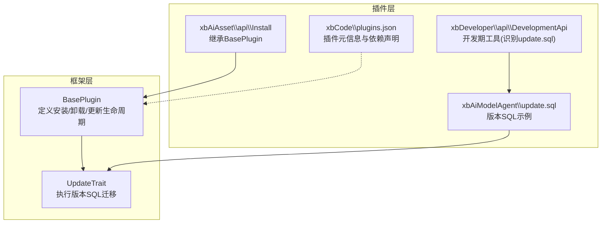
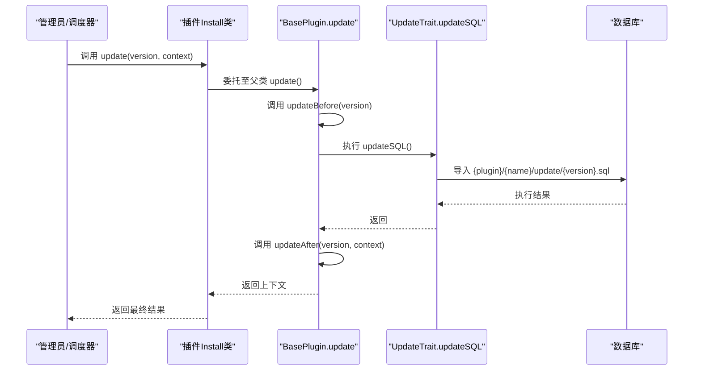
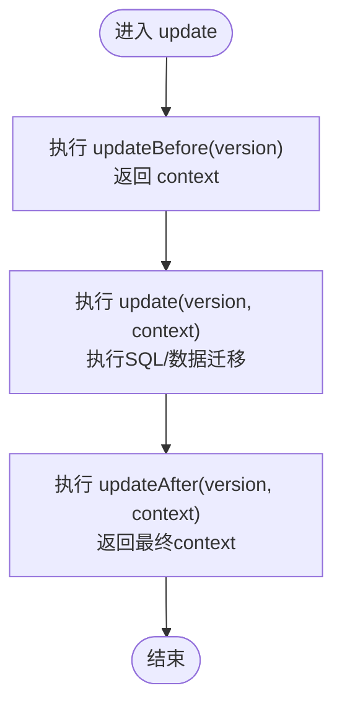
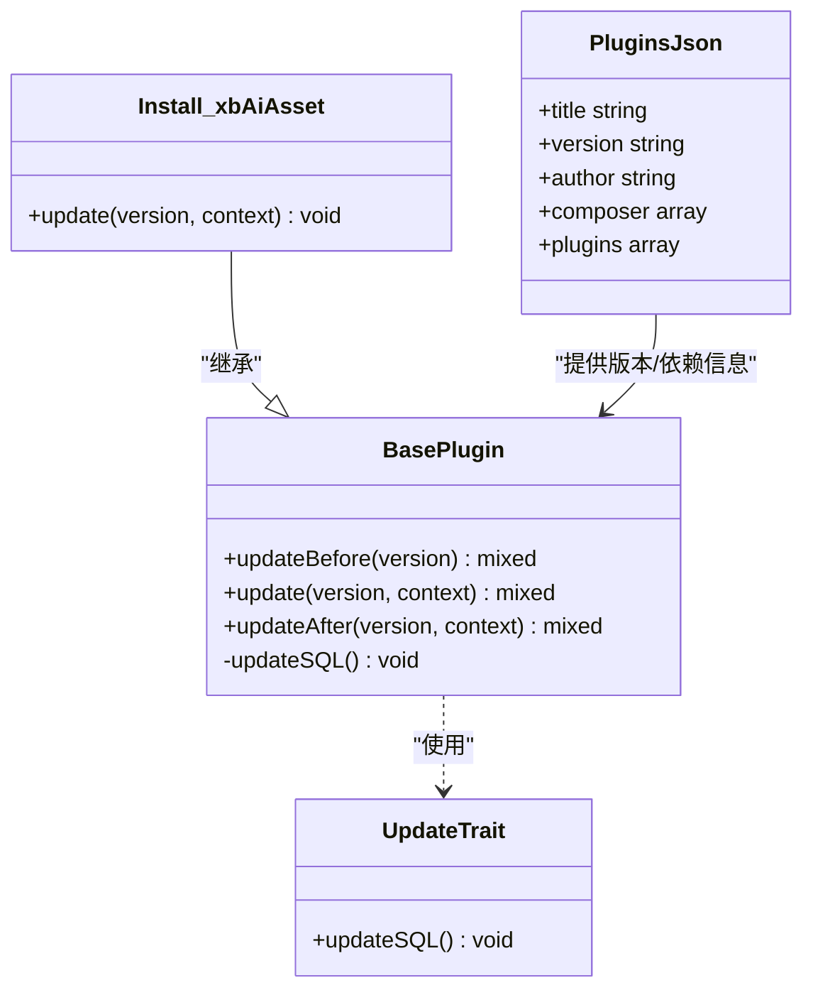

# 插件更新机制

<cite>
**本文引用的文件**
- [BasePlugin.php](file://server/plugin/xbCode/base/BasePlugin.php)
- [UpdateTrait.php](file://server/plugin/xbCode/base/plugin/UpdateTrait.php)
- [Install.php（xbAiAsset）](file://server/plugin/xbAiAsset/api/Install.php)
- [plugins.json（xbCode）](file://server/plugin/xbCode/plugins.json)
- [update.sql（xbAiModelAgent）](file://server/plugin/xbAiModelAgent/update.sql)
- [DevelopmentApi.php（xbDeveloper）](file://server/plugin/xbDeveloper/api/DevelopmentApi.php)
</cite>

## 目录
1. [简介](#简介)
2. [项目结构](#项目结构)
3. [核心组件](#核心组件)
4. [架构总览](#架构总览)
5. [详细组件分析](#详细组件分析)
6. [依赖关系分析](#依赖关系分析)
7. [性能与一致性考虑](#性能与一致性考虑)
8. [故障排查指南](#故障排查指南)
9. [结论](#结论)
10. [附录：版本升级脚本编写规范与回滚策略](#附录版本升级脚本编写规范与回滚策略)

## 简介
本技术文档围绕插件更新机制，系统阐述版本比较算法、增量更新策略、数据迁移方案以及 updateBefore/update/updateAfter 钩子的实现与上下文传递。结合代码仓库中的实际实现，说明数据库结构变更、配置项升级、业务数据迁移与兼容性处理的最佳实践，并提供版本升级脚本编写规范、回滚策略与故障恢复方案，帮助开发者安全、可控地推进插件版本演进。

## 项目结构
插件更新能力由框架层提供统一基类与特性，具体插件通过继承基类并遵循约定路径放置 SQL 升级脚本，从而获得一致的升级体验。

图示来源
- [BasePlugin.php:26-249](file://server/plugin/xbCode/base/BasePlugin.php#L26-L249)
- [UpdateTrait.php:20-48](file://server/plugin/xbCode/base/plugin/UpdateTrait.php#L20-L48)
- [Install.php（xbAiAsset）:19-47](file://server/plugin/xbAiAsset/api/Install.php#L19-L47)
- [update.sql（xbAiModelAgent）:1-25](file://server/plugin/xbAiModelAgent/update.sql#L1-L25)
- [DevelopmentApi.php（xbDeveloper）:200-206](file://server/plugin/xbDeveloper/api/DevelopmentApi.php#L200-L206)
- [plugins.json（xbCode）:1-34](file://server/plugin/xbCode/plugins.json#L1-L34)

章节来源
- [BasePlugin.php:26-249](file://server/plugin/xbCode/base/BasePlugin.php#L26-L249)
- [UpdateTrait.php:20-48](file://server/plugin/xbCode/base/plugin/UpdateTrait.php#L20-L48)
- [Install.php（xbAiAsset）:19-47](file://server/plugin/xbAiAsset/api/Install.php#L19-L47)
- [plugins.json（xbCode）:1-34](file://server/plugin/xbCode/plugins.json#L1-L34)

## 核心组件
- BasePlugin：定义插件生命周期方法 install/installBefore/installAfter、uninstall/uninstallBefore/uninstallAfter、update/updateBefore/updateAfter；在 update 中调用 updateSQL 完成版本化数据库迁移。
- UpdateTrait：实现 updateSQL，按“plugin/{name}/update/{version}.sql”路径加载并导入 SQL，自动替换表前缀。
- 插件 Install 类：各插件的 api/Install.php 继承 BasePlugin，可重写 update/updateBefore/updateAfter 以扩展升级逻辑。
- 版本 SQL 示例：xbAiModelAgent/update.sql 展示字段增删、类型修改等典型变更。
- 开发期工具：xbDeveloper/api/DevelopmentApi.php 在开发阶段识别 update.sql 文件，辅助生成或校验升级脚本。
- 插件元信息：plugins.json 描述插件标题、版本、作者、依赖等，为版本比较与依赖检查提供基础。

章节来源
- [BasePlugin.php:204-249](file://server/plugin/xbCode/base/BasePlugin.php#L204-L249)
- [UpdateTrait.php:20-48](file://server/plugin/xbCode/base/plugin/UpdateTrait.php#L20-L48)
- [Install.php（xbAiAsset）:19-47](file://server/plugin/xbAiAsset/api/Install.php#L19-L47)
- [update.sql（xbAiModelAgent）:1-25](file://server/plugin/xbAiModelAgent/update.sql#L1-L25)
- [DevelopmentApi.php（xbDeveloper）:200-206](file://server/plugin/xbDeveloper/api/DevelopmentApi.php#L200-L206)
- [plugins.json（xbCode）:1-34](file://server/plugin/xbCode/plugins.json#L1-L34)

## 架构总览
下图展示了从“触发更新”到“执行迁移”的关键流程，包括前置钩子、版本 SQL 执行与后置钩子，以及异常时的日志记录与抛出。

图示来源
- [BasePlugin.php:204-249](file://server/plugin/xbCode/base/BasePlugin.php#L204-L249)
- [UpdateTrait.php:20-48](file://server/plugin/xbCode/base/plugin/UpdateTrait.php#L20-L48)

## 详细组件分析

### 版本比较与增量更新策略
- 版本标识来源：插件元信息 plugins.json 中的 version 字段作为目标版本标识。
- 增量定位规则：框架在更新时根据当前插件名与目标版本拼接 SQL 文件路径 plugin/{name}/update/{version}.sql，若存在则执行，不存在则跳过。该策略天然支持增量式升级，每个版本一个独立 SQL 文件。
- 版本比较算法建议：
  - 语义化版本比较：将字符串版本解析为 major.minor.patch 三元组进行数值比较，确保 1.2.10 > 1.2.9。
  - 预发布与构建元数据：如 1.2.0-beta.1 应小于 1.2.0，且相同主版本内按次版本递增顺序执行。
  - 幂等性约束：无论比较结果如何，SQL 必须幂等（使用 IF NOT EXISTS、ALTER ... ADD COLUMN IF NOT EXISTS 等），避免重复执行导致失败。
  - 断点续跑：对长耗时任务分片写入中间状态，允许中断后继续。

章节来源
- [plugins.json（xbCode）:1-34](file://server/plugin/xbCode/plugins.json#L1-L34)
- [UpdateTrait.php:20-48](file://server/plugin/xbCode/base/plugin/UpdateTrait.php#L20-L48)

### 数据迁移方案与兼容性处理
- 数据库结构变更：
  - 新增列：优先采用“默认值+非空”策略，保证旧数据兼容。
  - 删除列：先标记废弃，再在后续版本移除，避免破坏既有查询。
  - 修改列类型：先在临时列迁移数据，再原子切换，必要时加索引重建。
  - 前缀替换：UpdateTrait 会自动将 __PREFIX__/php_/xb_ 替换为目标前缀，确保多实例部署一致性。
- 配置项升级：
  - 在 updateBefore 中读取旧配置，按需迁移到新键名或新结构，并在 updateAfter 中持久化。
  - 提供向后兼容的默认值，避免未显式配置的站点出现运行时错误。
- 业务数据迁移：
  - 大表迁移分批处理，避免锁表过久。
  - 使用事务包裹关键步骤，失败即回滚。
  - 对可能产生副作用的操作（如外部 API 调用）增加重试与幂等键。

章节来源
- [UpdateTrait.php:20-48](file://server/plugin/xbCode/base/plugin/UpdateTrait.php#L20-L48)
- [update.sql（xbAiModelAgent）:1-25](file://server/plugin/xbAiModelAgent/update.sql#L1-L25)

### updateBefore / update / updateAfter 钩子与上下文传递
- 钩子职责划分：
  - updateBefore：准备阶段，校验依赖、导出快照、计算差异、创建临时对象。
  - update：核心迁移阶段，执行 SQL、批量数据迁移、资源初始化。
  - updateAfter：收尾阶段，清理临时对象、刷新缓存、通知下游。
- 上下文传递：
  - 框架在 updateBefore 返回值作为 context 传入 update，再由 update 返回值传入 updateAfter。
  - 建议在 context 中仅传递轻量引用（如迁移批次ID、临时表名、统计摘要），避免携带大数据。
- 异常与回滚：
  - 更新过程抛出的异常会被记录日志并向上抛出，调用方需据此决定是否回滚。
  - 建议在 updateBefore 中建立快照，updateAfter 中基于快照做补偿。

图示来源
- [BasePlugin.php:204-249](file://server/plugin/xbCode/base/BasePlugin.php#L204-L249)

章节来源
- [BasePlugin.php:204-249](file://server/plugin/xbCode/base/BasePlugin.php#L204-L249)
- [Install.php（xbAiAsset）:19-47](file://server/plugin/xbAiAsset/api/Install.php#L19-L47)

### 数据库结构变更示例与最佳实践
- 示例：xbAiModelAgent/update.sql 演示了字段删除、类型修改、新增金额字段等常见变更。
- 最佳实践：
  - 所有 DDL 语句尽量幂等，避免重复执行报错。
  - 对大表变更采用在线DDL工具或分步策略，降低锁表时间。
  - 变更前后保留审计日志，便于问题回溯。

章节来源
- [update.sql（xbAiModelAgent）:1-25](file://server/plugin/xbAiModelAgent/update.sql#L1-L25)

### 开发期工具与脚本管理
- DevelopmentApi 在开发阶段识别 update.sql 文件，便于快速验证升级脚本。
- 建议将 update.sql 纳入版本控制，并与插件版本一一对应，保持可追溯性。

章节来源
- [DevelopmentApi.php（xbDeveloper）:200-206](file://server/plugin/xbDeveloper/api/DevelopmentApi.php#L200-L206)

## 依赖关系分析
- BasePlugin 组合了安装、更新、卸载三大特性，其中更新能力由 UpdateTrait 提供。
- 插件 Install 类通过继承 BasePlugin 获得统一的更新生命周期。
- 版本 SQL 文件位于插件目录下的 update 子目录，命名与版本一致。
- 插件元信息 plugins.json 提供版本与依赖声明，支撑版本比较与依赖检查。

图示来源
- [BasePlugin.php:26-249](file://server/plugin/xbCode/base/BasePlugin.php#L26-L249)
- [UpdateTrait.php:20-48](file://server/plugin/xbCode/base/plugin/UpdateTrait.php#L20-L48)
- [Install.php（xbAiAsset）:19-47](file://server/plugin/xbAiAsset/api/Install.php#L19-L47)
- [plugins.json（xbCode）:1-34](file://server/plugin/xbCode/plugins.json#L1-L34)

章节来源
- [BasePlugin.php:26-249](file://server/plugin/xbCode/base/BasePlugin.php#L26-L249)
- [UpdateTrait.php:20-48](file://server/plugin/xbCode/base/plugin/UpdateTrait.php#L20-L48)
- [Install.php（xbAiAsset）:19-47](file://server/plugin/xbAiAsset/api/Install.php#L19-L47)
- [plugins.json（xbCode）:1-34](file://server/plugin/xbCode/plugins.json#L1-L34)

## 性能与一致性考虑
- 事务边界：将多条 DDL/DML 放入同一事务，失败整体回滚，保障一致性。
- 批处理与分页：对大批量数据迁移采用分批处理，减少内存占用与锁竞争。
- 索引优化：迁移期间谨慎重建索引，必要时在低峰期执行。
- 幂等设计：所有迁移脚本具备幂等性，支持重复执行与断点续跑。
- 监控与告警：记录关键步骤耗时与影响行数，设置阈值告警。

[本节为通用指导，不直接分析具体文件]

## 故障排查指南
- 常见问题
  - 版本 SQL 缺失：确认 plugin/{name}/update/{version}.sql 是否存在且可读。
  - 表前缀不一致：检查数据库连接配置与前缀替换逻辑是否生效。
  - 依赖未满足：在 updateBefore 中校验依赖插件与 Composer 包，提前失败并提示。
  - 长时间锁表：拆分大表变更，使用在线DDL工具或分步迁移。
- 日志与追踪
  - 更新过程中的异常会被记录日志，建议结合上下文 ID 进行链路追踪。
  - 在 updateBefore/updateAfter 中输出关键步骤日志，便于定位问题。
- 回滚建议
  - 变更前备份关键表结构与数据快照。
  - 提供反向 SQL（降级脚本），在紧急情况下快速回退。

章节来源
- [BasePlugin.php:225-236](file://server/plugin/xbCode/base/BasePlugin.php#L225-L236)
- [UpdateTrait.php:20-48](file://server/plugin/xbCode/base/plugin/UpdateTrait.php#L20-L48)

## 结论
插件更新机制通过 BasePlugin 与 UpdateTrait 提供了标准化的生命周期与增量迁移能力。配合 plugins.json 的版本管理与 update.sql 的幂等设计，可实现安全可控的持续演进。建议在 updateBefore 做好前置校验与快照，在 update 中专注迁移逻辑，在 updateAfter 完成收尾与补偿，并结合完善的日志与回滚策略，保障生产环境的稳定性。

[本节为总结性内容，不直接分析具体文件]

## 附录：版本升级脚本编写规范与回滚策略

### 版本比较与排序
- 使用语义化版本（major.minor.patch[-prerelease][+build]）。
- 比较时忽略 build 元数据，pre-release 版本小于对应正式版本。
- 对历史遗留的非标准版本进行规范化映射后再比较。

### 增量更新策略
- 每个版本一个 SQL 文件，文件名与版本一致。
- 所有 DDL/DML 必须幂等，避免重复执行报错。
- 大表变更采用分步策略：新增列→填充数据→切换默认值→删除旧列。

### 数据迁移与兼容性
- 新增字段提供合理默认值，避免旧数据访问异常。
- 弃用字段保留至少两个小版本，再行删除。
- 对外部依赖（存储、消息队列）变更提供开关与降级路径。

### 钩子使用建议
- updateBefore：依赖检查、环境校验、快照导出、临时对象创建。
- update：核心迁移，包含 SQL 执行与数据转换，严格事务控制。
- updateAfter：清理临时对象、刷新缓存、发送通知、指标上报。

### 回滚与恢复
- 变更前备份：表结构、关键配置、业务数据快照。
- 提供反向脚本：针对每条变更编写对应的降级 SQL。
- 灰度与演练：先在测试/预发环境演练，再逐步放量。
- 监控与告警：对迁移耗时、错误率、影响行数设置阈值告警。

[本节为通用规范，不直接分析具体文件]