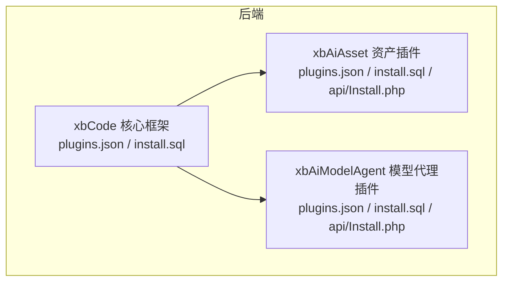
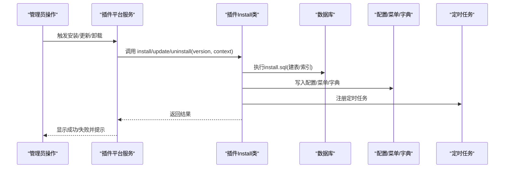
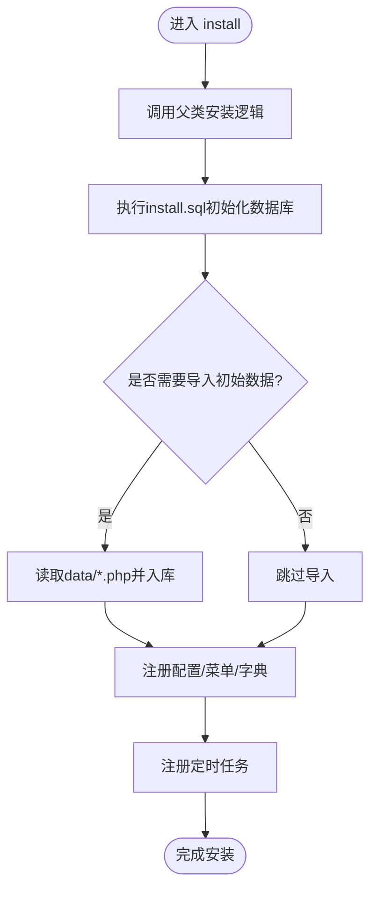
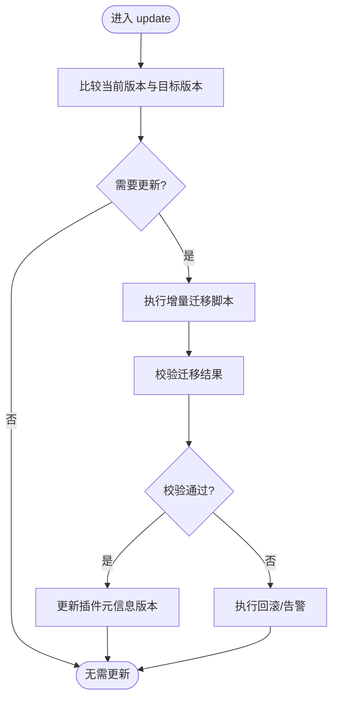
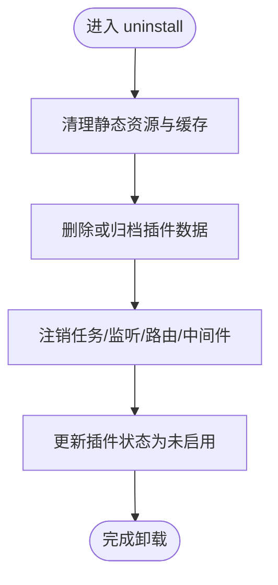
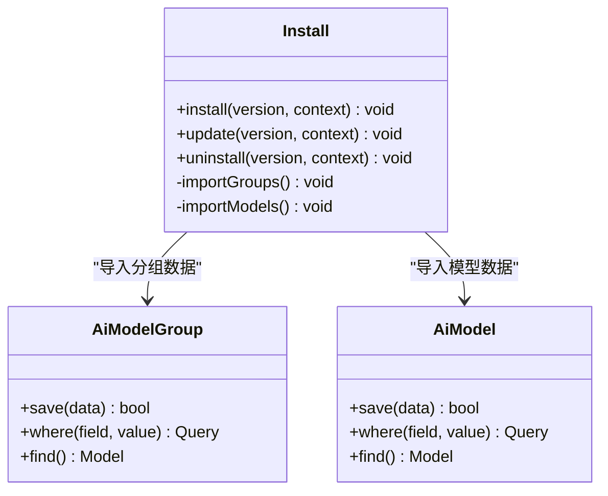
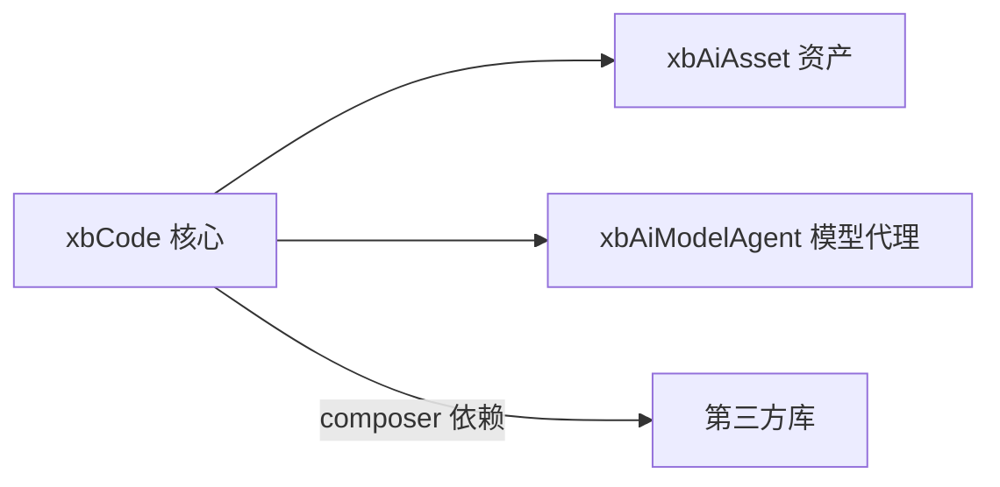

# 插件生命周期管理

<cite>
**本文引用的文件**   
- [server/plugin/xbCode/plugins.json](file://server/plugin/xbCode/plugins.json)
- [server/plugin/xbAiAsset/plugins.json](file://server/plugin/xbAiAsset/plugins.json)
- [server/plugin/xbAiModelAgent/plugins.json](file://server/plugin/xbAiModelAgent/plugins.json)
- [server/plugin/xbCode/api/Install.php](file://server/plugin/xbCode/api/Install.php)
- [server/plugin/xbAiAsset/api/Install.php](file://server/plugin/xbAiAsset/api/Install.php)
- [server/plugin/xbAiModelAgent/api/Install.php](file://server/plugin/xbAiModelAgent/api/Install.php)
- [server/plugin/xbCode/install.sql](file://server/plugin/xbCode/install.sql)
- [server/plugin/xbAiAsset/install.sql](file://server/plugin/xbAiAsset/install.sql)
- [server/plugin/xbAiModelAgent/install.sql](file://server/plugin/xbAiModelAgent/install.sql)
</cite>

## 目录
1. [简介](#简介)
2. [项目结构](#项目结构)
3. [核心组件](#核心组件)
4. [架构总览](#架构总览)
5. [详细组件分析](#详细组件分析)
6. [依赖分析](#依赖分析)
7. [性能考虑](#性能考虑)
8. [故障排查指南](#故障排查指南)
9. [结论](#结论)
10. [附录](#附录)

## 简介
本文件面向积木云AI创作平台的插件体系，系统化阐述插件的完整生命周期：安装前置检测、依赖验证、数据库初始化、配置安装、菜单注册、字典导入、定时任务设置；更新机制的版本比较、增量升级、数据迁移与回滚策略；卸载流程的资源清理、数据删除与依赖解除。同时给出异常处理、事务管理与错误恢复建议，并提供可落地的生命周期钩子实现要点与最佳实践。

## 项目结构
仓库采用前后端分离结构，后端基于Webman框架，插件位于 server/plugin 下，每个插件包含独立的元信息、API入口、SQL脚本与业务代码。核心框架插件 xbCode 提供插件化基础能力，其他业务插件（如 xbAiAsset、xbAiModelAgent）在其之上扩展。

图表来源
- [server/plugin/xbCode/plugins.json:1-34](file://server/plugin/xbCode/plugins.json#L1-L34)
- [server/plugin/xbAiAsset/plugins.json:1-9](file://server/plugin/xbAiAsset/plugins.json#L1-L9)
- [server/plugin/xbAiModelAgent/plugins.json:1-9](file://server/plugin/xbAiModelAgent/plugins.json#L1-L9)

章节来源
- [server/plugin/xbCode/plugins.json:1-34](file://server/plugin/xbCode/plugins.json#L1-L34)
- [server/plugin/xbAiAsset/plugins.json:1-9](file://server/plugin/xbAiAsset/plugins.json#L1-L9)
- [server/plugin/xbAiModelAgent/plugins.json:1-9](file://server/plugin/xbAiModelAgent/plugins.json#L1-L9)

## 核心组件
- 插件元信息与依赖声明
  - 每个插件根目录包含 plugins.json，用于描述标题、版本、作者、描述及 composer 依赖映射。
- 插件安装/更新/卸载钩子
  - 每个插件在 api/Install.php 中继承 BasePlugin，暴露 install/update/uninstall 三个生命周期方法。
- 数据库初始化脚本
  - 每个插件根目录包含 install.sql，定义建表与索引等DDL语句。

章节来源
- [server/plugin/xbCode/plugins.json:1-34](file://server/plugin/xbCode/plugins.json#L1-L34)
- [server/plugin/xbAiAsset/plugins.json:1-9](file://server/plugin/xbAiAsset/plugins.json#L1-L9)
- [server/plugin/xbAiModelAgent/plugins.json:1-9](file://server/plugin/xbAiModelAgent/plugins.json#L1-L9)
- [server/plugin/xbCode/api/Install.php:1-59](file://server/plugin/xbCode/api/Install.php#L1-L59)
- [server/plugin/xbAiAsset/api/Install.php:1-62](file://server/plugin/xbAiAsset/api/Install.php#L1-L62)
- [server/plugin/xbAiModelAgent/api/Install.php:1-144](file://server/plugin/xbAiModelAgent/api/Install.php#L1-L144)
- [server/plugin/xbCode/install.sql:1-91](file://server/plugin/xbCode/install.sql#L1-L91)
- [server/plugin/xbAiAsset/install.sql:1-105](file://server/plugin/xbAiAsset/install.sql#L1-L105)
- [server/plugin/xbAiModelAgent/install.sql:1-91](file://server/plugin/xbAiModelAgent/install.sql#L1-L91)

## 架构总览
下图展示插件生命周期关键阶段与主要参与方：平台控制器调用插件 Install 类的方法，执行依赖校验、SQL 初始化、数据导入、菜单与配置注册、定时任务注册等步骤，并在失败时进行回滚或记录日志。

图表来源
- [server/plugin/xbCode/api/Install.php:1-59](file://server/plugin/xbCode/api/Install.php#L1-L59)
- [server/plugin/xbAiAsset/api/Install.php:1-62](file://server/plugin/xbAiAsset/api/Install.php#L1-L62)
- [server/plugin/xbAiModelAgent/api/Install.php:1-144](file://server/plugin/xbAiModelAgent/api/Install.php#L1-L144)
- [server/plugin/xbCode/install.sql:1-91](file://server/plugin/xbCode/install.sql#L1-L91)
- [server/plugin/xbAiAsset/install.sql:1-105](file://server/plugin/xbAiAsset/install.sql#L1-L105)
- [server/plugin/xbAiModelAgent/install.sql:1-91](file://server/plugin/xbAiModelAgent/install.sql#L1-L91)

## 详细组件分析

### 插件元信息与依赖解析
- 元信息字段
  - title/version/desc/author/home_url/composer/plugins 等，用于平台识别与依赖解析。
- 依赖声明
  - composer 字段以键值对形式声明外部包名与约束，平台在安装前进行依赖检查与拉取。

章节来源
- [server/plugin/xbCode/plugins.json:1-34](file://server/plugin/xbCode/plugins.json#L1-L34)
- [server/plugin/xbAiAsset/plugins.json:1-9](file://server/plugin/xbAiAsset/plugins.json#L1-L9)
- [server/plugin/xbAiModelAgent/plugins.json:1-9](file://server/plugin/xbAiModelAgent/plugins.json#L1-L9)

### 安装流程（install）
- 通用流程
  - 调用父类安装逻辑，随后执行插件自定义安装步骤。
- 数据初始化
  - 执行 install.sql 完成表结构与索引创建。
- 数据导入
  - 部分插件在 install 中从 data/*.php 读取初始数据并写入数据库（例如模型与分组）。
- 配置/菜单/字典
  - 在 install 中写入系统配置、后台菜单与字典项，确保功能可用。
- 定时任务
  - 在 install 中注册插件所需的定时任务。

图表来源
- [server/plugin/xbCode/api/Install.php:1-59](file://server/plugin/xbCode/api/Install.php#L1-L59)
- [server/plugin/xbAiAsset/api/Install.php:1-62](file://server/plugin/xbAiAsset/api/Install.php#L1-L62)
- [server/plugin/xbAiModelAgent/api/Install.php:1-144](file://server/plugin/xbAiModelAgent/api/Install.php#L1-L144)
- [server/plugin/xbCode/install.sql:1-91](file://server/plugin/xbCode/install.sql#L1-L91)
- [server/plugin/xbAiAsset/install.sql:1-105](file://server/plugin/xbAiAsset/install.sql#L1-L105)
- [server/plugin/xbAiModelAgent/install.sql:1-91](file://server/plugin/xbAiModelAgent/install.sql#L1-L91)

章节来源
- [server/plugin/xbCode/api/Install.php:1-59](file://server/plugin/xbCode/api/Install.php#L1-L59)
- [server/plugin/xbAiAsset/api/Install.php:1-62](file://server/plugin/xbAiAsset/api/Install.php#L1-L62)
- [server/plugin/xbAiModelAgent/api/Install.php:1-144](file://server/plugin/xbAiModelAgent/api/Install.php#L1-L144)
- [server/plugin/xbCode/install.sql:1-91](file://server/plugin/xbCode/install.sql#L1-L91)
- [server/plugin/xbAiAsset/install.sql:1-105](file://server/plugin/xbAiAsset/install.sql#L1-L105)
- [server/plugin/xbAiModelAgent/install.sql:1-91](file://server/plugin/xbAiModelAgent/install.sql#L1-L91)

### 更新流程（update）与版本比较
- 版本比较
  - 通过插件元信息 version 与已安装版本对比，决定全量覆盖或增量升级。
- 增量升级
  - 在 update 中编写版本迁移逻辑，仅执行差异变更（新增字段、索引、数据修正等）。
- 数据迁移
  - 使用迁移脚本或条件分支按目标版本逐步演进，保证幂等性。
- 回滚策略
  - 若迁移失败，应记录快照并尝试回滚到上一稳定版本，或标记为不可用状态等待人工干预。

图表来源
- [server/plugin/xbCode/api/Install.php:1-59](file://server/plugin/xbCode/api/Install.php#L1-L59)
- [server/plugin/xbAiAsset/api/Install.php:1-62](file://server/plugin/xbAiAsset/api/Install.php#L1-L62)
- [server/plugin/xbAiModelAgent/api/Install.php:1-144](file://server/plugin/xbAiModelAgent/api/Install.php#L1-L144)

章节来源
- [server/plugin/xbCode/api/Install.php:1-59](file://server/plugin/xbCode/api/Install.php#L1-L59)
- [server/plugin/xbAiAsset/api/Install.php:1-62](file://server/plugin/xbAiAsset/api/Install.php#L1-L62)
- [server/plugin/xbAiModelAgent/api/Install.php:1-144](file://server/plugin/xbAiModelAgent/api/Install.php#L1-L144)

### 卸载流程（uninstall）
- 资源清理
  - 移除插件相关静态资源、缓存与临时文件。
- 数据删除
  - 根据策略删除插件数据表或软删除数据，避免影响其他插件。
- 依赖解除
  - 注销定时任务、事件监听器、中间件与路由等。

图表来源
- [server/plugin/xbCode/api/Install.php:1-59](file://server/plugin/xbCode/api/Install.php#L1-L59)
- [server/plugin/xbAiAsset/api/Install.php:1-62](file://server/plugin/xbAiAsset/api/Install.php#L1-L62)
- [server/plugin/xbAiModelAgent/api/Install.php:1-144](file://server/plugin/xbAiModelAgent/api/Install.php#L1-L144)

章节来源
- [server/plugin/xbCode/api/Install.php:1-59](file://server/plugin/xbCode/api/Install.php#L1-L59)
- [server/plugin/xbAiAsset/api/Install.php:1-62](file://server/plugin/xbAiAsset/api/Install.php#L1-L62)
- [server/plugin/xbAiModelAgent/api/Install.php:1-144](file://server/plugin/xbAiModelAgent/api/Install.php#L1-L144)

### 示例：xbAiModelAgent 的数据导入
该插件在安装时会从 data/groups.php 与 data/models.php 读取初始数据并写入数据库，且具备幂等性（按唯一键判断是否已存在）。

图表来源
- [server/plugin/xbAiModelAgent/api/Install.php:1-144](file://server/plugin/xbAiModelAgent/api/Install.php#L1-L144)

章节来源
- [server/plugin/xbAiModelAgent/api/Install.php:1-144](file://server/plugin/xbAiModelAgent/api/Install.php#L1-L144)

### 数据库初始化与表结构
- 核心框架表
  - 管理员、角色、权限规则、配置、插件信息等基础表由核心插件提供。
- 资产与市场表
  - 资产、市场、订单、点赞、热门标签、用户标签等表由资产插件提供。
- 模型与日志表
  - 模型、使用日志、任务日志、模型分组等表由模型代理插件提供。

```mermaid
erDiagram
XB_ADMIN {
int id PK
string username
string nickname
enum state
}
XB_ADMIN_ROLE {
int id PK
string title
text rule
}
XB_ADMIN_RULE {
int id PK
string title
string path
enum type
}
XB_CONFIG {
int id PK
string group
string name
text value
}
XB_PLUGINS {
int id PK
string title
string name
string version
enum state
}
XB_AI_ASSET {
bigint id PK
bigint uid
string name
string type
}
XB_AI_MARKET {
bigint id PK
bigint asset_id
bigint seller_id
decimal price
}
XB_AI_MARKET_ORDER {
bigint id PK
bigint market_id
bigint buyer_uid
bigint seller_uid
}
XB_AI_MODEL {
int id PK
string model_id
string modality
enum status
}
XB_AI_MODEL_USAGE_LOG {
int id PK
int uid
string model_id
}
XB_AI_MODEL_TASK_LOG {
int id PK
int uid
string model_id
enum status
}
XB_AI_MODEL_GROUP {
int id PK
string code
text model_ids
}
```

图表来源
- [server/plugin/xbCode/install.sql:1-91](file://server/plugin/xbCode/install.sql#L1-L91)
- [server/plugin/xbAiAsset/install.sql:1-105](file://server/plugin/xbAiAsset/install.sql#L1-L105)
- [server/plugin/xbAiModelAgent/install.sql:1-91](file://server/plugin/xbAiModelAgent/install.sql#L1-L91)

章节来源
- [server/plugin/xbCode/install.sql:1-91](file://server/plugin/xbCode/install.sql#L1-L91)
- [server/plugin/xbAiAsset/install.sql:1-105](file://server/plugin/xbAiAsset/install.sql#L1-L105)
- [server/plugin/xbAiModelAgent/install.sql:1-91](file://server/plugin/xbAiModelAgent/install.sql#L1-L91)

## 依赖分析
- 插件间关系
  - 业务插件依赖核心框架提供的插件化能力（BasePlugin、配置/菜单/字典/任务等基础设施）。
- 外部依赖
  - 通过 plugins.json 的 composer 字段声明第三方包，平台在安装前进行依赖解析与安装。

图表来源
- [server/plugin/xbCode/plugins.json:1-34](file://server/plugin/xbCode/plugins.json#L1-L34)
- [server/plugin/xbAiAsset/plugins.json:1-9](file://server/plugin/xbAiAsset/plugins.json#L1-L9)
- [server/plugin/xbAiModelAgent/plugins.json:1-9](file://server/plugin/xbAiModelAgent/plugins.json#L1-L9)

章节来源
- [server/plugin/xbCode/plugins.json:1-34](file://server/plugin/xbCode/plugins.json#L1-L34)
- [server/plugin/xbAiAsset/plugins.json:1-9](file://server/plugin/xbAiAsset/plugins.json#L1-L9)
- [server/plugin/xbAiModelAgent/plugins.json:1-9](file://server/plugin/xbAiModelAgent/plugins.json#L1-L9)

## 性能考虑
- 批量导入优化
  - 初始数据导入建议使用批量插入与事务包裹，减少IO与锁竞争。
- 幂等设计
  - 所有导入与迁移逻辑需支持重复执行不产生副作用。
- 索引与查询
  - 合理设计索引，避免全表扫描；对高频查询字段建立复合索引。
- 异步与队列
  - 耗时任务（如生成、统计）放入队列异步处理，降低主流程延迟。

[本节为通用指导，不涉及具体文件]

## 故障排查指南
- 常见问题定位
  - 安装失败：检查 install.sql 执行结果、依赖是否满足、配置文件是否正确。
  - 更新失败：核对版本比较逻辑与迁移脚本幂等性，查看回滚是否生效。
  - 卸载残留：确认资源清理与数据删除是否彻底，任务与监听是否注销。
- 日志与监控
  - 在 install/update/uninstall 各阶段记录关键日志，便于问题回溯。
- 回滚与恢复
  - 建议在迁移前备份关键数据，失败时自动回滚至上一稳定版本。

章节来源
- [server/plugin/xbCode/api/Install.php:1-59](file://server/plugin/xbCode/api/Install.php#L1-L59)
- [server/plugin/xbAiAsset/api/Install.php:1-62](file://server/plugin/xbAiAsset/api/Install.php#L1-L62)
- [server/plugin/xbAiModelAgent/api/Install.php:1-144](file://server/plugin/xbAiModelAgent/api/Install.php#L1-L144)

## 结论
插件生命周期管理围绕 install/update/uninstall 三大钩子展开，结合元信息、依赖解析、数据库初始化、数据导入、配置/菜单/字典注册与定时任务设置，形成完整的闭环。通过版本比较与增量迁移保障平滑升级，配合回滚策略提升稳定性。遵循幂等、事务与日志规范，可有效降低风险并提升可维护性。

## 附录
- 最佳实践清单
  - 在 install 中统一执行 SQL 初始化与数据导入，并确保幂等。
  - 在 update 中按版本分步迁移，失败即回滚并告警。
  - 在 uninstall 中彻底清理资源与数据，注销一切运行时绑定。
  - 使用事务包裹多步操作，保证一致性。
  - 对关键路径添加详细日志与指标上报。

[本节为通用指导，不涉及具体文件]