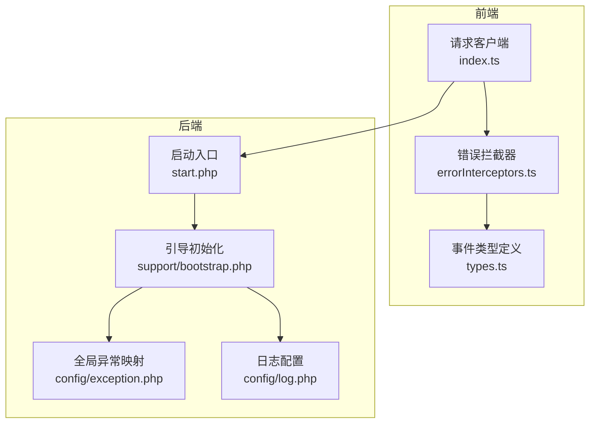
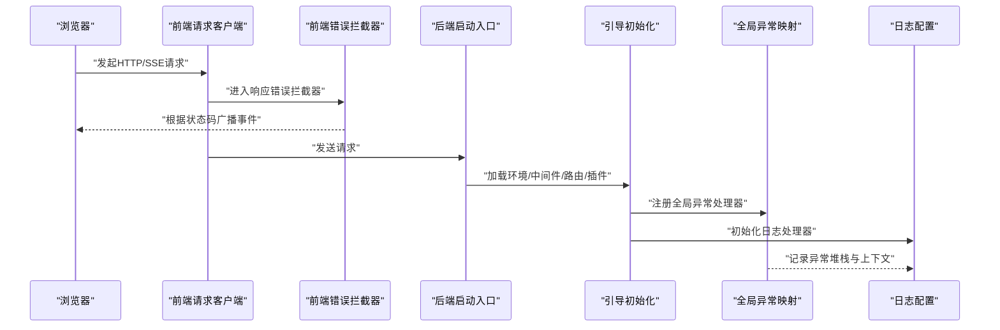
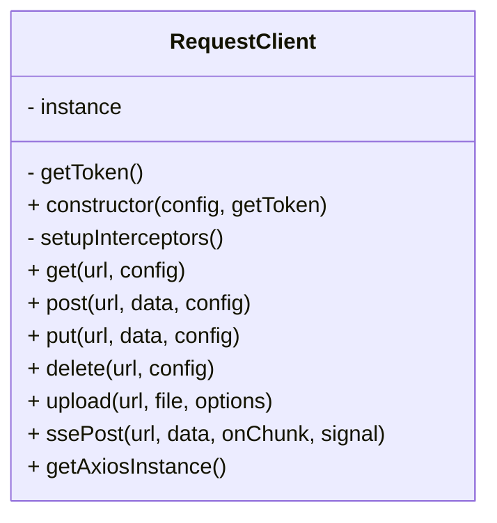
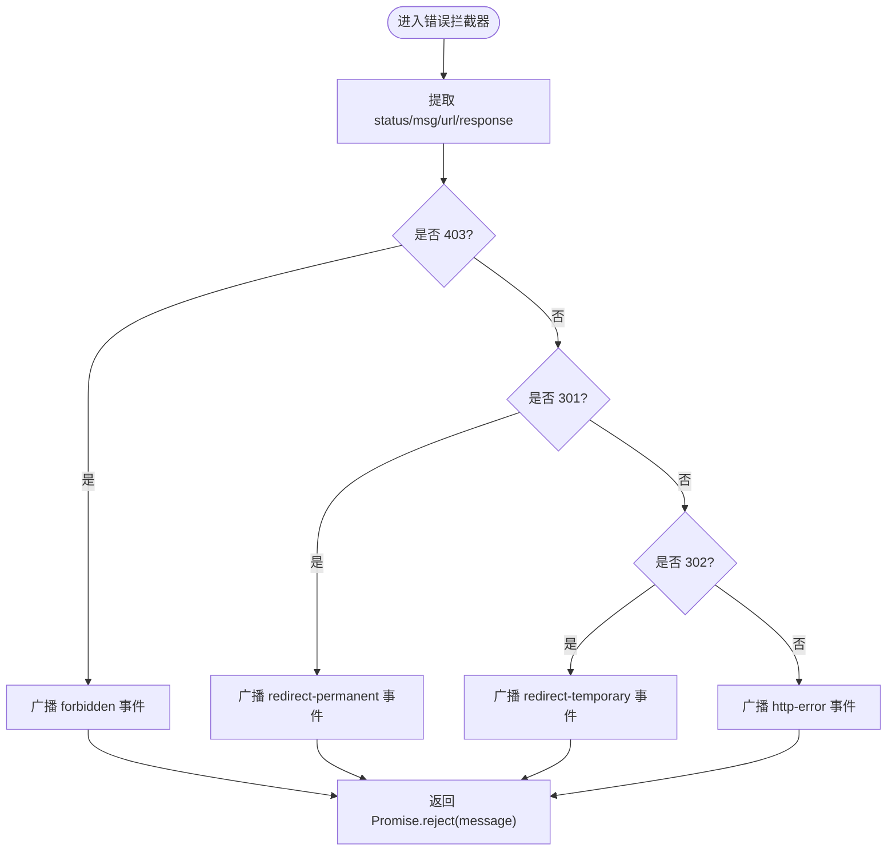
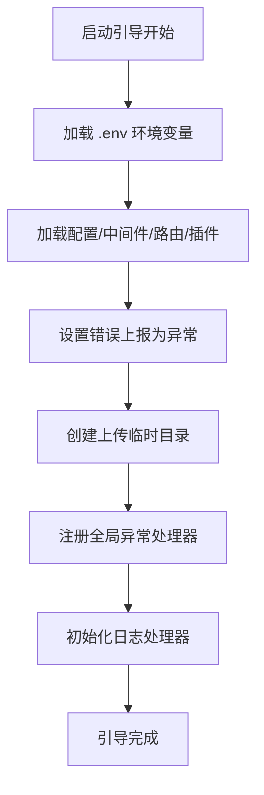
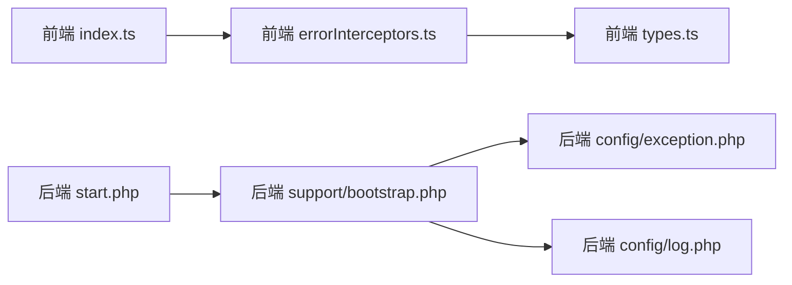
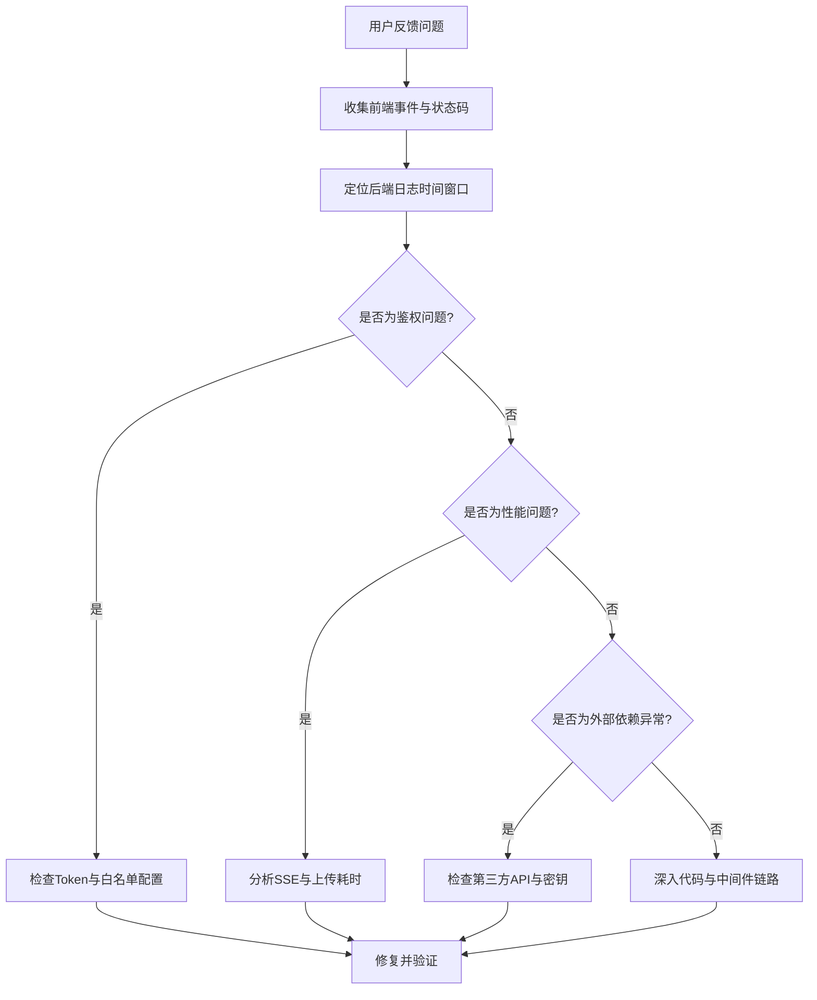

# 故障排查

<cite>
**本文引用的文件**   
- [server/config/exception.php](file://server/config/exception.php)
- [server/config/log.php](file://server/config/log.php)
- [server/support/bootstrap.php](file://server/support/bootstrap.php)
- [server/start.php](file://server/start.php)
- [frontend/src/utils/request/index.ts](file://frontend/src/utils/request/index.ts)
- [frontend/src/utils/request/errorInterceptors.ts](file://frontend/src/utils/request/errorInterceptors.ts)
- [frontend/src/utils/request/types.ts](file://frontend/src/utils/request/types.ts)
</cite>

## 目录
1. [简介](#简介)
2. [项目结构](#项目结构)
3. [核心组件](#核心组件)
4. [架构总览](#架构总览)
5. [详细组件分析](#详细组件分析)
6. [依赖关系分析](#依赖关系分析)
7. [性能考量](#性能考量)
8. [故障排查指南](#故障排查指南)
9. [结论](#结论)
10. [附录](#附录)

## 简介
本指南面向积木云AI创作平台的运维与开发人员，聚焦于“问题定位—日志分析—性能诊断—安全加固”的闭环流程。内容覆盖开发环境问题、运行时错误、性能瓶颈与安全漏洞等典型场景，并提供系统化的日志分析方法、调试工具使用指南、性能监控指标与诊断技巧，以及错误码对照表、异常处理最佳实践和问题定位流程图。

## 项目结构
本项目采用前后端分离架构：
- 前端（Vue + Axios）：负责用户交互、请求拦截、事件广播与SSE流式响应解析。
- 后端（Webman + Workerman）：提供HTTP服务、插件化业务模块、统一异常处理器与日志输出。

图表来源
- [server/start.php:1-6](file://server/start.php#L1-L6)
- [server/support/bootstrap.php:1-147](file://server/support/bootstrap.php#L1-L147)
- [server/config/exception.php:1-17](file://server/config/exception.php#L1-L17)
- [server/config/log.php:1-33](file://server/config/log.php#L1-L33)
- [frontend/src/utils/request/index.ts:1-237](file://frontend/src/utils/request/index.ts#L1-L237)
- [frontend/src/utils/request/errorInterceptors.ts:1-57](file://frontend/src/utils/request/errorInterceptors.ts#L1-L57)
- [frontend/src/utils/request/types.ts:1-40](file://frontend/src/utils/request/types.ts#L1-L40)

章节来源
- [server/start.php:1-6](file://server/start.php#L1-L6)
- [server/support/bootstrap.php:1-147](file://server/support/bootstrap.php#L1-L147)
- [server/config/exception.php:1-17](file://server/config/exception.php#L1-L17)
- [server/config/log.php:1-33](file://server/config/log.php#L1-L33)
- [frontend/src/utils/request/index.ts:1-237](file://frontend/src/utils/request/index.ts#L1-L237)
- [frontend/src/utils/request/errorInterceptors.ts:1-57](file://frontend/src/utils/request/errorInterceptors.ts#L1-L57)
- [frontend/src/utils/request/types.ts:1-40](file://frontend/src/utils/request/types.ts#L1-L40)

## 核心组件
- 前端请求客户端
  - 统一封装Axios实例，自动附加Token、设置超时与上传进度回调。
  - 内置SSE流式POST能力，用于大模型对话等长时任务。
- 前端错误拦截器
  - 按HTTP状态码分发事件（如403、301、302），并广播到应用事件总线，便于全局处理。
- 后端启动与引导
  - 加载环境变量、中间件、路由与插件；设置错误上报为异常；创建上传临时目录。
- 后端异常与日志
  - 全局异常处理器映射至支持类；日志默认输出到可轮转的文件处理器。

章节来源
- [frontend/src/utils/request/index.ts:1-237](file://frontend/src/utils/request/index.ts#L1-L237)
- [frontend/src/utils/request/errorInterceptors.ts:1-57](file://frontend/src/utils/request/errorInterceptors.ts#L1-L57)
- [server/support/bootstrap.php:1-147](file://server/support/bootstrap.php#L1-L147)
- [server/config/exception.php:1-17](file://server/config/exception.php#L1-L17)
- [server/config/log.php:1-33](file://server/config/log.php#L1-L33)

## 架构总览
下图展示了从浏览器发起请求到服务端异常与日志输出的完整链路，包括前端拦截器与后端引导、异常映射及日志落盘。

图表来源
- [frontend/src/utils/request/index.ts:1-237](file://frontend/src/utils/request/index.ts#L1-L237)
- [frontend/src/utils/request/errorInterceptors.ts:1-57](file://frontend/src/utils/request/errorInterceptors.ts#L1-L57)
- [server/start.php:1-6](file://server/start.php#L1-L6)
- [server/support/bootstrap.php:1-147](file://server/support/bootstrap.php#L1-L147)
- [server/config/exception.php:1-17](file://server/config/exception.php#L1-L17)
- [server/config/log.php:1-33](file://server/config/log.php#L1-L33)

## 详细组件分析

### 前端请求客户端（RequestClient）
- 职责
  - 统一创建Axios实例，注入请求/响应拦截器。
  - 提供GET/POST/PUT/DELETE与文件上传方法。
  - 实现SSE流式POST，逐块回调文本片段，兼容多种返回格式。
- 关键行为
  - 非白名单接口无Token直接拒绝。
  - 上传不设置超时，避免长时间任务被中断。
  - SSE在onload中处理缓冲区剩余数据，确保最后一块内容不丢失。

图表来源
- [frontend/src/utils/request/index.ts:1-237](file://frontend/src/utils/request/index.ts#L1-L237)

章节来源
- [frontend/src/utils/request/index.ts:1-237](file://frontend/src/utils/request/index.ts#L1-L237)

### 前端错误拦截器（responseErrorInterceptor）
- 职责
  - 捕获Axios错误，提取状态码、消息与URL。
  - 针对403、301、302分别广播专用事件，其他情况广播通用HTTP错误事件。
- 关键点
  - 通过事件总线将错误信息传递给UI层或全局处理逻辑。
  - 始终返回Promise.reject，保证调用方可感知失败。

图表来源
- [frontend/src/utils/request/errorInterceptors.ts:1-57](file://frontend/src/utils/request/errorInterceptors.ts#L1-L57)
- [frontend/src/utils/request/types.ts:1-40](file://frontend/src/utils/request/types.ts#L1-L40)

章节来源
- [frontend/src/utils/request/errorInterceptors.ts:1-57](file://frontend/src/utils/request/errorInterceptors.ts#L1-L57)
- [frontend/src/utils/request/types.ts:1-40](file://frontend/src/utils/request/types.ts#L1-L40)

### 后端引导与异常/日志
- 引导初始化
  - 加载环境变量、中间件、路由与插件。
  - 设置错误上报为异常，便于统一捕获。
  - 创建上传临时目录，避免警告。
- 异常映射
  - 全局异常处理器映射至支持类，集中处理未捕获异常。
- 日志配置
  - 默认使用可轮转文件处理器，输出到运行时日志目录，保留最近若干份。

图表来源
- [server/support/bootstrap.php:1-147](file://server/support/bootstrap.php#L1-L147)
- [server/config/exception.php:1-17](file://server/config/exception.php#L1-L17)
- [server/config/log.php:1-33](file://server/config/log.php#L1-L33)

章节来源
- [server/support/bootstrap.php:1-147](file://server/support/bootstrap.php#L1-L147)
- [server/config/exception.php:1-17](file://server/config/exception.php#L1-L17)
- [server/config/log.php:1-33](file://server/config/log.php#L1-L33)

## 依赖关系分析
- 前端
  - RequestClient 依赖 Axios 实例与拦截器链。
  - 错误拦截器依赖事件类型定义与事件总线。
- 后端
  - start.php 作为进程入口，调用引导初始化。
  - bootstrap.php 负责加载配置、中间件、路由与插件，并注册异常与日志。
  - exception.php 与 log.php 提供全局异常与日志策略。

图表来源
- [frontend/src/utils/request/index.ts:1-237](file://frontend/src/utils/request/index.ts#L1-L237)
- [frontend/src/utils/request/errorInterceptors.ts:1-57](file://frontend/src/utils/request/errorInterceptors.ts#L1-L57)
- [frontend/src/utils/request/types.ts:1-40](file://frontend/src/utils/request/types.ts#L1-L40)
- [server/start.php:1-6](file://server/start.php#L1-L6)
- [server/support/bootstrap.php:1-147](file://server/support/bootstrap.php#L1-L147)
- [server/config/exception.php:1-17](file://server/config/exception.php#L1-L17)
- [server/config/log.php:1-33](file://server/config/log.php#L1-L33)

章节来源
- [frontend/src/utils/request/index.ts:1-237](file://frontend/src/utils/request/index.ts#L1-L237)
- [frontend/src/utils/request/errorInterceptors.ts:1-57](file://frontend/src/utils/request/errorInterceptors.ts#L1-L57)
- [frontend/src/utils/request/types.ts:1-40](file://frontend/src/utils/request/types.ts#L1-L40)
- [server/start.php:1-6](file://server/start.php#L1-L6)
- [server/support/bootstrap.php:1-147](file://server/support/bootstrap.php#L1-L147)
- [server/config/exception.php:1-17](file://server/config/exception.php#L1-L17)
- [server/config/log.php:1-33](file://server/config/log.php#L1-L33)

## 性能考量
- 前端
  - 上传接口关闭超时，避免大文件上传被中断。
  - SSE流式传输减少首屏等待时间，提升用户体验。
- 后端
  - 日志采用轮转文件处理器，控制磁盘占用。
  - 引导阶段一次性加载配置与中间件，降低重复开销。

[本节为通用指导，无需列出具体文件来源]

## 故障排查指南

### 常见问题与解决方案
- 开发环境问题
  - 现象：启动时报错或无法加载环境变量。
  - 排查：确认根目录存在.env文件且语法正确；检查引导阶段是否成功加载。
  - 解决：修正环境变量后重启服务。
- 运行时错误
  - 现象：页面弹出网络异常或权限不足提示。
  - 排查：查看前端错误拦截器广播的事件类型与状态码；在后端日志中检索对应时间点的异常堆栈。
  - 解决：修复后端异常处理逻辑或调整前端鉴权流程。
- 性能瓶颈
  - 现象：大文件上传缓慢或SSE响应卡顿。
  - 排查：观察前端上传进度回调与SSE分块回调；检查后端日志中的耗时与队列积压。
  - 解决：优化存储引擎、增加并发或引入缓存与异步任务。
- 安全漏洞
  - 现象：未授权访问或敏感信息泄露。
  - 排查：检查前端是否对非白名单接口强制校验Token；核对后端中间件与异常处理是否包含鉴权与脱敏。
  - 解决：强化鉴权中间件、最小化错误信息暴露、启用HTTPS与CORS白名单。

章节来源
- [frontend/src/utils/request/index.ts:1-237](file://frontend/src/utils/request/index.ts#L1-L237)
- [frontend/src/utils/request/errorInterceptors.ts:1-57](file://frontend/src/utils/request/errorInterceptors.ts#L1-L57)
- [server/support/bootstrap.php:1-147](file://server/support/bootstrap.php#L1-L147)
- [server/config/log.php:1-33](file://server/config/log.php#L1-L33)

### 系统化日志分析方法
- 日志位置
  - 后端默认日志路径位于运行时日志目录，使用轮转文件处理器。
- 关键字段
  - 时间戳、级别、异常堆栈、请求URL、状态码、用户标识（如有）。
- 分析方法
  - 按时间窗口筛选错误级别日志。
  - 结合前端事件类型（如forbidden、http-error）与后端异常进行关联定位。
  - 关注SSE相关请求的起止时间与分块数量，评估延迟与丢包。

章节来源
- [server/config/log.php:1-33](file://server/config/log.php#L1-L33)

### 调试工具使用指南
- 前端
  - 使用浏览器开发者工具的Network面板查看请求头、响应体与状态码。
  - 监听应用事件总线上的请求错误事件，获取message、status、url与response。
- 后端
  - 通过命令行启动服务，观察控制台输出与运行时日志文件。
  - 在引导阶段开启更详细的日志级别，辅助定位中间件与路由加载问题。

章节来源
- [frontend/src/utils/request/types.ts:1-40](file://frontend/src/utils/request/types.ts#L1-L40)
- [server/start.php:1-6](file://server/start.php#L1-L6)
- [server/support/bootstrap.php:1-147](file://server/support/bootstrap.php#L1-L147)

### 性能监控指标与诊断技巧
- 指标建议
  - 请求成功率、P95/P99延迟、SSE首字节时间、上传吞吐、错误率。
- 诊断技巧
  - 对比不同环境的日志量级与异常分布。
  - 对热点接口进行慢查询与内存快照分析。
  - 结合队列消费时长与重试次数评估稳定性。

[本节为通用指导，无需列出具体文件来源]

### 错误码对照表
- HTTP状态码
  - 301：永久重定向
  - 302：临时重定向
  - 403：权限不足
  - 其他：通用HTTP错误
- 前端事件类型
  - business-error：业务错误（状态码非成功）
  - http-error：网络异常、超时等
  - unauthorized：未授权
  - forbidden：权限不足
  - redirect-permanent：永久重定向
  - redirect-temporary：临时重定向

章节来源
- [frontend/src/utils/request/errorInterceptors.ts:1-57](file://frontend/src/utils/request/errorInterceptors.ts#L1-L57)
- [frontend/src/utils/request/types.ts:1-40](file://frontend/src/utils/request/types.ts#L1-L40)

### 异常处理最佳实践
- 前端
  - 统一在错误拦截器中广播事件，避免分散处理。
  - 对非白名单接口强制校验Token，提前拒绝无效请求。
- 后端
  - 使用全局异常处理器集中捕获与格式化异常。
  - 将关键上下文写入日志，便于回溯。

章节来源
- [frontend/src/utils/request/index.ts:1-237](file://frontend/src/utils/request/index.ts#L1-L237)
- [frontend/src/utils/request/errorInterceptors.ts:1-57](file://frontend/src/utils/request/errorInterceptors.ts#L1-L57)
- [server/config/exception.php:1-17](file://server/config/exception.php#L1-L17)

### 问题定位流程图

[此图为概念性流程，不直接映射具体源码文件，故不提供图表来源]

## 结论
通过对前端请求与错误拦截、后端引导与异常日志的系统梳理，可以形成标准化的故障排查流程。建议在日常运维中建立统一的错误事件规范、完善日志上下文、持续监控关键性能指标，并结合本指南的流程快速定位与解决问题。

[本节为总结性内容，无需列出具体文件来源]

## 附录
- 术语说明
  - SSE：服务器推送事件，用于长连接实时数据流。
  - 白名单：允许免鉴权的接口集合。
- 参考文件
  - 前端请求与错误处理：见“核心组件”与“详细组件分析”。
  - 后端启动与异常日志：见“架构总览”与“详细组件分析”。

[本节为补充信息，无需列出具体文件来源]