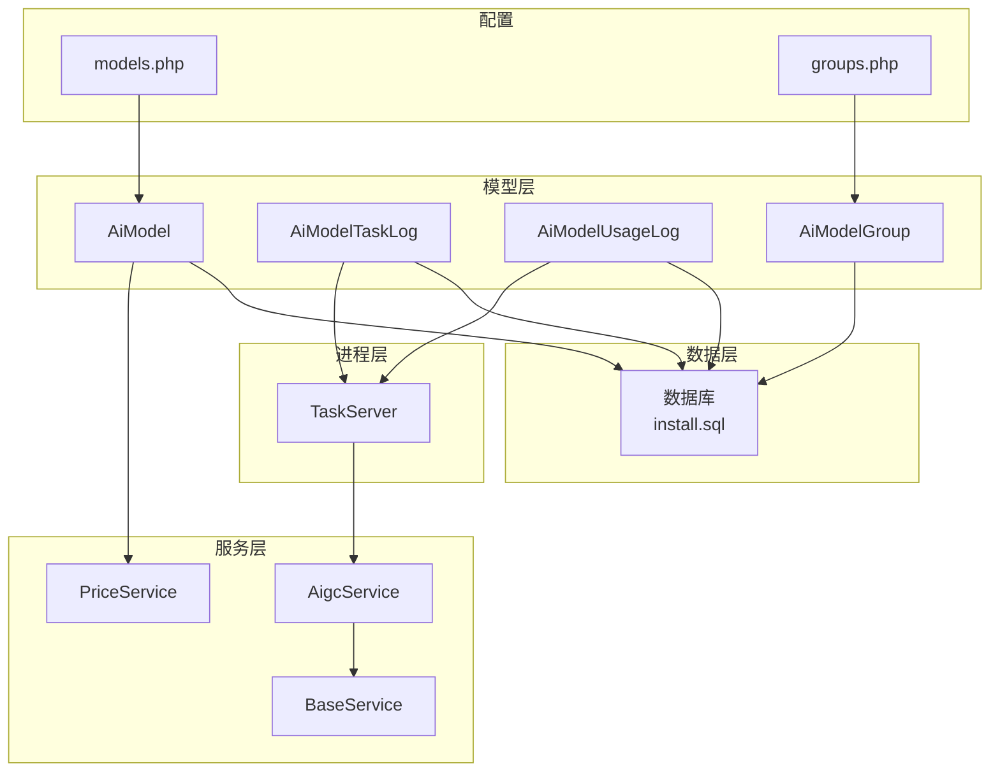
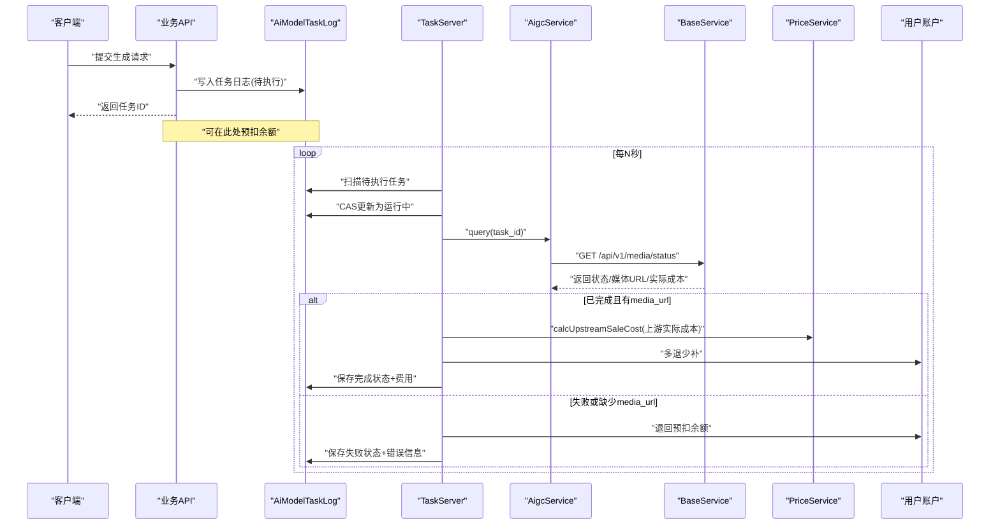
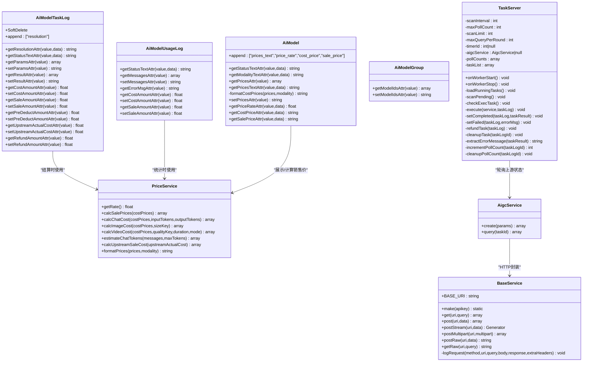
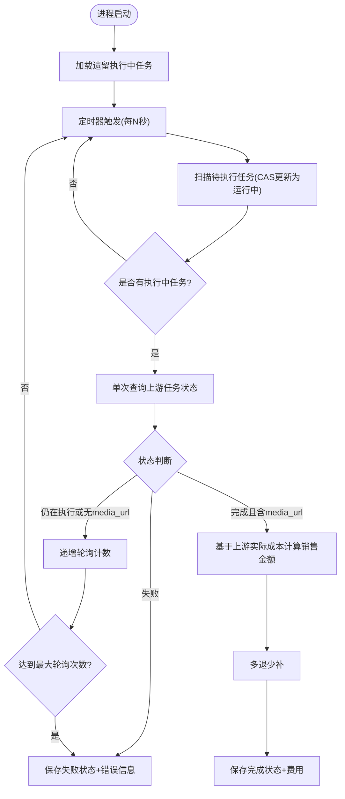
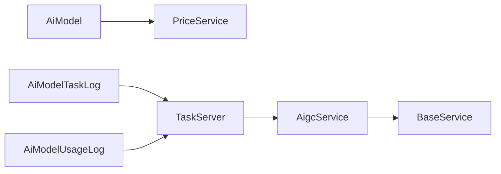

# AI模型代理数据模型

<cite>
**本文引用的文件**   
- [AiModel.php](file://server/plugin/xbAiModelAgent/app/model/AiModel.php)
- [AiModelTaskLog.php](file://server/plugin/xbAiModelAgent/app/model/AiModelTaskLog.php)
- [AiModelUsageLog.php](file://server/plugin/xbAiModelAgent/app/model/AiModelUsageLog.php)
- [AiModelGroup.php](file://server/plugin/xbAiModelAgent/app/model/AiModelGroup.php)
- [PriceService.php](file://server/plugin/xbAiModelAgent/service/xbservice/PriceService.php)
- [AigcService.php](file://server/plugin/xbAiModelAgent/service/xbservice/AigcService.php)
- [BaseService.php](file://server/plugin/xbAiModelAgent/service/xbservice/BaseService.php)
- [TaskServer.php](file://server/plugin/xbAiModelAgent/process/TaskServer.php)
- [models.php](file://server/plugin/xbAiModelAgent/data/models.php)
- [groups.php](file://server/plugin/xbAiModelAgent/data/groups.php)
- [install.sql](file://server/plugin/xbAiModelAgent/install.sql)
</cite>

## 目录
1. [简介](#简介)
2. [项目结构](#项目结构)
3. [核心组件](#核心组件)
4. [架构总览](#架构总览)
5. [详细组件分析](#详细组件分析)
6. [依赖关系分析](#依赖关系分析)
7. [性能与扩展性](#性能与扩展性)
8. [故障排查指南](#故障排查指南)
9. [结论](#结论)
10. [附录：数据模型定义](#附录数据模型定义)

## 简介
本文件面向AI模型代理系统的数据模型与运行机制，聚焦以下目标：
- 模型管理核心表结构：ai_model、ai_model_task_log、ai_model_usage_log、ai_model_group
- 模型接入规范、任务调度机制、计费统计系统与性能监控方案
- 多模型路由策略、负载均衡算法、错误重试机制与熔断降级处理
- 模型版本管理、A/B测试支持与成本优化策略

## 项目结构
围绕“插件化”的AI模型代理子系统，关键代码位于 server/plugin/xbAiModelAgent 下，包含：
- app/model：数据模型（AiModel、AiModelTaskLog、AiModelUsageLog、AiModelGroup）
- service/xbservice：服务层（AigcService、BaseService、PriceService）
- process：后台进程（TaskServer 异步轮询任务状态）
- data：模型清单与分组配置（models.php、groups.php）
- install.sql：数据库建表脚本

图表来源
- [install.sql:1-120](file://server/plugin/xbAiModelAgent/install.sql#L1-L120)
- [AiModel.php:1-198](file://server/plugin/xbAiModelAgent/app/model/AiModel.php#L1-L198)
- [AiModelTaskLog.php:1-211](file://server/plugin/xbAiModelAgent/app/model/AiModelTaskLog.php#L1-L211)
- [AiModelUsageLog.php:1-111](file://server/plugin/xbAiModelAgent/app/model/AiModelUsageLog.php#L1-L111)
- [AiModelGroup.php:1-47](file://server/plugin/xbAiModelAgent/app/model/AiModelGroup.php#L1-L47)
- [AigcService.php:1-58](file://server/plugin/xbAiModelAgent/service/xbservice/AigcService.php#L1-L58)
- [BaseService.php:1-475](file://server/plugin/xbAiModelAgent/service/xbservice/BaseService.php#L1-L475)
- [PriceService.php:1-248](file://server/plugin/xbAiModelAgent/service/xbservice/PriceService.php#L1-L248)
- [TaskServer.php:1-465](file://server/plugin/xbAiModelAgent/process/TaskServer.php#L1-L465)
- [models.php:1-800](file://server/plugin/xbAiModelAgent/data/models.php#L1-L800)
- [groups.php:1-83](file://server/plugin/xbAiModelAgent/data/groups.php#L1-L83)

章节来源
- [install.sql:1-120](file://server/plugin/xbAiModelAgent/install.sql#L1-L120)
- [models.php:1-800](file://server/plugin/xbAiModelAgent/data/models.php#L1-L800)
- [groups.php:1-83](file://server/plugin/xbAiModelAgent/data/groups.php#L1-L83)

## 核心组件
- AiModel：模型配置实体，封装价格展示、倍率计算、模态类型文本等访问器。
- AiModelTaskLog：任务日志实体，记录请求参数、结果、费用、状态流转与软删除。
- AiModelUsageLog：使用统计实体，记录聊天交互消息、错误信息、费用等。
- AiModelGroup：模型分组实体，维护模型ID集合。
- PriceService：价格计算服务，支持按全局倍率计算销售价、估算Token、视频/图片/对话计费。
- AigcService：上游AIGC接口客户端，提供创建任务与查询状态。
- BaseService：HTTP基础客户端，统一鉴权、超时、SSE兼容、流式响应与请求日志。
- TaskServer：独立进程，扫描待执行任务、非阻塞轮询第三方任务状态、完成/失败结算与退款。

章节来源
- [AiModel.php:1-198](file://server/plugin/xbAiModelAgent/app/model/AiModel.php#L1-L198)
- [AiModelTaskLog.php:1-211](file://server/plugin/xbAiModelAgent/app/model/AiModelTaskLog.php#L1-L211)
- [AiModelUsageLog.php:1-111](file://server/plugin/xbAiModelAgent/app/model/AiModelUsageLog.php#L1-L111)
- [AiModelGroup.php:1-47](file://server/plugin/xbAiModelAgent/app/model/AiModelGroup.php#L1-L47)
- [PriceService.php:1-248](file://server/plugin/xbAiModelAgent/service/xbservice/PriceService.php#L1-L248)
- [AigcService.php:1-58](file://server/plugin/xbAiModelAgent/service/xbservice/AigcService.php#L1-L58)
- [BaseService.php:1-475](file://server/plugin/xbAiModelAgent/service/xbservice/BaseService.php#L1-L475)
- [TaskServer.php:1-465](file://server/plugin/xbAiModelAgent/process/TaskServer.php#L1-L465)

## 架构总览
系统采用“Web请求 + 后台进程”的异步模式：
- Web侧负责创建任务、预扣费、落库任务日志并返回任务ID
- 后台TaskServer定时扫描待执行任务，标记为运行中后，非阻塞调用上游查询接口
- 根据上游返回的状态更新任务日志，完成时进行费用结算（多退少补），失败时退回预扣余额
- 价格体系通过全局倍率控制，支持不同模态（文本/图像/视频）的差异化计费

图表来源
- [TaskServer.php:1-465](file://server/plugin/xbAiModelAgent/process/TaskServer.php#L1-L465)
- [AigcService.php:1-58](file://server/plugin/xbAiModelAgent/service/xbservice/AigcService.php#L1-L58)
- [BaseService.php:1-475](file://server/plugin/xbAiModelAgent/service/xbservice/BaseService.php#L1-L475)
- [PriceService.php:1-248](file://server/plugin/xbAiModelAgent/service/xbservice/PriceService.php#L1-L248)
- [AiModelTaskLog.php:1-211](file://server/plugin/xbAiModelAgent/app/model/AiModelTaskLog.php#L1-L211)

## 详细组件分析

### 数据模型类图

图表来源
- [AiModel.php:1-198](file://server/plugin/xbAiModelAgent/app/model/AiModel.php#L1-L198)
- [AiModelTaskLog.php:1-211](file://server/plugin/xbAiModelAgent/app/model/AiModelTaskLog.php#L1-L211)
- [AiModelUsageLog.php:1-111](file://server/plugin/xbAiModelAgent/app/model/AiModelUsageLog.php#L1-L111)
- [AiModelGroup.php:1-47](file://server/plugin/xbAiModelAgent/app/model/AiModelGroup.php#L1-L47)
- [PriceService.php:1-248](file://server/plugin/xbAiModelAgent/service/xbservice/PriceService.php#L1-L248)
- [AigcService.php:1-58](file://server/plugin/xbAiModelAgent/service/xbservice/AigcService.php#L1-L58)
- [BaseService.php:1-475](file://server/plugin/xbAiModelAgent/service/xbservice/BaseService.php#L1-L475)
- [TaskServer.php:1-465](file://server/plugin/xbAiModelAgent/process/TaskServer.php#L1-L465)

章节来源
- [AiModel.php:1-198](file://server/plugin/xbAiModelAgent/app/model/AiModel.php#L1-L198)
- [AiModelTaskLog.php:1-211](file://server/plugin/xbAiModelAgent/app/model/AiModelTaskLog.php#L1-L211)
- [AiModelUsageLog.php:1-111](file://server/plugin/xbAiModelAgent/app/model/AiModelUsageLog.php#L1-L111)
- [AiModelGroup.php:1-47](file://server/plugin/xbAiModelAgent/app/model/AiModelGroup.php#L1-L47)
- [PriceService.php:1-248](file://server/plugin/xbAiModelAgent/service/xbservice/PriceService.php#L1-L248)
- [AigcService.php:1-58](file://server/plugin/xbAiModelAgent/service/xbservice/AigcService.php#L1-L58)
- [BaseService.php:1-475](file://server/plugin/xbAiModelAgent/service/xbservice/BaseService.php#L1-L475)
- [TaskServer.php:1-465](file://server/plugin/xbAiModelAgent/process/TaskServer.php#L1-L465)

### 任务调度流程（流程图）

图表来源
- [TaskServer.php:1-465](file://server/plugin/xbAiModelAgent/process/TaskServer.php#L1-L465)
- [AigcService.php:1-58](file://server/plugin/xbAiModelAgent/service/xbservice/AigcService.php#L1-L58)
- [PriceService.php:1-248](file://server/plugin/xbAiModelAgent/service/xbservice/PriceService.php#L1-L248)

章节来源
- [TaskServer.php:1-465](file://server/plugin/xbAiModelAgent/process/TaskServer.php#L1-L465)

### 模型接入规范
- 模型标识与模态
  - model_id：唯一标识，用于路由与计费维度
  - modality：模态类型（如文本/图像/视频），影响价格结构与展示
- 价格配置
  - prices：JSON结构，支持输入/输出单价、按分辨率/清晰度定价、按时长计费、首秒/后续每秒等
  - 全局倍率：通过配置项控制销售价=成本价×倍率
- 渠道与标签
  - 通过data/models.php集中声明模型元信息与价格模板，便于批量导入与展示
- 分组能力
  - 通过data/groups.php将模型归组（文本/图像/视频/去水印等），前端可按组筛选

章节来源
- [models.php:1-800](file://server/plugin/xbAiModelAgent/data/models.php#L1-L800)
- [groups.php:1-83](file://server/plugin/xbAiModelAgent/data/groups.php#L1-L83)
- [AiModel.php:1-198](file://server/plugin/xbAiModelAgent/app/model/AiModel.php#L1-L198)
- [PriceService.php:1-248](file://server/plugin/xbAiModelAgent/service/xbservice/PriceService.php#L1-L248)

### 任务调度机制
- 非阻塞轮询：每次仅对少量任务进行一次上游状态查询，避免单任务阻塞整体进度
- CAS幂等：从“待执行”到“运行中”使用条件更新，防止重复处理
- 超时保护：内存维护轮询计数，超过阈值则标记失败，避免无限等待
- 资源回收：任务完成后清理内存中的任务列表与轮询计数

章节来源
- [TaskServer.php:1-465](file://server/plugin/xbAiModelAgent/process/TaskServer.php#L1-L465)

### 计费统计系统
- 成本与销售价
  - 成本价来自上游实际成本或模型价格配置
  - 销售价=成本价×全局倍率
- 计费场景
  - 对话：按输入/输出Token数量×单价，单位元/百万Token
  - 图像：按分辨率键或默认每张价格
  - 视频：支持按视频、按清晰度、按时长、首秒+后续每秒等多种模式
- 多退少补
  - 若上游返回实际成本与预扣不一致，自动退款或补扣
- 使用统计
  - 会话消息、错误信息、费用字段均持久化，便于审计与分析

章节来源
- [PriceService.php:1-248](file://server/plugin/xbAiModelAgent/service/xbservice/PriceService.php#L1-L248)
- [AiModelTaskLog.php:1-211](file://server/plugin/xbAiModelAgent/app/model/AiModelTaskLog.php#L1-L211)
- [AiModelUsageLog.php:1-111](file://server/plugin/xbAiModelAgent/app/model/AiModelUsageLog.php#L1-L111)
- [TaskServer.php:1-465](file://server/plugin/xbAiModelAgent/process/TaskServer.php#L1-L465)

### 性能监控方案
- 请求级日志
  - BaseService统一记录方法、URL、头、查询、请求体与响应详情，按日切分日志文件
- 任务级日志
  - TaskServer在关键节点输出任务状态变更、轮询次数、异常信息
- 指标建议
  - 上游成功率、平均耗时、P95/P99延迟、错误码分布、费用偏差率

章节来源
- [BaseService.php:1-475](file://server/plugin/xbAiModelAgent/service/xbservice/BaseService.php#L1-L475)
- [TaskServer.php:1-465](file://server/plugin/xbAiModelAgent/process/TaskServer.php#L1-L465)

### 多模型路由策略与负载均衡
- 路由策略
  - 基于model_id精确匹配；未指定时可依据分组code与优先级选择
- 负载均衡
  - 当前实现以单一上游端点为主；可在AigcService层扩展多端点池，结合权重/健康检查做轮询或最少连接
- 容错与降级
  - 上游异常抛出运行时异常，上层捕获后可切换备选端点或回退至次优模型
- 限流与熔断
  - 建议在BaseService外层增加令牌桶/漏桶限流，并在连续失败时快速失败（熔断）

章节来源
- [AigcService.php:1-58](file://server/plugin/xbAiModelAgent/service/xbservice/AigcService.php#L1-L58)
- [BaseService.php:1-475](file://server/plugin/xbAiModelAgent/service/xbservice/BaseService.php#L1-L475)

### 错误重试机制与熔断降级
- 重试
  - 当前TaskServer未内置指数退避重试；可在调用上游前增加可配置的重试策略
- 熔断
  - 建议基于最近窗口失败率与慢调用比例触发熔断，暂停向不稳定上游发请求
- 降级
  - 当主模型不可用时，按分组内次优模型或缓存结果降级返回

章节来源
- [TaskServer.php:1-465](file://server/plugin/xbAiModelAgent/process/TaskServer.php#L1-L465)
- [BaseService.php:1-475](file://server/plugin/xbAiModelAgent/service/xbservice/BaseService.php#L1-L475)

### 模型版本管理与A/B测试
- 版本管理
  - 通过新增model_id区分版本（例如gpt-image-2与gpt-image-2-channel2），配合tags标注特性
- A/B测试
  - 在路由层按流量比例分发至不同model_id，对比质量与成本指标
- 灰度发布
  - 先小范围开放新模型，逐步放量，观察错误率与费用偏差后再全量

章节来源
- [models.php:1-800](file://server/plugin/xbAiModelAgent/data/models.php#L1-L800)

### 成本优化策略
- 全局倍率调优：根据市场策略动态调整销售价倍率
- 模型优选：在满足质量前提下优先选择低成本模型或低价渠道
- 参数裁剪：合理设置max_tokens、分辨率、时长等参数，减少无效消耗
- 结果复用：对相似提示词与参数命中缓存，降低重复调用

章节来源
- [PriceService.php:1-248](file://server/plugin/xbAiModelAgent/service/xbservice/PriceService.php#L1-L248)
- [models.php:1-800](file://server/plugin/xbAiModelAgent/data/models.php#L1-L800)

## 依赖关系分析
- 模型与服务
  - AiModel依赖PriceService进行价格展示与计算
  - AiModelTaskLog与AiModelUsageLog作为计费与审计载体
- 进程与服务
  - TaskServer依赖AigcService与PriceService完成状态轮询与费用结算
- HTTP基础
  - BaseService提供统一的鉴权、超时、SSE兼容、流式与原始响应能力

图表来源
- [AiModel.php:1-198](file://server/plugin/xbAiModelAgent/app/model/AiModel.php#L1-L198)
- [AiModelTaskLog.php:1-211](file://server/plugin/xbAiModelAgent/app/model/AiModelTaskLog.php#L1-L211)
- [AiModelUsageLog.php:1-111](file://server/plugin/xbAiModelAgent/app/model/AiModelUsageLog.php#L1-L111)
- [TaskServer.php:1-465](file://server/plugin/xbAiModelAgent/process/TaskServer.php#L1-L465)
- [AigcService.php:1-58](file://server/plugin/xbAiModelAgent/service/xbservice/AigcService.php#L1-L58)
- [BaseService.php:1-475](file://server/plugin/xbAiModelAgent/service/xbservice/BaseService.php#L1-L475)
- [PriceService.php:1-248](file://server/plugin/xbAiModelAgent/service/xbservice/PriceService.php#L1-L248)

## 性能与扩展性
- 并发与吞吐
  - TaskServer通过限制每轮查询数量与最大轮询次数，控制上游压力
- I/O与网络
  - BaseService设置较长超时以适应长耗时生成任务；SSE兼容提升稳定性
- 存储与索引
  - 建议对任务日志按时间分区与索引，提高查询与归档效率
- 可扩展点
  - 在AigcService层引入多端点池与健康检查
  - 在TaskServer层增加重试与熔断策略
  - 在PriceService层扩展更多计费规则与折扣策略

[本节为通用指导，不直接分析具体文件]

## 故障排查指南
- 常见错误定位
  - 上游返回空或格式异常：查看BaseService日志文件，确认请求头与响应体
  - 任务长时间未完成：检查TaskServer轮询计数是否达上限，确认上游status与media_url
  - 费用不一致：核对上游actual_cost与预扣金额，关注多退少补逻辑
- 日志位置
  - BaseService按日写入logs/xbAiModelAgent/*.log
  - TaskServer通过统一日志接口输出关键事件
- 恢复步骤
  - 修正上游配置或网络问题后，重启TaskServer以重新加载遗留任务
  - 必要时人工介入，对失败任务进行重放或退款处理

章节来源
- [BaseService.php:1-475](file://server/plugin/xbAiModelAgent/service/xbservice/BaseService.php#L1-L475)
- [TaskServer.php:1-465](file://server/plugin/xbAiModelAgent/process/TaskServer.php#L1-L465)

## 结论
本系统以清晰的数据模型与分层架构实现了AI模型的统一管理、异步任务调度与精细化计费。通过全局倍率与多模态价格结构，既保证了商业灵活性，也提供了良好的可观测性与可运维性。未来可在路由与容错层面进一步增强多端点负载均衡、重试与熔断能力，以满足更高可用与更复杂业务场景的需求。

[本节为总结性内容，不直接分析具体文件]

## 附录：数据模型定义
以下为数据库表结构的精简说明（字段名与含义以install.sql为准）：
- xb_ai_model：模型配置表，包含模型标识、模态、状态、图标、标签、排序、描述、价格配置等
- xb_ai_model_task_log：任务日志表，包含任务状态、请求参数、结果、费用、上游实际成本、预扣与退款金额、完成时间等
- xb_ai_model_usage_log：使用统计表，包含会话消息、错误信息、费用等
- xb_ai_model_group：模型分组表，包含分组名称、编码、排序、模型ID集合

章节来源
- [install.sql:1-120](file://server/plugin/xbAiModelAgent/install.sql#L1-L120)