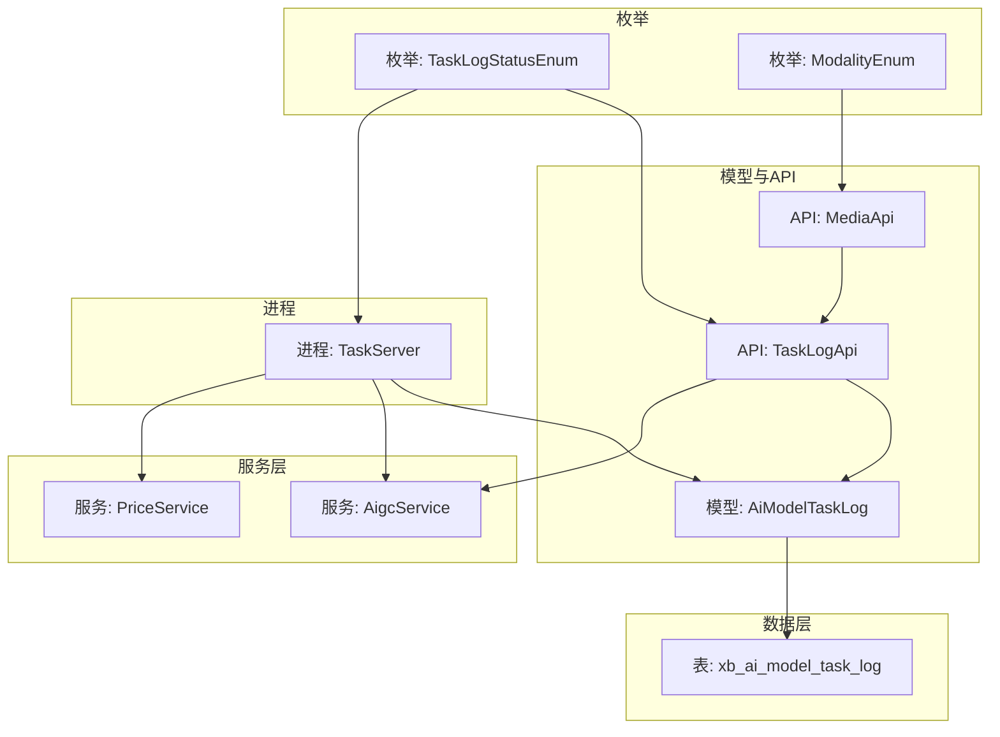
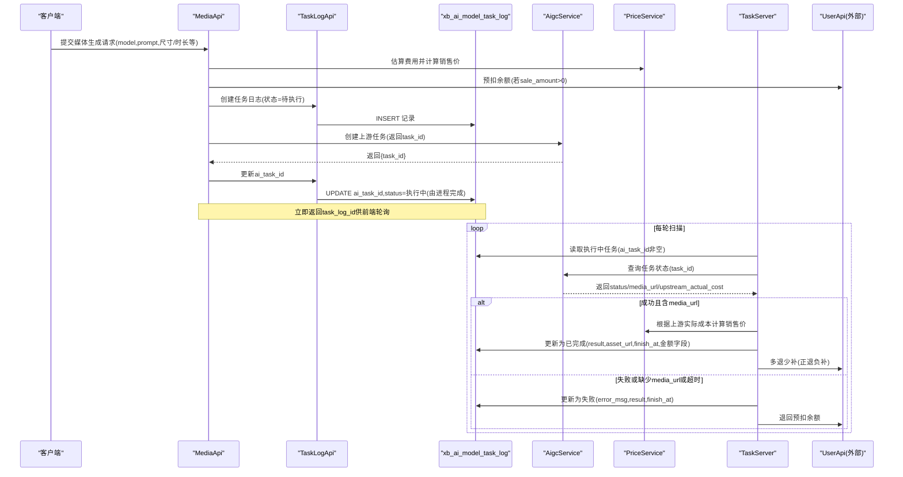
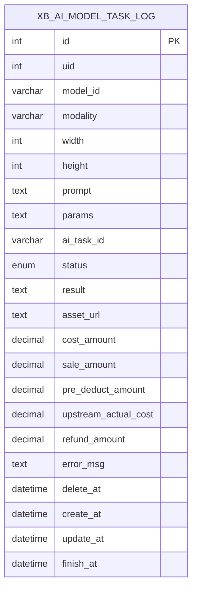
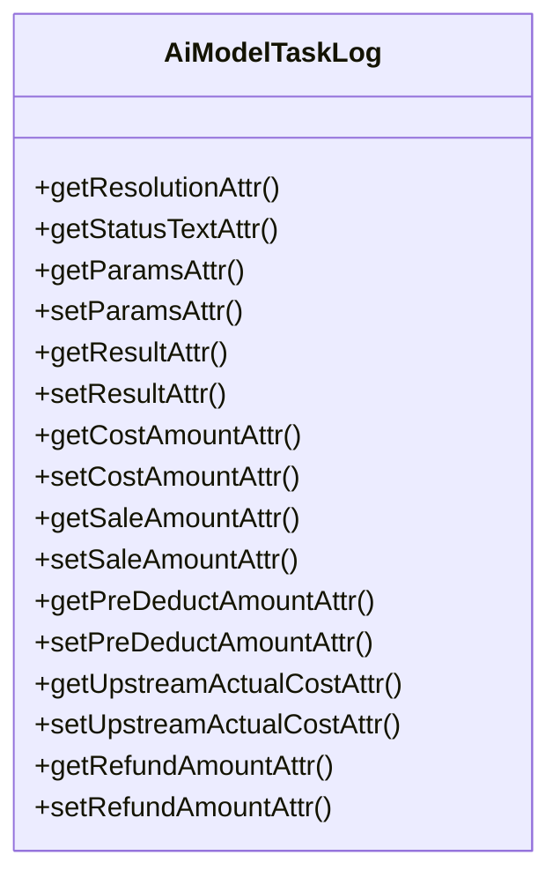
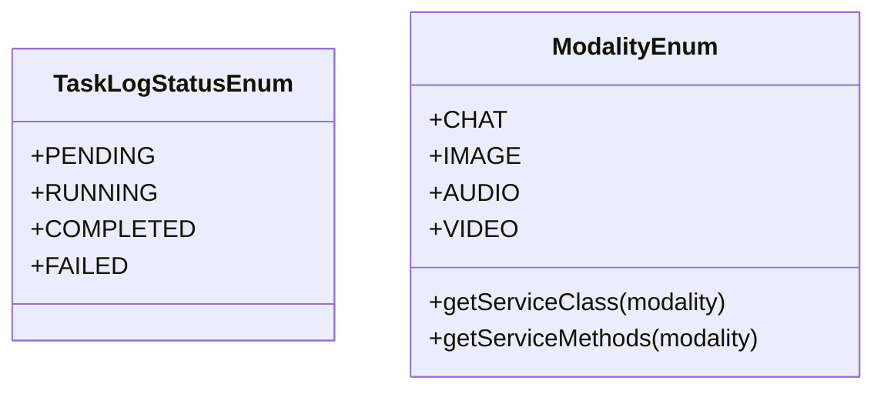
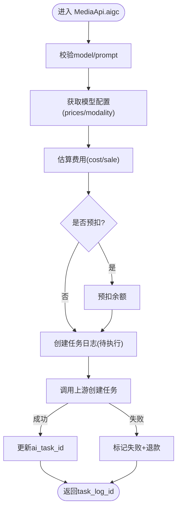
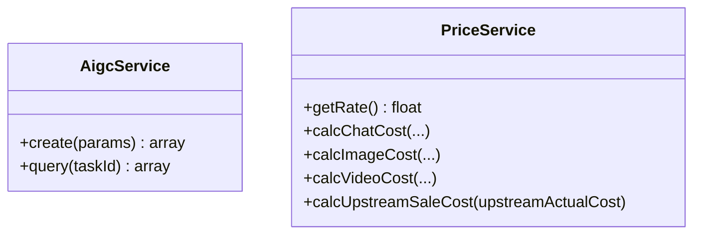
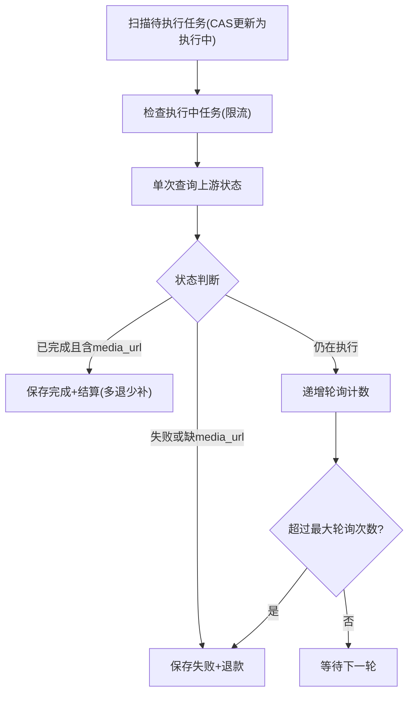
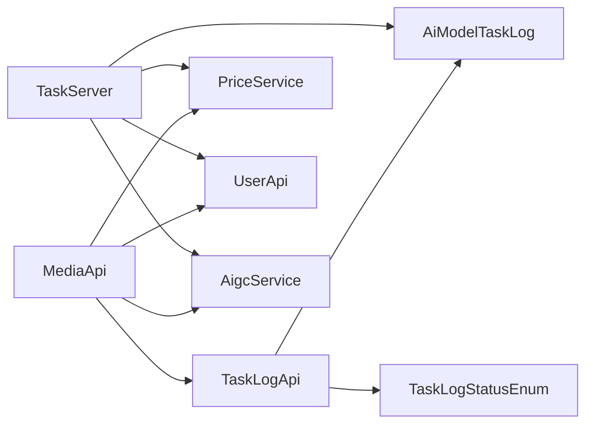
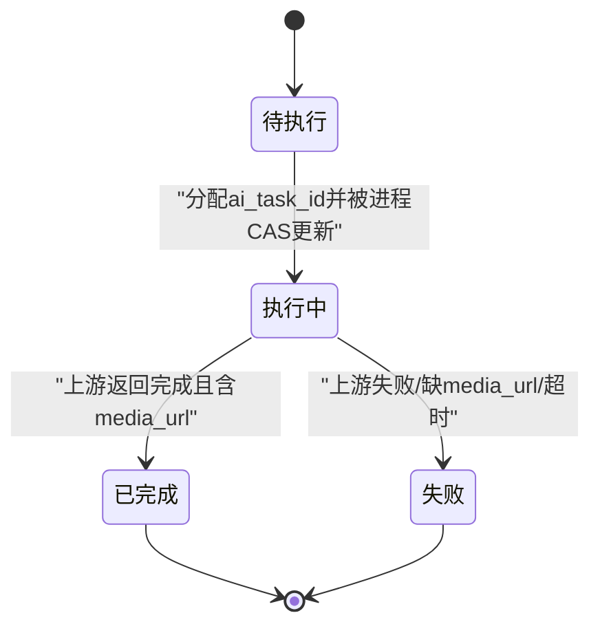

# 任务日志表结构

<cite>
**本文引用的文件**   
- [install.sql](file://server/plugin\xbAiModelAgent\install.sql)
- [TaskLogStatusEnum.php](file://server/plugin\xbAiModelAgent\enum\TaskLogStatusEnum.php)
- [ModalityEnum.php](file://server/plugin\xbAiModelAgent\enum\ModalityEnum.php)
- [AiModelTaskLog.php](file://server/plugin\xbAiModelAgent\app\model\AiModelTaskLog.php)
- [TaskLogApi.php](file://server/plugin\xbAiModelAgent\api\TaskLogApi.php)
- [MediaApi.php](file://server/plugin\xbAiModelAgent\api\MediaApi.php)
- [AigcService.php](file://server/plugin\xbAiModelAgent\service\xbservice\AigcService.php)
- [TaskServer.php](file://server/plugin\xbAiModelAgent\process\TaskServer.php)
- [PriceService.php](file://server/plugin\xbAiModelAgent\service\xbservice\PriceService.php)
</cite>

## 目录
1. [引言](#引言)
2. [项目结构](#项目结构)
3. [核心组件](#核心组件)
4. [架构总览](#架构总览)
5. [详细组件分析](#详细组件分析)
6. [依赖分析](#依赖分析)
7. [性能考虑](#性能考虑)
8. [故障排查指南](#故障排查指南)
9. [结论](#结论)
10. [附录](#附录)

## 引言
本文件围绕 xb_ai_model_task_log 任务日志表，系统化阐述其数据模型设计、任务生命周期与状态流转、结果存储结构、成本核算字段，以及异步任务处理、进度跟踪、错误处理与重试机制的数据库支撑方案。同时覆盖媒体生成任务的参数配置、结果回调、资产关联和计费统计功能，并提供事务处理、索引优化与查询调优策略建议。

## 项目结构
xb_ai_model_task_log 位于 AI 模型代理插件中，配合任务日志 API、模型枚举、服务层与后台轮询进程共同实现端到端的异步任务闭环。

图表来源
- [install.sql:45-75](file://server/plugin\xbAiModelAgent\install.sql#L45-L75)
- [AiModelTaskLog.php:1-211](file://server/plugin\xbAiModelAgent\app\model\AiModelTaskLog.php#L1-L211)
- [TaskLogApi.php:1-263](file://server/plugin\xbAiModelAgent\api\TaskLogApi.php#L1-L263)
- [MediaApi.php:27-202](file://server/plugin\xbAiModelAgent\api\MediaApi.php#L27-L202)
- [AigcService.php:1-58](file://server/plugin\xbAiModelAgent\service\xbservice\AigcService.php#L1-L58)
- [TaskServer.php:1-465](file://server/plugin\xbAiModelAgent\process\TaskServer.php#L1-L465)
- [TaskLogStatusEnum.php:1-44](file://server/plugin\xbAiModelAgent\enum\TaskLogStatusEnum.php#L1-L44)
- [ModalityEnum.php:1-157](file://server/plugin\xbAiModelAgent\enum\ModalityEnum.php#L1-L157)

章节来源
- [install.sql:45-75](file://server/plugin\xbAiModelAgent\install.sql#L45-L75)
- [AiModelTaskLog.php:1-211](file://server/plugin\xbAiModelAgent\app\model\AiModelTaskLog.php#L1-L211)
- [TaskLogApi.php:1-263](file://server/plugin\xbAiModelAgent\api\TaskLogApi.php#L1-L263)
- [MediaApi.php:27-202](file://server/plugin\xbAiModelAgent\api\MediaApi.php#L27-L202)
- [AigcService.php:1-58](file://server/plugin\xbAiModelAgent\service\xbservice\AigcService.php#L1-L58)
- [TaskServer.php:1-465](file://server/plugin\xbAiModelAgent\process\TaskServer.php#L1-L465)
- [TaskLogStatusEnum.php:1-44](file://server/plugin\xbAiModelAgent\enum\TaskLogStatusEnum.php#L1-L44)
- [ModalityEnum.php:1-157](file://server/plugin\xbAiModelAgent\enum\ModalityEnum.php#L1-L157)

## 核心组件
- 数据表：xb_ai_model_task_log（主键自增、软删除、时间戳、多索引）
- 模型：AiModelTaskLog（JSON 自动编解码、金额类型转换、附加属性）
- 状态枚举：TaskLogStatusEnum（待执行/执行中/已完成/失败）
- 模态枚举：ModalityEnum（文本/图片/音频/视频）
- API：TaskLogApi（CRUD、分页、按条件筛选）、MediaApi（媒体生成入口、费用预估与预扣）
- 服务：AigcService（创建任务、查询状态）、PriceService（价格计算、倍率）
- 进程：TaskServer（定时扫描、CAS 更新、轮询、超时、结算与退款）

章节来源
- [install.sql:45-75](file://server/plugin\xbAiModelAgent\install.sql#L45-L75)
- [AiModelTaskLog.php:1-211](file://server/plugin\xbAiModelAgent\app\model\AiModelTaskLog.php#L1-L211)
- [TaskLogStatusEnum.php:1-44](file://server/plugin\xbAiModelAgent\enum\TaskLogStatusEnum.php#L1-L44)
- [ModalityEnum.php:1-157](file://server/plugin\xbAiModelAgent\enum\ModalityEnum.php#L1-L157)
- [TaskLogApi.php:1-263](file://server/plugin\xbAiModelAgent\api\TaskLogApi.php#L1-L263)
- [MediaApi.php:27-202](file://server/plugin\xbAiModelAgent\api\MediaApi.php#L27-L202)
- [AigcService.php:1-58](file://server/plugin\xbAiModelAgent\service\xbservice\AigcService.php#L1-L58)
- [PriceService.php:20-247](file://server/plugin\xbAiModelAgent\service\xbservice\PriceService.php#L20-L247)
- [TaskServer.php:1-465](file://server/plugin\xbAiModelAgent\process\TaskServer.php#L1-L465)

## 架构总览
下图展示从媒体生成请求到任务完成的全链路交互，包括费用预扣、任务创建、异步轮询、结果落库与退补结算。

图表来源
- [MediaApi.php:46-152](file://server/plugin\xbAiModelAgent\api\MediaApi.php#L46-L152)
- [TaskLogApi.php:46-76](file://server/plugin\xbAiModelAgent\api\TaskLogApi.php#L46-L76)
- [AigcService.php:33-56](file://server/plugin\xbAiModelAgent\service\xbservice\AigcService.php#L33-L56)
- [TaskServer.php:196-355](file://server/plugin\xbAiModelAgent\process\TaskServer.php#L196-L355)
- [PriceService.php:176-189](file://server/plugin\xbAiModelAgent\service\xbservice\PriceService.php#L176-L189)

## 详细组件分析

### 数据模型：xb_ai_model_task_log
- 主键与基础信息
  - id：自增主键
  - uid：用户ID
  - model_id：第三方模型标识
  - modality：模态类型（20=图片/30=音频/40=视频）
- 任务参数与上下文
  - width/height：分辨率
  - prompt：提示词
  - params：请求参数 JSON
  - ai_task_id：上游服务商任务ID
- 状态与结果
  - status：10=待执行/20=执行中/30=已完成/40=失败
  - result：AI 生成结果 JSON
  - asset_url：媒体资产URL
  - error_msg：错误信息
- 成本与结算
  - cost_amount：成本金额
  - sale_amount：实际消费
  - pre_deduct_amount：预扣金额
  - upstream_actual_cost：上游实际成本
  - refund_amount：退补金额（正=退款，负=补扣）
- 时间与软删除
  - create_at/update_at/finish_at/delete_at

图表来源
- [install.sql:45-75](file://server/plugin\xbAiModelAgent\install.sql#L45-L75)

章节来源
- [install.sql:45-75](file://server/plugin\xbAiModelAgent\install.sql#L45-L75)

### 模型层：AiModelTaskLog
- 软删除：使用 delete_at 标记删除
- 附加属性：resolution（width x height 组合显示）
- 状态文本：基于枚举获取可读文本
- JSON 自动编解码：params/result 存取时自动序列化/反序列化
- 金额字段：统一数值化转换，避免空值/字符串导致异常

图表来源
- [AiModelTaskLog.php:22-211](file://server/plugin\xbAiModelAgent\app\model\AiModelTaskLog.php#L22-L211)

章节来源
- [AiModelTaskLog.php:22-211](file://server/plugin\xbAiModelAgent\app\model\AiModelTaskLog.php#L22-L211)

### 状态与模态枚举
- 任务状态：待执行/执行中/已完成/失败
- 模态类型：文本/图片/音频/视频（用于不同计费与服务路由）

图表来源
- [TaskLogStatusEnum.php:19-44](file://server/plugin\xbAiModelAgent\enum\TaskLogStatusEnum.php#L19-L44)
- [ModalityEnum.php:23-156](file://server/plugin\xbAiModelAgent\enum\ModalityEnum.php#L23-L156)

章节来源
- [TaskLogStatusEnum.php:19-44](file://server/plugin\xbAiModelAgent\enum\TaskLogStatusEnum.php#L19-L44)
- [ModalityEnum.php:23-156](file://server/plugin\xbAiModelAgent\enum\ModalityEnum.php#L23-L156)

### API 层：任务日志与媒体生成
- TaskLogApi
  - 创建/更新状态/失败/完成
  - 列表分页与多维筛选（uid/model_id/modality/status/时间范围）
  - 详情与按模型ID查询
- MediaApi
  - 参数校验与模型解析
  - 费用预估与预扣余额
  - 创建任务日志并调用上游服务创建任务
  - 失败回滚预扣余额

图表来源
- [MediaApi.php:46-152](file://server/plugin\xbAiModelAgent\api\MediaApi.php#L46-L152)
- [TaskLogApi.php:46-148](file://server/plugin\xbAiModelAgent\api\TaskLogApi.php#L46-L148)

章节来源
- [TaskLogApi.php:46-263](file://server/plugin\xbAiModelAgent\api\TaskLogApi.php#L46-L263)
- [MediaApi.php:46-202](file://server/plugin\xbAiModelAgent\api\MediaApi.php#L46-L202)

### 服务层：AIGC 与价格计算
- AigcService
  - 创建媒体生成任务（multipart 上传）
  - 查询任务状态（返回 status/media_url/upstream_actual_cost 等）
- PriceService
  - 全局倍率与销售价计算
  - 聊天/图片/视频计费方法
  - 上游实际成本转销售价

图表来源
- [AigcService.php:33-56](file://server/plugin\xbAiModelAgent\service\xbservice\AigcService.php#L33-L56)
- [PriceService.php:20-247](file://server/plugin\xbAiModelAgent\service\xbservice\PriceService.php#L20-L247)

章节来源
- [AigcService.php:33-56](file://server/plugin\xbAiModelAgent\service\xbservice\AigcService.php#L33-L56)
- [PriceService.php:20-247](file://server/plugin\xbAiModelAgent\service\xbservice\PriceService.php#L20-L247)

### 进程层：异步任务轮询与结算
- 定时扫描
  - 将“待执行且有 ai_task_id”的任务 CAS 更新为“执行中”，防止重复处理
  - 维护内存中的任务列表与轮询计数
- 单次非阻塞查询
  - 每轮限制最大查询数，避免对上游造成压力
  - 根据返回状态决定完成/失败/继续等待
- 超时与失败处理
  - 达到最大轮询次数则标记失败
  - 失败时记录错误信息并退回预扣余额
- 完成与结算
  - 提取上游实际成本，按倍率计算销售价
  - 执行多退少补（正退负补），写入 result/asset_url/finish_at 等字段

图表来源
- [TaskServer.php:157-284](file://server/plugin\xbAiModelAgent\process\TaskServer.php#L157-L284)
- [TaskServer.php:294-355](file://server/plugin\xbAiModelAgent\process\TaskServer.php#L294-L355)

章节来源
- [TaskServer.php:157-465](file://server/plugin\xbAiModelAgent\process\TaskServer.php#L157-L465)

## 依赖分析
- 直接依赖
  - TaskLogApi 依赖 AiModelTaskLog 模型与 TaskLogStatusEnum
  - MediaApi 依赖 ModelApi（获取模型配置）、PriceService（费用计算）、UserApi（余额操作）、TaskLogApi/AigcService
  - TaskServer 依赖 AiModelTaskLog、AigcService、PriceService、UserApi
- 间接依赖
  - 通过枚举解耦状态与模态语义
  - 通过服务层屏蔽上游差异

图表来源
- [TaskLogApi.php:1-263](file://server/plugin\xbAiModelAgent\api\TaskLogApi.php#L1-L263)
- [MediaApi.php:27-202](file://server/plugin\xbAiModelAgent\api\MediaApi.php#L27-L202)
- [TaskServer.php:1-465](file://server/plugin\xbAiModelAgent\process\TaskServer.php#L1-L465)

章节来源
- [TaskLogApi.php:1-263](file://server/plugin\xbAiModelAgent\api\TaskLogApi.php#L1-L263)
- [MediaApi.php:27-202](file://server/plugin\xbAiModelAgent\api\MediaApi.php#L27-L202)
- [TaskServer.php:1-465](file://server/plugin\xbAiModelAgent\process\TaskServer.php#L1-L465)

## 性能考虑
- 索引优化
  - 已提供：idx_uid、idx_model_id、idx_status、idx_create_at
  - 建议补充：idx_ai_task_id（便于按上游任务ID检索）、idx_finish_at（便于历史归档与报表）
- 查询优化
  - 列表接口已支持多维度过滤与分页；建议结合业务热点增加复合索引，如 (uid, status, create_at)、(model_id, status, create_at)
  - 避免在 JSON 字段上频繁函数式过滤，必要时冗余必要字段
- 写入与并发
  - 采用 CAS 更新避免重复处理；在高并发下可考虑行级锁或乐观锁版本字段
- 大对象存储
  - result 字段可能较大，建议仅保留关键摘要，完整结果下沉至对象存储并通过 URL 关联
- 进程与限流
  - 控制每轮最大查询数与最大轮询次数，降低上游压力与数据库抖动

[本节为通用指导，不直接分析具体文件]

## 故障排查指南
- 常见状态问题
  - 长时间停留在“执行中”：检查 TaskServer 是否运行、ai_task_id 是否正确、上游状态接口是否可达
  - “失败”但无错误信息：查看 result.error 与 error_msg 字段
- 费用不一致
  - 核对 pre_deduct_amount、upstream_actual_cost、refund_amount 与 sale_amount 的关系
  - 确认全局倍率配置与上游返回的实际成本字段名
- 余额异常
  - 检查预扣/退款/补扣流水是否成对出现，关注 UserApi 调用日志
- 任务丢失
  - 确认进程重启后是否加载了遗留“执行中”任务；检查内存任务列表与数据库一致性

章节来源
- [TaskServer.php:133-149](file://server/plugin\xbAiModelAgent\process\TaskServer.php#L133-L149)
- [TaskServer.php:365-401](file://server/plugin\xbAiModelAgent\process\TaskServer.php#L365-L401)
- [TaskLogApi.php:109-148](file://server/plugin\xbAiModelAgent\api\TaskLogApi.php#L109-L148)

## 结论
xb_ai_model_task_log 以简洁而完备的字段设计承载了 AI 媒体生成任务的全生命周期管理：从参数与上下文、状态流转、结果与资产关联，到成本核算与退补结算。配合 TaskServer 的非阻塞轮询与 CAS 更新，系统在保证一致性的同时具备良好的可扩展性与容错能力。通过合理的索引与查询优化，可在高吞吐场景下保持稳定性能。

[本节为总结性内容，不直接分析具体文件]

## 附录

### 字段说明与约束
- 必填与默认值
  - id：自增主键
  - uid/model_id/modality/prompt/status：必填或具默认值
- JSON 字段
  - params/result：自动编解码，建议保持结构化与精简
- 金额字段
  - cost_amount/sale_amount/pre_deduct_amount/upstream_actual_cost/refund_amount：统一浮点精度，注意四舍五入与比较误差
- 时间字段
  - create_at/update_at/finish_at/delete_at：用于审计与归档

章节来源
- [install.sql:45-75](file://server/plugin\xbAiModelAgent\install.sql#L45-L75)
- [AiModelTaskLog.php:65-110](file://server/plugin\xbAiModelAgent\app\model\AiModelTaskLog.php#L65-L110)
- [AiModelTaskLog.php:117-210](file://server/plugin\xbAiModelAgent\app\model\AiModelTaskLog.php#L117-L210)

### 状态机与流转规则
- 初始：待执行
- 进入执行：存在 ai_task_id 后被进程 CAS 更新为执行中
- 完成：上游返回已完成且包含 media_url
- 失败：上游返回失败、缺少 media_url 或达到最大轮询次数
- 终态：已完成/失败（不可逆）

图表来源
- [TaskLogStatusEnum.php:19-44](file://server/plugin\xbAiModelAgent\enum\TaskLogStatusEnum.php#L19-L44)
- [TaskServer.php:157-284](file://server/plugin\xbAiModelAgent\process\TaskServer.php#L157-L284)

### 事务与一致性建议
- 预扣与创建日志：建议在应用层保证原子性（先预扣再写日志，失败回滚）
- 完成结算：建议将“更新任务状态+结算余额”封装为事务，确保最终一致性
- 幂等性：对 ai_task_id 的更新与状态变更需具备幂等保护，避免重复处理

[本节为通用指导，不直接分析具体文件]