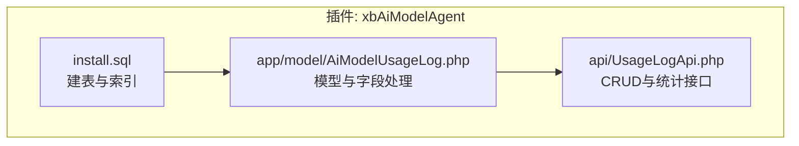
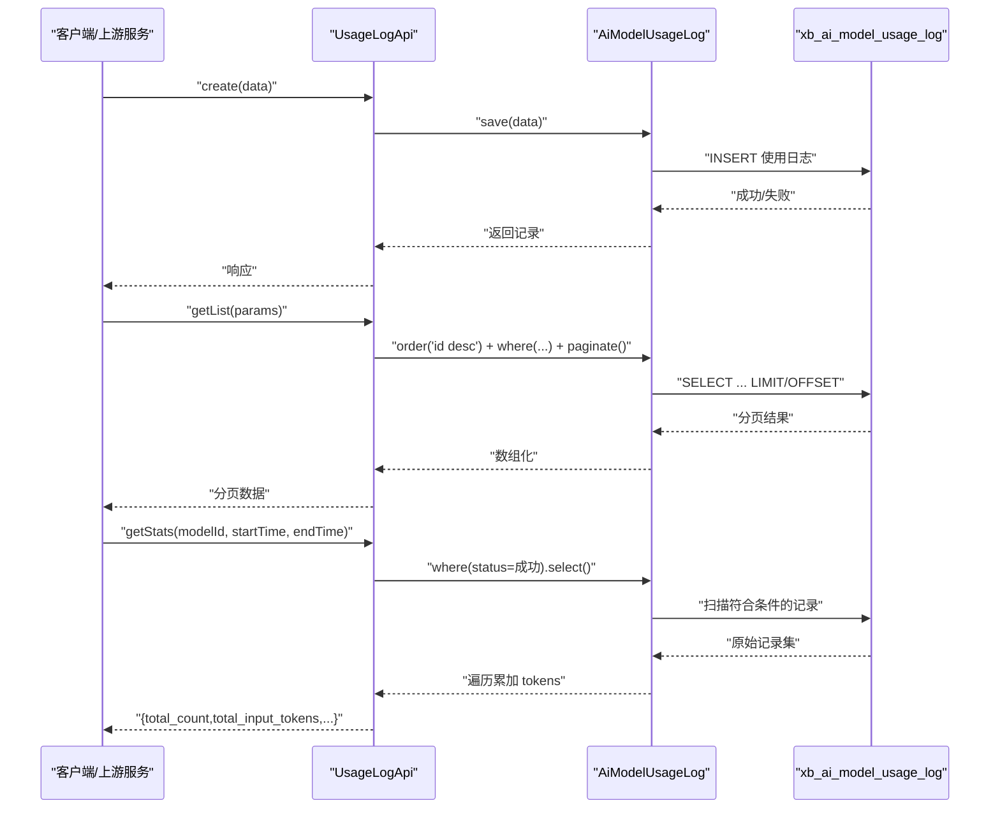
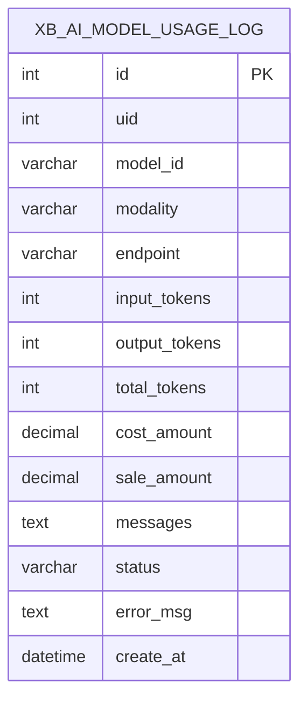
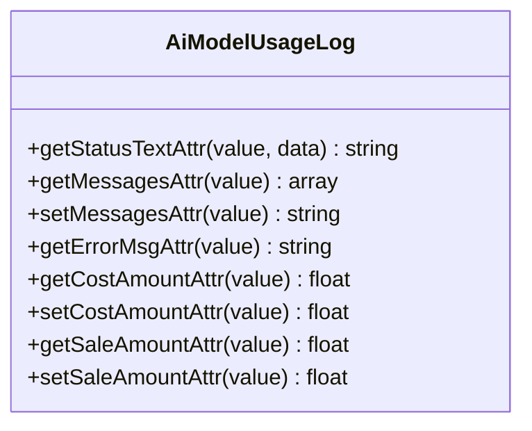
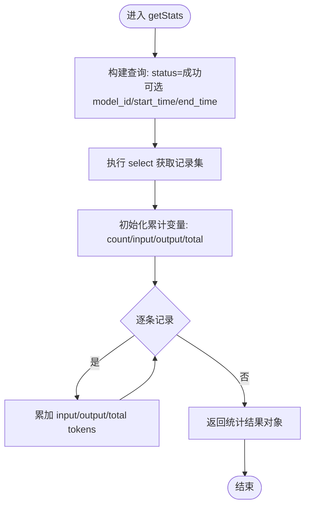
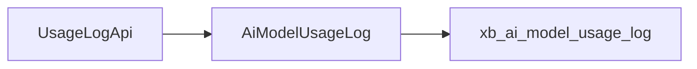

# 使用统计表结构

<cite>
**本文引用的文件**   
- [install.sql](file://server/plugin\xbAiModelAgent\install.sql)
- [UsageLogApi.php](file://server/plugin\xbAiModelAgent\api\UsageLogApi.php)
- [AiModelUsageLog.php](file://server/plugin\xbAiModelAgent\app\model\AiModelUsageLog.php)
</cite>

## 目录
1. [引言](#引言)
2. [项目结构](#项目结构)
3. [核心组件](#核心组件)
4. [架构总览](#架构总览)
5. [详细组件分析](#详细组件分析)
6. [依赖关系分析](#依赖关系分析)
7. [性能与扩展性](#性能与扩展性)
8. [故障排查指南](#故障排查指南)
9. [结论](#结论)
10. [附录](#附录)

## 引言
本文件围绕 AI 模型使用统计表 xb_ai_model_usage_log 的数据模型进行系统化说明，覆盖 token 计数统计、成本与销售金额计算、用户行为追踪、聊天交互记录的 JSON 结构设计、消息历史存储与上下文管理、实时计费与用量监控、配额管理与成本控制的数据实现思路，以及面向大数据量的分区策略、归档机制与查询优化方案。文档同时给出数据聚合方案，用于用户画像分析、使用趋势统计、模型效果评估与运营决策支持。

## 项目结构
与使用日志相关的代码位于插件 xbAiModelAgent 中，主要包含：
- 数据库建表脚本：定义 xb_ai_model_usage_log 等表结构与索引
- 模型层：封装字段访问器/修改器，统一 JSON 序列化与数值类型处理
- API 层：提供创建、分页查询、按条件筛选与基础统计接口

图表来源
- [install.sql:21-42](file://server/plugin\xbAiModelAgent\install.sql#L21-L42)
- [AiModelUsageLog.php:20-111](file://server/plugin\xbAiModelAgent\app\model\AiModelUsageLog.php#L20-L111)
- [UsageLogApi.php:45-153](file://server/plugin\xbAiModelAgent\api\UsageLogApi.php#L45-L153)

章节来源
- [install.sql:21-42](file://server/plugin\xbAiModelAgent\install.sql#L21-L42)
- [AiModelUsageLog.php:20-111](file://server/plugin\xbAiModelAgent\app\model\AiModelUsageLog.php#L20-L111)
- [UsageLogApi.php:45-153](file://server/plugin\xbAiModelAgent\api\UsageLogApi.php#L45-L153)

## 核心组件
- 数据表 xb_ai_model_usage_log：记录每次模型调用结果，包括用户ID、模型标识、模态、端点、输入/输出/总token数、成本金额、销售金额、聊天交互记录JSON、状态与错误信息、时间戳等，并建立常用查询索引。
- 模型 AiModelUsageLog：对 messages 字段进行 JSON 存取转换，对 cost_amount/sale_amount 做数值规范化，并提供 status 文本映射。
- API UsageLogApi：提供 create/getList/getDetail/getByModelId/getStats 等方法，支持按用户、模型、状态、时间范围筛选与分页，以及基础统计汇总。

章节来源
- [install.sql:21-42](file://server/plugin\xbAiModelAgent\install.sql#L21-L42)
- [AiModelUsageLog.php:20-111](file://server/plugin\xbAiModelAgent\app\model\AiModelUsageLog.php#L20-L111)
- [UsageLogApi.php:45-153](file://server/plugin\xbAiModelAgent\api\UsageLogApi.php#L45-L153)

## 架构总览
从业务侧到数据层的典型流程如下：

图表来源
- [UsageLogApi.php:45-153](file://server/plugin\xbAiModelAgent\api\UsageLogApi.php#L45-L153)
- [AiModelUsageLog.php:20-111](file://server/plugin\xbAiModelAgent\app\model\AiModelUsageLog.php#L20-L111)
- [install.sql:21-42](file://server/plugin\xbAiModelAgent\install.sql#L21-L42)

## 详细组件分析

### 数据表设计：xb_ai_model_usage_log
- 主键与索引
  - 主键：自增 id
  - 索引：idx_uid（用户维度）、idx_model_id（模型维度）、idx_create_at（时间维度）
- 关键字段
  - uid：用户ID
  - model_id：第三方模型标识
  - modality：模态类型（如聊天）
  - endpoint：接口端点
  - input_tokens/output_tokens/total_tokens：Token 计数
  - cost_amount/sale_amount：成本金额与销售金额（高精度小数）
  - messages：聊天交互记录 JSON
  - status/error_msg：状态与错误信息
  - create_at：记录时间

图表来源
- [install.sql:21-42](file://server/plugin\xbAiModelAgent\install.sql#L21-L42)

章节来源
- [install.sql:21-42](file://server/plugin\xbAiModelAgent\install.sql#L21-L42)

### 模型层：AiModelUsageLog
- 字段访问器/修改器
  - messages：读取时自动 JSON 反序列化为数组；写入时自动 JSON 编码为字符串，保留中文与斜杠
  - cost_amount/sale_amount：读写均强制为浮点数，避免空值或字符串导致计算异常
  - status_text：根据枚举映射返回可读文本
- 作用
  - 统一数据类型与格式，降低上层逻辑复杂度
  - 保证 JSON 字段与数值字段的健壮性

图表来源
- [AiModelUsageLog.php:20-111](file://server/plugin\xbAiModelAgent\app\model\AiModelUsageLog.php#L20-L111)

章节来源
- [AiModelUsageLog.php:20-111](file://server/plugin\xbAiModelAgent\app\model\AiModelUsageLog.php#L20-L111)

### API 层：UsageLogApi
- 能力概览
  - create：新增一条使用日志
  - getList：分页列表，支持 uid/model_id/status/start_time/end_time 筛选
  - getDetail：按 id 获取详情
  - getByModelId：按模型ID快捷查询
  - getStats：按模型ID与时间范围统计成功记录的总请求量与 token 总量
- 关键流程
  - 列表查询通过 order('id desc') 与动态 where 组合，最后 paginate()
  - 统计方法仅过滤成功状态，遍历记录累加 input_tokens/output_tokens/total_tokens

图表来源
- [UsageLogApi.php:119-153](file://server/plugin\xbAiModelAgent\api\UsageLogApi.php#L119-L153)

章节来源
- [UsageLogApi.php:45-153](file://server/plugin\xbAiModelAgent\api\UsageLogApi.php#L45-L153)

### 聊天交互记录 JSON 设计与上下文管理
- 设计目标
  - 完整记录一次对话的上下文，便于回溯、审计与效果评估
  - 支持多轮对话、系统提示、工具调用、图片/音频等多模态内容引用
- 建议结构（字段示例，非代码）
  - conversation_id：会话标识
  - user_id：用户标识
  - model_id：模型标识
  - endpoint：调用端点
  - messages：消息数组，每条消息包含 role/content/attachments/tool_calls 等
  - usage：本次调用的 token 用量明细（input/output/total）
  - metadata：扩展元数据（如 trace_id、region、version）
- 上下文管理要点
  - 在 messages 中维护完整的对话历史，必要时对长历史进行摘要或裁剪
  - 将 system prompt 与用户指令分离，便于分析与复用
  - 对敏感信息进行脱敏后再持久化

[本节为概念性说明，不直接分析具体文件]

### 实时计费、用量监控、配额管理与成本控制
- 实时计费
  - 基于 input_tokens/output_tokens/total_tokens 与模型定价策略计算 cost_amount/sale_amount
  - 建议在写入日志前完成预扣费，并在最终落库时进行退补调整
- 用量监控
  - 通过 API 的 getStats 与定时任务聚合，形成分钟/小时/日粒度指标
  - 结合 Redis 计数器实现近实时看板
- 配额管理
  - 以用户维度设置周期配额（日/月），在写入日志前校验剩余配额
  - 超限后降级或拒绝请求，并记录告警
- 成本控制
  - 对比 cost_amount 与 upstream_actual_cost（可参考任务日志表）识别异常
  - 对高成本模型进行限流与价格弹性策略

[本节为通用实践说明，不直接分析具体文件]

### 用户画像、使用趋势、模型效果评估与运营决策
- 用户画像
  - 基于 uid 维度的使用频次、偏好模型、活跃时段、平均会话长度等
- 使用趋势
  - 按时间窗口聚合 total_tokens、sale_amount、成功率等指标
- 模型效果评估
  - 结合 messages 中的质量信号（如重试次数、错误码分布、人工反馈）评估模型表现
- 运营决策
  - 依据 ROI（sale_amount - cost_amount）与用户留存进行资源倾斜与定价优化

[本节为概念性说明，不直接分析具体文件]

## 依赖关系分析
- 模块内依赖
  - UsageLogApi 依赖 AiModelUsageLog 模型进行数据访问
  - AiModelUsageLog 依赖数据库表 xb_ai_model_usage_log 的结构与索引
- 外部依赖
  - 数据库引擎与索引策略直接影响查询与统计性能
  - 若引入缓存/队列，需考虑一致性与时序问题

图表来源
- [UsageLogApi.php:45-153](file://server/plugin\xbAiModelAgent\api\UsageLogApi.php#L45-L153)
- [AiModelUsageLog.php:20-111](file://server/plugin\xbAiModelAgent\app\model\AiModelUsageLog.php#L20-L111)
- [install.sql:21-42](file://server/plugin\xbAiModelAgent\install.sql#L21-L42)

章节来源
- [UsageLogApi.php:45-153](file://server/plugin\xbAiModelAgent\api\UsageLogApi.php#L45-L153)
- [AiModelUsageLog.php:20-111](file://server/plugin\xbAiModelAgent\app\model\AiModelUsageLog.php#L20-L111)
- [install.sql:21-42](file://server/plugin\xbAiModelAgent\install.sql#L21-L42)

## 性能与扩展性
- 索引与查询
  - 已有 idx_uid、idx_model_id、idx_create_at，满足常见筛选与排序
  - 复杂多维查询建议增加复合索引，如 (uid, create_at)、(model_id, create_at)
- 大表治理
  - 分区策略：按 create_at 按月/周分区，提升历史数据清理与范围查询效率
  - 归档机制：将超过阈值的旧分区迁移至冷存储，保留热数据在在线库
  - 压缩与列存：对 messages 等大字段采用压缩存储或外置对象存储，表内仅留引用
- 统计优化
  - 将 getStats 的聚合结果物化到汇总表（如按天/模型/用户），减少全表扫描
  - 增量更新：在写入日志的同时异步更新聚合指标
- 写入吞吐
  - 批量写入与异步落库，避免阻塞主链路
  - 使用连接池与事务批处理，降低锁竞争

[本节为通用优化建议，不直接分析具体文件]

## 故障排查指南
- 常见问题定位
  - 写入失败：检查 status 与 error_msg，确认上游返回与本地计算逻辑
  - 金额异常：核对 cost_amount/sale_amount 的精度与来源，确保数值类型一致
  - 查询缓慢：检查是否命中索引，是否存在未优化的全表扫描
- 诊断步骤
  - 使用 getDetail 拉取单条记录，验证 messages 结构完整性
  - 使用 getList 逐步缩小筛选条件，定位慢查询
  - 使用 getStats 对比前后端统计口径差异

章节来源
- [UsageLogApi.php:94-110](file://server/plugin\xbAiModelAgent\api\UsageLogApi.php#L94-L110)
- [AiModelUsageLog.php:67-111](file://server/plugin\xbAiModelAgent\app\model\AiModelUsageLog.php#L67-L111)

## 结论
xb_ai_model_usage_log 作为 AI 模型使用的核心统计表，提供了用户、模型、时间与费用等关键维度数据，配合模型层的字段处理与 API 层的查询统计能力，能够支撑实时计费、用量监控、配额控制与运营分析。在大流量场景下，建议结合分区、归档、物化聚合与索引优化等手段，保障系统的可扩展性与稳定性。

## 附录
- 相关字段与含义
  - uid：用户ID
  - model_id：第三方模型标识
  - modality：模态类型（如聊天）
  - endpoint：接口端点
  - input_tokens/output_tokens/total_tokens：Token 计数
  - cost_amount/sale_amount：成本金额与销售金额
  - messages：聊天交互记录 JSON
  - status/error_msg：状态与错误信息
  - create_at：记录时间

章节来源
- [install.sql:21-42](file://server/plugin\xbAiModelAgent\install.sql#L21-L42)