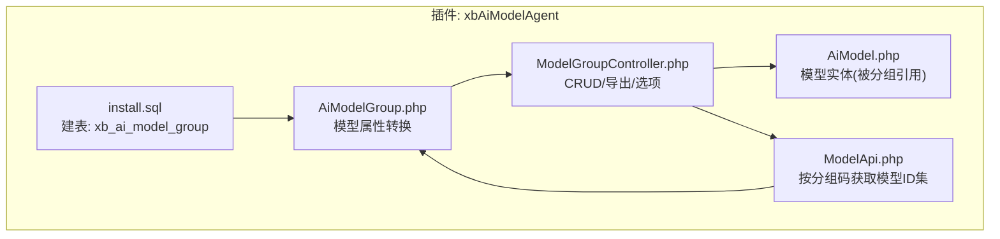
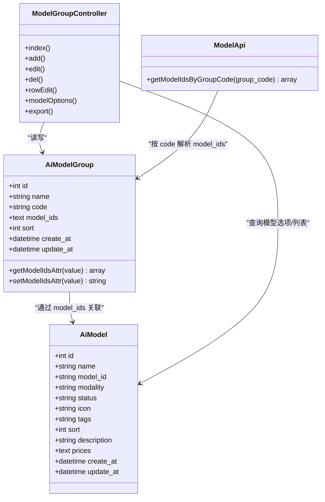
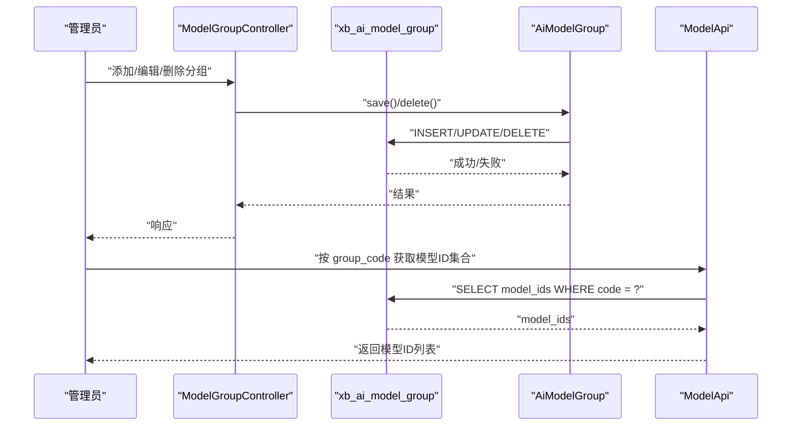
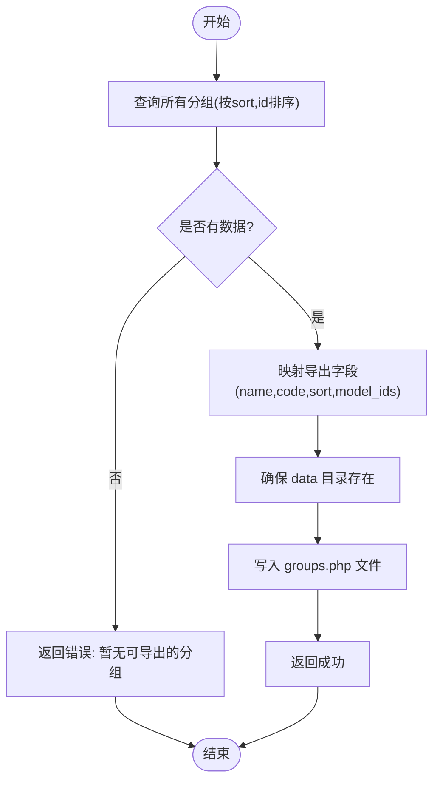
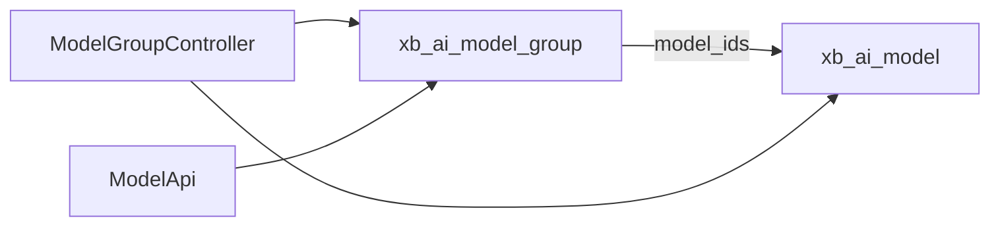
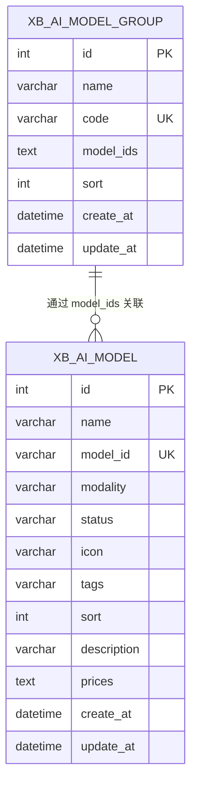

# 模型分组表结构

<cite>
**本文引用的文件**   
- [install.sql](file://server/plugin/xbAiModelAgent/install.sql)
- [AiModelGroup.php](file://server/plugin/xbAiModelAgent/app/model/AiModelGroup.php)
- [ModelGroupController.php](file://server/plugin/xbAiModelAgent/app/admin/controller/ModelGroupController.php)
- [AiModel.php](file://server/plugin/xbAiModelAgent/app/model/AiModel.php)
- [ModelApi.php](file://server/plugin/xbAiModelAgent/api/ModelApi.php)
</cite>

## 目录
1. [简介](#简介)
2. [项目结构](#项目结构)
3. [核心组件](#核心组件)
4. [架构总览](#架构总览)
5. [详细组件分析](#详细组件分析)
6. [依赖关系分析](#依赖关系分析)
7. [性能与一致性](#性能与一致性)
8. [故障排查指南](#故障排查指南)
9. [结论](#结论)
10. [附录](#附录)

## 简介
本文件围绕 xb_ai_model_group 模型分组表，系统化阐述其数据模型设计、分组层级管理、模型关联机制、动态组合策略、权限控制与访问路由的数据结构设计要点，以及推荐算法、智能匹配和个性化服务所需的数据支撑。同时给出分组缓存策略、实时更新与一致性保证方案，并提供分组继承、模板复用与批量操作的数据库设计模式建议。

## 项目结构
与模型分组相关的代码主要位于 xbAiModelAgent 插件中：
- 数据库定义：install.sql
- 模型层：app/model/AiModelGroup.php（含 model_ids 字段序列化/反序列化）
- 控制器层：app/admin/controller/ModelGroupController.php（CRUD、导出、选项接口）
- 模型实体：app/model/AiModel.php（用于列表展示与价格计算等）
- API 层：api/ModelApi.php（按分组码解析模型ID集合）

图表来源
- [install.sql:77-91](file://server/plugin/xbAiModelAgent/install.sql#L77-L91)
- [AiModelGroup.php:1-47](file://server/plugin/xbAiModelAgent/app/model/AiModelGroup.php#L1-L47)
- [ModelGroupController.php:1-269](file://server/plugin/xbAiModelAgent/app/admin/controller/ModelGroupController.php#L1-L269)
- [AiModel.php:1-198](file://server/plugin/xbAiModelAgent/app/model/AiModel.php#L1-L198)
- [ModelApi.php:60-130](file://server/plugin/xbAiModelAgent/api/ModelApi.php#L60-L130)

章节来源
- [install.sql:77-91](file://server/plugin/xbAiModelAgent/install.sql#L77-L91)
- [AiModelGroup.php:1-47](file://server/plugin/xbAiModelAgent/app/model/AiModelGroup.php#L1-L47)
- [ModelGroupController.php:1-269](file://server/plugin/xbAiModelAgent/app/admin/controller/ModelGroupController.php#L1-L269)
- [AiModel.php:1-198](file://server/plugin/xbAiModelAgent/app/model/AiModel.php#L1-L198)
- [ModelApi.php:60-130](file://server/plugin/xbAiModelAgent/api/ModelApi.php#L60-L130)

## 核心组件
- 分组表 xb_ai_model_group
  - 主键 id
  - name 分组名称
  - code 分组标识（唯一索引 idx_code）
  - model_ids 关联的模型ID列表（文本存储，逗号分隔；模型层提供数组存取器）
  - sort 排序（值越小越靠前）
  - create_at/update_at 时间戳
- 模型类 AiModelGroup
  - 提供 model_ids 字段的存取器，将逗号分隔字符串与数组互相转换
- 控制器 ModelGroupController
  - 提供分组列表、新增、编辑、删除、快速行编辑、模型选项接口、导出为 PHP 配置
- 模型实体 AiModel
  - 被分组通过 model_ids 引用，用于列表展示与价格计算等

章节来源
- [install.sql:77-91](file://server/plugin/xbAiModelAgent/install.sql#L77-L91)
- [AiModelGroup.php:1-47](file://server/plugin/xbAiModelAgent/app/model/AiModelGroup.php#L1-L47)
- [ModelGroupController.php:1-269](file://server/plugin/xbAiModelAgent/app/admin/controller/ModelGroupController.php#L1-L269)
- [AiModel.php:1-198](file://server/plugin/xbAiModelAgent/app/model/AiModel.php#L1-L198)

## 架构总览
从“分组→模型”的关系看，分组作为逻辑容器，以 model_ids 维护与模型的关联。控制器负责后台管理与导出，API 层根据分组码解析出模型ID集合供业务使用。

图表来源
- [AiModelGroup.php:1-47](file://server/plugin/xbAiModelAgent/app/model/AiModelGroup.php#L1-L47)
- [AiModel.php:1-198](file://server/plugin/xbAiModelAgent/app/model/AiModel.php#L1-L198)
- [ModelGroupController.php:1-269](file://server/plugin/xbAiModelAgent/app/admin/controller/ModelGroupController.php#L1-L269)
- [ModelApi.php:60-130](file://server/plugin/xbAiModelAgent/api/ModelApi.php#L60-L130)

## 详细组件分析

### 数据模型与字段语义
- 分组层级管理
  - 当前表未包含 parent_id 或 path 等层级字段，属于扁平分组。若需支持多级分组，可在现有基础上扩展 parent_id、level、path 等字段，并配合递归查询实现树形结构。
- 模型关联机制
  - 通过 model_ids 文本字段保存多个模型ID，模型层提供存取器将其转换为数组，便于在应用层进行集合操作。
- 动态组合策略
  - 结合 code 唯一标识，可在上层服务中以“分组码→模型ID集合”的方式动态组装模型列表，满足多场景按需组合。

章节来源
- [install.sql:77-91](file://server/plugin/xbAiModelAgent/install.sql#L77-L91)
- [AiModelGroup.php:1-47](file://server/plugin/xbAiModelAgent/app/model/AiModelGroup.php#L1-L47)

### 分组权限控制、访问策略与路由规则的数据结构设计
- 权限控制
  - 当前分组表未内置权限字段。建议在分组表增加 role_ids 或 policy_json 字段，或在独立的“分组-角色/用户”关联表中记录授权关系，以实现细粒度访问控制。
- 访问策略
  - 可引入 visibility 字段（如公开/私有/白名单），并结合用户上下文在服务端校验是否允许访问该分组下的模型。
- 路由规则
  - 基于 code 作为路由参数，例如 /api/models?group_code=xxx，由 API 层解析后返回对应模型ID集合，再进一步过滤状态、模态等条件。

[本节为概念性设计说明，不直接分析具体文件]

### 模型推荐算法、智能匹配与个性化服务的数据模型支持
- 基础能力
  - 利用分组对模型进行聚合，结合模型标签 tags、模态 modality、状态 status 等字段，构建候选集。
- 推荐与匹配
  - 可在上层服务中引入用户画像、历史行为、偏好权重等维度，结合分组聚合结果进行打分排序。
  - 可将推荐结果落库至“分组-推荐快照”或“用户-推荐会话”表，以便复现与回溯。
- 个性化
  - 通过“用户-分组可见性”、“用户-模型偏好”等扩展表，实现千人千面的模型推荐与展示。

[本节为概念性设计说明，不直接分析具体文件]

### 分组缓存策略、实时更新与一致性保证
- 缓存策略
  - 以 code 为键，缓存“分组→模型ID集合”映射，设置合理过期时间与版本号，避免频繁读库。
- 实时更新
  - 当分组或模型发生变更时，主动失效相关缓存键；或使用带版本号的缓存更新策略。
- 一致性保证
  - 采用“先写库，再删缓存”的策略；必要时引入消息队列异步刷新，确保最终一致。
- 监控与回滚
  - 记录缓存命中率与异常率，提供一键重建缓存能力。

[本节为通用技术建议，不直接分析具体文件]

### 分组继承、模板复用与批量操作的数据库设计模式
- 分组继承
  - 引入 parent_id 与 inherit 标志位，子分组可继承父分组的模型集合，并在自身 model_ids 中追加差异化模型。
- 模板复用
  - 建立“分组模板”表，保存模板化的 name/code/sort/model_ids，创建分组时复制模板内容。
- 批量操作
  - 提供“批量导入/导出”接口，结合 CSV/JSON 批量写入；导出功能已存在（导出为 PHP 配置）。

[本节为概念性设计说明，不直接分析具体文件]

### 控制器与API交互流程（序列图）

图表来源
- [ModelGroupController.php:100-177](file://server/plugin/xbAiModelAgent/app/admin/controller/ModelGroupController.php#L100-L177)
- [AiModelGroup.php:1-47](file://server/plugin/xbAiModelAgent/app/model/AiModelGroup.php#L1-L47)
- [ModelApi.php:60-130](file://server/plugin/xbAiModelAgent/api/ModelApi.php#L60-L130)

### 复杂逻辑流程图（导出分组为PHP配置）

图表来源
- [ModelGroupController.php:208-235](file://server/plugin/xbAiModelAgent/app/admin/controller/ModelGroupController.php#L208-L235)

## 依赖关系分析
- 分组表与模型实体的关系
  - 分组通过 model_ids 间接引用模型实体，形成一对多的逻辑关系。
- 控制器与模型/实体的耦合
  - 控制器依赖模型类完成 CRUD，依赖模型实体获取选项与列表信息。
- API 与分组表的解耦
  - API 仅通过 code 查询 model_ids，降低对外暴露的复杂度。

图表来源
- [install.sql:77-91](file://server/plugin/xbAiModelAgent/install.sql#L77-L91)
- [ModelGroupController.php:1-269](file://server/plugin/xbAiModelAgent/app/admin/controller/ModelGroupController.php#L1-L269)
- [ModelApi.php:60-130](file://server/plugin/xbAiModelAgent/api/ModelApi.php#L60-L130)

章节来源
- [install.sql:77-91](file://server/plugin/xbAiModelAgent/install.sql#L77-L91)
- [ModelGroupController.php:1-269](file://server/plugin/xbAiModelAgent/app/admin/controller/ModelGroupController.php#L1-L269)
- [ModelApi.php:60-130](file://server/plugin/xbAiModelAgent/api/ModelApi.php#L60-L130)

## 性能与一致性
- 查询优化
  - 列表页按 sort 与 id 排序，建议为 (sort, id) 建立复合索引以提升分页性能。
  - 列表加载时二次查询模型名称，建议合并查询或引入缓存以减少 N+1 问题。
- 写入优化
  - 批量导入时使用事务与分批提交，避免长事务锁表。
- 缓存与一致性
  - 针对“分组→模型ID集合”的高频读取路径，引入 Redis 缓存，变更时主动失效。
  - 对于导出脚本，建议在低峰期执行，避免影响在线服务。

[本节为通用性能建议，不直接分析具体文件]

## 故障排查指南
- 常见问题
  - 分组不存在：检查 id 是否存在于分组表。
  - 模型选项为空：确认模型状态为正常且存在可用模型。
  - 导出失败：检查 data 目录写入权限。
- 定位方法
  - 查看控制器返回的错误信息与日志。
  - 核对数据库索引与约束是否生效。
  - 验证缓存键是否正确失效。

章节来源
- [ModelGroupController.php:148-177](file://server/plugin/xbAiModelAgent/app/admin/controller/ModelGroupController.php#L148-L177)
- [ModelGroupController.php:208-235](file://server/plugin/xbAiModelAgent/app/admin/controller/ModelGroupController.php#L208-L235)

## 结论
xb_ai_model_group 提供了轻量而灵活的模型分组能力，通过 code 唯一标识与 model_ids 文本字段，实现了分组到模型的动态组合。结合控制器与 API 层的封装，可满足常见的分组管理、选项选择与按组筛选需求。面向更复杂的场景，可在现有基础上扩展层级、权限、模板与缓存机制，进一步提升系统的可扩展性与一致性保障。

## 附录

### 数据模型ER图

图表来源
- [install.sql:4-18](file://server/plugin/xbAiModelAgent/install.sql#L4-L18)
- [install.sql:77-91](file://server/plugin/xbAiModelAgent/install.sql#L77-L91)