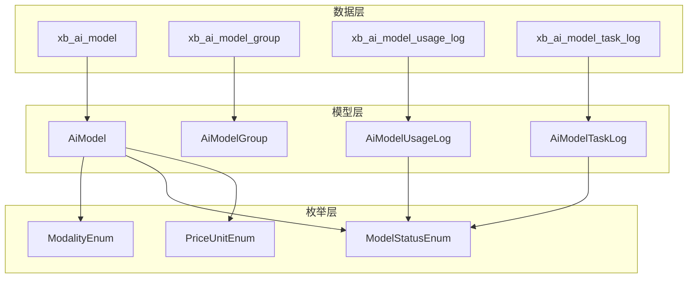
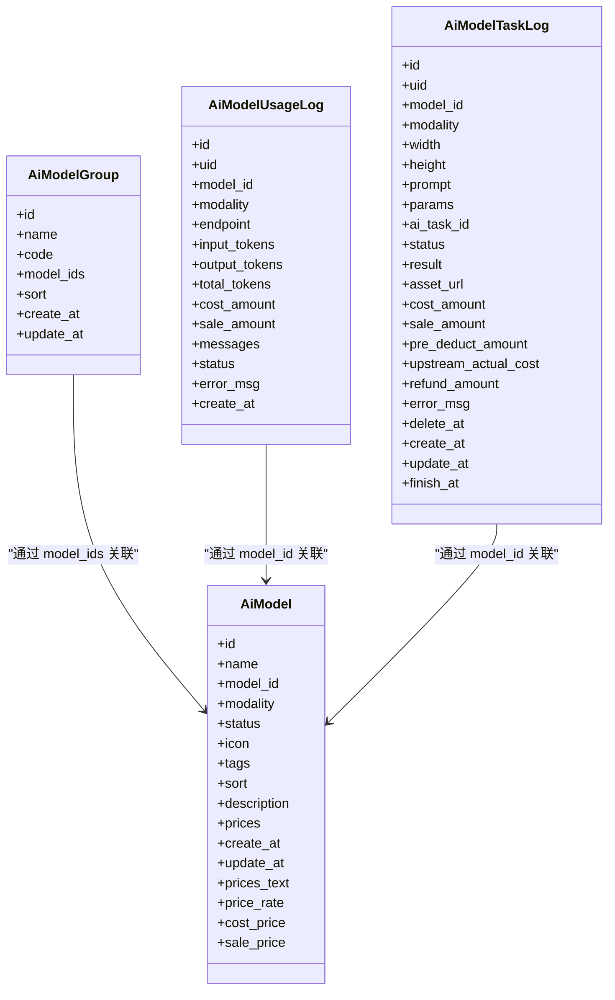
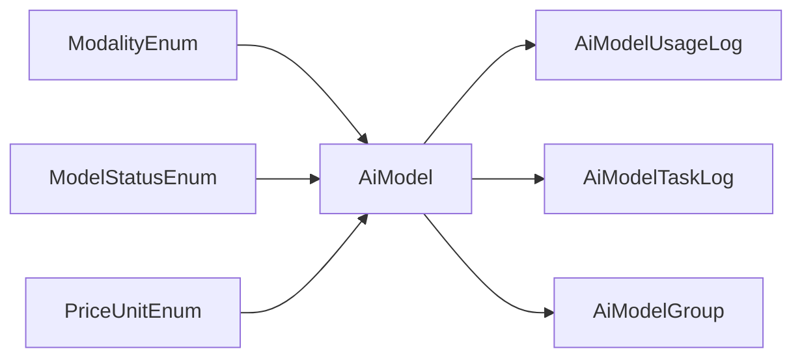

# 模型核心配置表结构

<cite>
**本文引用的文件**   
- [install.sql](file://server/plugin\xbAiModelAgent\install.sql)
- [update.sql](file://server/plugin\xbAiModelAgent\update.sql)
- [AiModel.php](file://server/plugin\xbAiModelAgent\app\model\AiModel.php)
- [AiModelGroup.php](file://server/plugin\xbAiModelAgent\app\model\AiModelGroup.php)
- [AiModelTaskLog.php](file://server/plugin\xbAiModelAgent\app\model\AiModelTaskLog.php)
- [AiModelUsageLog.php](file://server/plugin\xbAiModelAgent\app\model\AiModelUsageLog.php)
- [ModalityEnum.php](file://server/plugin\xbAiModelAgent\enum\ModalityEnum.php)
- [ModelStatusEnum.php](file://server/plugin\xbAiModelAgent\enum\ModelStatusEnum.php)
- [PriceUnitEnum.php](file://server/plugin\xbAiModelAgent\enum\PriceUnitEnum.php)
</cite>

## 目录
1. [简介](#简介)
2. [项目结构](#项目结构)
3. [核心组件](#核心组件)
4. [架构总览](#架构总览)
5. [详细组件分析](#详细组件分析)
6. [依赖关系分析](#依赖关系分析)
7. [性能与索引优化](#性能与索引优化)
8. [数据迁移方案](#数据迁移方案)
9. [故障排查指南](#故障排查指南)
10. [结论](#结论)

## 简介
本文件围绕 xb_ai_model 模型核心配置表及其关联的数据模型，系统化阐述字段设计、多模态支持机制、标签与排序策略、价格体系与计费扩展点、版本管理与动态配置更新思路，以及健康检查、负载均衡与故障转移的数据结构设计建议。文档同时给出完整的字段定义、索引优化策略与数据迁移方案，帮助读者快速理解并落地实施。

## 项目结构
xb_ai_model 相关数据模型位于插件 xbAiModelAgent 中，包含：
- 模型主表与分组表
- 使用日志与任务日志
- 枚举定义（模态类型、状态、计费单位）
- 模型类中的获取器/修改器与计算逻辑

图表来源
- [install.sql:1-91](file://server/plugin\xbAiModelAgent\install.sql#L1-L91)
- [AiModel.php:1-198](file://server/plugin\xbAiModelAgent\app\model\AiModel.php#L1-L198)
- [AiModelGroup.php:1-47](file://server/plugin\xbAiModelAgent\app\model\AiModelGroup.php#L1-L47)
- [AiModelUsageLog.php:1-111](file://server/plugin\xbAiModelAgent\app\model\AiModelUsageLog.php#L1-L111)
- [AiModelTaskLog.php:1-211](file://server/plugin\xbAiModelAgent\app\model\AiModelTaskLog.php#L1-L211)
- [ModalityEnum.php:1-157](file://server/plugin\xbAiModelAgent\enum\ModalityEnum.php#L1-L157)
- [ModelStatusEnum.php:1-39](file://server/plugin\xbAiModelAgent\enum\ModelStatusEnum.php#L1-L39)
- [PriceUnitEnum.php:1-61](file://server/plugin\xbAiModelAgent\enum\PriceUnitEnum.php#L1-L61)

章节来源
- [install.sql:1-91](file://server/plugin\xbAiModelAgent\install.sql#L1-L91)

## 核心组件
- 模型主表 xb_ai_model：承载模型标识、名称、模态类型、状态、图标、标签、排序、描述与上游原始价格 JSON 等核心信息。
- 模型分组表 xb_ai_model_group：用于将多个模型归组，便于前端展示与管理。
- 使用日志表 xb_ai_model_usage_log：记录文本聊天等按 Token 计费的调用明细与成本/销售金额。
- 任务日志表 xb_ai_model_task_log：记录图片/音频/视频等多模态任务的执行过程、结果与结算字段。
- 枚举：模态类型、状态、计费单位等统一由枚举维护，保证前后端一致。

章节来源
- [install.sql:1-91](file://server/plugin\xbAiModelAgent\install.sql#L1-L91)
- [ModalityEnum.php:1-157](file://server/plugin\xbAiModelAgent\enum\ModalityEnum.php#L1-L157)
- [ModelStatusEnum.php:1-39](file://server/plugin\xbAiModelAgent\enum\ModelStatusEnum.php#L1-L39)
- [PriceUnitEnum.php:1-61](file://server/plugin\xbAiModelAgent\enum\PriceUnitEnum.php#L1-L61)

## 架构总览
从数据到模型的映射关系如下：

图表来源
- [AiModel.php:1-198](file://server/plugin\xbAiModelAgent\app\model\AiModel.php#L1-L198)
- [AiModelGroup.php:1-47](file://server/plugin\xbAiModelAgent\app\model\AiModelGroup.php#L1-L47)
- [AiModelUsageLog.php:1-111](file://server/plugin\xbAiModelAgent\app\model\AiModelUsageLog.php#L1-L111)
- [AiModelTaskLog.php:1-211](file://server/plugin\xbAiModelAgent\app\model\AiModelTaskLog.php#L1-L211)

## 详细组件分析

### 模型主表 xb_ai_model 字段定义与语义
- id：自增主键
- name：模型名称
- model_id：第三方模型标识（唯一性建议在业务侧约束）
- modality：模态类型（10=文本，20=图片，30=音频，40=视频）
- status：状态（10=下架，20=正常）
- icon：图标标识（如 @lobehub/icons）
- tags：标签（逗号分隔或结构化存储，当前为字符串）
- sort：排序（值越小越靠前）
- description：描述
- prices：上游原始价格配置 JSON（文本存储）
- create_at/update_at：时间戳

说明：
- 价格字段 prices 采用 JSON 存储上游原始价格，便于灵活扩展不同模态的计费规则。
- 模型类 AiModel 提供虚拟字段与格式化输出：
  - prices_text：将上游价格格式化为可读文本
  - price_rate：全局倍率（来自系统配置）
  - cost_price/sale_price：成本价与销售价的格式化展示

章节来源
- [install.sql:4-18](file://server/plugin\xbAiModelAgent\install.sql#L4-L18)
- [AiModel.php:23-198](file://server/plugin\xbAiModelAgent\app\model\AiModel.php#L23-L198)

### 模型分组 xb_ai_model_group
- id：自增主键
- name：分组名称
- code：分组标识（建议唯一）
- model_ids：关联模型ID列表（逗号分隔）
- sort：排序
- create_at/update_at：时间戳

说明：
- 模型类 AiModelGroup 对 model_ids 提供存取转换（数组与逗号分隔字符串互转）。

章节来源
- [install.sql:78-90](file://server/plugin\xbAiModelAgent\install.sql#L78-L90)
- [AiModelGroup.php:19-46](file://server/plugin\xbAiModelAgent\app\model\AiModelGroup.php#L19-L46)

### 使用日志 xb_ai_model_usage_log
- id：自增主键
- uid：用户ID
- model_id：模型ID
- modality：模态类型
- endpoint：接口端点
- input_tokens/output_tokens/total_tokens：Token 统计
- cost_amount/sale_amount：成本金额/销售金额
- messages：聊天交互记录 JSON
- status：状态（成功/失败）
- error_msg：错误信息
- create_at：创建时间

说明：
- 新增 cost_amount/sale_amount 字段用于计费统计。
- 已建立常用索引：uid、model_id、create_at。

章节来源
- [install.sql:21-42](file://server/plugin\xbAiModelAgent\install.sql#L21-L42)
- [update.sql:12-14](file://server/plugin\xbAiModelAgent\update.sql#L12-L14)
- [AiModelUsageLog.php:20-111](file://server/plugin\xbAiModelAgent\app\model\AiModelUsageLog.php#L20-L111)

### 任务日志 xb_ai_model_task_log
- id：自增主键
- uid：用户ID
- model_id：模型ID
- modality：模态类型
- width/height：分辨率
- prompt：提示词
- params：请求参数 JSON
- ai_task_id：上游任务ID
- status：任务状态（待执行/执行中/已完成/失败）
- result：生成结果 JSON
- asset_url：媒体资产URL
- cost_amount/sale_amount：成本/销售金额
- pre_deduct_amount：预扣金额
- upstream_actual_cost：上游实际成本
- refund_amount：退补金额（正=退款，负=补扣）
- error_msg：错误信息
- delete_at/create_at/update_at/finish_at：时间戳

说明：
- 移除 task_queue_id 字段及对应索引。
- 新增多项结算字段以支持更精细的计费与退补。
- 已建立常用索引：uid、model_id、status、create_at。

章节来源
- [install.sql:45-75](file://server/plugin\xbAiModelAgent\install.sql#L45-L75)
- [update.sql:5-7](file://server/plugin\xbAiModelAgent\update.sql#L5-L7)
- [update.sql:16-24](file://server/plugin\xbAiModelAgent\update.sql#L16-L24)
- [AiModelTaskLog.php:22-211](file://server/plugin\xbAiModelAgent\app\model\AiModelTaskLog.php#L22-L211)

### 枚举与多模态支持
- ModalityEnum：定义文本/图片/音频/视频四种模态，并提供服务类反射方法解析能力，便于动态发现各模态的服务方法与端点选项。
- ModelStatusEnum：定义模型状态（下架/正常）。
- PriceUnitEnum：定义多种计费单位（Token、每张、尺寸、每秒、规格、区间等），作为价格体系扩展的基础。

章节来源
- [ModalityEnum.php:1-157](file://server/plugin\xbAiModelAgent\enum\ModalityEnum.php#L1-L157)
- [ModelStatusEnum.php:1-39](file://server/plugin\xbAiModelAgent\enum\ModelStatusEnum.php#L1-L39)
- [PriceUnitEnum.php:1-61](file://server/plugin\xbAiModelAgent\enum\PriceUnitEnum.php#L1-L61)

### 价格体系与动态配置
- 上游价格：存储在 xb_ai_model.prices（JSON），支持不同模态的多维度定价（如输入/输出单价、按尺寸/时长阶梯等）。
- 全局倍率：通过系统配置项 aiModel.model_price_rate 控制整体倍率。
- 销售价计算：在模型类中调用价格服务进行销售价计算与格式化展示。

章节来源
- [AiModel.php:159-196](file://server/plugin\xbAiModelAgent\app\model\AiModel.php#L159-L196)

### 标签分类系统与排序策略
- 标签：当前 tags 字段为字符串，可存储逗号分隔的标签集合；如需复杂查询，建议后续演进为独立标签表或 JSON 化存储。
- 排序：sort 字段用于列表排序，值越小越靠前。

章节来源
- [install.sql:4-18](file://server/plugin\xbAiModelAgent\install.sql#L4-L18)

### 模型接入规范与服务发现
- 模态类型与服务类绑定：通过 ModalityEnum 的 service 字段指向具体服务类。
- 动态方法发现：基于反射扫描服务类的公开方法，自动生成端点选项，降低硬编码维护成本。

章节来源
- [ModalityEnum.php:77-129](file://server/plugin\xbAiModelAgent\enum\ModalityEnum.php#L77-L129)

### 版本管理、A/B测试与动态配置更新（设计建议）
- 版本管理：可在 xb_ai_model 增加 version 字段或在 prices 中嵌入版本号，配合 update_at 实现变更追踪。
- A/B测试：引入流量分配权重字段（如 weight），结合路由层按权重选择模型实例或后端服务。
- 动态配置更新：利用系统配置中心（如 ConfigApi）下发全局倍率、灰度开关等，模型类读取后实时生效。

[本节为概念性设计建议，不直接分析具体代码文件]

### 健康检查、负载均衡与故障转移（数据结构建议）
- 健康检查：在 xb_ai_model 增加 health_status、last_check_at、fail_count 等字段，配合定时任务更新。
- 负载均衡：在路由或服务选择层依据 health_status、fail_count、weight 等字段进行决策。
- 故障转移：当某模型实例健康异常时，自动切换到备用实例或降级策略。

[本节为概念性设计建议，不直接分析具体代码文件]

## 依赖关系分析
- 模型类依赖枚举：AiModel/AiModelUsageLog/AiModelTaskLog 均依赖相应枚举进行文本渲染与状态映射。
- 模型类依赖配置与价格服务：AiModel 读取全局倍率并调用价格服务计算销售价。
- 日志表与主表通过 model_id 关联，形成“模型-日志”的查询链路。

图表来源
- [AiModel.php:1-198](file://server/plugin\xbAiModelAgent\app\model\AiModel.php#L1-L198)
- [AiModelUsageLog.php:1-111](file://server/plugin\xbAiModelAgent\app\model\AiModelUsageLog.php#L1-L111)
- [AiModelTaskLog.php:1-211](file://server/plugin\xbAiModelAgent\app\model\AiModelTaskLog.php#L1-L211)
- [AiModelGroup.php:1-47](file://server/plugin\xbAiModelAgent\app\model\AiModelGroup.php#L1-L47)
- [ModalityEnum.php:1-157](file://server/plugin\xbAiModelAgent\enum\ModalityEnum.php#L1-L157)
- [ModelStatusEnum.php:1-39](file://server/plugin\xbAiModelAgent\enum\ModelStatusEnum.php#L1-L39)
- [PriceUnitEnum.php:1-61](file://server/plugin\xbAiModelAgent\enum\PriceUnitEnum.php#L1-L61)

## 性能与索引优化
- 现有索引：
  - usage_log：uid、model_id、create_at
  - task_log：uid、model_id、status、create_at
  - group：code
- 建议优化：
  - 若频繁按 tags 过滤，可将 tags 改为 JSON 或使用独立标签表，并建立合适索引。
  - 若按 model_id 高频查询，确保该列有索引（已在日志表中存在）。
  - 针对价格计算热点路径，考虑缓存全局倍率与价格映射。

章节来源
- [install.sql:38-41](file://server/plugin\xbAiModelAgent\install.sql#L38-L41)
- [install.sql:70-74](file://server/plugin\xbAiModelAgent\install.sql#L70-L74)
- [install.sql:88-89](file://server/plugin\xbAiModelAgent\install.sql#L88-L89)

## 数据迁移方案
- 升级脚本要点：
  - 移除 task_log.task_queue_id 字段及索引
  - 调整 model.prices 注释为“上游原始价格配置JSON”
  - 为 usage_log/task_log 新增 cost_amount/sale_amount 字段
  - 为 task_log 新增 pre_deduct_amount/upstream_actual_cost/refund_amount 字段
- 迁移步骤建议：
  - 备份数据库
  - 执行 update.sql
  - 验证字段与索引是否正确添加
  - 运行基础数据校验（如金额字段默认值、JSON 字段合法性）

章节来源
- [update.sql:1-25](file://server/plugin\xbAiModelAgent\update.sql#L1-L25)

## 故障排查指南
- 常见问题定位：
  - 价格显示为空：检查 prices 是否为合法 JSON，确认 AiModel 的 getPricesAttr/setPricesAttr 是否正常工作。
  - 销售价未生效：确认全局倍率配置 aiModel.model_price_rate 是否存在且数值有效。
  - 任务日志金额异常：核对 cost_amount/sale_amount/pre_deduct_amount/upstream_actual_cost/refund_amount 的计算逻辑与写入时机。
  - 枚举文本不正确：检查 ModelStatusEnum/ModalityEnum 的值与数据库存储是否一致。
- 日志与诊断：
  - 使用 usage_log/task_log 的 status/error_msg 字段定位失败原因。
  - 关注 create_at/update_at/finish_at 的时间线，辅助判断超时与重试问题。

章节来源
- [AiModel.php:58-196](file://server/plugin\xbAiModelAgent\app\model\AiModel.php#L58-L196)
- [AiModelUsageLog.php:20-111](file://server/plugin\xbAiModelAgent\app\model\AiModelUsageLog.php#L20-L111)
- [AiModelTaskLog.php:22-211](file://server/plugin\xbAiModelAgent\app\model\AiModelTaskLog.php#L22-L211)
- [ModelStatusEnum.php:1-39](file://server/plugin\xbAiModelAgent\enum\ModelStatusEnum.php#L1-L39)
- [ModalityEnum.php:1-157](file://server/plugin\xbAiModelAgent\enum\ModalityEnum.php#L1-L157)

## 结论
xb_ai_model 及其关联表构成了 AI 模型配置与计费的核心数据底座。通过 JSON 化的价格配置与枚举驱动的多模态服务发现，系统在扩展性与可维护性上具备良好基础。结合本文提供的字段定义、索引优化与迁移方案，可进一步提升查询性能与运维稳定性。对于版本管理、A/B测试与健康治理等高级特性，建议按本文设计建议逐步演进，以满足更大规模的生产需求。