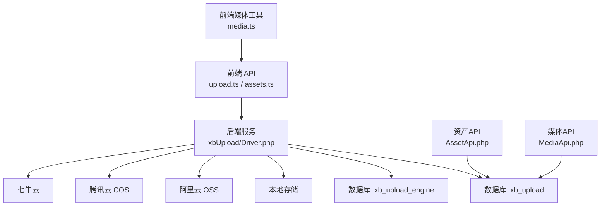
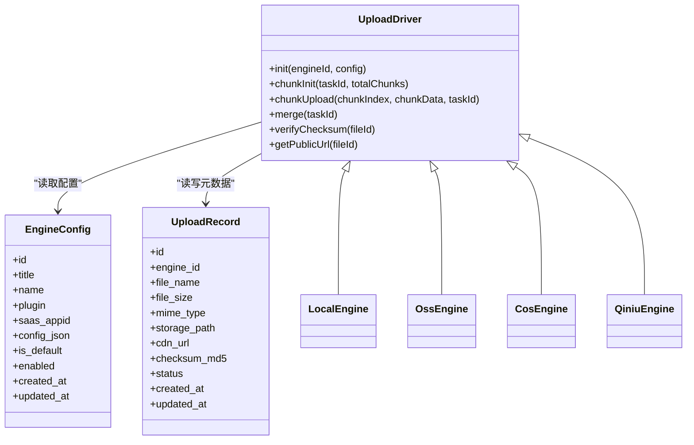
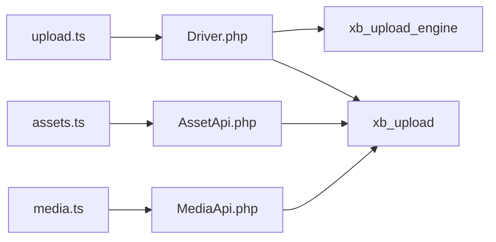
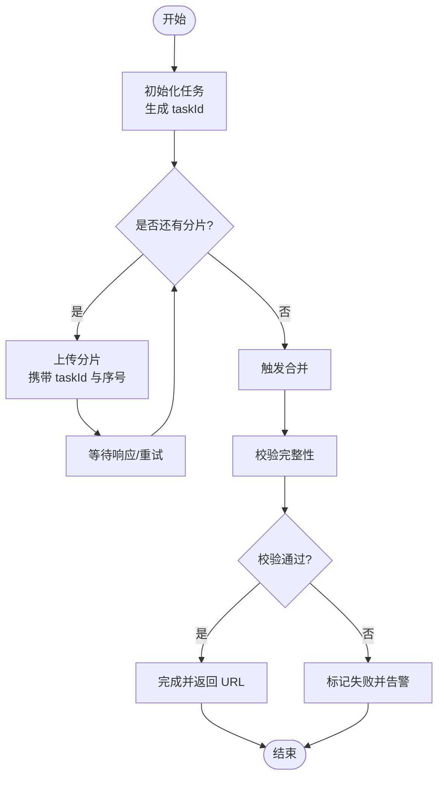

# 上传系统数据模型

<cite>
**本文引用的文件**   
- [install.sql](file://server/plugin/xbUpload/install.sql)
- [Driver.php](file://server/plugin/xbUpload/service/Driver.php)
- [upload.ts](file://frontend/src/api/upload.ts)
- [media.ts](file://frontend/src/utils/media.ts)
- [assets.ts](file://frontend/src/api/assets.ts)
- [AssetApi.php](file://server/plugin/xbAiAsset/api/AssetApi.php)
- [MediaApi.php](file://server/plugin/xbAiModelAgent/api/MediaApi.php)
</cite>

## 目录
1. [简介](#简介)
2. [项目结构](#项目结构)
3. [核心组件](#核心组件)
4. [架构总览](#架构总览)
5. [详细组件分析](#详细组件分析)
6. [依赖关系分析](#依赖关系分析)
7. [性能考量](#性能考量)
8. [故障排查指南](#故障排查指南)
9. [结论](#结论)
10. [附录](#附录)

## 简介
本文件聚焦于上传系统的“数据模型”与“存储抽象层”，围绕以下目标展开：
- 深入讲解上传核心表结构：upload 文件记录表、upload_engine 存储引擎表
- 说明文件元数据管理、存储引擎抽象层、分片上传处理与断点续传机制
- 阐述多存储后端支持（本地、OSS、COS、七牛云）、CDN 加速配置与访问控制策略
- 补充文件完整性校验、病毒扫描集成与存储空间优化方案

## 项目结构
上传能力由前后端协同实现：
- 前端通过 API 发起上传、查询与媒体资源操作，封装了分片与进度等交互逻辑
- 后端以插件化方式提供上传驱动与服务，使用数据库持久化上传记录与引擎配置
- 存储引擎通过抽象接口统一对接多种对象存储（本地、阿里云 OSS、腾讯云 COS、七牛云）

图表来源
- [install.sql:1-40](file://server/plugin/xbUpload/install.sql#L1-L40)
- [Driver.php:90-105](file://server/plugin/xbUpload/service/Driver.php#L90-L105)
- [upload.ts:1-200](file://frontend/src/api/upload.ts#L1-L200)
- [assets.ts:1-200](file://frontend/src/api/assets.ts#L1-L200)
- [media.ts:1-200](file://frontend/src/utils/media.ts#L1-L200)
- [AssetApi.php:1-200](file://server/plugin/xbAiAsset/api/AssetApi.php#L1-L200)
- [MediaApi.php:1-200](file://server/plugin/xbAiModelAgent/api/MediaApi.php#L1-L200)

章节来源
- [install.sql:1-40](file://server/plugin/xbUpload/install.sql#L1-L40)
- [Driver.php:90-105](file://server/plugin/xbUpload/service/Driver.php#L90-L105)
- [upload.ts:1-200](file://frontend/src/api/upload.ts#L1-L200)
- [assets.ts:1-200](file://frontend/src/api/assets.ts#L1-L200)
- [media.ts:1-200](file://frontend/src/utils/media.ts#L1-L200)
- [AssetApi.php:1-200](file://server/plugin/xbAiAsset/api/AssetApi.php#L1-L200)
- [MediaApi.php:1-200](file://server/plugin/xbAiModelAgent/api/MediaApi.php#L1-L200)

## 核心组件
- 上传文件记录表（用于持久化每次上传的文件元数据、状态、路径与校验信息）
- 存储引擎表（用于注册与管理可用的存储后端，如本地/OSS/COS/七牛云）
- 上传驱动（统一调度上传流程，对接具体存储引擎）
- 前端上传 API（封装分片、断点续传、进度回调等）
- 媒体与资产 API（对外暴露文件访问、预览、删除等操作）

章节来源
- [install.sql:1-40](file://server/plugin/xbUpload/install.sql#L1-L40)
- [Driver.php:90-105](file://server/plugin/xbUpload/service/Driver.php#L90-L105)
- [upload.ts:1-200](file://frontend/src/api/upload.ts#L1-L200)
- [assets.ts:1-200](file://frontend/src/api/assets.ts#L1-L200)
- [media.ts:1-200](file://frontend/src/utils/media.ts#L1-L200)
- [AssetApi.php:1-200](file://server/plugin/xbAiAsset/api/AssetApi.php#L1-L200)
- [MediaApi.php:1-200](file://server/plugin/xbAiModelAgent/api/MediaApi.php#L1-L200)

## 架构总览
上传系统采用“控制器/驱动 + 存储引擎抽象 + 数据库持久化”的分层设计。前端负责分片与断点续传的状态机；后端通过驱动选择对应引擎进行落盘，并维护文件元数据与任务状态。

图表来源
- [install.sql:1-40](file://server/plugin/xbUpload/install.sql#L1-L40)
- [Driver.php:90-105](file://server/plugin/xbUpload/service/Driver.php#L90-L105)

## 详细组件分析

### 数据模型：上传文件记录表（xb_upload）
- 作用：记录一次上传的完整生命周期与最终落盘位置，供后续访问、审计与清理
- 关键字段建议
  - id：主键
  - engine_id：关联存储引擎
  - file_name：原始文件名
  - file_size：字节数
  - mime_type：MIME 类型
  - storage_path：在存储后端的相对路径或对象键
  - cdn_url：CDN 加速后的访问地址
  - checksum_md5：文件完整性校验值
  - status：上传状态（初始化/分片中/合并中/完成/失败）
  - created_at / updated_at：时间戳
- 索引建议
  - engine_id、status、created_at 建立复合索引，便于按引擎与状态筛选
  - checksum_md5 可建唯一索引以避免重复上传

章节来源
- [install.sql:21-40](file://server/plugin/xbUpload/install.sql#L21-L40)

### 数据模型：存储引擎表（xb_upload_engine）
- 作用：集中管理可用存储后端及其连接参数，支持运行时动态切换
- 关键字段建议
  - id：主键
  - title：显示名称
  - name：引擎标识（local/oss/cos/qiniu）
  - plugin：所属插件名
  - saas_appid：SaaS 租户隔离字段（可为空）
  - config_json：引擎私有配置（JSON），如 Bucket、Region、AccessKey 等
  - is_default：是否默认引擎
  - enabled：是否启用
  - created_at / updated_at：时间戳
- 索引建议
  - (plugin, saas_appid) 联合索引，提高按租户/插件过滤效率
  - is_default 布尔索引，快速定位默认引擎

章节来源
- [install.sql:1-20](file://server/plugin/xbUpload/install.sql#L1-L20)

### 存储引擎抽象层与驱动
- 抽象职责
  - 统一初始化、分片上传、合并、校验、获取公开 URL 等接口
  - 根据引擎配置选择具体实现（本地/OSS/COS/七牛云）
- 关键流程
  - 初始化：创建任务 ID、写入初始记录
  - 分片上传：客户端携带 taskId 与 chunkIndex 上传片段
  - 合并：服务端校验分片完整性并触发合并
  - 校验：计算并比对 MD5/SHA256
  - 访问：返回 CDN 或直链 URL
- 参考实现位置
  - 驱动入口与调用点见 Driver.php

章节来源
- [Driver.php:90-105](file://server/plugin/xbUpload/service/Driver.php#L90-L105)

### 分片上传与断点续传机制
- 前端侧
  - 将大文件切分为固定大小分片，逐个上传并上报进度
  - 使用 taskId 作为会话标识，支持中断后恢复
  - 失败重试与并发控制，避免阻塞 UI
- 后端侧
  - 接收分片并暂存至临时目录或对象存储临时空间
  - 合并前校验分片数量与顺序，必要时触发去重与校验
  - 合并完成后更新文件记录状态与校验值
- 前端 API 参考
  - upload.ts 提供上传相关方法
  - media.ts 提供媒体处理辅助

章节来源
- [upload.ts:1-200](file://frontend/src/api/upload.ts#L1-L200)
- [media.ts:1-200](file://frontend/src/utils/media.ts#L1-L200)

### 多存储后端支持与 CDN 加速
- 支持的存储后端
  - 本地磁盘：适合开发或小规模部署
  - 阿里云 OSS：高可用对象存储
  - 腾讯云 COS：高可用对象存储
  - 七牛云：对象存储与 CDN 一体化
- CDN 加速
  - 在引擎配置中绑定域名与缓存策略
  - 上传成功后生成 cdn_url 并回写至文件记录表
- 访问控制
  - 公开访问：直接返回 CDN 链接
  - 私有访问：通过签名 URL 或网关鉴权中间件控制

章节来源
- [install.sql:1-20](file://server/plugin/xbUpload/install.sql#L1-L20)
- [Driver.php:90-105](file://server/plugin/xbUpload/service/Driver.php#L90-L105)

### 文件访问控制策略
- 公开资源：静态直链或 CDN 直出
- 私有资源：
  - 短时效签名 URL（适用于一次性下载）
  - 网关鉴权（结合用户会话与权限）
- 防盗链与 Referer 白名单：在 CDN 或对象存储控制台配置

章节来源
- [Driver.php:90-105](file://server/plugin/xbUpload/service/Driver.php#L90-L105)

### 文件完整性校验与病毒扫描集成
- 完整性校验
  - 上传前前端可选计算 MD5/SHA256，随请求头传递
  - 合并后服务端再次校验，确保数据一致性
- 病毒扫描
  - 在合并完成后异步触发扫描任务
  - 扫描结果回写文件记录状态（安全/可疑/恶意）
  - 对恶意文件执行隔离或删除策略

章节来源
- [install.sql:21-40](file://server/plugin/xbUpload/install.sql#L21-L40)
- [Driver.php:90-105](file://server/plugin/xbUpload/service/Driver.php#L90-L105)

### 存储空间优化方案
- 去重上传：基于 checksum 判断是否已存在相同文件
- 冷热分层：热数据保留高频访问副本，冷数据归档到低成本存储
- 压缩与转码：图片自动压缩、视频转码为 HLS/DASH
- 生命周期策略：设置过期时间与自动清理规则

章节来源
- [install.sql:1-40](file://server/plugin/xbUpload/install.sql#L1-L40)

## 依赖关系分析
- 前端依赖
  - upload.ts：封装上传、分片、进度、错误处理
  - assets.ts：资产列表、删除、批量操作
  - media.ts：媒体处理与预览
- 后端依赖
  - Driver.php：上传驱动，协调引擎与数据库
  - AssetApi.php / MediaApi.php：对外暴露资产与媒体接口
- 数据库依赖
  - xb_upload_engine：存储引擎配置
  - xb_upload：文件记录

图表来源
- [upload.ts:1-200](file://frontend/src/api/upload.ts#L1-L200)
- [assets.ts:1-200](file://frontend/src/api/assets.ts#L1-L200)
- [media.ts:1-200](file://frontend/src/utils/media.ts#L1-L200)
- [Driver.php:90-105](file://server/plugin/xbUpload/service/Driver.php#L90-L105)
- [AssetApi.php:1-200](file://server/plugin/xbAiAsset/api/AssetApi.php#L1-L200)
- [MediaApi.php:1-200](file://server/plugin/xbAiModelAgent/api/MediaApi.php#L1-L200)
- [install.sql:1-40](file://server/plugin/xbUpload/install.sql#L1-L40)

章节来源
- [upload.ts:1-200](file://frontend/src/api/upload.ts#L1-L200)
- [assets.ts:1-200](file://frontend/src/api/assets.ts#L1-L200)
- [media.ts:1-200](file://frontend/src/utils/media.ts#L1-L200)
- [Driver.php:90-105](file://server/plugin/xbUpload/service/Driver.php#L90-L105)
- [AssetApi.php:1-200](file://server/plugin/xbAiAsset/api/AssetApi.php#L1-L200)
- [MediaApi.php:1-200](file://server/plugin/xbAiModelAgent/api/MediaApi.php#L1-L200)
- [install.sql:1-40](file://server/plugin/xbUpload/install.sql#L1-L40)

## 性能考量
- 并发分片：合理设置并发度，避免单连接瓶颈
- 内存占用：流式写入与分片缓冲控制，防止 OOM
- 网络优化：启用 CDN、开启 HTTP/2、就近接入点
- 数据库：分页与索引优化，减少全表扫描
- 存储：对象存储并行上传与断点续传特性利用

[本节为通用指导，不直接分析具体文件]

## 故障排查指南
- 常见问题
  - 分片丢失或顺序错乱：检查 taskId 与会话状态，核对分片数量
  - 合并失败：查看临时分片完整性与权限
  - 校验不一致：对比前端与后端计算的哈希值
  - 访问 403/404：确认 CDN 配置与签名有效期
- 日志与追踪
  - 关注上传驱动日志与数据库状态变更
  - 针对失败任务输出详细堆栈与上下文

章节来源
- [Driver.php:90-105](file://server/plugin/xbUpload/service/Driver.php#L90-L105)
- [install.sql:1-40](file://server/plugin/xbUpload/install.sql#L1-L40)

## 结论
本上传系统通过“引擎抽象 + 分片上传 + 断点续传 + 多后端支持”的设计，实现了可扩展、高可用的文件管理能力。配合完整性校验、病毒扫描与 CDN 加速，可在保障安全与体验的同时，满足大规模多媒体资源的存储与分发需求。

[本节为总结性内容，不直接分析具体文件]

## 附录

### 核心流程图：分片上传与合并

图表来源
- [Driver.php:90-105](file://server/plugin/xbUpload/service/Driver.php#L90-L105)
- [upload.ts:1-200](file://frontend/src/api/upload.ts#L1-L200)