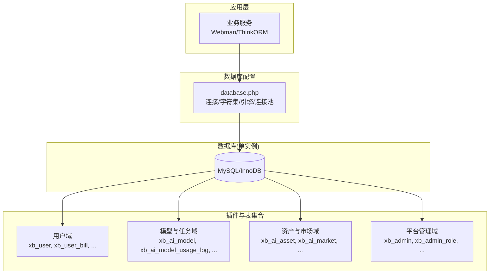
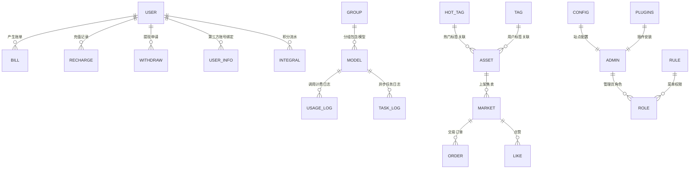
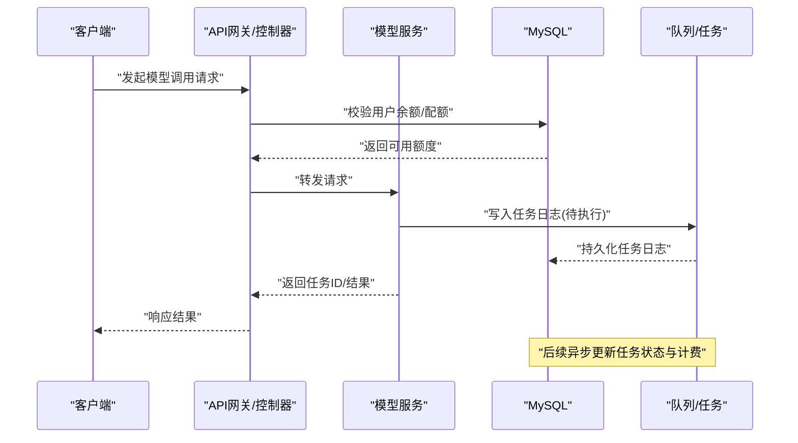

# 数据库概览

<cite>
**本文引用的文件**   
- [server/config/database.php](file://server/config/database.php)
- [server/plugin/xbAiAsset/install.sql](file://server/plugin/xbAiAsset/install.sql)
- [server/plugin/xbAiModelAgent/install.sql](file://server/plugin/xbAiModelAgent/install.sql)
- [server/plugin/xbUser/install.sql](file://server/plugin/xbUser/install.sql)
- [server/plugin/xbCode/install.sql](file://server/plugin/xbCode/install.sql)
</cite>

## 目录
1. [简介](#简介)
2. [项目结构](#项目结构)
3. [核心组件](#核心组件)
4. [架构总览](#架构总览)
5. [详细组件分析](#详细组件分析)
6. [依赖关系分析](#依赖关系分析)
7. [性能考虑](#性能考虑)
8. [故障排查指南](#故障排查指南)
9. [结论](#结论)
10. [附录](#附录)

## 简介
本概览面向积木云AI创作平台的数据库设计与运维，聚焦以下目标：
- 明确整体数据库架构与模块划分
- 说明技术选型（MySQL + InnoDB）、字符集与排序规则、连接池配置
- 阐述命名规范、字段设计规范与数据类型选择原则
- 给出分库分表策略建议、基础性能优化与监控指标定义
- 提供数据库架构图，展示各模块间表关系与数据流向

## 项目结构
本项目采用插件化架构，数据库脚本按插件组织，每个插件包含独立的 install.sql 用于建表。核心数据库配置位于全局配置文件中，统一驱动、字符集、前缀与连接池参数。

图表来源
- [server/config/database.php:1-35](file://server/config/database.php#L1-L35)
- [server/plugin/xbUser/install.sql:1-133](file://server/plugin/xbUser/install.sql#L1-L133)
- [server/plugin/xbAiModelAgent/install.sql:1-91](file://server/plugin/xbAiModelAgent/install.sql#L1-L91)
- [server/plugin/xbAiAsset/install.sql:1-105](file://server/plugin/xbAiAsset/install.sql#L1-L105)
- [server/plugin/xbCode/install.sql:1-91](file://server/plugin/xbCode/install.sql#L1-L91)

章节来源
- [server/config/database.php:1-35](file://server/config/database.php#L1-L35)

## 核心组件
- 数据库驱动与连接
  - 驱动：mysql
  - 默认主机/端口/库名/用户名/密码通过环境变量注入
  - 字符集：utf8mb4；排序规则：utf8mb4_general_ci
  - 表名前缀：xb_
  - 严格模式：开启
  - PDO选项：关闭模拟预处理（提升安全性与执行计划质量）
- 连接池（协程环境有效）
  - 最大连接数：5
  - 最小连接数：1
  - 获取连接等待超时：3秒
  - 空闲回收超时：60秒
  - 心跳检测间隔：50秒

章节来源
- [server/config/database.php:1-35](file://server/config/database.php#L1-L35)

## 架构总览
从数据域角度，系统划分为四大子域：用户域、模型与任务域、资产与市场域、平台管理域。各域由独立插件维护其表结构与枚举字典，并通过外键或逻辑关联形成跨域数据流。

图表来源
- [server/plugin/xbUser/install.sql:1-133](file://server/plugin/xbUser/install.sql#L1-L133)
- [server/plugin/xbAiModelAgent/install.sql:1-91](file://server/plugin/xbAiModelAgent/install.sql#L1-L91)
- [server/plugin/xbAiAsset/install.sql:1-105](file://server/plugin/xbAiAsset/install.sql#L1-L105)
- [server/plugin/xbCode/install.sql:1-91](file://server/plugin/xbCode/install.sql#L1-L91)

## 详细组件分析

### 用户域（xbUser）
- 核心实体
  - 用户主表：用户基本信息、余额、冻结余额、积分、登录信息
  - 用户账单：余额变动流水（旧值/新值/类型/备注）
  - 第三方用户：多端账号绑定与扩展信息
  - 积分流水：积分增减明细
  - 登录方式：支持多种登录渠道配置
  - 充值记录：支付状态、支付方式、付款时间
  - 提现申请：审核流程、打款凭证、手续费等
- 设计要点
  - 金额字段使用 decimal，避免浮点误差
  - 状态类字段使用枚举型字符串，便于扩展与维护
  - 关键查询字段建立索引（如 uid、state、order_no）
  - 软删除未在该域广泛使用，以审计流水为主

章节来源
- [server/plugin/xbUser/install.sql:1-133](file://server/plugin/xbUser/install.sql#L1-L133)

### 模型与任务域（xbAiModelAgent）
- 核心实体
  - 模型记录：模型标识、模态类型、状态、价格配置JSON、描述
  - 使用日志：token用量、成本/销售金额、消息体、状态
  - 任务日志：图片/音频/视频生成任务的状态机、结果JSON、费用结算字段
  - 模型分组：模型聚合与排序
- 设计要点
  - 大文本（提示词、参数、结果）使用 text，必要时归档至对象存储并仅保留URL
  - 高频查询字段（uid、model_id、create_at、status）建立索引
  - 费用相关字段使用高精度 decimal，确保财务对账准确

章节来源
- [server/plugin/xbAiModelAgent/install.sql:1-91](file://server/plugin/xbAiModelAgent/install.sql#L1-L91)

### 资产与市场域（xbAiAsset）
- 核心实体
  - 素材：名称、类型、缩略图、媒体地址、时长、标签、来源、市场ID
  - 市场上架：售价、原价、状态、描述、浏览/点赞计数、上下架时间
  - 交易订单：买家/卖家、价格、交易时间
  - 商品点赞：去重约束（market_id+uid）
  - 热门标签库：热度、状态、排序
  - 用户标签库：用户维度标签唯一性
- 设计要点
  - 热门与标签体系分离，兼顾推荐与个性化
  - 交易与上架解耦，订单只保留必要快照字段
  - 常用过滤条件（uid+type、seller+status、status+asset_id）建立复合索引

章节来源
- [server/plugin/xbAiAsset/install.sql:1-105](file://server/plugin/xbAiAsset/install.sql#L1-L105)

### 平台管理域（xbCode）
- 核心实体
  - 管理员与角色：层级化管理、是否系统标记
  - 菜单规则：树形菜单、按钮级权限、请求方式、路径参数
  - 配置参数：站点级KV配置
  - 插件安装：版本、状态、描述
- 设计要点
  - 权限与菜单强耦合，便于RBAC落地
  - 配置项按分组隔离，支持多站点 saas_appid 区分

章节来源
- [server/plugin/xbCode/install.sql:1-91](file://server/plugin/xbCode/install.sql#L1-L91)

### 数据流向时序（示例：模型调用与计费）

图表来源
- [server/plugin/xbAiModelAgent/install.sql:1-91](file://server/plugin/xbAiModelAgent/install.sql#L1-L91)
- [server/config/database.php:1-35](file://server/config/database.php#L1-L35)

## 依赖关系分析
- 跨域关联
  - 资产与市场：xb_ai_asset.id ↔ xb_ai_market.asset_id
  - 市场与订单：xb_ai_market.id ↔ xb_ai_market_order.market_id
  - 用户与资产：xb_user.id ↔ xb_ai_asset.uid
  - 用户与账单/充值/提现：xb_user.id ↔ 对应流水表 uid
  - 模型与日志：xb_ai_model.model_id ↔ usage/task_log.model_id
- 索引与查询热点
  - 用户侧：uid、state、order_no
  - 模型侧：uid、model_id、create_at、status
  - 资产侧：uid+type、seller+status、status+asset_id、buyer/seller
- 潜在循环依赖
  - 当前为单向引用，未见循环外键；建议在应用层保证一致性

章节来源
- [server/plugin/xbUser/install.sql:1-133](file://server/plugin/xbUser/install.sql#L1-L133)
- [server/plugin/xbAiModelAgent/install.sql:1-91](file://server/plugin/xbAiModelAgent/install.sql#L1-L91)
- [server/plugin/xbAiAsset/install.sql:1-105](file://server/plugin/xbAiAsset/install.sql#L1-L105)
- [server/plugin/xbCode/install.sql:1-91](file://server/plugin/xbCode/install.sql#L1-L91)

## 性能考虑
- 连接池调优
  - 根据并发QPS与平均响应时延调整 max_connections/min_connections
  - wait_timeout 需小于慢查询阈值，避免长事务占用连接
  - idle_timeout 与 heartbeat_interval 配合，及时回收空闲连接
- 索引与查询
  - 优先覆盖常用过滤条件，减少回表
  - 复合索引顺序遵循“等值在前、范围在后”的原则
  - 避免在索引列上使用函数或隐式类型转换
- 存储与归档
  - 大文本与二进制内容落对象存储，数据库仅存URL
  - 历史日志表定期归档或冷热分层
- 事务与锁
  - 资金类操作使用短事务，减少锁持有时间
  - 高并发写场景考虑乐观锁或版本号字段

[本节为通用指导，不直接分析具体文件]

## 故障排查指南
- 连接失败
  - 检查环境变量 DB_HOST/DB_PORT/DB_NAME/DB_USER/DB_PASS 是否正确
  - 确认防火墙与安全组放行3306端口
- 乱码问题
  - 确认数据库、表、连接均使用 utf8mb4
  - 客户端连接字符集与服务端一致
- 慢查询定位
  - 开启慢查询日志，结合 EXPLAIN 分析执行计划
  - 关注缺失索引、全表扫描、临时表与文件排序
- 连接池异常
  - 观察 wait_timeout 与业务超时是否匹配
  - 监控连接泄漏与频繁创建销毁

章节来源
- [server/config/database.php:1-35](file://server/config/database.php#L1-L35)

## 结论
本项目基于 MySQL + InnoDB，统一采用 utf8mb4 字符集与 xb_ 表前缀，按插件域拆分表结构，具备清晰的职责边界与可扩展性。通过合理的索引设计与连接池配置，可在中等规模下获得稳定性能。未来可按数据量增长逐步引入读写分离与分库分表策略。

[本节为总结性内容，不直接分析具体文件]

## 附录

### 技术选型与配置摘要
- 数据库：MySQL
- 存储引擎：InnoDB
- 字符集：utf8mb4
- 排序规则：utf8mb4_general_ci
- 表名前缀：xb_
- 严格模式：开启
- PDO：禁用模拟预处理
- 连接池：max=5 / min=1 / wait=3s / idle=60s / heartbeat=50s

章节来源
- [server/config/database.php:1-35](file://server/config/database.php#L1-L35)

### 命名规范
- 表名：小写下划线，带前缀 xb_，语义清晰，如 xb_user、xb_ai_model
- 字段名：小写下划线，见名知意，如 create_at、update_at、delete_at
- 主键：自增整型或无符号整型，统一 id
- 索引：idx_前缀普通索引，uk_前缀唯一索引，复合索引按查询热点组合
- 注释：所有表与字段均需中文注释

章节来源
- [server/plugin/xbUser/install.sql:1-133](file://server/plugin/xbUser/install.sql#L1-L133)
- [server/plugin/xbAiModelAgent/install.sql:1-91](file://server/plugin/xbAiModelAgent/install.sql#L1-L91)
- [server/plugin/xbAiAsset/install.sql:1-105](file://server/plugin/xbAiAsset/install.sql#L1-L105)
- [server/plugin/xbCode/install.sql:1-91](file://server/plugin/xbCode/install.sql#L1-L91)

### 字段设计与数据类型原则
- 金额：decimal(精度与小数位按业务确定)，禁止使用浮点
- 文本：短文本 varchar，长文本/JSON text
- 时间：datetime，统一 create_at/update_at/delete_at
- 状态：enum 或定长字符串，保持可枚举、可解释
- 布尔：使用 tinyint 或 enum，避免 bool 歧义
- 编码：统一 utf8mb4，兼容表情与生僻字

章节来源
- [server/plugin/xbUser/install.sql:1-133](file://server/plugin/xbUser/install.sql#L1-L133)
- [server/plugin/xbAiModelAgent/install.sql:1-91](file://server/plugin/xbAiModelAgent/install.sql#L1-L91)
- [server/plugin/xbAiAsset/install.sql:1-105](file://server/plugin/xbAiAsset/install.sql#L1-L105)
- [server/plugin/xbCode/install.sql:1-91](file://server/plugin/xbCode/install.sql#L1-L91)

### 分库分表策略建议
- 阶段一（单机）
  - 按域拆库：user_db、ai_db、asset_db、admin_db
  - 同库内按域分表，控制单表行数在千万级以内
- 阶段二（水平扩展）
  - 用户与资产按 uid 哈希分片
  - 日志与任务按时间范围归档（月/季度）
  - 读多写少表引入只读副本
- 阶段三（高可用）
  - 主从复制 + 读写分离
  - 热点表二级缓存（Redis）
  - 慢查询治理与索引瘦身

[本节为概念性建议，不直接分析具体文件]

### 监控指标定义
- 连接池
  - 活跃连接数、空闲连接数、等待获取连接次数与超时次数
- 查询性能
  - QPS/TPS、P95/P99延迟、慢查询数量与TOP SQL
- 资源使用
  - CPU/内存/IO、磁盘空间、redo log 与 binlog 增长
- 业务健康
  - 任务成功率、失败原因分布、计费差异率、退款率

[本节为通用指标建议，不直接分析具体文件]