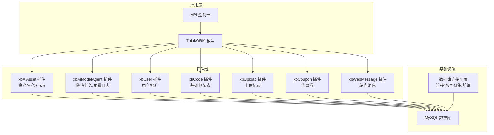
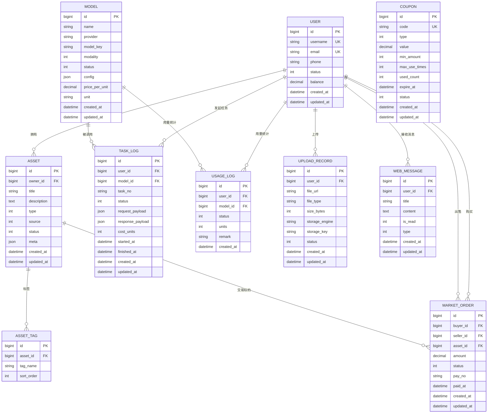
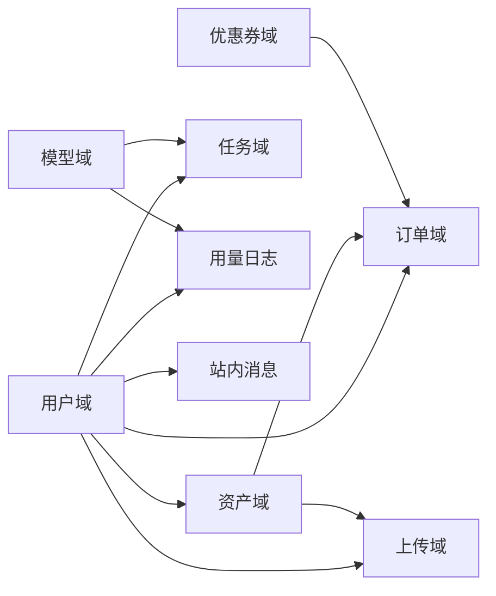

# 数据库设计

<cite>
**本文引用的文件**
- [database.php](file://server/config/database.php)
- [install.sql](file://server/plugin/xbAiAsset/install.sql)
- [install.sql](file://server/plugin/xbAiModelAgent/install.sql)
- [update.sql](file://server/plugin/xbAiModelAgent/update.sql)
- [install.sql](file://server/plugin/xbUser/install.sql)
- [install.sql](file://server/plugin/xbCode/install.sql)
- [install.sql](file://server/plugin/xbUpload/install.sql)
- [install.sql](file://server/plugin/xbCoupon/install.sql)
- [install.sql](file://server/plugin/xbWebMessage/install.sql)
</cite>

## 目录
1. [引言](#引言)
2. [项目结构](#项目结构)
3. [核心组件](#核心组件)
4. [架构总览](#架构总览)
5. [详细组件分析](#详细组件分析)
6. [依赖分析](#依赖分析)
7. [性能考虑](#性能考虑)
8. [故障排查指南](#故障排查指南)
9. [结论](#结论)
10. [附录](#附录)

## 引言
本设计文档面向“积木云AI创作平台”的数据库层，聚焦于多插件化架构下的数据模型与访问策略。系统采用 ThinkORM + MySQL 作为持久化方案，并通过多个业务插件（资产、模型代理、用户、代码框架、上传、优惠券、消息等）共同构建完整的数据域。本文从整体架构出发，梳理核心表结构、实体关系映射、索引优化策略与数据迁移方案，并给出数据访问模式、缓存策略、性能优化建议以及备份恢复方案，帮助读者快速理解并落地实施。

## 项目结构
后端基于 Webman 运行期，ThinkORM 负责数据库连接与 ORM 能力；各业务域以插件形式组织，每个插件包含自身的 install.sql（及可选 update.sql），用于初始化或升级对应数据表。数据库连接配置位于统一配置文件中，支持连接池参数调优。

图表来源
- [database.php:1-35](file://server/config/database.php#L1-L35)
- [install.sql](file://server/plugin/xbAiAsset/install.sql)
- [install.sql](file://server/plugin/xbAiModelAgent/install.sql)
- [install.sql](file://server/plugin/xbUser/install.sql)
- [install.sql](file://server/plugin/xbCode/install.sql)
- [install.sql](file://server/plugin/xbUpload/install.sql)
- [install.sql](file://server/plugin/xbCoupon/install.sql)
- [install.sql](file://server/plugin/xbWebMessage/install.sql)

章节来源
- [database.php:1-35](file://server/config/database.php#L1-L35)

## 核心组件
- 数据库连接与连接池：通过配置文件定义驱动、主机、端口、库名、用户名、密码、字符集、排序规则、表前缀与连接池参数（最大/最小连接数、等待超时、空闲回收、心跳检测）。
- 插件化数据域：每个插件维护自身安装脚本，集中管理建表语句与初始数据，便于独立部署与升级。
- ORM 访问：使用 ThinkORM 进行查询与事务控制，结合中间件与队列完成异步处理（如任务执行、下载/上传消费等）。

章节来源
- [database.php:1-35](file://server/config/database.php#L1-L35)

## 架构总览
下图展示跨插件的核心实体关系，包括用户、资产、订单、任务、模型、用量日志、上传记录、优惠券与站内消息等关键对象及其关联。

图表来源
- [install.sql](file://server/plugin/xbAiAsset/install.sql)
- [install.sql](file://server/plugin/xbAiModelAgent/install.sql)
- [install.sql](file://server/plugin/xbUser/install.sql)
- [install.sql](file://server/plugin/xbUpload/install.sql)
- [install.sql](file://server/plugin/xbCoupon/install.sql)
- [install.sql](file://server/plugin/xbWebMessage/install.sql)

## 详细组件分析

### 用户域（xbUser）
- 设计目标：提供统一的身份与账户信息，支撑登录鉴权、余额、状态管理等。
- 关键实体与字段要点
  - 用户表：主键、唯一用户名/邮箱、手机号、状态、余额、时间戳等。
  - 约束与规则：用户名/邮箱唯一；状态枚举控制可用/禁用；余额非负。
- 索引建议
  - 用户名、邮箱建立唯一索引。
  - 常用查询条件（如手机号、状态）建立普通索引。
- 关联关系
  - 与资产、订单、任务、用量日志、上传记录、站内消息均存在一对多外键关系。

章节来源
- [install.sql](file://server/plugin/xbUser/install.sql)

### 资产域（xbAiAsset）
- 设计目标：管理 AI 生成的图片、音频、视频等多模态资产，支持标签、分类与市场交易。
- 关键实体与字段要点
  - 资产表：归属用户、标题、描述、类型、来源、状态、元数据 JSON、时间戳。
  - 资产标签表：资产 ID、标签名、排序。
  - 市场订单表：买家、卖家、标的资产、金额、支付流水号、状态、时间戳。
- 约束与规则
  - 资产归属用户必须存在；资产类型/来源/状态为枚举值；订单金额非负。
- 索引建议
  - 资产表按 owner_id、type、status 建立复合索引，加速“我的作品”、“热门资产”等查询。
  - 标签表对 tag_name 建立索引，支持按标签检索。
  - 订单表对 buyer_id、seller_id、asset_id、status 建立索引，支持交易查询与对账。
- 关联关系
  - 用户 1:N 资产；资产 1:N 标签；用户 1:N 订单（买家/卖家）；资产 1:N 订单（标的）。

章节来源
- [install.sql](file://server/plugin/xbAiAsset/install.sql)

### 模型与任务域（xbAiModelAgent）
- 设计目标：抽象 AI 模型提供方与模型实例，记录任务执行过程与资源消耗。
- 关键实体与字段要点
  - 模型表：名称、提供方、模型标识、模态、状态、配置 JSON、单价与单位、时间戳。
  - 任务日志表：用户、模型、任务编号、状态、请求/响应负载、消耗单位、开始/结束时间、时间戳。
  - 用量日志表：用户、模型、状态、消耗单位、备注、时间戳。
- 约束与规则
  - 任务状态机：创建→排队→执行中→成功/失败；用量日志需与任务一致且可审计。
- 索引建议
  - 任务日志表对 user_id、model_id、status、started_at 建立复合索引，支持“我的任务”、“模型耗时统计”。
  - 用量日志表对 user_id、model_id、created_at 建立索引，支持计费与报表。
- 关联关系
  - 用户 1:N 任务日志；模型 1:N 任务日志；用户 1:N 用量日志；模型 1:N 用量日志。

章节来源
- [install.sql](file://server/plugin/xbAiModelAgent/install.sql)
- [update.sql](file://server/plugin/xbAiModelAgent/update.sql)

### 上传域（xbUpload）
- 设计目标：统一管理文件上传记录，对接多种存储引擎（本地、OSS、COS、七牛等）。
- 关键实体与字段要点
  - 上传记录表：用户、文件 URL、类型、大小、存储引擎、存储 Key、状态、时间戳。
- 约束与规则
  - 文件大小限制由业务校验；存储 Key 唯一性由引擎保证。
- 索引建议
  - 对 user_id、storage_engine、status 建立索引，便于清理与统计。
- 关联关系
  - 用户 1:N 上传记录；资产可能引用上传记录的 Key。

章节来源
- [install.sql](file://server/plugin/xbUpload/install.sql)

### 优惠券域（xbCoupon）
- 设计目标：提供营销优惠能力，支持面额/折扣、门槛、次数限制与过期控制。
- 关键实体与字段要点
  - 优惠券表：编码（唯一）、类型、面值/折扣、最低消费、最大使用次数、已用次数、过期时间、状态、时间戳。
- 约束与规则
  - 编码唯一；已用次数不超过最大次数；过期后不可用。
- 索引建议
  - 对 code 建立唯一索引；对 expire_at、status 建立索引，便于批量清理与发放统计。

章节来源
- [install.sql](file://server/plugin/xbCoupon/install.sql)

### 站内消息域（xbWebMessage）
- 设计目标：向用户推送系统通知、活动提醒等站内消息。
- 关键实体与字段要点
  - 消息表：用户、标题、内容、是否已读、类型、时间戳。
- 约束与规则
  - 未读/已读状态切换需幂等；类型区分系统/运营等。
- 索引建议
  - 对 user_id、is_read、created_at 建立复合索引，支持“未读列表”、“历史消息分页”。

章节来源
- [install.sql](file://server/plugin/xbWebMessage/install.sql)

### 基础框架域（xbCode）
- 设计目标：提供平台级基础表（如菜单、权限、字典、配置等），供其他插件复用。
- 说明
  - 该域不直接参与 AI 创作主线流程，但为后台管理与权限控制提供支撑。

章节来源
- [install.sql](file://server/plugin/xbCode/install.sql)

## 依赖分析
- 插件间耦合
  - 资产域依赖用户域（owner_id）、上传域（文件 Key）、优惠券域（促销抵扣）。
  - 任务域依赖用户域与模型域，用量日志与任务日志需保持一致性。
  - 订单域依赖用户域（买卖双方）、资产域（标的）、优惠券域（可选抵扣）。
- 外部依赖
  - 存储引擎（本地/OSS/COS/七牛）通过上传域抽象，避免业务强耦合。
  - 第三方模型服务通过模型域配置接入，任务域负责调用与结果落盘。

图表来源
- [install.sql](file://server/plugin/xbAiAsset/install.sql)
- [install.sql](file://server/plugin/xbAiModelAgent/install.sql)
- [install.sql](file://server/plugin/xbUser/install.sql)
- [install.sql](file://server/plugin/xbUpload/install.sql)
- [install.sql](file://server/plugin/xbCoupon/install.sql)
- [install.sql](file://server/plugin/xbWebMessage/install.sql)

## 性能考虑
- 连接池与并发
  - 合理设置最大/最小连接数、等待超时、空闲回收与心跳间隔，避免在高并发下频繁创建/销毁连接。
- 索引与查询
  - 针对高频查询路径建立复合索引，避免全表扫描；注意覆盖索引减少回表。
- 读写分离与分库分表
  - 当单表超千万级时，考虑按用户或时间维度拆分；热点表引入只读副本。
- 缓存策略
  - 热点字典/配置使用 Redis 缓存；资产详情、模型列表等短 TTL 缓存；写穿透更新缓存。
- 事务与一致性
  - 订单扣款、资产变更、用量记账等关键路径使用事务；必要时引入补偿与幂等。
- 归档与冷热分离
  - 任务日志、用量日志按月归档至历史库；线上仅保留近期热数据。

[本节为通用性能指导，无需特定文件来源]

## 故障排查指南
- 连接问题
  - 检查数据库主机、端口、库名、用户名、密码与字符集配置；确认连接池参数是否过小导致等待超时。
- 锁与死锁
  - 观察慢查询与锁等待，优化事务粒度与索引；避免长事务持有行锁。
- 数据不一致
  - 核对任务日志与用量日志的一致性；对账脚本定期比对订单与支付流水。
- 存储异常
  - 上传 Key 不存在或不可访问时，优先检查存储引擎配置与网络连通性。

章节来源
- [database.php:1-35](file://server/config/database.php#L1-L35)

## 结论
本设计围绕“用户—资产—订单—任务—用量—上传—优惠券—消息”的主线数据域展开，采用插件化组织与 ThinkORM 访问层，兼顾扩展性与可维护性。通过合理的索引与缓存策略、严格的约束与事务控制，以及完善的迁移与备份机制，可在高并发与大数据量场景下保持稳定的性能与可靠性。

[本节为总结性内容，无需特定文件来源]

## 附录

### 数据迁移方案
- 初始化
  - 按插件顺序执行 install.sql，确保基础域（用户、框架）先于业务域（资产、任务、订单）创建。
- 增量升级
  - 使用 update.sql 进行版本化升级；每次升级需具备幂等性与回滚脚本。
- 灰度与回滚
  - 先在测试环境验证，再在低峰期滚动发布；准备一键回滚脚本与快照。

章节来源
- [install.sql](file://server/plugin/xbAiAsset/install.sql)
- [install.sql](file://server/plugin/xbAiModelAgent/install.sql)
- [update.sql](file://server/plugin/xbAiModelAgent/update.sql)
- [install.sql](file://server/plugin/xbUser/install.sql)
- [install.sql](file://server/plugin/xbCode/install.sql)
- [install.sql](file://server/plugin/xbUpload/install.sql)
- [install.sql](file://server/plugin/xbCoupon/install.sql)
- [install.sql](file://server/plugin/xbWebMessage/install.sql)

### 备份与恢复
- 全量备份
  - 每日定时全量导出，异地多副本保存。
- 增量备份
  - 开启 binlog，按小时增量备份，缩短 RPO。
- 恢复演练
  - 定期在隔离环境演练恢复流程，验证 RTO/RPO 达标。
- 敏感数据脱敏
  - 备份文件中的个人信息与密钥需脱敏或加密存储。

[本节为通用运维建议，无需特定文件来源]