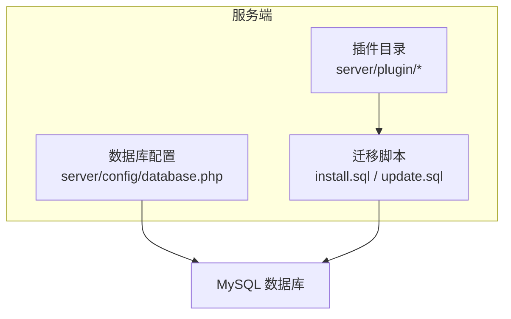
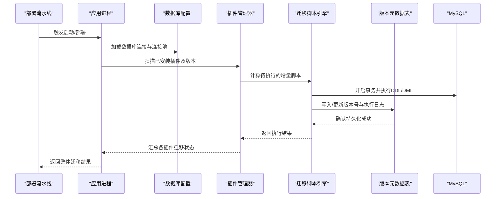
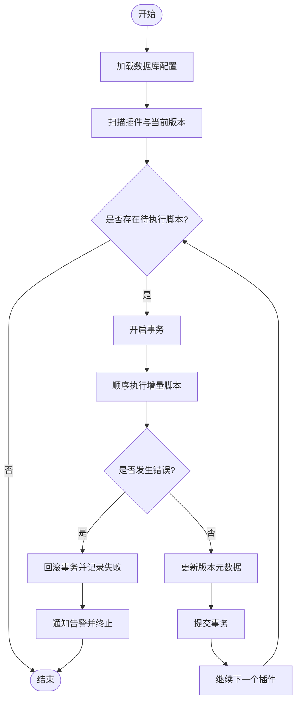
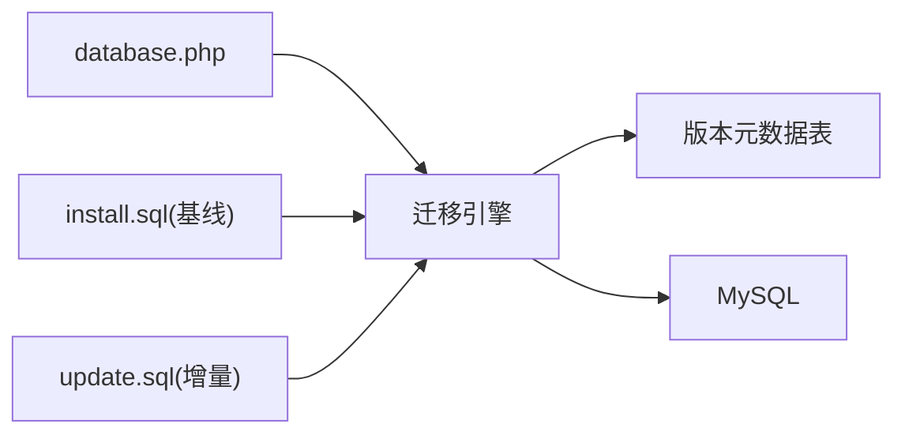

# 数据迁移方案

<cite>
**本文引用的文件**   
- [database.php](file://server/config/database.php)
- [install.sql](file://server/plugin/xbAiModelAgent/install.sql)
- [update.sql](file://server/plugin/xbAiModelAgent/update.sql)
</cite>

## 目录
1. [引言](#引言)
2. [项目结构](#项目结构)
3. [核心组件](#核心组件)
4. [架构总览](#架构总览)
5. [详细组件分析](#详细组件分析)
6. [依赖分析](#依赖分析)
7. [性能考虑](#性能考虑)
8. [故障排查指南](#故障排查指南)
9. [结论](#结论)
10. [附录](#附录)

## 引言
本方案面向当前多插件化后端系统，提供一套可落地的数据库版本管理与迁移策略。目标包括：
- 建立统一的数据库版本管理机制与增量升级流程
- 规范迁移脚本编写、回滚策略与灰度发布策略
- 明确数据备份恢复流程、自动化部署与异常处理机制
- 提供版本兼容性检查与数据一致性验证方案
- 给出迁移工具链配置建议与示例（以现有 install.sql / update.sql 为基线）

## 项目结构
本项目采用“插件化”组织方式，每个功能插件在独立目录下维护自身的安装与升级脚本。数据库连接通过统一配置文件集中管理，便于在多环境切换与连接池调优。

图表来源
- [database.php:1-35](file://server/config/database.php#L1-L35)
- [install.sql:1-91](file://server/plugin/xbAiModelAgent/install.sql#L1-L91)
- [update.sql:1-25](file://server/plugin/xbAiModelAgent/update.sql#L1-L25)

章节来源
- [database.php:1-35](file://server/config/database.php#L1-L35)

## 核心组件
- 数据库连接与连接池配置：用于控制驱动、字符集、前缀、连接池大小与心跳等参数，直接影响迁移执行的性能与稳定性。
- 插件级迁移脚本：
  - install.sql：定义初始建表与索引，作为插件首次安装的基线结构。
  - update.sql：描述从旧版本到新版本的结构变更（增删字段、索引、注释等），用于增量升级。

章节来源
- [database.php:1-35](file://server/config/database.php#L1-L35)
- [install.sql:1-91](file://server/plugin/xbAiModelAgent/install.sql#L1-L91)
- [update.sql:1-25](file://server/plugin/xbAiModelAgent/update.sql#L1-L25)

## 架构总览
下图展示“应用启动/部署时”的迁移执行路径：配置加载 → 读取插件清单 → 解析版本差异 → 顺序执行增量脚本 → 记录版本元数据 → 完成服务上线。

图表来源
- [database.php:1-35](file://server/config/database.php#L1-L35)
- [install.sql:1-91](file://server/plugin/xbAiModelAgent/install.sql#L1-L91)
- [update.sql:1-25](file://server/plugin/xbAiModelAgent/update.sql#L1-L25)

## 详细组件分析

### 组件A：数据库连接与连接池配置
- 关键要点
  - 驱动与字符集：使用 utf8mb4 与 utf8mb4_general_ci，确保表情符号与多语言兼容。
  - 表名前缀：默认前缀 xb_，所有迁移脚本需遵循该前缀约定。
  - 连接池：max/min 连接数、等待超时、空闲回收、心跳间隔等参数影响长事务与批量 DDL 的执行稳定性。
  - PDO 选项：关闭模拟预处理，避免某些 DDL 或复杂查询行为不一致。
- 迁移相关建议
  - 大表 DDL 建议在低峰期执行，适当增大 wait_timeout 与 idle_timeout。
  - 批量 DML 建议拆分为小批次，结合连接池大小控制并发。

章节来源
- [database.php:1-35](file://server/config/database.php#L1-L35)

### 组件B：插件安装脚本（install.sql）
- 作用
  - 定义插件首次安装时的完整表结构与索引，作为后续升级的基线。
- 设计要点
  - 幂等性：以 DROP TABLE IF EXISTS + CREATE TABLE 的方式保证重复安装安全。
  - 命名规范：表名带前缀 xb_ai_model_*，字段具备中文注释，便于审计与排障。
  - 索引策略：对高频查询字段建立索引（如 uid、model_id、status、create_at）。
- 典型表族
  - 模型主表：存储模型基础信息与价格配置 JSON。
  - 使用日志表：记录聊天类调用 token 用量与金额。
  - 任务日志表：记录图片/音视频生成任务状态、成本与结算字段。
  - 分组表：模型分组与排序。

章节来源
- [install.sql:1-91](file://server/plugin/xbAiModelAgent/install.sql#L1-L91)

### 组件C：插件升级脚本（update.sql）
- 作用
  - 针对已安装环境的结构演进，进行增量变更（新增/修改/删除字段、索引、注释等）。
- 本次升级要点
  - 移除历史冗余字段与索引（如 task_queue_id）。
  - 为使用日志与任务日志补充 cost_amount、sale_amount 等计费字段。
  - 为任务日志补充预扣、上游实际成本、退补金额等结算字段。
- 幂等性与回滚
  - 建议每条 ALTER 语句前后增加存在性判断逻辑（由迁移引擎实现），避免重复执行报错。
  - 对应回滚脚本应能撤销上述变更（例如 DROP COLUMN 或 MODIFY 回退）。

章节来源
- [update.sql:1-25](file://server/plugin/xbAiModelAgent/update.sql#L1-L25)

### 组件D：版本管理与增量升级流程
- 版本标识
  - 建议采用“语义化版本”或“自增整数”作为插件版本标识，并与 update.sql 一一对应。
- 增量升级原则
  - 只写向前兼容的变更；禁止直接删除仍在使用的列或索引。
  - 将破坏性变更拆分为多个步骤：先加新列/索引 → 双写 → 校验 → 再切读 → 最后清理旧列。
- 执行顺序
  - 按插件维度串行执行，插件内部按文件名/版本号升序执行。
  - 同一时间仅允许一个迁移进程持有锁，避免并发冲突。

图表来源
- [database.php:1-35](file://server/config/database.php#L1-L35)
- [install.sql:1-91](file://server/plugin/xbAiModelAgent/install.sql#L1-L91)
- [update.sql:1-25](file://server/plugin/xbAiModelAgent/update.sql#L1-L25)

### 组件E：回滚策略
- 自动回滚
  - 单条 DDL 失败即回滚整个事务，保证原子性。
- 手动回滚
  - 为每个 update.sql 配套 rollback.sql，包含反向操作（DROP COLUMN/MODIFY 回退、重建索引等）。
- 灰度回滚
  - 先在只读副本或测试库验证回滚脚本，再在生产分批回滚。

### 组件F：数据备份与恢复
- 备份策略
  - 全量备份：每日一次，保留 N 天。
  - 增量备份：基于 binlog 的实时增量，RPO 目标分钟级。
- 恢复演练
  - 定期在隔离环境演练恢复流程，验证 RTO/RPO 达标。
- 迁移前必做
  - 执行迁移前强制全量快照，确保可快速回退。

### 组件G：灰度发布策略
- 蓝绿/金丝雀
  - 先对少量实例执行迁移与重启，观察指标稳定后再全量滚动。
- 特性开关
  - 对破坏性变更配合开关，逐步放量，降低风险面。
- 监控与熔断
  - 迁移期间加强慢查询、锁等待、错误率监控，出现异常立即熔断并回滚。

### 组件H：迁移工具链与自动化部署
- 工具选型建议
  - 可选用成熟的迁移框架（如 Flyway/Liquibase）或自研轻量脚本引擎，要求支持事务、幂等、版本元数据表。
- 集成点
  - 在 CI/CD 中增加“迁移前置检查”和“迁移后置校验”阶段。
  - 与配置中心联动，动态获取数据库连接信息。
- 权限与安全
  - 迁移账号仅授予必要 DDL/DML 权限，敏感信息走密钥管理。

### 组件I：版本兼容性检查
- 向后兼容
  - 新增字段必须带默认值；删除字段需评估引用方。
- 向前兼容
  - 客户端/接口层需容忍缺失字段，避免强依赖。
- 检查清单
  - 字段类型变更、索引变更、约束变更、枚举值变更、JSON 结构变更。

### 组件J：数据一致性验证
- 行级校验
  - 对比新旧结构下关键字段统计（COUNT/SUM/AVG）是否一致。
- 抽样比对
  - 随机抽取样本数据，逐字段比对业务含义。
- 业务校验
  - 运行关键报表/导出任务，验证输出与预期一致。

## 依赖分析
- 配置依赖
  - 所有迁移均依赖 database.php 中的连接参数与连接池设置。
- 脚本依赖
  - update.sql 依赖 install.sql 定义的基线结构；若基线变更，需同步调整升级脚本。
- 外部依赖
  - MySQL 版本与特性（如在线 DDL、窗口函数）会影响迁移脚本写法与执行时长。

图表来源
- [database.php:1-35](file://server/config/database.php#L1-L35)
- [install.sql:1-91](file://server/plugin/xbAiModelAgent/install.sql#L1-L91)
- [update.sql:1-25](file://server/plugin/xbAiModelAgent/update.sql#L1-L25)

章节来源
- [database.php:1-35](file://server/config/database.php#L1-L35)
- [install.sql:1-91](file://server/plugin/xbAiModelAgent/install.sql#L1-L91)
- [update.sql:1-25](file://server/plugin/xbAiModelAgent/update.sql#L1-L25)

## 性能考虑
- 大表 DDL
  - 优先使用在线 DDL（如 ALGORITHM=INPLACE, LOCK=NONE），避开业务高峰。
- 索引重建
  - 批量重建索引时拆分批次，避免长时间锁表。
- 连接池
  - 根据迁移并发与队列长度调整 max_connections/wait_timeout/idle_timeout。
- 事务粒度
  - 单个事务内尽量合并相关 DDL/DML，减少提交次数与锁竞争。

## 故障排查指南
- 常见错误
  - 语法错误：核对 SQL 语法与 MySQL 版本特性。
  - 锁等待：查看 InnoDB 锁等待与长事务，必要时终止阻塞会话。
  - 权限不足：确认迁移账号具备相应 DDL/DML 权限。
  - 连接池耗尽：提升连接池上限或降低并发。
- 定位手段
  - 启用迁移日志，记录每条语句执行时间与错误堆栈。
  - 结合数据库慢查询与锁监控定位瓶颈。
- 应急措施
  - 立即回滚事务，恢复至最近稳定版本。
  - 暂停灰度流量，优先保障核心链路可用。

## 结论
通过统一的版本管理、严格的增量升级规范、完善的回滚与灰度策略，以及自动化部署与一致性校验，可在保障业务连续性的前提下，安全高效地完成数据库结构的持续演进。

## 附录

### A. 迁移脚本编写规范（摘要）
- 命名与存放
  - 安装脚本：install.sql；升级脚本：update.sql（可按版本分文件，如 v1.2.0.sql）。
- 幂等性
  - 使用条件判断与存在性检查，确保重复执行不报错。
- 注释与可读性
  - 每条 DDL/DML 附带简要注释，说明目的与影响范围。
- 事务与回滚
  - 包裹事务；为每个升级脚本准备对应的回滚脚本。

### B. 迁移脚本示例（路径指引）
- 安装脚本示例
  - 参考路径：[install.sql](file://server/plugin/xbAiModelAgent/install.sql)
- 升级脚本示例
  - 参考路径：[update.sql](file://server/plugin/xbAiModelAgent/update.sql)

### C. 版本兼容性检查清单（摘要）
- 字段新增：默认值、非空约束、注释
- 字段删除：是否有下游依赖
- 索引变更：覆盖查询、唯一性约束
- 枚举/字典：是否保持向后兼容
- JSON 结构：是否引入必填键

### D. 数据一致性验证方案（摘要）
- 统计校验：COUNT/SUM/AVG 对比
- 抽样比对：随机样本逐字段核对
- 业务校验：关键报表/导出结果一致性