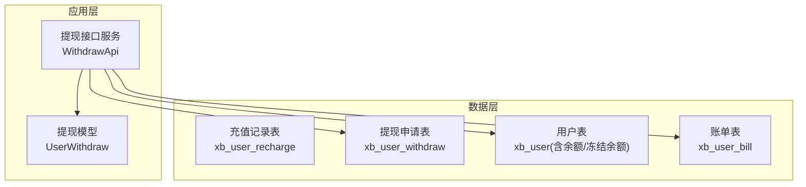
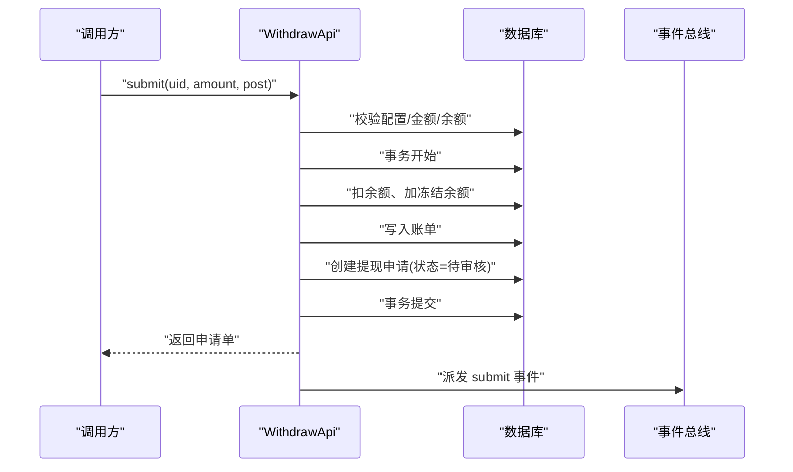
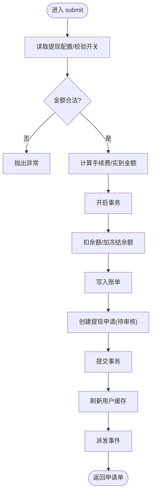
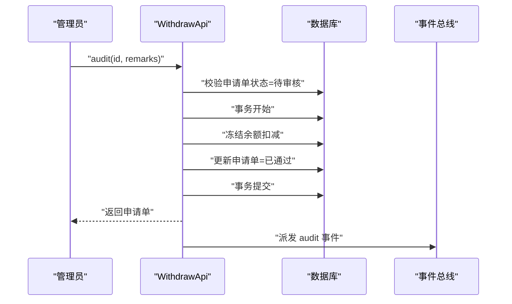
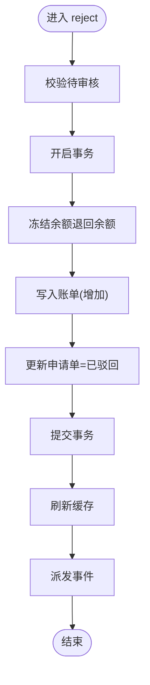
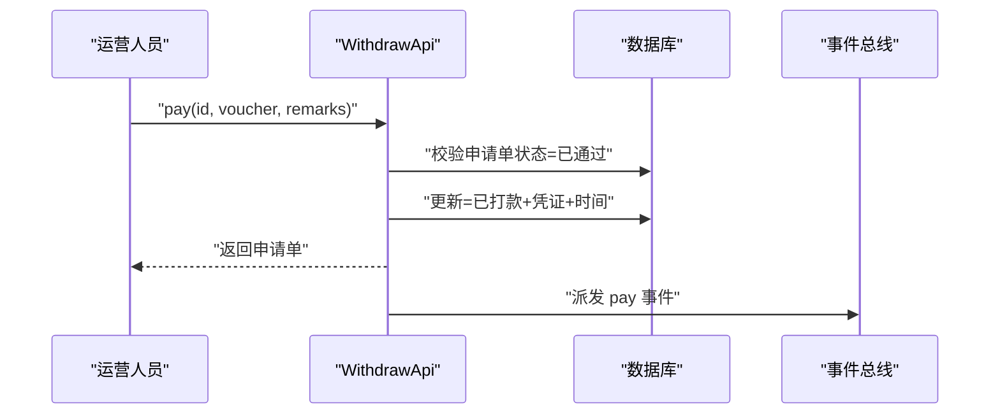
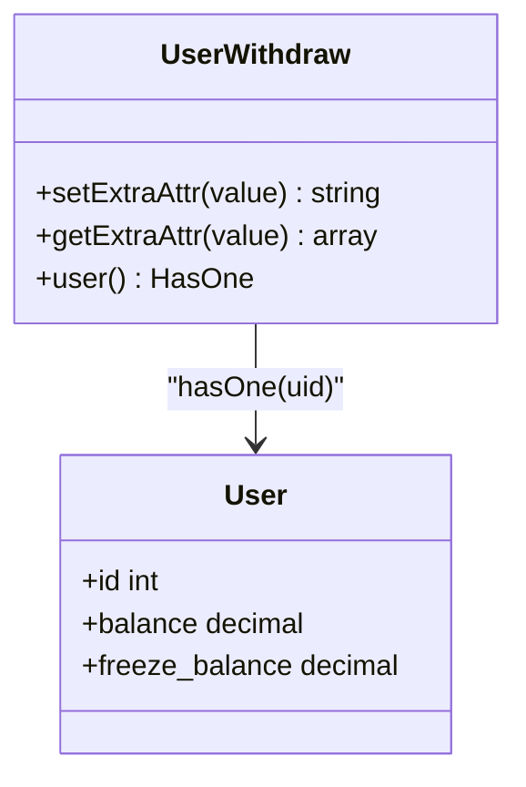
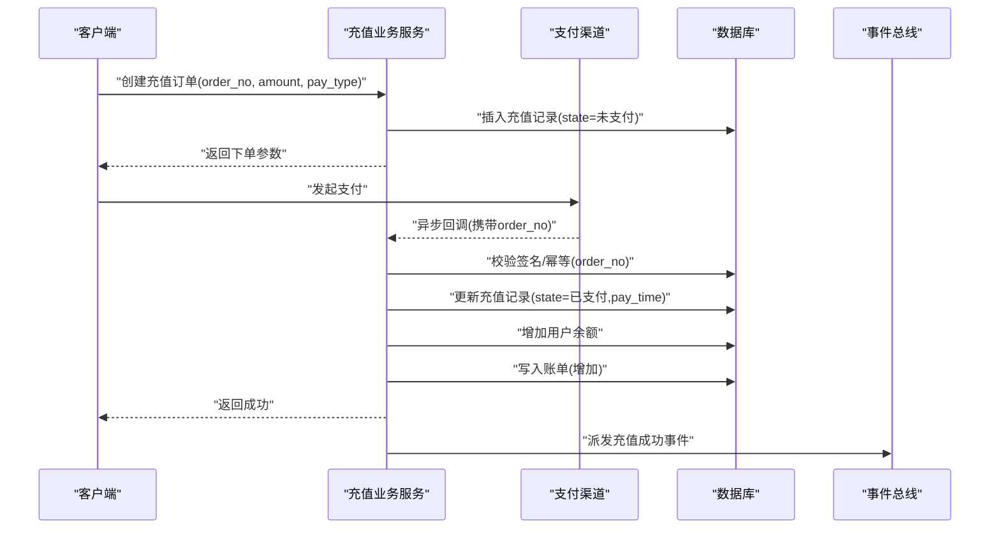
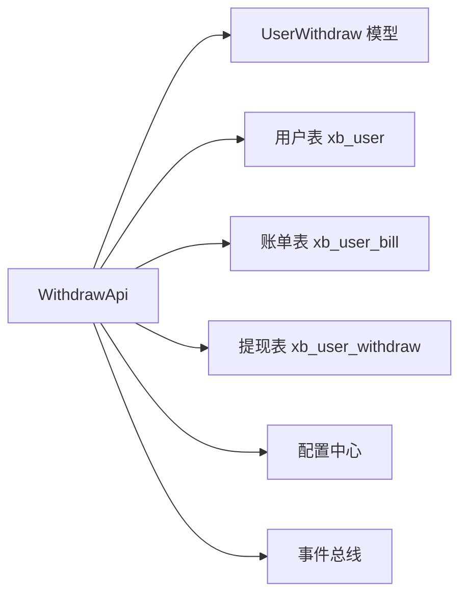

# 支付提现系统

<cite>
**本文引用的文件**   
- [install.sql](file://server/plugin/xbUser/install.sql)
- [WithdrawApi.php](file://server/plugin/xbUser/api/WithdrawApi.php)
- [UserWithdraw.php](file://server/plugin/xbUser/app/model/UserWithdraw.php)
</cite>

## 目录
1. [简介](#简介)
2. [项目结构](#项目结构)
3. [核心组件](#核心组件)
4. [架构总览](#架构总览)
5. [详细组件分析](#详细组件分析)
6. [依赖关系分析](#依赖关系分析)
7. [性能与一致性](#性能与一致性)
8. [故障排查指南](#故障排查指南)
9. [结论](#结论)

## 简介
本文件围绕用户充值与提现两大资金业务，结合数据库表结构与后端实现，系统化阐述订单编号、金额、状态、付款时间、手续费、实际到账金额等关键字段的设计与使用；并给出完整的业务流程：充值（订单生成、支付回调、状态更新、余额增加）与提现（申请提交、审核、打款处理、状态跟踪）。同时覆盖支付安全验证、防重复提交、幂等性处理与异常补偿机制的落地建议。

## 项目结构
- 数据层
  - 充值记录表：用于记录用户充值订单及支付结果
  - 提现申请表：用于记录用户提现申请、审核与打款结果
- 应用层
  - 提现接口服务：提供提现申请、审核、驳回、打款凭证上传等能力
  - 模型层：封装字段转换与关联查询

图表来源
- [install.sql:92-105](file://server/plugin/xbUser/install.sql#L92-L105)
- [install.sql:107-132](file://server/plugin/xbUser/install.sql#L107-L132)
- [WithdrawApi.php:1-358](file://server/plugin/xbUser/api/WithdrawApi.php#L1-L358)
- [UserWithdraw.php:1-63](file://server/plugin/xbUser/app/model/UserWithdraw.php#L1-L63)

章节来源
- [install.sql:92-105](file://server/plugin/xbUser/install.sql#L92-L105)
- [install.sql:107-132](file://server/plugin/xbUser/install.sql#L107-L132)
- [WithdrawApi.php:1-358](file://server/plugin/xbUser/api/WithdrawApi.php#L1-L358)
- [UserWithdraw.php:1-63](file://server/plugin/xbUser/app/model/UserWithdraw.php#L1-L63)

## 核心组件
- 充值记录表（xb_user_recharge）
  - 关键字段：order_no（订单编号）、amount（充值金额）、state（充值状态）、pay_time（付款时间）、pay_type（付款方式）
  - 设计要点：以 order_no 作为全局唯一标识，state 描述生命周期，pay_time 记录最终成功时间
- 提现申请表（xb_user_withdraw）
  - 关键字段：order_no（订单编号）、amount（申请提现金额）、fee（手续费）、real_amount（实际到账金额）、type/type_name（提现方式）、extra（扩展信息）、state（申请状态）、audit_time/audit_remarks（审核时间与备注）、pay_time/pay_voucher（打款时间与凭证）、remarks（用户备注）
  - 设计要点：通过 fee 与 real_amount 分离“扣减金额”和“到账金额”，便于审计与对账；extra 支持多渠道差异化字段；state 贯穿待审核/已通过/已驳回/已打款全链路

章节来源
- [install.sql:92-105](file://server/plugin/xbUser/install.sql#L92-L105)
- [install.sql:107-132](file://server/plugin/xbUser/install.sql#L107-L132)

## 架构总览
提现流程由 WithdrawApi 驱动，涉及用户账户余额与冻结余额的原子变更、账单记录、申请单创建与状态流转，并通过事件对外暴露关键节点。

图表来源
- [WithdrawApi.php:49-145](file://server/plugin/xbUser/api/WithdrawApi.php#L49-L145)

章节来源
- [WithdrawApi.php:49-145](file://server/plugin/xbUser/api/WithdrawApi.php#L49-L145)

## 详细组件分析

### 提现申请提交（submit）
- 输入校验
  - 必填参数：type、type_name、amount
  - 金额约束：大于0，且受最小/最大提现额度限制
  - 功能开关：withdraw_state 必须为开启
- 费用计算
  - 若未显式传入 fee，则按 withdrawal_fee 百分比计算
  - fee 不得小于0，且需小于 amount
  - real_amount = amount - fee（可被外部覆盖）
- 资金操作（事务内）
  - 从 balance 扣除 amount，freeze_balance 增加 amount
  - 写入账单记录（类型：扣除），备注包含 order_no
  - 创建提现申请记录，初始 state=待审核
- 后续动作
  - 刷新用户缓存
  - 派发事件：xbUser.Withdraw.submit

图表来源
- [WithdrawApi.php:49-145](file://server/plugin/xbUser/api/WithdrawApi.php#L49-L145)

章节来源
- [WithdrawApi.php:49-145](file://server/plugin/xbUser/api/WithdrawApi.php#L49-L145)

### 审核通过（audit）
- 前置条件：申请单存在且处于待审核
- 资金操作（事务内）
  - 从 freeze_balance 扣除 amount（资金实际流出）
  - 申请单状态改为已通过，记录 audit_time 与 audit_remarks
- 后续动作
  - 刷新用户缓存
  - 派发事件：xbUser.Withdraw.audit

图表来源
- [WithdrawApi.php:156-197](file://server/plugin/xbUser/api/WithdrawApi.php#L156-L197)

章节来源
- [WithdrawApi.php:156-197](file://server/plugin/xbUser/api/WithdrawApi.php#L156-L197)

### 驳回申请（reject）
- 前置条件：申请单存在且处于待审核
- 资金操作（事务内）
  - 将 amount 从 freeze_balance 退回 balance
  - 写入账单记录（类型：增加），备注包含 order_no 与驳回原因
  - 申请单状态改为已驳回，记录 audit_time 与 audit_remarks
- 后续动作
  - 刷新用户缓存
  - 派发事件：xbUser.Withdraw.reject

图表来源
- [WithdrawApi.php:208-263](file://server/plugin/xbUser/api/WithdrawApi.php#L208-L263)

章节来源
- [WithdrawApi.php:208-263](file://server/plugin/xbUser/api/WithdrawApi.php#L208-L263)

### 上传打款凭证（pay）
- 前置条件：申请单存在且处于已通过
- 操作
  - 更新申请单为已打款，记录 pay_time 与 pay_voucher
  - 可选追加打款备注至 audit_remarks
- 后续动作
  - 派发事件：xbUser.Withdraw.pay

图表来源
- [WithdrawApi.php:275-304](file://server/plugin/xbUser/api/WithdrawApi.php#L275-L304)

章节来源
- [WithdrawApi.php:275-304](file://server/plugin/xbUser/api/WithdrawApi.php#L275-L304)

### 提现模型（UserWithdraw）
- extra 字段自动 JSON 序列化/反序列化，便于存储多渠道扩展信息
- 关联用户表，便于管理端联查

图表来源
- [UserWithdraw.php:1-63](file://server/plugin/xbUser/app/model/UserWithdraw.php#L1-L63)

章节来源
- [UserWithdraw.php:1-63](file://server/plugin/xbUser/app/model/UserWithdraw.php#L1-L63)

### 充值流程（概念性说明）
说明：当前仓库未提供充值接口实现代码，以下基于表结构与通用实践给出端到端流程建议，便于对接支付渠道与内部账务。

[此图为概念流程图，不直接映射具体源码文件]

## 依赖关系分析
- 提现接口服务依赖
  - 用户表：读写 balance 与 freeze_balance
  - 账单表：记录每次余额变动
  - 提现申请表：持久化申请单与状态
  - 配置中心：获取提现开关、费率、限额等
  - 事件总线：在关键节点派发事件供外部订阅

图表来源
- [WithdrawApi.php:1-358](file://server/plugin/xbUser/api/WithdrawApi.php#L1-L358)
- [UserWithdraw.php:1-63](file://server/plugin/xbUser/app/model/UserWithdraw.php#L1-L63)

章节来源
- [WithdrawApi.php:1-358](file://server/plugin/xbUser/api/WithdrawApi.php#L1-L358)
- [UserWithdraw.php:1-63](file://server/plugin/xbUser/app/model/UserWithdraw.php#L1-L63)

## 性能与一致性
- 事务边界
  - 所有涉及余额变动的操作均包裹在事务中，确保“扣余额/加冻结/记账/建单”的原子性
- 幂等与防重
  - 提现申请单通过 order_no 唯一索引保证幂等
  - 充值回调应基于 order_no 做幂等落库与状态机校验，避免重复入账
- 并发控制
  - 余额更新采用行级锁（数据库事务隔离级别下），避免超提
- 可扩展点
  - 通过事件总线解耦下游（如风控、通知、对账）
- 计费精度
  - 金额字段使用高精度小数类型，手续费四舍五入到分，避免累积误差

章节来源
- [install.sql:92-105](file://server/plugin/xbUser/install.sql#L92-L105)
- [install.sql:107-132](file://server/plugin/xbUser/install.sql#L107-L132)
- [WithdrawApi.php:49-145](file://server/plugin/xbUser/api/WithdrawApi.php#L49-L145)

## 故障排查指南
- 常见异常与定位
  - 提现功能未开启：检查配置项 withdraw_state
  - 金额超限：核对 min_withdraw/max_withdraw 与请求金额
  - 余额不足：确认 balance 与 freeze_balance 是否足够
  - 手续费异常：检查 withdrawal_fee 与传入 fee 的合法性
  - 状态机错误：仅允许从“待审核”进行通过/驳回，仅允许从“已通过”上传凭证
- 日志与追踪
  - 关注各方法抛出的异常信息与事务回滚日志
  - 通过 order_no 串联申请、账单、事件日志
- 补偿策略
  - 定时任务扫描长时间停留中间态的申请单，触发人工复核或自动回滚
  - 对账脚本比对“提现表 vs 银行流水 vs 账单表”，发现差异后生成工单

章节来源
- [WithdrawApi.php:49-145](file://server/plugin/xbUser/api/WithdrawApi.php#L49-L145)
- [WithdrawApi.php:156-197](file://server/plugin/xbUser/api/WithdrawApi.php#L156-L197)
- [WithdrawApi.php:208-263](file://server/plugin/xbUser/api/WithdrawApi.php#L208-L263)
- [WithdrawApi.php:275-304](file://server/plugin/xbUser/api/WithdrawApi.php#L275-L304)

## 结论
- 提现流程已在接口层实现完整闭环：申请、审核、驳回、打款凭证上传，配合事务与事件保障一致性与可观测性
- 充值流程虽未在代码中实现，但表结构已完备，可按概念流程对接支付渠道与内部账务
- 建议在充值回调侧严格实现签名校验、幂等与状态机校验，并建立对账与补偿机制，确保资金安全与数据准确