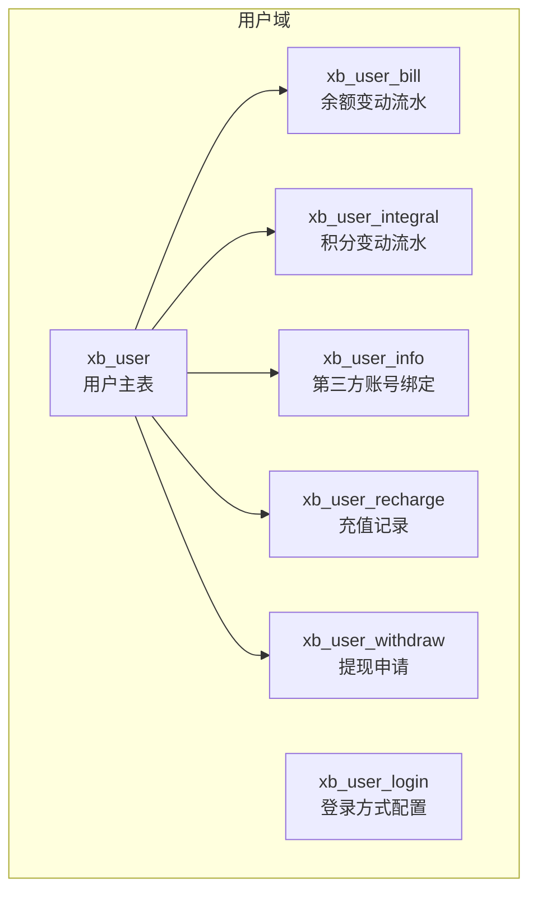
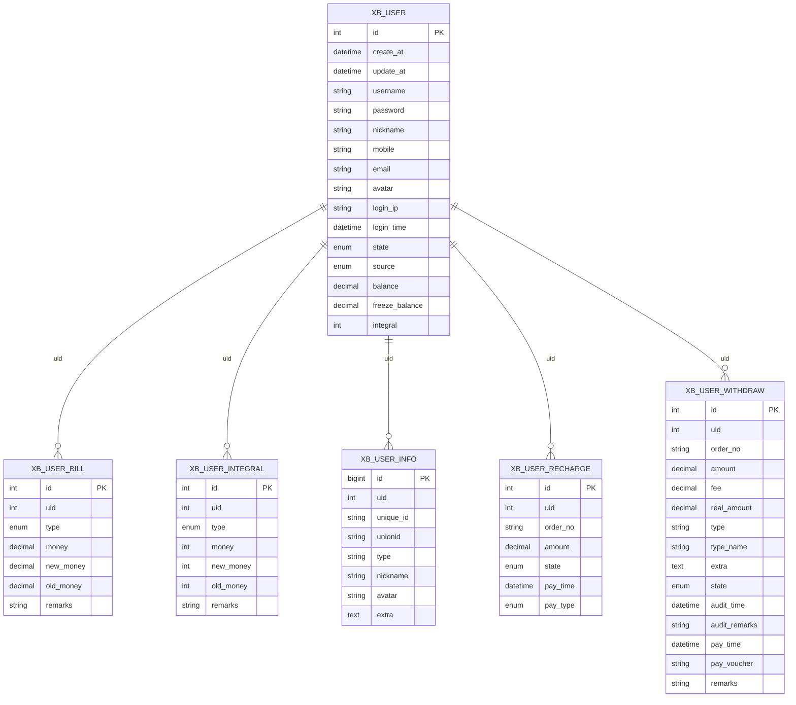
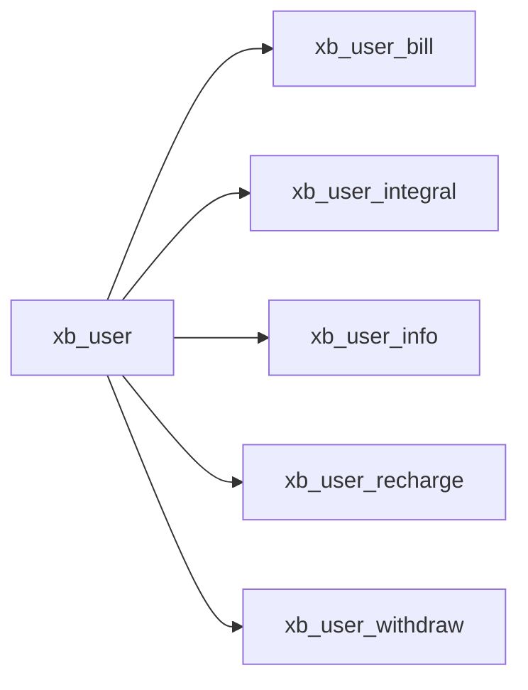

# 用户核心表结构

<cite>
**本文引用的文件**
- [install.sql](file://server/plugin\xbUser\install.sql)
</cite>

## 目录
1. [简介](#简介)
2. [项目结构](#项目结构)
3. [核心组件](#核心组件)
4. [架构总览](#架构总览)
5. [详细组件分析](#详细组件分析)
6. [依赖分析](#依赖分析)
7. [性能考虑](#性能考虑)
8. [故障排查指南](#故障排查指南)
9. [结论](#结论)
10. [附录](#附录)

## 简介
本文件聚焦于用户核心主表 xb_user 的字段设计与业务语义，涵盖基础信息、状态管理、注册来源、财务相关字段（余额、冻结余额、积分）、登录审计字段（登录IP、登录时间）以及多端登录来源区分策略。同时给出数据加密与敏感信息保护的安全最佳实践建议，帮助开发者在实现用户注册、登录、鉴权与资金/积分变更时遵循一致的数据模型与安全规范。

## 项目结构
用户核心表结构定义位于插件安装脚本中，包含用户主表及若干关联表（账单、积分、第三方绑定、充值、提现等）。本节仅关注用户主表 xb_user 的设计要点。

图表来源
- [install.sql:4-22](file://server/plugin\xbUser\install.sql#L4-L22)
- [install.sql:26-38](file://server/plugin\xbUser\install.sql#L26-L38)
- [install.sql:42-55](file://server/plugin\xbUser\install.sql#L42-L55)
- [install.sql:59-71](file://server/plugin\xbUser\install.sql#L59-L71)
- [install.sql:75-89](file://server/plugin\xbUser\install.sql#L75-L89)
- [install.sql:93-105](file://server/plugin\xbUser\install.sql#L93-L105)
- [install.sql:109-132](file://server/plugin\xbUser\install.sql#L109-L132)

章节来源
- [install.sql:4-22](file://server/plugin\xbUser\install.sql#L4-L22)

## 核心组件
本节对 xb_user 主表的字段进行逐项说明，包括数据类型、约束、默认值与业务含义。

- id
  - 类型：整型自增主键
  - 约束：非空，主键
  - 默认值：无（自增）
  - 业务含义：用户唯一标识

- create_at / update_at
  - 类型：日期时间
  - 约束：可为空
  - 默认值：空
  - 业务含义：创建时间与更新时间，用于审计追踪

- username
  - 类型：变长字符串（最大长度30）
  - 约束：非空，默认空串
  - 业务含义：登录账号（字母+数字），作为用户身份标识之一

- password
  - 类型：变长字符串（最大长度50）
  - 约束：非空，默认空串
  - 业务含义：登录密码（应存储为安全哈希值，禁止明文）

- nickname
  - 类型：变长字符串（最大长度20）
  - 约束：非空，默认空串
  - 业务含义：用户昵称，展示用

- mobile
  - 类型：变长字符串（最大长度20）
  - 约束：非空，默认空串
  - 业务含义：手机号码，可用于登录或二次验证

- email
  - 类型：变长字符串（最大长度30）
  - 约束：非空，默认空串
  - 业务含义：电子邮箱，可用于登录或通知

- avatar
  - 类型：变长字符串（最大长度255）
  - 约束：非空，默认空串
  - 业务含义：头像地址（URL或路径）

- login_ip
  - 类型：变长字符串（最大长度30）
  - 约束：非空，默认空串
  - 业务含义：最近一次登录IP，用于安全审计与风控

- login_time
  - 类型：日期时间
  - 约束：可为空
  - 默认值：空
  - 业务含义：最近一次登录时间，用于安全审计与风控

- state
  - 类型：枚举（'10','20'）
  - 约束：非空，默认'20'
  - 业务含义：用户状态；10=正常，20=禁用。默认禁用需管理员激活后方可使用

- source
  - 类型：枚举（'web','pc','h5','wechat','weapp','douyin','app'）
  - 约束：非空，默认'web'
  - 业务含义：注册来源，用于区分多端渠道与统计转化

- balance
  - 类型：十进制（精度10，小数位2）
  - 约束：非空，默认0.00
  - 业务含义：用户可用余额，单位通常为元

- freeze_balance
  - 类型：十进制（精度10，小数位2）
  - 约束：非空，默认0.00
  - 业务含义：冻结余额，交易过程中暂不可用的金额

- integral
  - 类型：整型
  - 约束：非空，默认0
  - 业务含义：用户积分，用于营销与权益体系

章节来源
- [install.sql:4-22](file://server/plugin\xbUser\install.sql#L4-L22)

## 架构总览
下图展示了用户主表与其周边关键表的关系，便于理解用户资产与行为数据的整体结构。

图表来源
- [install.sql:4-22](file://server/plugin\xbUser\install.sql#L4-L22)
- [install.sql:26-38](file://server/plugin\xbUser\install.sql#L26-L38)
- [install.sql:42-55](file://server/plugin\xbUser\install.sql#L42-L55)
- [install.sql:59-71](file://server/plugin\xbUser\install.sql#L59-L71)
- [install.sql:93-105](file://server/plugin\xbUser\install.sql#L93-L105)
- [install.sql:109-132](file://server/plugin\xbUser\install.sql#L109-L132)

## 详细组件分析

### 用户状态与注册来源
- 状态枚举
  - 10：正常。表示账户可正常使用。
  - 20：禁用。表示账户被限制，需管理员操作恢复。
  - 默认值：20（新注册用户默认禁用，需审核或激活后启用）。
- 注册来源枚举
  - web：网页端
  - pc：桌面客户端
  - h5：移动端H5
  - wechat：微信公众号/小程序生态
  - weapp：微信小程序
  - douyin：抖音平台
  - app：原生应用
  - 默认值：web
- 业务影响
  - 不同来源可驱动差异化权限、活动规则与风控策略。
  - 结合登录审计字段（login_ip、login_time）可实现来源与设备画像。

章节来源
- [install.sql:16-17](file://server/plugin\xbUser\install.sql#L16-L17)

### 登录审计与多端登录来源区分
- 登录审计字段
  - login_ip：记录最近一次登录IP，支持异常登录检测与封禁策略。
  - login_time：记录最近一次登录时间，支持会话管理与活跃度统计。
- 多端来源区分
  - 通过 source 字段标记注册来源，配合登录日志（可在其他模块扩展）实现“来源-设备-地域”多维分析。
  - 建议在登录成功后统一更新 login_ip 与 login_time，并持久化登录事件到独立日志表（如按平台分表或分区）。

章节来源
- [install.sql:14-17](file://server/plugin\xbUser\install.sql#L14-L17)

### 财务相关字段设计
- 余额与冻结余额
  - balance：可用余额，参与消费结算。
  - freeze_balance：冻结余额，常用于订单锁定、退款处理等场景，避免超扣。
  - 一致性要求：任何余额变动必须同步写入 xb_user_bill 流水，保证可追溯与对账。
- 积分
  - integral：用户积分，用于兑换、折扣、等级提升等。
  - 一致性要求：任何积分变动必须同步写入 xb_user_integral 流水，确保可审计。

章节来源
- [install.sql:18-20](file://server/plugin\xbUser\install.sql#L18-L20)
- [install.sql:26-38](file://server/plugin\xbUser\install.sql#L26-L38)
- [install.sql:59-71](file://server/plugin\xbUser\install.sql#L59-L71)

### 安全与敏感信息保护
- 密码存储
  - 使用强哈希算法（如 bcrypt/scrypt/argon2）存储，禁止明文。
  - 每次登录校验采用侧信道安全的比较函数。
- 传输与存储
  - 全站HTTPS，敏感字段在数据库层加密（如AES-GCM）或借助KMS托管密钥。
  - 最小化敏感信息落库，必要时脱敏展示。
- 访问控制
  - 基于角色的访问控制（RBAC）与接口级鉴权。
  - 对余额/积分修改接口增加幂等与防重放机制。
- 审计与风控
  - 记录登录IP、时间、来源、UA、设备指纹等。
  - 对异常登录（异地、频繁失败）触发二次验证或临时冻结。

[本节为通用安全建议，不直接分析具体代码文件]

## 依赖分析
- 内聚性
  - xb_user 作为用户域核心实体，聚合了身份、状态、来源与资产快照，具备高内聚特征。
- 耦合性
  - 与 xb_user_bill、xb_user_integral 形成“主表+流水”的经典模式，降低单表膨胀，提高可审计性。
  - 与 xb_user_info 解耦第三方账号绑定，避免主表过度复杂。
- 外部依赖
  - 支付与提现流程依赖 xb_user_recharge 与 xb_user_withdraw，需保证事务一致性与幂等。

图表来源
- [install.sql:4-22](file://server/plugin\xbUser\install.sql#L4-L22)
- [install.sql:26-38](file://server/plugin\xbUser\install.sql#L26-L38)
- [install.sql:42-55](file://server/plugin\xbUser\install.sql#L42-L55)
- [install.sql:59-71](file://server/plugin\xbUser\install.sql#L59-L71)
- [install.sql:93-105](file://server/plugin\xbUser\install.sql#L93-L105)
- [install.sql:109-132](file://server/plugin\xbUser\install.sql#L109-L132)

章节来源
- [install.sql:4-22](file://server/plugin\xbUser\install.sql#L4-L22)

## 性能考虑
- 索引优化
  - 查询热点：username、mobile、email 常作为登录或检索条件，建议建立唯一或普通索引以提升查找性能。
  - 审计查询：login_time 可按时间范围查询，建议建立复合索引（如 login_time, source）。
  - 财务流水：xb_user_bill、xb_user_integral 的 uid 字段建议建索引以加速用户维度汇总。
- 存储与字符集
  - 使用 utf8mb4 以兼容表情符号与多语言。
  - 合理设置 varchar 长度，避免过长导致页分裂与IO放大。
- 事务与锁
  - 余额/积分变更采用事务包裹，先写流水再更新主表，必要时加行锁防止并发竞态。
- 读写分离
  - 报表与对账走从库，在线交易走主库，降低主库压力。

[本节为通用性能建议，不直接分析具体代码文件]

## 故障排查指南
- 登录失败
  - 检查 state 是否为 20（禁用），确认是否完成激活流程。
  - 核对 username/mobile/email 是否存在且未被占用。
- 余额不一致
  - 核对 xb_user_bill 流水与主表 balance 是否一致，定位缺失或重复流水。
  - 检查是否有未提交的事务或异常中断导致的半更新。
- 积分异常
  - 核对 xb_user_integral 流水与主表 integral 是否一致，排查并发写入问题。
- 登录审计缺失
  - 确认登录成功后是否更新 login_ip 与 login_time，检查中间件或拦截器是否生效。

章节来源
- [install.sql:16-20](file://server/plugin\xbUser\install.sql#L16-L20)
- [install.sql:26-38](file://server/plugin\xbUser\install.sql#L26-L38)
- [install.sql:59-71](file://server/plugin\xbUser\install.sql#L59-L71)

## 结论
xb_user 主表围绕“身份-状态-来源-资产-审计”五大维度构建，配合余额与积分流水表形成完整可审计的用户资产体系。通过合理的索引、事务与加密策略，可在保障安全性的同时获得良好的性能与可维护性。建议在生产环境严格遵循最小权限、全链路审计与幂等设计原则。

[本节为总结性内容，不直接分析具体代码文件]

## 附录
- 字段字典（节选）
  - id：用户ID，整型自增主键
  - username：登录账号，变长字符串
  - password：登录密码，变长字符串（存储哈希）
  - nickname：昵称，变长字符串
  - mobile：手机号，变长字符串
  - email：邮箱，变长字符串
  - avatar：头像地址，变长字符串
  - login_ip：最近登录IP，变长字符串
  - login_time：最近登录时间，日期时间
  - state：状态，枚举（10正常/20禁用）
  - source：注册来源，枚举（web/pc/h5/wechat/weapp/douyin/app）
  - balance：余额，十进制（10,2）
  - freeze_balance：冻结余额，十进制（10,2）
  - integral：积分，整型

章节来源
- [install.sql:4-22](file://server/plugin\xbUser\install.sql#L4-L22)