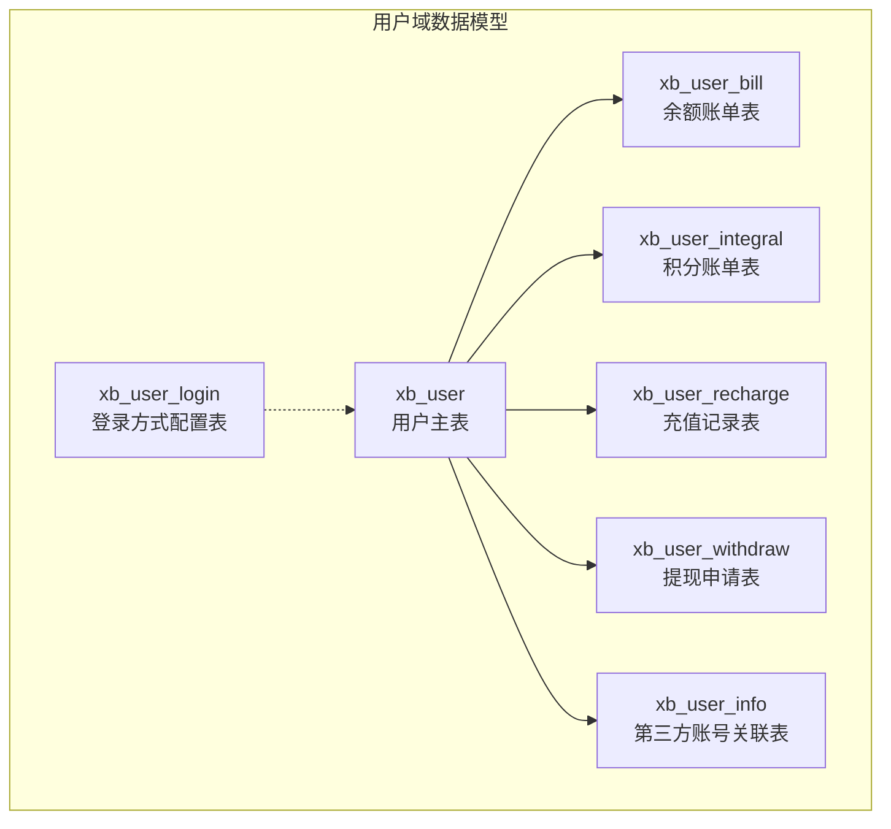
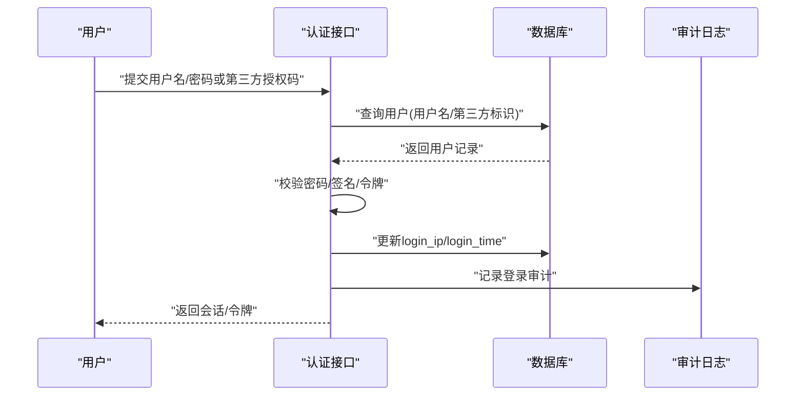
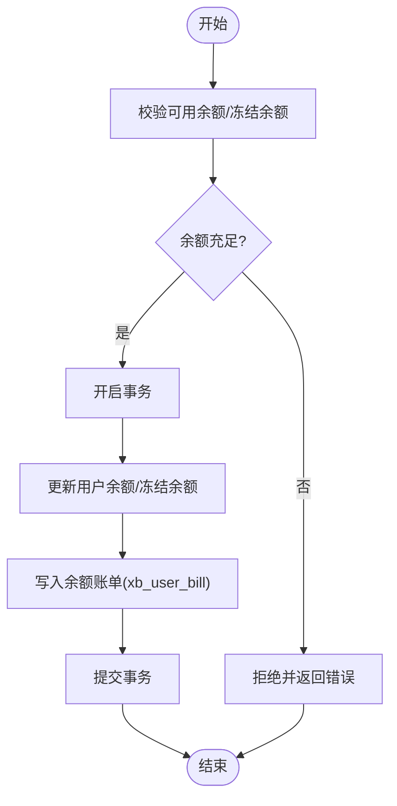
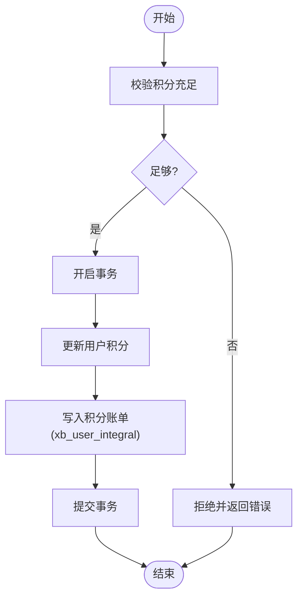
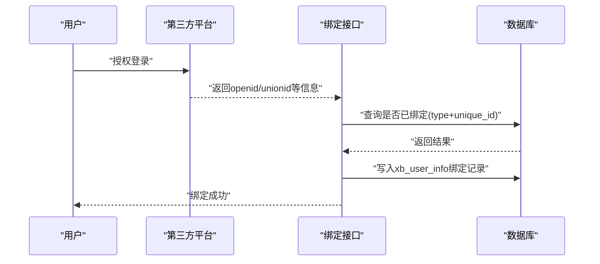
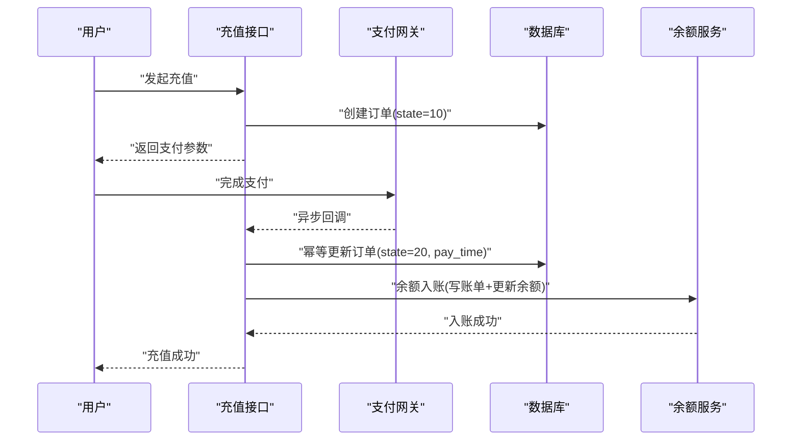
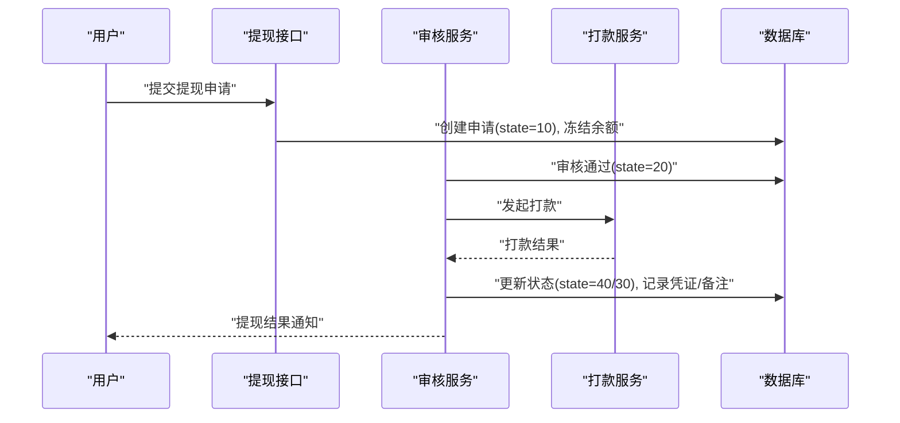
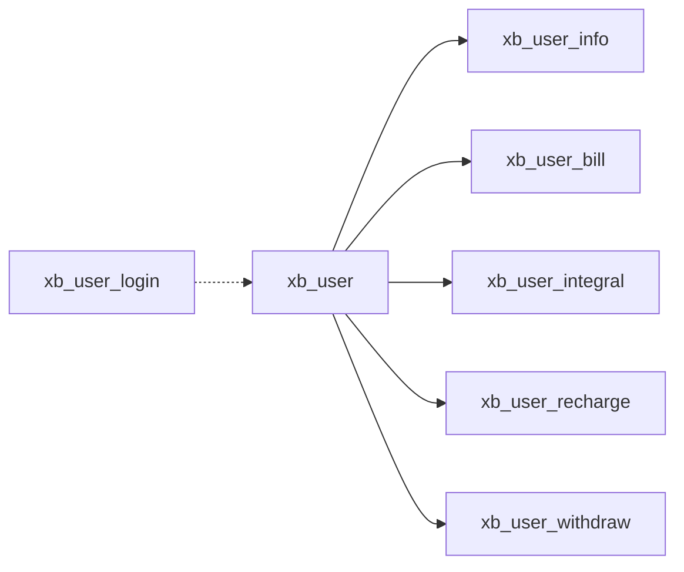

# 用户系统数据模型

<cite>
**本文引用的文件**   
- [install.sql](file://server/plugin/xbUser/install.sql)
</cite>

## 目录
1. [简介](#简介)
2. [项目结构](#项目结构)
3. [核心组件](#核心组件)
4. [架构总览](#架构总览)
5. [详细组件分析](#详细组件分析)
6. [依赖关系分析](#依赖关系分析)
7. [性能考虑](#性能考虑)
8. [故障排查指南](#故障排查指南)
9. [结论](#结论)
10. [附录](#附录)

## 简介
本文件聚焦于用户系统的核心数据模型，围绕以下七张表进行系统化说明：
- xb_user（用户主表）
- xb_user_info（第三方账号关联表）
- xb_user_bill（余额账单表）
- xb_user_integral（积分账单表）
- xb_user_login（登录方式配置表）
- xb_user_recharge（充值记录表）
- xb_user_withdraw（提现申请表）

文档将逐一阐述字段定义、数据类型、约束条件、索引设计、业务规则与状态流转，并给出用户状态管理、余额变动机制、积分系统实现、第三方账号绑定逻辑、权限控制与安全加密策略、审计日志记录的方案建议。

## 项目结构
用户系统相关的数据模型由安装脚本集中定义，位于插件模块的 install.sql 中。该脚本包含建表语句及注释，是理解用户域数据结构的权威来源。



图表来源
- [install.sql:4-22](file://server/plugin/xbUser/install.sql#L4-L22)
- [install.sql:43-55](file://server/plugin/xbUser/install.sql#L43-L55)
- [install.sql:27-38](file://server/plugin/xbUser/install.sql#L27-L38)
- [install.sql:60-71](file://server/plugin/xbUser/install.sql#L60-L71)
- [install.sql:76-89](file://server/plugin/xbUser/install.sql#L76-L89)
- [install.sql:94-105](file://server/plugin/xbUser/install.sql#L94-L105)
- [install.sql:110-132](file://server/plugin/xbUser/install.sql#L110-L132)

章节来源
- [install.sql:1-133](file://server/plugin/xbUser/install.sql#L1-L133)

## 核心组件
本节对每张核心表进行结构化说明，包括字段含义、类型、约束、索引与关键业务规则。

### 用户主表：xb_user
- 用途：存储用户基础信息与资产快照（余额、冻结余额、积分），以及登录痕迹与注册来源。
- 关键字段
  - id：自增主键
  - username：登录账号（字母+数字）
  - password：登录密码（应使用安全哈希存储）
  - nickname：昵称
  - mobile：手机号
  - email：邮箱
  - avatar：头像地址
  - login_ip：最近登录IP
  - login_time：最近登录时间
  - state：用户状态（枚举值见下）
  - source：注册来源（web/pc/h5/wechat/weapp/douyin/app）
  - balance：可用余额
  - freeze_balance：冻结余额
  - integral：积分
- 约束与索引
  - 主键：id
  - 建议索引（按查询场景补充）：username、mobile、email、state、source
- 业务规则
  - 余额与冻结余额合计为“在途可用”；扣款时应优先从可用余额扣除，不足时拒绝或走风控流程。
  - 积分不可为负数，所有变动需通过积分账单表留痕。
  - 状态变更需结合审计日志与幂等校验。

章节来源
- [install.sql:4-22](file://server/plugin/xbUser/install.sql#L4-L22)

### 第三方账号关联表：xb_user_info
- 用途：记录用户与第三方平台账号的绑定关系，支持多平台多账号。
- 关键字段
  - id：自增主键
  - uid：关联的用户ID（外键指向 xb_user.id）
  - unique_id：唯一标识（如账号、邮箱、手机、微信openid等）
  - unionid：同主体下的唯一标识（用于跨应用统一识别）
  - type：账号类型（如 weixin_openid、weixin_unionid、phone、email 等）
  - nickname/avatar：第三方返回的昵称与头像
  - extra：扩展信息（JSON）
- 约束与索引
  - 主键：id
  - 建议索引：uid、type、unique_id、unionid
- 业务规则
  - 同一 type + unique_id 组合应唯一绑定至一个用户，避免重复绑定。
  - 若存在 unionid，则优先以 unionid 做去重与合并。
  - 解绑前需校验是否为主登录方式，必要时保留至少一种登录方式。

章节来源
- [install.sql:43-55](file://server/plugin/xbUser/install.sql#L43-L55)

### 余额账单表：xb_user_bill
- 用途：记录用户余额变动的明细流水，保证可追溯与对账。
- 关键字段
  - id：自增主键
  - uid：用户ID
  - type：操作类型（10 扣除，20 增加）
  - money：本次变动金额
  - old_money：变动前余额
  - new_money：变动后余额
  - remarks：变动理由
- 约束与索引
  - 主键：id
  - 建议索引：uid、create_at、type
- 业务规则
  - 任何余额变动必须同时写入此表，且保持 old_money/new_money 一致性。
  - 扣款需先校验可用余额充足，再落库；失败需回滚事务。
  - 对账时可按日期范围汇总 type=20 与 type=10 的金额核对。

章节来源
- [install.sql:27-38](file://server/plugin/xbUser/install.sql#L27-L38)

### 积分账单表：xb_user_integral
- 用途：记录用户积分变动的明细流水。
- 关键字段
  - id：自增主键
  - uid：用户ID
  - type：操作类型（10 扣除，20 增加）
  - money：本次变动积分
  - old_money：变动前积分
  - new_money：变动后积分
  - remarks：变动理由
- 约束与索引
  - 主键：id
  - 建议索引：uid、create_at、type
- 业务规则
  - 积分不可为负；扣减前需校验积分充足。
  - 积分发放需具备活动/任务来源标记（可在 remarks 或扩展字段中体现）。

章节来源
- [install.sql:60-71](file://server/plugin/xbUser/install.sql#L60-L71)

### 登录方式配置表：xb_user_login
- 用途：维护支持的登录方式及其实现类，便于动态扩展。
- 关键字段
  - id：自增主键
  - name：平台标识（唯一）
  - title：平台名称
  - logo：图标地址
  - plugin：插件标识
  - class：实现类的完整命名空间
  - bg_color：背景颜色
  - sort：排序权重
- 约束与索引
  - 主键：id
  - 唯一索引：name
- 业务规则
  - 新增登录方式需在数据库登记并部署对应实现类。
  - 前端根据该表渲染登录入口。

章节来源
- [install.sql:76-89](file://server/plugin/xbUser/install.sql#L76-L89)

### 充值记录表：xb_user_recharge
- 用途：记录用户充值订单与支付状态。
- 关键字段
  - id：自增主键
  - uid：用户ID
  - order_no：订单编号（全局唯一）
  - amount：充值金额
  - state：充值状态（10 未支付，20 已支付，30 已过期，40 已取消）
  - pay_time：付款时间
  - pay_type：付款方式（wxpay/alipay）
- 约束与索引
  - 主键：id
  - 建议索引：order_no、uid、state、pay_time
- 业务规则
  - 创建订单后进入未支付状态；超时自动过期。
  - 支付成功回调需幂等更新状态，并发出余额入账事件。
  - 对账时需按 pay_type 与时间窗口核对。

章节来源
- [install.sql:94-105](file://server/plugin/xbUser/install.sql#L94-L105)

### 提现申请表：xb_user_withdraw
- 用途：记录用户提现申请、审核与打款全流程。
- 关键字段
  - id：自增主键
  - uid：用户ID
  - order_no：订单编号（唯一）
  - amount：申请提现金额
  - fee：手续费
  - real_amount：实际到账金额
  - type/type_name：提现方式标识与名称
  - extra：扩展信息（JSON）
  - state：申请状态（10 待审核，20 已通过，30 已驳回，40 已打款）
  - audit_time/audit_remarks：审核时间与备注
  - pay_time/pay_voucher：打款时间与凭证
  - remarks：用户备注
- 约束与索引
  - 主键：id
  - 唯一索引：order_no
  - 普通索引：uid、state
- 业务规则
  - 提交申请时冻结相应余额；审核通过后发起打款；打款成功后解冻剩余部分或直接扣减。
  - 打款失败需回滚冻结并记录原因。
  - 审核与打款均需审计日志与幂等处理。

章节来源
- [install.sql:110-132](file://server/plugin/xbUser/install.sql#L110-L132)

## 架构总览
下图展示用户域核心实体之间的关系与主要业务流程（注册/登录、第三方绑定、充值入账、提现打款、余额/积分流水）。

```mermaid
erDiagram
XB_USER {
int id PK
string username
string password
string nickname
string mobile
string email
string avatar
string login_ip
datetime login_time
enum state
enum source
decimal balance
decimal freeze_balance
int integral
}
XB_USER_INFO {
bigint id PK
int uid FK
string unique_id
string unionid
string type
string nickname
string avatar
text extra
}
XB_USER_BILL {
int id PK
int uid FK
enum type
decimal money
decimal old_money
decimal new_money
varchar remarks
}
XB_USER_INTEGRAL {
int id PK
int uid FK
enum type
int money
int old_money
int new_money
varchar remarks
}
XB_USER_LOGIN {
int id PK
string name UK
string title
string logo
string plugin
string class
string bg_color
int sort
}
XB_USER_RECHARGE {
int id PK
int uid FK
string order_no UK
decimal amount
enum state
datetime pay_time
enum pay_type
}
XB_USER_WITHDRAW {
int id PK
int uid FK
string order_no UK
decimal amount
decimal fee
decimal real_amount
string type
string type_name
text extra
enum state
datetime audit_time
varchar audit_remarks
datetime pay_time
varchar pay_voucher
varchar remarks
}
XB_USER ||--o{ XB_USER_INFO : "绑定"
XB_USER ||--o{ XB_USER_BILL : "余额流水"
XB_USER ||--o{ XB_USER_INTEGRAL : "积分流水"
XB_USER ||--o{ XB_USER_RECHARGE : "充值订单"
XB_USER ||--o{ XB_USER_WITHDRAW : "提现申请"
XB_USER_LOGIN ..|| XB_USER : "登录方式配置"
```

图表来源
- [install.sql:4-22](file://server/plugin/xbUser/install.sql#L4-L22)
- [install.sql:43-55](file://server/plugin/xbUser/install.sql#L43-L55)
- [install.sql:27-38](file://server/plugin/xbUser/install.sql#L27-L38)
- [install.sql:60-71](file://server/plugin/xbUser/install.sql#L60-L71)
- [install.sql:76-89](file://server/plugin/xbUser/install.sql#L76-L89)
- [install.sql:94-105](file://server/plugin/xbUser/install.sql#L94-L105)
- [install.sql:110-132](file://server/plugin/xbUser/install.sql#L110-L132)

## 详细组件分析

### 用户状态管理与登录流程
- 用户状态（state）
  - 常见取值：启用/禁用（具体枚举值以安装脚本为准）
  - 状态变更需受权限控制，并记录审计日志
- 登录方式（xb_user_login）
  - 通过 name/class 动态加载登录实现类
  - 支持多端来源（source）区分渠道
- 第三方绑定（xb_user_info）
  - 基于 type+unique_id 或 unionid 进行去重与合并
  - 支持多平台多账号并存



图表来源
- [install.sql:4-22](file://server/plugin/xbUser/install.sql#L4-L22)
- [install.sql:76-89](file://server/plugin/xbUser/install.sql#L76-L89)
- [install.sql:43-55](file://server/plugin/xbUser/install.sql#L43-L55)

章节来源
- [install.sql:4-22](file://server/plugin/xbUser/install.sql#L4-L22)
- [install.sql:76-89](file://server/plugin/xbUser/install.sql#L76-L89)
- [install.sql:43-55](file://server/plugin/xbUser/install.sql#L43-L55)

### 余额变动机制
- 触发源
  - 充值成功（xb_user_recharge.state=20）
  - 消费/扣费（业务侧调用余额服务）
  - 退款/补偿（逆向流程）
- 原子性要求
  - 余额更新与写入 xb_user_bill 必须在同一事务内完成
  - 使用乐观锁或行级锁防止并发导致的不一致
- 对账与审计
  - 按日期/渠道/类型汇总对账
  - 异常交易需人工复核并补录调整单



图表来源
- [install.sql:27-38](file://server/plugin/xbUser/install.sql#L27-L38)
- [install.sql:4-22](file://server/plugin/xbUser/install.sql#L4-L22)

章节来源
- [install.sql:27-38](file://server/plugin/xbUser/install.sql#L27-L38)
- [install.sql:4-22](file://server/plugin/xbUser/install.sql#L4-L22)

### 积分系统实现
- 积分发放/扣减均通过 xb_user_integral 记录流水
- 发放来源可为活动、任务、邀请等，remarks 中记录来源与上下文
- 积分不可为负，扣减前需校验当前积分



图表来源
- [install.sql:60-71](file://server/plugin/xbUser/install.sql#L60-L71)
- [install.sql:4-22](file://server/plugin/xbUser/install.sql#L4-L22)

章节来源
- [install.sql:60-71](file://server/plugin/xbUser/install.sql#L60-L71)
- [install.sql:4-22](file://server/plugin/xbUser/install.sql#L4-L22)

### 第三方账号绑定逻辑
- 绑定流程
  - 获取第三方返回的 unique_id/unionid 与 type
  - 检查是否已绑定到其它用户，若存在则提示冲突
  - 写入 xb_user_info，建立 uid 与第三方标识的映射
- 解绑与切换
  - 解绑前确保至少保留一种登录方式
  - 切换主登录方式需校验安全性（二次验证）



图表来源
- [install.sql:43-55](file://server/plugin/xbUser/install.sql#L43-L55)

章节来源
- [install.sql:43-55](file://server/plugin/xbUser/install.sql#L43-L55)

### 充值入账流程
- 创建充值订单（xb_user_recharge），初始状态为未支付
- 支付网关回调后幂等更新状态为已支付，并发出余额入账事件
- 余额入账需写入 xb_user_bill 并更新用户余额



图表来源
- [install.sql:94-105](file://server/plugin/xbUser/install.sql#L94-L105)
- [install.sql:27-38](file://server/plugin/xbUser/install.sql#L27-L38)
- [install.sql:4-22](file://server/plugin/xbUser/install.sql#L4-L22)

章节来源
- [install.sql:94-105](file://server/plugin/xbUser/install.sql#L94-L105)
- [install.sql:27-38](file://server/plugin/xbUser/install.sql#L27-L38)
- [install.sql:4-22](file://server/plugin/xbUser/install.sql#L4-L22)

### 提现打款流程
- 用户提交提现申请（xb_user_withdraw），冻结相应余额
- 管理员审核通过后发起打款，更新状态与打款信息
- 打款成功则更新状态为已打款；失败则回滚冻结并记录原因



图表来源
- [install.sql:110-132](file://server/plugin/xbUser/install.sql#L110-L132)
- [install.sql:4-22](file://server/plugin/xbUser/install.sql#L4-L22)

章节来源
- [install.sql:110-132](file://server/plugin/xbUser/install.sql#L110-L132)
- [install.sql:4-22](file://server/plugin/xbUser/install.sql#L4-L22)

## 依赖关系分析
- 实体依赖
  - xb_user 被 xb_user_info、xb_user_bill、xb_user_integral、xb_user_recharge、xb_user_withdraw 通过 uid 引用
  - xb_user_login 作为配置表，不直接引用用户，但影响登录流程
- 潜在风险
  - 缺少显式外键约束时，需在上层保证引用完整性
  - 高并发写入余额/冻结余额需加锁或采用版本控制



图表来源
- [install.sql:4-22](file://server/plugin/xbUser/install.sql#L4-L22)
- [install.sql:43-55](file://server/plugin/xbUser/install.sql#L43-L55)
- [install.sql:27-38](file://server/plugin/xbUser/install.sql#L27-L38)
- [install.sql:60-71](file://server/plugin/xbUser/install.sql#L60-L71)
- [install.sql:94-105](file://server/plugin/xbUser/install.sql#L94-L105)
- [install.sql:110-132](file://server/plugin/xbUser/install.sql#L110-L132)
- [install.sql:76-89](file://server/plugin/xbUser/install.sql#L76-L89)

章节来源
- [install.sql:4-22](file://server/plugin/xbUser/install.sql#L4-L22)
- [install.sql:43-55](file://server/plugin/xbUser/install.sql#L43-L55)
- [install.sql:27-38](file://server/plugin/xbUser/install.sql#L27-L38)
- [install.sql:60-71](file://server/plugin/xbUser/install.sql#L60-L71)
- [install.sql:94-105](file://server/plugin/xbUser/install.sql#L94-L105)
- [install.sql:110-132](file://server/plugin/xbUser/install.sql#L110-L132)
- [install.sql:76-89](file://server/plugin/xbUser/install.sql#L76-L89)

## 性能考虑
- 索引优化
  - 高频查询字段建议建立索引：username、mobile、email、state、source、uid、order_no、state
  - 复合索引示例：xb_user_withdraw(uid, state)、xb_user_recharge(uid, state)
- 事务与锁
  - 余额/冻结余额更新与账单写入需在同一事务
  - 使用行级锁或版本号避免超卖/重复入账
- 分库分表
  - 当流水表增长较快时，可按 uid 或时间分片
- 读写分离
  - 报表与对账走只读副本，降低主库压力

[本节为通用性能建议，无需代码来源]

## 故障排查指南
- 常见问题定位
  - 余额不一致：比对 xb_user_bill 的累计与用户表余额差异
  - 重复入账：检查幂等键（order_no）与回调重试
  - 第三方绑定冲突：核查 type+unique_id 的唯一性
  - 提现失败：查看审核与打款状态、pay_voucher 与审计日志
- 建议措施
  - 引入分布式锁与幂等表
  - 完善审计日志与告警
  - 定期对账与异常工单闭环

[本节为通用排障建议，无需代码来源]

## 结论
本数据模型围绕用户主表与资金/积分流水构建，辅以第三方账号绑定与登录方式配置，形成完整的用户域数据基座。为保证一致性、可追溯性与可扩展性，建议在业务层落实事务边界、幂等控制、审计日志与对账机制，并在索引设计与分库分表方面提前规划。

[本节为总结性内容，无需代码来源]

## 附录
- 术语
  - 可用余额：可直接消费的余额
  - 冻结余额：因提现/争议等暂时不可用的余额
  - 流水：记录每次资产变动的明细
- 建议的审计字段
  - operator_id、operator_type、ip、ua、trace_id、biz_no、reason

[本节为补充说明，无需代码来源]