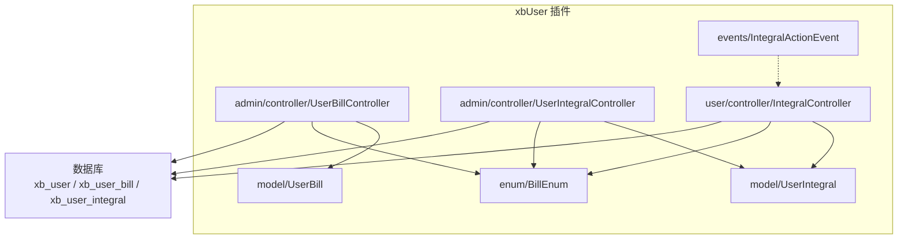
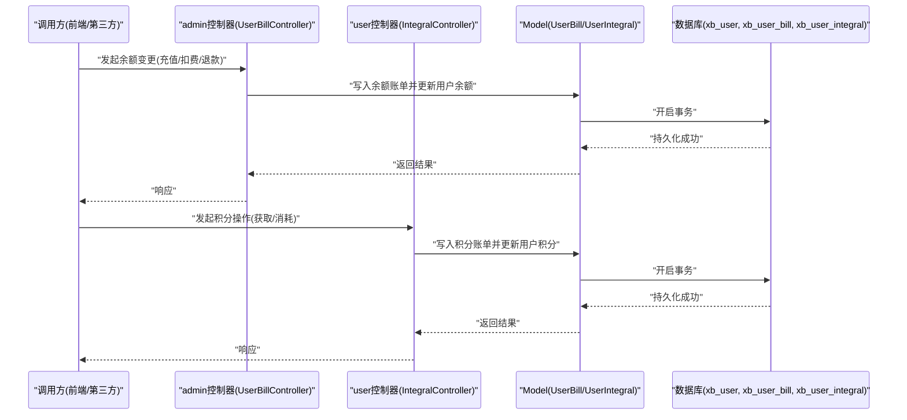
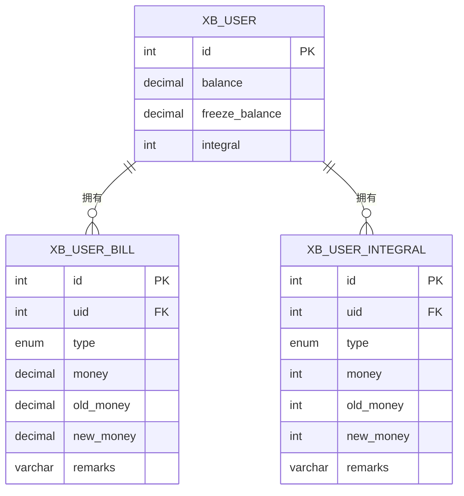
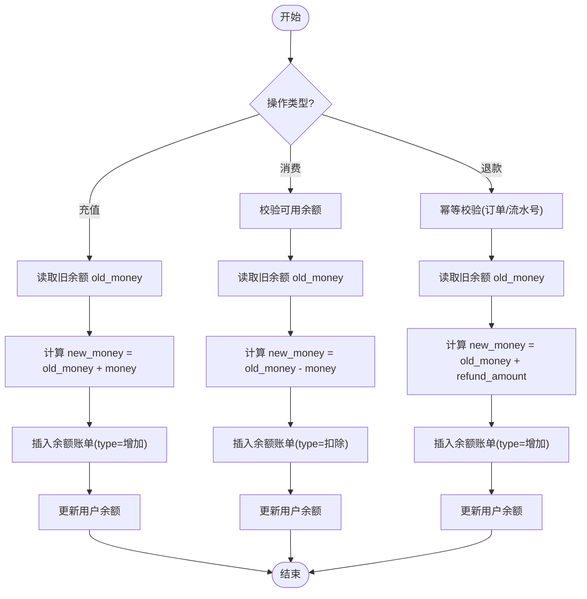
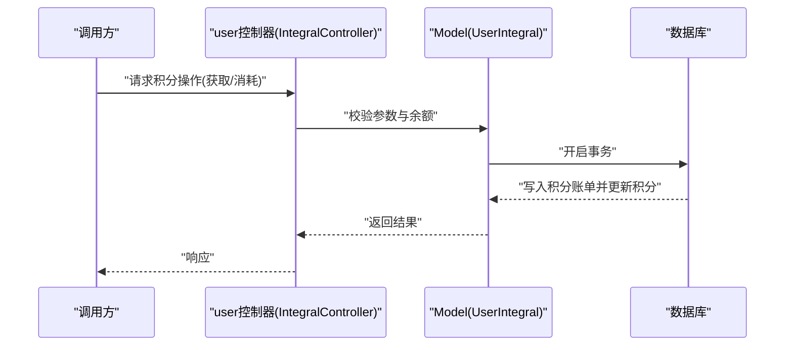
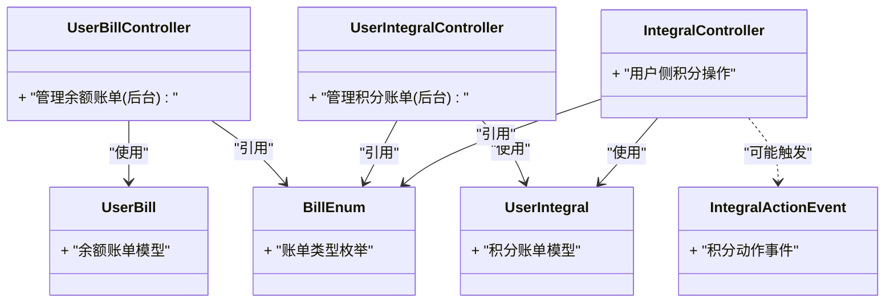
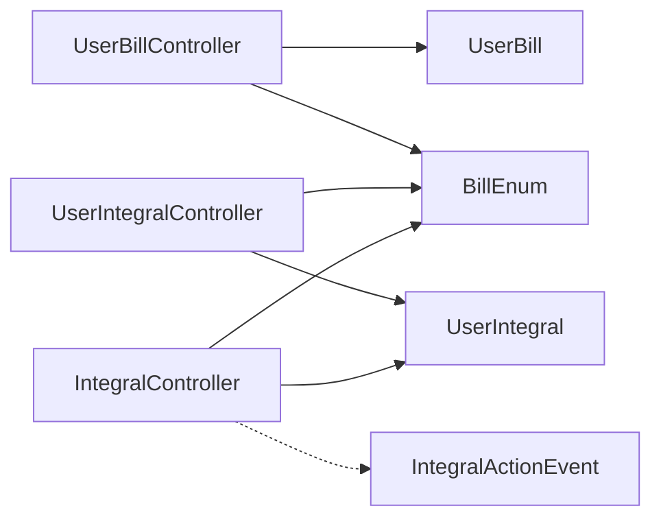

# 用户财务系统

<cite>
**本文引用的文件**   
- [install.sql](file://server/plugin\xbUser\install.sql)
- [UserBillController.php](file://server/plugin\xbUser\app\admin\controller\UserBillController.php)
- [UserIntegralController.php](file://server/plugin\xbUser\app\admin\controller\UserIntegralController.php)
- [UserBill.php](file://server/plugin\xbUser\app\model\UserBill.php)
- [UserIntegral.php](file://server/plugin\xbUser\app\model\UserIntegral.php)
- [IntegralActionEvent.php](file://server/plugin\xbUser\app\events\IntegralActionEvent.php)
- [IntegralController.php](file://server/plugin\xbUser\app\user\controller\IntegralController.php)
- [BillEnum.php](file://server/plugin\xbUser\enum\BillEnum.php)
</cite>

## 目录
1. [简介](#简介)
2. [项目结构](#项目结构)
3. [核心组件](#核心组件)
4. [架构总览](#架构总览)
5. [详细组件分析](#详细组件分析)
6. [依赖关系分析](#依赖关系分析)
7. [性能考虑](#性能考虑)
8. [故障排查指南](#故障排查指南)
9. [结论](#结论)
10. [附录](#附录)

## 简介
本文件面向“用户财务系统”，聚焦余额与积分两大资产体系的数据模型、业务逻辑与一致性保障。文档围绕以下目标展开：
- 深入讲解 xb_user_bill（余额账单）与 xb_user_integral（积分账单）表设计，包括 uid、type、money、new_money、old_money、remarks 等关键字段。
- 阐述余额变动的业务逻辑：充值、消费、退款等场景的处理流程，确保数据一致性与事务完整性。
- 说明积分系统的实现机制：获取、消耗、过期管理等业务规则。
- 提供财务流水查询统计、对账机制与异常处理方案。

## 项目结构
本项目采用插件化架构，用户财务相关能力集中在 xbUser 插件中，包含控制器、模型、枚举与事件等模块；数据库建表脚本位于 install.sql。

图表来源
- [UserBillController.php](file://server/plugin\xbUser\app\admin\controller\UserBillController.php)
- [UserIntegralController.php](file://server/plugin\xbUser\app\admin\controller\UserIntegralController.php)
- [IntegralController.php](file://server/plugin\xbUser\app\user\controller\IntegralController.php)
- [UserBill.php](file://server/plugin\xbUser\app\model\UserBill.php)
- [UserIntegral.php](file://server/plugin\xbUser\app\model\UserIntegral.php)
- [BillEnum.php](file://server/plugin\xbUser\enum\BillEnum.php)
- [IntegralActionEvent.php](file://server/plugin\xbUser\app\events\IntegralActionEvent.php)

章节来源
- [install.sql:24-38](file://server/plugin\xbUser\install.sql#L24-L38)
- [install.sql:57-71](file://server/plugin\xbUser\install.sql#L57-L71)

## 核心组件
- 余额账单表（xb_user_bill）
  - 字段：id、uid、type（操作类型）、money（变动金额）、new_money（变动后余额）、old_money（变动前余额）、remarks（变动理由）、create_at、update_at
  - 用途：记录每次余额变动的明细流水，保证可追溯与对账
- 积分账单表（xb_user_integral）
  - 字段：id、uid、type（操作类型）、money（本次变动）、new_money（变动后）、old_money（变动前）、remarks（变动理由）、create_at、update_at
  - 用途：记录每次积分变动的明细流水
- 用户表（xb_user）
  - 字段：balance（余额）、freeze_balance（冻结余额）、integral（积分）等
  - 用途：承载用户当前资产快照，供快速查询展示
- 枚举（BillEnum）
  - 用于统一 type 取值语义（如增加/扣除等），避免硬编码
- 控制器与模型
  - admin 端控制器负责后台管理（如人工调整、导出、对账）
  - user 端控制器负责用户侧积分查询与使用入口
  - Model 层封装基础读写与校验

章节来源
- [install.sql:24-38](file://server/plugin\xbUser\install.sql#L24-L38)
- [install.sql:57-71](file://server/plugin\xbUser\install.sql#L57-L71)
- [UserBill.php](file://server/plugin\xbUser\app\model\UserBill.php)
- [UserIntegral.php](file://server/plugin\xbUser\app\model\UserIntegral.php)
- [BillEnum.php](file://server/plugin\xbUser\enum\BillEnum.php)

## 架构总览
从请求到落库的端到端路径如下：

图表来源
- [UserBillController.php](file://server/plugin\xbUser\app\admin\controller\UserBillController.php)
- [IntegralController.php](file://server/plugin\xbUser\app\user\controller\IntegralController.php)
- [UserBill.php](file://server/plugin\xbUser\app\model\UserBill.php)
- [UserIntegral.php](file://server/plugin\xbUser\app\model\UserIntegral.php)

## 详细组件分析

### 数据模型与字段规范
- 余额账单（xb_user_bill）
  - uid：用户ID
  - type：操作类型（例如：10 扣除，20 增加）
  - money：变动金额（正数表示增加，负数表示减少，或按业务约定）
  - old_money：变动前余额
  - new_money：变动后余额
  - remarks：变动理由（如“管理员操作”、“AI媒体生成预扣”等）
- 积分账单（xb_user_integral）
  - 字段结构与余额账单类似，但 money/new_money/old_money 为整型
- 用户表（xb_user）
  - balance：余额（decimal）
  - freeze_balance：冻结余额（decimal）
  - integral：积分（int）

图表来源
- [install.sql:24-38](file://server/plugin\xbUser\install.sql#L24-L38)
- [install.sql:57-71](file://server/plugin\xbUser\install.sql#L57-L71)

章节来源
- [install.sql:24-38](file://server/plugin\xbUser\install.sql#L24-L38)
- [install.sql:57-71](file://server/plugin\xbUser\install.sql#L57-L71)

### 余额变动业务流程（充值/消费/退款）
- 通用原则
  - 所有余额变动必须同时完成两件事：写入余额账单（xb_user_bill）与更新用户余额（xb_user.balance）。
  - 必须在同一数据库事务内执行，失败则整体回滚，保证强一致。
  - 通过 BillEnum 统一 type 语义，避免散落的魔法值。
- 充值（type=增加）
  - 读取旧余额 old_money
  - 计算新余额 new_money = old_money + money
  - 插入余额账单记录
  - 更新用户余额
- 消费（type=扣除）
  - 校验可用余额是否充足（必要时考虑冻结余额）
  - 读取旧余额 old_money
  - 计算新余额 new_money = old_money - money
  - 插入余额账单记录
  - 更新用户余额
- 退款（type=增加）
  - 依据原订单/流水号进行幂等校验，防止重复入账
  - 读取旧余额 old_money
  - 计算新余额 new_money = old_money + refund_amount
  - 插入余额账单记录（备注需包含退款原因与关联单号）
  - 更新用户余额

图表来源
- [UserBillController.php](file://server/plugin\xbUser\app\admin\controller\UserBillController.php)
- [UserBill.php](file://server/plugin\xbUser\app\model\UserBill.php)
- [BillEnum.php](file://server/plugin\xbUser\enum\BillEnum.php)

章节来源
- [UserBillController.php](file://server/plugin\xbUser\app\admin\controller\UserBillController.php)
- [UserBill.php](file://server/plugin\xbUser\app\model\UserBill.php)
- [BillEnum.php](file://server/plugin\xbUser\enum\BillEnum.php)

### 积分系统实现机制（获取/消耗/过期）
- 获取积分（type=增加）
  - 触发条件：注册奖励、活动发放、购买返积分等
  - 流程：读取旧积分 old_money → 计算 new_money → 写入积分账单 → 更新用户积分
- 消耗积分（type=扣除）
  - 触发条件：兑换商品、抵扣费用、解锁功能等
  - 流程：校验可用积分 → 读取旧积分 old_money → 计算 new_money → 写入积分账单 → 更新用户积分
- 过期管理
  - 建议引入定时任务扫描即将过期的积分批次，按策略批量扣减并记录积分账单
  - 若存在有效期维度，可在积分账单 remarks 或扩展字段中保留批次信息以便审计

图表来源
- [IntegralController.php](file://server/plugin\xbUser\app\user\controller\IntegralController.php)
- [UserIntegral.php](file://server/plugin\xbUser\app\model\UserIntegral.php)

章节来源
- [IntegralController.php](file://server/plugin\xbUser\app\user\controller\IntegralController.php)
- [UserIntegral.php](file://server/plugin\xbUser\app\model\UserIntegral.php)
- [IntegralActionEvent.php](file://server/plugin\xbUser\app\events\IntegralActionEvent.php)

### 类与职责（面向对象视角）

图表来源
- [UserBillController.php](file://server/plugin\xbUser\app\admin\controller\UserBillController.php)
- [UserIntegralController.php](file://server/plugin\xbUser\app\admin\controller\UserIntegralController.php)
- [IntegralController.php](file://server/plugin\xbUser\app\user\controller\IntegralController.php)
- [UserBill.php](file://server/plugin\xbUser\app\model\UserBill.php)
- [UserIntegral.php](file://server/plugin\xbUser\app\model\UserIntegral.php)
- [BillEnum.php](file://server/plugin\xbUser\enum\BillEnum.php)
- [IntegralActionEvent.php](file://server/plugin\xbUser\app\events\IntegralActionEvent.php)

## 依赖关系分析
- 控制器依赖模型进行数据持久化
- 模型依赖数据库连接与事务能力
- 控制器与枚举耦合，统一 type 语义
- 事件可用于积分操作的异步通知（如发券、推送）

图表来源
- [UserBillController.php](file://server/plugin\xbUser\app\admin\controller\UserBillController.php)
- [UserIntegralController.php](file://server/plugin\xbUser\app\admin\controller\UserIntegralController.php)
- [IntegralController.php](file://server/plugin\xbUser\app\user\controller\IntegralController.php)
- [UserBill.php](file://server/plugin\xbUser\app\model\UserBill.php)
- [UserIntegral.php](file://server/plugin\xbUser\app\model\UserIntegral.php)
- [BillEnum.php](file://server/plugin\xbUser\enum\BillEnum.php)
- [IntegralActionEvent.php](file://server/plugin\xbUser\app\events\IntegralActionEvent.php)

## 性能考虑
- 索引建议
  - xb_user_bill：uid、create_at、type 建立复合索引，提升按用户与时间范围查询效率
  - xb_user_integral：uid、create_at、type 建立复合索引
  - xb_user：balance、integral 作为热点列，可按查询模式评估是否需要覆盖索引
- 事务粒度
  - 将“写账单+更新账户”置于最小事务范围内，缩短锁持有时间
- 并发控制
  - 高并发扣款场景建议使用行级锁或乐观锁（基于版本号/时间戳）避免超扣
- 批处理
  - 积分过期等批量任务应分片执行，避免长事务与大表全量扫描

## 故障排查指南
- 常见问题定位
  - 余额不一致：核对最近一笔余额账单的 old_money/money/new_money 是否与用户表 balance 一致
  - 重复入账：检查幂等键（如订单号/流水号）是否唯一，确认幂等校验逻辑
  - 事务回滚：查看应用日志与数据库错误码，确认是否在写账单与更新账户之间发生异常
- 对账方法
  - 日终对账：以用户表 balance 为基准，汇总当日 xb_user_bill 的增减，验证差额一致
  - 积分对账：同理，以用户表 integral 为基准，汇总当日 xb_user_integral 的增减
- 告警与补偿
  - 对差异超过阈值的用户触发告警
  - 提供手工补偿接口，基于原始流水号进行逆向记账并留痕

章节来源
- [UserBillController.php](file://server/plugin\xbUser\app\admin\controller\UserBillController.php)
- [UserIntegralController.php](file://server/plugin\xbUser\app\admin\controller\UserIntegralController.php)

## 结论
- 通过“账户快照 + 明细流水”的双轨设计，结合事务与幂等校验，可有效保障余额与积分的一致性。
- 使用枚举统一操作类型，配合完善的 remarks 与关联单号，便于审计与对账。
- 建议在索引、事务粒度、并发控制与批处理方面持续优化，以提升系统稳定性与吞吐能力。

## 附录
- 关键表定义参考
  - 余额账单：[install.sql:24-38](file://server/plugin\xbUser\install.sql#L24-L38)
  - 积分账单：[install.sql:57-71](file://server/plugin\xbUser\install.sql#L57-L71)
- 控制器与模型参考
  - 余额账单控制器：[UserBillController.php](file://server/plugin\xbUser\app\admin\controller\UserBillController.php)
  - 积分账单控制器：[UserIntegralController.php](file://server/plugin\xbUser\app\admin\controller\UserIntegralController.php)
  - 用户侧积分控制器：[IntegralController.php](file://server/plugin\xbUser\app\user\controller\IntegralController.php)
  - 余额账单模型：[UserBill.php](file://server/plugin\xbUser\app\model\UserBill.php)
  - 积分账单模型：[UserIntegral.php](file://server/plugin\xbUser\app\model\UserIntegral.php)
  - 账单类型枚举：[BillEnum.php](file://server/plugin\xbUser\enum\BillEnum.php)
  - 积分动作事件：[IntegralActionEvent.php](file://server/plugin\xbUser\app\events\IntegralActionEvent.php)