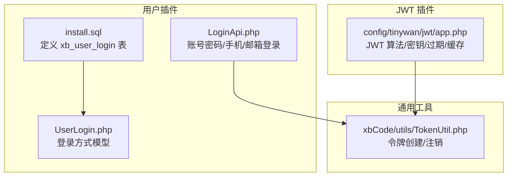
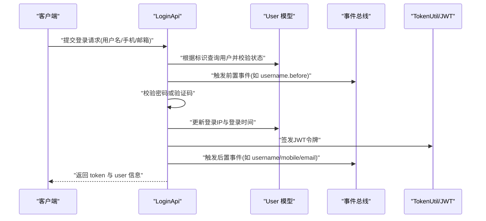
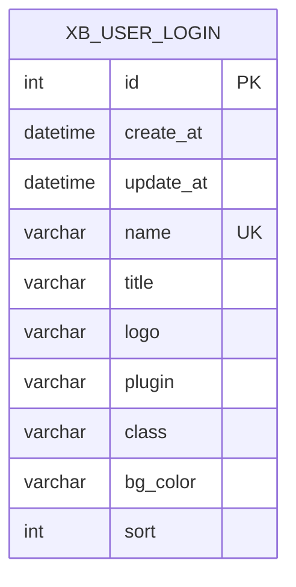
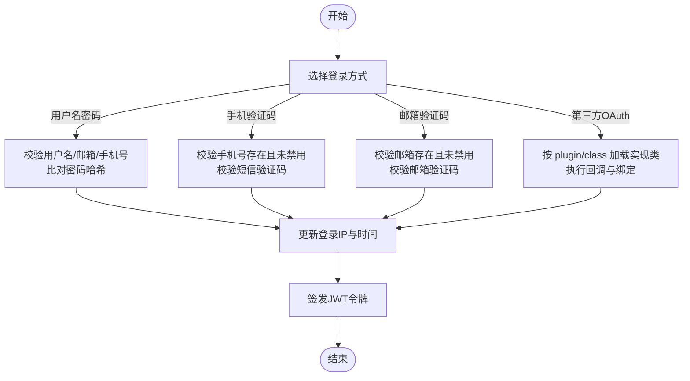
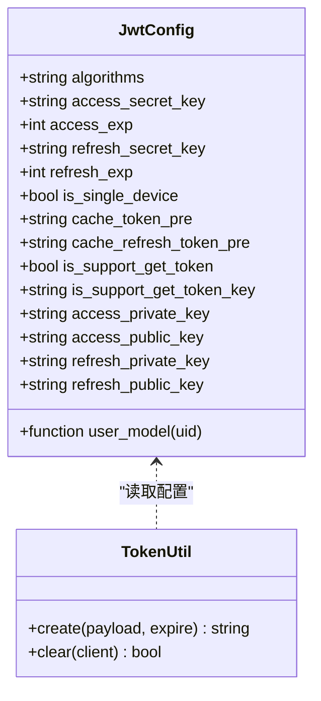
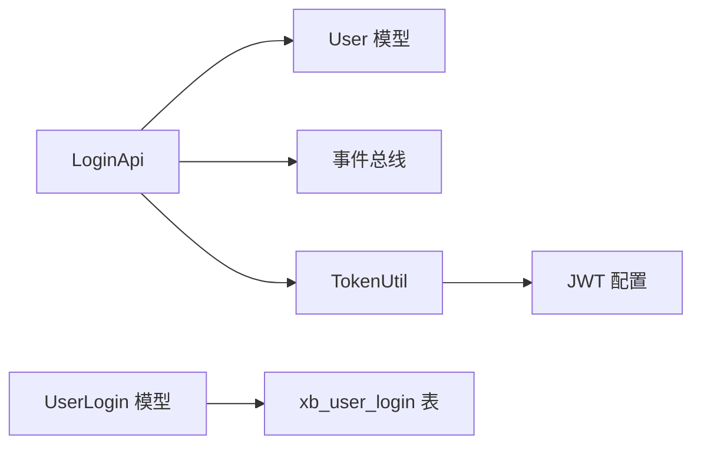

# 登录认证系统

<cite>
**本文引用的文件**   
- [install.sql](file://server/plugin\xbUser\install.sql)
- [LoginApi.php](file://server/plugin\xbUser\api\LoginApi.php)
- [UserLogin.php](file://server/plugin\xbUser\app\model\UserLogin.php)
- [app.php](file://server/config\plugin\tinywan\jwt\app.php)
- [TokenUtil.php](file://server/plugin\xbCode\utils\TokenUtil.php)
</cite>

## 目录
1. [简介](#简介)
2. [项目结构](#项目结构)
3. [核心组件](#核心组件)
4. [架构总览](#架构总览)
5. [详细组件分析](#详细组件分析)
6. [依赖关系分析](#依赖关系分析)
7. [性能考虑](#性能考虑)
8. [故障排查指南](#故障排查指南)
9. [结论](#结论)
10. [附录](#附录)

## 简介
本文件围绕“登录认证系统”展开，重点说明以下方面：
- xb_user_login 登录方式表的设计与字段含义（name、title、logo、plugin、class、bg_color、sort 等）
- 多登录方式的架构设计：用户名密码登录、手机号验证码登录、邮箱验证码登录、第三方 OAuth 登录扩展点
- 登录中间件机制：JWT 令牌生成与验证、会话管理、权限控制与安全防护
- 安全策略：密码加密、验证码防刷、IP 限制与异常登录检测

## 项目结构
登录认证相关代码主要位于用户插件模块与 JWT 配置中：
- 数据模型与安装脚本：xbUser 插件的 install.sql 定义了 xb_user_login 表结构
- 登录接口实现：xbUser 插件 api/LoginApi.php 提供账号密码、手机、邮箱三种登录方式
- 登录方式模型：xbUser 插件 app/model/UserLogin.php 对应 xb_user_login 表
- JWT 配置：tinywan/jwt 插件配置 app.php 定义算法、密钥、过期时间、缓存前缀等
- Token 工具：xbCode 插件 utils/TokenUtil.php 封装令牌创建与注销能力

图表来源
- [install.sql:73-89](file://server/plugin\xbUser\install.sql#L73-L89)
- [LoginApi.php:24-96](file://server/plugin\xbUser\api\LoginApi.php#L24-L96)
- [UserLogin.php:19-21](file://server/plugin\xbUser\app\model\UserLogin.php#L19-L21)
- [app.php:4-23](file://server/config\plugin\tinywan\jwt\app.php#L4-L23)
- [TokenUtil.php:79-85](file://server/plugin\xbCode\utils\TokenUtil.php#L79-L85)

章节来源
- [install.sql:73-89](file://server/plugin\xbUser\install.sql#L73-L89)
- [LoginApi.php:24-96](file://server/plugin\xbUser\api\LoginApi.php#L24-L96)
- [UserLogin.php:19-21](file://server/plugin\xbUser\app\model\UserLogin.php#L19-L21)
- [app.php:4-23](file://server/config\plugin\tinywan\jwt\app.php#L4-L23)
- [TokenUtil.php:79-85](file://server/plugin\xbCode\utils\TokenUtil.php#L79-L85)

## 核心组件
- 登录方式表 xb_user_login：用于集中管理不同登录渠道的配置项，包括平台标识、名称、图标、插件标识、实现类、背景色、排序权重等。该表为前端展示与后端动态加载登录方式提供数据源。
- 登录接口 LoginApi：统一暴露账号密码、手机验证码、邮箱验证码三种登录入口，内部完成参数校验、状态检查、验证码校验、登录信息更新、事件触发与令牌签发。
- 登录方式模型 UserLogin：映射 xb_user_login 表，便于通过 ORM 查询与管理登录方式配置。
- JWT 配置 tinywan/jwt：定义签名算法、访问令牌与刷新令牌的密钥、过期时间、单设备策略、缓存前缀等。
- Token 工具 TokenUtil：封装令牌创建与注销逻辑，供登录流程调用。

章节来源
- [install.sql:73-89](file://server/plugin\xbUser\install.sql#L73-L89)
- [LoginApi.php:24-96](file://server/plugin\xbUser\api\LoginApi.php#L24-L96)
- [UserLogin.php:19-21](file://server/plugin\xbUser\app\model\UserLogin.php#L19-L21)
- [app.php:4-23](file://server/config\plugin\tinywan\jwt\app.php#L4-L23)
- [TokenUtil.php:79-85](file://server/plugin\xbCode\utils\TokenUtil.php#L79-L85)

## 架构总览
整体采用“插件化 + 事件驱动 + JWT 无状态鉴权”的架构：
- 登录方式表驱动前端渲染与后端路由分发
- 登录接口统一处理多种认证方式，并通过事件钩子扩展业务逻辑
- 使用 JWT 作为无状态令牌，结合缓存前缀进行令牌生命周期管理
- 支持短信/邮箱插件接入，形成可扩展的多因子认证体系

图表来源
- [LoginApi.php:56-96](file://server/plugin\xbUser\api\LoginApi.php#L56-L96)
- [LoginApi.php:107-144](file://server/plugin\xbUser\api\LoginApi.php#L107-L144)
- [LoginApi.php:155-193](file://server/plugin\xbUser\api\LoginApi.php#L155-L193)
- [TokenUtil.php:79-85](file://server/plugin\xbCode\utils\TokenUtil.php#L79-L85)

## 详细组件分析

### 登录方式表 xb_user_login 设计
- name：平台标识，唯一键，用于区分不同登录渠道（如 web、wechat、weapp、douyin、app 等）
- title：平台名称，用于前端展示
- logo：平台图标，用于前端展示
- plugin：插件标识，关联具体登录实现所在的插件包
- class：实现类的完整命名空间，用于动态加载登录处理器
- bg_color：背景颜色，用于前端主题渲染
- sort：排序权重，决定前端展示顺序

图表来源
- [install.sql:73-89](file://server/plugin\xbUser\install.sql#L73-L89)

章节来源
- [install.sql:73-89](file://server/plugin\xbUser\install.sql#L73-L89)

### 多登录方式架构设计
- 用户名密码登录：支持以用户名、邮箱或手机号作为登录标识，校验密码后签发令牌
- 手机号验证码登录：校验短信验证码通过后签发令牌
- 邮箱验证码登录：校验邮箱验证码通过后签发令牌
- 第三方 OAuth 登录扩展点：通过 xb_user_login 表的 plugin/class 字段指向第三方登录实现类，配合事件机制在登录前后注入业务逻辑

图表来源
- [LoginApi.php:56-96](file://server/plugin\xbUser\api\LoginApi.php#L56-L96)
- [LoginApi.php:107-144](file://server/plugin\xbUser\api\LoginApi.php#L107-L144)
- [LoginApi.php:155-193](file://server/plugin\xbUser\api\LoginApi.php#L155-L193)
- [install.sql:73-89](file://server/plugin\xbUser\install.sql#L73-L89)

章节来源
- [LoginApi.php:56-96](file://server/plugin\xbUser\api\LoginApi.php#L56-L96)
- [LoginApi.php:107-144](file://server/plugin\xbUser\api\LoginApi.php#L107-L144)
- [LoginApi.php:155-193](file://server/plugin\xbUser\api\LoginApi.php#L155-L193)
- [install.sql:73-89](file://server/plugin\xbUser\install.sql#L73-L89)

### 登录中间件机制（JWT 令牌生成与验证、会话管理、权限控制与安全防护）
- 令牌生成：登录成功后通过 TokenUtil 调用底层 JWT 库签发访问令牌，可配置过期时间与是否启用刷新令牌
- 令牌验证：由 JWT 插件中间件负责解析与校验，支持从请求头获取令牌键名
- 会话管理：通过缓存前缀对令牌进行缓存与 TTL 管理，支持单设备策略（可选）
- 权限控制：可在中间件层基于用户身份与角色进行资源访问控制
- 安全防护：支持算法选择、私钥/公钥配置、leeway 容差、iss 签发者声明等

图表来源
- [app.php:4-36](file://server/config\plugin\tinywan\jwt\app.php#L4-L36)
- [TokenUtil.php:79-85](file://server/plugin\xbCode\utils\TokenUtil.php#L79-L85)

章节来源
- [app.php:4-36](file://server/config\plugin\tinywan\jwt\app.php#L4-L36)
- [TokenUtil.php:79-85](file://server/plugin\xbCode\utils\TokenUtil.php#L79-L85)

### 登录安全策略
- 密码加密：登录时比对密码哈希值，避免明文存储与传输
- 验证码防刷：短信/邮箱验证码需经插件校验，建议结合频率限制与图形验证码
- IP 限制：每次登录成功记录登录 IP，可用于风控与异常检测
- 异常登录检测：结合登录时间、IP 变化、失败次数等指标进行风险识别

章节来源
- [LoginApi.php:56-96](file://server/plugin\xbUser\api\LoginApi.php#L56-L96)
- [LoginApi.php:107-144](file://server/plugin\xbUser\api\LoginApi.php#L107-L144)
- [LoginApi.php:155-193](file://server/plugin\xbUser\api\LoginApi.php#L155-L193)

## 依赖关系分析
- LoginApi 依赖：
  - 用户模型：用于查询用户信息与更新登录信息
  - 事件总线：用于在登录前后触发扩展事件
  - TokenUtil：用于签发与注销令牌
- TokenUtil 依赖：
  - JWT 插件配置：读取算法、密钥、过期时间、缓存前缀等
- 登录方式表：
  - 为前端展示与后端动态加载登录实现提供数据支撑

图表来源
- [LoginApi.php:56-96](file://server/plugin\xbUser\api\LoginApi.php#L56-L96)
- [UserLogin.php:19-21](file://server/plugin\xbUser\app\model\UserLogin.php#L19-L21)
- [app.php:4-23](file://server/config\plugin\tinywan\jwt\app.php#L4-L23)
- [TokenUtil.php:79-85](file://server/plugin\xbCode\utils\TokenUtil.php#L79-L85)

章节来源
- [LoginApi.php:56-96](file://server/plugin\xbUser\api\LoginApi.php#L56-L96)
- [UserLogin.php:19-21](file://server/plugin\xbUser\app\model\UserLogin.php#L19-L21)
- [app.php:4-23](file://server/config\plugin\tinywan\jwt\app.php#L4-L23)
- [TokenUtil.php:79-85](file://server/plugin\xbCode\utils\TokenUtil.php#L79-L85)

## 性能考虑
- 减少数据库查询：对用户查询条件建立索引（如 username、mobile、email），提升登录响应速度
- 令牌缓存：利用 JWT 插件的缓存前缀与 TTL 配置，降低重复校验开销
- 事件异步化：将非关键路径的事件处理改为异步队列，缩短主流程耗时
- 静态资源优化：登录方式表中的 logo/bg_color 等前端展示字段应配合 CDN 与缓存策略

[本节为通用指导，不直接分析具体文件]

## 故障排查指南
- 登录失败提示“账号尚未注册/手机号尚未注册/邮箱尚未注册”：确认用户是否存在且状态正常
- 登录失败提示“账号已禁用”：检查用户状态字段
- 登录失败提示“登录密码错误”：确认密码哈希比对逻辑与输入是否正确
- 登录失败提示“请先安装短信/邮箱插件”：确保相应插件已安装并正确配置
- 登录失败提示“短信/邮箱验证码错误”：核对验证码场景名称与有效期
- 令牌相关问题：检查 JWT 配置中的算法、密钥、过期时间与缓存前缀；必要时使用注销方法清理旧令牌

章节来源
- [LoginApi.php:56-96](file://server/plugin\xbUser\api\LoginApi.php#L56-L96)
- [LoginApi.php:107-144](file://server/plugin\xbUser\api\LoginApi.php#L107-L144)
- [LoginApi.php:155-193](file://server/plugin\xbUser\api\LoginApi.php#L155-L193)
- [TokenUtil.php:79-85](file://server/plugin\xbCode\utils\TokenUtil.php#L79-L85)

## 结论
本登录认证系统通过 xb_user_login 表实现登录方式的集中管理与动态扩展，结合 LoginApi 的统一接口与 JWT 的无状态鉴权，形成了高内聚、低耦合、易扩展的认证架构。建议在现有基础上进一步完善验证码防刷、IP 限制与异常登录检测等安全策略，以提升系统的健壮性与安全性。

[本节为总结性内容，不直接分析具体文件]

## 附录
- 登录方式表字段说明
  - name：平台标识（唯一）
  - title：平台名称
  - logo：平台图标
  - plugin：插件标识
  - class：实现类完整命名空间
  - bg_color：背景颜色
  - sort：排序权重

章节来源
- [install.sql:73-89](file://server/plugin\xbUser\install.sql#L73-L89)