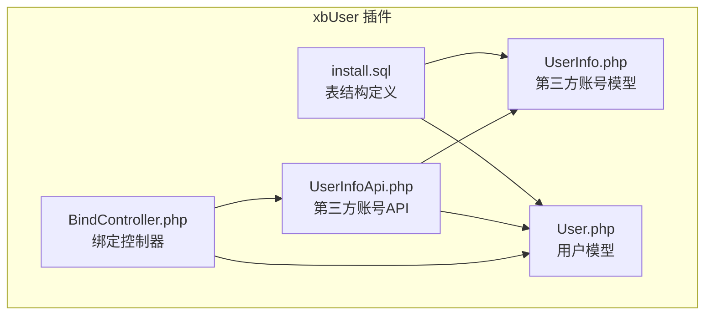
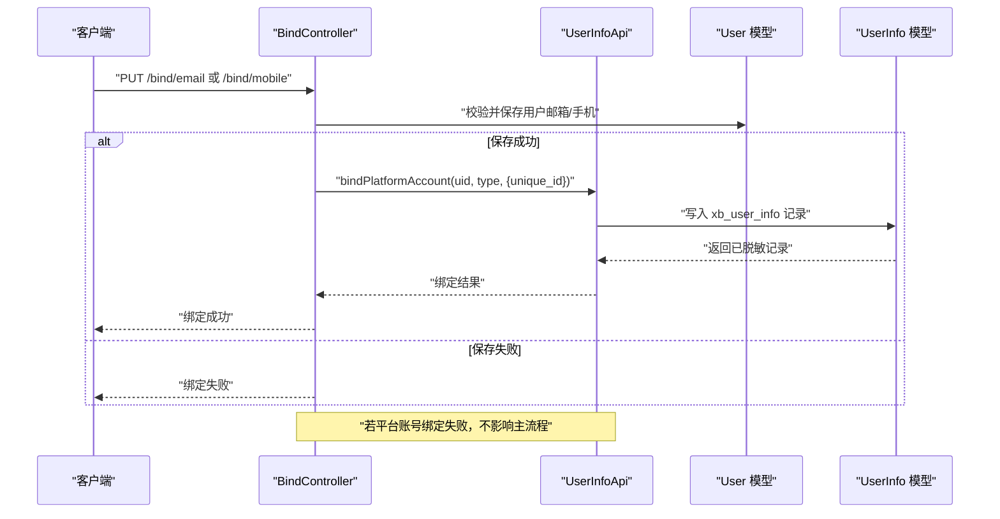
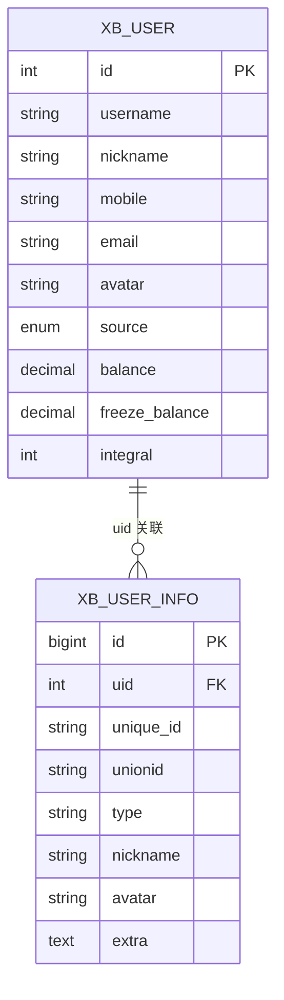
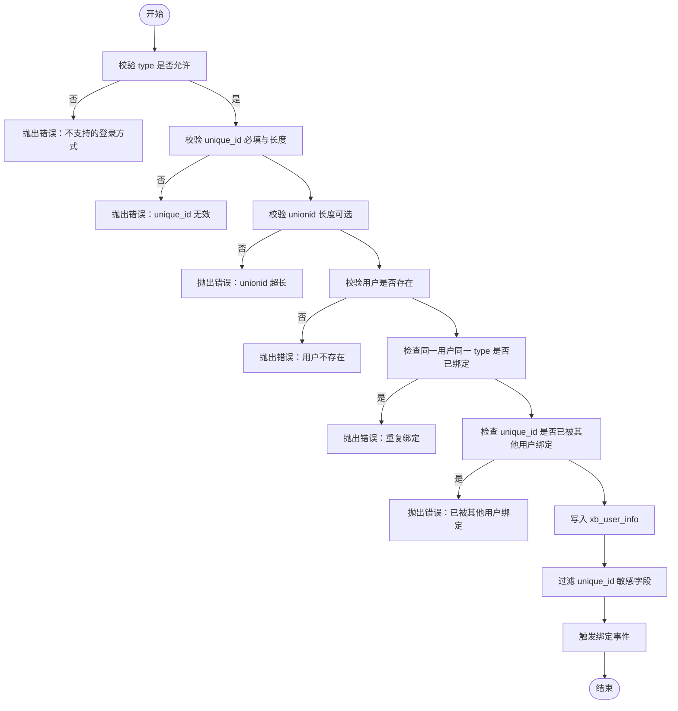
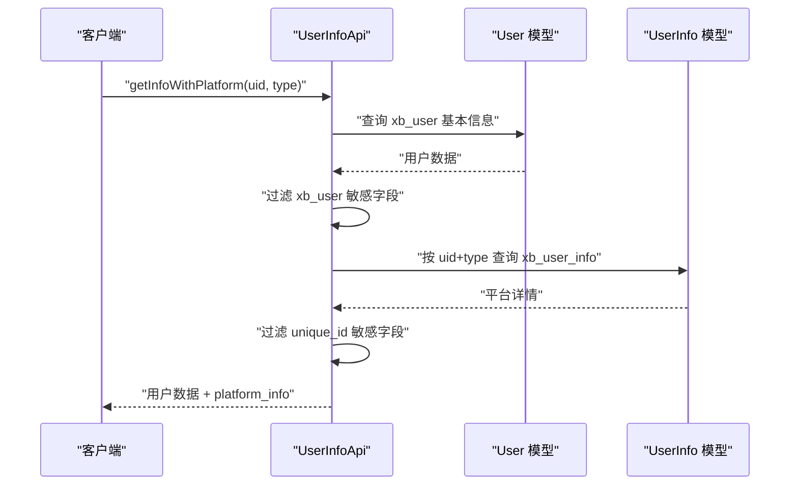
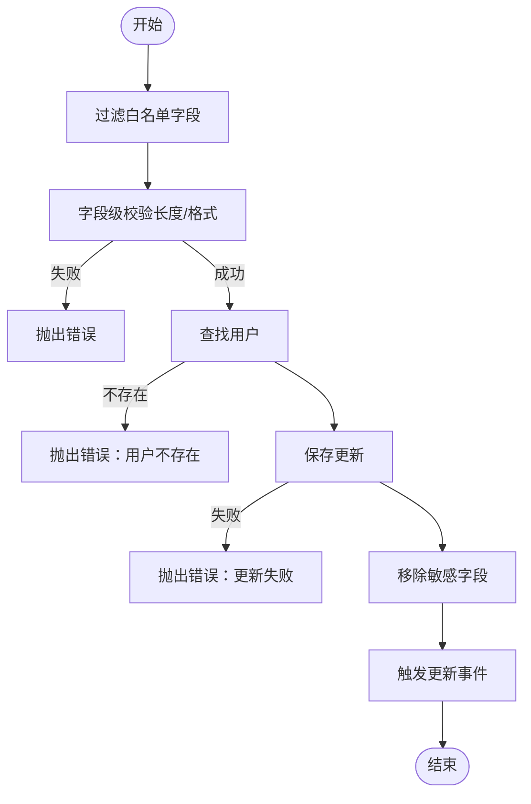
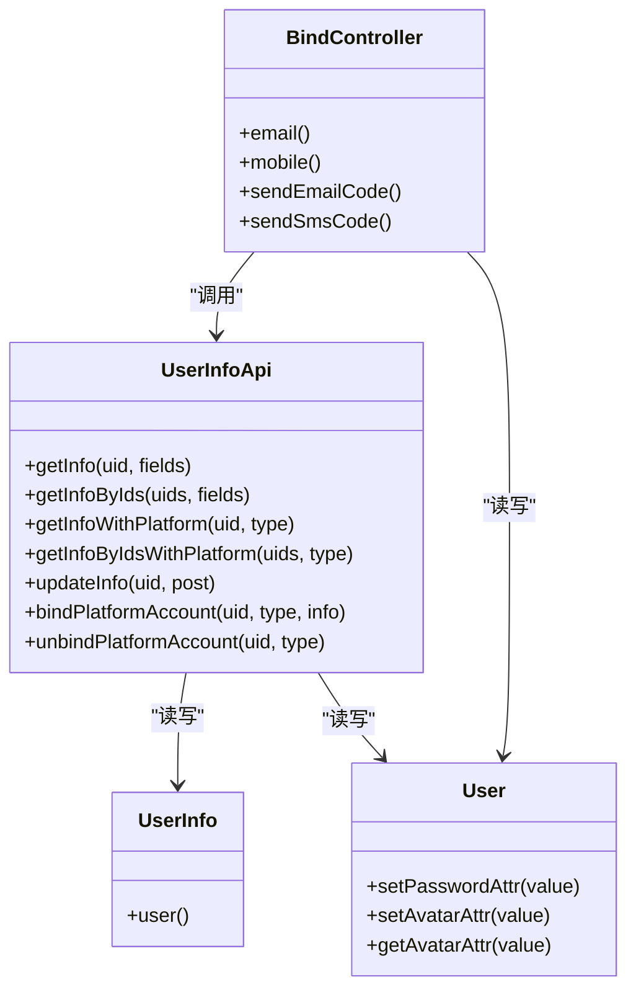

# 账户管理系统

<cite>
**本文引用的文件**   
- [install.sql](file://server/plugin\xbUser\install.sql)
- [UserInfoApi.php](file://server/plugin\xbUser\api\UserInfoApi.php)
- [BindController.php](file://server/plugin\xbUser\app\user\controller\BindController.php)
- [UserInfo.php](file://server/plugin\xbUser\app\model\UserInfo.php)
- [User.php](file://server/plugin\xbUser\app\model\User.php)
</cite>

## 目录
1. [简介](#简介)
2. [项目结构](#项目结构)
3. [核心组件](#核心组件)
4. [架构总览](#架构总览)
5. [详细组件分析](#详细组件分析)
6. [依赖关系分析](#依赖关系分析)
7. [性能考虑](#性能考虑)
8. [故障排查指南](#故障排查指南)
9. [结论](#结论)
10. [附录](#附录)

## 简介
本文件围绕第三方账号关联表 xb_user_info 的设计与使用，系统阐述用户ID(uid)、唯一标识(unique_id)、同主体唯一标识(unionid)、账号类型(type)、昵称(nickname)、头像(avatar)、扩展数据(extra)等字段的作用与约束；并详细说明微信、抖音、APP等多端账号的统一绑定机制，以及用户信息CRUD、数据同步策略与异常处理方案。同时给出解绑、信息更新与隐私保护的具体实现思路。

## 项目结构
本项目采用插件化架构，用户与第三方账号相关能力集中在 xbUser 插件中：
- 数据库定义位于安装脚本 install.sql，包含用户主表 xb_user 与第三方账号表 xb_user_info 的建表语句。
- API 层提供第三方账号的查询、绑定、解绑与用户信息更新接口（UserInfoApi）。
- 控制器层提供邮箱/手机绑定流程（BindController），并在成功后同步写入 xb_user_info。
- 模型层提供 UserInfo 与 User 的数据访问与关系映射。

图表来源
- [install.sql:40-55](file://server/plugin\xbUser\install.sql#L40-L55)
- [UserInfoApi.php:1-477](file://server/plugin\xbUser\api\UserInfoApi.php#L1-L477)
- [BindController.php:1-300](file://server/plugin\xbUser\app\user\controller\BindController.php#L1-L300)
- [UserInfo.php:1-24](file://server/plugin\xbUser\app\model\UserInfo.php#L1-L24)
- [User.php:1-66](file://server/plugin\xbUser\app\model\User.php#L1-L66)

章节来源
- [install.sql:40-55](file://server/plugin\xbUser\install.sql#L40-L55)
- [UserInfoApi.php:1-477](file://server/plugin\xbUser\api\UserInfoApi.php#L1-L477)
- [BindController.php:1-300](file://server/plugin\xbUser\app\user\controller\BindController.php#L1-L300)
- [UserInfo.php:1-24](file://server/plugin\xbUser\app\model\UserInfo.php#L1-L24)
- [User.php:1-66](file://server/plugin\xbUser\app\model\User.php#L1-L66)

## 核心组件
- 第三方账号表 xb_user_info
  - uid：用户ID，关联 xb_user.id
  - unique_id：第三方平台用户唯一标识（如 openid、手机号、邮箱）
  - unionid：同主体下唯一标识（用于同一开放平台多应用统一）
  - type：账号类型（如 wechat、weapp、douyin、email、mobile、qq、app 等）
  - nickname：昵称
  - avatar：头像地址
  - extra：扩展数据（JSON文本）
- 用户表 xb_user
  - 基础信息与资产字段，供对外展示与业务使用
- API 层 UserInfoApi
  - 提供获取用户信息、批量获取、附带平台详情、更新非敏感信息、绑定/解绑第三方账号等方法
- 控制器 BindController
  - 提供邮箱/手机绑定流程，校验验证码后更新用户信息，并同步写入 xb_user_info
- 模型层
  - UserInfo 与 User 建立一对一关系，便于关联查询

章节来源
- [install.sql:40-55](file://server/plugin\xbUser\install.sql#L40-L55)
- [UserInfoApi.php:102-270](file://server/plugin\xbUser\api\UserInfoApi.php#L102-L270)
- [BindController.php:34-132](file://server/plugin\xbUser\app\user\controller\BindController.php#L34-L132)
- [UserInfo.php:11-23](file://server/plugin\xbUser\app\model\UserInfo.php#L11-L23)
- [User.php:21-66](file://server/plugin\xbUser\app\model\User.php#L21-L66)

## 架构总览
下图展示了“用户基本信息 + 第三方平台详情”的读取流程，以及“邮箱/手机绑定 -> 同步写入 xb_user_info”的写入流程。

图表来源
- [BindController.php:75-92](file://server/plugin\xbUser\app\user\controller\BindController.php#L75-L92)
- [BindController.php:212-228](file://server/plugin\xbUser\app\user\controller\BindController.php#L212-L228)
- [UserInfoApi.php:302-365](file://server/plugin\xbUser\api\UserInfoApi.php#L302-L365)
- [UserInfo.php:11-23](file://server/plugin\xbUser\app\model\UserInfo.php#L11-L23)
- [User.php:21-66](file://server/plugin\xbUser\app\model\User.php#L21-L66)

## 详细组件分析

### 数据模型与字段设计
- xb_user_info 字段说明
  - uid：外键指向 xb_user.id，表示该第三方账号归属的用户
  - unique_id：第三方平台的唯一标识，作为鉴权凭证，严禁对外暴露
  - unionid：同主体下的唯一标识，用于跨应用/小程序/公众号等场景统一用户
  - type：登录方式标识，如 wechat、weapp、douyin、email、mobile、qq、app 等
  - nickname/avatar：从第三方拉取的用户展示信息
  - extra：扩展数据（JSON），可存放平台返回的其他必要信息
- 约束与长度
  - unique_id、unionid 最大长度为 255 字符
  - nickname、avatar 为字符串字段，需遵循各自长度限制
  - extra 为文本字段，存储 JSON 字符串

图表来源
- [install.sql:4-22](file://server/plugin\xbUser\install.sql#L4-L22)
- [install.sql:40-55](file://server/plugin\xbUser\install.sql#L40-L55)

章节来源
- [install.sql:40-55](file://server/plugin\xbUser\install.sql#L40-L55)

### 第三方账号绑定机制（微信/抖音/APP/邮箱/手机）
- 统一入口
  - 通过 UserInfoApi::bindPlatformAccount 完成绑定，参数包括 uid、type、info（含 unique_id、unionid、nickname、avatar、extra）
- 关键校验
  - type 必须在允许的登录方式列表中
  - unique_id 必填且长度不超过 255
  - unionid 可选，长度不超过 255
  - 同一用户同一 type 仅允许绑定一次
  - 同一 type 的 unique_id 不允许被其他用户重复绑定
- 写入与事件
  - 写入 xb_user_info 成功后，过滤 unique_id 再返回
  - 触发事件 xbUser.UserInfo.bind，便于审计与联动
- 邮箱/手机绑定联动
  - BindController 在成功更新用户邮箱/手机后，调用 bindPlatformAccount 将对应 unique_id 写入 xb_user_info
  - 若平台账号绑定失败，不阻断主流程，确保用户体验

图表来源
- [UserInfoApi.php:302-365](file://server/plugin\xbUser\api\UserInfoApi.php#L302-L365)
- [BindController.php:83-92](file://server/plugin\xbUser\app\user\controller\BindController.php#L83-L92)
- [BindController.php:219-228](file://server/plugin\xbUser\app\user\controller\BindController.php#L219-L228)

章节来源
- [UserInfoApi.php:302-365](file://server/plugin\xbUser\api\UserInfoApi.php#L302-L365)
- [BindController.php:83-92](file://server/plugin\xbUser\app\user\controller\BindController.php#L83-L92)
- [BindController.php:219-228](file://server/plugin\xbUser\app\user\controller\BindController.php#L219-L228)

### 用户信息查询与脱敏
- 单条/批量获取用户基本信息
  - getInfo/getInfoByIds：仅查询 xb_user，自动过滤 password、login_ip、login_time 等敏感字段
- 附带平台详情
  - getInfoWithPlatform/getInfoByIdsWithPlatform：合并 xb_user 与 xb_user_info，platform_info 中过滤 unique_id
- 输出字段控制
  - 支持按 fields 指定输出字段，进一步减少不必要的数据传输

图表来源
- [UserInfoApi.php:159-186](file://server/plugin\xbUser\api\UserInfoApi.php#L159-L186)
- [UserInfoApi.php:198-226](file://server/plugin\xbUser\api\UserInfoApi.php#L198-L226)
- [UserInfoApi.php:102-119](file://server/plugin\xbUser\api\UserInfoApi.php#L102-L119)
- [UserInfoApi.php:131-146](file://server/plugin\xbUser\api\UserInfoApi.php#L131-L146)

章节来源
- [UserInfoApi.php:102-119](file://server/plugin\xbUser\api\UserInfoApi.php#L102-L119)
- [UserInfoApi.php:131-146](file://server/plugin\xbUser\api\UserInfoApi.php#L131-L146)
- [UserInfoApi.php:159-186](file://server/plugin\xbUser\api\UserInfoApi.php#L159-L186)
- [UserInfoApi.php:198-226](file://server/plugin\xbUser\api\UserInfoApi.php#L198-L226)

### 用户信息更新与校验
- 允许更新的字段
  - nickname、avatar、mobile、email（白名单控制）
- 字段校验规则
  - 昵称：非空且长度不超过 20
  - 手机号：格式校验与长度限制
  - 邮箱：格式校验与长度限制
  - 头像：字符串且长度限制
- 更新后行为
  - 保存成功后触发事件 xbUser.UserInfo.update，便于缓存失效或审计

图表来源
- [UserInfoApi.php:239-270](file://server/plugin\xbUser\api\UserInfoApi.php#L239-L270)
- [UserInfoApi.php:430-475](file://server/plugin\xbUser\api\UserInfoApi.php#L430-L475)

章节来源
- [UserInfoApi.php:239-270](file://server/plugin\xbUser\api\UserInfoApi.php#L239-L270)
- [UserInfoApi.php:430-475](file://server/plugin\xbUser\api\UserInfoApi.php#L430-L475)

### 第三方账号解绑
- 解绑流程
  - unbindPlatformAccount：校验 type 合法性，定位并删除 xb_user_info 记录
  - 触发事件 xbUser.UserInfo.unbind，便于审计与联动
- 注意事项
  - 未绑定时抛出错误
  - 解绑操作不可逆，建议二次确认

章节来源
- [UserInfoApi.php:377-401](file://server/plugin\xbUser\api\UserInfoApi.php#L377-L401)

### 数据同步策略
- 邮箱/手机绑定同步
  - BindController 在更新用户主信息成功后，调用 UserInfoApi::bindPlatformAccount 将 unique_id 写入 xb_user_info
  - 若平台账号绑定失败，捕获异常且不阻断主流程，保证用户体验
- 平台信息更新
  - 当第三方平台返回新的 nickname/avatar/extra 时，可通过 updateInfo 更新用户主信息，或通过扩展逻辑更新 xb_user_info 中的对应字段（例如在回调处理器中根据 type 与 unique_id 定位记录进行更新）

章节来源
- [BindController.php:83-92](file://server/plugin\xbUser\app\user\controller\BindController.php#L83-L92)
- [BindController.php:219-228](file://server/plugin\xbUser\app\user\controller\BindController.php#L219-L228)
- [UserInfoApi.php:302-365](file://server/plugin\xbUser\api\UserInfoApi.php#L302-L365)

### 异常处理机制
- 参数校验异常
  - uid 非法、type 为空或不支持、unique_id/unionid 长度超限、重复绑定、已被其他用户绑定等
- 业务异常
  - 用户不存在、绑定/解绑失败、更新失败等
- 容错策略
  - 邮箱/手机绑定过程中，若平台账号绑定失败，捕获异常并继续返回成功，避免影响主流程

章节来源
- [UserInfoApi.php:302-365](file://server/plugin\xbUser\api\UserInfoApi.php#L302-L365)
- [UserInfoApi.php:377-401](file://server/plugin\xbUser\api\UserInfoApi.php#L377-L401)
- [BindController.php:83-92](file://server/plugin\xbUser\app\user\controller\BindController.php#L83-L92)
- [BindController.php:219-228](file://server/plugin\xbUser\app\user\controller\BindController.php#L219-L228)

### 用户隐私保护
- 敏感字段过滤
  - xb_user：password、login_ip、login_time 不在对外响应中返回
  - xb_user_info：unique_id 属于鉴权凭证，禁止对外暴露
- 字段白名单
  - 用户信息更新仅允许修改白名单字段，防止越权篡改
- 脱敏显示
  - 前端展示原邮箱/手机时进行脱敏处理（由控制器负责）

章节来源
- [UserInfoApi.php:33-48](file://server/plugin\xbUser\api\UserInfoApi.php#L33-L48)
- [UserInfoApi.php:239-270](file://server/plugin\xbUser\api\UserInfoApi.php#L239-L270)
- [BindController.php:98-104](file://server/plugin\xbUser\app\user\controller\BindController.php#L98-L104)
- [BindController.php:233-240](file://server/plugin\xbUser\app\user\controller\BindController.php#L233-L240)

## 依赖关系分析
- 模块耦合
  - BindController 依赖 UserInfoApi 与 User 模型
  - UserInfoApi 依赖 UserInfo 与 User 模型，并可能依赖登录方式枚举/列表接口以校验 type
- 外部依赖
  - 邮箱/短信服务插件（xbEmail、xbSms）在绑定流程中被调用
- 事件驱动
  - 绑定/解绑/更新均触发事件，便于后续扩展（如审计日志、缓存失效、风控）

图表来源
- [BindController.php:1-300](file://server/plugin\xbUser\app\user\controller\BindController.php#L1-L300)
- [UserInfoApi.php:1-477](file://server/plugin\xbUser\api\UserInfoApi.php#L1-L477)
- [User.php:1-66](file://server/plugin\xbUser\app\model\User.php#L1-L66)
- [UserInfo.php:1-24](file://server/plugin\xbUser\app\model\UserInfo.php#L1-L24)

章节来源
- [BindController.php:1-300](file://server/plugin\xbUser\app\user\controller\BindController.php#L1-L300)
- [UserInfoApi.php:1-477](file://server/plugin\xbUser\api\UserInfoApi.php#L1-L477)
- [User.php:1-66](file://server/plugin\xbUser\app\model\User.php#L1-L66)
- [UserInfo.php:1-24](file://server/plugin\xbUser\app\model\UserInfo.php#L1-L24)

## 性能考虑
- 批量查询优化
  - 使用 getInfoByIds/getInfoByIdsWithPlatform 批量获取用户及平台信息，减少往返次数
- 索引建议
  - 建议在 xb_user_info 上对 (uid, type) 建立联合索引，提升按用户与类型查询的性能
- 脱敏与字段裁剪
  - 按需指定 fields 输出，减少网络传输与序列化开销
- 异步扩展
  - 利用事件机制将审计、缓存失效等非关键路径异步化，降低主流程延迟

[本节为通用指导，无需源码引用]

## 故障排查指南
- 常见错误
  - 用户ID参数错误、登录方式标识为空或不支持、unique_id/unionid 长度超限、重复绑定、已被其他用户绑定、用户不存在、绑定/解绑/更新失败
- 排查步骤
  - 检查请求参数是否符合白名单与长度限制
  - 确认 type 是否在允许的登录方式列表中
  - 核对 unique_id 是否已被其他用户绑定
  - 查看事件日志，确认绑定/解绑/更新是否触发
- 容错观察
  - 邮箱/手机绑定成功后，若平台账号绑定失败，应记录异常但不影响主流程

章节来源
- [UserInfoApi.php:302-365](file://server/plugin\xbUser\api\UserInfoApi.php#L302-L365)
- [UserInfoApi.php:377-401](file://server/plugin\xbUser\api\UserInfoApi.php#L377-L401)
- [BindController.php:83-92](file://server/plugin\xbUser\app\user\controller\BindController.php#L83-L92)
- [BindController.php:219-228](file://server/plugin\xbUser\app\user\controller\BindController.php#L219-L228)

## 结论
通过 xb_user_info 表与 UserInfoApi 的协同，系统实现了多端第三方账号的统一管理与安全绑定。严格的字段白名单、敏感字段过滤与事件驱动机制，保障了数据安全与可扩展性。结合合理的索引设计与批量查询策略，可在高并发场景下保持良好性能。

[本节为总结，无需源码引用]

## 附录
- 字段命名约定
  - uid：用户ID
  - unique_id：第三方平台唯一标识
  - unionid：同主体唯一标识
  - type：账号类型
  - nickname/avatar：展示信息
  - extra：扩展数据（JSON）
- 典型 type 值
  - wechat、weapp、douyin、email、mobile、qq、app 等（以实际登录方式配置为准）

[本节为概念性补充，无需源码引用]