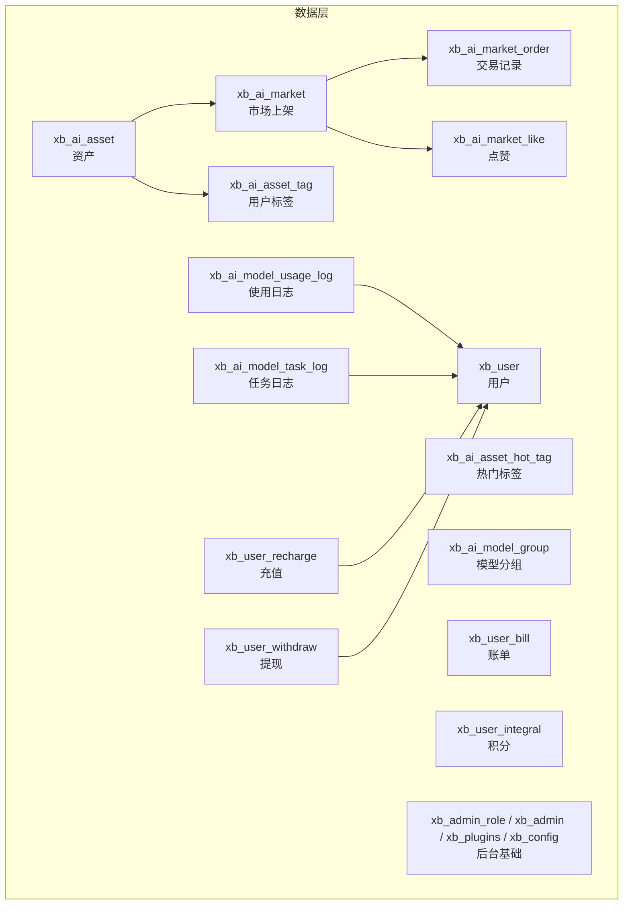
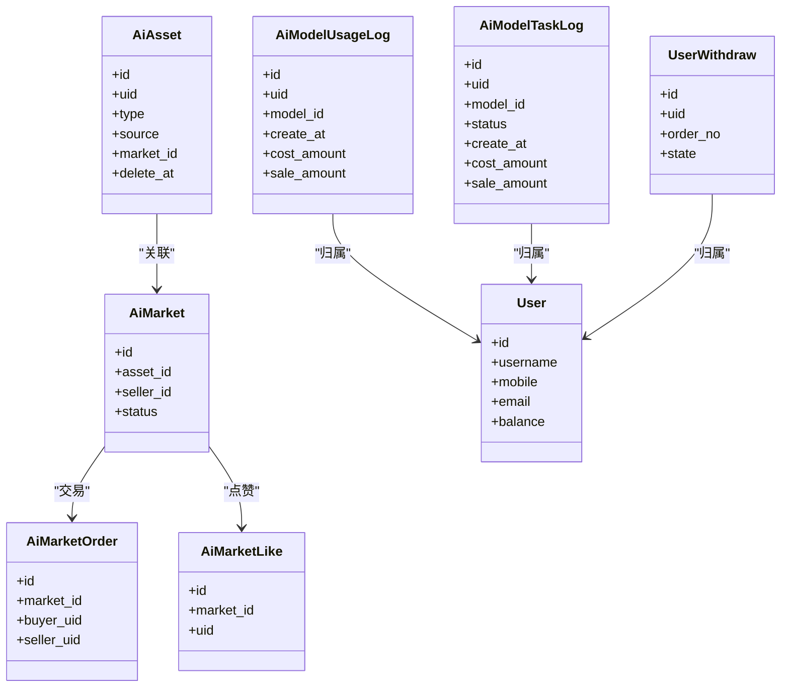
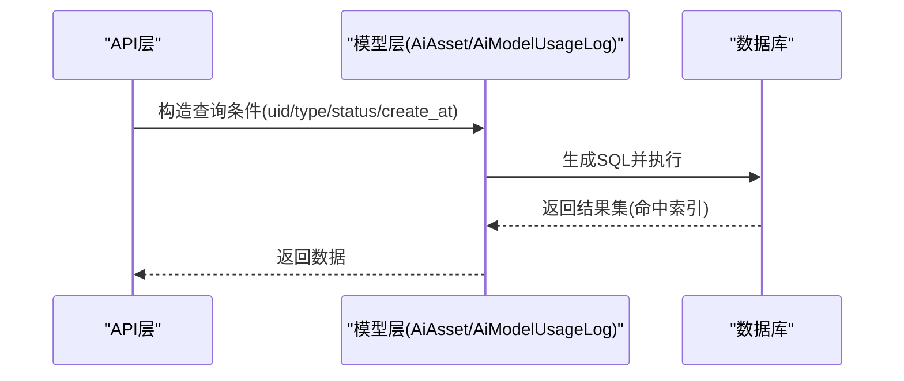

# 索引优化策略

<cite>
**本文引用的文件**   
- [server/plugin/xbAiAsset/install.sql](file://server/plugin/xbAiAsset/install.sql)
- [server/plugin/xbAiModelAgent/install.sql](file://server/plugin/xbAiModelAgent/install.sql)
- [server/plugin/xbAiModelAgent/update.sql](file://server/plugin/xbAiModelAgent/update.sql)
- [server/plugin/xbUser/install.sql](file://server/plugin/xbUser/install.sql)
- [server/plugin/xbCode/install.sql](file://server/plugin/xbCode/install.sql)
- [server/plugin/xbAiAsset/app/model/AiAsset.php](file://server/plugin/xbAiAsset/app/model/AiAsset.php)
- [server/plugin/xbAiModelAgent/app/model/AiModelUsageLog.php](file://server/plugin/xbAiModelAgent/app/model/AiModelUsageLog.php)
- [server/plugin/xbUser/app/model/User.php](file://server/plugin/xbUser/app/model/User.php)
</cite>

## 目录
1. [引言](#引言)
2. [项目结构](#项目结构)
3. [核心组件](#核心组件)
4. [架构总览](#架构总览)
5. [详细组件分析](#详细组件分析)
6. [依赖分析](#依赖分析)
7. [性能考虑](#性能考虑)
8. [故障排查指南](#故障排查指南)
9. [结论](#结论)
10. [附录](#附录)

## 引言
本文件面向数据库索引设计与优化，结合仓库中现有插件的表结构与查询模式，给出：
- 索引设计原则与复合索引策略
- 覆盖索引优化思路
- 高频查询场景的索引方案与慢查询分析方法
- 执行计划优化建议
- 索引维护、碎片整理与监控指标
- 基于当前DDL的索引创建语句示例与调优步骤（以路径引用代替具体SQL内容）

## 项目结构
本项目为多插件架构，数据库定义集中在各插件的 install.sql 中。本次索引优化重点涉及以下模块：
- xbAiAsset：AI素材、市场上架、交易记录、点赞、热门标签与用户标签
- xbAiModelAgent：模型、使用日志、任务日志、分组
- xbUser：用户、账单、积分、登录方式、充值、提现
- xbCode：后台管理相关基础表（角色、管理员、菜单、配置、插件）

图表来源
- [server/plugin/xbAiAsset/install.sql](file://server/plugin/xbAiAsset/install.sql)
- [server/plugin/xbAiModelAgent/install.sql](file://server/plugin/xbAiModelAgent/install.sql)
- [server/plugin/xbUser/install.sql](file://server/plugin/xbUser/install.sql)
- [server/plugin/xbCode/install.sql](file://server/plugin/xbCode/install.sql)

章节来源
- [server/plugin/xbAiAsset/install.sql](file://server/plugin/xbAiAsset/install.sql)
- [server/plugin/xbAiModelAgent/install.sql](file://server/plugin/xbAiModelAgent/install.sql)
- [server/plugin/xbUser/install.sql](file://server/plugin/xbUser/install.sql)
- [server/plugin/xbCode/install.sql](file://server/plugin/xbCode/install.sql)

## 核心组件
围绕高频读写与统计报表，识别出以下关键表与典型查询：
- 资产与市场上架：按用户+类型筛选、按状态+资产ID过滤、按卖家+状态分页
- 交易与点赞：按买家/卖家/市场ID聚合与去重
- 使用与任务日志：按用户、模型、时间范围、状态统计
- 用户与资金流水：按用户维度查询余额、充值、提现、账单

章节来源
- [server/plugin/xbAiAsset/install.sql](file://server/plugin/xbAiAsset/install.sql)
- [server/plugin/xbAiModelAgent/install.sql](file://server/plugin/xbAiModelAgent/install.sql)
- [server/plugin/xbUser/install.sql](file://server/plugin/xbUser/install.sql)

## 架构总览
从“查询驱动索引”的角度，将业务查询映射到表级索引需求，形成如下关系图：

图表来源
- [server/plugin/xbAiAsset/install.sql](file://server/plugin/xbAiAsset/install.sql)
- [server/plugin/xbAiModelAgent/install.sql](file://server/plugin/xbAiModelAgent/install.sql)
- [server/plugin/xbUser/install.sql](file://server/plugin/xbUser/install.sql)

## 详细组件分析

### 资产与市场上架（xbAiAsset）
- 现状索引
  - 资产表：uid+type、market_id
  - 市场上架表：seller_id+status、status+asset_id、asset_id
  - 交易记录：buyer_uid、seller_uid、market_id
  - 点赞：market_id+uid 唯一键
  - 热门标签：name 唯一、hot、status+sort
  - 用户标签：uid+name 唯一、uid

- 高频查询与优化建议
  - 资产列表：按 uid + type + source + delete_at 过滤并分页
    - 建议新增复合索引：(uid, type, source, delete_at)
    - 若常按 name 模糊搜索，可评估全文索引或引入搜索引擎
  - 市场上架：按 seller_id + status 分页；按 status + asset_id 快速定位
    - 已有 (seller_id, status) 与 (status, asset_id)，可保留
    - 如需按价格区间排序，可考虑 (status, price) 或 (seller_id, status, price)
  - 交易记录：按 buyer/seller 分页统计
    - 已有 buyer/seller 单列索引，必要时升级为 (buyer_uid, create_at)、(seller_uid, create_at) 以支持时间范围分页
  - 点赞去重：已用唯一键 (market_id, uid)，无需额外索引
  - 热门标签：按 hot 降序展示
    - 已有 hot 索引，可按需改为 (hot DESC, sort) 提升排序性能
  - 用户标签：按 uid + name 唯一，已满足常见查询

- 覆盖索引优化
  - 资产列表仅返回 id、name、thumb、type、source、create_at 时，可将这些字段加入索引尾部实现覆盖索引，避免回表
  - 市场上架列表仅返回 id、price、status、listed_at 时，可构建 (seller_id, status, price, listed_at, id) 作为覆盖索引

- 索引创建语句参考路径
  - [资产复合索引](file://server/plugin/xbAiAsset/install.sql)
  - [市场上架复合索引](file://server/plugin/xbAiAsset/install.sql)
  - [交易记录时间范围索引](file://server/plugin/xbAiAsset/install.sql)
  - [热门标签排序索引](file://server/plugin/xbAiAsset/install.sql)

章节来源
- [server/plugin/xbAiAsset/install.sql](file://server/plugin/xbAiAsset/install.sql)

### AI模型使用与任务日志（xbAiModelAgent）
- 现状索引
  - 使用日志：uid、model_id、create_at
  - 任务日志：uid、model_id、status、create_at
  - 计费重构后新增 cost_amount、sale_amount、pre_deduct_amount、upstream_actual_cost、refund_amount 等字段

- 高频查询与优化建议
  - 按用户+时间范围统计成本与销售金额
    - 建议新增复合索引：(uid, create_at, cost_amount, sale_amount)
    - 若同时按 model_id 过滤，可考虑 (uid, model_id, create_at, cost_amount, sale_amount)
  - 任务日志按状态+时间范围统计
    - 建议新增复合索引：(status, create_at, cost_amount, sale_amount)
    - 若按用户+状态+时间范围，可考虑 (uid, status, create_at, cost_amount, sale_amount)
  - 按模型维度统计
    - 建议新增复合索引：(model_id, create_at, cost_amount, sale_amount)

- 覆盖索引优化
  - 统计报表只读 cost_amount、sale_amount 等数值字段时，将这些字段放入索引尾部，减少回表开销

- 索引创建语句参考路径
  - [使用日志统计索引](file://server/plugin/xbAiModelAgent/install.sql)
  - [任务日志统计索引](file://server/plugin/xbAiModelAgent/install.sql)
  - [计费字段升级脚本](file://server/plugin/xbAiModelAgent/update.sql)

章节来源
- [server/plugin/xbAiModelAgent/install.sql](file://server/plugin/xbAiModelAgent/install.sql)
- [server/plugin/xbAiModelAgent/update.sql](file://server/plugin/xbAiModelAgent/update.sql)

### 用户与资金流水（xbUser）
- 现状索引
  - 用户表：无显式非主键索引（通常通过 username/mobile/email 做唯一约束或应用层缓存）
  - 提现申请：uid、state、order_no 唯一
  - 充值记录：未定义非主键索引
  - 账单与积分：未定义非主键索引

- 高频查询与优化建议
  - 用户登录与鉴权：按 username/mobile/email 精确查找
    - 建议为常用登录字段建立唯一索引（如 username、mobile、email），以提升登录与绑定流程性能
  - 提现与充值：按 uid + state 分页审核
    - 建议新增复合索引：(uid, state, audit_time) 或 (uid, state, pay_time)
  - 账单与积分：按 uid + create_at 分页
    - 建议新增复合索引：(uid, create_at)

- 覆盖索引优化
  - 用户信息展示仅需 id、nickname、avatar、balance 等字段时，可构建 (username, nickname, avatar, balance, id) 作为覆盖索引（注意字段大小写与长度）

- 索引创建语句参考路径
  - [用户登录字段唯一索引](file://server/plugin/xbUser/install.sql)
  - [提现与充值时间范围索引](file://server/plugin/xbUser/install.sql)
  - [账单与积分时间范围索引](file://server/plugin/xbUser/install.sql)

章节来源
- [server/plugin/xbUser/install.sql](file://server/plugin/xbUser/install.sql)

### 后台基础表（xbCode）
- 现状索引
  - 角色、管理员、菜单、配置、插件等表多为小表或低频大查询场景，默认主键索引通常足够
- 优化建议
  - 若存在按 group/name/state 的高频过滤，可为对应字段添加合适索引
  - 配置表可按 saas_appid + group + name 建立复合索引以加速多租户配置读取

章节来源
- [server/plugin/xbCode/install.sql](file://server/plugin/xbCode/install.sql)

## 依赖分析
- 模型层对索引的影响
  - AiAsset 模型定义了软删除字段 delete_at，且关联 user 与 market，查询常包含 where(delete_at IS NULL) 条件，应在复合索引中将 delete_at 置于靠后位置，确保前导列选择性高
  - AiModelUsageLog 模型对 JSON 字段 messages 进行存取转换，统计类查询应避免对 JSON 字段建立函数索引，优先在结构化字段上建索引
  - User 模型对头像与密码字段有属性处理，不影响索引选择，但需注意密码字段不应出现在任何索引中

图表来源
- [server/plugin/xbAiAsset/app/model/AiAsset.php](file://server/plugin/xbAiAsset/app/model/AiAsset.php)
- [server/plugin/xbAiModelAgent/app/model/AiModelUsageLog.php](file://server/plugin/xbAiModelAgent/app/model/AiModelUsageLog.php)
- [server/plugin/xbUser/app/model/User.php](file://server/plugin/xbUser/app/model/User.php)

章节来源
- [server/plugin/xbAiAsset/app/model/AiAsset.php](file://server/plugin/xbAiAsset/app/model/AiAsset.php)
- [server/plugin/xbAiModelAgent/app/model/AiModelUsageLog.php](file://server/plugin/xbAiModelAgent/app/model/AiModelUsageLog.php)
- [server/plugin/xbUser/app/model/User.php](file://server/plugin/xbUser/app/model/User.php)

## 性能考虑
- 索引设计原则
  - 选择性优先：高区分度字段放前导列（如 uid、model_id、status）
  - 等值优先于范围：将等值条件字段放在范围条件之前
  - 排序与分页：将排序字段与分页字段纳入复合索引尾部
  - 覆盖索引：尽量让查询所需字段全部落在索引中，避免回表
- 复合索引策略
  - 资产列表：(uid, type, source, delete_at)
  - 市场上架：(seller_id, status, price, listed_at)
  - 交易记录：(buyer_uid, create_at)、(seller_uid, create_at)
  - 使用日志：(uid, model_id, create_at, cost_amount, sale_amount)
  - 任务日志：(status, create_at, cost_amount, sale_amount)
- 覆盖索引优化
  - 针对只读列表页，将返回字段追加到索引末尾，显著降低IO
- 执行计划优化
  - 使用 EXPLAIN 验证是否走索引、是否存在 filesort/temporary table
  - 避免在索引列上使用函数或隐式类型转换
  - 控制 LIMIT 与 OFFSET，必要时使用游标分页

[本节为通用指导，不直接分析具体文件]

## 故障排查指南
- 慢查询定位
  - 开启慢查询日志，收集耗时超过阈值的SQL
  - 使用 EXPLAIN 分析执行计划，关注 type、key、rows、Extra
- 常见问题
  - 索引失效：函数包裹、隐式类型转换、LIKE '%xx' 前缀通配符
  - 索引过多：写入放大、空间占用增加，定期评估无用索引
  - 统计信息陈旧：更新统计信息，确保优化器选择正确索引
- 维护与碎片整理
  - InnoDB 在线重建索引：ALTER TABLE ... FORCE 或 OPTIMIZE TABLE（视版本与负载）
  - 分时段执行，避免业务高峰
  - 监控磁盘空间与锁等待

章节来源
- [server/plugin/xbAiAsset/install.sql](file://server/plugin/xbAiAsset/install.sql)
- [server/plugin/xbAiModelAgent/install.sql](file://server/plugin/xbAiModelAgent/install.sql)
- [server/plugin/xbUser/install.sql](file://server/plugin/xbUser/install.sql)

## 结论
- 以查询为导向设计索引，优先保障高频等值与范围查询的性能
- 合理使用复合索引与覆盖索引，减少回表与排序开销
- 持续监控慢查询与执行计划，动态调整索引策略
- 在写入密集场景权衡索引数量与空间成本，定期清理冗余索引

[本节为总结性内容，不直接分析具体文件]

## 附录

### 高频查询场景与索引方案对照
- 资产列表（按用户+类型+来源+软删）
  - 推荐索引：(uid, type, source, delete_at)
  - 覆盖字段：id, name, thumb, type, source, create_at
- 市场上架（按卖家+状态+价格+上架时间）
  - 推荐索引：(seller_id, status, price, listed_at)
  - 覆盖字段：id, price, status, listed_at
- 交易记录（按买家/卖家+时间范围）
  - 推荐索引：(buyer_uid, create_at)、(seller_uid, create_at)
- 使用日志（按用户+模型+时间+金额）
  - 推荐索引：(uid, model_id, create_at, cost_amount, sale_amount)
- 任务日志（按状态+时间+金额）
  - 推荐索引：(status, create_at, cost_amount, sale_amount)
- 用户登录（按用户名/手机/邮箱）
  - 推荐唯一索引：username、mobile、email
- 提现与充值（按用户+状态+时间）
  - 推荐索引：(uid, state, audit_time/pay_time)

章节来源
- [server/plugin/xbAiAsset/install.sql](file://server/plugin/xbAiAsset/install.sql)
- [server/plugin/xbAiModelAgent/install.sql](file://server/plugin/xbAiModelAgent/install.sql)
- [server/plugin/xbUser/install.sql](file://server/plugin/xbUser/install.sql)

### 索引维护与监控指标
- 维护策略
  - 变更DDL前评估影响，灰度发布
  - 低峰期执行 ALTER/OPTIMIZE，监控锁等待与磁盘IO
- 监控指标
  - 慢查询率、平均响应时间、P95/P99延迟
  - 索引命中率、回表次数、临时表与文件排序比例
  - 写入放大（索引数×写入QPS）

[本节为通用指导，不直接分析具体文件]