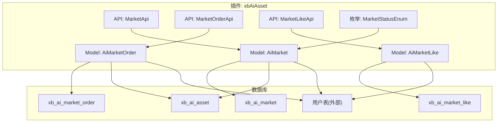
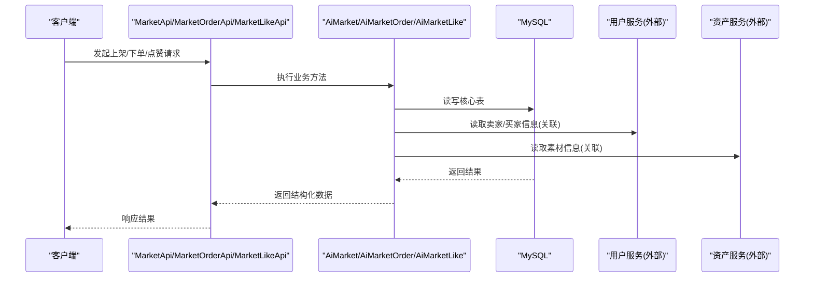
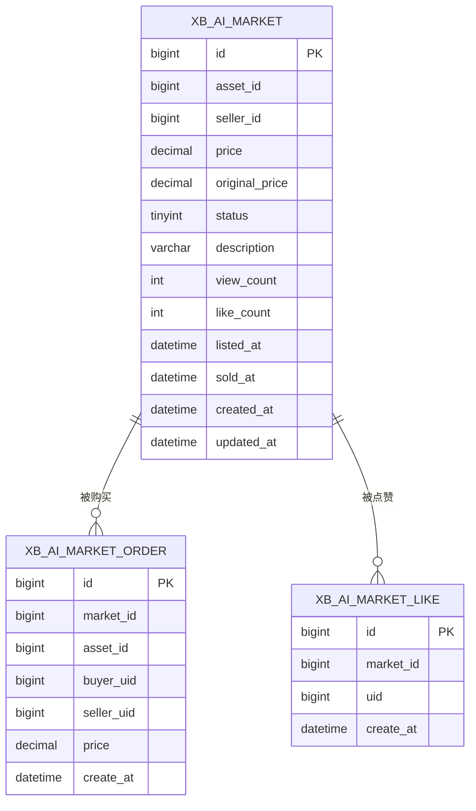
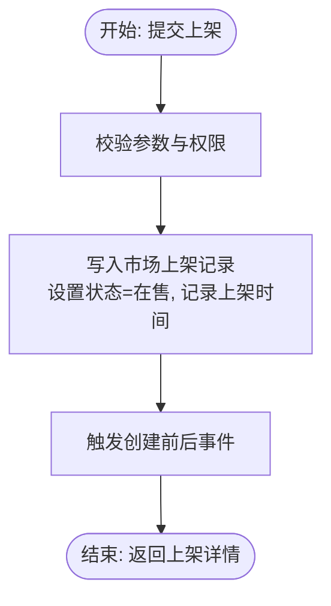
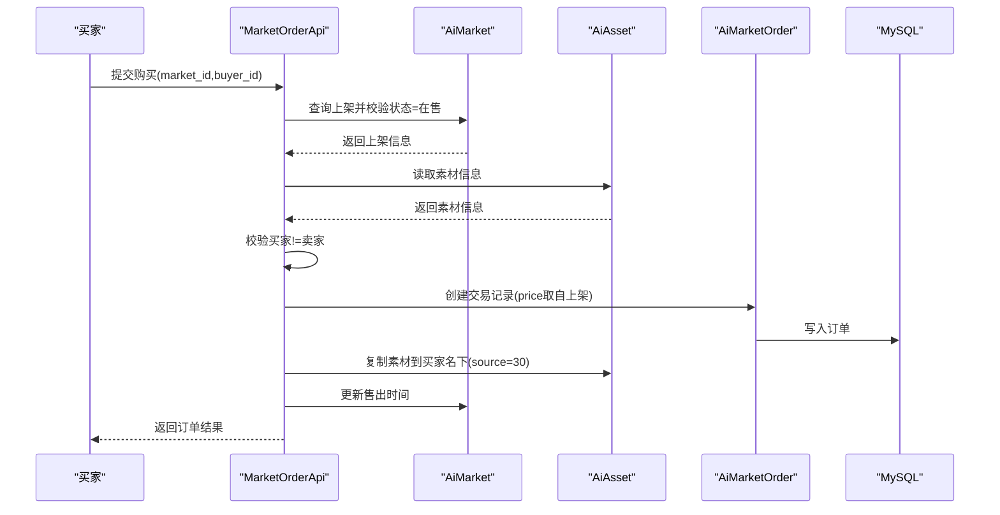
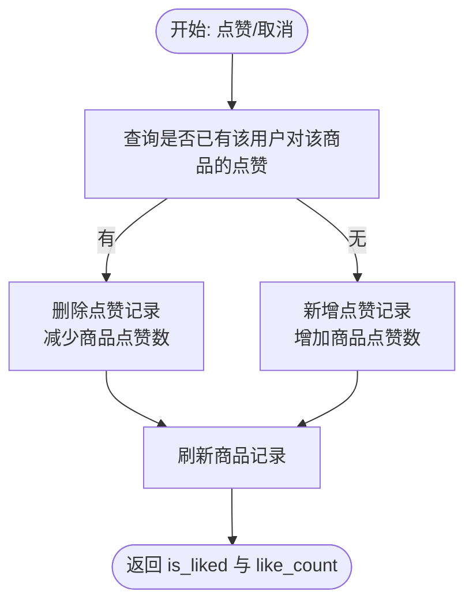
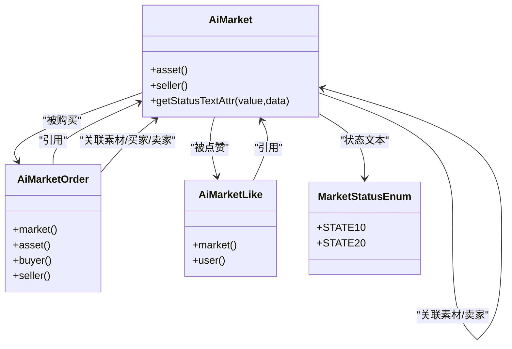

# 市场交易数据模型

<cite>
**本文引用的文件**   
- [install.sql](file://server/plugin\xbAiAsset\install.sql)
- [MarketApi.php](file://server/plugin\xbAiAsset\api\MarketApi.php)
- [MarketOrderApi.php](file://server/plugin\xbAiAsset\api\MarketOrderApi.php)
- [MarketLikeApi.php](file://server/plugin\xbAiAsset\api\MarketLikeApi.php)
- [AiMarket.php](file://server/plugin\xbAiAsset\app\model\AiMarket.php)
- [AiMarketOrder.php](file://server/plugin\xbAiAsset\app\model\AiMarketOrder.php)
- [AiMarketLike.php](file://server/plugin\xbAiAsset\app\model\AiMarketLike.php)
- [MarketStatusEnum.php](file://server/plugin\xbAiAsset\enum\MarketStatusEnum.php)
</cite>

## 目录
1. [引言](#引言)
2. [项目结构](#项目结构)
3. [核心组件](#核心组件)
4. [架构总览](#架构总览)
5. [详细组件分析](#详细组件分析)
6. [依赖关系分析](#依赖关系分析)
7. [性能考量](#性能考量)
8. [故障排查指南](#故障排查指南)
9. [结论](#结论)
10. [附录](#附录)

## 引言
本文件面向市场交易子系统的数据模型与关键流程，聚焦以下三张核心表：市场上架表、交易记录表、点赞表。文档将系统阐述表结构设计、商品上架的数据流转（价格管理、折扣展示、库存控制）、订单生命周期（买家卖家信息、金额处理、状态跟踪）、点赞去重与统计聚合逻辑，并给出权限与安全建议、一致性保障策略以及完整的交易流程图与异常处理方案。

## 项目结构
市场交易相关代码位于插件 xbAiAsset 下，包含 API 层、模型层与枚举定义；数据库建表脚本位于 install.sql。整体采用“API 调用模型 + 事件扩展点”的轻量分层方式，便于后续扩展支付、风控等能力。

图表来源
- [MarketApi.php:1-191](file://server/plugin\xbAiAsset\api\MarketApi.php#L1-L191)
- [MarketOrderApi.php:1-144](file://server/plugin\xbAiAsset\api\MarketOrderApi.php#L1-L144)
- [MarketLikeApi.php:1-118](file://server/plugin\xbAiAsset\api\MarketLikeApi.php#L1-L118)
- [AiMarket.php:1-51](file://server/plugin\xbAiAsset\app\model\AiMarket.php#L1-L51)
- [AiMarketOrder.php:1-63](file://server/plugin\xbAiAsset\app\model\AiMarketOrder.php#L1-L63)
- [AiMarketLike.php:1-45](file://server/plugin\xbAiAsset\app\model\AiMarketLike.php#L1-L45)
- [MarketStatusEnum.php:1-33](file://server/plugin\xbAiAsset\enum\MarketStatusEnum.php#L1-L33)
- [install.sql:1-105](file://server/plugin\xbAiAsset\install.sql#L1-L105)

章节来源
- [MarketApi.php:1-191](file://server/plugin\xbAiAsset\api\MarketApi.php#L1-L191)
- [MarketOrderApi.php:1-144](file://server/plugin\xbAiAsset\api\MarketOrderApi.php#L1-L144)
- [MarketLikeApi.php:1-118](file://server/plugin\xbAiAsset\api\MarketLikeApi.php#L1-L118)
- [AiMarket.php:1-51](file://server/plugin\xbAiAsset\app\model\AiMarket.php#L1-L51)
- [AiMarketOrder.php:1-63](file://server/plugin\xbAiAsset\app\model\AiMarketOrder.php#L1-L63)
- [AiMarketLike.php:1-45](file://server/plugin\xbAiAsset\app\model\AiMarketLike.php#L1-L45)
- [MarketStatusEnum.php:1-33](file://server/plugin\xbAiAsset\enum\MarketStatusEnum.php#L1-L33)
- [install.sql:1-105](file://server/plugin\xbAiAsset\install.sql#L1-L105)

## 核心组件
- 市场上架模型与API：负责商品的上下架、详情浏览计数、列表查询与状态切换，并与素材和用户建立关联。
- 交易记录模型与API：负责创建交易订单、复制素材到买家名下、更新售出时间，并提供按多方维度的列表查询。
- 点赞模型与API：提供点赞/取消点赞的切换、是否已点赞判断、点赞列表查询，并对商品点赞数进行原子增减。
- 状态枚举：统一市场上架状态的标签与值，便于前端渲染与业务校验。

章节来源
- [AiMarket.php:1-51](file://server/plugin\xbAiAsset\app\model\AiMarket.php#L1-L51)
- [AiMarketOrder.php:1-63](file://server/plugin\xbAiAsset\app\model\AiMarketOrder.php#L1-L63)
- [AiMarketLike.php:1-45](file://server/plugin\xbAiAsset\app\model\AiMarketLike.php#L1-L45)
- [MarketApi.php:1-191](file://server/plugin\xbAiAsset\api\MarketApi.php#L1-L191)
- [MarketOrderApi.php:1-144](file://server/plugin\xbAiAsset\api\MarketOrderApi.php#L1-L144)
- [MarketLikeApi.php:1-118](file://server/plugin\xbAiAsset\api\MarketLikeApi.php#L1-L118)
- [MarketStatusEnum.php:1-33](file://server/plugin\xbAiAsset\enum\MarketStatusEnum.php#L1-L33)

## 架构总览
下图展示了从请求进入、API 处理、模型读写到数据库落库的整体链路，以及跨模块的关联关系。

图表来源
- [MarketApi.php:1-191](file://server/plugin\xbAiAsset\api\MarketApi.php#L1-L191)
- [MarketOrderApi.php:1-144](file://server/plugin\xbAiAsset\api\MarketOrderApi.php#L1-L144)
- [MarketLikeApi.php:1-118](file://server/plugin\xbAiAsset\api\MarketLikeApi.php#L1-L118)
- [AiMarket.php:1-51](file://server/plugin\xbAiAsset\app\model\AiMarket.php#L1-L51)
- [AiMarketOrder.php:1-63](file://server/plugin\xbAiAsset\app\model\AiMarketOrder.php#L1-L63)
- [AiMarketLike.php:1-45](file://server/plugin\xbAiAsset\app\model\AiMarketLike.php#L1-L45)

## 详细组件分析

### 数据模型与表结构
- 市场上架表(xb_ai_market)
  - 关键字段：id、asset_id、seller_id、price、original_price、status、description、view_count、like_count、listed_at、sold_at、created_at、updated_at
  - 索引：seller_id+status、status+asset_id、asset_id
  - 用途：记录可售卖的商品、价格与原价（用于折扣展示）、状态、热度指标与时间戳
- 交易记录表(xb_ai_market_order)
  - 关键字段：id、market_id、asset_id、buyer_uid、seller_uid、price、create_at
  - 索引：buyer_uid、seller_uid、market_id
  - 用途：记录每笔交易的买卖双方、对应上架与素材、成交金额与时间
- 点赞表(xb_ai_market_like)
  - 关键字段：id、market_id、uid、create_at
  - 唯一约束：market_id+uid（保证同一用户对同一商品仅一次点赞）
  - 用途：记录点赞关系，配合市场上架表的 like_count 实现快速统计

ER 图（概念映射到实际表）

图表来源
- [install.sql:24-44](file://server/plugin\xbAiAsset\install.sql#L24-L44)
- [install.sql:47-61](file://server/plugin\xbAiAsset\install.sql#L47-L61)
- [install.sql:64-73](file://server/plugin\xbAiAsset\install.sql#L64-L73)

章节来源
- [install.sql:24-44](file://server/plugin\xbAiAsset\install.sql#L24-L44)
- [install.sql:47-61](file://server/plugin\xbAiAsset\install.sql#L47-L61)
- [install.sql:64-73](file://server/plugin\xbAiAsset\install.sql#L64-L73)

### 商品上架流程与数据流转
- 上架创建
  - 入口：MarketApi::create
  - 行为：设置默认状态为在售、记录上架时间，持久化后触发创建前后事件
- 上架详情
  - 入口：MarketApi::getDetail
  - 行为：加载关联素材与卖家，增加浏览次数
- 上架更新与删除
  - 入口：MarketApi::update/delete/toggleStatus
  - 行为：在更新或删除前后触发事件，支持状态切换
- 价格管理与折扣展示
  - 字段：price 与 original_price
  - 展示：前端以 original_price 与 price 计算折扣标识
- 库存控制机制
  - 现状：当前未实现库存扣减或并发锁；如需严格库存，建议在下单前加分布式锁或基于 Redis 的原子扣减，并在数据库中引入库存字段与乐观锁版本控制

图表来源
- [MarketApi.php:94-111](file://server/plugin\xbAiAsset\api\MarketApi.php#L94-L111)
- [MarketApi.php:76-87](file://server/plugin\xbAiAsset\api\MarketApi.php#L76-L87)
- [MarketApi.php:119-137](file://server/plugin\xbAiAsset\api\MarketApi.php#L119-L137)
- [MarketApi.php:144-162](file://server/plugin\xbAiAsset\api\MarketApi.php#L144-L162)
- [MarketApi.php:170-189](file://server/plugin\xbAiAsset\api\MarketApi.php#L170-L189)

章节来源
- [MarketApi.php:94-111](file://server/plugin\xbAiAsset\api\MarketApi.php#L94-L111)
- [MarketApi.php:76-87](file://server/plugin\xbAiAsset\api\MarketApi.php#L76-L87)
- [MarketApi.php:119-137](file://server/plugin\xbAiAsset\api\MarketApi.php#L119-L137)
- [MarketApi.php:144-162](file://server/plugin\xbAiAsset\api\MarketApi.php#L144-L162)
- [MarketApi.php:170-189](file://server/plugin\xbAiAsset\api\MarketApi.php#L170-L189)

### 交易订单生命周期与数据流转
- 下单创建
  - 入口：MarketOrderApi::create
  - 前置校验：市场上架存在且状态为在售；素材存在；买家不能是卖家本人
  - 数据组装：从市场上架读取 price，生成订单记录
  - 副作用：复制素材到买家名下（source=市场购买），记录 market_id；更新市场上架售出时间
  - 事件：触发订单创建前后事件
- 订单状态跟踪
  - 现状：订单表无显式状态字段；可通过是否存在记录与时间戳推断已完成交易
  - 建议：若需退款/取消等复杂流程，可在订单表增加状态字段与审计日志
- 金额处理
  - 使用 decimal 类型保存交易金额，避免浮点误差
  - 建议：接入支付网关时，对金额做二次校验与幂等键保护

图表来源
- [MarketOrderApi.php:82-142](file://server/plugin\xbAiAsset\api\MarketOrderApi.php#L82-L142)
- [AiMarket.php:26-38](file://server/plugin\xbAiAsset\app\model\AiMarket.php#L26-L38)
- [AiMarketOrder.php:31-61](file://server/plugin\xbAiAsset\app\model\AiMarketOrder.php#L31-L61)

章节来源
- [MarketOrderApi.php:82-142](file://server/plugin\xbAiAsset\api\MarketOrderApi.php#L82-L142)
- [AiMarket.php:26-38](file://server/plugin\xbAiAsset\app\model\AiMarket.php#L26-L38)
- [AiMarketOrder.php:31-61](file://server/plugin\xbAiAsset\app\model\AiMarketOrder.php#L31-L61)

### 点赞系统的去重与统计聚合
- 去重机制
  - 数据库层：点赞表对 (market_id, uid) 建立唯一约束，防止重复点赞
  - 应用层：toggle 方法先查询是否存在该用户的点赞记录，存在则删除并减少计数，不存在则新增并增加计数
- 统计聚合
  - 通过市场上架表的 like_count 字段维护点赞总数，每次点赞/取消均原子增减
  - isLiked 接口直接查询点赞表是否存在记录，O(1) 判定
- 复杂度
  - 单条点赞操作：数据库写 O(1)，计数更新 O(1)
  - 列表查询：分页排序，结合索引优化

图表来源
- [MarketLikeApi.php:46-79](file://server/plugin\xbAiAsset\api\MarketLikeApi.php#L46-L79)
- [MarketLikeApi.php:111-116](file://server/plugin\xbAiAsset\api\MarketLikeApi.php#L111-L116)
- [install.sql:64-73](file://server/plugin\xbAiAsset\install.sql#L64-L73)

章节来源
- [MarketLikeApi.php:46-79](file://server/plugin\xbAiAsset\api\MarketLikeApi.php#L46-L79)
- [MarketLikeApi.php:111-116](file://server/plugin\xbAiAsset\api\MarketLikeApi.php#L111-L116)
- [install.sql:64-73](file://server/plugin\xbAiAsset\install.sql#L64-L73)

### 权限控制与安全验证
- 身份鉴权
  - 建议：所有写接口（上架、下单、点赞）均需校验登录态与用户身份，确保 buyer_id/seller_id/user_id 来自可信上下文
- 资源访问控制
  - 卖家只能修改自己的上架；买家只能购买非自己上架的商品；点赞需登录用户
- 输入校验与防注入
  - 对所有入参进行类型与范围校验，禁止直接拼接 SQL
- 幂等与防重放
  - 下单接口建议引入幂等键（如 user+market 哈希），防止重复提交
- 敏感信息脱敏
  - 对外返回的用户信息与交易明细应遵循最小披露原则

[本节为通用安全建议，不直接分析具体文件]

### 数据一致性与事务策略
- 当前实现
  - 下单流程涉及多表写入（订单、素材复制、上架售出时间），但未见显式事务包裹
- 风险
  - 部分失败可能导致数据不一致（例如订单已创建但素材未复制成功）
- 改进建议
  - 使用数据库事务包裹下单关键步骤，任一失败回滚
  - 引入补偿任务或消息队列重试机制，保证最终一致性
  - 对高并发场景引入分布式锁或基于 Redis 的原子操作，避免超卖

[本节为通用一致性建议，不直接分析具体文件]

## 依赖关系分析
- 模型关联
  - AiMarket 关联素材与卖家用户
  - AiMarketOrder 关联市场上架、素材、买家与卖家
  - AiMarketLike 关联市场上架与用户
- 枚举依赖
  - AiMarket 的状态文本由 MarketStatusEnum 提供

图表来源
- [AiMarket.php:26-49](file://server/plugin\xbAiAsset\app\model\AiMarket.php#L26-L49)
- [AiMarketOrder.php:31-61](file://server/plugin\xbAiAsset\app\model\AiMarketOrder.php#L31-L61)
- [AiMarketLike.php:31-43](file://server/plugin\xbAiAsset\app\model\AiMarketLike.php#L31-L43)
- [MarketStatusEnum.php:21-31](file://server/plugin\xbAiAsset\enum\MarketStatusEnum.php#L21-L31)

章节来源
- [AiMarket.php:26-49](file://server/plugin\xbAiAsset\app\model\AiMarket.php#L26-L49)
- [AiMarketOrder.php:31-61](file://server/plugin\xbAiAsset\app\model\AiMarketOrder.php#L31-L61)
- [AiMarketLike.php:31-43](file://server/plugin\xbAiAsset\app\model\AiMarketLike.php#L31-L43)
- [MarketStatusEnum.php:21-31](file://server/plugin\xbAiAsset\enum\MarketStatusEnum.php#L21-L31)

## 性能考量
- 索引设计
  - 市场上架：seller_id+status、status+asset_id、asset_id 提升筛选与列表效率
  - 交易记录：buyer_uid、seller_uid、market_id 提升按维度查询
  - 点赞：唯一约束 (market_id, uid) 同时作为查询与去重依据
- 计数更新
  - 点赞计数采用增量更新，避免全表扫描
- 分页与排序
  - 列表接口统一按 id desc 分页，注意大偏移量时的性能退化，必要时使用游标分页
- 缓存建议
  - 热门商品详情与点赞数可考虑短期缓存，降低热点读压力

[本节为通用性能建议，不直接分析具体文件]

## 故障排查指南
- 常见问题定位
  - 下单失败：检查市场上架状态是否为在售、素材是否存在、买家是否为卖家本人
  - 点赞异常：确认唯一约束冲突是否出现，核对用户ID与商品ID
  - 详情浏览计数不增：检查 getDetail 是否被调用且保存成功
- 日志与监控
  - 建议在关键节点（创建、更新、删除、下单、点赞）输出结构化日志，记录关键ID与状态
- 回滚与补偿
  - 对于下单流程，若出现部分失败，应通过事务回滚或补偿任务恢复一致性

章节来源
- [MarketOrderApi.php:82-142](file://server/plugin\xbAiAsset\api\MarketOrderApi.php#L82-L142)
- [MarketLikeApi.php:46-79](file://server/plugin\xbAiAsset\api\MarketLikeApi.php#L46-L79)
- [MarketApi.php:76-87](file://server/plugin\xbAiAsset\api\MarketApi.php#L76-L87)

## 结论
本数据模型围绕市场上架、交易与点赞三大核心域展开，具备清晰的关联关系与基础索引设计。当前实现覆盖了上架、下单、点赞的基本闭环，但在事务一致性、库存控制与支付集成方面仍有扩展空间。建议优先补齐事务包裹与幂等设计，逐步完善库存与支付链路，以提升系统的健壮性与可扩展性。

## 附录
- 状态枚举说明
  - 在售：value=20，label=在售
  - 下架：value=10，label=下架

章节来源
- [MarketStatusEnum.php:21-31](file://server/plugin\xbAiAsset\enum\MarketStatusEnum.php#L21-L31)