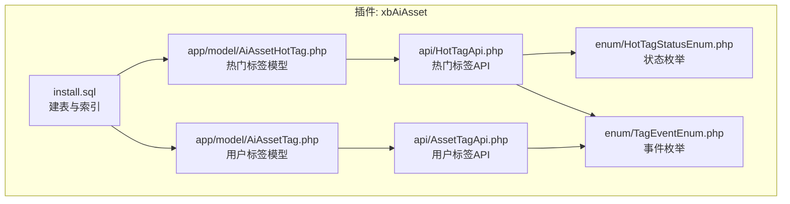
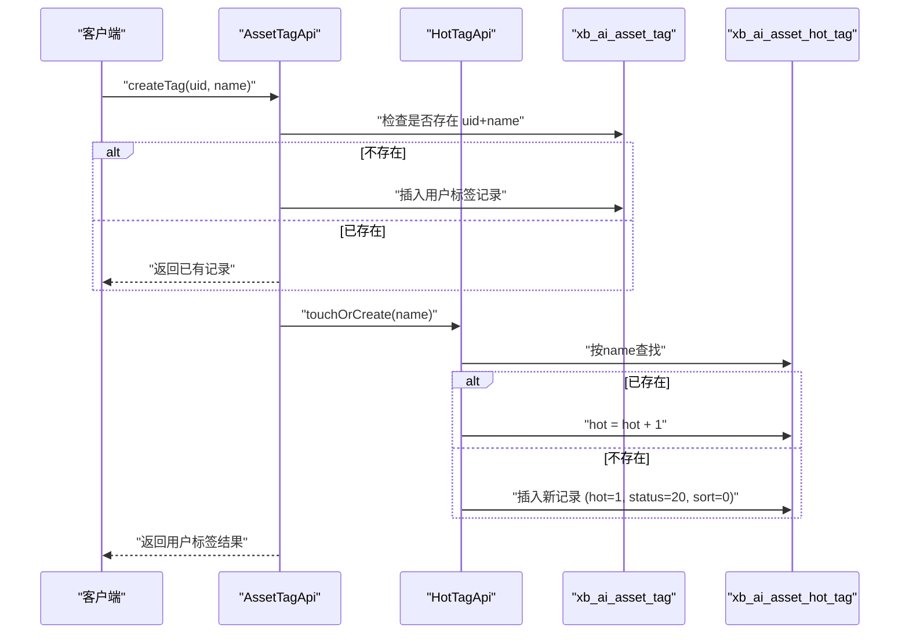
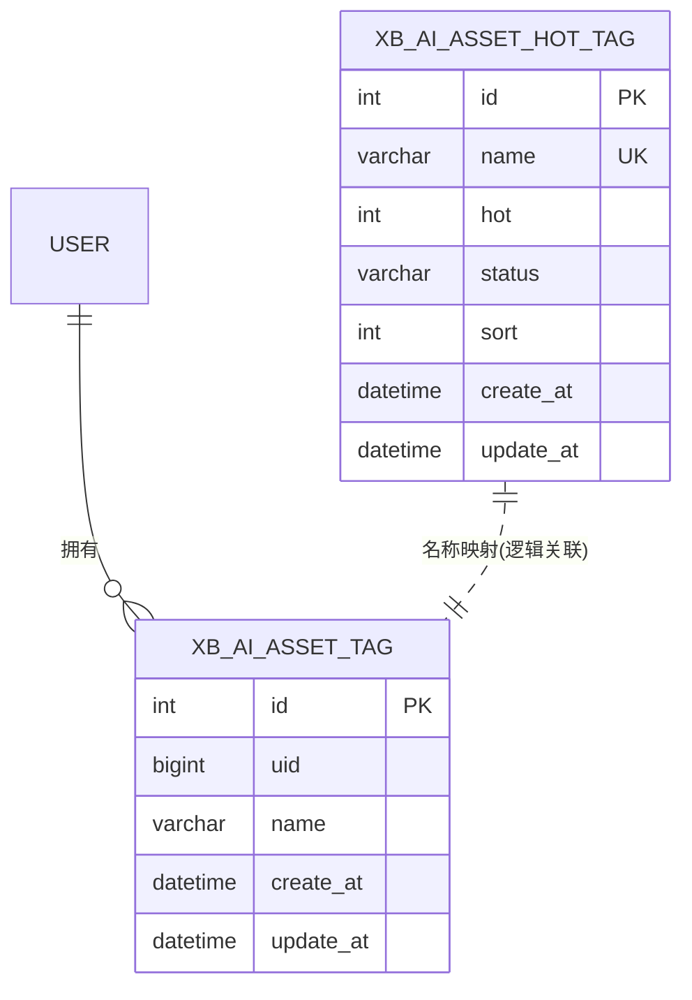
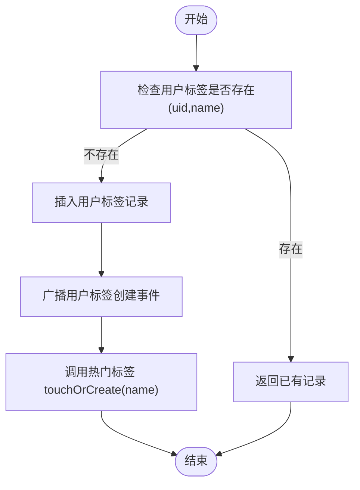
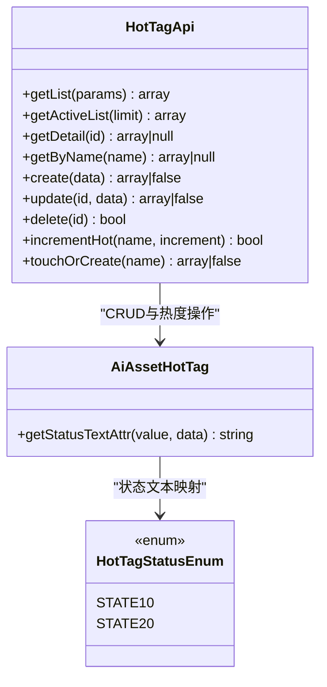
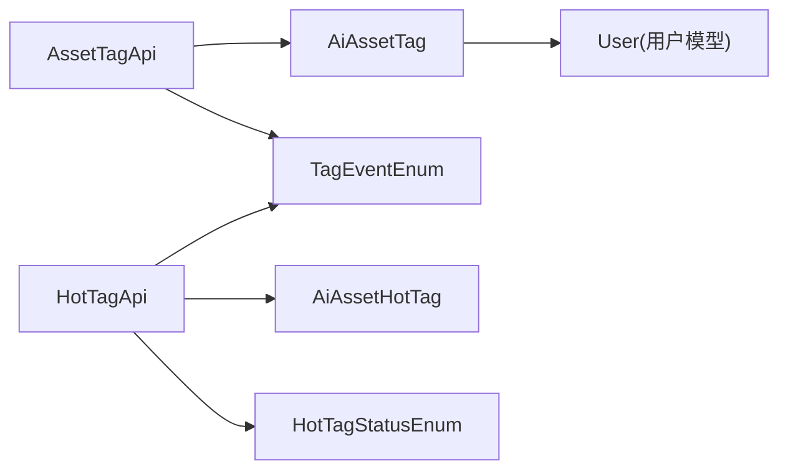

# 标签系统数据模型

<cite>
**本文引用的文件列表**
- [install.sql](file://server/plugin/xbAiAsset/install.sql)
- [AiAssetTag.php](file://server/plugin/xbAiAsset/app/model/AiAssetTag.php)
- [AiAssetHotTag.php](file://server/plugin/xbAiAsset/app/model/AiAssetHotTag.php)
- [AssetTagApi.php](file://server/plugin/xbAiAsset/api/AssetTagApi.php)
- [HotTagApi.php](file://server/plugin/xbAiAsset/api/HotTagApi.php)
- [HotTagStatusEnum.php](file://server/plugin/xbAiAsset/enum/HotTagStatusEnum.php)
- [TagEventEnum.php](file://server/plugin/xbAiAsset/enum/TagEventEnum.php)
</cite>

## 目录
1. [简介](#简介)
2. [项目结构](#项目结构)
3. [核心组件](#核心组件)
4. [架构总览](#架构总览)
5. [详细组件分析](#详细组件分析)
6. [依赖关系分析](#依赖关系分析)
7. [性能与查询优化](#性能与查询优化)
8. [故障排查指南](#故障排查指南)
9. [结论](#结论)
10. [附录](#附录)

## 简介
本文件聚焦于标签系统的数据模型与实现，围绕用户标签库（表名：xb_ai_asset_tag）与热门标签库（表名：xb_ai_asset_hot_tag）展开。文档涵盖：
- 表结构设计、字段含义与约束
- 用户自定义标签管理机制（唯一性、隔离策略、命名规范）
- 热门标签算法（热度值计算、排序机制、状态管理）
- 标签与资产的关联关系、搜索优化与缓存策略
- 导入导出能力、批量操作接口与统计分析模型
- 完整ER图与查询优化方案

## 项目结构
标签系统位于插件 xbAiAsset 中，关键位置如下：
- 数据库脚本：install.sql
- 数据模型：app/model/AiAssetTag.php、app/model/AiAssetHotTag.php
- API 层：api/AssetTagApi.php、api/HotTagApi.php
- 枚举与事件：enum/HotTagStatusEnum.php、enum/TagEventEnum.php

图表来源
- [install.sql:76-104](file://server/plugin/xbAiAsset/install.sql#L76-L104)
- [AiAssetTag.php:19-29](file://server/plugin/xbAiAsset/app/model/AiAssetTag.php#L19-L29)
- [AiAssetHotTag.php:20-32](file://server/plugin/xbAiAsset/app/model/AiAssetHotTag.php#L20-L32)
- [AssetTagApi.php:21-171](file://server/plugin/xbAiAsset/api/AssetTagApi.php#L21-L171)
- [HotTagApi.php:21-215](file://server/plugin/xbAiAsset/api/HotTagApi.php#L21-L215)
- [HotTagStatusEnum.php:19-32](file://server/plugin/xbAiAsset/enum/HotTagStatusEnum.php#L19-L32)
- [TagEventEnum.php:19-124](file://server/plugin/xbAiAsset/enum/TagEventEnum.php#L19-L124)

章节来源
- [install.sql:1-105](file://server/plugin/xbAiAsset/install.sql#L1-L105)

## 核心组件
- 用户标签库（xb_ai_asset_tag）：记录每个用户对标签的“拥有”关系，用于用户维度的标签管理与统计。
- 热门标签库（xb_ai_asset_hot_tag）：全局维度维护标签名称、热度、状态与排序，支撑热门展示与推荐。
- 用户标签API（AssetTagApi）：提供用户标签的创建、批量创建、按用户获取、删除与统计等能力。
- 热门标签API（HotTagApi）：提供热门标签的增删改查、热度递增、创建或增加热度、启用列表获取等能力。
- 状态枚举（HotTagStatusEnum）：定义热门标签的状态（禁用/启用）。
- 事件枚举（TagEventEnum）：定义标签相关生命周期事件，便于扩展与解耦。

章节来源
- [AiAssetTag.php:19-29](file://server/plugin/xbAiAsset/app/model/AiAssetTag.php#L19-L29)
- [AiAssetHotTag.php:20-32](file://server/plugin/xbAiAsset/app/model/AiAssetHotTag.php#L20-L32)
- [AssetTagApi.php:46-171](file://server/plugin/xbAiAsset/api/AssetTagApi.php#L46-L171)
- [HotTagApi.php:46-215](file://server/plugin/xbAiAsset/api/HotTagApi.php#L46-L215)
- [HotTagStatusEnum.php:19-32](file://server/plugin/xbAiAsset/enum/HotTagStatusEnum.php#L19-L32)
- [TagEventEnum.php:19-124](file://server/plugin/xbAiAsset/enum/TagEventEnum.php#L19-L124)

## 架构总览
标签系统采用“用户标签 + 热门标签”的双库设计：
- 用户标签库负责“谁在什么时候创建了哪个标签”，并保证同一用户下标签名称的唯一性。
- 热门标签库负责“全局可见的标签池”，通过热度值驱动排序与推荐，支持启用/禁用状态控制。
- 用户创建标签时，会触发异步联动逻辑，确保在热门标签库中同步存在该标签（不存在则创建且初始热度为1，存在则热度+1）。

图表来源
- [AssetTagApi.php:88-116](file://server/plugin/xbAiAsset/api/AssetTagApi.php#L88-L116)
- [HotTagApi.php:197-214](file://server/plugin/xbAiAsset/api/HotTagApi.php#L197-L214)
- [install.sql:76-104](file://server/plugin/xbAiAsset/install.sql#L76-L104)

## 详细组件分析

### 数据模型与ER图
- 用户标签库（xb_ai_asset_tag）
  - 主键：id
  - 业务键：uid + name（唯一约束 uk_uid_name）
  - 索引：idx_uid（按用户快速检索）
  - 时间戳：create_at、update_at
- 热门标签库（xb_ai_asset_hot_tag）
  - 主键：id
  - 业务键：name（唯一约束 uk_name）
  - 索引：idx_hot（按热度排序）、idx_status_sort（按状态与排序筛选）
  - 字段：status（10=禁用，20=启用）、sort（人工排序权重）
  - 时间戳：create_at、update_at

图表来源
- [install.sql:76-104](file://server/plugin/xbAiAsset/install.sql#L76-L104)

章节来源
- [install.sql:76-104](file://server/plugin/xbAiAsset/install.sql#L76-L104)

### 用户标签库（xb_ai_asset_tag）设计要点
- 唯一性约束：uk_uid_name 保证同一用户下标签名称唯一，避免重复。
- 用户隔离策略：以 uid 作为隔离维度，不同用户的同名标签互不影响。
- 命名规范建议：
  - 长度限制：varchar(50)，建议前端校验长度与字符集（中文、英文、数字、常见符号）。
  - 去重与规范化：建议在写入前进行 trim、全角转半角、大小写统一等处理，减少冗余。
  - 敏感词过滤：可结合内容安全服务进行前置校验。
- 关联关系：
  - 与资产（xb_ai_asset）的关系：资产表 tags 字段为逗号分隔的字符串，属于扁平化存储；如需复杂查询与统计，建议引入中间关联表（见“查询优化方案”）。
  - 与用户（user）的关系：模型 AiAssetTag 定义了 belongsTo 用户关系，便于后台列表加载用户信息。

章节来源
- [install.sql:93-104](file://server/plugin/xbAiAsset/install.sql#L93-L104)
- [AiAssetTag.php:25-28](file://server/plugin/xbAiAsset/app/model/AiAssetTag.php#L25-L28)

### 热门标签库（xb_ai_asset_hot_tag）设计要点
- 唯一性约束：uk_name 保证全局标签名称唯一。
- 状态管理：
  - status 使用枚举 HotTagStatusEnum，值为 10（禁用）与 20（启用）。
  - 前端展示通常仅拉取 status=20 的标签。
- 排序机制：
  - 默认排序：hot desc, sort desc, id desc。hot 决定热度，sort 支持人工置顶或加权，id 作为稳定排序兜底。
- 热度值计算：
  - 基础增量：每次命中或创建时 hot+1。
  - 可扩展策略：可按时间衰减、用户行为权重（浏览、收藏、购买）等加权，当前实现为简单计数。

章节来源
- [install.sql:76-90](file://server/plugin/xbAiAsset/install.sql#L76-L90)
- [HotTagStatusEnum.php:21-31](file://server/plugin/xbAiAsset/enum/HotTagStatusEnum.php#L21-L31)
- [HotTagApi.php:60-77](file://server/plugin/xbAiAsset/api/HotTagApi.php#L60-L77)

### 用户自定义标签管理机制
- 创建流程（单条）：
  - 若用户标签不存在则插入；否则返回已有记录。
  - 广播用户标签创建事件，供外部监听。
  - 调用热门标签 API 的 touchOrCreate，确保全局标签存在且热度+1。
- 批量创建：
  - 遍历名称数组，逐条执行创建逻辑，返回每条的处理结果。
- 删除：
  - 根据记录ID删除用户标签记录。
- 统计：
  - 统计用户数、标签总数、TopN 标签（按使用次数）。

图表来源
- [AssetTagApi.php:88-116](file://server/plugin/xbAiAsset/api/AssetTagApi.php#L88-L116)
- [HotTagApi.php:197-214](file://server/plugin/xbAiAsset/api/HotTagApi.php#L197-L214)
- [TagEventEnum.php:119-123](file://server/plugin/xbAiAsset/enum/TagEventEnum.php#L119-L123)

章节来源
- [AssetTagApi.php:88-134](file://server/plugin/xbAiAsset/api/AssetTagApi.php#L88-L134)
- [AssetTagApi.php:140-156](file://server/plugin/xbAiAsset/api/AssetTagApi.php#L140-L156)
- [AssetTagApi.php:163-170](file://server/plugin/xbAiAsset/api/AssetTagApi.php#L163-L170)

### 热门标签算法实现
- 热度值计算：
  - 新增标签：hot=1。
  - 命中或创建：hot=hot+1。
  - 可通过 incrementHot 方法对指定标签进行增量更新。
- 排序机制：
  - 列表排序：hot desc, sort desc, id desc。
  - 启用列表：status=20 且按上述规则排序。
- 状态管理：
  - 支持创建、更新、删除，并在前后置阶段广播事件，便于扩展（如缓存失效、审计日志）。

图表来源
- [HotTagApi.php:46-215](file://server/plugin/xbAiAsset/api/HotTagApi.php#L46-L215)
- [AiAssetHotTag.php:28-31](file://server/plugin/xbAiAsset/app/model/AiAssetHotTag.php#L28-L31)
- [HotTagStatusEnum.php:21-31](file://server/plugin/xbAiAsset/enum/HotTagStatusEnum.php#L21-L31)

章节来源
- [HotTagApi.php:180-214](file://server/plugin/xbAiAsset/api/HotTagApi.php#L180-L214)
- [HotTagApi.php:70-77](file://server/plugin/xbAiAsset/api/HotTagApi.php#L70-L77)
- [HotTagApi.php:106-172](file://server/plugin/xbAiAsset/api/HotTagApi.php#L106-L172)

### 标签与资产的关联关系
- 当前实现：
  - 资产表（xb_ai_asset）的 tags 字段为逗号分隔的字符串，便于快速读写与展示。
  - 用户标签库（xb_ai_asset_tag）记录用户创建的标签集合，用于用户维度的管理与统计。
- 潜在问题：
  - 基于字符串的标签难以进行高效的多标签组合查询与聚合统计。
- 建议优化：
  - 引入中间关联表（asset_tag_relation），包含 asset_id、tag_id、uid 等字段，建立联合索引，支持多标签组合查询与高性能统计。
  - 保持现有 tags 字段用于展示兼容，逐步迁移至关联表进行查询。

章节来源
- [install.sql:4-21](file://server/plugin/xbAiAsset/install.sql#L4-L21)
- [install.sql:93-104](file://server/plugin/xbAiAsset/install.sql#L93-L104)

### 标签搜索优化与缓存策略
- 搜索优化：
  - 用户标签：按 uid 精确查询、按 name like 模糊匹配，配合 idx_uid 提升性能。
  - 热门标签：按 name like、status 筛选，配合 idx_status_sort 与 idx_hot 提升排序与过滤效率。
- 缓存策略建议：
  - 热点标签列表：Redis 缓存 key 为 hot_tags:active:{limit}，设置合理过期时间（如 5-10 分钟），在标签创建/更新/删除后失效。
  - 用户标签列表：Redis 缓存 key 为 user_tags:{uid}:{limit}，在用户标签变更时失效。
  - 统计信息：Redis 缓存 key 为 tag_statistics，定时任务刷新。

[本节为通用优化建议，不直接分析具体文件]

### 导入导出功能与批量操作接口
- 导入：
  - 支持从 CSV/Excel 批量导入用户标签，需校验 uid、name 合法性与唯一性，失败行记录错误日志。
  - 导入过程中可触发热门标签的 touchOrCreate，确保全局一致性。
- 导出：
  - 导出用户标签清单（uid、name、create_at、update_at）与热门标签清单（name、hot、status、sort、create_at、update_at）。
- 批量操作接口：
  - 批量创建：AssetTagApi::createTags 已提供。
  - 批量删除：可基于 uid 或 name 范围批量删除用户标签记录。
  - 批量更新：可对热门标签进行批量状态切换或排序调整。

[本节为通用能力说明，不直接分析具体文件]

### 标签统计分析模型
- 用户维度：
  - 活跃用户数（去重 uid 数量）
  - 用户标签总量
- 标签维度：
  - TopN 标签（按使用次数）
  - 热门标签分布（按 hot 区间）
- 趋势分析：
  - 按天/周统计新增标签数、热门标签变化趋势。
- 指标落地：
  - 可使用定时任务聚合统计，写入统计表或缓存，供报表与看板消费。

章节来源
- [AssetTagApi.php:140-156](file://server/plugin/xbAiAsset/api/AssetTagApi.php#L140-L156)

## 依赖关系分析
- 模型与API：
  - AssetTagApi 依赖 AiAssetTag 模型与 TagEventEnum 事件。
  - HotTagApi 依赖 AiAssetHotTag 模型、HotTagStatusEnum 状态与 TagEventEnum 事件。
- 事件驱动：
  - 热门标签的创建、更新、删除均广播事件，便于扩展（如缓存失效、审计、消息通知）。
- 外部依赖：
  - 用户模型（plugin\xbUser\app\model\User）用于用户标签列表的用户信息关联。

图表来源
- [AssetTagApi.php:12-14](file://server/plugin/xbAiAsset/api/AssetTagApi.php#L12-L14)
- [AiAssetTag.php:25-28](file://server/plugin/xbAiAsset/app/model/AiAssetTag.php#L25-L28)
- [HotTagApi.php:12-14](file://server/plugin/xbAiAsset/api/HotTagApi.php#L12-L14)
- [HotTagStatusEnum.php:19-32](file://server/plugin/xbAiAsset/enum/HotTagStatusEnum.php#L19-L32)
- [TagEventEnum.php:19-124](file://server/plugin/xbAiAsset/enum/TagEventEnum.php#L19-L124)

章节来源
- [AssetTagApi.php:12-14](file://server/plugin/xbAiAsset/api/AssetTagApi.php#L12-L14)
- [HotTagApi.php:12-14](file://server/plugin/xbAiAsset/api/HotTagApi.php#L12-L14)

## 性能与查询优化
- 索引设计：
  - 用户标签：uk_uid_name、idx_uid。
  - 热门标签：uk_name、idx_hot、idx_status_sort。
- 查询优化建议：
  - 用户标签列表：优先按 uid 过滤，再按 name like 模糊匹配，避免全表扫描。
  - 热门标签列表：优先按 status 过滤，再按 hot/sort/id 排序，充分利用 idx_status_sort 与 idx_hot。
  - 分页查询：使用 limit+offset 或游标分页，避免大偏移量带来的性能退化。
- 事务与一致性：
  - 用户标签创建与热门标签更新应置于事务中，确保双库一致性。
  - 高并发场景下，建议使用 Redis 原子计数器预热热度，再异步落库。

[本节为通用优化建议，不直接分析具体文件]

## 故障排查指南
- 常见问题：
  - 重复标签：检查 uk_uid_name 与 uk_name 约束是否生效，确认写入前是否进行去重与规范化。
  - 热门标签未显示：确认 status=20 且排序字段正常，检查 idx_status_sort 与 idx_hot 索引是否可用。
  - 事件未触发：检查 TagEventEnum 事件值是否正确，确认事件监听器是否注册。
- 定位步骤：
  - 查看 API 返回码与异常堆栈。
  - 核对数据库约束冲突与索引使用情况（EXPLAIN 分析慢查询）。
  - 检查事件总线日志与消费者状态。

章节来源
- [TagEventEnum.php:27-111](file://server/plugin/xbAiAsset/enum/TagEventEnum.php#L27-L111)
- [HotTagApi.php:106-172](file://server/plugin/xbAiAsset/api/HotTagApi.php#L106-L172)

## 结论
本标签系统通过“用户标签 + 热门标签”的双库设计，实现了用户维度的标签管理与全局维度的热门推荐。通过唯一性约束、索引设计与事件驱动，系统在一致性、扩展性与性能方面具备良好基础。后续可在以下方向持续优化：
- 引入中间关联表以提升复杂查询与统计能力。
- 完善缓存策略与异步化改造，提高高并发下的响应速度。
- 丰富热度算法，结合用户行为与时间衰减，提供更精准的推荐。

[本节为总结性内容，不直接分析具体文件]

## 附录
- 字段与约束速览：
  - 用户标签库（xb_ai_asset_tag）：id、uid、name、create_at、update_at；uk_uid_name、idx_uid。
  - 热门标签库（xb_ai_asset_hot_tag）：id、name、hot、status、sort、create_at、update_at；uk_name、idx_hot、idx_status_sort。
- 状态枚举：
  - 10=禁用，20=启用。

章节来源
- [install.sql:76-104](file://server/plugin/xbAiAsset/install.sql#L76-L104)
- [HotTagStatusEnum.php:21-31](file://server/plugin/xbAiAsset/enum/HotTagStatusEnum.php#L21-L31)