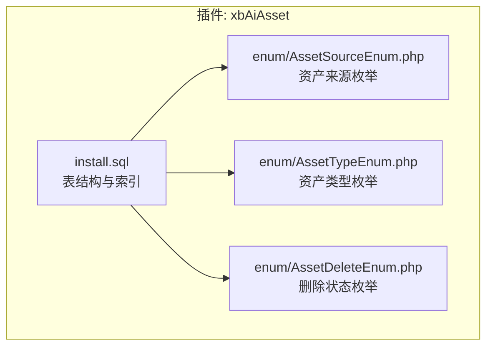
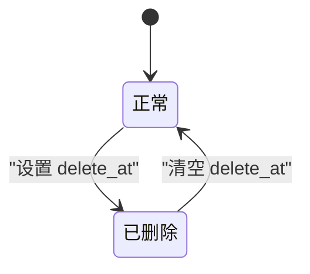
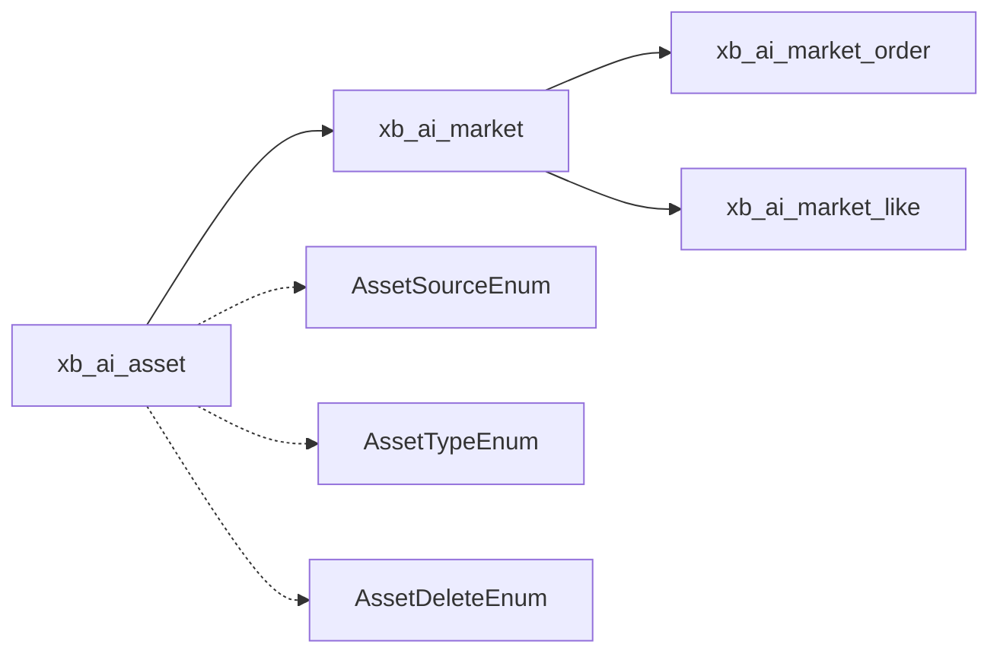

# 资产核心数据模型

<cite>
**本文引用的文件**   
- [install.sql](file://server/plugin/xbAiAsset/install.sql)
- [AssetSourceEnum.php](file://server/plugin/xbAiAsset/enum/AssetSourceEnum.php)
- [AssetTypeEnum.php](file://server/plugin/xbAiAsset/enum/AssetTypeEnum.php)
- [AssetDeleteEnum.php](file://server/plugin/xbAiAsset/enum/AssetDeleteEnum.php)
</cite>

## 目录
1. [引言](#引言)
2. [项目结构](#项目结构)
3. [核心组件](#核心组件)
4. [架构总览](#架构总览)
5. [详细组件分析](#详细组件分析)
6. [依赖关系分析](#依赖关系分析)
7. [性能考虑](#性能考虑)
8. [故障排查指南](#故障排查指南)
9. [结论](#结论)
10. [附录](#附录)

## 引言
本文件聚焦于“资产核心数据模型”，围绕 ai_asset 资产主表（对应数据库表 xb_ai_asset）进行系统化说明，涵盖字段设计、来源标识机制、软删除与时间戳策略、索引优化、生命周期管理、版本控制思路以及存储路径规范。文档同时给出相关枚举定义与关联表结构，帮助读者从业务到技术实现形成完整认知。

## 项目结构
资产核心数据模型位于插件 xbAiAsset 中，关键位置如下：
- 数据库安装脚本与表结构定义：install.sql
- 资产来源枚举：enum/AssetSourceEnum.php
- 资产类型枚举：enum/AssetTypeEnum.php
- 资产删除状态枚举：enum/AssetDeleteEnum.php

图表来源
- [install.sql:1-105](file://server/plugin/xbAiAsset/install.sql#L1-L105)
- [AssetSourceEnum.php:1-39](file://server/plugin/xbAiAsset/enum/AssetSourceEnum.php#L1-L39)
- [AssetTypeEnum.php:1-87](file://server/plugin/xbAiAsset/enum/AssetTypeEnum.php#L1-L87)
- [AssetDeleteEnum.php:1-33](file://server/plugin/xbAiAsset/enum/AssetDeleteEnum.php#L1-L33)

章节来源
- [install.sql:1-105](file://server/plugin/xbAiAsset/install.sql#L1-L105)
- [AssetSourceEnum.php:1-39](file://server/plugin/xbAiAsset/enum/AssetSourceEnum.php#L1-L39)
- [AssetTypeEnum.php:1-87](file://server/plugin/xbAiAsset/enum/AssetTypeEnum.php#L1-L87)
- [AssetDeleteEnum.php:1-33](file://server/plugin/xbAiAsset/enum/AssetDeleteEnum.php#L1-L33)

## 核心组件
本节对资产主表及其关联表、枚举进行结构化说明，重点覆盖字段、约束、索引与业务含义。

- 资产主表（xb_ai_asset）
  - 字段概览
    - id：素材ID，自增主键
    - uid：所属用户ID
    - name：素材名称
    - type：资产类型（字符串编码，参考类型枚举）
    - thumb：缩略图路径
    - media_url：媒体文件地址（音频/视频）
    - duration：音视频时长（秒）
    - tags：标签（逗号分隔）
    - source：资产来源（10=AI生成，20=上传，30=市场购买）
    - market_id：关联的市场上架ID（source=30时有效）
    - create_at：创建时间
    - update_at：更新时间
    - delete_at：软删除时间
  - 索引
    - 主键：id
    - 复合索引：idx_user_type(uid, type)，用于按用户+类型快速筛选
    - 单列索引：idx_market_id(market_id)，用于市场购买来源的溯源查询
  - 时间戳与软删除
    - create_at/update_at 使用默认值与自动更新
    - delete_at 为 NULL 表示未删除；写入非空即视为软删除
  - 业务规则要点
    - source 取值受枚举约束
    - market_id 仅在 source=30 时有效
    - type 需符合类型枚举定义
    - duration 仅对音视频类型有意义

- 市场上架表（xb_ai_market）
  - 关键字段：id、asset_id、seller_id、price、original_price、status、description、view_count、like_count、listed_at、sold_at、created_at、updated_at
  - 索引：idx_seller_status(seller_id,status)、idx_status_type(status,asset_id)、idx_asset_id(asset_id)

- 市场交易记录表（xb_ai_market_order）
  - 关键字段：id、market_id、asset_id、buyer_uid、seller_uid、price、create_at
  - 索引：idx_buyer(buyer_uid)、idx_seller(seller_uid)、idx_market(market_id)

- 商品点赞表（xb_ai_market_like）
  - 关键字段：id、market_id、uid、create_at
  - 唯一约束：uk_market_user(market_id,uid)

- 热门标签库（xb_ai_asset_hot_tag）
  - 关键字段：id、name、hot、status、sort、create_at、update_at
  - 索引：uk_name(name)、idx_hot(hot)、idx_status_sort(status,sort)

- 用户标签库（xb_ai_asset_tag）
  - 关键字段：id、uid、name、create_at、update_at
  - 唯一约束：uk_uid_name(uid,name)
  - 索引：idx_uid(uid)

章节来源
- [install.sql:1-105](file://server/plugin/xbAiAsset/install.sql#L1-L105)

## 架构总览
资产数据模型围绕“资产主表 + 市场交易链路 + 标签体系”构建，配合枚举统一语义，支撑 AI 生成、上传与市场购买三类来源的全生命周期管理。

```mermaid
erDiagram
XB_AI_ASSET {
bigint id PK
bigint uid
varchar name
varchar type
varchar thumb
varchar media_url
decimal duration
varchar tags
varchar source
bigint market_id
datetime create_at
datetime update_at
datetime delete_at
}
XB_AI_MARKET {
bigint id PK
bigint asset_id
bigint seller_id
decimal price
decimal original_price
tinyint status
varchar description
int view_count
int like_count
datetime listed_at
datetime sold_at
datetime created_at
datetime updated_at
}
XB_AI_MARKET_ORDER {
bigint id PK
bigint market_id
bigint asset_id
bigint buyer_uid
bigint seller_uid
decimal price
datetime create_at
}
XB_AI_MARKET_LIKE {
bigint id PK
bigint market_id
bigint uid
datetime create_at
}
XB_AI_ASSET_HOT_TAG {
int id PK
varchar name UK
int hot
varchar status
int sort
datetime create_at
datetime update_at
}
XB_AI_ASSET_TAG {
int id PK
bigint uid
varchar name UK
datetime create_at
datetime update_at
}
XB_AI_MARKET ||--o{ XB_AI_MARKET_ORDER : "包含"
XB_AI_MARKET ||--o{ XB_AI_MARKET_LIKE : "被点赞"
XB_AI_ASSET ||--|| XB_AI_MARKET : "上架(一对多)"
```

图表来源
- [install.sql:1-105](file://server/plugin/xbAiAsset/install.sql#L1-L105)

## 详细组件分析

### 资产主表（xb_ai_asset）字段定义与约束
- 字段与数据类型
  - id：bigint，自增主键
  - uid：bigint unsigned，默认 0
  - name：varchar(100)，默认空串
  - type：varchar(20)，默认空串
  - thumb：varchar(500)，默认空串
  - media_url：varchar(500)，可为空
  - duration：decimal(10,2)，可为空
  - tags：varchar(255)，默认空串
  - source：varchar(20)，默认 '20'
  - market_id：bigint unsigned，可为空
  - create_at：datetime，默认当前时间
  - update_at：datetime，默认当前时间且自动更新
  - delete_at：datetime，可为空
- 约束与索引
  - 主键：id
  - 复合索引：idx_user_type(uid,type)
  - 单列索引：idx_market_id(market_id)
- 业务规则
  - source 取值来自资产来源枚举
  - type 取值来自资产类型枚举
  - market_id 在 source=30 时有效
  - duration 适用于音视频类型
  - delete_at 非空表示软删除

章节来源
- [install.sql:1-21](file://server/plugin/xbAiAsset/install.sql#L1-L21)
- [AssetSourceEnum.php:1-39](file://server/plugin/xbAiAsset/enum/AssetSourceEnum.php#L1-L39)
- [AssetTypeEnum.php:1-87](file://server/plugin/xbAiAsset/enum/AssetTypeEnum.php#L1-L87)

### 资产来源标识（AI生成、上传、市场购买）
- 来源枚举
  - 10：AI生成
  - 20：自主上传
  - 30：市场购买
- 实现要点
  - 通过 source 字段承载来源标识
  - 当 source=30 时，market_id 指向市场上架记录，便于溯源与结算
  - 前端展示与后台列表可通过枚举样式渲染

章节来源
- [AssetSourceEnum.php:1-39](file://server/plugin/xbAiAsset/enum/AssetSourceEnum.php#L1-L39)
- [install.sql:13-14](file://server/plugin/xbAiAsset/install.sql#L13-L14)

### 软删除策略与时间戳管理
- 软删除
  - 使用 delete_at 标记删除，非空即视为已删除
  - 查询时应过滤 delete_at IS NULL
- 时间戳
  - create_at 记录创建时间
  - update_at 记录最后更新时间，支持自动更新
- 删除状态枚举
  - 提供“正常/已删除”的状态语义，便于展示层渲染

章节来源
- [install.sql:15-17](file://server/plugin/xbAiAsset/install.sql#L15-L17)
- [AssetDeleteEnum.php:1-33](file://server/plugin/xbAiAsset/enum/AssetDeleteEnum.php#L1-L33)

### 资产索引优化策略
- 用户-类型复合索引 idx_user_type(uid,type)
  - 目的：高效支持“某用户的某类资产”分页与筛选
  - 适用场景：我的资产页按类型过滤、批量导出等
- 市场关联索引 idx_market_id(market_id)
  - 目的：加速“市场购买来源”的溯源查询与统计
  - 适用场景：根据市场上架记录反查资产、统计购买来源分布
- 其他关联表索引
  - 市场上架：idx_seller_status、idx_status_type、idx_asset_id
  - 交易记录：idx_buyer、idx_seller、idx_market
  - 点赞：唯一约束 uk_market_user
  - 热门标签：uk_name、idx_hot、idx_status_sort
  - 用户标签：uk_uid_name、idx_uid

章节来源
- [install.sql:18-21](file://server/plugin/xbAiAsset/install.sql#L18-L21)
- [install.sql:40-44](file://server/plugin/xbAiAsset/install.sql#L40-L44)
- [install.sql:57-61](file://server/plugin/xbAiAsset/install.sql#L57-L61)
- [install.sql:71-73](file://server/plugin/xbAiAsset/install.sql#L71-L73)
- [install.sql:86-90](file://server/plugin/xbAiAsset/install.sql#L86-L90)
- [install.sql:101-104](file://server/plugin/xbAiAsset/install.sql#L101-L104)

### 资产生命周期管理
- 生命周期阶段
  - 创建：写入 create_at，delete_at 为空
  - 更新：update_at 自动刷新
  - 软删除：设置 delete_at 为非空
  - 恢复：将 delete_at 置空（如业务需要）
- 状态流转示意

[此图为概念性状态图，无需代码映射来源]

### 版本控制机制（建议）
- 现状
  - 当前资产主表未内置版本字段
- 建议方案
  - 引入 version 字段（整数递增），每次更新版本号+1
  - 或建立独立版本表，记录变更快照与差异
  - 结合审计日志表，记录操作人、时间与变更点

[本节为通用建议，不直接分析具体文件，故无章节来源]

### 存储路径规范（建议）
- 缩略图 thumb
  - 建议采用“类型/日期/文件名”的分层目录，便于 CDN 缓存与清理
- 媒体文件 media_url
  - 建议使用对象存储直链或带鉴权的短链
  - 命名遵循“类型_子类型_时间戳_哈希”的规则，避免冲突
- 一致性
  - 所有路径由统一服务生成并落库，禁止业务侧拼接

[本节为通用建议，不直接分析具体文件，故无章节来源]

### 资产类型与扩展性
- 类型枚举
  - 图片类：场景图片、人物角色、物品道具
  - 音频类：人物音色、事件音效
  - 视频类：视频资产
- 扩展方式
  - 新增类型仅需在枚举中追加配置项
  - 若需校验扩展名，可基于枚举中的 ext 字段进行服务端校验

章节来源
- [AssetTypeEnum.php:1-87](file://server/plugin/xbAiAsset/enum/AssetTypeEnum.php#L1-L87)

## 依赖关系分析
- 表间关系
  - xb_ai_asset 与 xb_ai_market：一对多（一个资产可多次上架）
  - xb_ai_market 与 xb_ai_market_order：一对多（一次上架产生多条订单）
  - xb_ai_market 与 xb_ai_market_like：一对多（一次上架可被多次点赞）
- 索引耦合
  - 高频查询均依赖相应索引，避免全表扫描
- 枚举依赖
  - source/type/delete 状态均由枚举统一维护，保证前后端一致

图表来源
- [install.sql:1-105](file://server/plugin/xbAiAsset/install.sql#L1-L105)
- [AssetSourceEnum.php:1-39](file://server/plugin/xbAiAsset/enum/AssetSourceEnum.php#L1-L39)
- [AssetTypeEnum.php:1-87](file://server/plugin/xbAiAsset/enum/AssetTypeEnum.php#L1-L87)
- [AssetDeleteEnum.php:1-33](file://server/plugin/xbAiAsset/enum/AssetDeleteEnum.php#L1-L33)

章节来源
- [install.sql:1-105](file://server/plugin/xbAiAsset/install.sql#L1-L105)

## 性能考虑
- 查询优化
  - 优先使用复合索引 idx_user_type 进行用户维度+类型维度的筛选
  - 市场来源溯源使用 idx_market_id
- 分页与排序
  - 建议在 uid+type 上分页，避免大偏移量导致的性能退化
- 计数与统计
  - 对热门标签与交易统计，利用已有索引减少聚合开销
- 存储与网络
  - 缩略图与媒体文件走 CDN，降低数据库压力
  - 合理设置对象存储缓存策略

[本节为通用指导，不直接分析具体文件，故无章节来源]

## 故障排查指南
- 常见问题定位
  - 查询不到已删除资产：检查是否遗漏 delete_at IS NULL 条件
  - 市场购买来源无法溯源：确认 source=30 且 market_id 正确
  - 类型显示异常：核对 type 是否在枚举中存在
- 建议排查步骤
  - 查看对应表的索引是否存在且命中
  - 核对枚举值与入库值的一致性
  - 检查时间戳字段是否符合预期（创建/更新/删除）

[本节为通用指导，不直接分析具体文件，故无章节来源]

## 结论
资产核心数据模型以 xb_ai_asset 为主轴，结合市场上架、交易与点赞等辅助表，形成完整的资产生产、流通与消费闭环。通过明确的来源标识、软删除策略与合理的索引设计，系统在保证可扩展性的同时兼顾了查询性能与运维便利性。后续可在版本控制与存储路径规范化方面进一步完善，以提升可追溯性与可治理性。

## 附录
- 术语
  - 资产：系统中可复用、可交易的数字内容单元
  - 软删除：逻辑删除，保留历史数据以便审计与恢复
  - 索引：数据库加速查询的数据结构

[本节为补充说明，不直接分析具体文件，故无章节来源]