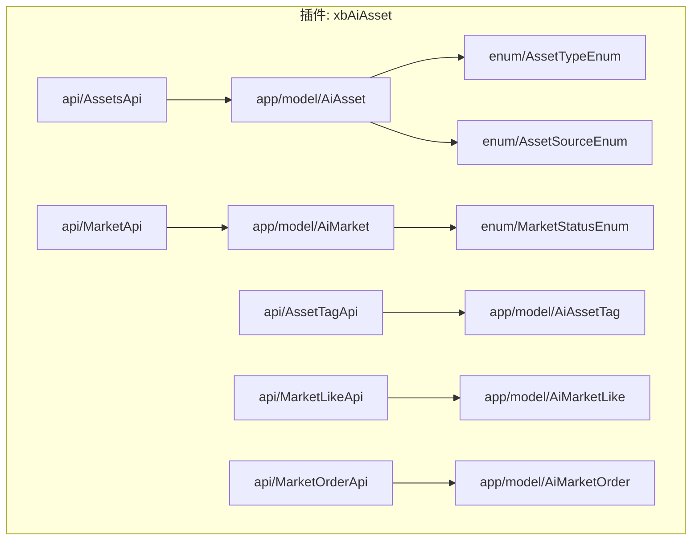
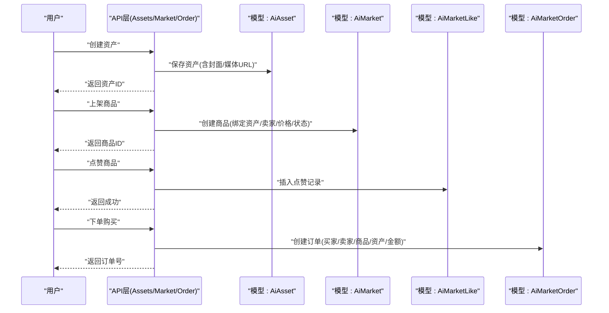
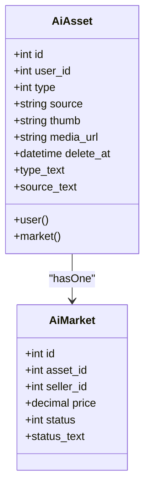
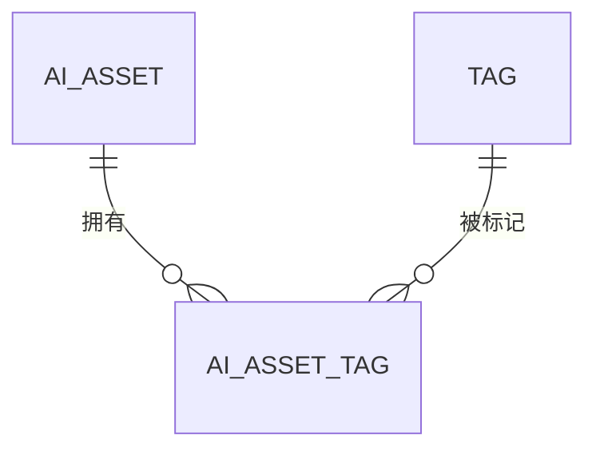
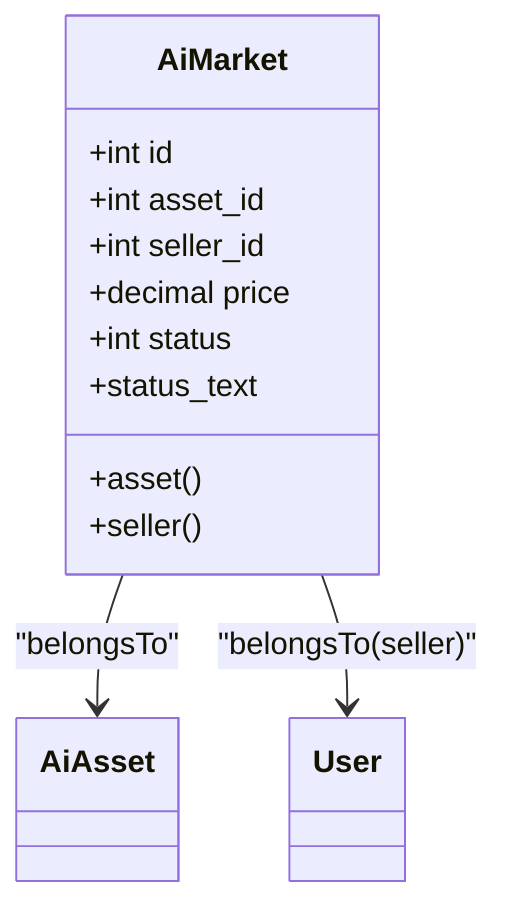
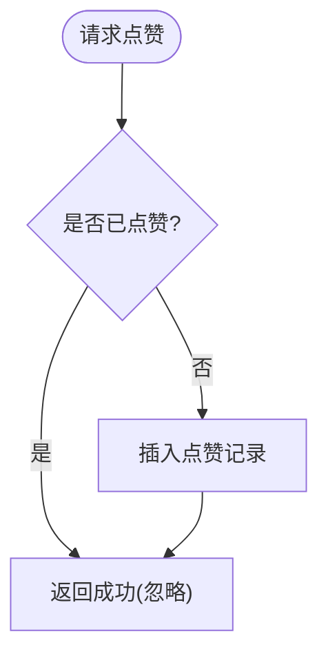
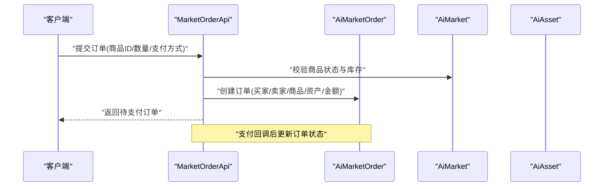
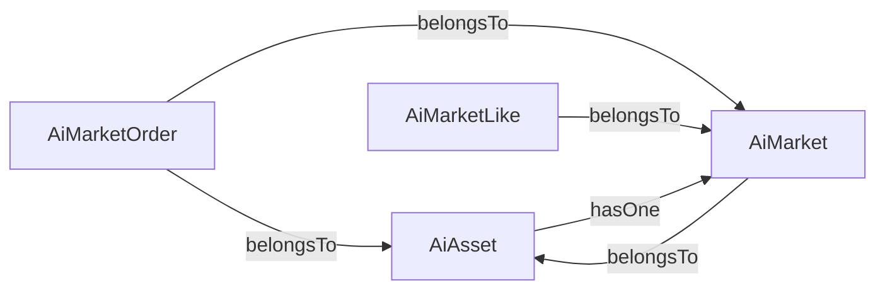

# 资产管理数据模型

<cite>
**本文引用的文件**   
- [AiAsset.php](file://server/plugin/xbAiAsset/app/model/AiAsset.php)
- [AiAssetTag.php](file://server/plugin/xbAiAsset/app/model/AiAssetTag.php)
- [AiMarket.php](file://server/plugin/xbAiAsset/app/model/AiMarket.php)
- [AiMarketLike.php](file://server/plugin/xbAiAsset/app/model/AiMarketLike.php)
- [AiMarketOrder.php](file://server/plugin/xbAiAsset/app/model/AiMarketOrder.php)
- [AssetTypeEnum.php](file://server/plugin/xbAiAsset/enum/AssetTypeEnum.php)
- [AssetSourceEnum.php](file://server/plugin/xbAiAsset/enum/AssetSourceEnum.php)
- [MarketStatusEnum.php](file://server/plugin/xbAiAsset/enum/MarketStatusEnum.php)
- [AssetsApi.php](file://server/plugin/xbAiAsset/api/AssetsApi.php)
- [AssetTagApi.php](file://server/plugin/xbAiAsset/api/AssetTagApi.php)
- [MarketApi.php](file://server/plugin/xbAiAsset/api/MarketApi.php)
- [MarketLikeApi.php](file://server/plugin/xbAiAsset/api/MarketLikeApi.php)
- [MarketOrderApi.php](file://server/plugin/xbAiAsset/api/MarketOrderApi.php)
</cite>

## 目录
1. [简介](#简介)
2. [项目结构](#项目结构)
3. [核心组件](#核心组件)
4. [架构总览](#架构总览)
5. [详细组件分析](#详细组件分析)
6. [依赖关系分析](#依赖关系分析)
7. [性能与索引优化](#性能与索引优化)
8. [故障排查指南](#故障排查指南)
9. [结论](#结论)
10. [附录](#附录)

## 简介
本文件面向“资产管理系统”的数据模型，聚焦以下核心表：ai_asset（资产主表）、ai_asset_tag（标签关联表）、ai_market（市场商品表）、ai_market_like（点赞表）、ai_market_order（订单表）。文档从数据模型、分类体系、标签管理、版本控制、交易流程、生命周期与权限、搜索索引优化、统计分析、审核流程、版权保护与商业价值评估等维度进行系统化阐述，帮助读者快速理解并落地实施。

## 项目结构
围绕资产与市场能力，后端以插件形式组织，核心代码位于 server/plugin/xbAiAsset 下：
- app/model：数据模型定义（资产、标签、市场、点赞、订单）
- api：对外接口控制器（资产、标签、市场、点赞、订单）
- enum：枚举类型（资产类型、来源、市场状态等）
- config/route/middleware：插件配置、路由与中间件

图表来源
- [AiAsset.php:1-127](file://server/plugin/xbAiAsset/app/model/AiAsset.php#L1-L127)
- [AiAssetTag.php:1-30](file://server/plugin/xbAiAsset/app/model/AiAssetTag.php#L1-L30)
- [AiMarket.php:1-51](file://server/plugin/xbAiAsset/app/model/AiMarket.php#L1-L51)
- [AiMarketLike.php:1-45](file://server/plugin/xbAiAsset/app/model/AiMarketLike.php#L1-L45)
- [AiMarketOrder.php:1-63](file://server/plugin/xbAiAsset/app/model/AiMarketOrder.php#L1-L63)
- [AssetTypeEnum.php](file://server/plugin/xbAiAsset/enum/AssetTypeEnum.php)
- [AssetSourceEnum.php](file://server/plugin/xbAiAsset/enum/AssetSourceEnum.php)
- [MarketStatusEnum.php](file://server/plugin/xbAiAsset/enum/MarketStatusEnum.php)
- [AssetsApi.php](file://server/plugin/xbAiAsset/api/AssetsApi.php)
- [AssetTagApi.php](file://server/plugin/xbAiAsset/api/AssetTagApi.php)
- [MarketApi.php](file://server/plugin/xbAiAsset/api/MarketApi.php)
- [MarketLikeApi.php](file://server/plugin/xbAiAsset/api/MarketLikeApi.php)
- [MarketOrderApi.php](file://server/plugin/xbAiAsset/api/MarketOrderApi.php)

章节来源
- [AiAsset.php:1-127](file://server/plugin/xbAiAsset/app/model/AiAsset.php#L1-L127)
- [AiAssetTag.php:1-30](file://server/plugin/xbAiAsset/app/model/AiAssetTag.php#L1-L30)
- [AiMarket.php:1-51](file://server/plugin/xbAiAsset/app/model/AiMarket.php#L1-L51)
- [AiMarketLike.php:1-45](file://server/plugin/xbAiAsset/app/model/AiMarketLike.php#L1-L45)
- [AiMarketOrder.php:1-63](file://server/plugin/xbAiAsset/app/model/AiMarketOrder.php#L1-L63)
- [AssetTypeEnum.php](file://server/plugin/xbAiAsset/enum/AssetTypeEnum.php)
- [AssetSourceEnum.php](file://server/plugin/xbAiAsset/enum/AssetSourceEnum.php)
- [MarketStatusEnum.php](file://server/plugin/xbAiAsset/enum/MarketStatusEnum.php)
- [AssetsApi.php](file://server/plugin/xbAiAsset/api/AssetsApi.php)
- [AssetTagApi.php](file://server/plugin/xbAiAsset/api/AssetTagApi.php)
- [MarketApi.php](file://server/plugin/xbAiAsset/api/MarketApi.php)
- [MarketLikeApi.php](file://server/plugin/xbAiAsset/api/MarketLikeApi.php)
- [MarketOrderApi.php](file://server/plugin/xbAiAsset/api/MarketOrderApi.php)

## 核心组件
本节对五个核心模型进行结构化说明，包括职责、关键属性与关联关系、以及对外暴露的文本化字段。

- ai_asset（资产主表）
  - 职责：存储AI素材的核心元数据与媒体地址，支持软删除；提供封面与媒体URL的自动转换。
  - 关键字段（示例）：id、user_id、type、source、thumb、media_url、delete_at 等。
  - 关联：用户 user()、市场上架 market()。
  - 文本化字段：type_text、source_text（由枚举解析）。
  - 参考路径：[AiAsset.php:1-127](file://server/plugin/xbAiAsset/app/model/AiAsset.php#L1-L127)

- ai_asset_tag（标签关联表）
  - 职责：记录资产与标签的关系，支撑多标签检索与展示。
  - 关键字段（示例）：id、asset_id、tag_id、uid 等。
  - 关联：用户 user()。
  - 参考路径：[AiAssetTag.php:1-30](file://server/plugin/xbAiAsset/app/model/AiAssetTag.php#L1-L30)

- ai_market（市场商品表）
  - 职责：将资产上架为可交易商品，记录卖家、价格、状态等。
  - 关键字段（示例）：id、asset_id、seller_id、price、status 等。
  - 关联：资产 asset()、卖家 seller()。
  - 文本化字段：status_text（由市场状态枚举解析）。
  - 参考路径：[AiMarket.php:1-51](file://server/plugin/xbAiAsset/app/model/AiMarket.php#L1-L51)

- ai_market_like（点赞表）
  - 职责：记录用户对商品的点赞行为，用于热度统计。
  - 关键字段（示例）：id、market_id、user_id 等。
  - 关联：商品 market()、用户 user()。
  - 注意：关闭自动更新时间，避免高频写入造成额外开销。
  - 参考路径：[AiMarketLike.php:1-45](file://server/plugin/xbAiAsset/app/model/AiMarketLike.php#L1-L45)

- ai_market_order（订单表）
  - 职责：记录购买交易，包含买家、卖家、商品与资产信息。
  - 关键字段（示例）：id、market_id、asset_id、buyer_id、seller_id、amount、status 等。
  - 关联：商品 market()、资产 asset()、买家 buyer()、卖家 seller()。
  - 注意：关闭自动更新时间，便于审计时间戳精确控制。
  - 参考路径：[AiMarketOrder.php:1-63](file://server/plugin/xbAiAsset/app/model/AiMarketOrder.php#L1-L63)

章节来源
- [AiAsset.php:1-127](file://server/plugin/xbAiAsset/app/model/AiAsset.php#L1-L127)
- [AiAssetTag.php:1-30](file://server/plugin/xbAiAsset/app/model/AiAssetTag.php#L1-L30)
- [AiMarket.php:1-51](file://server/plugin/xbAiAsset/app/model/AiMarket.php#L1-L51)
- [AiMarketLike.php:1-45](file://server/plugin/xbAiAsset/app/model/AiMarketLike.php#L1-L45)
- [AiMarketOrder.php:1-63](file://server/plugin/xbAiAsset/app/model/AiMarketOrder.php#L1-L63)

## 架构总览
下图展示了资产到市场的端到端数据流：资产创建后，经上架形成商品，用户可对商品点赞或下单购买，订单完成后产生收益与分发。

图表来源
- [AssetsApi.php](file://server/plugin/xbAiAsset/api/AssetsApi.php)
- [MarketApi.php](file://server/plugin/xbAiAsset/api/MarketApi.php)
- [MarketLikeApi.php](file://server/plugin/xbAiAsset/api/MarketLikeApi.php)
- [MarketOrderApi.php](file://server/plugin/xbAiAsset/api/MarketOrderApi.php)
- [AiAsset.php:1-127](file://server/plugin/xbAiAsset/app/model/AiAsset.php#L1-L127)
- [AiMarket.php:1-51](file://server/plugin/xbAiAsset/app/model/AiMarket.php#L1-L51)
- [AiMarketLike.php:1-45](file://server/plugin/xbAiAsset/app/model/AiMarketLike.php#L1-L45)
- [AiMarketOrder.php:1-63](file://server/plugin/xbAiAsset/app/model/AiMarketOrder.php#L1-L63)

## 详细组件分析

### 资产主表（ai_asset）
- 设计要点
  - 软删除：通过 delete_time 字段实现逻辑删除，便于恢复与审计。
  - 资源地址统一处理：封面 thumb 与媒体 media_url 在存取时自动转换为平台标准路径/URL，屏蔽底层存储差异。
  - 枚举映射：type 与 source 提供 text 访问器，便于前端直接显示可读文本。
- 关联关系
  - 用户：belongsTo User，标识资产所有者。
  - 商品：hasOne AiMarket，表示该资产是否已上架及商品信息。
- 复杂度与扩展
  - 建议在查询中按需加载 user 与 market 关联，避免 N+1。
  - 如需版本控制，可在上层引入版本表并通过外键指向资产主表。

图表来源
- [AiAsset.php:1-127](file://server/plugin/xbAiAsset/app/model/AiAsset.php#L1-L127)
- [AiMarket.php:1-51](file://server/plugin/xbAiAsset/app/model/AiMarket.php#L1-L51)

章节来源
- [AiAsset.php:1-127](file://server/plugin/xbAiAsset/app/model/AiAsset.php#L1-L127)

### 标签系统（ai_asset_tag）
- 设计要点
  - 多对多关系：一个资产可拥有多个标签，一个标签可被多个资产使用。
  - 用户维度：uid 可用于追踪标签归属或操作者。
- 使用建议
  - 标签聚合查询建议使用联合索引（asset_id, tag_id），提升过滤效率。
  - 热点标签可结合缓存加速热门检索。

章节来源
- [AiAssetTag.php:1-30](file://server/plugin/xbAiAsset/app/model/AiAssetTag.php#L1-L30)

### 市场商品（ai_market）
- 设计要点
  - 商品状态：通过 MarketStatusEnum 提供文本化展示，便于列表页渲染。
  - 卖家与资产：分别关联 User 与 AiAsset，确保交易主体与标的清晰。
- 业务约束
  - 同一资产仅允许一次有效上架（可通过唯一索引保障）。
  - 下架后禁止继续下单，需在订单创建前校验状态。

图表来源
- [AiMarket.php:1-51](file://server/plugin/xbAiAsset/app/model/AiMarket.php#L1-L51)
- [AiAsset.php:1-127](file://server/plugin/xbAiAsset/app/model/AiAsset.php#L1-L127)

章节来源
- [AiMarket.php:1-51](file://server/plugin/xbAiAsset/app/model/AiMarket.php#L1-L51)

### 点赞（ai_market_like）
- 设计要点
  - 幂等性：同一用户对同一商品只能点赞一次，需唯一约束（user_id, market_id）。
  - 性能：关闭自动更新时间，减少写放大。
- 统计用途
  - 按商品维度 COUNT(user_id) 得到点赞数，用于排序与推荐。

图表来源
- [AiMarketLike.php:1-45](file://server/plugin/xbAiAsset/app/model/AiMarketLike.php#L1-L45)

章节来源
- [AiMarketLike.php:1-45](file://server/plugin/xbAiAsset/app/model/AiMarketLike.php#L1-L45)

### 订单（ai_market_order）
- 设计要点
  - 交易主体：买家 buyer、卖家 seller、商品 market、标的 asset。
  - 幂等与一致性：订单号全局唯一；支付回调需幂等更新订单状态。
  - 审计：关闭自动更新时间，便于精确记录关键事件时间。
- 业务流程
  - 下单前校验：商品存在且处于可售状态、买家未重复购买。
  - 支付成功后：更新订单状态、发放下载权限或数字凭证。

图表来源
- [MarketOrderApi.php](file://server/plugin/xbAiAsset/api/MarketOrderApi.php)
- [AiMarketOrder.php:1-63](file://server/plugin/xbAiAsset/app/model/AiMarketOrder.php#L1-L63)
- [AiMarket.php:1-51](file://server/plugin/xbAiAsset/app/model/AiMarket.php#L1-L51)
- [AiAsset.php:1-127](file://server/plugin/xbAiAsset/app/model/AiAsset.php#L1-L127)

章节来源
- [AiMarketOrder.php:1-63](file://server/plugin/xbAiAsset/app/model/AiMarketOrder.php#L1-L63)

### 资产分类体系
- 分类维度
  - 类型：通过 AssetTypeEnum 定义（如图片、音频、视频、模型等）。
  - 来源：通过 AssetSourceEnum 定义（如用户上传、系统生成、第三方导入等）。
- 应用建议
  - 列表筛选：基于 type/source 组合条件，配合分页与排序。
  - 权限控制：不同来源可能对应不同的可见性与使用范围。

章节来源
- [AssetTypeEnum.php](file://server/plugin/xbAiAsset/enum/AssetTypeEnum.php)
- [AssetSourceEnum.php](file://server/plugin/xbAiAsset/enum/AssetSourceEnum.php)
- [AiAsset.php:1-127](file://server/plugin/xbAiAsset/app/model/AiAsset.php#L1-L127)

### 版本控制机制
- 现状与建议
  - 当前模型未内置版本表。建议在资产层面引入版本表（asset_version），通过 asset_id 外键关联，记录每次变更的快照与发布状态。
  - 发布策略：草稿→待审→已发布→已归档，配合状态机与审计日志。
- 影响面
  - 资产详情、商品展示、历史回溯、回滚与对比均依赖版本表。

[本节为概念性设计，不直接分析具体文件]

### 资产生命周期管理
- 阶段划分
  - 创建：上传媒体、填写元数据、选择类型与来源。
  - 审核：内容合规、版权核验、质量评分。
  - 上架：设置价格、可见范围、授权条款。
  - 销售：下单、支付、交付。
  - 归档：下架、隐藏、冷备。
- 状态流转
  - 通过状态字段与事件驱动（如 AssetEventEnum、TagEventEnum）推进生命周期。

章节来源
- [AiAsset.php:1-127](file://server/plugin/xbAiAsset/app/model/AiAsset.php#L1-L127)
- [MarketStatusEnum.php](file://server/plugin/xbAiAsset/enum/MarketStatusEnum.php)

### 权限控制策略
- 角色与资源
  - 资产所有者：拥有编辑、下架、删除权限。
  - 买家：获得购买后的使用权（可结合授权码或下载链接）。
  - 管理员：具备审核、封禁、全局统计权限。
- 实现建议
  - 在 API 层做 RBAC 校验，结合用户上下文（token）判断 owner/seller/buyer/admin。
  - 敏感操作（下架、删除）需二次确认与审计日志。

章节来源
- [AssetsApi.php](file://server/plugin/xbAiAsset/api/AssetsApi.php)
- [MarketApi.php](file://server/plugin/xbAiAsset/api/MarketApi.php)
- [MarketOrderApi.php](file://server/plugin/xbAiAsset/api/MarketOrderApi.php)

### 搜索索引优化
- 数据库索引
  - ai_asset：type、source、user_id、create_time 建立复合索引，加速筛选与排序。
  - ai_asset_tag：(asset_id, tag_id) 唯一索引，加速关联查询与去重。
  - ai_market：(asset_id)、(seller_id)、(status) 索引，加速商品列表与状态过滤。
  - ai_market_like：(market_id, user_id) 唯一索引，防止重复点赞。
  - ai_market_order：(market_id)、(buyer_id)、(seller_id)、(status) 索引，加速交易查询。
- 缓存与搜索引擎
  - 热榜与推荐：使用 Redis 维护点赞排行与热销排行。
  - 全文检索：标题/描述/标签可使用 ES 或数据库全文索引。

[本节为通用优化建议，不直接分析具体文件]

### 统计分析功能
- 指标
  - 资产：浏览量、收藏量、下载量、收入。
  - 商品：曝光、点击、转化、退款率。
  - 用户：活跃度、贡献度、复购率。
- 实现思路
  - 增量统计：点赞、订单等高频事件采用原子计数或队列落盘。
  - 离线报表：定时任务汇总日/周/月报表，供运营看板使用。

[本节为通用设计建议，不直接分析具体文件]

### 资产审核流程
- 流程节点
  - 提交审核 → 人工/自动审核 → 通过/驳回 → 上架/修改。
- 数据支撑
  - 审核结果与意见可记录在资产扩展字段或独立审核表。
  - 审核通过后触发上架流程（创建或更新 ai_market）。

章节来源
- [AiAsset.php:1-127](file://server/plugin/xbAiAsset/app/model/AiAsset.php#L1-L127)
- [AiMarket.php:1-51](file://server/plugin/xbAiAsset/app/model/AiMarket.php#L1-L51)

### 版权保护机制
- 技术措施
  - 数字水印：在媒体文件中嵌入不可见水印。
  - 访问控制：短时效签名链接、防盗链、IP/UA限制。
  - 授权凭证：订单完成后下发一次性下载令牌或许可证。
- 法律与合规
  - 上传者签署原创声明与授权协议。
  - 侵权举报与下架流程闭环。

[本节为通用设计建议，不直接分析具体文件]

### 商业价值评估模型
- 评估维度
  - 热度：点赞、浏览、下载、转化率。
  - 稀缺性：同类型资产数量、供给弹性。
  - 质量：评分、复购率、退货率。
  - 收益：单价、销量、分成比例。
- 计算方式
  - 加权评分 = α·热度 + β·稀缺性 + γ·质量 + δ·收益。
  - 动态调价：根据供需与评价调整价格区间。

[本节为通用设计建议，不直接分析具体文件]

## 依赖关系分析
- 模型间依赖
  - AiAsset ↔ AiMarket：一对零/一（资产可不上架）。
  - AiMarket → AiAsset：商品指向资产。
  - AiMarketLike → AiMarket：点赞指向商品。
  - AiMarketOrder → AiMarket/AiAsset：订单同时指向商品与资产。
- 枚举依赖
  - AiAsset 依赖 AssetTypeEnum、AssetSourceEnum。
  - AiMarket 依赖 MarketStatusEnum。

图表来源
- [AiAsset.php:1-127](file://server/plugin/xbAiAsset/app/model/AiAsset.php#L1-L127)
- [AiMarket.php:1-51](file://server/plugin/xbAiAsset/app/model/AiMarket.php#L1-L51)
- [AiMarketLike.php:1-45](file://server/plugin/xbAiAsset/app/model/AiMarketLike.php#L1-L45)
- [AiMarketOrder.php:1-63](file://server/plugin/xbAiAsset/app/model/AiMarketOrder.php#L1-L63)

章节来源
- [AiAsset.php:1-127](file://server/plugin/xbAiAsset/app/model/AiAsset.php#L1-L127)
- [AiMarket.php:1-51](file://server/plugin/xbAiAsset/app/model/AiMarket.php#L1-L51)
- [AiMarketLike.php:1-45](file://server/plugin/xbAiAsset/app/model/AiMarketLike.php#L1-L45)
- [AiMarketOrder.php:1-63](file://server/plugin/xbAiAsset/app/model/AiMarketOrder.php#L1-L63)

## 性能与索引优化
- 读写分离：读多写少场景（商品列表、详情）启用只读副本。
- 连接池与缓存：Redis 缓存热点商品与排行榜，降低数据库压力。
- 批量写入：点赞与埋点事件采用队列异步落库。
- 分页与游标：大数据集使用游标分页替代 offset。
- 冷热分层：历史订单归档至冷存储，在线库保留近期数据。

[本节为通用优化建议，不直接分析具体文件]

## 故障排查指南
- 常见问题
  - 重复点赞：检查 (market_id, user_id) 唯一索引与幂等逻辑。
  - 订单重复创建：校验订单号唯一性与支付回调幂等。
  - 商品不可售：下单前校验商品状态与有效期。
  - 媒体无法访问：核对封面与媒体URL转换逻辑与存储配置。
- 定位手段
  - 开启慢查询日志，定位高耗时SQL。
  - 监控错误日志与异常堆栈，结合请求ID追踪链路。
  - 针对高频接口增加限流与熔断。

章节来源
- [AiMarketLike.php:1-45](file://server/plugin/xbAiAsset/app/model/AiMarketLike.php#L1-L45)
- [AiMarketOrder.php:1-63](file://server/plugin/xbAiAsset/app/model/AiMarketOrder.php#L1-L63)
- [AiAsset.php:1-127](file://server/plugin/xbAiAsset/app/model/AiAsset.php#L1-L127)

## 结论
本数据模型围绕“资产—商品—交易”的主线构建，覆盖资产全生命周期与市场化交易的关键环节。通过合理的索引设计与幂等控制，可保障系统在规模增长下的稳定性与可扩展性。后续建议引入版本控制、审核工作流与更完善的版权保护与商业化评估模块，进一步提升平台治理能力与商业价值。

## 附录
- 相关API入口
  - 资产：[AssetsApi.php](file://server/plugin/xbAiAsset/api/AssetsApi.php)
  - 标签：[AssetTagApi.php](file://server/plugin/xbAiAsset/api/AssetTagApi.php)
  - 市场：[MarketApi.php](file://server/plugin/xbAiAsset/api/MarketApi.php)
  - 点赞：[MarketLikeApi.php](file://server/plugin/xbAiAsset/api/MarketLikeApi.php)
  - 订单：[MarketOrderApi.php](file://server/plugin/xbAiAsset/api/MarketOrderApi.php)