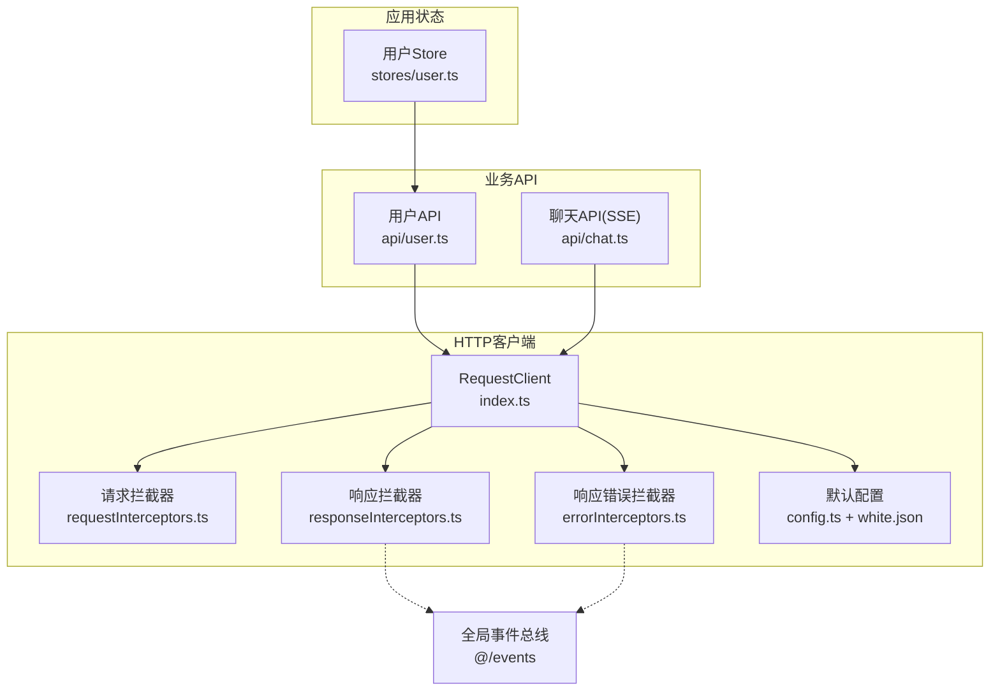
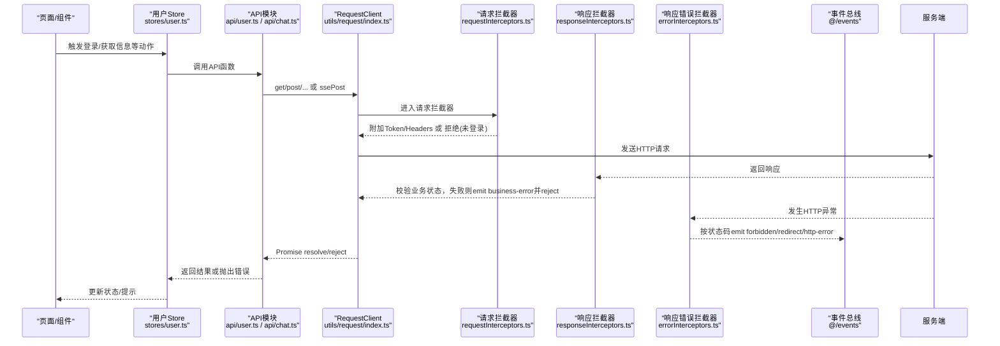
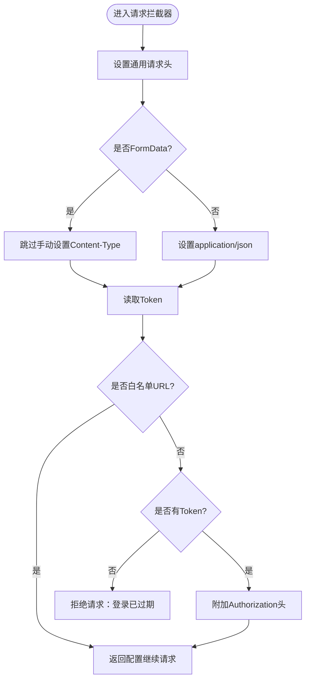
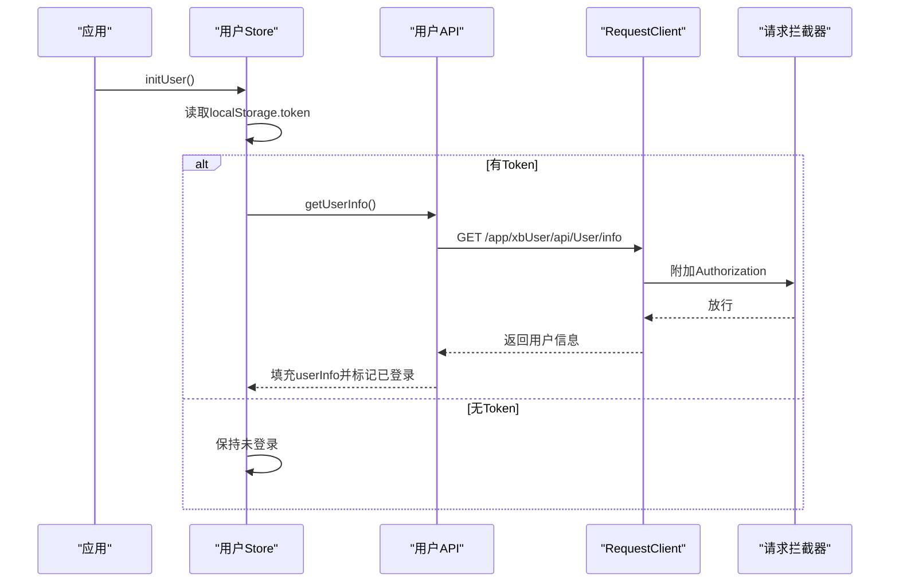
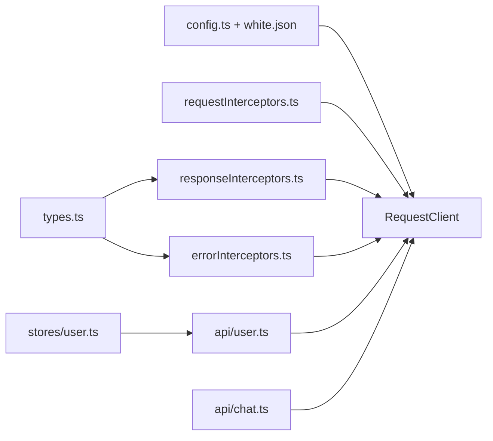

# HTTP客户端与API封装

<cite>
**本文引用的文件列表**   
- [frontend/src/utils/request/index.ts](file://frontend/src/utils/request/index.ts)
- [frontend/src/utils/request/config.ts](file://frontend/src/utils/request/config.ts)
- [frontend/src/utils/request/white.json](file://frontend/src/utils/request/white.json)
- [frontend/src/utils/request/requestInterceptors.ts](file://frontend/src/utils/request/requestInterceptors.ts)
- [frontend/src/utils/request/responseInterceptors.ts](file://frontend/src/utils/request/responseInterceptors.ts)
- [frontend/src/utils/request/errorInterceptors.ts](file://frontend/src/utils/request/errorInterceptors.ts)
- [frontend/src/utils/request/types.ts](file://frontend/src/utils/request/types.ts)
- [frontend/src/api/user.ts](file://frontend/src/api/user.ts)
- [frontend/src/api/chat.ts](file://frontend/src/api/chat.ts)
- [frontend/src/stores/user.ts](file://frontend/src/stores/user.ts)
</cite>

## 目录
1. [简介](#简介)
2. [项目结构](#项目结构)
3. [核心组件](#核心组件)
4. [架构总览](#架构总览)
5. [详细组件分析](#详细组件分析)
6. [依赖关系分析](#依赖关系分析)
7. [性能与优化](#性能与优化)
8. [故障排查指南](#故障排查指南)
9. [结论](#结论)
10. [附录：最佳实践与示例路径](#附录最佳实践与示例路径)

## 简介
本文件面向积木云AI创作平台的前端HTTP层，系统化梳理基于Axios的HTTP客户端封装与API调用规范。内容涵盖请求拦截器、响应拦截器、错误处理机制、认证令牌管理、白名单策略、超时控制、上传与SSE流式请求等，并提供类型安全保证与Mock数据支持建议，帮助开发者在统一网络层之上构建稳定、可观测、易维护的业务接口。

## 项目结构
前端HTTP相关代码集中在 utils/request 目录，API定义位于 api 目录，状态管理与登录态由 stores 管理。整体分层清晰：
- 配置与白名单：config.ts、white.json
- 客户端与通用方法：index.ts（RequestClient）
- 拦截器：requestInterceptors.ts、responseInterceptors.ts、errorInterceptors.ts
- 事件类型与映射：types.ts
- API模块：api/*.ts
- 状态与登录态：stores/user.ts

图表来源
- [frontend/src/utils/request/index.ts:32-58](file://frontend/src/utils/request/index.ts#L32-L58)
- [frontend/src/utils/request/config.ts:1-39](file://frontend/src/utils/request/config.ts#L1-L39)
- [frontend/src/utils/request/white.json:1-28](file://frontend/src/utils/request/white.json#L1-L28)
- [frontend/src/utils/request/requestInterceptors.ts:1-47](file://frontend/src/utils/request/requestInterceptors.ts#L1-L47)
- [frontend/src/utils/request/responseInterceptors.ts:1-24](file://frontend/src/utils/request/responseInterceptors.ts#L1-L24)
- [frontend/src/utils/request/errorInterceptors.ts:1-57](file://frontend/src/utils/request/errorInterceptors.ts#L1-L57)
- [frontend/src/api/user.ts:1-226](file://frontend/src/api/user.ts#L1-L226)
- [frontend/src/api/chat.ts:1-60](file://frontend/src/api/chat.ts#L1-L60)
- [frontend/src/stores/user.ts:1-327](file://frontend/src/stores/user.ts#L1-L327)

章节来源
- [frontend/src/utils/request/index.ts:1-237](file://frontend/src/utils/request/index.ts#L1-L237)
- [frontend/src/utils/request/config.ts:1-39](file://frontend/src/utils/request/config.ts#L1-L39)
- [frontend/src/utils/request/white.json:1-28](file://frontend/src/utils/request/white.json#L1-L28)
- [frontend/src/utils/request/requestInterceptors.ts:1-47](file://frontend/src/utils/request/requestInterceptors.ts#L1-L47)
- [frontend/src/utils/request/responseInterceptors.ts:1-24](file://frontend/src/utils/request/responseInterceptors.ts#L1-L24)
- [frontend/src/utils/request/errorInterceptors.ts:1-57](file://frontend/src/utils/request/errorInterceptors.ts#L1-L57)
- [frontend/src/utils/request/types.ts:1-40](file://frontend/src/utils/request/types.ts#L1-L40)
- [frontend/src/api/user.ts:1-226](file://frontend/src/api/user.ts#L1-L226)
- [frontend/src/api/chat.ts:1-60](file://frontend/src/api/chat.ts#L1-L60)
- [frontend/src/stores/user.ts:1-327](file://frontend/src/stores/user.ts#L1-L327)

## 核心组件
- RequestClient：封装Axios实例，提供get/post/put/delete/upload/ssePost等方法，统一返回业务data字段，内置上传进度与取消能力。
- 请求拦截器：自动设置通用请求头；根据白名单决定是否携带Authorization；非白名单且无Token时拒绝请求。
- 响应拦截器：对业务状态码进行判断，非成功则广播“业务错误”事件并reject。
- 响应错误拦截器：按HTTP状态码分类广播事件（如403、301、302、其他http-error），并reject。
- 配置与白名单：BASE_URL、默认超时、白名单加载与匹配逻辑。
- 事件类型：统一的错误事件名称与负载结构，便于全局监听与集中处理。

章节来源
- [frontend/src/utils/request/index.ts:32-233](file://frontend/src/utils/request/index.ts#L32-L233)
- [frontend/src/utils/request/requestInterceptors.ts:1-47](file://frontend/src/utils/request/requestInterceptors.ts#L1-L47)
- [frontend/src/utils/request/responseInterceptors.ts:1-24](file://frontend/src/utils/request/responseInterceptors.ts#L1-L24)
- [frontend/src/utils/request/errorInterceptors.ts:1-57](file://frontend/src/utils/request/errorInterceptors.ts#L1-L57)
- [frontend/src/utils/request/config.ts:1-39](file://frontend/src/utils/request/config.ts#L1-L39)
- [frontend/src/utils/request/types.ts:1-40](file://frontend/src/utils/request/types.ts#L1-L40)

## 架构总览
下图展示了从业务API到网络层的完整调用链，包括拦截器、事件广播与SSE流式处理。

图表来源
- [frontend/src/utils/request/index.ts:32-233](file://frontend/src/utils/request/index.ts#L32-L233)
- [frontend/src/utils/request/requestInterceptors.ts:1-47](file://frontend/src/utils/request/requestInterceptors.ts#L1-L47)
- [frontend/src/utils/request/responseInterceptors.ts:1-24](file://frontend/src/utils/request/responseInterceptors.ts#L1-L24)
- [frontend/src/utils/request/errorInterceptors.ts:1-57](file://frontend/src/utils/request/errorInterceptors.ts#L1-L57)
- [frontend/src/api/user.ts:1-226](file://frontend/src/api/user.ts#L1-L226)
- [frontend/src/api/chat.ts:1-60](file://frontend/src/api/chat.ts#L1-L60)
- [frontend/src/stores/user.ts:1-327](file://frontend/src/stores/user.ts#L1-L327)

## 详细组件分析

### 请求拦截器（认证与白名单）
- 功能要点
  - 统一设置 accept、X-Requested-With 等请求头。
  - 非FormData请求设置 Content-Type: application/json；FormData交由浏览器自动生成boundary。
  - 白名单接口无需Token；非白名单接口若无Token直接拒绝。
  - 通过注入的 getToken 函数读取当前令牌，并以 Bearer 形式写入 Authorization。
- 白名单匹配
  - 支持精确匹配与通配符匹配（*）。
  - URL规范化：若传入相对路径不带前导斜杠，自动补全。
- 典型场景
  - 登录、注册、验证码、公开资源访问走白名单。
  - 受保护接口必须携带有效Token。

图表来源
- [frontend/src/utils/request/requestInterceptors.ts:1-47](file://frontend/src/utils/request/requestInterceptors.ts#L1-L47)
- [frontend/src/utils/request/config.ts:12-39](file://frontend/src/utils/request/config.ts#L12-L39)
- [frontend/src/utils/request/white.json:1-28](file://frontend/src/utils/request/white.json#L1-L28)

章节来源
- [frontend/src/utils/request/requestInterceptors.ts:1-47](file://frontend/src/utils/request/requestInterceptors.ts#L1-L47)
- [frontend/src/utils/request/config.ts:12-39](file://frontend/src/utils/request/config.ts#L12-L39)
- [frontend/src/utils/request/white.json:1-28](file://frontend/src/utils/request/white.json#L1-L28)

### 响应拦截器（业务状态校验与事件广播）
- 功能要点
  - 当后端返回的业务状态码非成功（status !== 0）时，广播“business-error”事件并reject。
  - 成功时透传Axios响应对象，供上层按需使用。
- 事件负载
  - 包含type、message、status、url、response等字段，便于全局统一处理。

章节来源
- [frontend/src/utils/request/responseInterceptors.ts:1-24](file://frontend/src/utils/request/responseInterceptors.ts#L1-L24)
- [frontend/src/utils/request/types.ts:1-40](file://frontend/src/utils/request/types.ts#L1-L40)

### 响应错误拦截器（HTTP级错误分类）
- 功能要点
  - 针对HTTP状态码进行分类广播：
    - 403：权限不足
    - 301/302：重定向（附带location信息）
    - 其他：通用http-error
  - 最终均reject，使调用方可捕获统一错误消息。
- 事件总线
  - 通过全局事件总线发布错误事件，便于UI层集中展示或执行跳转等逻辑。

章节来源
- [frontend/src/utils/request/errorInterceptors.ts:1-57](file://frontend/src/utils/request/errorInterceptors.ts#L1-L57)
- [frontend/src/utils/request/types.ts:1-40](file://frontend/src/utils/request/types.ts#L1-L40)

### 上传与SSE流式请求
- 文件上传
  - 支持 onProgress 回调，percent范围0~100。
  - 支持 extraData 附加表单字段。
  - 支持 fieldName 自定义文件字段名。
  - 支持 AbortController 取消上传。
  - 上传请求不设置超时（timeout: 0），避免大文件中断。
- SSE流式POST
  - 内部使用XMLHttpRequest解析text/event-stream。
  - 自动附加Authorization头（若存在Token）。
  - 支持onChunk逐块回调文本片段，支持AbortSignal取消。
  - 兼容多种常见SSE载荷结构，容错解析。

章节来源
- [frontend/src/utils/request/index.ts:82-227](file://frontend/src/utils/request/index.ts#L82-L227)

### 配置与环境
- BASE_URL
  - 优先使用环境变量 VITE_API_BASE_URL，否则回退为 /proxy。
- 默认超时
  - 默认30秒，可在创建实例时覆盖。
- 白名单
  - 从 white.json 动态加载，支持通配符匹配。

章节来源
- [frontend/src/utils/request/config.ts:1-39](file://frontend/src/utils/request/config.ts#L1-L39)
- [frontend/src/utils/request/white.json:1-28](file://frontend/src/utils/request/white.json#L1-L28)

### 类型安全与API封装
- 类型安全
  - API函数以泛型声明返回类型，确保TS推断正确。
  - 参数与返回结构均定义TypeScript接口，减少运行时错误。
- 示例API
  - 用户模块：登录、注册、获取用户信息、修改资料、重置密码、验证码、退出登录等。
  - 聊天模块：SSE流式对话，支持温度、top_p、max_tokens等参数。

章节来源
- [frontend/src/api/user.ts:1-226](file://frontend/src/api/user.ts#L1-L226)
- [frontend/src/api/chat.ts:1-60](file://frontend/src/api/chat.ts#L1-L60)

### 认证令牌处理与登录流程
- 令牌存储
  - Token保存在localStorage中，键名为 token。
- 初始化
  - 应用启动时尝试读取本地Token并拉取用户信息，失败则清理登录态。
- 登录流程
  - 调用登录接口成功后保存access_token，随后拉取用户信息并标记已登录。
- 登出流程
  - 调用服务端退出接口后，清理本地Token与用户信息。

图表来源
- [frontend/src/stores/user.ts:54-85](file://frontend/src/stores/user.ts#L54-L85)
- [frontend/src/api/user.ts:167-169](file://frontend/src/api/user.ts#L167-L169)
- [frontend/src/utils/request/requestInterceptors.ts:23-37](file://frontend/src/utils/request/requestInterceptors.ts#L23-L37)

章节来源
- [frontend/src/stores/user.ts:38-170](file://frontend/src/stores/user.ts#L38-L170)
- [frontend/src/api/user.ts:153-226](file://frontend/src/api/user.ts#L153-L226)
- [frontend/src/utils/request/requestInterceptors.ts:1-47](file://frontend/src/utils/request/requestInterceptors.ts#L1-L47)

## 依赖关系分析
- 低耦合高内聚
  - RequestClient仅依赖配置与拦截器，API模块仅依赖RequestClient暴露的方法。
- 事件解耦
  - 错误处理通过事件总线解耦，UI层可订阅统一事件进行集中处理。
- 白名单驱动
  - 白名单集中管理，新增公开接口只需在white.json中添加，无需改动拦截器逻辑。

图表来源
- [frontend/src/utils/request/index.ts:32-58](file://frontend/src/utils/request/index.ts#L32-L58)
- [frontend/src/utils/request/config.ts:1-39](file://frontend/src/utils/request/config.ts#L1-L39)
- [frontend/src/utils/request/white.json:1-28](file://frontend/src/utils/request/white.json#L1-L28)
- [frontend/src/utils/request/requestInterceptors.ts:1-47](file://frontend/src/utils/request/requestInterceptors.ts#L1-L47)
- [frontend/src/utils/request/responseInterceptors.ts:1-24](file://frontend/src/utils/request/responseInterceptors.ts#L1-L24)
- [frontend/src/utils/request/errorInterceptors.ts:1-57](file://frontend/src/utils/request/errorInterceptors.ts#L1-L57)
- [frontend/src/utils/request/types.ts:1-40](file://frontend/src/utils/request/types.ts#L1-L40)
- [frontend/src/api/user.ts:1-226](file://frontend/src/api/user.ts#L1-L226)
- [frontend/src/api/chat.ts:1-60](file://frontend/src/api/chat.ts#L1-L60)
- [frontend/src/stores/user.ts:1-327](file://frontend/src/stores/user.ts#L1-L327)

章节来源
- [frontend/src/utils/request/index.ts:1-237](file://frontend/src/utils/request/index.ts#L1-L237)
- [frontend/src/utils/request/config.ts:1-39](file://frontend/src/utils/request/config.ts#L1-L39)
- [frontend/src/utils/request/white.json:1-28](file://frontend/src/utils/request/white.json#L1-L28)
- [frontend/src/utils/request/requestInterceptors.ts:1-47](file://frontend/src/utils/request/requestInterceptors.ts#L1-L47)
- [frontend/src/utils/request/responseInterceptors.ts:1-24](file://frontend/src/utils/request/responseInterceptors.ts#L1-L24)
- [frontend/src/utils/request/errorInterceptors.ts:1-57](file://frontend/src/utils/request/errorInterceptors.ts#L1-L57)
- [frontend/src/utils/request/types.ts:1-40](file://frontend/src/utils/request/types.ts#L1-L40)
- [frontend/src/api/user.ts:1-226](file://frontend/src/api/user.ts#L1-L226)
- [frontend/src/api/chat.ts:1-60](file://frontend/src/api/chat.ts#L1-L60)
- [frontend/src/stores/user.ts:1-327](file://frontend/src/stores/user.ts#L1-L327)

## 性能与优化
- 超时控制
  - 默认30秒，适合常规REST接口；上传接口关闭超时以避免大文件中断。
- 并发与重复请求
  - 用户信息初始化采用Promise缓存，防止刷新时并发重复请求。
- 事件驱动的错误处理
  - 将错误分类广播至事件总线，避免在各处重复实现错误提示逻辑。
- 白名单与鉴权
  - 白名单减少不必要的鉴权开销；非白名单强制鉴权，提升安全性。
- 可扩展点
  - 重试策略：可在请求拦截器中结合指数退避实现幂等GET重试。
  - 缓存策略：可对只读GET请求增加内存缓存或持久化缓存（需考虑失效策略）。
  - 监控埋点：在响应拦截器中记录耗时、成功率、错误分布等指标。

[本节为通用指导，不直接分析具体文件]

## 故障排查指南
- 常见问题定位
  - 未登录访问受保护接口：检查白名单配置与Token是否存在。
  - 业务错误：查看响应拦截器抛出的business-error事件负载中的msg与status。
  - 权限不足：关注403事件，确认角色权限或Token有效性。
  - 重定向问题：301/302事件中检查location头与跨域配置。
  - 网络异常：http-error事件中包含原始响应与状态码，便于定位。
- 调试建议
  - 在浏览器Network面板观察请求头是否包含Authorization与Content-Type。
  - 在控制台订阅全局错误事件，打印完整payload。
  - 对于SSE流式请求，检查onChunk回调是否被持续触发，以及AbortSignal是否正确释放。

章节来源
- [frontend/src/utils/request/responseInterceptors.ts:1-24](file://frontend/src/utils/request/responseInterceptors.ts#L1-L24)
- [frontend/src/utils/request/errorInterceptors.ts:1-57](file://frontend/src/utils/request/errorInterceptors.ts#L1-L57)
- [frontend/src/utils/request/types.ts:1-40](file://frontend/src/utils/request/types.ts#L1-L40)

## 结论
该HTTP客户端封装以RequestClient为核心，配合请求/响应拦截器与事件总线，实现了统一的鉴权、错误处理与扩展点。通过白名单与类型安全的API封装，既保证了安全性与可维护性，也为后续引入重试、缓存、监控等能力提供了良好基础。建议在现有基础上逐步完善重试与缓存策略，并完善全局错误监控与告警。

[本节为总结，不直接分析具体文件]

## 附录：最佳实践与示例路径
- 类型安全
  - 在API函数中使用泛型声明返回类型，并在参数处定义接口，确保编译期类型检查。
  - 参考路径：
    - [用户API类型与函数定义:1-226](file://frontend/src/api/user.ts#L1-L226)
    - [聊天API类型与SSE调用:1-60](file://frontend/src/api/chat.ts#L1-L60)
- Mock数据支持
  - 在开发环境可通过Vite代理或本地Mock服务拦截请求，返回模拟数据。
  - 建议在API层抽象出可替换的数据源，以便在测试与开发环境中切换。
- 上传最佳实践
  - 使用upload方法的onProgress回调更新进度条，支持extraData附加元数据。
  - 使用AbortController支持取消上传，避免长时间占用资源。
  - 参考路径：
    - [上传方法实现:82-121](file://frontend/src/utils/request/index.ts#L82-L121)
- SSE流式最佳实践
  - 使用chat方法传入onChunk回调渲染增量文本，注意在组件卸载时传递AbortSignal取消请求。
  - 参考路径：
    - [SSE方法实现:132-227](file://frontend/src/utils/request/index.ts#L132-L227)
    - [聊天API调用:47-60](file://frontend/src/api/chat.ts#L47-L60)
- 认证与登录态
  - 登录后保存access_token，并在初始化时拉取用户信息；登出时清理本地状态。
  - 参考路径：
    - [用户Store登录/初始化/登出:54-170](file://frontend/src/stores/user.ts#L54-L170)
    - [请求拦截器鉴权逻辑:23-37](file://frontend/src/utils/request/requestInterceptors.ts#L23-L37)
- 错误处理与监控
  - 订阅全局错误事件，统一展示错误提示或执行跳转。
  - 参考路径：
    - [业务错误广播:10-23](file://frontend/src/utils/request/responseInterceptors.ts#L10-L23)
    - [HTTP错误分类广播:10-56](file://frontend/src/utils/request/errorInterceptors.ts#L10-L56)
    - [事件类型与映射:1-40](file://frontend/src/utils/request/types.ts#L1-L40)