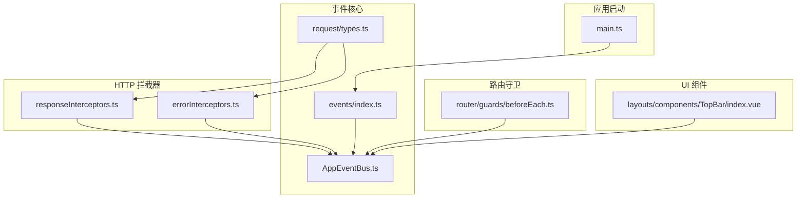
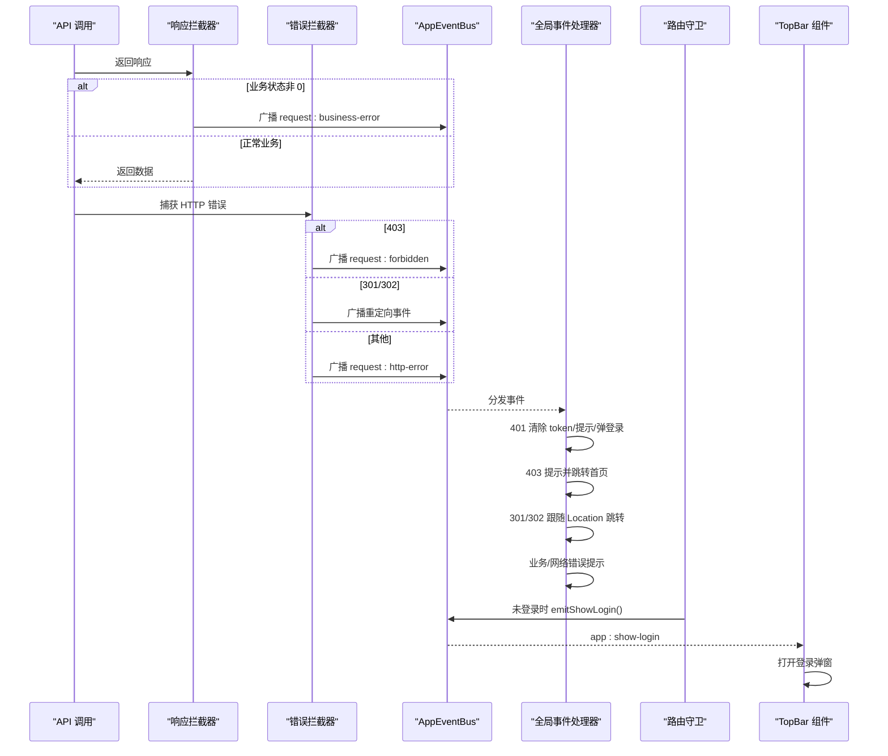
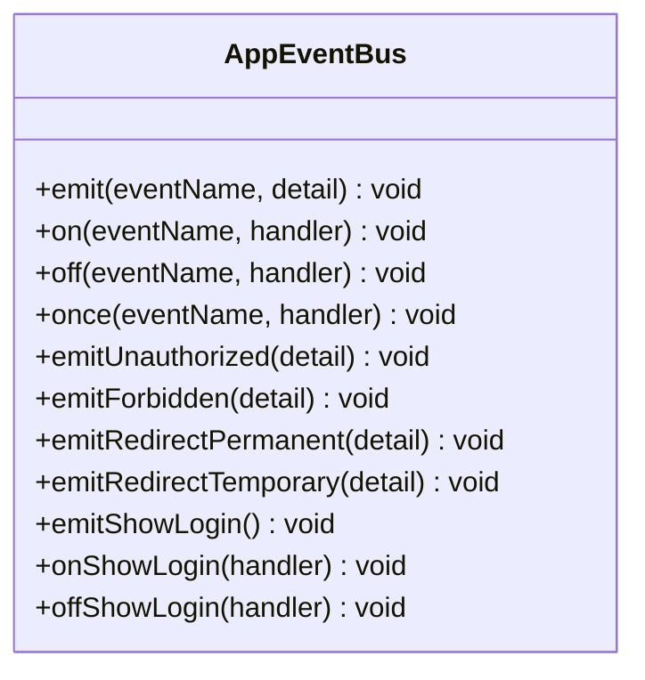
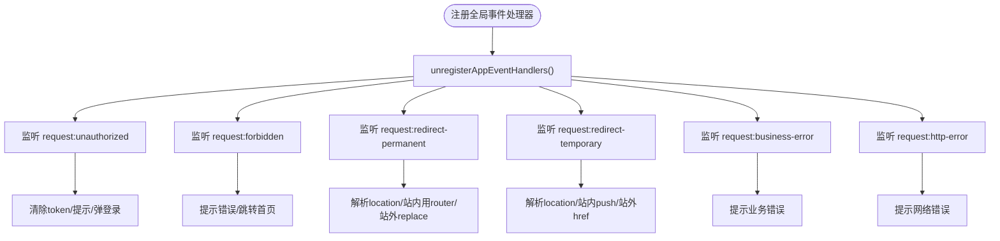
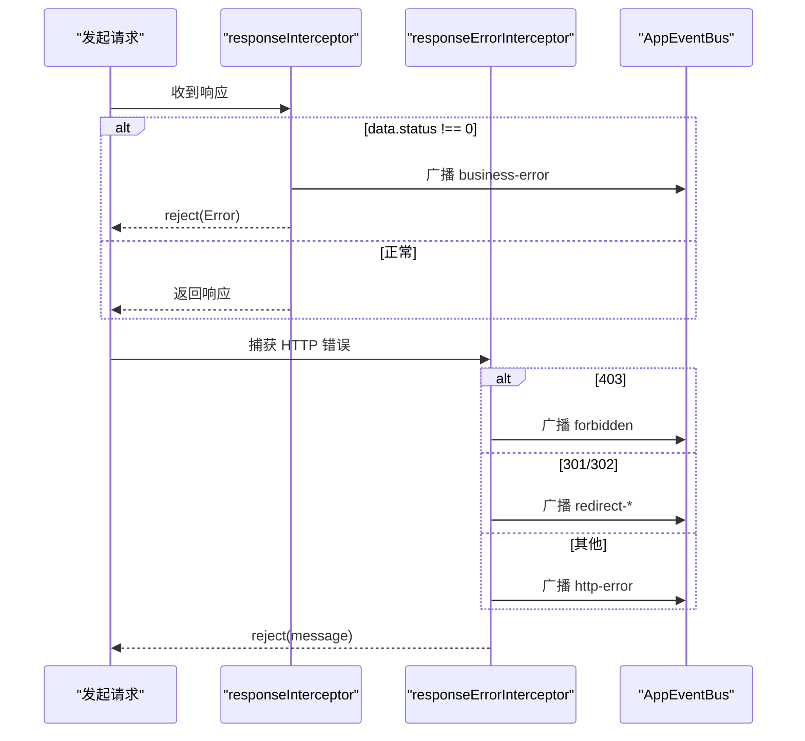
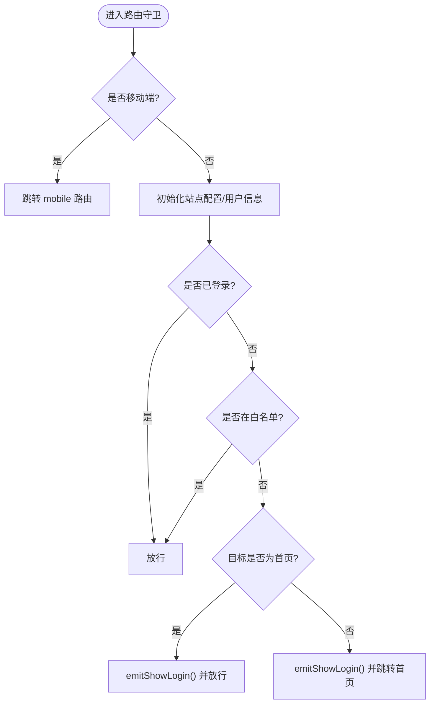
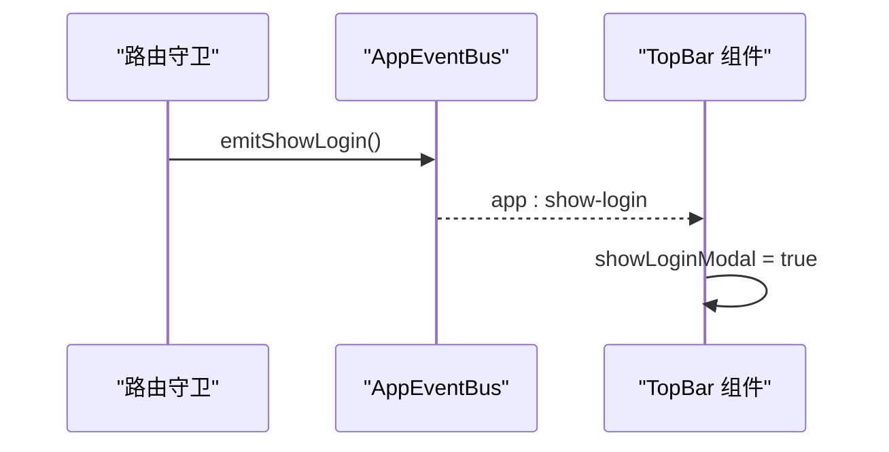
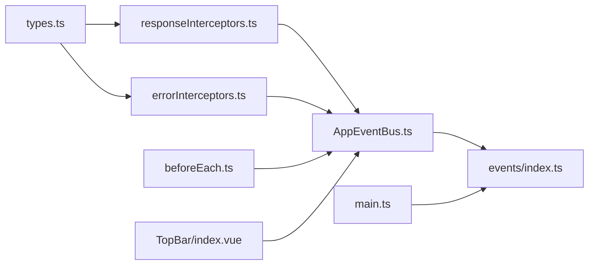

# 事件总线与组件通信

<cite>
**本文引用的文件列表**
- [AppEventBus.ts](file://frontend/src/events/AppEventBus.ts)
- [index.ts](file://frontend/src/events/index.ts)
- [types.ts](file://frontend/src/utils/request/types.ts)
- [errorInterceptors.ts](file://frontend/src/utils/request/errorInterceptors.ts)
- [responseInterceptors.ts](file://frontend/src/utils/request/responseInterceptors.ts)
- [main.ts](file://frontend/src/main.ts)
- [beforeEach.ts](file://frontend/src/router/guards/beforeEach.ts)
- [TopBar/index.vue](file://frontend/src/layouts/components/TopBar/index.vue)
</cite>

## 目录
1. [简介](#简介)
2. [项目结构](#项目结构)
3. [核心组件](#核心组件)
4. [架构总览](#架构总览)
5. [详细组件分析](#详细组件分析)
6. [依赖关系分析](#依赖关系分析)
7. [性能与内存管理](#性能与内存管理)
8. [调试与监控](#调试与监控)
9. [故障排查指南](#故障排查指南)
10. [结论](#结论)

## 简介
本文件面向积木云AI创作平台的前端事件总线与组件通信机制，系统性阐述自定义事件总线的设计与实现、全局事件管理机制、跨组件通信方案、应用级事件处理流程、生命周期绑定策略、事件去重与内存泄漏防护，并提供事件驱动编程模式、组件解耦设计与状态同步策略的实践指引。同时给出事件调试工具与性能监控方法，帮助读者在复杂业务场景下稳定使用事件系统。

## 项目结构
前端事件相关代码集中在以下位置：
- 事件总线核心：events 目录下的 AppEventBus 与全局处理器注册模块
- HTTP 请求拦截器：utils/request 目录下的错误与响应拦截器，负责将后端异常转换为全局事件
- 路由守卫：router/guards 中的前置守卫，结合事件总线触发登录弹窗
- 顶层入口：main.ts 中完成全局事件处理器注册
- UI 层：布局 TopBar 监听“显示登录弹窗”事件并控制登录模态框

图表来源
- [AppEventBus.ts:1-109](file://frontend/src/events/AppEventBus.ts#L1-L109)
- [index.ts:1-119](file://frontend/src/events/index.ts#L1-L119)
- [types.ts:1-40](file://frontend/src/utils/request/types.ts#L1-L40)
- [responseInterceptors.ts:1-24](file://frontend/src/utils/request/responseInterceptors.ts#L1-L24)
- [errorInterceptors.ts:1-57](file://frontend/src/utils/request/errorInterceptors.ts#L1-L57)
- [main.ts:1-21](file://frontend/src/main.ts#L1-L21)
- [beforeEach.ts:1-54](file://frontend/src/router/guards/beforeEach.ts#L1-L54)
- [TopBar/index.vue:1-122](file://frontend/src/layouts/components/TopBar/index.vue#L1-L122)

章节来源
- [AppEventBus.ts:1-109](file://frontend/src/events/AppEventBus.ts#L1-L109)
- [index.ts:1-119](file://frontend/src/events/index.ts#L1-L119)
- [types.ts:1-40](file://frontend/src/utils/request/types.ts#L1-L40)
- [responseInterceptors.ts:1-24](file://frontend/src/utils/request/responseInterceptors.ts#L1-L24)
- [errorInterceptors.ts:1-57](file://frontend/src/utils/request/errorInterceptors.ts#L1-L57)
- [main.ts:1-21](file://frontend/src/main.ts#L1-L21)
- [beforeEach.ts:1-54](file://frontend/src/router/guards/beforeEach.ts#L1-L54)
- [TopBar/index.vue:1-122](file://frontend/src/layouts/components/TopBar/index.vue#L1-L122)

## 核心组件
- 应用级事件总线（AppEventBus）
  - 基于 window CustomEvent 的轻量发布订阅封装，提供 emit/on/off/once 等基础能力
  - 内置便捷方法用于触发 401/403/重定向等通用事件，以及“显示登录弹窗”的业务事件
  - 导出单例 appEventBus，供全应用统一使用
- 全局 HTTP 事件处理器（registerAppEventHandlers）
  - 集中注册对 request:* 系列事件的监听，统一处理未登录、权限不足、重定向、业务错误与网络错误
  - 通过注入 router、onShowLogin、onMessage 回调，实现与路由和消息提示的解耦
  - 提供 unregisterAppEventHandlers 用于卸载时清理监听，避免内存泄漏
- 请求事件类型与映射（RequestEvents、requestEventNameMap）
  - 定义事件名称常量与负载结构 RequestEventDetail
  - 维护错误类型到事件名称的映射，确保拦截器与处理器命名一致
- 请求拦截器（responseInterceptor / responseErrorInterceptor）
  - 成功但业务码非 0 时广播业务错误事件
  - HTTP 错误按状态码分发为 403/301/302/其他错误事件，携带 message、status、url、response 等上下文
- 路由守卫（beforeEach）
  - 在未登录状态下根据白名单与目标路由决定是否弹出登录弹窗或跳转首页
  - 通过 appEventBus.emitShowLogin() 触发登录弹窗
- UI 监听（TopBar）
  - 在 mounted/unmounted 生命周期中 on/off 监听“显示登录弹窗”，控制登录模态框显隐

章节来源
- [AppEventBus.ts:1-109](file://frontend/src/events/AppEventBus.ts#L1-L109)
- [index.ts:1-119](file://frontend/src/events/index.ts#L1-L119)
- [types.ts:1-40](file://frontend/src/utils/request/types.ts#L1-L40)
- [responseInterceptors.ts:1-24](file://frontend/src/utils/request/responseInterceptors.ts#L1-L24)
- [errorInterceptors.ts:1-57](file://frontend/src/utils/request/errorInterceptors.ts#L1-L57)
- [beforeEach.ts:1-54](file://frontend/src/router/guards/beforeEach.ts#L1-L54)
- [TopBar/index.vue:1-122](file://frontend/src/layouts/components/TopBar/index.vue#L1-L122)

## 架构总览
下图展示了从 HTTP 请求失败到全局事件广播，再到路由与 UI 响应的完整链路。

图表来源
- [responseInterceptors.ts:1-24](file://frontend/src/utils/request/responseInterceptors.ts#L1-L24)
- [errorInterceptors.ts:1-57](file://frontend/src/utils/request/errorInterceptors.ts#L1-L57)
- [index.ts:1-119](file://frontend/src/events/index.ts#L1-L119)
- [beforeEach.ts:1-54](file://frontend/src/router/guards/beforeEach.ts#L1-L54)
- [TopBar/index.vue:1-122](file://frontend/src/layouts/components/TopBar/index.vue#L1-L122)

## 详细组件分析

### 应用级事件总线（AppEventBus）
- 设计要点
  - 以 window CustomEvent 作为底层载体，保证跨组件、跨模块的全局通信能力
  - 提供 once 一次性监听，简化单次触发的场景
  - 暴露便捷方法 emitUnauthorized/emitForbidden/emitRedirectPermanent/emitRedirectTemporary/emitShowLogin 等，降低业务侧使用成本
- 复杂度与性能
  - emit/on/off/once 均为 O(1) 操作；CustomEvent 派发开销低，适合高频小事件
  - 注意避免在高频路径中创建大量匿名函数作为 handler 引用，否则 off 无法正确移除
- 典型用法
  - 在任意模块中通过 appEventBus.emit('my-event', payload) 触发
  - 在需要处通过 appEventBus.on('my-event', handler) 订阅，并在合适时机 off 解除绑定

图表来源
- [AppEventBus.ts:1-109](file://frontend/src/events/AppEventBus.ts#L1-L109)

章节来源
- [AppEventBus.ts:1-109](file://frontend/src/events/AppEventBus.ts#L1-L109)

### 全局 HTTP 事件处理器（registerAppEventHandlers）
- 职责
  - 集中注册对 request:* 系列事件的监听，统一处理未登录、权限不足、重定向、业务错误与网络错误
  - 通过注入 router、onShowLogin、onMessage 回调，实现与路由和消息提示的解耦
  - 提供 unregisterAppEventHandlers 用于卸载时清理监听，避免内存泄漏
- 关键行为
  - 401：清除本地 token，提示警告，优先调用注入的 onShowLogin，否则可跳转登录页
  - 403：提示错误并跳转首页
  - 301/302：解析 response.location，站内路径走 router，外部链接走 window.location
  - 业务错误/网络错误：统一提示
- 去重与清理
  - 注册前先调用 unregisterAppEventHandlers 移除旧监听，防止重复注册导致多次执行
  - 所有监听器引用保存在 Map 中，便于统一移除

图表来源
- [index.ts:1-119](file://frontend/src/events/index.ts#L1-L119)

章节来源
- [index.ts:1-119](file://frontend/src/events/index.ts#L1-L119)

### 请求事件类型与映射（RequestEvents、requestEventNameMap）
- 作用
  - 统一定义事件名称常量与负载结构，确保拦截器与处理器之间的事件契约一致
  - 提供错误类型到事件名称的映射，减少硬编码字符串带来的不一致风险
- 负载结构
  - type：错误类型枚举
  - message：用户可读的错误信息
  - status：HTTP 状态码或业务状态码
  - url：请求地址
  - response：原始响应数据

章节来源
- [types.ts:1-40](file://frontend/src/utils/request/types.ts#L1-L40)

### 请求拦截器（responseInterceptor / responseErrorInterceptor）
- 成功但业务码非 0
  - 广播 request:business-error，携带 message/status/url/response
  - 抛出错误以便上层 Promise reject
- HTTP 错误
  - 403：广播 request:forbidden
  - 301/302：广播重定向事件，并将 response.headers.location 合并进 response.payload
  - 其他：广播 request:http-error
- 优点
  - 将 HTTP 语义与业务错误语义分离，便于全局统一处理
  - 携带丰富上下文，便于后续分析与定位问题

图表来源
- [responseInterceptors.ts:1-24](file://frontend/src/utils/request/responseInterceptors.ts#L1-L24)
- [errorInterceptors.ts:1-57](file://frontend/src/utils/request/errorInterceptors.ts#L1-L57)
- [types.ts:1-40](file://frontend/src/utils/request/types.ts#L1-L40)

章节来源
- [responseInterceptors.ts:1-24](file://frontend/src/utils/request/responseInterceptors.ts#L1-L24)
- [errorInterceptors.ts:1-57](file://frontend/src/utils/request/errorInterceptors.ts#L1-L57)
- [types.ts:1-40](file://frontend/src/utils/request/types.ts#L1-L40)

### 路由守卫与登录弹窗联动（beforeEach）
- 逻辑
  - 未登录且不在白名单：若目标是首页则仅弹出登录弹窗并放行；否则跳转到首页并弹出登录弹窗
  - 已登录：直接放行
- 与事件总线集成
  - 通过 appEventBus.emitShowLogin() 触发“显示登录弹窗”事件，由 TopBar 组件监听并打开登录模态框

图表来源
- [beforeEach.ts:1-54](file://frontend/src/router/guards/beforeEach.ts#L1-L54)
- [AppEventBus.ts:1-109](file://frontend/src/events/AppEventBus.ts#L1-L109)

章节来源
- [beforeEach.ts:1-54](file://frontend/src/router/guards/beforeEach.ts#L1-L54)
- [AppEventBus.ts:1-109](file://frontend/src/events/AppEventBus.ts#L1-L109)

### UI 组件监听与生命周期管理（TopBar）
- 生命周期
  - onMounted：注册 appEventBus.onShowLogin(onShowLogin)
  - onUnmounted：移除 appEventBus.offShowLogin(onShowLogin)，避免内存泄漏
- 行为
  - 收到“显示登录弹窗”事件后，设置 showLoginModal 为 true，展示登录模态框

图表来源
- [beforeEach.ts:1-54](file://frontend/src/router/guards/beforeEach.ts#L1-L54)
- [AppEventBus.ts:1-109](file://frontend/src/events/AppEventBus.ts#L1-L109)
- [TopBar/index.vue:1-122](file://frontend/src/layouts/components/TopBar/index.vue#L1-L122)

章节来源
- [TopBar/index.vue:1-122](file://frontend/src/layouts/components/TopBar/index.vue#L1-L122)

### 应用启动与全局处理器注册（main.ts）
- 启动流程
  - 创建 Vue 应用实例，安装 Pinia、Router、自定义 UI 插件
  - 调用 registerAppEventHandlers 注册全局 HTTP 事件处理器
  - 将 appEventBus.emitShowLogin 注入为 onShowLogin，使 401 等场景能统一触发登录弹窗
- 意义
  - 将“事件处理”与“具体 UI 实现”解耦，便于替换消息提示或登录弹窗的实现

章节来源
- [main.ts:1-21](file://frontend/src/main.ts#L1-L21)

## 依赖关系分析
- 耦合与内聚
  - AppEventBus 与 window CustomEvent 强耦合，但对外暴露简洁 API，内聚良好
  - 全局处理器通过注入 router/onShowLogin/onMessage 降低与具体实现的耦合
  - 拦截器通过 requestEventNameMap 与事件名保持契约一致，提升内聚性
- 直接依赖
  - 拦截器依赖 types.ts 中的事件常量与映射
  - 全局处理器依赖 AppEventBus 导出的单例
  - 路由守卫与 TopBar 均依赖 AppEventBus 的单例
- 潜在循环依赖
  - 当前结构无循环依赖；如需扩展，建议通过注入接口而非直接 import 来避免

图表来源
- [types.ts:1-40](file://frontend/src/utils/request/types.ts#L1-L40)
- [responseInterceptors.ts:1-24](file://frontend/src/utils/request/responseInterceptors.ts#L1-L24)
- [errorInterceptors.ts:1-57](file://frontend/src/utils/request/errorInterceptors.ts#L1-L57)
- [AppEventBus.ts:1-109](file://frontend/src/events/AppEventBus.ts#L1-L109)
- [index.ts:1-119](file://frontend/src/events/index.ts#L1-L119)
- [main.ts:1-21](file://frontend/src/main.ts#L1-L21)
- [beforeEach.ts:1-54](file://frontend/src/router/guards/beforeEach.ts#L1-L54)
- [TopBar/index.vue:1-122](file://frontend/src/layouts/components/TopBar/index.vue#L1-L122)

## 性能与内存管理
- 事件去重
  - 全局处理器在注册前会先调用 unregisterAppEventHandlers 移除旧监听，避免重复注册导致的多次执行
- 内存泄漏防护
  - 组件级别：在 onUnmounted 中移除对应监听（如 TopBar 的 onShowLogin）
  - 全局级别：在应用卸载或测试环境清理时调用 unregisterAppEventHandlers
- 性能优化建议
  - 避免在高频路径中创建匿名函数作为 handler 引用，应复用函数引用以确保 off 生效
  - 对于一次性事件，优先使用 once 以减少手动 off 的成本
  - 谨慎在事件回调中进行昂贵计算，必要时使用节流/防抖或异步队列

章节来源
- [index.ts:1-119](file://frontend/src/events/index.ts#L1-L119)
- [TopBar/index.vue:1-122](file://frontend/src/layouts/components/TopBar/index.vue#L1-L122)
- [AppEventBus.ts:1-109](file://frontend/src/events/AppEventBus.ts#L1-L109)

## 调试与监控
- 事件调试
  - 在浏览器控制台临时监听所有 request:* 事件，观察事件名称、payload 与触发时机
  - 针对业务事件（如 app:show-login）增加日志输出，确认事件传播链路
- 性能监控
  - 在 emit 前后记录时间戳，统计事件分发耗时
  - 对高频事件进行采样统计，评估是否需要引入节流或批量处理
- 可视化辅助
  - 开发阶段可在全局处理器中收集最近 N 条事件记录，提供简易面板查看

[本节为通用指导，不直接分析具体文件]

## 故障排查指南
- 现象：登录弹窗不出现
  - 检查路由守卫是否正确调用 emitShowLogin
  - 检查 TopBar 是否在 mounted 中注册 onShowLogin，并在 unmounted 中移除
  - 检查 main.ts 是否已将 onShowLogin 注入到全局处理器
- 现象：重复触发登录弹窗或多次提示
  - 检查是否存在重复注册全局处理器（确保注册前调用 unregisterAppEventHandlers）
  - 检查组件是否重复注册同一事件监听而未在卸载时移除
- 现象：重定向无效
  - 检查 301/302 事件中 response.location 是否正确传递
  - 检查全局处理器对站内路径与外部链接的处理分支是否符合预期
- 现象：业务错误未提示
  - 检查 responseInterceptor 是否正确判断 data.status !== 0
  - 检查 onMessage 是否接入全局消息组件

章节来源
- [main.ts:1-21](file://frontend/src/main.ts#L1-L21)
- [index.ts:1-119](file://frontend/src/events/index.ts#L1-L119)
- [beforeEach.ts:1-54](file://frontend/src/router/guards/beforeEach.ts#L1-L54)
- [TopBar/index.vue:1-122](file://frontend/src/layouts/components/TopBar/index.vue#L1-L122)
- [responseInterceptors.ts:1-24](file://frontend/src/utils/request/responseInterceptors.ts#L1-L24)

## 结论
本事件总线方案以 window CustomEvent 为基础，结合统一的请求事件模型与全局处理器，实现了跨组件、跨模块的解耦通信。通过生命周期管理与去重机制，有效避免了重复监听与内存泄漏。配合路由守卫与 UI 组件的协作，形成了清晰的应用级事件处理闭环。建议在后续演进中持续完善事件文档、增强调试能力，并对高频事件进行性能优化与监控。