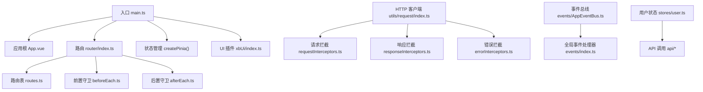
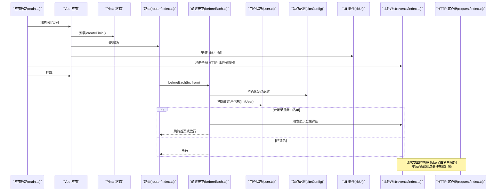
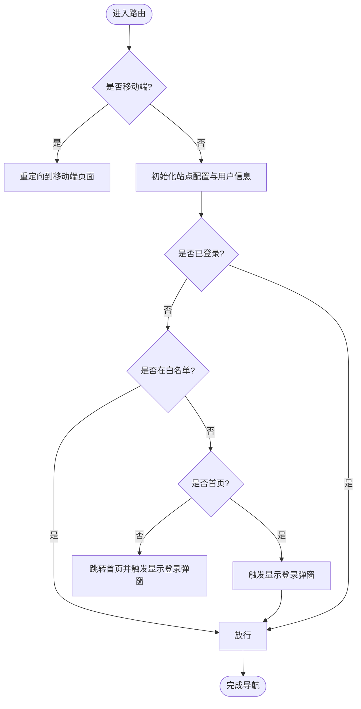
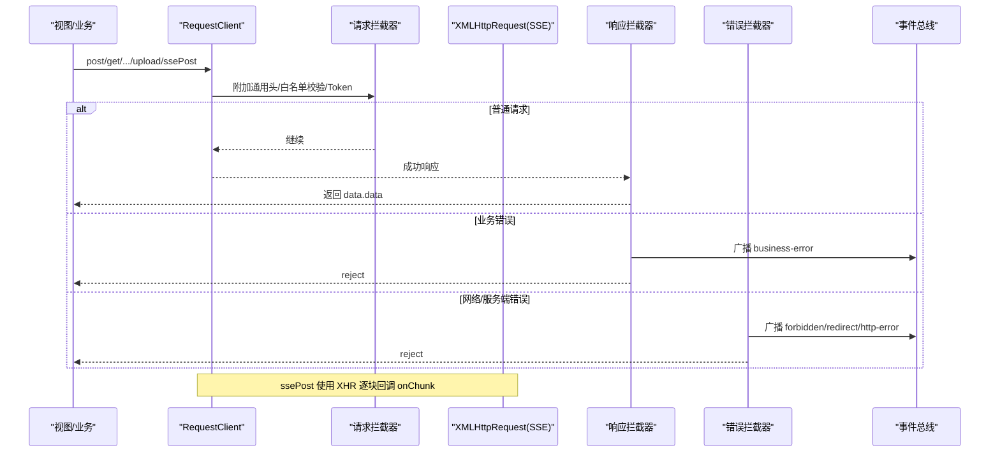
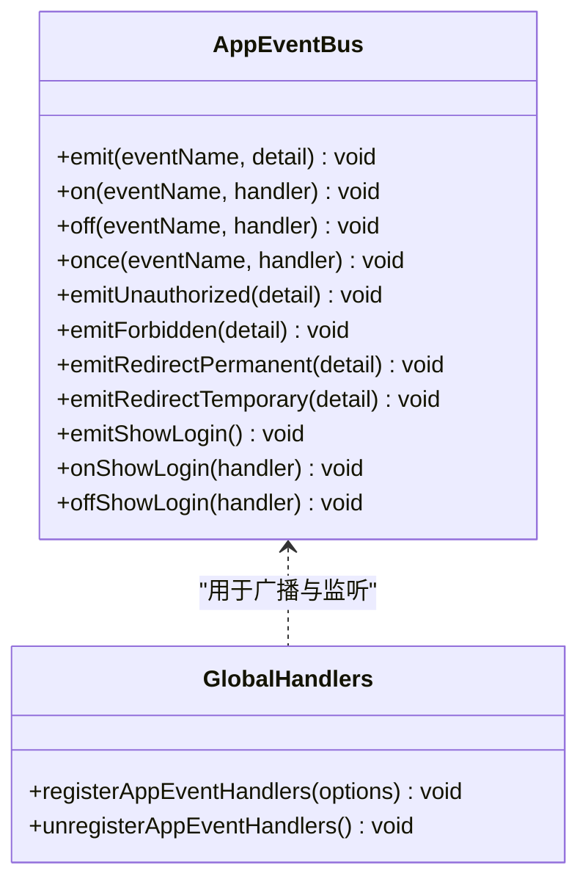
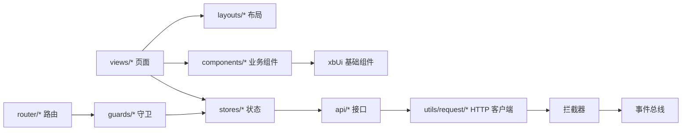
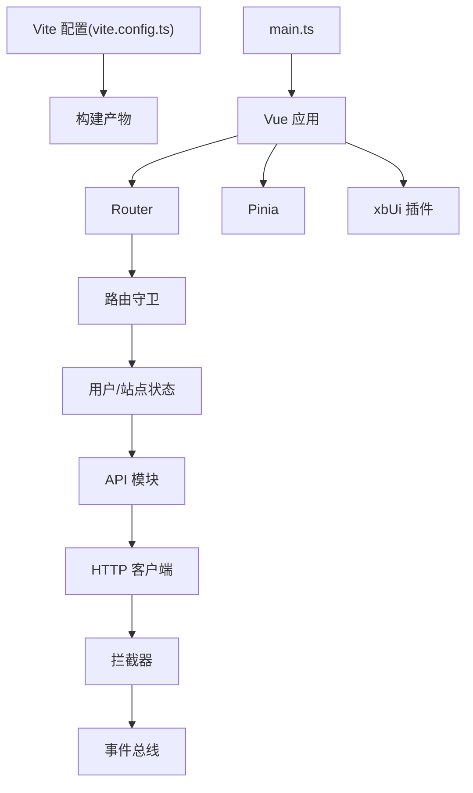

# 前端架构设计

<cite>
**本文引用的文件**   
- [main.ts](file://frontend/src/main.ts)
- [App.vue](file://frontend/src/App.vue)
- [vite.config.ts](file://frontend/vite.config.ts)
- [router/index.ts](file://frontend/src/router/index.ts)
- [router/routes.ts](file://frontend/src/router/routes.ts)
- [router/guards/beforeEach.ts](file://frontend/src/router/guards/beforeEach.ts)
- [router/guards/afterEach.ts](file://frontend/src/router/guards/afterEach.ts)
- [utils/request/index.ts](file://frontend/src/utils/request/index.ts)
- [utils/request/config.ts](file://frontend/src/utils/request/config.ts)
- [utils/request/requestInterceptors.ts](file://frontend/src/utils/request/requestInterceptors.ts)
- [utils/request/responseInterceptors.ts](file://frontend/src/utils/request/responseInterceptors.ts)
- [utils/request/errorInterceptors.ts](file://frontend/src/utils/request/errorInterceptors.ts)
- [events/AppEventBus.ts](file://frontend/src/events/AppEventBus.ts)
- [events/index.ts](file://frontend/src/events/index.ts)
- [stores/user.ts](file://frontend/src/stores/user.ts)
- [xbUi/index.ts](file://frontend/src/xbUi/index.ts)
</cite>

## 目录
1. [引言](#引言)
2. [项目结构](#项目结构)
3. [核心组件](#核心组件)
4. [架构总览](#架构总览)
5. [详细组件分析](#详细组件分析)
6. [依赖关系分析](#依赖关系分析)
7. [性能与响应式优化](#性能与响应式优化)
8. [故障排查指南](#故障排查指南)
9. [结论](#结论)
10. [附录：最佳实践示例路径](#附录最佳实践示例路径)

## 引言
本文件面向积木云AI创作平台的前端工程，系统化阐述基于 Vue 3 的整体架构设计与实现要点。内容覆盖 MVVM 模式、组合式 API、组件化设计、应用初始化流程、插件系统注册机制、全局状态管理（Pinia）、路由配置与守卫、事件总线设计、HTTP 客户端封装与错误处理策略，并给出可视化架构图与流程图，帮助读者快速理解与落地。

## 项目结构
前端采用 Vite + Vue 3 的工程化方案，结合 Pinia 进行状态管理、Vue Router 进行路由控制，并通过自定义 xbUi 组件库提供基础 UI 能力。整体分层清晰：入口层、基础设施层（请求、事件、路由）、业务层（Store、Views、Components）。



图表来源
- [main.ts:1-21](file://frontend/src/main.ts#L1-L21)
- [App.vue:1-4](file://frontend/src/App.vue#L1-L4)
- [router/index.ts:1-15](file://frontend/src/router/index.ts#L1-L15)
- [router/routes.ts:1-110](file://frontend/src/router/routes.ts#L1-L110)
- [router/guards/beforeEach.ts:1-54](file://frontend/src/router/guards/beforeEach.ts#L1-L54)
- [router/guards/afterEach.ts:1-19](file://frontend/src/router/guards/afterEach.ts#L1-L19)
- [utils/request/index.ts:1-237](file://frontend/src/utils/request/index.ts#L1-L237)
- [utils/request/requestInterceptors.ts:1-47](file://frontend/src/utils/request/requestInterceptors.ts#L1-L47)
- [utils/request/responseInterceptors.ts:1-24](file://frontend/src/utils/request/responseInterceptors.ts#L1-L24)
- [utils/request/errorInterceptors.ts:1-57](file://frontend/src/utils/request/errorInterceptors.ts#L1-L57)
- [events/AppEventBus.ts:1-109](file://frontend/src/events/AppEventBus.ts#L1-L109)
- [events/index.ts:1-119](file://frontend/src/events/index.ts#L1-L119)
- [stores/user.ts:1-327](file://frontend/src/stores/user.ts#L1-L327)
- [xbUi/index.ts:1-100](file://frontend/src/xbUi/index.ts#L1-L100)

章节来源
- [main.ts:1-21](file://frontend/src/main.ts#L1-L21)
- [vite.config.ts:1-32](file://frontend/vite.config.ts#L1-L32)

## 核心组件
- 应用入口与初始化
  - 创建 Vue 应用实例，挂载 Pinia、Router、自定义 UI 插件，注册全局 HTTP 事件处理器后挂载到 DOM。
- 路由与守卫
  - 使用 Hash 历史模式；集中定义路由表；通过前置守卫完成移动端重定向、站点配置初始化、用户信息初始化与鉴权；后置守卫统一设置页面标题。
- 全局状态管理（Pinia）
  - 以模块化 Store 组织状态，如用户模块包含登录态、用户信息、绑定态等，并提供登录、登出、资料更新等方法。
- HTTP 客户端封装
  - 基于 Axios 的 RequestClient 类，统一配置 baseURL、超时、拦截器；支持上传进度回调与 SSE 流式 POST；白名单接口免 Token。
- 事件总线与全局错误处理
  - 基于 window CustomEvent 的应用级事件总线；HTTP 拦截器按状态码广播事件；全局处理器统一处理 401/403/301/302 及业务错误。
- 组件库与插件注册
  - 自定义 xbUi 组件库以插件形式全局注册，同时支持按需导出类型与工具方法。

章节来源
- [main.ts:1-21](file://frontend/src/main.ts#L1-L21)
- [router/index.ts:1-15](file://frontend/src/router/index.ts#L1-L15)
- [router/routes.ts:1-110](file://frontend/src/router/routes.ts#L1-L110)
- [router/guards/beforeEach.ts:1-54](file://frontend/src/router/guards/beforeEach.ts#L1-L54)
- [router/guards/afterEach.ts:1-19](file://frontend/src/router/guards/afterEach.ts#L1-L19)
- [utils/request/index.ts:1-237](file://frontend/src/utils/request/index.ts#L1-L237)
- [events/AppEventBus.ts:1-109](file://frontend/src/events/AppEventBus.ts#L1-L109)
- [events/index.ts:1-119](file://frontend/src/events/index.ts#L1-L119)
- [stores/user.ts:1-327](file://frontend/src/stores/user.ts#L1-L327)
- [xbUi/index.ts:1-100](file://frontend/src/xbUi/index.ts#L1-L100)

## 架构总览
下图展示从应用启动到页面渲染的关键链路，包括插件注册、路由守卫、状态初始化与 HTTP 事件处理。



图表来源
- [main.ts:1-21](file://frontend/src/main.ts#L1-L21)
- [router/index.ts:1-15](file://frontend/src/router/index.ts#L1-L15)
- [router/guards/beforeEach.ts:1-54](file://frontend/src/router/guards/beforeEach.ts#L1-L54)
- [events/index.ts:1-119](file://frontend/src/events/index.ts#L1-L119)
- [utils/request/index.ts:1-237](file://frontend/src/utils/request/index.ts#L1-L237)
- [stores/user.ts:1-327](file://frontend/src/stores/user.ts#L1-L327)
- [xbUi/index.ts:1-100](file://frontend/src/xbUi/index.ts#L1-L100)

## 详细组件分析

### 应用初始化与插件系统
- 初始化顺序
  - 创建应用实例 → 安装 Pinia → 安装 Router → 安装 xbUi 插件 → 注册全局 HTTP 事件处理器 → 挂载到 DOM。
- 插件系统
  - xbUi 作为 Vue 插件，在 install 中批量注册组件，同时暴露独立导出与类型定义，便于按需使用。
- 自动导入
  - 通过 AutoImport 为 vue、vue-router、pinia 提供自动导入与类型声明，减少样板代码。

章节来源
- [main.ts:1-21](file://frontend/src/main.ts#L1-L21)
- [xbUi/index.ts:1-100](file://frontend/src/xbUi/index.ts#L1-L100)
- [vite.config.ts:1-32](file://frontend/vite.config.ts#L1-L32)

### 路由配置与守卫机制
- 路由表
  - 使用懒加载方式定义页面组件，主布局下包含多个业务子路由；另有一个独立的“分集创建”布局路由组。
- 前置守卫
  - 移动端检测：根据 UA、屏幕宽度与触摸能力判断，必要时重定向至移动端页面。
  - 站点配置与用户信息初始化：确保进入页面前具备必要的全局数据。
  - 鉴权策略：白名单路由直接放行；首页未登录时弹出登录框并允许访问；其他未登录路由跳转首页并弹出登录框。
- 后置守卫
  - 根据站点配置与当前路由 meta.title 动态设置 document.title。



图表来源
- [router/guards/beforeEach.ts:1-54](file://frontend/src/router/guards/beforeEach.ts#L1-L54)
- [router/guards/afterEach.ts:1-19](file://frontend/src/router/guards/afterEach.ts#L1-L19)
- [router/routes.ts:1-110](file://frontend/src/router/routes.ts#L1-L110)

章节来源
- [router/index.ts:1-15](file://frontend/src/router/index.ts#L1-L15)
- [router/routes.ts:1-110](file://frontend/src/router/routes.ts#L1-L110)
- [router/guards/beforeEach.ts:1-54](file://frontend/src/router/guards/beforeEach.ts#L1-L54)
- [router/guards/afterEach.ts:1-19](file://frontend/src/router/guards/afterEach.ts#L1-L19)

### 全局状态管理（Pinia）
- 用户状态模块
  - 状态字段：登录态、用户信息、各绑定标识（手机/邮箱/微信）等。
  - 计算属性：便捷判断绑定状态。
  - 方法：保存/获取/清除 token、初始化用户信息、多种登录方式、登出、注册、密码修改、绑定/解绑、头像与昵称更新等。
  - 并发保护：使用 Promise 缓存 initUser，避免重复拉取。
- 与其他模块协作
  - 路由守卫在导航前调用 initUser，保证后续逻辑可用。
  - HTTP 客户端通过 localStorage 读取 token，配合白名单策略决定是否附加 Authorization。

```mermaid
classDiagram
class UserStore {
+boolean isLoggedIn
+object userInfo
+computed isPhoneBound
+computed isEmailBound
+computed isWechatBound
+saveToken(token)
+getToken() string|null
+clearToken()
+initUser() Promise~void~
+loginAction(params) Promise~{success,message}~
+mobileLoginAction(params) Promise~{success,message}~
+emailLoginAction(params) Promise~{success,message}~
+logoutAction() Promise~void~
+registerAction(params) Promise~{success,message}~
+changePasswordAction(params) Promise~{success,message}~
+resetPasswordAction(params) Promise~{success,message}~
+bindPhone(mobile,code) Promise~{success,message}~
+unbindPhone(code) Promise~{success,message}~
+bindEmailAction(email,code) Promise~{success,message}~
+unbindEmailAction(code) Promise~{success,message}~
+bindWechat(wechatId) Promise~{success,message}~
+unbindWechat() Promise~{success}~
+updateAvatar(file) Promise~{success,message}~
+updateNickname(nickname) Promise~{success,message}~
}
```

图表来源
- [stores/user.ts:1-327](file://frontend/src/stores/user.ts#L1-L327)

章节来源
- [stores/user.ts:1-327](file://frontend/src/stores/user.ts#L1-L327)

### HTTP 客户端封装与错误处理
- 客户端设计
  - 基于 Axios 的 RequestClient 类，统一 baseURL、超时、拦截器；提供 get/post/put/delete/upload/ssePost 等方法。
  - 上传支持进度回调与额外表单字段；SSE 流式 POST 使用 XMLHttpRequest 解析 text/event-stream，兼容 CORS 并与 axios 共享网络层。
- 拦截器体系
  - 请求拦截：设置通用请求头；FormData 不手动设置 Content-Type；白名单免 Token，否则要求携带 Authorization。
  - 响应拦截：对业务错误（status 非 0）抛出异常并广播业务错误事件。
  - 错误拦截：按 HTTP 状态码广播对应事件（401/403/301/302/其他），并返回拒绝。
- 全局事件处理
  - 401：清除本地 token，提示并弹出登录框。
  - 403：提示权限不足并重定向首页。
  - 301/302：根据 location 决定站内路由跳转或外部跳转。
  - 业务错误/网络错误：统一提示。



图表来源
- [utils/request/index.ts:1-237](file://frontend/src/utils/request/index.ts#L1-L237)
- [utils/request/requestInterceptors.ts:1-47](file://frontend/src/utils/request/requestInterceptors.ts#L1-L47)
- [utils/request/responseInterceptors.ts:1-24](file://frontend/src/utils/request/responseInterceptors.ts#L1-L24)
- [utils/request/errorInterceptors.ts:1-57](file://frontend/src/utils/request/errorInterceptors.ts#L1-L57)
- [events/index.ts:1-119](file://frontend/src/events/index.ts#L1-L119)

章节来源
- [utils/request/index.ts:1-237](file://frontend/src/utils/request/index.ts#L1-L237)
- [utils/request/config.ts:1-39](file://frontend/src/utils/request/config.ts#L1-L39)
- [utils/request/requestInterceptors.ts:1-47](file://frontend/src/utils/request/requestInterceptors.ts#L1-L47)
- [utils/request/responseInterceptors.ts:1-24](file://frontend/src/utils/request/responseInterceptors.ts#L1-L24)
- [utils/request/errorInterceptors.ts:1-57](file://frontend/src/utils/request/errorInterceptors.ts#L1-L57)
- [events/index.ts:1-119](file://frontend/src/events/index.ts#L1-L119)

### 事件总线设计
- 应用级事件总线
  - 基于 window CustomEvent 的 AppEventBus，提供 emit/on/off/once 以及快捷方法（如 emitShowLogin）。
- 全局事件处理器
  - registerAppEventHandlers 将 HTTP 拦截器广播的事件与具体行为（跳转、提示、弹框）解耦，便于替换 UI 交互。
- 与路由联动
  - 在路由守卫中通过 appEventBus.emitShowLogin() 触发登录弹窗，保持跨层通信的一致性。



图表来源
- [events/AppEventBus.ts:1-109](file://frontend/src/events/AppEventBus.ts#L1-L109)
- [events/index.ts:1-119](file://frontend/src/events/index.ts#L1-L119)

章节来源
- [events/AppEventBus.ts:1-109](file://frontend/src/events/AppEventBus.ts#L1-L109)
- [events/index.ts:1-119](file://frontend/src/events/index.ts#L1-L119)

### 组件层次结构与模块依赖
- 组件层次
  - 根组件 App.vue 仅包含路由出口，实际页面由 views 下的页面组件构成，并通过 layouts 提供公共布局。
  - 业务组件位于 components 与 views/*/components，基础 UI 来自 xbUi。
- 模块依赖
  - 页面依赖路由与状态；状态依赖 API；API 依赖 HTTP 客户端；HTTP 客户端依赖拦截器与事件总线；路由守卫依赖站点与用户状态。



图表来源
- [App.vue:1-4](file://frontend/src/App.vue#L1-L4)
- [router/index.ts:1-15](file://frontend/src/router/index.ts#L1-L15)
- [router/guards/beforeEach.ts:1-54](file://frontend/src/router/guards/beforeEach.ts#L1-L54)
- [utils/request/index.ts:1-237](file://frontend/src/utils/request/index.ts#L1-L237)
- [events/AppEventBus.ts:1-109](file://frontend/src/events/AppEventBus.ts#L1-L109)
- [xbUi/index.ts:1-100](file://frontend/src/xbUi/index.ts#L1-L100)

## 依赖关系分析
- 构建与开发
  - Vite 配置启用 @ 别名、AutoImport 插件、开发代理与热更新忽略项。
- 运行时依赖
  - Vue 3、Vue Router、Pinia、Axios、自定义 xbUi 组件库。
- 关键耦合点
  - 路由守卫与状态模块强耦合（需要站点与用户信息）。
  - HTTP 客户端与事件总线通过事件名称映射解耦，降低耦合度。
  - 白名单策略集中在 config 与拦截器中，便于维护。



图表来源
- [vite.config.ts:1-32](file://frontend/vite.config.ts#L1-L32)
- [main.ts:1-21](file://frontend/src/main.ts#L1-L21)
- [router/index.ts:1-15](file://frontend/src/router/index.ts#L1-L15)
- [router/guards/beforeEach.ts:1-54](file://frontend/src/router/guards/beforeEach.ts#L1-L54)
- [utils/request/index.ts:1-237](file://frontend/src/utils/request/index.ts#L1-L237)
- [events/index.ts:1-119](file://frontend/src/events/index.ts#L1-L119)

章节来源
- [vite.config.ts:1-32](file://frontend/vite.config.ts#L1-L32)

## 性能与响应式优化
- 路由懒加载
  - 页面组件通过动态 import 实现按需加载，减小首屏体积。
- 自动导入与类型生成
  - AutoImport 减少样板代码，提升开发效率与可读性。
- 请求优化
  - 白名单免 Token 减少不必要的鉴权开销；上传与 SSE 分别针对大文件与长连接场景优化。
- 状态初始化防抖
  - initUser 使用 Promise 缓存，避免并发重复请求。
- 响应式与 UI
  - 使用 computed 派生绑定状态，减少冗余计算；xbUi 组件可复用，降低重复实现成本。

[本节为通用指导，无需源码引用]

## 故障排查指南
- 常见问题定位
  - 401 未登录：检查 localStorage 是否存在 token；确认请求是否命中白名单；查看全局 401 事件是否被正确触发与处理。
  - 403 权限不足：确认用户角色与资源权限；检查全局 403 事件是否跳转到首页并提示。
  - 301/302 重定向：检查后端返回的 Location 是否为站内路径；若为外部链接需走 window.location。
  - 业务错误（status 非 0）：查看响应拦截器抛出的错误消息与事件负载。
- 调试建议
  - 在浏览器控制台监听相关事件名称，观察事件负载中的 url、message、response 等信息。
  - 使用开发代理 /proxy 验证前后端联调问题。

章节来源
- [utils/request/responseInterceptors.ts:1-24](file://frontend/src/utils/request/responseInterceptors.ts#L1-L24)
- [utils/request/errorInterceptors.ts:1-57](file://frontend/src/utils/request/errorInterceptors.ts#L1-L57)
- [events/index.ts:1-119](file://frontend/src/events/index.ts#L1-L119)

## 结论
本项目采用清晰的 MVVM 分层与组合式 API 风格，借助 Pinia 与 Vue Router 构建稳定可扩展的前端架构。HTTP 客户端与事件总线的设计实现了跨层解耦与统一错误处理，路由守卫保障了安全与体验。通过懒加载、自动导入与合理的状态初始化策略，兼顾了性能与可维护性。

## 附录：最佳实践示例路径
- 应用初始化与插件注册
  - [main.ts:1-21](file://frontend/src/main.ts#L1-L21)
  - [xbUi/index.ts:1-100](file://frontend/src/xbUi/index.ts#L1-L100)
- 路由与守卫
  - [router/index.ts:1-15](file://frontend/src/router/index.ts#L1-L15)
  - [router/routes.ts:1-110](file://frontend/src/router/routes.ts#L1-L110)
  - [router/guards/beforeEach.ts:1-54](file://frontend/src/router/guards/beforeEach.ts#L1-L54)
  - [router/guards/afterEach.ts:1-19](file://frontend/src/router/guards/afterEach.ts#L1-L19)
- 状态管理（用户模块）
  - [stores/user.ts:1-327](file://frontend/src/stores/user.ts#L1-L327)
- HTTP 客户端与拦截器
  - [utils/request/index.ts:1-237](file://frontend/src/utils/request/index.ts#L1-L237)
  - [utils/request/config.ts:1-39](file://frontend/src/utils/request/config.ts#L1-L39)
  - [utils/request/requestInterceptors.ts:1-47](file://frontend/src/utils/request/requestInterceptors.ts#L1-L47)
  - [utils/request/responseInterceptors.ts:1-24](file://frontend/src/utils/request/responseInterceptors.ts#L1-L24)
  - [utils/request/errorInterceptors.ts:1-57](file://frontend/src/utils/request/errorInterceptors.ts#L1-L57)
- 事件总线与全局处理器
  - [events/AppEventBus.ts:1-109](file://frontend/src/events/AppEventBus.ts#L1-L109)
  - [events/index.ts:1-119](file://frontend/src/events/index.ts#L1-L119)