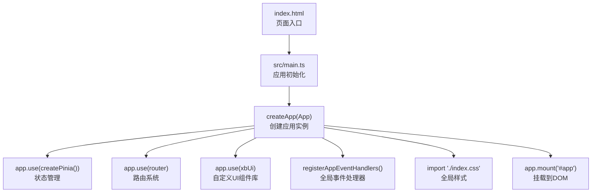
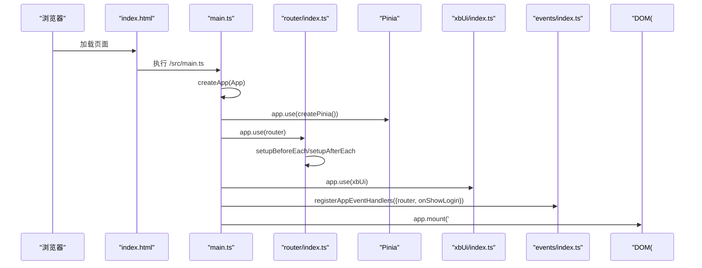
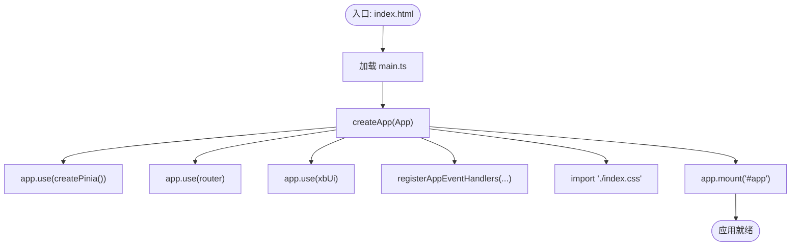
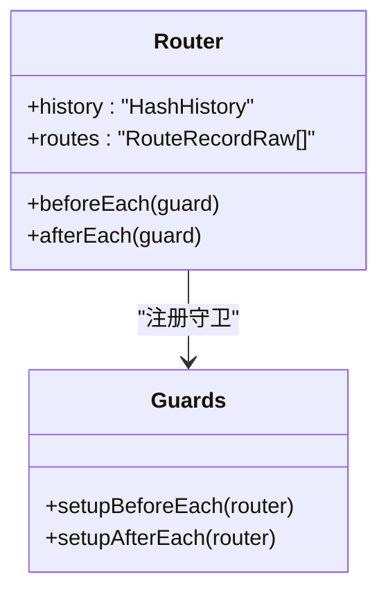
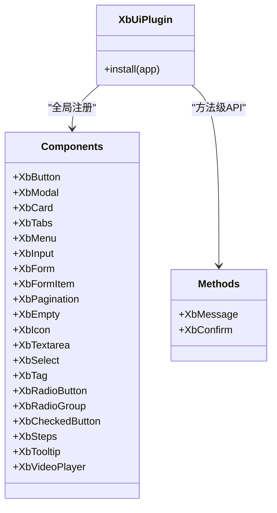
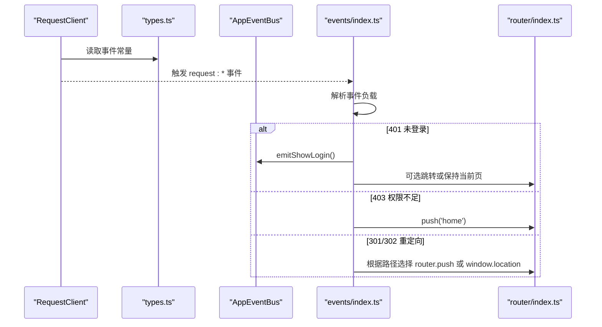
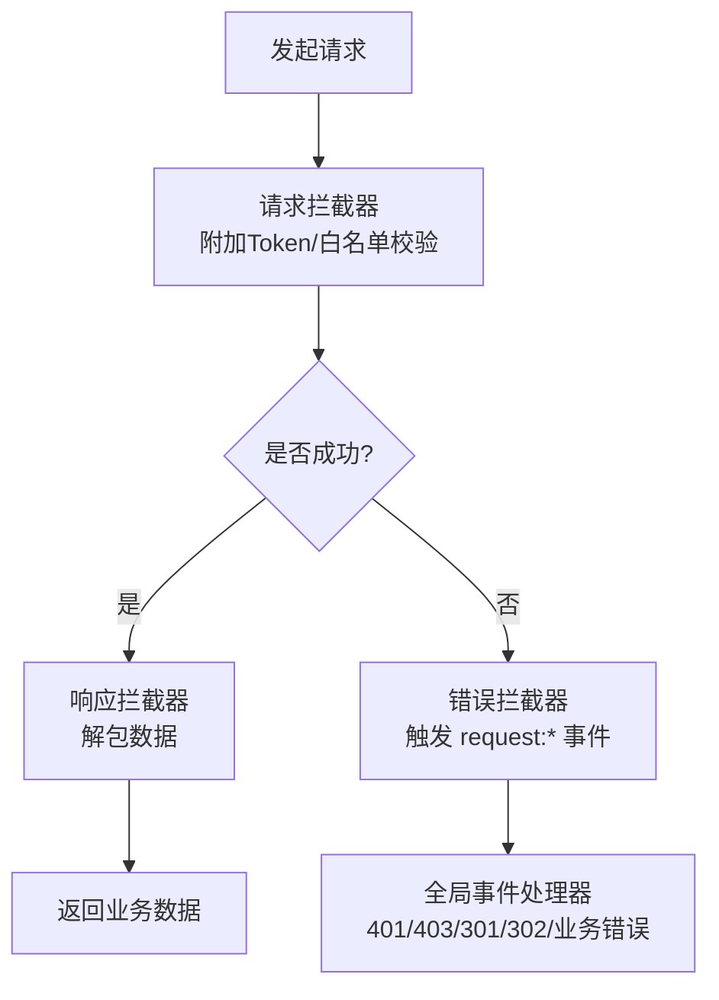
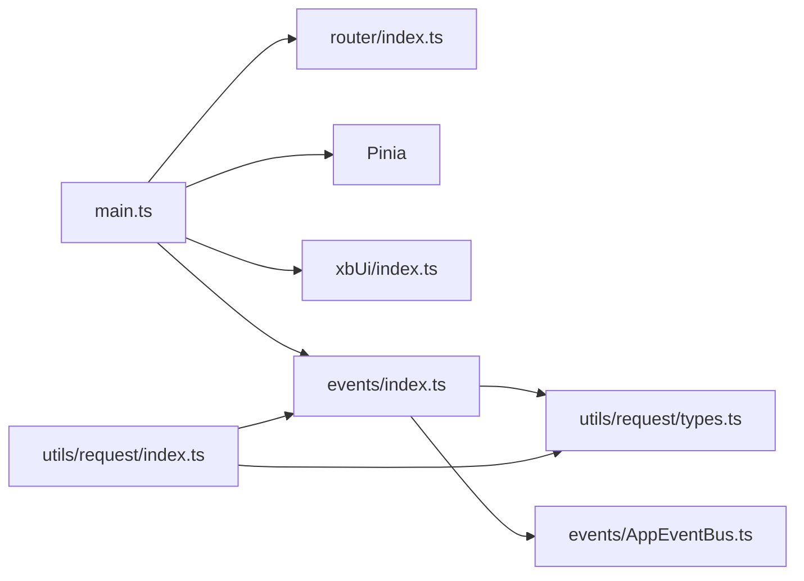

# 应用初始化与启动流程

<cite>
**本文引用的文件**   
- [frontend/index.html](file://frontend/index.html)
- [frontend/src/main.ts](file://frontend/src/main.ts)
- [frontend/src/App.vue](file://frontend/src/App.vue)
- [frontend/vite.config.ts](file://frontend/vite.config.ts)
- [frontend/src/router/index.ts](file://frontend/src/router/index.ts)
- [frontend/src/xbUi/index.ts](file://frontend/src/xbUi/index.ts)
- [frontend/src/events/index.ts](file://frontend/src/events/index.ts)
- [frontend/src/events/AppEventBus.ts](file://frontend/src/events/AppEventBus.ts)
- [frontend/src/utils/request/types.ts](file://frontend/src/utils/request/types.ts)
- [frontend/src/utils/request/index.ts](file://frontend/src/utils/request/index.ts)
</cite>

## 目录
1. [简介](#简介)
2. [项目结构](#项目结构)
3. [核心组件](#核心组件)
4. [架构总览](#架构总览)
5. [详细组件分析](#详细组件分析)
6. [依赖关系分析](#依赖关系分析)
7. [性能考虑](#性能考虑)
8. [故障排查指南](#故障排查指南)
9. [结论](#结论)
10. [附录](#附录)

## 简介
本文件面向积木云AI创作平台的前端应用，系统化梳理 Vue 3 应用的初始化与启动流程。重点覆盖：
- createApp 实例创建、插件注册顺序（Pinia、Router、自定义 UI 组件库 xbUi）
- 全局事件处理器注册机制（HTTP 状态码与业务错误统一处理）
- 应用配置项与环境变量处理（Vite 构建期配置）
- CSS 样式导入与挂载流程
- 错误边界与性能监控集成点建议
- 最佳实践示例路径指引

## 项目结构
前端采用 Vite + Vue 3 工程化方案，入口 HTML 通过模块脚本加载 main.ts，main.ts 负责创建应用实例、安装插件、注册全局事件并挂载到 DOM。

图表来源
- [frontend/index.html:1-15](file://frontend/index.html#L1-L15)
- [frontend/src/main.ts:1-21](file://frontend/src/main.ts#L1-L21)

章节来源
- [frontend/index.html:1-15](file://frontend/index.html#L1-L15)
- [frontend/src/main.ts:1-21](file://frontend/src/main.ts#L1-L21)

## 核心组件
- 应用入口与挂载
  - index.html 提供根节点 #app，并通过 type="module" 引入 src/main.ts
  - main.ts 中调用 createApp(App)，依次安装 Pinia、Router、xbUi，注册全局事件后执行 app.mount('#app')
- 路由系统
  - router/index.ts 使用 createWebHashHistory() 创建路由实例，并注册 beforeEach 与 afterEach 守卫
- 自定义 UI 组件库 xbUi
  - xbUi/index.ts 以 Vue 插件形式批量注册组件，并提供方法级 API（如 XbMessage、XbConfirm）
- 全局事件处理器
  - events/index.ts 提供 registerAppEventHandlers，监听 window CustomEvent，统一处理 401/403/301/302 及业务/网络错误
  - AppEventBus.ts 封装 emit/on/off/once 等能力，并提供便捷方法（如 emitShowLogin）
- HTTP 请求与事件广播
  - utils/request/index.ts 基于 Axios 封装 RequestClient，在响应拦截器中触发各类请求事件
  - utils/request/types.ts 定义事件名称常量与事件负载类型

章节来源
- [frontend/src/main.ts:1-21](file://frontend/src/main.ts#L1-L21)
- [frontend/src/router/index.ts:1-15](file://frontend/src/router/index.ts#L1-L15)
- [frontend/src/xbUi/index.ts:1-100](file://frontend/src/xbUi/index.ts#L1-L100)
- [frontend/src/events/index.ts:1-119](file://frontend/src/events/index.ts#L1-L119)
- [frontend/src/events/AppEventBus.ts:1-109](file://frontend/src/events/AppEventBus.ts#L1-L109)
- [frontend/src/utils/request/index.ts:1-237](file://frontend/src/utils/request/index.ts#L1-L237)
- [frontend/src/utils/request/types.ts:1-40](file://frontend/src/utils/request/types.ts#L1-L40)

## 架构总览
下图展示从浏览器加载 HTML 到 Vue 应用完成挂载的全链路，以及关键插件与事件系统的交互关系。

图表来源
- [frontend/index.html:1-15](file://frontend/index.html#L1-L15)
- [frontend/src/main.ts:1-21](file://frontend/src/main.ts#L1-L21)
- [frontend/src/router/index.ts:1-15](file://frontend/src/router/index.ts#L1-L15)
- [frontend/src/xbUi/index.ts:1-100](file://frontend/src/xbUi/index.ts#L1-L100)
- [frontend/src/events/index.ts:1-119](file://frontend/src/events/index.ts#L1-L119)

## 详细组件分析

### 应用入口与挂载流程
- 入口脚本
  - index.html 通过 <script type="module" src="/src/main.ts"> 加载主脚本
- 应用创建与插件安装顺序
  - createApp(App) 创建应用实例
  - app.use(createPinia()) 注入状态管理
  - app.use(router) 注入路由（含前置/后置守卫）
  - app.use(xbUi) 注册自定义 UI 组件与方法
- 全局事件处理器
  - registerAppEventHandlers 接收 router 与 onShowLogin 回调，绑定 window 事件监听
- 样式与挂载
  - import './index.css' 引入全局样式
  - app.mount('#app') 将根组件渲染至 DOM

图表来源
- [frontend/index.html:1-15](file://frontend/index.html#L1-L15)
- [frontend/src/main.ts:1-21](file://frontend/src/main.ts#L1-L21)

章节来源
- [frontend/index.html:1-15](file://frontend/index.html#L1-L15)
- [frontend/src/main.ts:1-21](file://frontend/src/main.ts#L1-L21)

### 路由系统与守卫
- 路由实例
  - 使用 createWebHashHistory() 创建路由实例，便于部署于静态托管环境
- 守卫注册
  - 前置守卫 beforeEach 与后置守卫 afterEach 在 router/index.ts 中集中设置
- 与全局事件的联动
  - 当发生 403 时，全局事件处理器会重定向至首页；登录态失效（401）可触发弹出登录框

图表来源
- [frontend/src/router/index.ts:1-15](file://frontend/src/router/index.ts#L1-L15)

章节来源
- [frontend/src/router/index.ts:1-15](file://frontend/src/router/index.ts#L1-L15)

### 自定义 UI 组件库（xbUi）
- 插件模式
  - 实现 Vue Plugin，install(app) 中遍历组件列表并 app.component(name, component) 全局注册
- 导出方式
  - 同时支持按需导入单个组件与方法（如 XbMessage、XbConfirm）
- 运行时弹窗
  - 部分方法级 API 会在运行时动态 createApp 并 mount 到临时容器，用于消息提示与确认弹窗

图表来源
- [frontend/src/xbUi/index.ts:1-100](file://frontend/src/xbUi/index.ts#L1-L100)

章节来源
- [frontend/src/xbUi/index.ts:1-100](file://frontend/src/xbUi/index.ts#L1-L100)

### 全局事件处理器与事件总线
- 事件名称与负载
  - 通过 types.ts 统一定义请求相关事件名与事件负载结构
- 注册与卸载
  - registerAppEventHandlers 在应用启动时注册 window 事件监听，内部维护已注册监听器引用以便清理
- 事件总线
  - AppEventBus 封装 emit/on/off/once，并提供快捷方法（如 emitShowLogin），方便跨模块通信

图表来源
- [frontend/src/utils/request/types.ts:1-40](file://frontend/src/utils/request/types.ts#L1-L40)
- [frontend/src/events/index.ts:1-119](file://frontend/src/events/index.ts#L1-L119)
- [frontend/src/events/AppEventBus.ts:1-109](file://frontend/src/events/AppEventBus.ts#L1-L109)
- [frontend/src/router/index.ts:1-15](file://frontend/src/router/index.ts#L1-L15)

章节来源
- [frontend/src/utils/request/types.ts:1-40](file://frontend/src/utils/request/types.ts#L1-L40)
- [frontend/src/events/index.ts:1-119](file://frontend/src/events/index.ts#L1-L119)
- [frontend/src/events/AppEventBus.ts:1-109](file://frontend/src/events/AppEventBus.ts#L1-L109)

### HTTP 请求客户端与拦截器
- 客户端封装
  - RequestClient 基于 axios.create 创建实例，默认附加 Token，并配置请求/响应拦截器
- 上传与 SSE
  - 提供 upload 方法支持进度回调与取消；ssePost 使用 XMLHttpRequest 解析服务端推送流
- 事件广播
  - 响应拦截器在异常分支触发 request:* 事件，供全局事件处理器统一消费

图表来源
- [frontend/src/utils/request/index.ts:1-237](file://frontend/src/utils/request/index.ts#L1-L237)
- [frontend/src/utils/request/types.ts:1-40](file://frontend/src/utils/request/types.ts#L1-L40)
- [frontend/src/events/index.ts:1-119](file://frontend/src/events/index.ts#L1-L119)

章节来源
- [frontend/src/utils/request/index.ts:1-237](file://frontend/src/utils/request/index.ts#L1-L237)
- [frontend/src/utils/request/types.ts:1-40](file://frontend/src/utils/request/types.ts#L1-L40)
- [frontend/src/events/index.ts:1-119](file://frontend/src/events/index.ts#L1-L119)

### 应用配置与环境变量处理
- Vite 构建期配置
  - vite.config.ts 中启用 @vitejs/plugin-vue 与 unplugin-auto-import，自动导入 vue/vue-router/pinia
  - 配置别名 '@' 指向 'src'
  - 开发服务器代理 '/proxy' 转发至本地后端服务
- 环境变量说明
  - 当前仓库未发现 .env 文件或 process.env 的使用；如需接入环境变量，可在 vite.config.ts 中使用 import.meta.env（构建期）或在运行时通过 window 暴露

章节来源
- [frontend/vite.config.ts:1-32](file://frontend/vite.config.ts#L1-L32)

### CSS 样式导入与挂载
- 全局样式
  - main.ts 中 import './index.css'，确保在应用挂载前加载基础样式
- 组件样式
  - 各组件可按需引入自身样式或使用 Tailwind 原子类（本项目包含 tailwind.config.js）

章节来源
- [frontend/src/main.ts:1-21](file://frontend/src/main.ts#L1-L21)

## 依赖关系分析
- 主要依赖
  - Vue 3 框架与 createApp
  - Vue Router（Hash 模式）
  - Pinia 状态管理
  - Axios 网络请求
  - 自定义 UI 组件库 xbUi
- 耦合与内聚
  - main.ts 作为装配中心，低耦合地组合各插件与事件系统
  - 事件系统通过 window CustomEvent 解耦 HTTP 层与 UI 层
  - xbUi 以插件形式提供高内聚的组件与方法 API

图表来源
- [frontend/src/main.ts:1-21](file://frontend/src/main.ts#L1-L21)
- [frontend/src/router/index.ts:1-15](file://frontend/src/router/index.ts#L1-L15)
- [frontend/src/xbUi/index.ts:1-100](file://frontend/src/xbUi/index.ts#L1-L100)
- [frontend/src/events/index.ts:1-119](file://frontend/src/events/index.ts#L1-L119)
- [frontend/src/events/AppEventBus.ts:1-109](file://frontend/src/events/AppEventBus.ts#L1-L109)
- [frontend/src/utils/request/index.ts:1-237](file://frontend/src/utils/request/index.ts#L1-L237)
- [frontend/src/utils/request/types.ts:1-40](file://frontend/src/utils/request/types.ts#L1-L40)

## 性能考虑
- 首屏优化
  - 使用 Hash 路由减少部署复杂度，但注意 URL 可读性与 SEO 影响
  - 按需引入组件与方法，避免一次性加载全部 xbUi 组件
- 构建期优化
  - 利用 AutoImport 减少样板代码，提升开发效率
  - 合理配置 Vite 代理与忽略监听文件，提升热更新体验
- 运行时优化
  - 对大体积资源（图片、视频）进行压缩与懒加载
  - 长连接（SSE）场景下做好断线重连与内存泄漏防护

[本节为通用指导，不直接分析具体文件]

## 故障排查指南
- 常见问题定位
  - 401 未登录：检查 localStorage token 是否存在，确认 onShowLogin 是否正确注入
  - 403 权限不足：确认路由守卫与后端权限策略是否一致
  - 301/302 重定向：检查 location 是否为站内路径，必要时使用 window.location 跳转
  - 网络异常/超时：查看 request:http-error 事件负载中的 message 与 url
- 调试建议
  - 在 registerAppEventHandlers 中增加日志输出，观察事件触发时机
  - 使用浏览器开发者工具 Network 面板核对请求头与响应体
  - 对于 SSE 流式请求，关注 onprogress 与 onload 的数据拼接逻辑

章节来源
- [frontend/src/events/index.ts:1-119](file://frontend/src/events/index.ts#L1-L119)
- [frontend/src/utils/request/index.ts:1-237](file://frontend/src/utils/request/index.ts#L1-L237)

## 结论
本项目的 Vue 3 应用初始化流程清晰、职责分离明确：main.ts 负责装配，router 与 xbUi 分别承担导航与 UI 能力，事件系统统一处理 HTTP 异常与重定向，提升了可维护性与扩展性。建议在后续迭代中补充错误边界与性能监控集成点，进一步完善用户体验与可观测性。

[本节为总结性内容，不直接分析具体文件]

## 附录
- 最佳实践示例路径
  - 应用初始化与插件注册：[frontend/src/main.ts:1-21](file://frontend/src/main.ts#L1-L21)
  - 路由实例与守卫注册：[frontend/src/router/index.ts:1-15](file://frontend/src/router/index.ts#L1-L15)
  - 自定义 UI 组件库插件实现：[frontend/src/xbUi/index.ts:1-100](file://frontend/src/xbUi/index.ts#L1-L100)
  - 全局事件处理器注册与清理：[frontend/src/events/index.ts:1-119](file://frontend/src/events/index.ts#L1-L119)
  - 事件总线封装与便捷方法：[frontend/src/events/AppEventBus.ts:1-109](file://frontend/src/events/AppEventBus.ts#L1-L109)
  - HTTP 客户端封装与事件广播：[frontend/src/utils/request/index.ts:1-237](file://frontend/src/utils/request/index.ts#L1-L237)
  - 事件常量与负载类型定义：[frontend/src/utils/request/types.ts:1-40](file://frontend/src/utils/request/types.ts#L1-L40)
  - Vite 构建期配置与别名：[frontend/vite.config.ts:1-32](file://frontend/vite.config.ts#L1-L32)
  - 页面入口与挂载节点：[frontend/index.html:1-15](file://frontend/index.html#L1-L15)