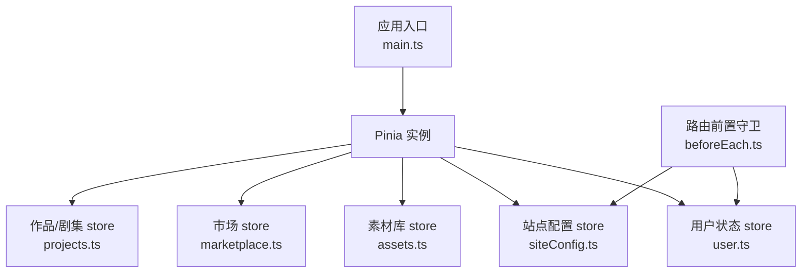
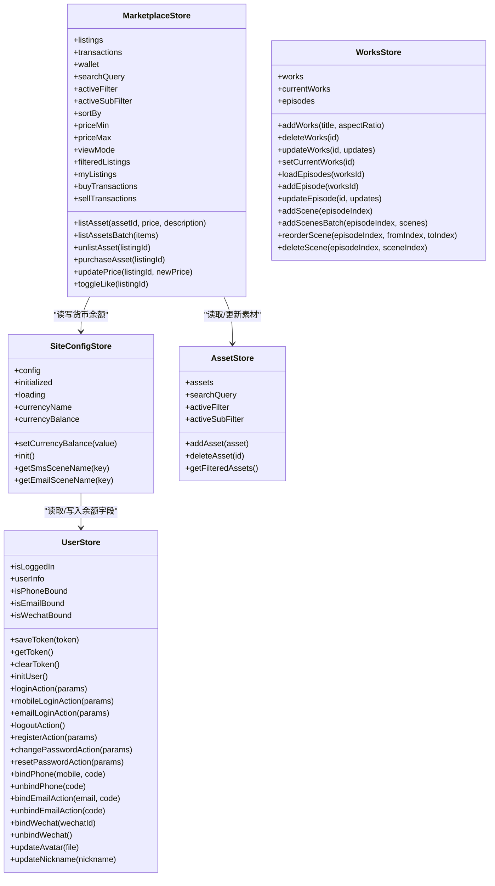
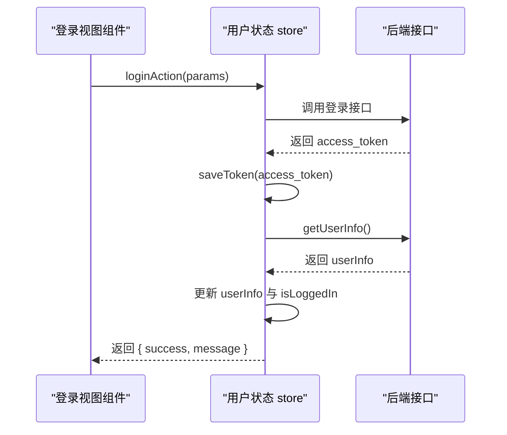
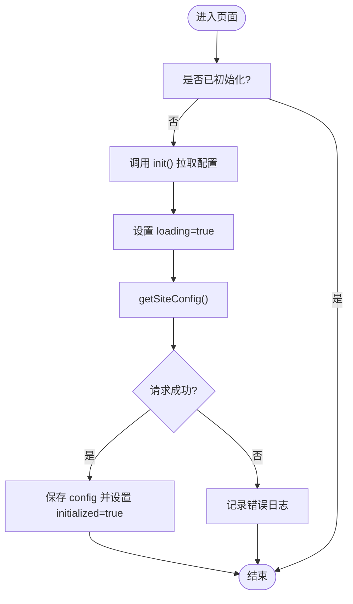
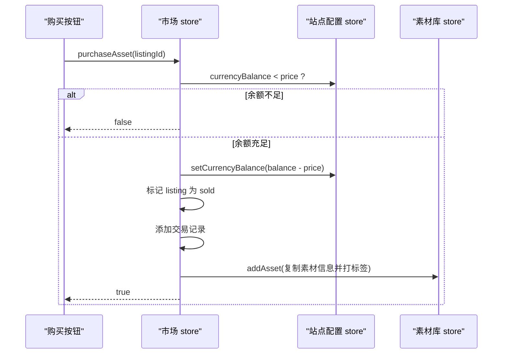
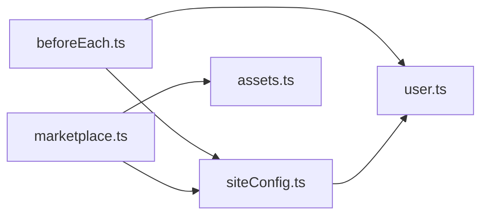

# Pinia架构设计

<cite>
**本文引用的文件**   
- [frontend/src/main.ts](file://frontend/src/main.ts)
- [frontend/src/stores/assets.ts](file://frontend/src/stores/assets.ts)
- [frontend/src/stores/marketplace.ts](file://frontend/src/stores/marketplace.ts)
- [frontend/src/stores/projects.ts](file://frontend/src/stores/projects.ts)
- [frontend/src/stores/siteConfig.ts](file://frontend/src/stores/siteConfig.ts)
- [frontend/src/stores/user.ts](file://frontend/src/stores/user.ts)
- [frontend/src/router/guards/beforeEach.ts](file://frontend/src/router/guards/beforeEach.ts)
</cite>

## 目录
1. [简介](#简介)
2. [项目结构](#项目结构)
3. [核心组件](#核心组件)
4. [架构总览](#架构总览)
5. [详细组件分析](#详细组件分析)
6. [依赖关系分析](#依赖关系分析)
7. [性能与可维护性建议](#性能与可维护性建议)
8. [故障排查指南](#故障排查指南)
9. [结论](#结论)

## 简介
本文件面向积木云AI创作平台的前端状态管理，系统性梳理基于Vue 3组合式API的Pinia Store架构。重点说明：
- defineStore的使用模式、响应式state声明、computed计算属性与actions方法的设计
- Store的模块化组织方式、依赖注入机制（在store中互相调用）与生命周期管理
- Store之间的依赖关系与数据流向，包括异步操作处理与错误处理策略
- 在组件中的正确使用方式与最佳实践

## 项目结构
前端采用按领域划分的Store模块，位于src/stores目录下；应用入口初始化Pinia实例；路由守卫在导航前完成站点配置与用户信息初始化。

图示来源
- [frontend/src/main.ts:8-10](file://frontend/src/main.ts#L8-L10)
- [frontend/src/router/guards/beforeEach.ts:19-35](file://frontend/src/router/guards/beforeEach.ts#L19-L35)

章节来源
- [frontend/src/main.ts:8-10](file://frontend/src/main.ts#L8-L10)
- [frontend/src/router/guards/beforeEach.ts:19-35](file://frontend/src/router/guards/beforeEach.ts#L19-L35)

## 核心组件
- 用户状态 store（user.ts）：负责登录态、用户信息、鉴权相关持久化与异步流程
- 站点配置 store（siteConfig.ts）：负责站点配置加载、货币名称与余额的计算与写入
- 素材库 store（assets.ts）：管理素材列表、筛选与搜索等本地状态
- 市场 store（marketplace.ts）：管理上架商品、交易记录、钱包余额，并与资产库和站点配置交互
- 作品/剧集 store（projects.ts）：管理作品、剧集、分镜场景等创作数据

章节来源
- [frontend/src/stores/user.ts:8-326](file://frontend/src/stores/user.ts#L8-L326)
- [frontend/src/stores/siteConfig.ts:7-99](file://frontend/src/stores/siteConfig.ts#L7-L99)
- [frontend/src/stores/assets.ts:43-160](file://frontend/src/stores/assets.ts#L43-L160)
- [frontend/src/stores/marketplace.ts:77-333](file://frontend/src/stores/marketplace.ts#L77-L333)
- [frontend/src/stores/projects.ts:73-278](file://frontend/src/stores/projects.ts#L73-L278)

## 架构总览
整体遵循“单一职责 + 组合式API”的Store设计：每个Store聚焦一个业务域，通过defineStore暴露响应式state、computed与actions。跨Store依赖通过直接import并使用useXxxStore获取实例，形成清晰的依赖图。

图示来源
- [frontend/src/stores/user.ts:8-326](file://frontend/src/stores/user.ts#L8-L326)
- [frontend/src/stores/siteConfig.ts:7-99](file://frontend/src/stores/siteConfig.ts#L7-L99)
- [frontend/src/stores/assets.ts:43-160](file://frontend/src/stores/assets.ts#L43-L160)
- [frontend/src/stores/marketplace.ts:77-333](file://frontend/src/stores/marketplace.ts#L77-L333)
- [frontend/src/stores/projects.ts:73-278](file://frontend/src/stores/projects.ts#L73-L278)

## 详细组件分析

### 用户状态 store（user.ts）
- 设计要点
  - 使用ref定义isLoggedIn、userInfo等响应式状态；使用computed派生绑定状态
  - 提供保存/获取/清除token的方法，结合localStorage实现持久化
  - initUser用于页面刷新时恢复登录态，并避免并发重复请求
  - 登录/注册/密码重置/绑定解绑/头像上传等方法统一封装为async actions，返回标准化结果对象
  - 错误处理：对网络或业务异常进行捕获，返回失败消息，保证UI层可感知
- 关键流程示例（登录）
  - 调用登录接口 -> 成功则保存token并拉取用户信息 -> 设置isLoggedIn为true -> 返回成功结果
  - 失败则返回失败消息，不改变登录态
- 生命周期与副作用
  - 无显式生命周期钩子，但initUser在路由守卫中被调用，确保全局初始化时机可控
- 组件使用建议
  - 在模板中通过computed访问userInfo与绑定状态
  - 在事件处理中调用loginAction等action，并根据返回结果提示用户

图示来源
- [frontend/src/stores/user.ts:88-105](file://frontend/src/stores/user.ts#L88-L105)
- [frontend/src/stores/user.ts:54-85](file://frontend/src/stores/user.ts#L54-L85)

章节来源
- [frontend/src/stores/user.ts:8-326](file://frontend/src/stores/user.ts#L8-L326)

### 站点配置 store（siteConfig.ts）
- 设计要点
  - 提供init异步方法从后端拉取站点配置，控制loading与initialized状态
  - 根据配置动态决定货币名称与余额字段（balance或integral），并通过computed暴露
  - setCurrencyBalance根据配置写入对应字段，保持与用户状态的联动
- 依赖关系
  - 依赖user.ts以读写余额字段
- 组件使用建议
  - 在需要显示货币名称或余额的地方直接使用computed属性
  - 在路由守卫中优先调用init，确保后续逻辑可用

图示来源
- [frontend/src/stores/siteConfig.ts:17-29](file://frontend/src/stores/siteConfig.ts#L17-L29)
- [frontend/src/stores/siteConfig.ts:53-86](file://frontend/src/stores/siteConfig.ts#L53-L86)

章节来源
- [frontend/src/stores/siteConfig.ts:7-99](file://frontend/src/stores/siteConfig.ts#L7-L99)

### 素材库 store（assets.ts）
- 设计要点
  - 集中管理素材主类型与子类型的类型定义，便于跨模块复用
  - 提供增删改查与过滤方法，支持按主类型、子类型与关键词检索
- 复杂度与优化
  - getFilteredAssets每次触发都会遍历数组，建议在大数据量时引入缓存或索引
- 组件使用建议
  - 在列表页中使用activeFilter、activeSubFilter与searchQuery驱动筛选
  - 使用getFilteredAssets作为渲染数据源

章节来源
- [frontend/src/stores/assets.ts:43-160](file://frontend/src/stores/assets.ts#L43-L160)

### 市场 store（marketplace.ts）
- 设计要点
  - 管理上架商品、交易记录与钱包余额，提供排序、筛选与视图切换
  - 与assets.ts与siteConfig.ts协作：购买时扣减余额、新增到素材库；上架/下架同步关联素材
- 关键流程示例（购买）
  - 校验商品存在且在售 -> 检查余额足够 -> 扣减余额 -> 标记已售 -> 生成交易记录 -> 将素材添加到资产库
- 错误处理
  - 余额不足或商品不存在时返回false，由调用方提示

图示来源
- [frontend/src/stores/marketplace.ts:255-293](file://frontend/src/stores/marketplace.ts#L255-L293)
- [frontend/src/stores/siteConfig.ts:77-86](file://frontend/src/stores/siteConfig.ts#L77-L86)
- [frontend/src/stores/assets.ts:116-122](file://frontend/src/stores/assets.ts#L116-L122)

章节来源
- [frontend/src/stores/marketplace.ts:77-333](file://frontend/src/stores/marketplace.ts#L77-L333)

### 作品/剧集 store（projects.ts）
- 设计要点
  - 管理作品、剧集与分镜场景的增删改与顺序调整
  - setCurrentWorks会加载对应剧集的Mock数据，便于演示
- 组件使用建议
  - 在编辑界面使用updateWorks/updateEpisode/addScene等方法局部更新状态
  - 拖拽排序时使用reorderScene

章节来源
- [frontend/src/stores/projects.ts:73-278](file://frontend/src/stores/projects.ts#L73-L278)

## 依赖关系分析
- 依赖方向
  - marketplace.ts 依赖 assets.ts 与 siteConfig.ts
  - siteConfig.ts 依赖 user.ts
  - beforeEach.ts 在路由导航前调用 siteConfig.ts 与 user.ts 的初始化方法
- 耦合度与内聚性
  - 各Store职责清晰，内聚性强；跨Store依赖通过函数式调用，避免循环依赖
- 潜在风险
  - marketplace.ts 与 assets.ts 之间存在双向语义关联（上架/下架影响彼此），需确保状态一致性

图示来源
- [frontend/src/router/guards/beforeEach.ts:19-35](file://frontend/src/router/guards/beforeEach.ts#L19-L35)
- [frontend/src/stores/marketplace.ts:208-232](file://frontend/src/stores/marketplace.ts#L208-L232)
- [frontend/src/stores/siteConfig.ts:77-86](file://frontend/src/stores/siteConfig.ts#L77-L86)

章节来源
- [frontend/src/router/guards/beforeEach.ts:19-35](file://frontend/src/router/guards/beforeEach.ts#L19-L35)
- [frontend/src/stores/marketplace.ts:77-333](file://frontend/src/stores/marketplace.ts#L77-L333)
- [frontend/src/stores/siteConfig.ts:7-99](file://frontend/src/stores/siteConfig.ts#L7-L99)
- [frontend/src/stores/user.ts:8-326](file://frontend/src/stores/user.ts#L8-L326)

## 性能与可维护性建议
- 计算属性与过滤
  - 对于大数据集（如assets.ts的getFilteredAssets），建议引入缓存或索引结构，减少重复计算
- 异步操作
  - 所有网络请求集中在store的actions中，统一错误处理与返回值格式，便于UI层一致化处理
- 状态一致性
  - 跨store的状态变更（如购买后更新资产库）应原子化执行，必要时增加事务式包装或回滚逻辑
- 可测试性
  - 将复杂逻辑（如筛选排序、价格区间处理）拆分为纯函数，便于单元测试

[本节为通用指导，无需列出具体文件来源]

## 故障排查指南
- 登录后仍被重定向
  - 检查路由守卫是否正确等待initUser完成，确认isLoggedIn状态是否更新
- 余额显示不正确
  - 确认siteConfig.recharge_type对应的字段选择逻辑，以及setCurrencyBalance是否被正确调用
- 购买失败
  - 检查marketplace.purchaseAsset的余额校验与listing状态，确认assets.addAsset是否成功插入
- 站点配置未加载
  - 查看siteConfig.init的错误日志，确认getSiteConfig接口是否正常返回

章节来源
- [frontend/src/router/guards/beforeEach.ts:19-35](file://frontend/src/router/guards/beforeEach.ts#L19-L35)
- [frontend/src/stores/siteConfig.ts:17-29](file://frontend/src/stores/siteConfig.ts#L17-L29)
- [frontend/src/stores/marketplace.ts:255-293](file://frontend/src/stores/marketplace.ts#L255-L293)
- [frontend/src/stores/assets.ts:116-122](file://frontend/src/stores/assets.ts#L116-L122)

## 结论
本项目采用Pinia的组合式API风格，围绕用户、站点配置、素材库、市场与作品等核心领域划分Store，职责清晰、依赖明确。通过统一的异步处理与错误处理策略，提升了可维护性与用户体验。未来可在大数据过滤、跨Store事务一致性方面进一步优化，增强系统的可扩展性与健壮性。