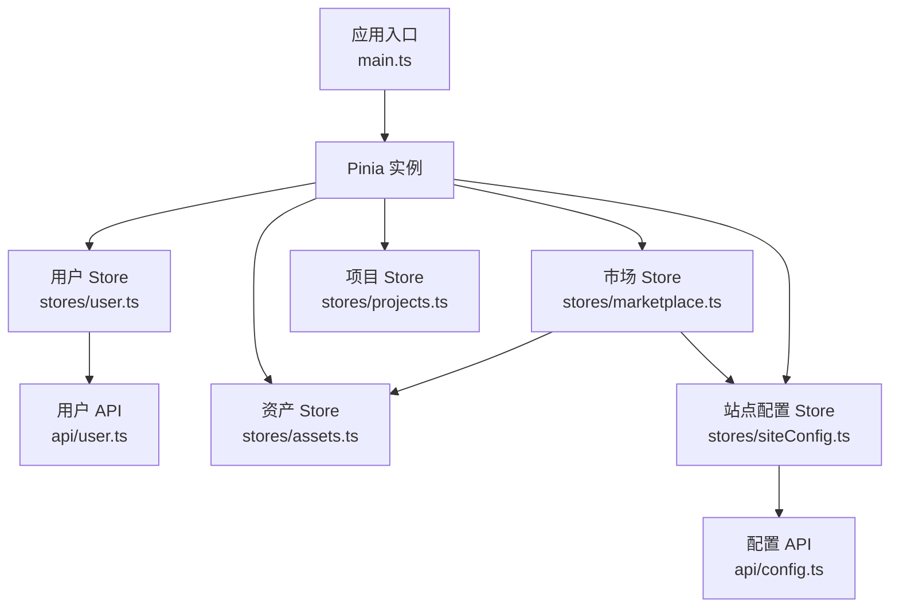
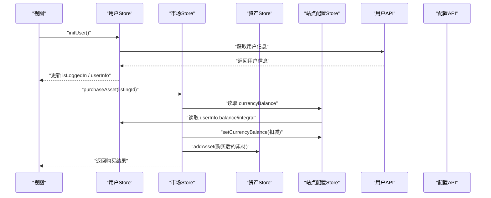
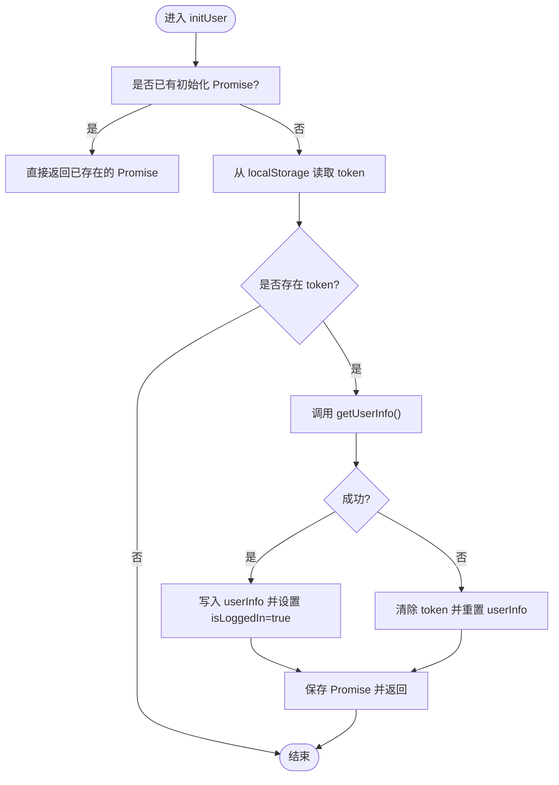
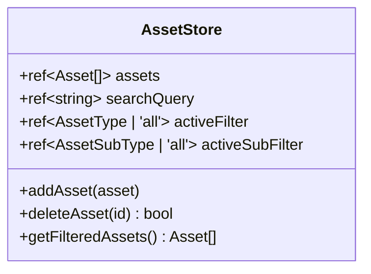
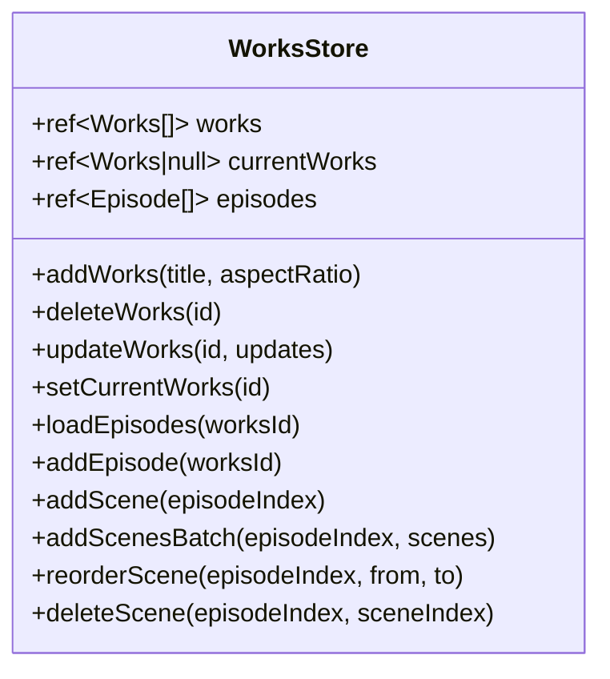
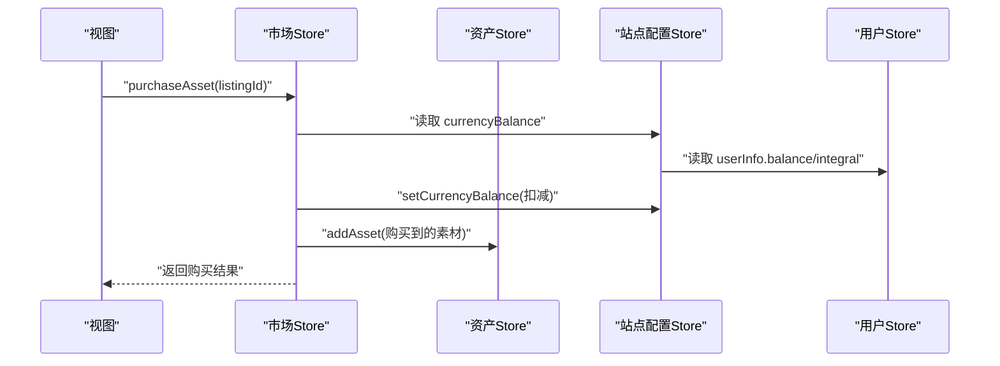
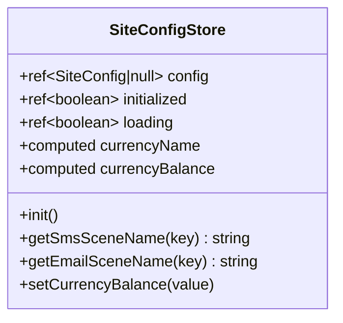
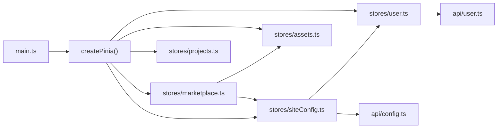

# 状态管理与数据流

<cite>
**本文引用的文件**   
- [main.ts](file://frontend/src/main.ts)
- [user.ts](file://frontend/src/stores/user.ts)
- [assets.ts](file://frontend/src/stores/assets.ts)
- [projects.ts](file://frontend/src/stores/projects.ts)
- [marketplace.ts](file://frontend/src/stores/marketplace.ts)
- [siteConfig.ts](file://frontend/src/stores/siteConfig.ts)
- [user.ts](file://frontend/src/api/user.ts)
- [config.ts](file://frontend/src/api/config.ts)
</cite>

## 目录
1. [简介](#简介)
2. [项目结构](#项目结构)
3. [核心组件](#核心组件)
4. [架构总览](#架构总览)
5. [详细组件分析](#详细组件分析)
6. [依赖关系分析](#依赖关系分析)
7. [性能与优化](#性能与优化)
8. [故障排查指南](#故障排查指南)
9. [结论](#结论)
10. [附录](#附录)

## 简介
本文件面向积木云AI创作平台的前端状态管理与数据流，聚焦基于 Pinia 的全局状态管理架构。文档覆盖 store 模块化设计、状态持久化策略、异步操作处理、核心业务模块（用户、资产、项目、市场、站点配置）的数据结构设计，并提供状态更新模式、计算属性使用、watch 监听器最佳实践说明，以及状态同步机制、缓存策略和性能优化方案。

## 项目结构
前端采用按领域划分的 store 模块化组织：
- 用户域：登录态、个人信息、绑定关系、头像/昵称等
- 资产域：素材类型定义、素材列表、筛选与搜索
- 项目域：作品、剧集、分镜场景的增删改查与排序
- 市场域：上架商品、交易记录、钱包余额、筛选排序
- 站点配置域：全局配置加载、货币名称/余额派生、模板名称映射

图表来源
- [main.ts:1-21](file://frontend/src/main.ts#L1-L21)
- [user.ts](file://frontend/src/stores/user.ts)
- [assets.ts](file://frontend/src/stores/assets.ts)
- [projects.ts](file://frontend/src/stores/projects.ts)
- [marketplace.ts](file://frontend/src/stores/marketplace.ts)
- [siteConfig.ts](file://frontend/src/stores/siteConfig.ts)
- [user.ts](file://frontend/src/api/user.ts)
- [config.ts](file://frontend/src/api/config.ts)

章节来源
- [main.ts:1-21](file://frontend/src/main.ts#L1-L21)

## 核心组件
- 用户 Store：负责登录态、用户信息、Token 持久化、资料编辑、绑定解绑、头像上传等；提供 initUser 防止并发重复初始化。
- 资产 Store：定义素材主/子类型与数据结构，维护素材列表与筛选条件，提供新增/删除与过滤方法。
- 项目 Store：维护作品、剧集、分镜场景的本地数据，支持新建、删除、局部更新、批量新增、拖拽重排等。
- 市场 Store：维护上架商品、交易记录、钱包余额，提供筛选/排序、上架/下架、购买、点赞、改价等操作，并与资产/配置 Store 联动。
- 站点配置 Store：拉取并缓存站点配置，提供货币名称/余额派生与设置、短信/邮件模板名称映射。

章节来源
- [user.ts](file://frontend/src/stores/user.ts)
- [assets.ts](file://frontend/src/stores/assets.ts)
- [projects.ts](file://frontend/src/stores/projects.ts)
- [marketplace.ts](file://frontend/src/stores/marketplace.ts)
- [siteConfig.ts](file://frontend/src/stores/siteConfig.ts)

## 架构总览
整体数据流遵循“视图调用 Store 方法 → Store 调用 API → 返回后更新响应式状态”的模式。跨 Store 协作通过引入其他 Store 实现，例如市场 Store 在购物的同时更新资产库与站点配置的余额。

图表来源
- [user.ts](file://frontend/src/stores/user.ts)
- [marketplace.ts](file://frontend/src/stores/marketplace.ts)
- [siteConfig.ts](file://frontend/src/stores/siteConfig.ts)
- [assets.ts](file://frontend/src/stores/assets.ts)
- [user.ts](file://frontend/src/api/user.ts)
- [config.ts](file://frontend/src/api/config.ts)

## 详细组件分析

### 用户 Store 分析
- 状态设计
  - 登录态：isLoggedIn
  - 用户信息：userInfo（含余额、积分、绑定信息等）
  - 初始化防抖：initPromise 避免并发重复请求
  - 计算属性：isPhoneBound、isEmailBound、isWechatBound
- 持久化策略
  - Token 存储于 localStorage，提供 save/get/clear 方法
  - 页面刷新时通过 initUser 恢复登录态
- 异步流程
  - 登录/手机登录/邮箱登录：保存 token → 拉取用户信息 → 更新状态
  - 退出登录：调用服务端接口后清理本地状态
  - 资料修改：单字段更新、头像上传后回写
- 错误处理
  - 统一捕获异常并返回结构化结果 { success, message }
  - 初始化失败时清理 token 与用户信息

图表来源
- [user.ts](file://frontend/src/stores/user.ts)
- [user.ts](file://frontend/src/api/user.ts)

章节来源
- [user.ts](file://frontend/src/stores/user.ts)
- [user.ts](file://frontend/src/api/user.ts)

### 资产 Store 分析
- 数据结构
  - AssetType、VoiceSubType、SoundEffectSubType、VideoSubType、AssetSubType 联合类型
  - Asset 包含 id、name、type、subType、thumbnail、mediaUrl、duration、tags、createdAt、listingId
- 状态与方法
  - assets：素材列表
  - searchQuery、activeFilter、activeSubFilter：筛选与搜索
  - addAsset/deleteAsset：新增/删除（已上架不可删）
  - getFilteredAssets：组合多条件过滤
- 复杂度
  - 过滤为 O(n)，n 为素材数量；可通过索引或后端分页进一步优化

图表来源
- [assets.ts](file://frontend/src/stores/assets.ts)

章节来源
- [assets.ts](file://frontend/src/stores/assets.ts)

### 项目 Store 分析
- 数据结构
  - Works：作品（标题、封面、更新时间、集数、状态、宽高比）
  - Episode：剧集（所属作品、标题、封面、排序、分镜列表）
  - Scene：分镜场景（背景、角色/表情/动作/道具/特效引用、描述、时长、视频地址）
- 状态与方法
  - works、currentWorks、episodes
  - addWorks/deleteWorks/updateWorks：作品 CRUD
  - setCurrentWorks/loadEpisodes：选择作品并加载剧集
  - addEpisode/addScene/addScenesBatch/reorderScene/deleteScene：剧集与分镜管理
- 性能建议
  - 对 scenes 的频繁插入/删除建议使用不可变更新或虚拟列表渲染

图表来源
- [projects.ts](file://frontend/src/stores/projects.ts)

章节来源
- [projects.ts](file://frontend/src/stores/projects.ts)

### 市场 Store 分析
- 数据结构
  - MarketListing：上架商品（关联素材、卖家、价格、状态、统计、描述）
  - Transaction：交易记录（买入/卖出、金额、时间）
  - UserWallet：钱包（余额、累计收入、累计支出）
- 状态与方法
  - listings、transactions、wallet
  - filteredListings/myListings/buyTransactions/sellTransactions：计算属性
  - listAsset/listAssetsBatch/unlistAsset/purchaseAsset/updatePrice/toggleLike：业务操作
- 跨 Store 协作
  - 购买时扣减站点配置余额（根据 recharge_type 决定 balance 或 integral），并将素材加入资产库
  - 上架/下架时同步资产 Store 的 listingId

图表来源
- [marketplace.ts](file://frontend/src/stores/marketplace.ts)
- [assets.ts](file://frontend/src/stores/assets.ts)
- [siteConfig.ts](file://frontend/src/stores/siteConfig.ts)
- [user.ts](file://frontend/src/stores/user.ts)

章节来源
- [marketplace.ts](file://frontend/src/stores/marketplace.ts)
- [assets.ts](file://frontend/src/stores/assets.ts)
- [siteConfig.ts](file://frontend/src/stores/siteConfig.ts)
- [user.ts](file://frontend/src/stores/user.ts)

### 站点配置 Store 分析
- 状态与方法
  - config：站点配置对象
  - initialized/loading：初始化与加载状态
  - init：首次拉取配置并标记完成
  - getSmsSceneName/getEmailSceneName：模板名称映射
  - currencyName/currencyBalance：根据 recharge_type 派生货币名称与余额
  - setCurrencyBalance：根据 recharge_type 写入 user.balance 或 user.integral
- 与用户 Store 的耦合
  - 通过 useUserStore 读写当前用户的余额或积分

图表来源
- [siteConfig.ts](file://frontend/src/stores/siteConfig.ts)
- [config.ts](file://frontend/src/api/config.ts)

章节来源
- [siteConfig.ts](file://frontend/src/stores/siteConfig.ts)
- [config.ts](file://frontend/src/api/config.ts)

## 依赖关系分析
- 入口注册
  - main.ts 中创建 Pinia 实例并挂载到应用
- Store 间依赖
  - marketplace.ts 依赖 assets.ts 与 siteConfig.ts
  - siteConfig.ts 依赖 user.ts（用于读写余额/积分）
- API 层依赖
  - stores/user.ts 依赖 api/user.ts
  - stores/siteConfig.ts 依赖 api/config.ts

图表来源
- [main.ts](file://frontend/src/main.ts)
- [user.ts](file://frontend/src/stores/user.ts)
- [assets.ts](file://frontend/src/stores/assets.ts)
- [projects.ts](file://frontend/src/stores/projects.ts)
- [marketplace.ts](file://frontend/src/stores/marketplace.ts)
- [siteConfig.ts](file://frontend/src/stores/siteConfig.ts)
- [user.ts](file://frontend/src/api/user.ts)
- [config.ts](file://frontend/src/api/config.ts)

章节来源
- [main.ts:1-21](file://frontend/src/main.ts#L1-L21)

## 性能与优化
- 计算属性优先
  - 使用 computed 进行筛选与派生（如 market 的 filteredListings、siteConfig 的 currencyName/currencyBalance），减少重复计算与不必要的 watch
- 防抖与去重
  - 用户 Store 的 initPromise 避免并发重复初始化，降低网络压力
- 局部更新
  - 项目 Store 的 updateWorks/updateEpisode 采用局部合并更新，避免整树替换
- 大数据量优化
  - 资产与市场列表若增长较大，建议结合后端分页与前端虚拟滚动；过滤逻辑可考虑建立索引或预聚合
- 状态持久化
  - 当前仅持久化 Token；如需持久化更多状态（如筛选条件、最近项目），可使用 pinia-plugin-persistedstate 或自行封装 localStorage 同步
- 副作用隔离
  - 将跨 Store 的副作用集中在单一 Store 的方法内（如 purchaseAsset），保持职责清晰

[本节为通用指导，不直接分析具体文件]

## 故障排查指南
- 登录态异常
  - 现象：刷新后未自动登录或提示未登录
  - 排查：检查 initUser 是否正确读取 token 并调用 getUserInfo；确认接口返回结构与错误分支
  - 参考路径：[用户 Store 初始化与登录流程](file://frontend/src/stores/user.ts)
- 余额/积分不一致
  - 现象：购买后余额未扣减或显示错误
  - 排查：确认 siteConfig.recharge_type 与 setCurrencyBalance 写入目标字段一致；检查 marketplace.purchaseAsset 的扣减顺序
  - 参考路径：[站点配置 Store 与用户 Store 交互](file://frontend/src/stores/siteConfig.ts), [市场 Store 购买流程](file://frontend/src/stores/marketplace.ts)
- 素材上架/下架不同步
  - 现象：上架后资产仍显示未上架或反之
  - 排查：检查 listAsset/unlistAsset 中对 asset.listingId 的同步逻辑
  - 参考路径：[市场 Store 与资产 Store 联动](file://frontend/src/stores/marketplace.ts), [资产 Store](file://frontend/src/stores/assets.ts)
- 配置加载阻塞
  - 现象：页面因等待配置而白屏或功能不可用
  - 排查：确认 init 的 loading/initialized 标志位使用正确；必要时提供降级默认值
  - 参考路径：[站点配置 Store 初始化](file://frontend/src/stores/siteConfig.ts)

章节来源
- [user.ts](file://frontend/src/stores/user.ts)
- [siteConfig.ts](file://frontend/src/stores/siteConfig.ts)
- [marketplace.ts](file://frontend/src/stores/marketplace.ts)
- [assets.ts](file://frontend/src/stores/assets.ts)

## 结论
本项目采用清晰的 Pinia 模块化架构，围绕用户、资产、项目、市场与站点配置五大核心域构建状态管理。通过计算属性、防抖初始化与跨 Store 协作，实现了良好的可读性与扩展性。后续可在状态持久化、大数据量渲染与更细粒度的缓存策略上持续优化，以进一步提升用户体验与系统性能。

[本节为总结性内容，不直接分析具体文件]

## 附录

### 关键数据结构速览
- 用户信息
  - 字段：id、username、nickname、mobile、email、avatar、balance、integral 等
  - 参考路径：[用户信息类型定义](file://frontend/src/api/user.ts)
- 资产
  - 字段：id、name、type、subType、thumbnail、mediaUrl、duration、tags、createdAt、listingId
  - 参考路径：[资产类型与接口](file://frontend/src/stores/assets.ts)
- 作品/剧集/分镜
  - 字段：Works/Epidode/Scene 的多级嵌套结构
  - 参考路径：[项目数据结构](file://frontend/src/stores/projects.ts)
- 市场上架/交易/钱包
  - 字段：MarketListing/Transaction/UserWallet
  - 参考路径：[市场数据结构](file://frontend/src/stores/marketplace.ts)
- 站点配置
  - 字段：system/webIcp/sms/email/user/login_list/assets/community
  - 参考路径：[站点配置类型定义](file://frontend/src/api/config.ts)

章节来源
- [user.ts](file://frontend/src/api/user.ts)
- [assets.ts](file://frontend/src/stores/assets.ts)
- [projects.ts](file://frontend/src/stores/projects.ts)
- [marketplace.ts](file://frontend/src/stores/marketplace.ts)
- [config.ts](file://frontend/src/api/config.ts)