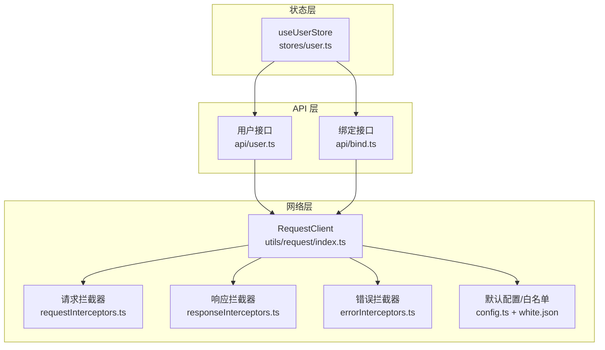
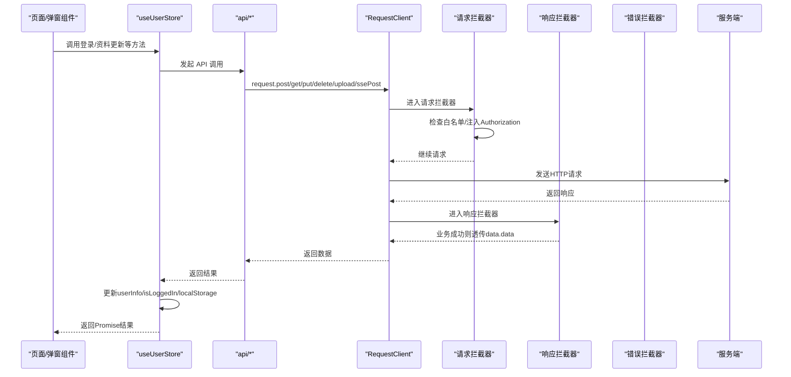
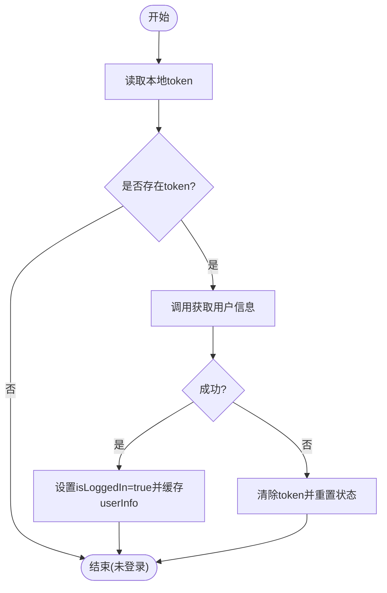
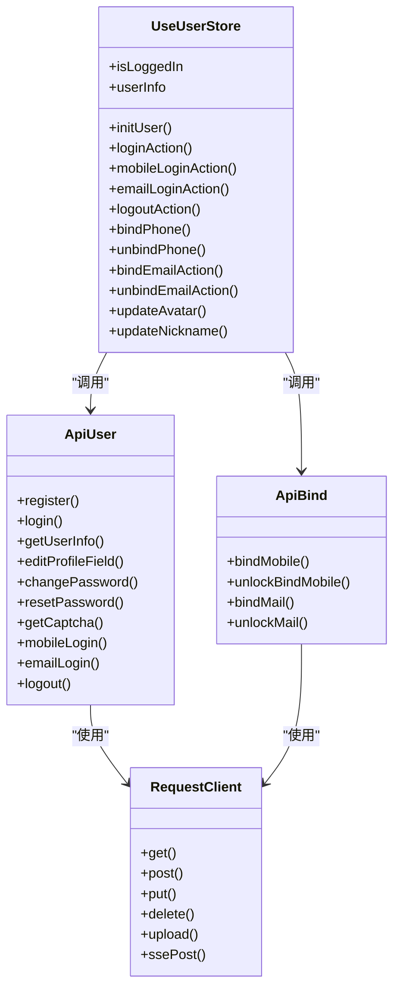

# 用户状态管理

<cite>
**本文引用的文件**   
- [frontend/src/stores/user.ts](file://frontend/src/stores/user.ts)
- [frontend/src/api/user.ts](file://frontend/src/api/user.ts)
- [frontend/src/api/bind.ts](file://frontend/src/api/bind.ts)
- [frontend/src/utils/request/index.ts](file://frontend/src/utils/request/index.ts)
- [frontend/src/utils/request/config.ts](file://frontend/src/utils/request/config.ts)
- [frontend/src/utils/request/white.json](file://frontend/src/utils/request/white.json)
- [frontend/src/utils/request/requestInterceptors.ts](file://frontend/src/utils/request/requestInterceptors.ts)
- [frontend/src/utils/request/responseInterceptors.ts](file://frontend/src/utils/request/responseInterceptors.ts)
- [frontend/src/utils/request/errorInterceptors.ts](file://frontend/src/utils/request/errorInterceptors.ts)
</cite>

## 目录
1. [简介](#简介)
2. [项目结构](#项目结构)
3. [核心组件](#核心组件)
4. [架构总览](#架构总览)
5. [详细组件分析](#详细组件分析)
6. [依赖关系分析](#依赖关系分析)
7. [性能与并发控制](#性能与并发控制)
8. [错误处理策略](#错误处理策略)
9. [故障排查指南](#故障排查指南)
10. [结论](#结论)

## 简介
本文件面向积木云AI创作平台的前端用户状态管理，围绕 useUserStore 的实现进行系统化说明。内容涵盖：
- 用户认证状态管理、登录/登出流程
- 用户信息持久化（token 与本地状态）
- 多种登录方式（用户名密码、手机验证码、邮箱验证码）
- 用户信息完整数据结构（基本信息、账户余额、积分等）
- 绑定/解绑手机号与邮箱、头像上传更新、个人信息修改
- 请求层的 token 注入、白名单机制、SSE 流式请求
- 并发请求控制与错误处理策略

## 项目结构
与用户状态管理相关的关键位置如下：
- 状态层：stores/user.ts
- API 层：api/user.ts、api/bind.ts
- 网络层：utils/request/index.ts 及其拦截器与配置
- 路由守卫与页面组件中广泛使用 useUserStore（例如登录弹窗、个人资料弹窗等）

图表来源
- [frontend/src/stores/user.ts:1-327](file://frontend/src/stores/user.ts#L1-L327)
- [frontend/src/api/user.ts:1-226](file://frontend/src/api/user.ts#L1-L226)
- [frontend/src/api/bind.ts:1-58](file://frontend/src/api/bind.ts#L1-L58)
- [frontend/src/utils/request/index.ts:1-237](file://frontend/src/utils/request/index.ts#L1-L237)
- [frontend/src/utils/request/requestInterceptors.ts:1-47](file://frontend/src/utils/request/requestInterceptors.ts#L1-L47)
- [frontend/src/utils/request/responseInterceptors.ts:1-24](file://frontend/src/utils/request/responseInterceptors.ts#L1-L24)
- [frontend/src/utils/request/errorInterceptors.ts:1-57](file://frontend/src/utils/request/errorInterceptors.ts#L1-L57)
- [frontend/src/utils/request/config.ts:1-39](file://frontend/src/utils/request/config.ts#L1-L39)
- [frontend/src/utils/request/white.json:1-28](file://frontend/src/utils/request/white.json#L1-L28)

章节来源
- [frontend/src/stores/user.ts:1-327](file://frontend/src/stores/user.ts#L1-L327)
- [frontend/src/api/user.ts:1-226](file://frontend/src/api/user.ts#L1-L226)
- [frontend/src/api/bind.ts:1-58](file://frontend/src/api/bind.ts#L1-L58)
- [frontend/src/utils/request/index.ts:1-237](file://frontend/src/utils/request/index.ts#L1-L237)
- [frontend/src/utils/request/config.ts:1-39](file://frontend/src/utils/request/config.ts#L1-L39)
- [frontend/src/utils/request/white.json:1-28](file://frontend/src/utils/request/white.json#L1-L28)
- [frontend/src/utils/request/requestInterceptors.ts:1-47](file://frontend/src/utils/request/requestInterceptors.ts#L1-L47)
- [frontend/src/utils/request/responseInterceptors.ts:1-24](file://frontend/src/utils/request/responseInterceptors.ts#L1-L24)
- [frontend/src/utils/request/errorInterceptors.ts:1-57](file://frontend/src/utils/request/errorInterceptors.ts#L1-L57)

## 核心组件
- useUserStore：基于 Pinia 的用户状态管理，封装了登录、注册、密码管理、绑定/解绑、头像与昵称更新、初始化与持久化等能力。
- RequestClient：统一的 HTTP 客户端，负责自动附加 Token、统一响应结构解析、上传进度、SSE 流式请求等。
- 拦截器体系：请求拦截器负责白名单判断与 Bearer Token 注入；响应拦截器统一业务错误广播；错误拦截器按 HTTP 状态码分类广播事件。

章节来源
- [frontend/src/stores/user.ts:1-327](file://frontend/src/stores/user.ts#L1-L327)
- [frontend/src/utils/request/index.ts:1-237](file://frontend/src/utils/request/index.ts#L1-L237)
- [frontend/src/utils/request/requestInterceptors.ts:1-47](file://frontend/src/utils/request/requestInterceptors.ts#L1-L47)
- [frontend/src/utils/request/responseInterceptors.ts:1-24](file://frontend/src/utils/request/responseInterceptors.ts#L1-L24)
- [frontend/src/utils/request/errorInterceptors.ts:1-57](file://frontend/src/utils/request/errorInterceptors.ts#L1-L57)

## 架构总览
下图展示了从页面调用到服务端返回的完整链路，以及 token 的注入与校验逻辑。

图表来源
- [frontend/src/stores/user.ts:1-327](file://frontend/src/stores/user.ts#L1-L327)
- [frontend/src/api/user.ts:1-226](file://frontend/src/api/user.ts#L1-L226)
- [frontend/src/api/bind.ts:1-58](file://frontend/src/api/bind.ts#L1-L58)
- [frontend/src/utils/request/index.ts:1-237](file://frontend/src/utils/request/index.ts#L1-L237)
- [frontend/src/utils/request/requestInterceptors.ts:1-47](file://frontend/src/utils/request/requestInterceptors.ts#L1-L47)
- [frontend/src/utils/request/responseInterceptors.ts:1-24](file://frontend/src/utils/request/responseInterceptors.ts#L1-L24)
- [frontend/src/utils/request/errorInterceptors.ts:1-57](file://frontend/src/utils/request/errorInterceptors.ts#L1-L57)

## 详细组件分析

### 用户状态模型与字段定义
- 用户信息类型包含以下关键字段：
  - 基本信息：id、username、nickname、mobile、email、avatar、create_at、login_ip、login_time
  - 资产与权益：balance、freeze_balance、integral
  - 扩展字段：支持动态键值对
- 派生状态：是否已绑定手机、邮箱、微信由 userInfo 计算得出，便于在界面直接展示。

章节来源
- [frontend/src/api/user.ts:15-42](file://frontend/src/api/user.ts#L15-L42)
- [frontend/src/stores/user.ts:15-36](file://frontend/src/stores/user.ts#L15-L36)

### 认证与登录流程
- 用户名密码登录：调用登录接口获取 access_token，保存到 localStorage，随后拉取用户信息并设置 isLoggedIn。
- 手机验证码登录：流程同上，仅参数不同。
- 邮箱验证码登录：流程同上，仅参数不同。
- 初始化用户：应用启动或刷新时，若存在 token 则拉取用户信息；失败则清理本地状态。

图表来源
- [frontend/src/stores/user.ts:54-85](file://frontend/src/stores/user.ts#L54-L85)
- [frontend/src/api/user.ts:167-169](file://frontend/src/api/user.ts#L167-L169)

章节来源
- [frontend/src/stores/user.ts:87-141](file://frontend/src/stores/user.ts#L87-L141)
- [frontend/src/stores/user.ts:54-85](file://frontend/src/stores/user.ts#L54-L85)
- [frontend/src/api/user.ts:160-162](file://frontend/src/api/user.ts#L160-L162)
- [frontend/src/api/user.ts:209-218](file://frontend/src/api/user.ts#L209-L218)

### 登出流程
- 调用服务端退出接口（即使失败也继续执行），然后清理本地 token 与用户信息，并将 isLoggedIn 置为 false。

章节来源
- [frontend/src/stores/user.ts:144-170](file://frontend/src/stores/user.ts#L144-L170)
- [frontend/src/api/user.ts:223-225](file://frontend/src/api/user.ts#L223-L225)

### 绑定/解绑功能
- 绑定手机号：提交手机号与验证码成功后，同步更新本地 userInfo.mobile。
- 解绑手机号：提交验证码成功后，清空本地 userInfo.mobile。
- 绑定邮箱：提交邮箱与验证码成功后，同步更新本地 userInfo.email。
- 解绑邮箱：提交验证码成功后，清空本地 userInfo.email。
- 绑定/解绑微信：当前为前端模拟实现，用于演示流程。

章节来源
- [frontend/src/stores/user.ts:205-271](file://frontend/src/stores/user.ts#L205-L271)
- [frontend/src/api/bind.ts:34-57](file://frontend/src/api/bind.ts#L34-L57)

### 头像上传与个人信息修改
- 头像上传：先调用上传接口获取图片 URL，再调用“单字段编辑”接口保存 avatar，最后更新本地 userInfo.avatar。
- 修改昵称：调用“单字段编辑”接口保存 nickname，并更新本地状态。

章节来源
- [frontend/src/stores/user.ts:273-298](file://frontend/src/stores/user.ts#L273-L298)
- [frontend/src/api/user.ts:174-176](file://frontend/src/api/user.ts#L174-L176)
- [frontend/src/utils/request/index.ts:82-121](file://frontend/src/utils/request/index.ts#L82-L121)

### 密码与安全
- 修改密码：需要原始密码与新密码。
- 找回密码：通过手机号或邮箱+验证码+新密码完成重置。
- 图形验证码：提供获取验证码接口，部分敏感操作可配合 captcha_key/captcha_code。

章节来源
- [frontend/src/api/user.ts:188-204](file://frontend/src/api/user.ts#L188-L204)

### Token 存储与注入机制
- 存储：localStorage 中的 key 为 token。
- 注入：请求拦截器在非白名单接口上自动附加 Authorization: Bearer <token>。
- 白名单：white.json 中列出的接口无需登录即可访问（如登录、注册、验证码、公开列表等）。

章节来源
- [frontend/src/stores/user.ts:38-51](file://frontend/src/stores/user.ts#L38-L51)
- [frontend/src/utils/request/requestInterceptors.ts:12-38](file://frontend/src/utils/request/requestInterceptors.ts#L12-L38)
- [frontend/src/utils/request/config.ts:12-38](file://frontend/src/utils/request/config.ts#L12-L38)
- [frontend/src/utils/request/white.json:1-28](file://frontend/src/utils/request/white.json#L1-L28)

### SSE 流式请求
- 针对 AI 对话等场景，RequestClient 提供 ssePost 方法，基于 XMLHttpRequest 解析 text/event-stream，逐块回调文本片段，并在收到 [DONE] 后结束。

章节来源
- [frontend/src/utils/request/index.ts:132-227](file://frontend/src/utils/request/index.ts#L132-L227)

## 依赖关系分析
- useUserStore 依赖 api/user.ts 与 api/bind.ts 提供的接口函数。
- api/* 均基于 utils/request/index.ts 的 RequestClient 实例。
- RequestClient 内部组合了请求/响应/错误拦截器与默认配置（含白名单）。

图表来源
- [frontend/src/stores/user.ts:1-327](file://frontend/src/stores/user.ts#L1-L327)
- [frontend/src/api/user.ts:1-226](file://frontend/src/api/user.ts#L1-L226)
- [frontend/src/api/bind.ts:1-58](file://frontend/src/api/bind.ts#L1-L58)
- [frontend/src/utils/request/index.ts:1-237](file://frontend/src/utils/request/index.ts#L1-L237)

章节来源
- [frontend/src/stores/user.ts:1-327](file://frontend/src/stores/user.ts#L1-L327)
- [frontend/src/api/user.ts:1-226](file://frontend/src/api/user.ts#L1-L226)
- [frontend/src/api/bind.ts:1-58](file://frontend/src/api/bind.ts#L1-L58)
- [frontend/src/utils/request/index.ts:1-237](file://frontend/src/utils/request/index.ts#L1-L237)

## 性能与并发控制
- 初始化防抖：initUser 使用 initPromise 保证同一时刻只发起一次用户信息拉取，避免页面多处同时触发导致的重复请求。
- 上传进度：upload 支持 onProgress 回调，便于展示上传百分比。
- 超时与取消：常规请求默认超时 30s；上传不设置超时；SSE 请求支持 AbortSignal 取消。

章节来源
- [frontend/src/stores/user.ts:12-13](file://frontend/src/stores/user.ts#L12-L13)
- [frontend/src/stores/user.ts:54-85](file://frontend/src/stores/user.ts#L54-L85)
- [frontend/src/utils/request/index.ts:82-121](file://frontend/src/utils/request/index.ts#L82-L121)
- [frontend/src/utils/request/index.ts:132-227](file://frontend/src/utils/request/index.ts#L132-L227)
- [frontend/src/utils/request/config.ts:7-10](file://frontend/src/utils/request/config.ts#L7-L10)

## 错误处理策略
- 业务错误：响应拦截器在 data.status !== 0 时抛出错误并通过事件总线广播 business-error。
- HTTP 错误：错误拦截器根据状态码分类广播 forbidden、redirect-permanent、redirect-temporary、http-error 等事件，便于全局统一提示或跳转。
- 登录态失效：请求拦截器在未携带 token 且非白名单时拒绝请求；初始化用户信息失败会清理本地 token 并重置状态。

章节来源
- [frontend/src/utils/request/responseInterceptors.ts:10-23](file://frontend/src/utils/request/responseInterceptors.ts#L10-L23)
- [frontend/src/utils/request/errorInterceptors.ts:10-56](file://frontend/src/utils/request/errorInterceptors.ts#L10-L56)
- [frontend/src/utils/request/requestInterceptors.ts:26-38](file://frontend/src/utils/request/requestInterceptors.ts#L26-L38)
- [frontend/src/stores/user.ts:54-85](file://frontend/src/stores/user.ts#L54-L85)

## 故障排查指南
- 无法访问受保护接口
  - 检查是否在白名单中；确认 localStorage 中存在 token；确认请求拦截器是否正确注入 Authorization。
- 登录后仍被判定未登录
  - 检查 getUserInfo 是否成功；确认响应拦截器是否正确解析 data.data；查看业务错误广播消息。
- 头像上传失败
  - 检查 upload 接口返回的 url 是否有效；确认 editProfileField 调用是否成功；关注上传进度与错误事件。
- 绑定/解绑异常
  - 核对验证码是否正确；检查 bind/unlock 接口返回；确认本地 userInfo 对应字段是否同步更新。
- SSE 流中断
  - 检查服务端是否持续推送 text/event-stream；确认客户端是否正确解析 data: 行；必要时使用 AbortController 取消并重试。

章节来源
- [frontend/src/utils/request/white.json:1-28](file://frontend/src/utils/request/white.json#L1-L28)
- [frontend/src/utils/request/requestInterceptors.ts:12-38](file://frontend/src/utils/request/requestInterceptors.ts#L12-L38)
- [frontend/src/utils/request/responseInterceptors.ts:10-23](file://frontend/src/utils/request/responseInterceptors.ts#L10-L23)
- [frontend/src/utils/request/errorInterceptors.ts:10-56](file://frontend/src/utils/request/errorInterceptors.ts#L10-L56)
- [frontend/src/stores/user.ts:273-298](file://frontend/src/stores/user.ts#L273-L298)
- [frontend/src/stores/user.ts:205-271](file://frontend/src/stores/user.ts#L205-L271)
- [frontend/src/utils/request/index.ts:132-227](file://frontend/src/utils/request/index.ts#L132-L227)

## 结论
useUserStore 将用户认证、资料管理与持久化整合于单一状态源，结合 RequestClient 的统一拦截器与白名单机制，实现了清晰、可扩展且健壮的用户体验闭环。通过 initPromise 的并发控制、完善的错误广播与 SSE 支持，平台在复杂交互场景下仍能保持稳定的状态一致性与良好的用户体验。后续可在 token 刷新策略、多端会话一致性等方面进一步增强。