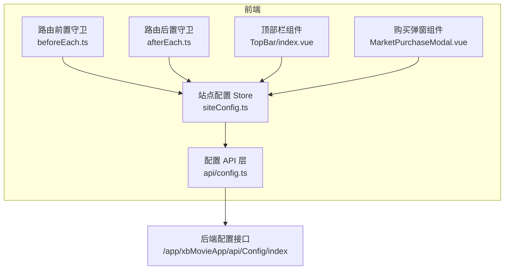
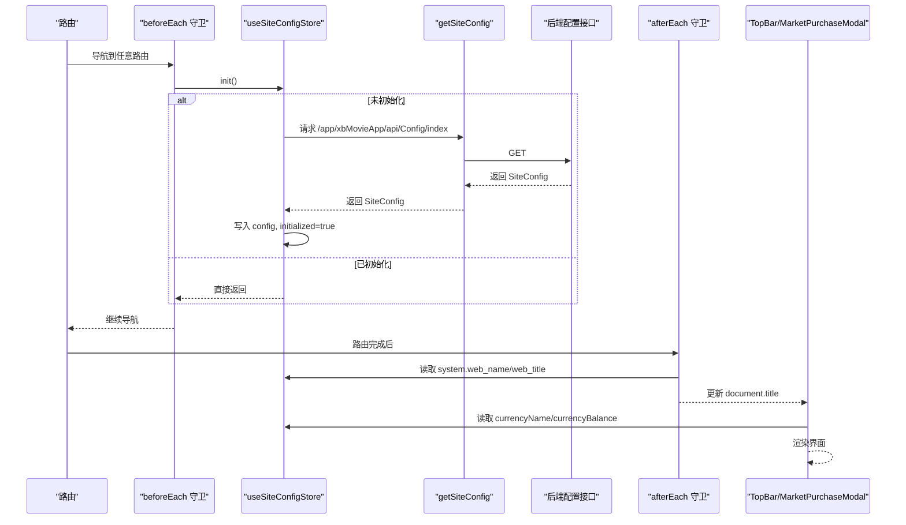
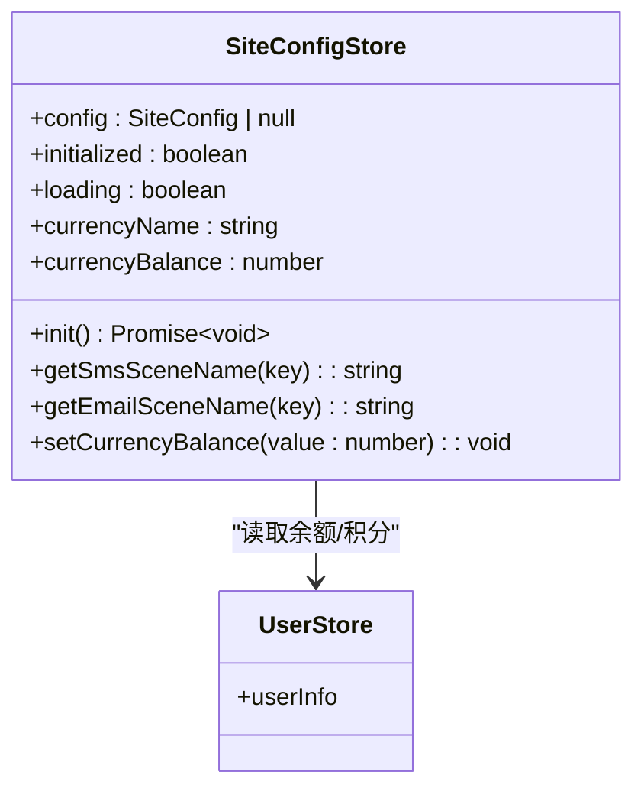
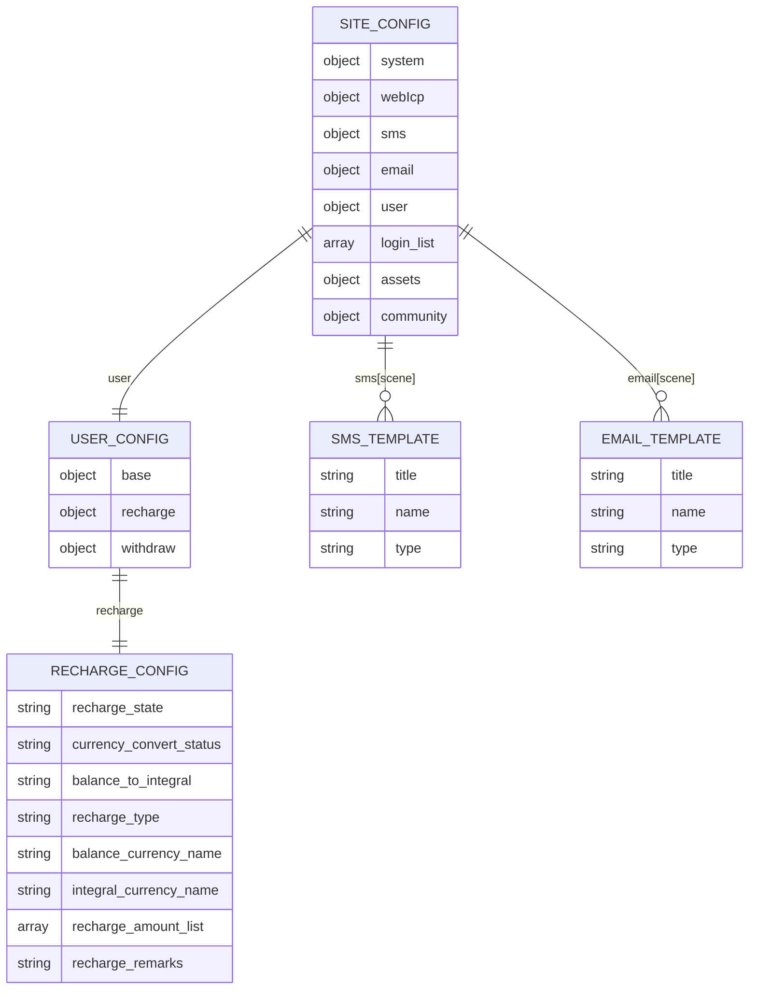
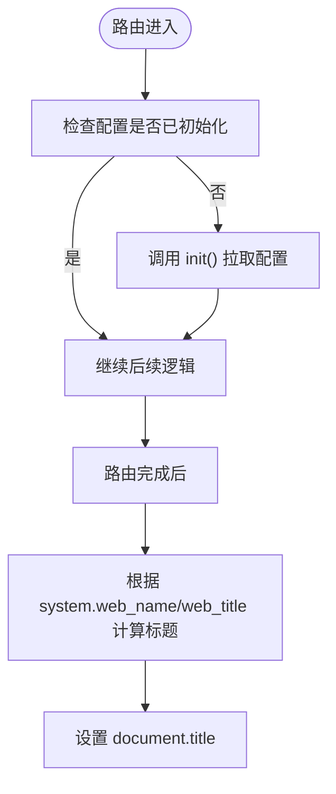
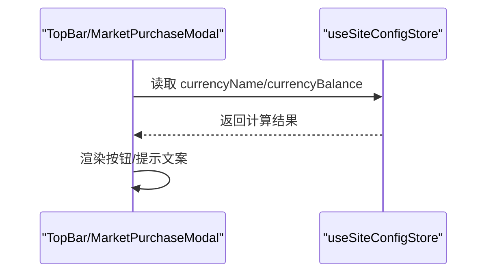
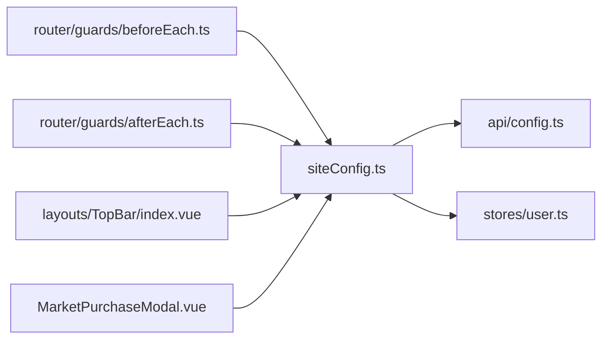

# 站点配置管理

<cite>
**本文引用的文件列表**
- [frontend/src/stores/siteConfig.ts](file://frontend/src/stores/siteConfig.ts)
- [frontend/src/api/config.ts](file://frontend/src/api/config.ts)
- [frontend/src/router/guards/beforeEach.ts](file://frontend/src/router/guards/beforeEach.ts)
- [frontend/src/router/guards/afterEach.ts](file://frontend/src/router/guards/afterEach.ts)
- [frontend/src/layouts/components/TopBar/index.vue](file://frontend/src/layouts/components/TopBar/index.vue)
- [frontend/src/views/MarketplacePage/components/MarketPurchaseModal.vue](file://frontend/src/views/MarketplacePage/components/MarketPurchaseModal.vue)
</cite>

## 目录
1. [简介](#简介)
2. [项目结构](#项目结构)
3. [核心组件](#核心组件)
4. [架构总览](#架构总览)
5. [详细组件分析](#详细组件分析)
6. [依赖关系分析](#依赖关系分析)
7. [性能与缓存策略](#性能与缓存策略)
8. [故障排查指南](#故障排查指南)
9. [结论](#结论)
10. [附录：使用示例与最佳实践](#附录使用示例与最佳实践)

## 简介
本文件面向“积木云AI创作平台”的前端站点配置状态管理，围绕 useSiteConfigStore 的实现机制、数据模型、加载与同步流程、响应式更新原理以及典型业务场景（如货币余额展示、购买校验）进行系统化说明。文档同时给出多租户环境下的配置隔离与权限控制建议方案，帮助读者在现有代码基础上扩展出更完善的站点级能力。

## 项目结构
与站点配置相关的核心位置如下：
- 状态定义与逻辑：frontend/src/stores/siteConfig.ts
- 配置接口与请求封装：frontend/src/api/config.ts
- 路由初始化时触发配置加载：frontend/src/router/guards/beforeEach.ts
- 页面标题动态拼接：frontend/src/router/guards/afterEach.ts
- 顶部栏消费配置（充值开关、货币名称与余额）：frontend/src/layouts/components/TopBar/index.vue
- 资产市场购买弹窗消费配置（价格与余额对比）：frontend/src/views/MarketplacePage/components/MarketPurchaseModal.vue

图表来源
- [frontend/src/router/guards/beforeEach.ts:19-35](file://frontend/src/router/guards/beforeEach.ts#L19-L35)
- [frontend/src/router/guards/afterEach.ts:5-17](file://frontend/src/router/guards/afterEach.ts#L5-L17)
- [frontend/src/stores/siteConfig.ts:7-29](file://frontend/src/stores/siteConfig.ts#L7-L29)
- [frontend/src/api/config.ts:194-199](file://frontend/src/api/config.ts#L194-L199)
- [frontend/src/layouts/components/TopBar/index.vue:15-32](file://frontend/src/layouts/components/TopBar/index.vue#L15-L32)
- [frontend/src/views/MarketplacePage/components/MarketPurchaseModal.vue:20-22](file://frontend/src/views/MarketplacePage/components/MarketPurchaseModal.vue#L20-L22)

章节来源
- [frontend/src/stores/siteConfig.ts:1-100](file://frontend/src/stores/siteConfig.ts#L1-L100)
- [frontend/src/api/config.ts:1-200](file://frontend/src/api/config.ts#L1-L200)
- [frontend/src/router/guards/beforeEach.ts:1-54](file://frontend/src/router/guards/beforeEach.ts#L1-L54)
- [frontend/src/router/guards/afterEach.ts:1-19](file://frontend/src/router/guards/afterEach.ts#L1-L19)
- [frontend/src/layouts/components/TopBar/index.vue:1-122](file://frontend/src/layouts/components/TopBar/index.vue#L1-L122)
- [frontend/src/views/MarketplacePage/components/MarketPurchaseModal.vue:1-105](file://frontend/src/views/MarketplacePage/components/MarketPurchaseModal.vue#L1-L105)

## 核心组件
- useSiteConfigStore：基于 Pinia 的站点配置状态管理，负责从服务端拉取并缓存配置，提供计算属性与方法以简化业务侧对配置的访问。
- api/config.ts：定义 SiteConfig 及其子模块的类型，并提供 getSiteConfig 方法统一发起请求。
- beforeEach 守卫：在路由进入前调用 store.init()，确保应用启动后尽早完成配置加载。
- afterEach 守卫：根据系统配置中的网站名称与标题动态设置 document.title。
- TopBar 与 MarketPurchaseModal：作为消费者，读取配置项用于 UI 展示与交互控制。

章节来源
- [frontend/src/stores/siteConfig.ts:7-98](file://frontend/src/stores/siteConfig.ts#L7-L98)
- [frontend/src/api/config.ts:174-199](file://frontend/src/api/config.ts#L174-L199)
- [frontend/src/router/guards/beforeEach.ts:29-35](file://frontend/src/router/guards/beforeEach.ts#L29-L35)
- [frontend/src/router/guards/afterEach.ts:6-16](file://frontend/src/router/guards/afterEach.ts#L6-L16)
- [frontend/src/layouts/components/TopBar/index.vue:15-32](file://frontend/src/layouts/components/TopBar/index.vue#L15-L32)
- [frontend/src/views/MarketplacePage/components/MarketPurchaseModal.vue:20-22](file://frontend/src/views/MarketplacePage/components/MarketPurchaseModal.vue#L20-L22)

## 架构总览
站点配置的生命周期与数据流如下：
- 路由进入前，beforeEach 调用 siteConfigStore.init()，首次加载成功后将 initialized 置为 true，后续重复调用直接返回。
- init 内部通过 getSiteConfig 请求 /app/xbMovieApp/api/Config/index，得到 SiteConfig 对象并写入 store.config。
- 组件通过 computed 或函数式方法访问配置，例如 TopBar 显示货币名称与余额，MarketPurchaseModal 比较余额与价格。
- 路由后置守卫根据 system.web_name 与 system.web_title 动态设置页面标题。

图表来源
- [frontend/src/router/guards/beforeEach.ts:29-35](file://frontend/src/router/guards/beforeEach.ts#L29-L35)
- [frontend/src/stores/siteConfig.ts:17-29](file://frontend/src/stores/siteConfig.ts#L17-L29)
- [frontend/src/api/config.ts:194-199](file://frontend/src/api/config.ts#L194-L199)
- [frontend/src/router/guards/afterEach.ts:6-16](file://frontend/src/router/guards/afterEach.ts#L6-L16)
- [frontend/src/layouts/components/TopBar/index.vue:15-32](file://frontend/src/layouts/components/TopBar/index.vue#L15-L32)
- [frontend/src/views/MarketplacePage/components/MarketPurchaseModal.vue:20-22](file://frontend/src/views/MarketplacePage/components/MarketPurchaseModal.vue#L20-L22)

## 详细组件分析

### 站点配置 Store（useSiteConfigStore）
- 状态字段
  - config：当前站点配置对象，类型为 SiteConfig | null
  - initialized：是否已完成初始化
  - loading：是否正在加载中
- 关键方法
  - init()：若未初始化则发起请求，成功后标记 initialized=true；异常时记录错误日志，最终停止 loading
  - getSmsSceneName(key)、getEmailSceneName(key)：按模板标识获取短信/邮件场景模板名称，缺失时回退 key 本身
- 计算属性
  - currencyName：根据 user.recharge.recharge_type 决定使用余额货币名称还是积分货币名称
  - currencyBalance：根据 recharge_type 决定读取用户余额或积分（来自 userStore.userInfo）
- 修改方法
  - setCurrencyBalance(value)：根据 recharge_type 写入用户余额或积分

图表来源
- [frontend/src/stores/siteConfig.ts:7-98](file://frontend/src/stores/siteConfig.ts#L7-L98)

章节来源
- [frontend/src/stores/siteConfig.ts:7-98](file://frontend/src/stores/siteConfig.ts#L7-L98)

### 配置数据结构（SiteConfig）
- system：网站基础信息（名称、标题、地址、关键词、描述、Logo、登录背景等）
- webIcp：备案信息（关于我们、版权、ICP、公网安备等）
- sms/email：短信/邮件模板字典，key 为场景名（register/login/find_password/bind/unbind），value 包含 title/name/type
- user：用户相关配置
  - base：注册、登录、验证码等开关
  - recharge：充值开关、币种转换、余额与积分换算、充值金额列表、货币名称等
  - withdraw：提现开关、手续费、限额、时间说明等
- login_list：第三方登录方式列表
- assets：资产市场开关
- community：社区动态开关

图表来源
- [frontend/src/api/config.ts:11-192](file://frontend/src/api/config.ts#L11-L192)

章节来源
- [frontend/src/api/config.ts:11-192](file://frontend/src/api/config.ts#L11-L192)

### 路由集成与页面标题
- beforeEach：在每次路由进入前调用 siteConfigStore.init()，保证配置就绪后再执行后续逻辑（如用户信息初始化）。
- afterEach：根据 system.web_name 与 system.web_title 组合生成 document.title，首页与非首页采用不同拼接规则。

图表来源
- [frontend/src/router/guards/beforeEach.ts:29-35](file://frontend/src/router/guards/beforeEach.ts#L29-L35)
- [frontend/src/router/guards/afterEach.ts:6-16](file://frontend/src/router/guards/afterEach.ts#L6-L16)

章节来源
- [frontend/src/router/guards/beforeEach.ts:19-35](file://frontend/src/router/guards/beforeEach.ts#L19-L35)
- [frontend/src/router/guards/afterEach.ts:5-17](file://frontend/src/router/guards/afterEach.ts#L5-L17)

### 消费方示例：顶部栏与购买弹窗
- TopBar：
  - 根据 user.recharge.recharge_state 判断充值按钮是否禁用
  - 使用 currencyName 与 currencyBalance 展示货币信息与余额
- MarketPurchaseModal：
  - 使用 currencyName 显示价格单位
  - 使用 currencyBalance 与商品价格比较，控制确认按钮可用性与提示文案

图表来源
- [frontend/src/layouts/components/TopBar/index.vue:15-32](file://frontend/src/layouts/components/TopBar/index.vue#L15-L32)
- [frontend/src/views/MarketplacePage/components/MarketPurchaseModal.vue:20-22](file://frontend/src/views/MarketplacePage/components/MarketPurchaseModal.vue#L20-L22)

章节来源
- [frontend/src/layouts/components/TopBar/index.vue:15-32](file://frontend/src/layouts/components/TopBar/index.vue#L15-L32)
- [frontend/src/views/MarketplacePage/components/MarketPurchaseModal.vue:20-22](file://frontend/src/views/MarketplacePage/components/MarketPurchaseModal.vue#L20-L22)

## 依赖关系分析
- useSiteConfigStore 依赖：
  - api/config.ts 的 getSiteConfig 与 SiteConfig 类型
  - stores/user.ts 的 userInfo（用于余额/积分读写）
- 路由守卫依赖 useSiteConfigStore 以完成初始化与标题设置
- 业务组件依赖 useSiteConfigStore 暴露的计算属性与方法

图表来源
- [frontend/src/stores/siteConfig.ts:1-4](file://frontend/src/stores/siteConfig.ts#L1-L4)
- [frontend/src/api/config.ts:194-199](file://frontend/src/api/config.ts#L194-L199)
- [frontend/src/router/guards/beforeEach.ts:1-6](file://frontend/src/router/guards/beforeEach.ts#L1-L6)
- [frontend/src/router/guards/afterEach.ts:1-3](file://frontend/src/router/guards/afterEach.ts#L1-L3)
- [frontend/src/layouts/components/TopBar/index.vue:1-12](file://frontend/src/layouts/components/TopBar/index.vue#L1-L12)
- [frontend/src/views/MarketplacePage/components/MarketPurchaseModal.vue:1-8](file://frontend/src/views/MarketplacePage/components/MarketPurchaseModal.vue#L1-L8)

章节来源
- [frontend/src/stores/siteConfig.ts:1-4](file://frontend/src/stores/siteConfig.ts#L1-L4)
- [frontend/src/api/config.ts:194-199](file://frontend/src/api/config.ts#L194-L199)
- [frontend/src/router/guards/beforeEach.ts:1-6](file://frontend/src/router/guards/beforeEach.ts#L1-L6)
- [frontend/src/router/guards/afterEach.ts:1-3](file://frontend/src/router/guards/afterEach.ts#L1-L3)
- [frontend/src/layouts/components/TopBar/index.vue:1-12](file://frontend/src/layouts/components/TopBar/index.vue#L1-L12)
- [frontend/src/views/MarketplacePage/components/MarketPurchaseModal.vue:1-8](file://frontend/src/views/MarketplacePage/components/MarketPurchaseModal.vue#L1-L8)

## 性能与缓存策略
- 内存缓存：store.config 在进程内持久化，避免重复请求；initialized 标志防止重复初始化。
- 首屏优化：在路由前置守卫中统一加载，减少组件层面的分散请求。
- 降级策略：当请求失败时，仅记录错误日志，不中断应用运行；组件可基于空值做降级展示。
- 可扩展点：
  - 本地存储：可在 init 成功后将 config 序列化至 localStorage/sessionStorage，并在下次启动时优先恢复，再异步刷新后端最新配置。
  - 版本与失效：为配置增加版本号或更新时间戳，结合浏览器缓存策略（如 ETag/Cache-Control）减少无效请求。
  - 增量更新：对于频繁变更的配置项（如短信/邮件模板），可考虑独立接口与短轮询或事件推送。

[本节为通用指导，无需源码引用]

## 故障排查指南
- 常见问题
  - 配置未加载导致 UI 空白或默认值不正确：检查 beforeEach 是否正确 await siteConfigStore.init()，以及 getSiteConfig 是否成功返回。
  - 货币名称/余额显示异常：确认 user.recharge.recharge_type 的值与 userStore.userInfo.balance/integral 是否一致。
  - 页面标题未按预期变化：确认 afterEach 中读取的 system.web_name/web_title 是否存在。
- 定位步骤
  - 打开控制台查看是否有 “[SiteConfig] 获取站点配置失败”的错误日志。
  - 在路由切换前后打印 siteConfig.initialized 与 siteConfig.loading 的状态变化。
  - 在 TopBar 与 MarketPurchaseModal 中打印 currencyName 与 currencyBalance 的实时值。

章节来源
- [frontend/src/stores/siteConfig.ts:24-28](file://frontend/src/stores/siteConfig.ts#L24-L28)
- [frontend/src/router/guards/beforeEach.ts:29-35](file://frontend/src/router/guards/beforeEach.ts#L29-L35)
- [frontend/src/router/guards/afterEach.ts:6-16](file://frontend/src/router/guards/afterEach.ts#L6-L16)
- [frontend/src/layouts/components/TopBar/index.vue:15-32](file://frontend/src/layouts/components/TopBar/index.vue#L15-L32)
- [frontend/src/views/MarketplacePage/components/MarketPurchaseModal.vue:20-22](file://frontend/src/views/MarketplacePage/components/MarketPurchaseModal.vue#L20-L22)

## 结论
useSiteConfigStore 以最小实现提供了站点配置的统一管理与便捷访问，配合路由守卫实现了“先配置、后业务”的稳定顺序。通过计算属性与方法屏蔽了复杂分支逻辑，使 TopBar、购买弹窗等业务组件能够简洁地消费配置。建议在现有基础上引入本地缓存与版本控制，进一步提升首屏体验与容错能力。

[本节为总结性内容，无需源码引用]

## 附录：使用示例与最佳实践

- 动态加载配置
  - 在路由守卫中调用 init()，确保全局配置在业务逻辑之前就绪。
  - 参考路径：[frontend/src/router/guards/beforeEach.ts:29-35](file://frontend/src/router/guards/beforeEach.ts#L29-L35)

- 监听配置变化
  - 使用 Vue 的响应式特性，在组件中直接读取 store 的 computed 属性即可自动更新视图。
  - 参考路径：[frontend/src/layouts/components/TopBar/index.vue:15-32](file://frontend/src/layouts/components/TopBar/index.vue#L15-L32)

- 处理配置默认值
  - 在 store 的方法中提供回退逻辑，如 getSmsSceneName/getEmailSceneName 在未找到模板时返回 key 本身。
  - 参考路径：[frontend/src/stores/siteConfig.ts:36-47](file://frontend/src/stores/siteConfig.ts#L36-L47)

- 多租户环境下的配置隔离与权限控制（建议方案）
  - 隔离维度
    - 租户标识：在请求头携带 tenantId，后端据此返回对应租户的配置。
    - 域名/子域：通过域名解析映射到租户 ID，前端在初始化时解析当前域名并注入请求上下文。
  - 权限控制
    - 功能开关：通过 system、assets、community 等开关控制菜单与功能可见性。
    - 资源访问：结合用户角色与租户白名单，在服务端限制配置项的可见范围。
  - 缓存策略
    - 本地缓存键包含租户 ID，避免跨租户污染。
    - 配置变更时主动失效缓存并重新拉取。
  - 安全与合规
    - 敏感配置（如支付密钥）不应下发到前端，仅由后端按需返回必要字段。
    - 对前端下发的 HTML 片段（如登录广告）进行严格过滤与转义。

[本节为概念性建议，无需源码引用]