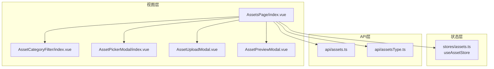
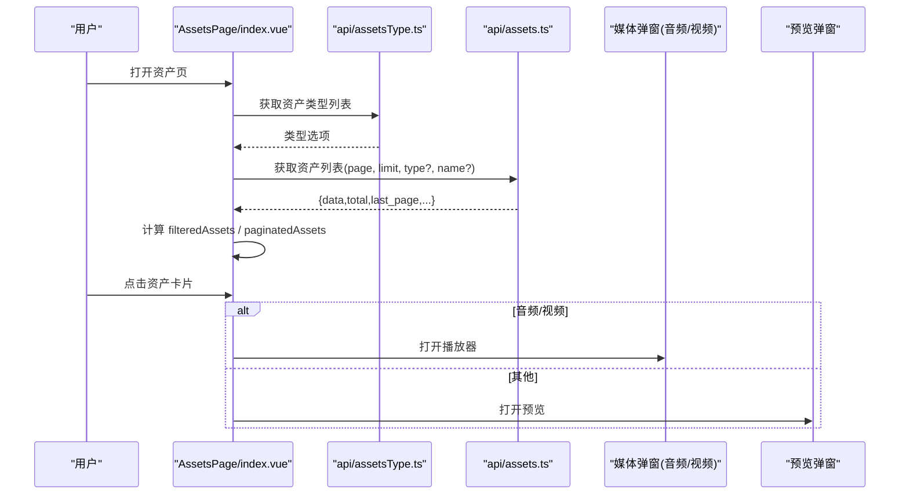
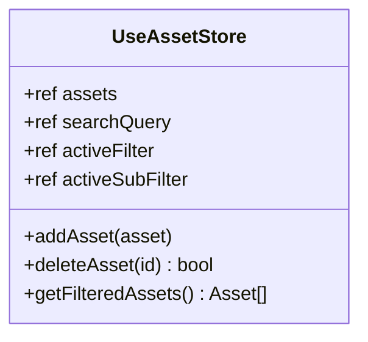
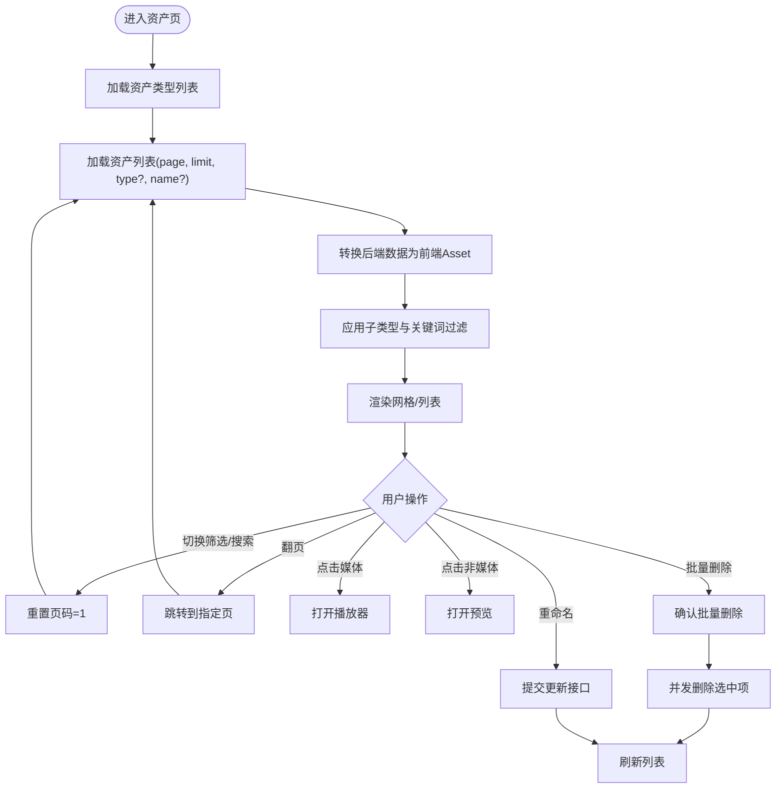
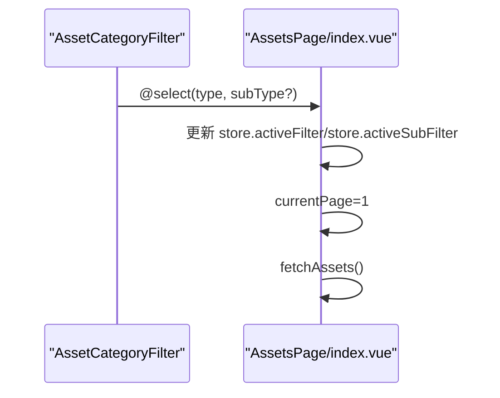
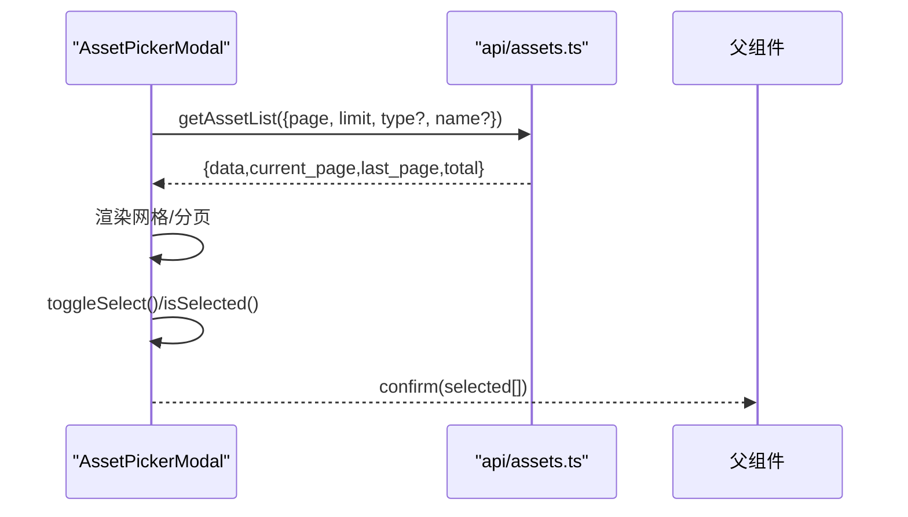
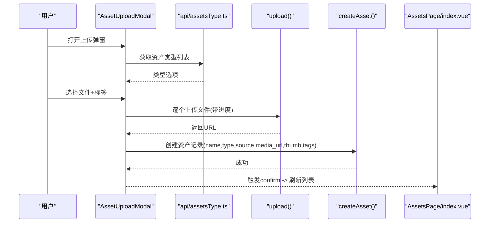
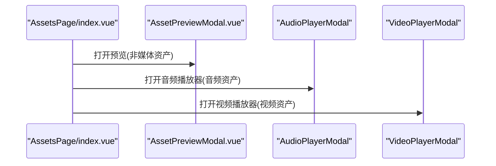
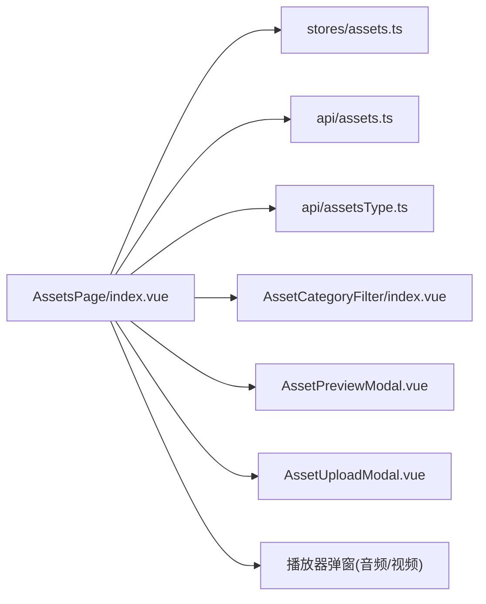

# 资产状态管理

<cite>
**本文引用的文件**
- [frontend/src/stores/assets.ts](file://frontend/src/stores/assets.ts)
- [frontend/src/api/assets.ts](file://frontend/src/api/assets.ts)
- [frontend/src/api/assetsType.ts](file://frontend/src/api/assetsType.ts)
- [frontend/src/views/AssetsPage/index.vue](file://frontend/src/views/AssetsPage/index.vue)
- [frontend/src/components/AssetCategoryFilter/index.vue](file://frontend/src/components/AssetCategoryFilter/index.vue)
- [frontend/src/components/AssetPickerModal/index.vue](file://frontend/src/components/AssetPickerModal/index.vue)
- [frontend/src/views/AssetsPage/components/AssetUploadModal.vue](file://frontend/src/views/AssetsPage/components/AssetUploadModal.vue)
- [frontend/src/views/AssetsPage/components/AssetPreviewModal.vue](file://frontend/src/views/AssetsPage/components/AssetPreviewModal.vue)
</cite>

## 目录
1. [简介](#简介)
2. [项目结构](#项目结构)
3. [核心组件](#核心组件)
4. [架构总览](#架构总览)
5. [详细组件分析](#详细组件分析)
6. [依赖关系分析](#依赖关系分析)
7. [性能与缓存策略](#性能与缓存策略)
8. [故障排查指南](#故障排查指南)
9. [结论](#结论)
10. [附录：数据模型与接口契约](#附录数据模型与接口契约)

## 简介
本文件面向积木云AI创作平台的“资产状态管理”模块，围绕前端 useAssetStore 的实现、素材资源的CRUD、分类标签管理、搜索过滤、分页加载、预览与播放、批量操作、上传流程等展开。文档同时给出前后端数据模型映射、关键调用序列图与流程图，帮助读者快速理解并扩展该能力。

## 项目结构
- 前端状态与类型定义位于 stores/assets.ts，提供本地演示数据与基础CRUD方法（add/delete/filter）。
- 业务页面 AssetsPage/index.vue 负责与后端 API 交互、分页加载、筛选与搜索、预览与播放器联动、批量删除与重命名。
- 通用组件包括分类筛选 AssetCategoryFilter、资产选择器 AssetPickerModal、上传弹窗 AssetUploadModal、预览弹窗 AssetPreviewModal。
- API 层 assets.ts 定义了资产列表、详情、创建、更新、删除的接口契约；assetsType.ts 定义了资产类型枚举及获取接口。

图表来源
- [frontend/src/views/AssetsPage/index.vue:1-473](file://frontend/src/views/AssetsPage/index.vue#L1-L473)
- [frontend/src/stores/assets.ts:1-161](file://frontend/src/stores/assets.ts#L1-L161)
- [frontend/src/api/assets.ts:1-135](file://frontend/src/api/assets.ts#L1-L135)
- [frontend/src/api/assetsType.ts:1-27](file://frontend/src/api/assetsType.ts#L1-L27)
- [frontend/src/components/AssetCategoryFilter/index.vue:1-112](file://frontend/src/components/AssetCategoryFilter/index.vue#L1-L112)
- [frontend/src/components/AssetPickerModal/index.vue:1-227](file://frontend/src/components/AssetPickerModal/index.vue#L1-L227)
- [frontend/src/views/AssetsPage/components/AssetUploadModal.vue:1-273](file://frontend/src/views/AssetsPage/components/AssetUploadModal.vue#L1-L273)
- [frontend/src/views/AssetsPage/components/AssetPreviewModal.vue:1-50](file://frontend/src/views/AssetsPage/components/AssetPreviewModal.vue#L1-L50)

章节来源
- [frontend/src/views/AssetsPage/index.vue:1-473](file://frontend/src/views/AssetsPage/index.vue#L1-L473)
- [frontend/src/stores/assets.ts:1-161](file://frontend/src/stores/assets.ts#L1-L161)
- [frontend/src/api/assets.ts:1-135](file://frontend/src/api/assets.ts#L1-L135)
- [frontend/src/api/assetsType.ts:1-27](file://frontend/src/api/assetsType.ts#L1-L27)

## 核心组件
- useAssetStore（本地状态）
  - 维护 assets 列表、searchQuery、activeFilter、activeSubFilter。
  - 提供 addAsset、deleteAsset、getFilteredAssets 等方法，用于本地演示数据的增删与过滤。
- AssetsPage/index.vue（主页面）
  - 负责从后端拉取资产列表、分页、筛选、搜索、预览、播放、批量删除、重命名、上传后刷新。
  - 将后端类型编码映射为前端类型，并将后端返回项转换为前端 Asset 结构。
- AssetCategoryFilter（分类筛选）
  - 支持主类型与子类型的展开/收起与选中，向父级触发 select 事件。
- AssetPickerModal（资产选择器）
  - 支持多/单选、跨页保存已选、搜索防抖、分页加载。
- AssetUploadModal（上传弹窗）
  - 动态加载资产类型、限制文件类型、拖拽/多选、进度条、上传成功后创建资产记录。
- AssetPreviewModal（预览弹窗）
  - 展示图片类资产的缩略图与元信息。

章节来源
- [frontend/src/stores/assets.ts:1-161](file://frontend/src/stores/assets.ts#L1-L161)
- [frontend/src/views/AssetsPage/index.vue:1-473](file://frontend/src/views/AssetsPage/index.vue#L1-L473)
- [frontend/src/components/AssetCategoryFilter/index.vue:1-112](file://frontend/src/components/AssetCategoryFilter/index.vue#L1-L112)
- [frontend/src/components/AssetPickerModal/index.vue:1-227](file://frontend/src/components/AssetPickerModal/index.vue#L1-L227)
- [frontend/src/views/AssetsPage/components/AssetUploadModal.vue:1-273](file://frontend/src/views/AssetsPage/components/AssetUploadModal.vue#L1-L273)
- [frontend/src/views/AssetsPage/components/AssetPreviewModal.vue:1-50](file://frontend/src/views/AssetsPage/components/AssetPreviewModal.vue#L1-L50)

## 架构总览
- 数据流
  - 页面初始化时请求资产类型列表与当前页资产列表。
  - 用户切换筛选或输入关键词时，重置页码并重新请求后端列表。
  - 本地 computed 对当前页数据进行子类型与标签二次过滤。
  - 上传成功后回调刷新列表，保持状态一致。
- 类型映射
  - 后端使用数字编码表示资产类型，前端维护双向映射表以兼容不同领域语义。
- 媒体播放
  - 音频/视频资产点击后打开对应播放器弹窗，非媒体资产打开预览弹窗。

图表来源
- [frontend/src/views/AssetsPage/index.vue:1-473](file://frontend/src/views/AssetsPage/index.vue#L1-L473)
- [frontend/src/api/assetsType.ts:1-27](file://frontend/src/api/assetsType.ts#L1-L27)
- [frontend/src/api/assets.ts:1-135](file://frontend/src/api/assets.ts#L1-L135)

## 详细组件分析

### 1) 本地状态 store：useAssetStore
- 职责
  - 维护本地演示资产集合与筛选状态。
  - 提供基础的增删与过滤方法，便于在无需后端时进行功能验证。
- 数据结构
  - Asset：包含 id、name、type、subType、thumbnail、mediaUrl、duration、tags、createdAt、listingId 等字段。
  - 主类型与子类型通过联合类型约束，覆盖角色、背景、表情、道具、动作、特效、音色、音效、视频等。
- 关键方法
  - addAsset：插入新资产，生成临时ID与日期。
  - deleteAsset：若资产已上架则禁止删除，否则移除。
  - getFilteredAssets：按主类型、子类型、关键词进行本地过滤。

图表来源
- [frontend/src/stores/assets.ts:1-161](file://frontend/src/stores/assets.ts#L1-L161)

章节来源
- [frontend/src/stores/assets.ts:1-161](file://frontend/src/stores/assets.ts#L1-L161)

### 2) 主页面：AssetsPage/index.vue
- 职责
  - 聚合筛选、搜索、分页、预览、播放、批量操作、重命名、上传等能力。
  - 维护本地 assets 列表与分页状态，并在筛选/搜索变化时重新拉取后端数据。
- 类型映射
  - 维护前后端类型映射表，确保筛选参数正确传递到后端。
- 列表与过滤
  - 后端返回 data 数组，页面将其转换为前端 Asset 结构。
  - 基于 activeSubFilter 与 searchQuery 做前端二次过滤，得到最终展示列表。
- 分页
  - 根据 last_page 控制分页按钮显示，跳转时重置并拉取下一页。
- 批量操作
  - 支持批量删除确认与并发删除，完成后刷新列表。
- 预览与播放
  - 非媒体资产打开预览弹窗；音频/视频资产打开对应播放器弹窗。
- 重命名
  - 打开确认弹窗，提交更新接口后刷新列表。

图表来源
- [frontend/src/views/AssetsPage/index.vue:1-473](file://frontend/src/views/AssetsPage/index.vue#L1-L473)

章节来源
- [frontend/src/views/AssetsPage/index.vue:1-473](file://frontend/src/views/AssetsPage/index.vue#L1-L473)

### 3) 分类筛选：AssetCategoryFilter/index.vue
- 职责
  - 渲染主类型与子类型，支持展开/收起与计数显示。
  - 向父组件 emit select(type, subType?) 事件，驱动筛选状态变更。
- 交互
  - 点击主类型可展开子类型；点击子类型设置 activeSubFilter。

图表来源
- [frontend/src/components/AssetCategoryFilter/index.vue:1-112](file://frontend/src/components/AssetCategoryFilter/index.vue#L1-L112)
- [frontend/src/views/AssetsPage/index.vue:1-473](file://frontend/src/views/AssetsPage/index.vue#L1-L473)

章节来源
- [frontend/src/components/AssetCategoryFilter/index.vue:1-112](file://frontend/src/components/AssetCategoryFilter/index.vue#L1-L112)
- [frontend/src/views/AssetsPage/index.vue:1-473](file://frontend/src/views/AssetsPage/index.vue#L1-L473)

### 4) 资产选择器：AssetPickerModal/index.vue
- 职责
  - 在弹窗内提供资产检索、类型筛选、分页浏览与选择。
  - 支持单选/多选，跨页保存已选对象，最多可选数量限制。
- 特性
  - 搜索防抖，避免频繁请求。
  - 打开时重置状态并拉取第一页数据。

图表来源
- [frontend/src/components/AssetPickerModal/index.vue:1-227](file://frontend/src/components/AssetPickerModal/index.vue#L1-L227)
- [frontend/src/api/assets.ts:1-135](file://frontend/src/api/assets.ts#L1-L135)

章节来源
- [frontend/src/components/AssetPickerModal/index.vue:1-227](file://frontend/src/components/AssetPickerModal/index.vue#L1-L227)
- [frontend/src/api/assets.ts:1-135](file://frontend/src/api/assets.ts#L1-L135)

### 5) 上传流程：AssetUploadModal.vue
- 职责
  - 动态加载资产类型，限制文件类型，支持拖拽与多选。
  - 逐个上传文件，上传成功后创建资产记录，名称自动生成，thumb 默认等于 media_url。
  - 显示上传进度与错误提示。
- 关键点
  - 根据类型 ext/type 动态计算 accept。
  - 上传成功后触发父组件刷新列表。

图表来源
- [frontend/src/views/AssetsPage/components/AssetUploadModal.vue:1-273](file://frontend/src/views/AssetsPage/components/AssetUploadModal.vue#L1-L273)
- [frontend/src/api/assetsType.ts:1-27](file://frontend/src/api/assetsType.ts#L1-L27)
- [frontend/src/api/assets.ts:1-135](file://frontend/src/api/assets.ts#L1-L135)
- [frontend/src/views/AssetsPage/index.vue:1-473](file://frontend/src/views/AssetsPage/index.vue#L1-L473)

章节来源
- [frontend/src/views/AssetsPage/components/AssetUploadModal.vue:1-273](file://frontend/src/views/AssetsPage/components/AssetUploadModal.vue#L1-L273)
- [frontend/src/views/AssetsPage/index.vue:1-473](file://frontend/src/views/AssetsPage/index.vue#L1-L473)

### 6) 预览与播放：AssetPreviewModal.vue 与播放器弹窗
- 预览
  - 展示图片类资产的缩略图与元信息（名称、类型、标签、创建时间）。
- 播放
  - 音频/视频资产点击后打开对应播放器弹窗，传入媒体地址与封面。

图表来源
- [frontend/src/views/AssetsPage/components/AssetPreviewModal.vue:1-50](file://frontend/src/views/AssetsPage/components/AssetPreviewModal.vue#L1-L50)
- [frontend/src/views/AssetsPage/index.vue:1-473](file://frontend/src/views/AssetsPage/index.vue#L1-L473)

章节来源
- [frontend/src/views/AssetsPage/components/AssetPreviewModal.vue:1-50](file://frontend/src/views/AssetsPage/components/AssetPreviewModal.vue#L1-L50)
- [frontend/src/views/AssetsPage/index.vue:1-473](file://frontend/src/views/AssetsPage/index.vue#L1-L473)

## 依赖关系分析
- 页面依赖
  - AssetsPage/index.vue 依赖 api/assets.ts、api/assetsType.ts、store/assets.ts 以及多个 UI 组件。
- 组件耦合
  - AssetCategoryFilter 仅通过事件与父组件通信，低耦合。
  - AssetPickerModal 独立封装了分页与选择逻辑，复用性强。
  - AssetUploadModal 与 upload/createAsset 强相关，但通过事件解耦刷新逻辑。
- 外部依赖
  - 统一请求封装 request（由 utils/request 提供），所有 API 调用均经过拦截器处理。

图表来源
- [frontend/src/views/AssetsPage/index.vue:1-473](file://frontend/src/views/AssetsPage/index.vue#L1-L473)
- [frontend/src/stores/assets.ts:1-161](file://frontend/src/stores/assets.ts#L1-L161)
- [frontend/src/api/assets.ts:1-135](file://frontend/src/api/assets.ts#L1-L135)
- [frontend/src/api/assetsType.ts:1-27](file://frontend/src/api/assetsType.ts#L1-L27)
- [frontend/src/components/AssetCategoryFilter/index.vue:1-112](file://frontend/src/components/AssetCategoryFilter/index.vue#L1-L112)
- [frontend/src/views/AssetsPage/components/AssetPreviewModal.vue:1-50](file://frontend/src/views/AssetsPage/components/AssetPreviewModal.vue#L1-L50)
- [frontend/src/views/AssetsPage/components/AssetUploadModal.vue:1-273](file://frontend/src/views/AssetsPage/components/AssetUploadModal.vue#L1-L273)

章节来源
- [frontend/src/views/AssetsPage/index.vue:1-473](file://frontend/src/views/AssetsPage/index.vue#L1-L473)
- [frontend/src/stores/assets.ts:1-161](file://frontend/src/stores/assets.ts#L1-L161)
- [frontend/src/api/assets.ts:1-135](file://frontend/src/api/assets.ts#L1-L135)
- [frontend/src/api/assetsType.ts:1-27](file://frontend/src/api/assetsType.ts#L1-L27)

## 性能与缓存策略
- 分页加载
  - 列表采用 page/limit 分页，仅在筛选或搜索变化时重置页码并重新请求。
- 前端二次过滤
  - 在已加载的一页数据上，基于子类型与关键词进行本地过滤，减少不必要的网络请求。
- 搜索防抖
  - 资产选择器内部实现搜索防抖，降低高频输入带来的请求压力。
- 资源加载优化
  - 图片加载失败时回退占位图，避免布局抖动。
- 建议
  - 可在上层引入轻量缓存（如按查询条件缓存最近一页结果），在筛选切换且未离开页面时直接命中缓存。
  - 对于大图/长视频，建议使用懒加载与缩略图优先策略。

[本节为通用性能建议，不直接分析具体文件]

## 故障排查指南
- 列表为空或报错
  - 检查网络请求是否成功，查看错误消息与重试按钮。
- 筛选无效
  - 确认前后端类型映射是否正确，筛选变更后是否重置了页码。
- 上传失败
  - 检查文件类型是否符合所选类型要求，确认上传进度与错误提示。
- 批量删除异常
  - 确认并发删除是否全部完成，必要时逐一重试。
- 预览/播放无内容
  - 检查媒体地址是否有效，图片加载失败是否触发了占位图。

章节来源
- [frontend/src/views/AssetsPage/index.vue:1-473](file://frontend/src/views/AssetsPage/index.vue#L1-L473)
- [frontend/src/views/AssetsPage/components/AssetUploadModal.vue:1-273](file://frontend/src/views/AssetsPage/components/AssetUploadModal.vue#L1-L273)

## 结论
本模块通过清晰的职责划分与良好的事件/接口契约，实现了资产页面的完整能力闭环：类型筛选、搜索、分页、预览/播放、批量操作、上传与重命名。useAssetStore 提供了本地演示能力，而主页面则承担与后端的数据同步与状态协调。建议在后续迭代中补充权限控制、版本管理与回收站等能力，并进一步完善缓存与懒加载策略以提升整体体验。

[本节为总结性内容，不直接分析具体文件]

## 附录：数据模型与接口契约

### 前端 Asset 模型（本地演示）
- 字段说明
  - id：唯一标识
  - name：名称
  - type：主类型
  - subType：子类型（音色/音效/视频必填）
  - thumbnail：缩略图路径
  - mediaUrl：媒体地址（音频/视频）
  - duration：时长（秒）
  - tags：标签数组
  - createdAt：创建日期
  - listingId：市场上架ID（可选）

章节来源
- [frontend/src/stores/assets.ts:1-161](file://frontend/src/stores/assets.ts#L1-L161)

### 后端 AssetItem 模型（API）
- 字段说明
  - id：资产ID
  - name：名称
  - type：类型编码（10/20/30/40/50/60）
  - source：来源编码（10-AI生成，20-自主上传，30-市场购买）
  - thumb：封面
  - media_url：媒体地址
  - duration：时长（秒）
  - tags：逗号分隔字符串
  - user_id：用户ID
  - create_at：创建时间

章节来源
- [frontend/src/api/assets.ts:1-135](file://frontend/src/api/assets.ts#L1-L135)

### 资产类型枚举（API）
- 类型项
  - label：显示名
  - value：类型值（与后端类型编码一致）
  - type：媒体大类（image/audio/video）
  - color/desc/icon：展示辅助信息
  - ext：允许的文件扩展名（顶级类型）

章节来源
- [frontend/src/api/assetsType.ts:1-27](file://frontend/src/api/assetsType.ts#L1-L27)

### 关键接口清单
- 获取资产类型列表：GET /app/xbAiAsset/api/AssetType/list
- 获取资产列表：GET /app/xbAiAsset/api/Asset/list
- 获取资产详情：GET /app/xbAiAsset/api/Asset/detail
- 创建资产：POST /app/xbAiAsset/api/Asset/create
- 更新资产：PUT /app/xbAiAsset/api/Asset/update
- 删除资产：DELETE /app/xbAiAsset/api/Asset/delete

章节来源
- [frontend/src/api/assets.ts:1-135](file://frontend/src/api/assets.ts#L1-L135)
- [frontend/src/api/assetsType.ts:1-27](file://frontend/src/api/assetsType.ts#L1-L27)