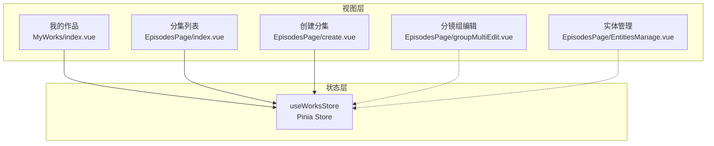
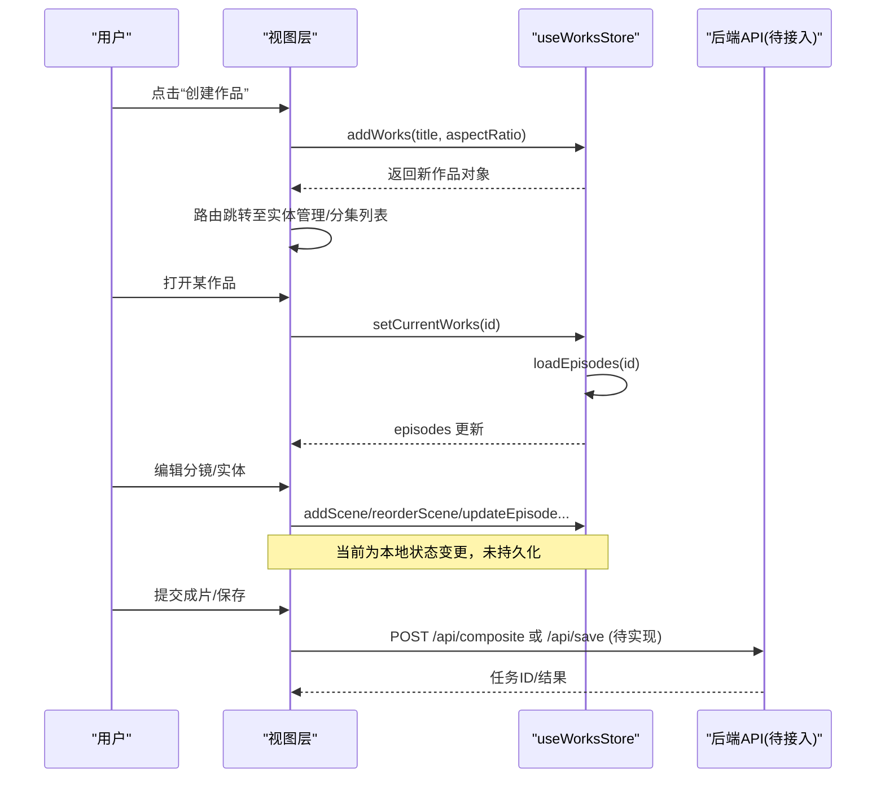
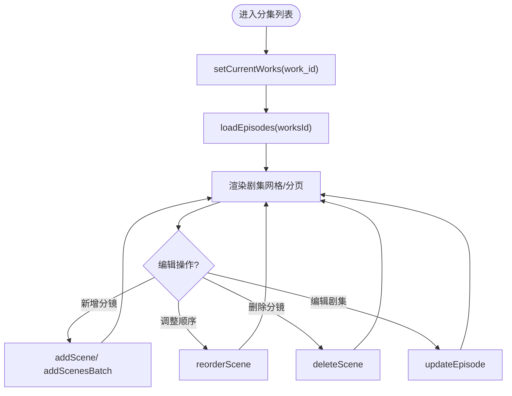
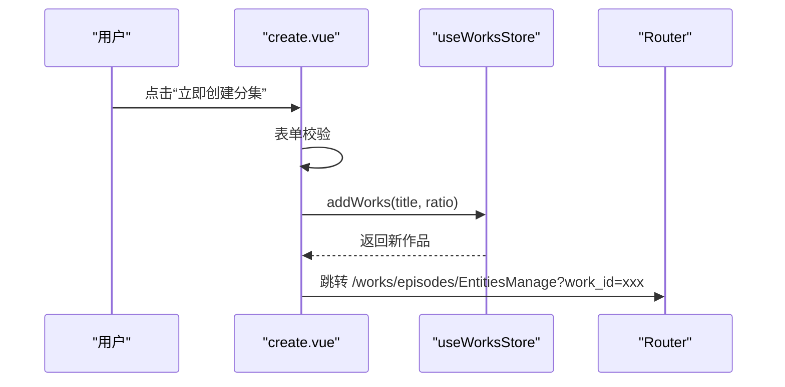
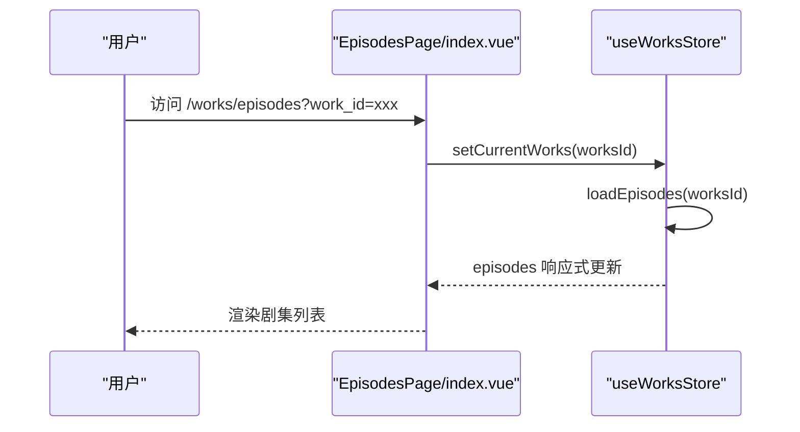
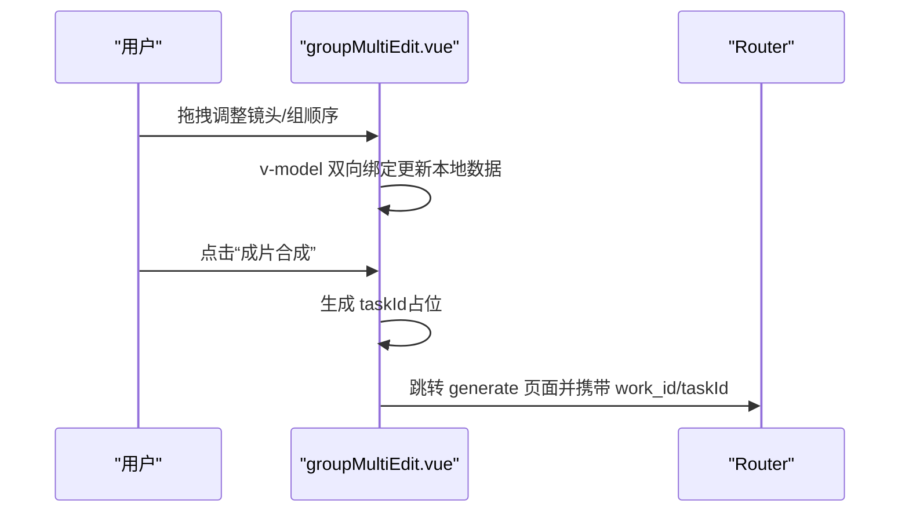
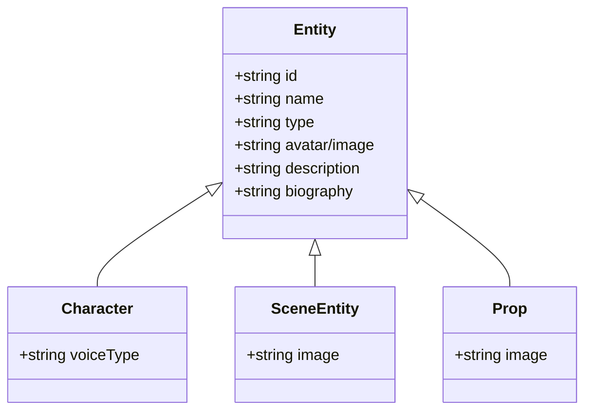
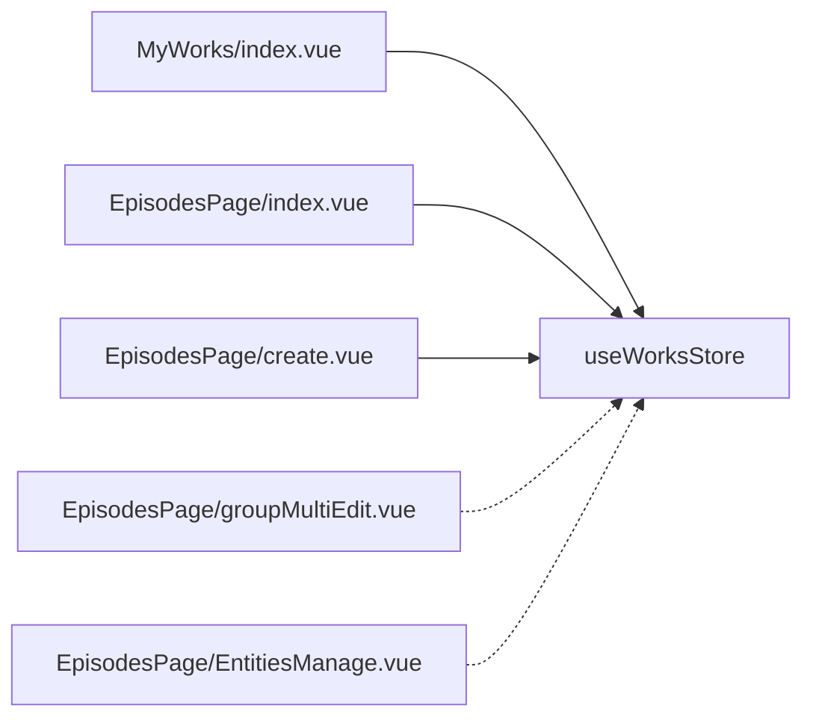

# 项目状态管理

<cite>
**本文引用的文件**   
- [projects.ts](file://frontend/src/stores/projects.ts)
- [index.vue（我的作品）](file://frontend/src/views/MyWorks/index.vue)
- [index.vue（分集列表）](file://frontend/src/views/EpisodesPage/index.vue)
- [create.vue（创建分集）](file://frontend/src/views/EpisodesPage/create.vue)
- [groupMultiEdit.vue（分镜组编辑）](file://frontend/src/views/EpisodesPage/groupMultiEdit.vue)
- [EntitiesManage.vue（实体管理）](file://frontend/src/views/EpisodesPage/EntitiesManage.vue)
</cite>

## 目录
1. [简介](#简介)
2. [项目结构](#项目结构)
3. [核心组件](#核心组件)
4. [架构总览](#架构总览)
5. [详细组件分析](#详细组件分析)
6. [依赖关系分析](#依赖关系分析)
7. [性能考量](#性能考量)
8. [故障排查指南](#故障排查指南)
9. [结论](#结论)
10. [附录](#附录)

## 简介
本文件面向积木云AI创作平台的前端“项目状态管理”模块，围绕 useProjectsStore（实际导出名为 useWorksStore）的实现设计进行系统化说明。文档覆盖：
- 项目管理、分镜编辑、实体管理等核心功能的状态维护
- 项目数据结构定义与组织方式（作品、剧集、分镜场景、角色/场景/道具等实体）
- 协作创作中的实时同步机制、冲突解决策略与数据一致性保证（现状评估与建议）
- 项目模板系统、草稿自动保存与版本历史功能的实现原理（现状评估与建议）
- 关键业务流程的状态流转示例（创建、编辑、保存、分享）

## 项目结构
前端采用 Vue 3 + Pinia 的响应式状态管理模式。与“项目状态管理”直接相关的代码主要分布在：
- 状态存储：stores/projects.ts
- 页面视图：views/MyWorks/index.vue、views/EpisodesPage/index.vue、views/EpisodesPage/create.vue、views/EpisodesPage/groupMultiEdit.vue、views/EpisodesPage/EntitiesManage.vue

图表来源
- [projects.ts:72-279](file://frontend/src/stores/projects.ts#L72-L279)
- [index.vue（我的作品）:1-184](file://frontend/src/views/MyWorks/index.vue#L1-L184)
- [index.vue（分集列表）:1-115](file://frontend/src/views/EpisodesPage/index.vue#L1-L115)
- [create.vue（创建分集）:1-215](file://frontend/src/views/EpisodesPage/create.vue#L1-L215)
- [groupMultiEdit.vue（分镜组编辑）:1-705](file://frontend/src/views/EpisodesPage/groupMultiEdit.vue#L1-L705)
- [EntitiesManage.vue（实体管理）:1-443](file://frontend/src/views/EpisodesPage/EntitiesManage.vue#L1-L443)

章节来源
- [projects.ts:72-279](file://frontend/src/stores/projects.ts#L72-L279)
- [index.vue（我的作品）:1-184](file://frontend/src/views/MyWorks/index.vue#L1-L184)
- [index.vue（分集列表）:1-115](file://frontend/src/views/EpisodesPage/index.vue#L1-L115)
- [create.vue（创建分集）:1-215](file://frontend/src/views/EpisodesPage/create.vue#L1-L215)
- [groupMultiEdit.vue（分镜组编辑）:1-705](file://frontend/src/views/EpisodesPage/groupMultiEdit.vue#L1-L705)
- [EntitiesManage.vue（实体管理）:1-443](file://frontend/src/views/EpisodesPage/EntitiesManage.vue#L1-L443)

## 核心组件
- useWorksStore（Pinia store）
  - 职责：集中管理“作品列表、当前作品、剧集列表”，并提供增删改查与分镜操作能力
  - 暴露状态：works、currentWorks、episodes
  - 暴露方法：addWorks、deleteWorks、updateWorks、setCurrentWorks、loadEpisodes、addEpisode、updateEpisode、addScene、addScenesBatch、reorderScene、deleteScene
- 视图层
  - 我的作品：负责作品创建、删除、编辑、分页与跳转
  - 分集列表：加载并展示剧集，支持分页、编辑、删除
  - 创建分集：校验表单、调用 store 创建作品后跳转到实体管理页
  - 分镜组编辑：本地维护镜头组与镜头数据，提供拖拽排序、批量生成、成片合成入口
  - 实体管理：以 Tab 形式管理角色、场景、道具三类实体（当前为本地 Mock 数据）

章节来源
- [projects.ts:72-279](file://frontend/src/stores/projects.ts#L72-L279)
- [index.vue（我的作品）:1-184](file://frontend/src/views/MyWorks/index.vue#L1-L184)
- [index.vue（分集列表）:1-115](file://frontend/src/views/EpisodesPage/index.vue#L1-L115)
- [create.vue（创建分集）:1-215](file://frontend/src/views/EpisodesPage/create.vue#L1-L215)
- [groupMultiEdit.vue（分镜组编辑）:1-705](file://frontend/src/views/EpisodesPage/groupMultiEdit.vue#L1-L705)
- [EntitiesManage.vue（实体管理）:1-443](file://frontend/src/views/EpisodesPage/EntitiesManage.vue#L1-L443)

## 架构总览
整体采用“视图层 -> Pinia Store -> 后端 API（待接入）”的分层模式。当前阶段大部分数据为本地 Mock，尚未与后端持久化或实时通道集成。

图表来源
- [create.vue（创建分集）:90-115](file://frontend/src/views/EpisodesPage/create.vue#L90-L115)
- [index.vue（分集列表）:20-22](file://frontend/src/views/EpisodesPage/index.vue#L20-L22)
- [projects.ts:137-185](file://frontend/src/stores/projects.ts#L137-L185)
- [groupMultiEdit.vue（分镜组编辑）:359-384](file://frontend/src/views/EpisodesPage/groupMultiEdit.vue#L359-L384)

## 详细组件分析

### 数据结构与复杂度
- Works（作品）
  - 字段：id、title、cover、updatedAt、episodes、status、aspectRatio
  - 用途：作品级元信息，用于列表展示与筛选
- Episode（剧集）
  - 字段：id、worksId、title、cover、order、scenes
  - 用途：按剧集维度组织分镜
- Scene（分镜场景）
  - 字段：id、title、background、characters、expressions、actions、props、effects、action、cameraLang、narration、dialogue、duration、videoUrl
  - 用途：描述单个分镜的画面、台词、时长与产出视频地址
- 实体（角色/场景/道具）
  - 在 EntitiesManage.vue 中以本地 ref 数组维护，包含 id、name、image/avatar、description/biography 等字段

时间复杂度概览
- 列表查找/更新：O(n)
- 插入/删除：O(1)~O(n)（取决于位置）
- 拖拽重排：splice O(n)

空间复杂度
- 与作品数量、剧集数量、分镜数量线性相关

章节来源
- [projects.ts:6-70](file://frontend/src/stores/projects.ts#L6-L70)
- [projects.ts:72-279](file://frontend/src/stores/projects.ts#L72-L279)
- [EntitiesManage.vue（实体管理）:29-121](file://frontend/src/views/EpisodesPage/EntitiesManage.vue#L29-L121)

### 状态管理与业务方法
- 作品管理
  - addWorks：新建作品，默认封面与更新时间，初始状态为草稿
  - deleteWorks：按 id 过滤移除
  - updateWorks：局部合并更新
  - setCurrentWorks：设置当前作品并触发 loadEpisodes
- 剧集管理
  - loadEpisodes：根据 worksId 生成 Mock 剧集列表
  - addEpisode：追加新剧集
  - updateEpisode：局部合并更新
- 分镜管理
  - addScene/addScenesBatch：向指定剧集追加单条或多条分镜
  - reorderScene：调整分镜顺序
  - deleteScene：删除指定分镜

图表来源
- [index.vue（分集列表）:20-22](file://frontend/src/views/EpisodesPage/index.vue#L20-L22)
- [projects.ts:165-261](file://frontend/src/stores/projects.ts#L165-L261)

章节来源
- [projects.ts:137-261](file://frontend/src/stores/projects.ts#L137-L261)
- [index.vue（分集列表）:20-73](file://frontend/src/views/EpisodesPage/index.vue#L20-L73)

### 视图与状态交互流程

#### 创建作品流程
- 用户在“创建分集”页填写标题、语言、剧本内容、选择风格与尺寸
- 校验通过后调用 store.addWorks，随后跳转到实体管理页

图表来源
- [create.vue（创建分集）:90-115](file://frontend/src/views/EpisodesPage/create.vue#L90-L115)
- [projects.ts:137-150](file://frontend/src/stores/projects.ts#L137-L150)

章节来源
- [create.vue（创建分集）:90-115](file://frontend/src/views/EpisodesPage/create.vue#L90-L115)
- [projects.ts:137-150](file://frontend/src/stores/projects.ts#L137-L150)

#### 打开作品与加载剧集
- 进入分集列表时，通过 route.query.work_id 调用 setCurrentWorks，内部再调用 loadEpisodes 填充 episodes

图表来源
- [index.vue（分集列表）:20-22](file://frontend/src/views/EpisodesPage/index.vue#L20-L22)
- [projects.ts:165-185](file://frontend/src/stores/projects.ts#L165-L185)

章节来源
- [index.vue（分集列表）:20-22](file://frontend/src/views/EpisodesPage/index.vue#L20-L22)
- [projects.ts:165-185](file://frontend/src/stores/projects.ts#L165-L185)

#### 分镜组编辑与成片合成
- groupMultiEdit.vue 使用本地 shotGroups 维护镜头组与镜头，支持拖拽排序、添加/删除镜头、@提及角色
- “成片合成”按钮预留了后端接口占位，当前仅生成 taskId 并跳转至生成页

图表来源
- [groupMultiEdit.vue（分镜组编辑）:359-384](file://frontend/src/views/EpisodesPage/groupMultiEdit.vue#L359-L384)

章节来源
- [groupMultiEdit.vue（分镜组编辑）:1-705](file://frontend/src/views/EpisodesPage/groupMultiEdit.vue#L1-L705)

#### 实体管理（角色/场景/道具）
- EntitiesManage.vue 以 Tabs 切换三类实体，当前为本地 Mock 数据，提供“生成图片/试听/替换/删除”等交互入口（部分为 TODO）
- 底部工具栏支持批量生成与“重新生成分镜列表”跳转

图表来源
- [EntitiesManage.vue（实体管理）:29-121](file://frontend/src/views/EpisodesPage/EntitiesManage.vue#L29-L121)

章节来源
- [EntitiesManage.vue（实体管理）:1-443](file://frontend/src/views/EpisodesPage/EntitiesManage.vue#L1-L443)

### 协作创作与实时同步
- 现状：当前所有状态均为前端本地响应式数据，未实现跨用户实时同步、冲突检测与合并
- 建议方案（概念性）：
  - 引入 WebSocket/Channel 推送，基于 CRDT 或 OT 算法实现多端一致
  - 对关键对象（如 Scene、ShotGroup）维护版本号或时间戳，服务端做冲突检测与合并策略
  - 离线编辑缓存，网络恢复后增量同步

[本节为概念性说明，不直接分析具体文件]

### 项目模板系统
- 现状：create.vue 中提供“风格选择器”选项，但并未与后端模板服务打通；样式选择仅影响前端展示与后续生成参数
- 建议方案（概念性）：
  - 建立模板模型（风格、预设提示词、分辨率、比例、转场规则等）
  - 创建作品时从模板初始化分镜结构与默认参数

[本节为概念性说明，不直接分析具体文件]

### 草稿自动保存与版本历史
- 现状：未实现自动保存与版本历史；仅在本地内存中维护状态
- 建议方案（概念性）：
  - 自动保存：基于防抖/节流将当前状态写入 localStorage 或后端草稿接口
  - 版本历史：每次显式保存时生成快照，记录差异与回滚点

[本节为概念性说明，不直接分析具体文件]

## 依赖关系分析
- 视图到 Store 的依赖
  - MyWorks/index.vue 依赖 useWorksStore 进行作品的增删改与导航
  - EpisodesPage/index.vue 依赖 useWorksStore 加载与更新剧集
  - EpisodesPage/create.vue 依赖 useWorksStore 创建作品
  - EpisodesPage/groupMultiEdit.vue 与 EntitiesManage.vue 当前主要为本地状态，未直接依赖 store（可考虑扩展）

图表来源
- [index.vue（我的作品）:1-184](file://frontend/src/views/MyWorks/index.vue#L1-L184)
- [index.vue（分集列表）:1-115](file://frontend/src/views/EpisodesPage/index.vue#L1-L115)
- [create.vue（创建分集）:1-215](file://frontend/src/views/EpisodesPage/create.vue#L1-L215)
- [groupMultiEdit.vue（分镜组编辑）:1-705](file://frontend/src/views/EpisodesPage/groupMultiEdit.vue#L1-L705)
- [EntitiesManage.vue（实体管理）:1-443](file://frontend/src/views/EpisodesPage/EntitiesManage.vue#L1-L443)
- [projects.ts:72-279](file://frontend/src/stores/projects.ts#L72-L279)

章节来源
- [index.vue（我的作品）:1-184](file://frontend/src/views/MyWorks/index.vue#L1-L184)
- [index.vue（分集列表）:1-115](file://frontend/src/views/EpisodesPage/index.vue#L1-L115)
- [create.vue（创建分集）:1-215](file://frontend/src/views/EpisodesPage/create.vue#L1-L215)
- [groupMultiEdit.vue（分镜组编辑）:1-705](file://frontend/src/views/EpisodesPage/groupMultiEdit.vue#L1-L705)
- [EntitiesManage.vue（实体管理）:1-443](file://frontend/src/views/EpisodesPage/EntitiesManage.vue#L1-L443)
- [projects.ts:72-279](file://frontend/src/stores/projects.ts#L72-L279)

## 性能考量
- 列表渲染与分页
  - 使用 computed 切片分页，避免全量渲染带来的开销
- 拖拽重排
  - 使用 vuedraggable 的 v-model 双向绑定，注意大数据量下的 DOM 操作成本
- 响应式粒度
  - 当前 store 将大量数据集中在单一实例，建议在后续拆分更细粒度的子 store（如 scenesStore、entitiesStore），减少不必要的重渲染

[本节为通用指导，不直接分析具体文件]

## 故障排查指南
- 常见问题
  - 打开分集列表无数据：检查 route.query.work_id 是否正确传入，以及 setCurrentWorks 是否被调用
  - 新增分镜无效：确认目标 episodeIndex 是否存在，且 addScene/addScenesBatch 被正确调用
  - 拖拽后顺序异常：确保 draggable 的 item-key 唯一且 v-model 绑定到正确的数组
- 定位步骤
  - 在对应视图中打印 store 状态变化
  - 检查方法入参边界条件（索引越界、空值）
  - 对于“成片合成”等异步流程，关注 isSubmitting 状态与错误分支

章节来源
- [index.vue（分集列表）:20-73](file://frontend/src/views/EpisodesPage/index.vue#L20-L73)
- [projects.ts:200-253](file://frontend/src/stores/projects.ts#L200-L253)
- [groupMultiEdit.vue（分镜组编辑）:359-384](file://frontend/src/views/EpisodesPage/groupMultiEdit.vue#L359-L384)

## 结论
当前项目状态管理以 Pinia 为核心，提供了作品、剧集与分镜的基础 CRUD 能力，并在多个页面中形成稳定的状态驱动视图。协作同步、模板系统、草稿自动保存与版本历史等功能尚处于概念规划阶段，后续可通过引入实时通道、CRDT/OT 与持久化策略逐步完善，以提升团队协作体验与数据可靠性。

## 附录
- 关键方法路径参考
  - 创建作品：[create.vue:90-115](file://frontend/src/views/EpisodesPage/create.vue#L90-L115)
  - 加载剧集：[index.vue（分集列表）:20-22](file://frontend/src/views/EpisodesPage/index.vue#L20-L22)
  - 分镜增删改：[projects.ts:200-253](file://frontend/src/stores/projects.ts#L200-L253)
  - 成片合成入口：[groupMultiEdit.vue:359-384](file://frontend/src/views/EpisodesPage/groupMultiEdit.vue#L359-L384)
  - 实体管理界面：[EntitiesManage.vue:1-443](file://frontend/src/views/EpisodesPage/EntitiesManage.vue#L1-L443)