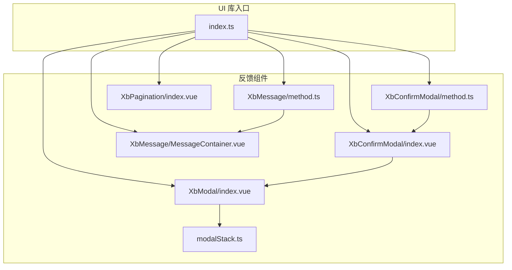
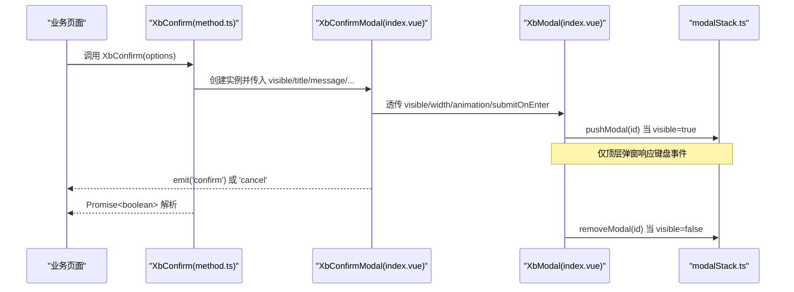
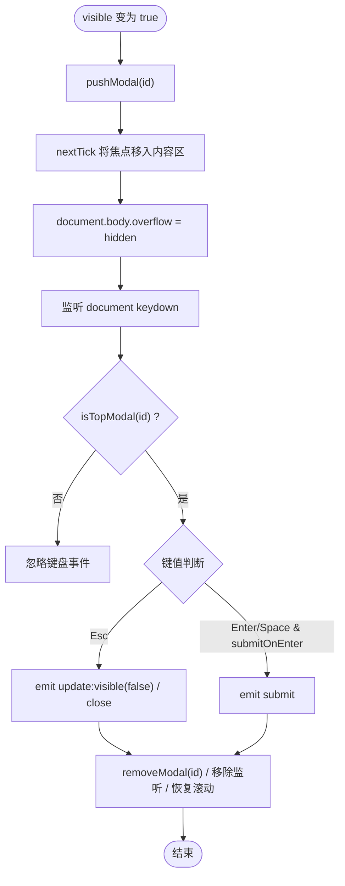
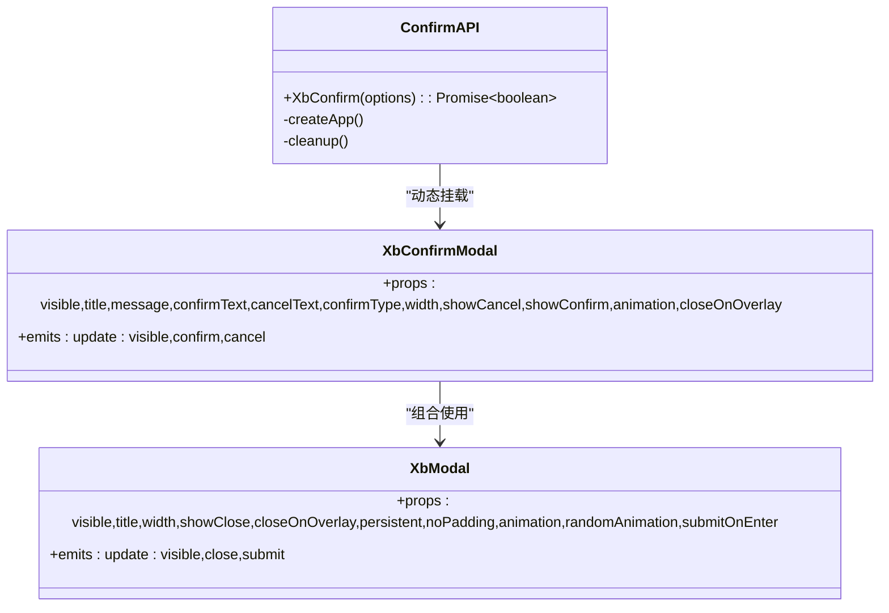
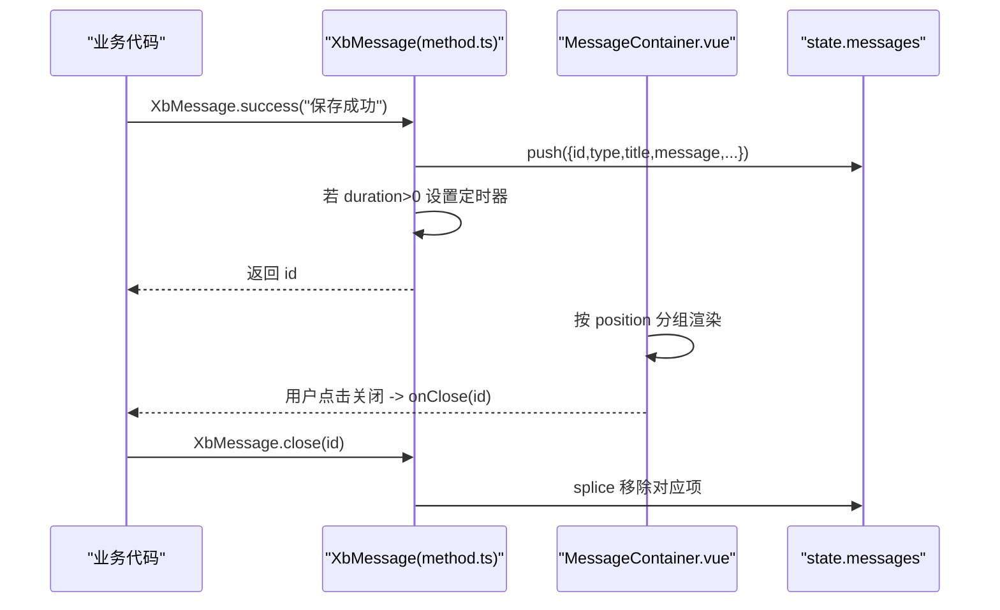
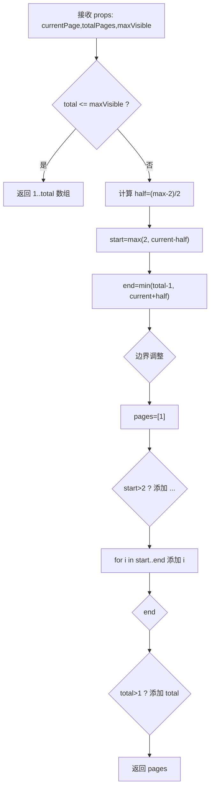
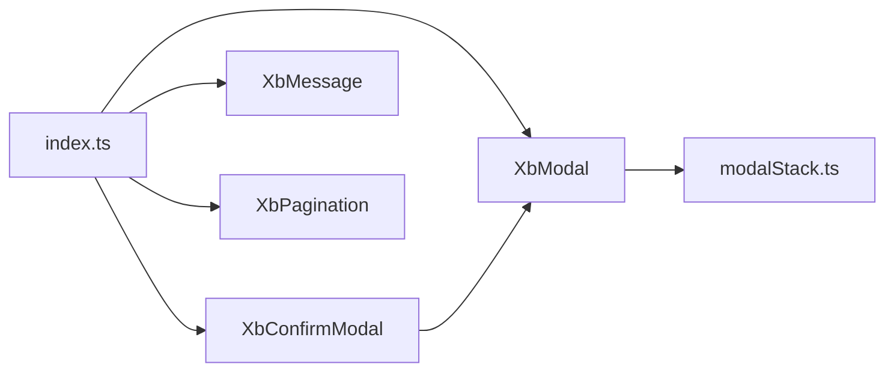

# 反馈组件

<cite>
**本文引用的文件**   
- [XbModal/index.vue](file://frontend/src/xbUi/XbModal/index.vue)
- [modalStack.ts](file://frontend/src/xbUi/modalStack.ts)
- [XbConfirmModal/index.vue](file://frontend/src/xbUi/XbConfirmModal/index.vue)
- [XbConfirmModal/method.ts](file://frontend/src/xbUi/XbConfirmModal/method.ts)
- [XbMessage/MessageContainer.vue](file://frontend/src/xbUi/XbMessage/MessageContainer.vue)
- [XbMessage/method.ts](file://frontend/src/xbUi/XbMessage/method.ts)
- [XbPagination/index.vue](file://frontend/src/xbUi/XbPagination/index.vue)
- [index.ts](file://frontend/src/xbUi/index.ts)
</cite>

## 目录
1. [简介](#简介)
2. [项目结构](#项目结构)
3. [核心组件](#核心组件)
4. [架构总览](#架构总览)
5. [详细组件分析](#详细组件分析)
6. [依赖关系分析](#依赖关系分析)
7. [性能与可访问性](#性能与可访问性)
8. [复杂交互场景示例](#复杂交互场景示例)
9. [故障排查指南](#故障排查指南)
10. [结论](#结论)

## 简介
本文件面向积木云AI创作平台的用户反馈子系统，系统性梳理并说明以下组件的实现原理与最佳实践：
- 弹窗 XbModal：通用模态框容器、动画、键盘与焦点管理、模态栈
- 确认弹窗 XbConfirmModal：命令式 API、异步确认与 loading 状态
- 消息提示 XbMessage：全局消息队列、多位置布局、动画与自动关闭
- 分页器 XbPagination：可见页码计算、省略号策略与事件回传

文档同时覆盖多层弹窗的栈管理、消息队列处理、异步操作反馈、大数据量分页的状态设计，以及动画过渡、键盘操作、焦点管理与无障碍访问支持。

## 项目结构
反馈相关代码位于前端 UI 库模块中，采用“功能目录 + 命令式方法”的组织方式：
- 组件层：每个组件一个目录，包含视图与可选的类型定义
- 命令式 API：通过 createApp 动态挂载到 body，提供函数式调用体验
- 共享能力：如模态栈、图标等被多个组件复用

图表来源
- [index.ts:1-100](file://frontend/src/xbUi/index.ts#L1-L100)
- [XbModal/index.vue:1-620](file://frontend/src/xbUi/XbModal/index.vue#L1-L620)
- [modalStack.ts:1-29](file://frontend/src/xbUi/modalStack.ts#L1-L29)
- [XbConfirmModal/index.vue:1-101](file://frontend/src/xbUi/XbConfirmModal/index.vue#L1-L101)
- [XbConfirmModal/method.ts:1-150](file://frontend/src/xbUi/XbConfirmModal/method.ts#L1-L150)
- [XbMessage/MessageContainer.vue:1-618](file://frontend/src/xbUi/XbMessage/MessageContainer.vue#L1-L618)
- [XbMessage/method.ts:1-116](file://frontend/src/xbUi/XbMessage/method.ts#L1-L116)
- [XbPagination/index.vue:1-103](file://frontend/src/xbUi/XbPagination/index.vue#L1-L103)

章节来源
- [index.ts:1-100](file://frontend/src/xbUi/index.ts#L1-L100)

## 核心组件
- XbModal：提供遮罩、内容区、头部/尾部插槽、多种入场动画、键盘 ESC 关闭、Enter/空格提交、焦点管理、滚动锁定、模态栈集成。
- XbConfirmModal：基于 XbModal 的确认对话框，支持标题、消息、按钮文案、类型（主/危险）、loading、是否显示取消/确认、点击遮罩关闭、动画选择；并提供命令式 API XbConfirm。
- XbMessage：全局消息通知，支持成功/警告/错误/信息四种类型、标题与正文、可关闭、图标开关、动画与位置配置、自动关闭计时器、按位置分组渲染。
- XbPagination：轻量分页控件，计算可见页码与省略号，触发 update:currentPage 事件由父级控制数据加载。

章节来源
- [XbModal/index.vue:1-620](file://frontend/src/xbUi/XbModal/index.vue#L1-L620)
- [XbConfirmModal/index.vue:1-101](file://frontend/src/xbUi/XbConfirmModal/index.vue#L1-L101)
- [XbConfirmModal/method.ts:1-150](file://frontend/src/xbUi/XbConfirmModal/method.ts#L1-L150)
- [XbMessage/MessageContainer.vue:1-618](file://frontend/src/xbUi/XbMessage/MessageContainer.vue#L1-L618)
- [XbMessage/method.ts:1-116](file://frontend/src/xbUi/XbMessage/method.ts#L1-L116)
- [XbPagination/index.vue:1-103](file://frontend/src/xbUi/XbPagination/index.vue#L1-L103)

## 架构总览
反馈组件整体遵循“声明式组件 + 命令式 API”的双模式：
- 声明式：在模板中使用 <XbModal>/<XbConfirmModal>/<XbPagination>，通过 props 与事件驱动
- 命令式：通过 XbConfirm() 与 XbMessage() 在全局任意位置弹出，内部使用 createApp 动态挂载到 body

图表来源
- [XbConfirmModal/method.ts:68-149](file://frontend/src/xbUi/XbConfirmModal/method.ts#L68-L149)
- [XbConfirmModal/index.vue:1-101](file://frontend/src/xbUi/XbConfirmModal/index.vue#L1-L101)
- [XbModal/index.vue:94-116](file://frontend/src/xbUi/XbModal/index.vue#L94-L116)
- [modalStack.ts:1-29](file://frontend/src/xbUi/modalStack.ts#L1-L29)

## 详细组件分析

### XbModal 基础弹窗
- 功能要点
  - Teleport 至 body，避免层级与 overflow 问题
  - 遮罩点击关闭（受 closeOnOverlay 与 persistent 控制）
  - 键盘支持：ESC 关闭（非 persistent），Enter/空格触发 submit（受 submitOnEnter 控制且忽略可编辑元素）
  - 焦点管理：打开时将焦点移至内容区域，关闭时恢复
  - 滚动锁定：打开时隐藏 body 滚动条，关闭时恢复
  - 动画系统：内置多种动画类名，支持随机动画
  - 模态栈：push/remove/top 判断，确保只有最上层弹窗响应键盘
- 关键实现路径
  - 生命周期与事件绑定：[XbModal/index.vue:94-116](file://frontend/src/xbUi/XbModal/index.vue#L94-L116)
  - 键盘处理逻辑：[XbModal/index.vue:79-92](file://frontend/src/xbUi/XbModal/index.vue#L79-L92)
  - 模态栈接口：[modalStack.ts:1-29](file://frontend/src/xbUi/modalStack.ts#L1-L29)

图表来源
- [XbModal/index.vue:94-116](file://frontend/src/xbUi/XbModal/index.vue#L94-L116)
- [XbModal/index.vue:79-92](file://frontend/src/xbUi/XbModal/index.vue#L79-L92)
- [modalStack.ts:1-29](file://frontend/src/xbUi/modalStack.ts#L1-L29)

章节来源
- [XbModal/index.vue:1-620](file://frontend/src/xbUi/XbModal/index.vue#L1-L620)
- [modalStack.ts:1-29](file://frontend/src/xbUi/modalStack.ts#L1-L29)

### XbConfirmModal 确认弹窗与命令式 API
- 组件职责
  - 封装常用确认场景：标题、消息、按钮文案、类型、loading、宽度、是否显示取消/确认、点击遮罩关闭、动画
  - 透传至 XbModal，统一动画与键盘行为
- 命令式 API（XbConfirm）
  - 支持字符串或对象参数
  - onConfirm 返回 Promise 时自动进入 loading，成功后清理并 resolve(true)，失败则保持 loading=false
  - 通过 createApp 动态挂载到 body，并在过渡结束后卸载，避免内存泄漏
- 关键实现路径
  - 组件属性与事件：[XbConfirmModal/index.vue:1-101](file://frontend/src/xbUi/XbConfirmModal/index.vue#L1-L101)
  - 命令式 API 与 Promise 处理：[XbConfirmModal/method.ts:68-149](file://frontend/src/xbUi/XbConfirmModal/method.ts#L68-L149)

图表来源
- [XbConfirmModal/index.vue:1-101](file://frontend/src/xbUi/XbConfirmModal/index.vue#L1-L101)
- [XbConfirmModal/method.ts:1-150](file://frontend/src/xbUi/XbConfirmModal/method.ts#L1-L150)
- [XbModal/index.vue:1-620](file://frontend/src/xbUi/XbModal/index.vue#L1-L620)

章节来源
- [XbConfirmModal/index.vue:1-101](file://frontend/src/xbUi/XbConfirmModal/index.vue#L1-L101)
- [XbConfirmModal/method.ts:1-150](file://frontend/src/xbUi/XbConfirmModal/method.ts#L1-L150)

### XbMessage 消息提示
- 功能要点
  - 全局单例容器：首次调用 ensureContainer 后挂载到 body，后续直接更新 state.messages
  - 消息项：id、type、title、message、closable、showIcon、animation、position
  - 位置分组：top-left/top/top-right/bottom-left/bottom/bottom-right，底部列表反向排列
  - 动画：slide-down/slide-up/slide-left/slide-right/fade/scale/bounce/flip/zoom/swing/elastic/rotate/blur/backdrop
  - 自动关闭：duration>0 时设置定时器，到期后移除
  - 编程式 API：XbMessage.success/warning/error/info/close/closeAll
- 关键实现路径
  - 容器与状态管理：[XbMessage/method.ts:26-92](file://frontend/src/xbUi/XbMessage/method.ts#L26-L92)
  - 渲染与动画样式：[XbMessage/MessageContainer.vue:1-618](file://frontend/src/xbUi/XbMessage/MessageContainer.vue#L1-L618)

图表来源
- [XbMessage/method.ts:55-92](file://frontend/src/xbUi/XbMessage/method.ts#L55-L92)
- [XbMessage/MessageContainer.vue:76-114](file://frontend/src/xbUi/XbMessage/MessageContainer.vue#L76-L114)

章节来源
- [XbMessage/method.ts:1-116](file://frontend/src/xbUi/XbMessage/method.ts#L1-L116)
- [XbMessage/MessageContainer.vue:1-618](file://frontend/src/xbUi/XbMessage/MessageContainer.vue#L1-L618)

### XbPagination 分页器
- 功能要点
  - 输入：currentPage、totalPages、maxVisible（默认 7）
  - 输出：update:currentPage(page)
  - 可见页码算法：当 total<=max 时全部显示；否则计算 start/end，首尾固定为 1 和 total，中间用省略号填充
- 关键实现路径
  - 可见页码计算与跳转：[XbPagination/index.vue:19-55](file://frontend/src/xbUi/XbPagination/index.vue#L19-L55)

图表来源
- [XbPagination/index.vue:19-49](file://frontend/src/xbUi/XbPagination/index.vue#L19-L49)

章节来源
- [XbPagination/index.vue:1-103](file://frontend/src/xbUi/XbPagination/index.vue#L1-L103)

## 依赖关系分析
- 组件导出与插件注册：所有反馈组件均通过 index.ts 统一导出，便于按需引入或全局安装
- 组件间耦合
  - XbConfirmModal 依赖 XbModal 作为基座
  - XbModal 依赖 modalStack 进行键盘与层级管理
  - XbMessage 独立于其他组件，通过全局 state 与 DOM 挂载
  - XbPagination 无外部依赖，纯展示与事件

图表来源
- [index.ts:1-100](file://frontend/src/xbUi/index.ts#L1-L100)
- [XbConfirmModal/index.vue:1-101](file://frontend/src/xbUi/XbConfirmModal/index.vue#L1-L101)
- [XbModal/index.vue:1-620](file://frontend/src/xbUi/XbModal/index.vue#L1-L620)
- [modalStack.ts:1-29](file://frontend/src/xbUi/modalStack.ts#L1-L29)

章节来源
- [index.ts:1-100](file://frontend/src/xbUi/index.ts#L1-L100)

## 性能与可访问性
- 性能
  - 模态栈 O(n) 查找 top，n 通常为较小值，开销可忽略
  - 消息容器一次性挂载，后续仅更新响应式数组，避免重复 DOM 操作
  - 分页器计算 visiblePages 为 O(k)，k=maxVisible，适合常规分页
- 可访问性
  - 模态框打开后将焦点置于内容区，关闭时恢复，符合焦点陷阱基本实践
  - 键盘 ESC 关闭、Enter/空格提交，提升键盘可达性
  - 消息关闭按钮具备 focus-visible 样式，便于键盘导航
  - 建议：为重要交互元素补充 aria-* 属性（如 role="dialog"、aria-modal、aria-labelledby 等）以增强屏幕阅读器支持

章节来源
- [XbModal/index.vue:79-116](file://frontend/src/xbUi/XbModal/index.vue#L79-L116)
- [XbMessage/MessageContainer.vue:274-299](file://frontend/src/xbUi/XbMessage/MessageContainer.vue#L274-L299)

## 复杂交互场景示例

### 多层弹窗与栈管理
- 场景：用户在主弹窗内再次打开子弹窗，再打开更深层弹窗，依次关闭时应回到上一层
- 实现要点
  - 每打开一个 XbModal 即 pushModal，关闭时 removeModal
  - 键盘事件仅在 isTopModal 时生效，避免下层弹窗误响应
- 参考路径
  - 栈操作与顶层判断：[modalStack.ts:1-29](file://frontend/src/xbUi/modalStack.ts#L1-L29)
  - 打开/关闭生命周期：[XbModal/index.vue:94-116](file://frontend/src/xbUi/XbModal/index.vue#L94-L116)

### 批量操作确认
- 场景：勾选多条记录后执行删除，需二次确认，且确认过程可能异步
- 实现要点
  - 使用 XbConfirm 命令式 API，onConfirm 返回 Promise，自动显示 loading
  - 成功后关闭弹窗并继续流程，失败保持弹窗不关闭并可提示错误
- 参考路径
  - 命令式 API 与 Promise 处理：[XbConfirmModal/method.ts:93-109](file://frontend/src/xbUi/XbConfirmModal/method.ts#L93-L109)

### 实时消息推送
- 场景：后台任务进度、WebSocket 推送结果、长耗时操作阶段性反馈
- 实现要点
  - 使用 XbMessage.success/warning/error/info 快速弹出
  - 通过 position 控制不同区域的提示（如顶部成功、底部错误）
  - 对高频消息可合并或限制数量，避免遮挡
- 参考路径
  - 消息添加与自动关闭：[XbMessage/method.ts:55-79](file://frontend/src/xbUi/XbMessage/method.ts#L55-L79)
  - 位置分组与渲染：[XbMessage/MessageContainer.vue:76-114](file://frontend/src/xbUi/XbMessage/MessageContainer.vue#L76-L114)

### 大数据量分页
- 场景：列表数据量大，需要高效分页与流畅切换
- 实现要点
  - 使用 XbPagination 的 visiblePages 计算，合理设置 maxVisible
  - 父组件维护 currentPage 与 totalPages，切换时触发数据请求
  - 结合虚拟滚动或增量加载进一步优化体验
- 参考路径
  - 可见页码计算：[XbPagination/index.vue:19-49](file://frontend/src/xbUi/XbPagination/index.vue#L19-L49)
  - 事件回传：[XbPagination/index.vue:51-55](file://frontend/src/xbUi/XbPagination/index.vue#L51-L55)

## 故障排查指南
- 弹窗无法通过 ESC 关闭
  - 检查是否设置了 persistent=true
  - 确认当前弹窗是否为栈顶（isTopModal）
  - 参考：[XbModal/index.vue:79-92](file://frontend/src/xbUi/XbModal/index.vue#L79-L92)、[modalStack.ts:25-29](file://frontend/src/xbUi/modalStack.ts#L25-L29)
- 确认弹窗点击确认后未关闭
  - 若 onConfirm 返回 Promise，需在 then 中清理并 resolve；或在非 loading 模式下手动关闭
  - 参考：[XbConfirmModal/method.ts:93-109](file://frontend/src/xbUi/XbConfirmModal/method.ts#L93-L109)
- 消息未自动消失
  - 检查 duration 是否设置为 0
  - 确认 addMessage 是否正确推入 state 并设置定时器
  - 参考：[XbMessage/method.ts:55-79](file://frontend/src/xbUi/XbMessage/method.ts#L55-L79)
- 分页器页码异常
  - 检查 totalPages 与 currentPage 的边界条件
  - 确认 visiblePages 的计算分支是否覆盖极端情况
  - 参考：[XbPagination/index.vue:19-49](file://frontend/src/xbUi/XbPagination/index.vue#L19-L49)

章节来源
- [XbModal/index.vue:79-116](file://frontend/src/xbUi/XbModal/index.vue#L79-L116)
- [modalStack.ts:1-29](file://frontend/src/xbUi/modalStack.ts#L1-L29)
- [XbConfirmModal/method.ts:93-109](file://frontend/src/xbUi/XbConfirmModal/method.ts#L93-L109)
- [XbMessage/method.ts:55-79](file://frontend/src/xbUi/XbMessage/method.ts#L55-L79)
- [XbPagination/index.vue:19-49](file://frontend/src/xbUi/XbPagination/index.vue#L19-L49)

## 结论
反馈组件体系围绕“易用、可控、可扩展”的目标构建：
- XbModal 提供统一的模态框架与栈管理，确保交互一致性与可访问性
- XbConfirmModal 简化常见确认场景，并通过命令式 API 提升开发效率
- XbMessage 提供灵活的消息通知机制，适配多位置与多动画
- XbPagination 聚焦分页状态与展示，配合父组件完成数据流闭环

在实际项目中，建议结合业务需求选择合适的动画与交互策略，完善无障碍属性，并对大数据量场景进行性能优化。