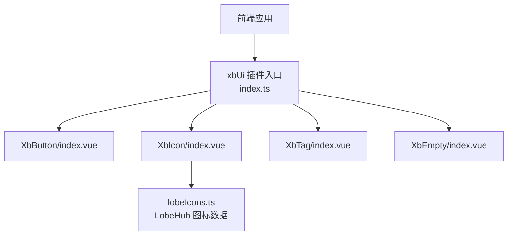
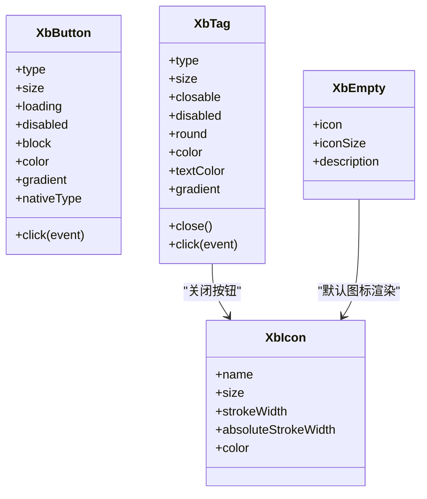
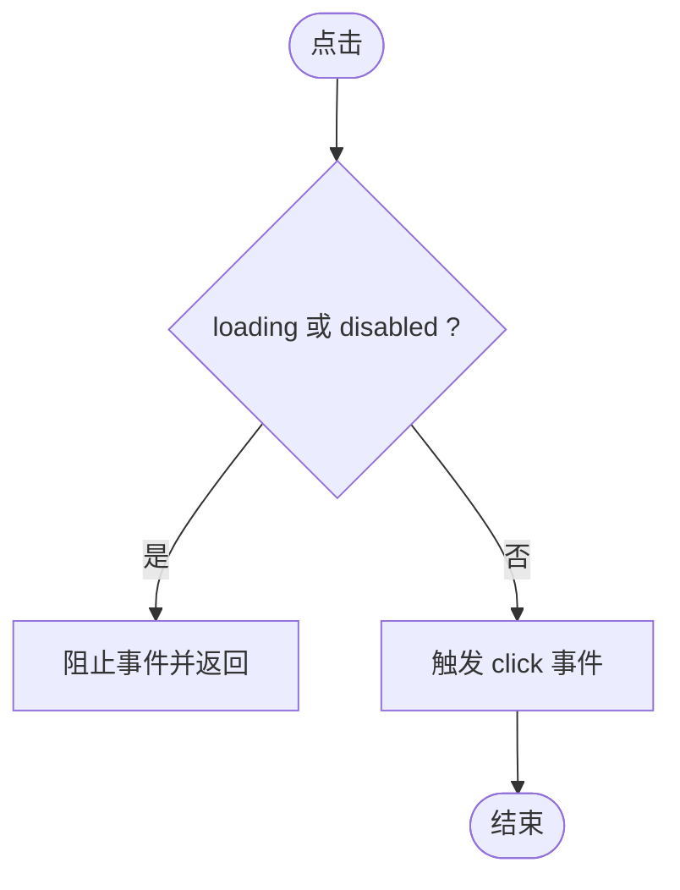
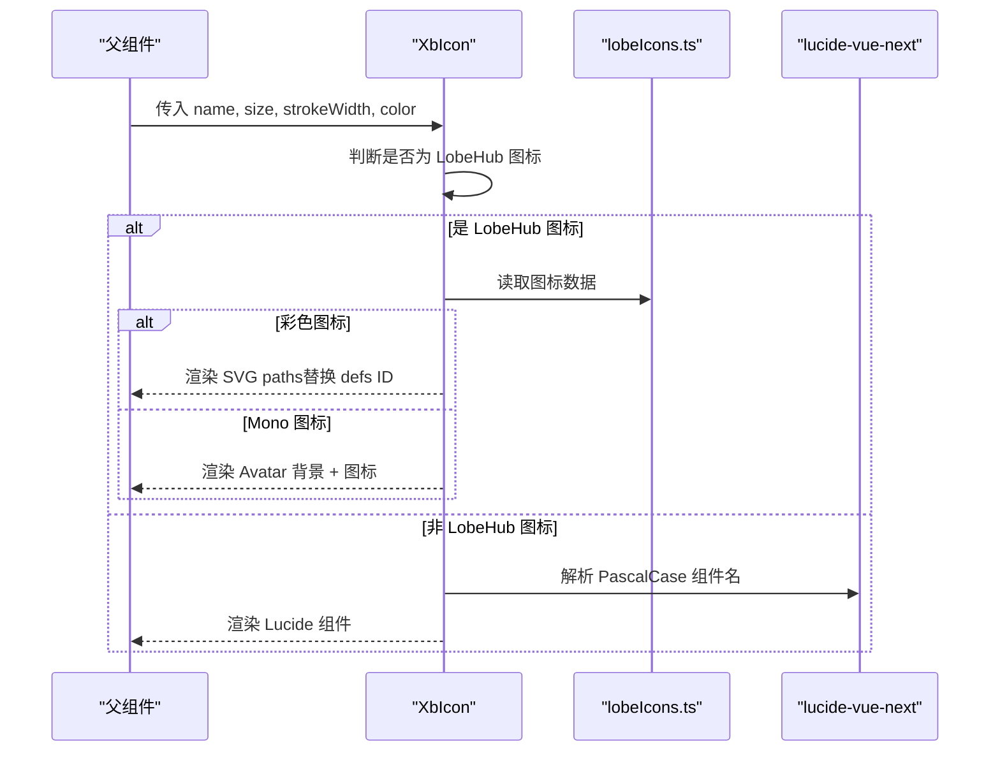
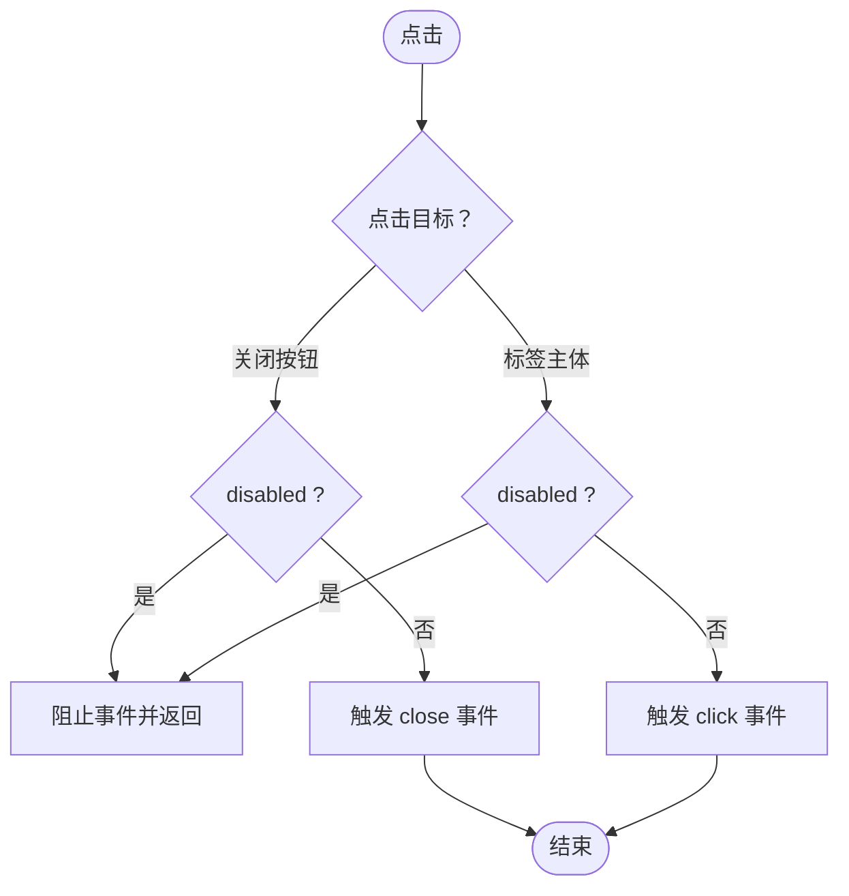
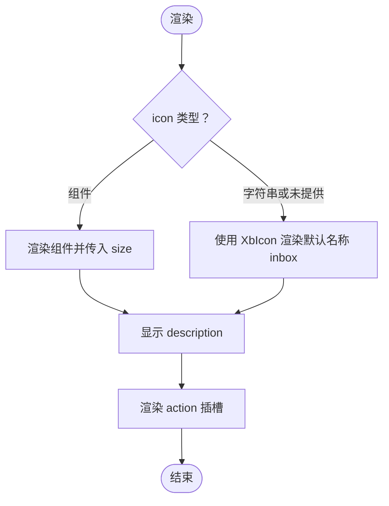
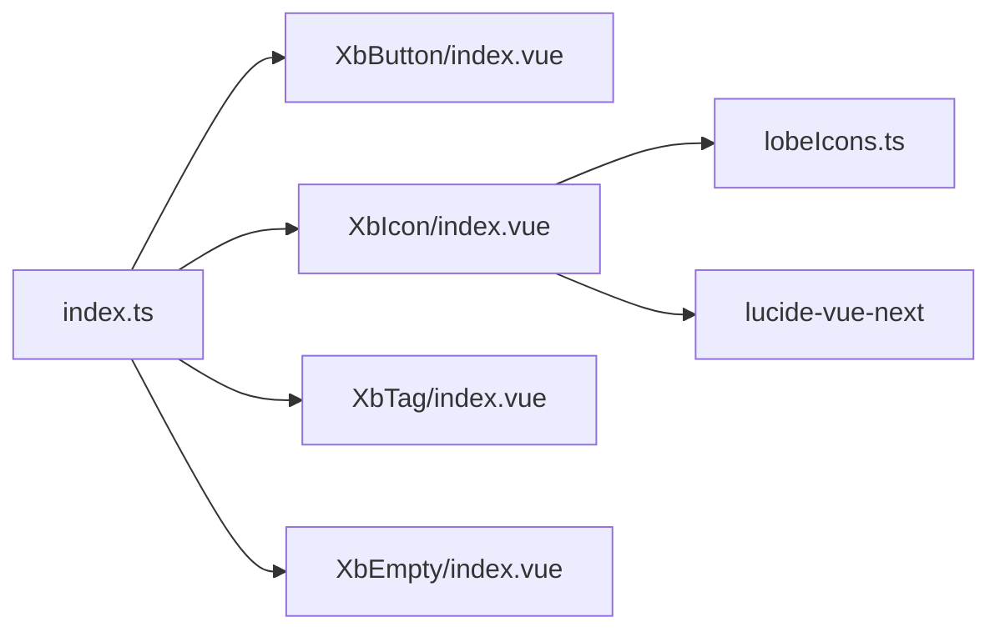

# 基础组件

<cite>
**本文引用的文件**   
- [XbButton/index.vue](file://frontend/src/xbUi/XbButton/index.vue)
- [XbIcon/index.vue](file://frontend/src/xbUi/XbIcon/index.vue)
- [XbTag/index.vue](file://frontend/src/xbUi/XbTag/index.vue)
- [XbEmpty/index.vue](file://frontend/src/xbUi/XbEmpty/index.vue)
- [index.ts](file://frontend/src/xbUi/index.ts)
- [lobeIcons.ts](file://frontend/src/xbUi/XbIcon/lobeIcons.ts)
</cite>

## 目录
1. [简介](#简介)
2. [项目结构](#项目结构)
3. [核心组件](#核心组件)
4. [架构总览](#架构总览)
5. [详细组件分析](#详细组件分析)
6. [依赖关系分析](#依赖关系分析)
7. [性能与可访问性](#性能与可访问性)
8. [故障排查指南](#故障排查指南)
9. [结论](#结论)
10. [附录：使用示例速查](#附录使用示例速查)

## 简介
本文件面向积木云AI创作平台的前端基础UI组件，聚焦以下四个基础组件的实现原理、API与最佳实践：
- 按钮 XbButton
- 图标 XbIcon
- 标签 XbTag
- 空状态 XbEmpty

文档将系统阐述每个组件的Props、事件、插槽、样式定制方式，并提供组合使用、动态配置、响应式适配的实践建议，同时覆盖可访问性与国际化处理要点。

## 项目结构
基础组件位于前端工程中的 xbUi 目录，统一通过插件形式注册并支持单独导出。核心入口 index.ts 负责批量注册与按需导出，各组件以独立目录组织，便于维护与扩展。

图表来源
- [index.ts:1-100](file://frontend/src/xbUi/index.ts#L1-L100)
- [XbButton/index.vue:1-110](file://frontend/src/xbUi/XbButton/index.vue#L1-L110)
- [XbIcon/index.vue:1-148](file://frontend/src/xbUi/XbIcon/index.vue#L1-L148)
- [XbTag/index.vue:1-103](file://frontend/src/xbUi/XbTag/index.vue#L1-L103)
- [XbEmpty/index.vue:1-32](file://frontend/src/xbUi/XbEmpty/index.vue#L1-L32)
- [lobeIcons.ts:1-34](file://frontend/src/xbUi/XbIcon/lobeIcons.ts#L1-L34)

章节来源
- [index.ts:1-100](file://frontend/src/xbUi/index.ts#L1-L100)

## 核心组件
本节概述四大组件的职责与能力边界：
- XbButton：提供多种类型、尺寸、加载态、禁用态、块级布局、自定义颜色与渐变背景等能力，支持原生 button type 控制表单行为。
- XbIcon：统一封装 Lucide 图标与 LobeHub 品牌图标（含彩色与 Mono 头像风格），自动处理 SVG defs ID 冲突与 Avatar 缩放。
- XbTag：提供多主题色、尺寸、圆角、可关闭、禁用、自定义颜色与渐变背景等能力。
- XbEmpty：展示无数据场景，支持传入图标组件或字符串名称、设置图标大小、描述文案以及操作插槽。

章节来源
- [XbButton/index.vue:1-110](file://frontend/src/xbUi/XbButton/index.vue#L1-L110)
- [XbIcon/index.vue:1-148](file://frontend/src/xbUi/XbIcon/index.vue#L1-L148)
- [XbTag/index.vue:1-103](file://frontend/src/xbUi/XbTag/index.vue#L1-L103)
- [XbEmpty/index.vue:1-32](file://frontend/src/xbUi/XbEmpty/index.vue#L1-L32)

## 架构总览
组件间依赖关系清晰：XbTag 内部复用 XbIcon 作为关闭按钮；XbEmpty 支持传入任意 Vue 组件作为图标，也支持字符串名称走 XbIcon 渲染；XbIcon 根据 name 前缀与内置映射决定渲染路径，并兼容 Lucide 图标库。

图表来源
- [XbButton/index.vue:1-110](file://frontend/src/xbUi/XbButton/index.vue#L1-L110)
- [XbIcon/index.vue:1-148](file://frontend/src/xbUi/XbIcon/index.vue#L1-L148)
- [XbTag/index.vue:1-103](file://frontend/src/xbUi/XbTag/index.vue#L1-L103)
- [XbEmpty/index.vue:1-32](file://frontend/src/xbUi/XbEmpty/index.vue#L1-L32)

## 详细组件分析

### XbButton 按钮
- Props
  - type：primary | secondary | ghost | danger | outline，控制外观主题
  - size：sm | md | lg，控制尺寸与字号
  - loading：boolean，显示旋转加载指示器并禁用交互
  - disabled：boolean，禁用按钮
  - block：boolean，是否全宽
  - color：string，自定义主色（CSS 颜色值），仅在 type=primary 时生效
  - gradient：boolean，配合 color 启用渐变背景
  - nativeType：button | submit | reset，原生 button type，避免误触发表单提交
- 事件
  - click：点击事件，在 loading 或 disabled 状态下不会触发
- 插槽
  - 默认插槽：按钮文本
  - icon 插槽：用于插入图标节点，与加载动画并列
- 样式定制
  - 通过 CSS 变量 --xb-btn-color 注入自定义颜色
  - 自定义颜色下支持渐变背景类名
  - 焦点可见样式已优化，hover 有轻微位移与阴影增强
- 实现要点
  - 使用 computed 拼接类名，按 size/type/custom 分支选择样式
  - 通过 style 绑定 CSS 变量实现主题化
  - 原生 button 的 type 属性透传，避免表单意外提交

图表来源
- [XbButton/index.vue:56-59](file://frontend/src/xbUi/XbButton/index.vue#L56-L59)

章节来源
- [XbButton/index.vue:1-110](file://frontend/src/xbUi/XbButton/index.vue#L1-L110)

### XbIcon 图标
- Props
  - name：string，图标名称。支持 lobe: 前缀指定 LobeHub 图标，或直接传入 LobeHub 图标名；否则视为 Lucide 图标名（kebab-case）
  - size：number，图标尺寸（px）
  - strokeWidth：number，Lucide 线宽
  - absoluteStrokeWidth：boolean，是否使用绝对线宽
  - color：string，Mono 图标在 Avatar 上的颜色（优先于 avatarColor）
- 渲染逻辑
  - 若 name 以 lobe: 开头或在 lobeIcons 中存在，则判定为 LobeHub 图标
  - 彩色图标：直接渲染 SVG paths，包含渐变/多色填充
  - Mono 图标：以圆形背景（Avatar 风格）呈现，背景色来自 avatarBg，图标色来自 avatarColor 或 color prop，并按 avatarMultiple 缩放
  - Lucide 图标：将 kebab-case 转为 PascalCase 后从 lucide-vue-next 动态导入对应组件
- 关键实现细节
  - 彩色图标存在多个实例时，会替换 SVG defs 中 id 与 url 引用，附加唯一后缀以避免冲突
  - 计算属性集中处理名称解析、数据获取、样式计算，保持模板简洁
- 外部依赖
  - lucide-vue-next：Lucide 图标库
  - lobeIcons.ts：自动生成 LobeHub 图标数据（viewBox、paths、hasColor、avatar* 等）

图表来源
- [XbIcon/index.vue:1-148](file://frontend/src/xbUi/XbIcon/index.vue#L1-L148)
- [lobeIcons.ts:1-34](file://frontend/src/xbUi/XbIcon/lobeIcons.ts#L1-L34)

章节来源
- [XbIcon/index.vue:1-148](file://frontend/src/xbUi/XbIcon/index.vue#L1-L148)
- [lobeIcons.ts:1-34](file://frontend/src/xbUi/XbIcon/lobeIcons.ts#L1-L34)

### XbTag 标签
- Props
  - type：default | brand | success | warning | danger | info，主题配色
  - size：sm | md | lg，尺寸与字号
  - closable：boolean，是否显示关闭按钮
  - disabled：boolean，禁用态
  - round：boolean，是否圆角
  - color：string，自定义背景色（覆盖 type 配色）
  - textColor：string，自定义文字色（配合 color 使用，默认 white）
  - gradient：boolean，配合 color 启用渐变背景
- 事件
  - close：点击关闭按钮时触发（stopPropagation 防止冒泡）
  - click：点击标签主体时触发
- 插槽
  - 默认插槽：标签内容
- 样式定制
  - 通过 CSS 变量 --xb-tag-color 与 --xb-tag-text 注入自定义颜色
  - 自定义颜色下支持渐变背景类名
  - 关闭按钮尺寸随 size 变化，hover 有背景高亮
- 实现要点
  - 使用 computed 拼接类名，按 size/type/custom/round/disabled/closable 分支选择样式
  - 关闭按钮内嵌 XbIcon 名称为 x，并根据 size 调整图标尺寸

图表来源
- [XbTag/index.vue:59-68](file://frontend/src/xbUi/XbTag/index.vue#L59-L68)

章节来源
- [XbTag/index.vue:1-103](file://frontend/src/xbUi/XbTag/index.vue#L1-L103)

### XbEmpty 空状态
- Props
  - icon：Component | string，支持传入 Vue 组件或字符串名称；未提供时使用默认图标名称
  - iconSize：number，图标尺寸（px）
  - description：string，描述文案
- 插槽
  - action：用于放置操作按钮或链接
- 渲染逻辑
  - 当 icon 为对象时，将其作为组件渲染，并传递 size
  - 当 icon 为字符串或未提供时，使用 XbIcon 渲染，名称默认为 inbox
- 样式特点
  - 垂直居中布局，图标与描述间距合理，整体视觉层级清晰

图表来源
- [XbEmpty/index.vue:14-31](file://frontend/src/xbUi/XbEmpty/index.vue#L14-L31)

章节来源
- [XbEmpty/index.vue:1-32](file://frontend/src/xbUi/XbEmpty/index.vue#L1-L32)

## 依赖关系分析
- 组件注册与导出
  - index.ts 将所有基础组件纳入全局插件，支持 app.use(xbUi) 一键注册，同时也支持按需 import 单个组件
- 图标数据
  - lobeIcons.ts 由脚本自动生成，包含大量品牌图标的 viewBox、paths、hasColor、avatar* 等元信息，供 XbIcon 动态渲染
- 第三方依赖
  - XbIcon 依赖 lucide-vue-next 提供 Lucide 图标组件

图表来源
- [index.ts:1-100](file://frontend/src/xbUi/index.ts#L1-L100)
- [XbIcon/index.vue:1-148](file://frontend/src/xbUi/XbIcon/index.vue#L1-L148)
- [lobeIcons.ts:1-34](file://frontend/src/xbUi/XbIcon/lobeIcons.ts#L1-L34)

章节来源
- [index.ts:1-100](file://frontend/src/xbUi/index.ts#L1-L100)

## 性能与可访问性
- 性能优化建议
  - 图标渲染：对于大量相同 LobeHub 彩色图标，注意 defs ID 冲突已被组件内部处理；仍建议在列表中使用 key 稳定标识，避免不必要的重渲染
  - 条件渲染：XbButton 与 XbTag 的样式类通过 computed 合并，减少重复计算；在大数据量列表中，尽量将 props 稳定化，避免频繁变更导致重算
  - 懒加载：XbIcon 对 Lucide 组件采用运行时解析，可在首屏仅引入必要图标以减少包体
- 可访问性
  - XbButton 使用原生 button 元素，具备键盘可达性与语义正确性；focus-visible 样式已优化，确保键盘导航可见
  - XbTag 的关闭按钮为 button 元素，且 stopPropagation 避免冒泡干扰外层点击；建议为可关闭标签提供 aria-label 说明
  - XbEmpty 的描述文案建议使用 p 标签（已实现），有助于屏幕阅读器识别
- 国际化处理
  - 当前组件未内置 i18n 字段，推荐在业务层通过 i18n 函数包裹 description 与按钮文案，例如：
    - XbButton 文本：使用 $t('common.submit') 等键值
    - XbEmpty.description：使用 $t('empty.noData') 等键值
    - XbTag 文本：使用 $t('tag.status.active') 等键值
  - 如需在组件内部提供默认文案，可通过 props 暴露国际化键名，由上层注入实际文本

[本节为通用指导，不直接分析具体文件]

## 故障排查指南
- 按钮点击无效
  - 检查 loading 或 disabled 是否被设置为 true
  - 确认 nativeType 是否正确，避免误触发表单提交
  - 参考：[XbButton/index.vue:56-59](file://frontend/src/xbUi/XbButton/index.vue#L56-L59)
- 图标显示异常或冲突
  - 彩色 LobeHub 图标在同一页面出现多次时，组件会自动替换 defs ID；如仍出现冲突，请检查是否存在自定义 SVG 覆盖
  - 确认 name 是否符合约定：LobeHub 图标可使用 lobe: 前缀或直接使用图标名；Lucide 图标使用 kebab-case
  - 参考：[XbIcon/index.vue:24-63](file://frontend/src/xbUi/XbIcon/index.vue#L24-L63)、[lobeIcons.ts:1-34](file://frontend/src/xbUi/XbIcon/lobeIcons.ts#L1-L34)
- 标签关闭事件未触发
  - 确认 closable 为 true，且未处于 disabled 状态
  - 检查是否有外层监听 click 导致冒泡被拦截
  - 参考：[XbTag/index.vue:59-68](file://frontend/src/xbUi/XbTag/index.vue#L59-L68)
- 空状态图标未显示
  - 若传入字符串名称，确认该名称在 XbIcon 支持范围内（Lucide 或 LobeHub）
  - 若传入组件，确认组件可正常渲染并接收 size 属性
  - 参考：[XbEmpty/index.vue:14-31](file://frontend/src/xbUi/XbEmpty/index.vue#L14-L31)

章节来源
- [XbButton/index.vue:56-59](file://frontend/src/xbUi/XbButton/index.vue#L56-L59)
- [XbIcon/index.vue:24-63](file://frontend/src/xbUi/XbIcon/index.vue#L24-L63)
- [lobeIcons.ts:1-34](file://frontend/src/xbUi/XbIcon/lobeIcons.ts#L1-L34)
- [XbTag/index.vue:59-68](file://frontend/src/xbUi/XbTag/index.vue#L59-L68)
- [XbEmpty/index.vue:14-31](file://frontend/src/xbUi/XbEmpty/index.vue#L14-L31)

## 结论
XbButton、XbIcon、XbTag、XbEmpty 四个基础组件提供了稳定的 UI 能力与良好的可扩展性。通过统一的样式体系、灵活的 Props 与插槽机制，能够覆盖大多数业务场景。结合可访问性与国际化建议，可在保证用户体验的同时提升可维护性与可测试性。

[本节为总结性内容，不直接分析具体文件]

## 附录：使用示例速查
以下为常见用法的路径指引（不包含代码内容）：
- 按钮基础用法与类型切换
  - 参考：[XbButton/index.vue:1-110](file://frontend/src/xbUi/XbButton/index.vue#L1-L110)
- 按钮自定义颜色与渐变
  - 参考：[XbButton/index.vue:44-70](file://frontend/src/xbUi/XbButton/index.vue#L44-L70)
- 图标使用 LobeHub 彩色与 Mono 头像风格
  - 参考：[XbIcon/index.vue:24-95](file://frontend/src/xbUi/XbIcon/index.vue#L24-L95)
- 图标使用 Lucide 图标（kebab-case 转 PascalCase）
  - 参考：[XbIcon/index.vue:99-107](file://frontend/src/xbUi/XbIcon/index.vue#L99-L107)
- 标签可关闭与点击事件
  - 参考：[XbTag/index.vue:59-68](file://frontend/src/xbUi/XbTag/index.vue#L59-L68)
- 标签自定义颜色与渐变
  - 参考：[XbTag/index.vue:46-76](file://frontend/src/xbUi/XbTag/index.vue#L46-L76)
- 空状态传入组件图标与默认图标
  - 参考：[XbEmpty/index.vue:14-31](file://frontend/src/xbUi/XbEmpty/index.vue#L14-L31)
- 组件统一注册与按需导出
  - 参考：[index.ts:1-100](file://frontend/src/xbUi/index.ts#L1-L100)

[本节为索引型内容，不直接分析具体文件]