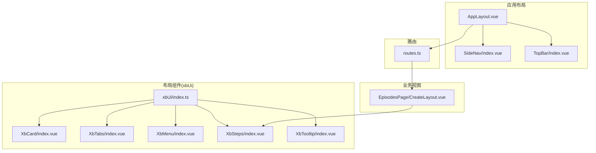
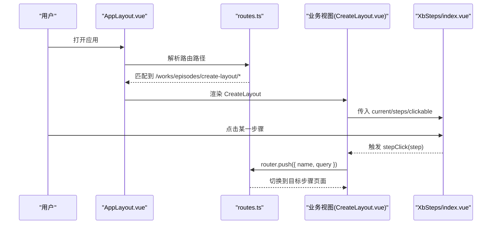
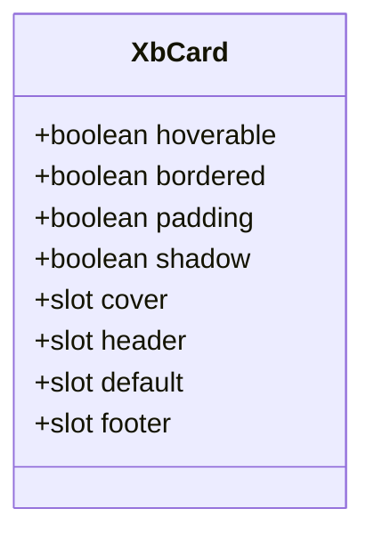
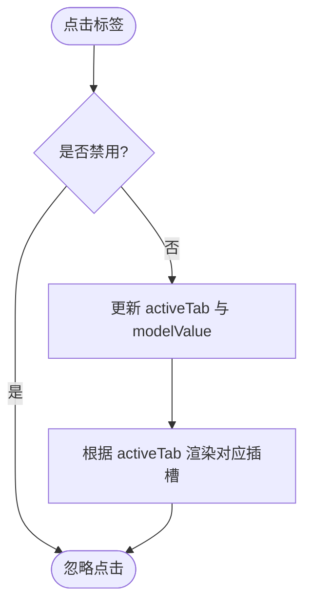
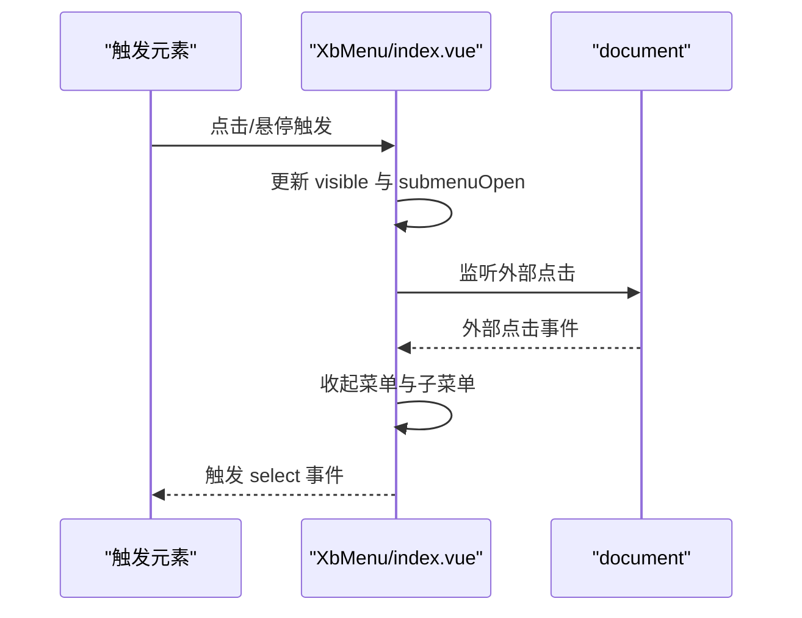
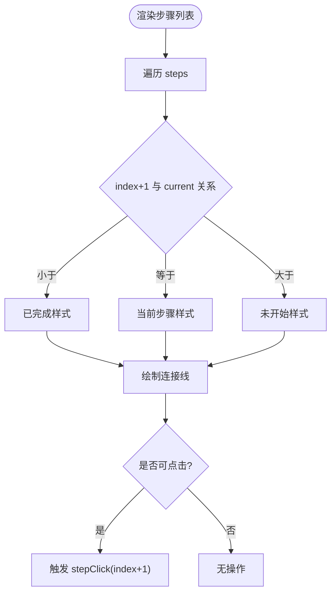
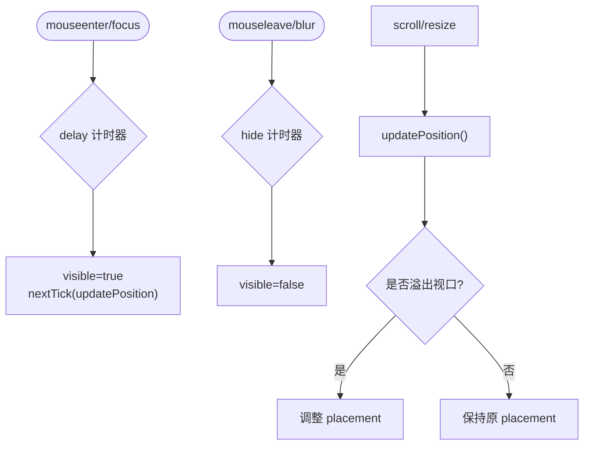
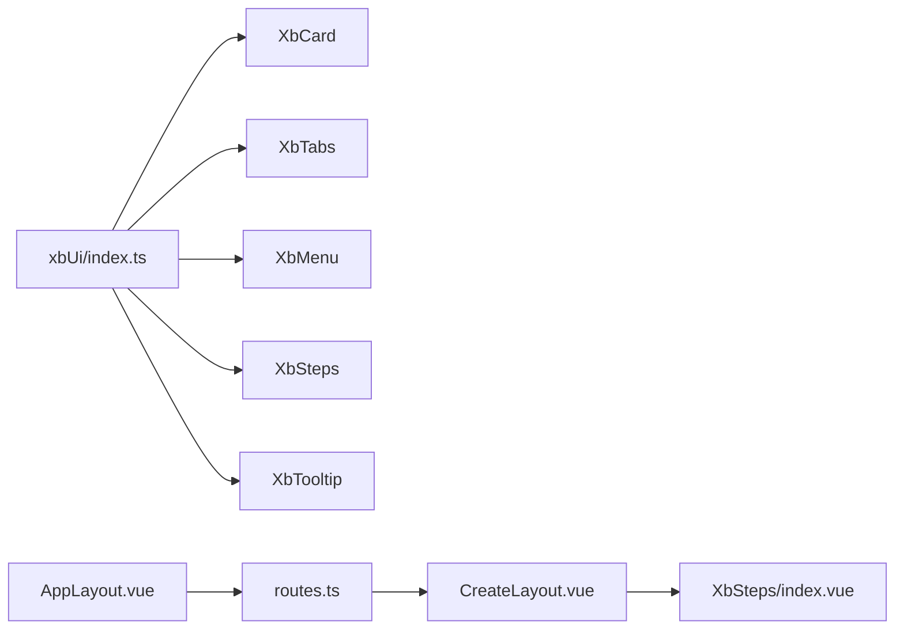
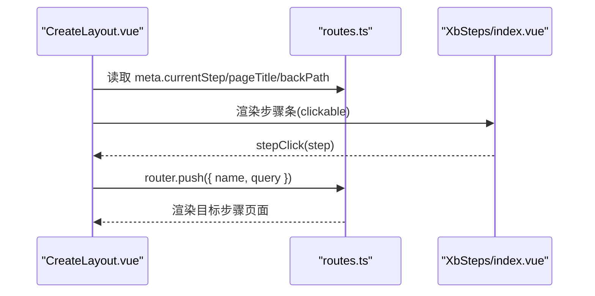

# 布局组件

<cite>
**本文引用的文件**   
- [XbCard/index.vue](file://frontend/src/xbUi/XbCard/index.vue)
- [XbTabs/index.vue](file://frontend/src/xbUi/XbTabs/index.vue)
- [XbTabs/types.ts](file://frontend/src/xbUi/XbTabs/types.ts)
- [XbMenu/index.vue](file://frontend/src/xbUi/XbMenu/index.vue)
- [XbMenu/types.ts](file://frontend/src/xbUi/XbMenu/types.ts)
- [XbSteps/index.vue](file://frontend/src/xbUi/XbSteps/index.vue)
- [XbSteps/types.ts](file://frontend/src/xbUi/XbSteps/types.ts)
- [XbTooltip/index.vue](file://frontend/src/xbUi/XbTooltip/index.vue)
- [index.ts](file://frontend/src/xbUi/index.ts)
- [AppLayout.vue](file://frontend/src/layouts/AppLayout.vue)
- [routes.ts](file://frontend/src/router/routes.ts)
- [SideNav/index.vue](file://frontend/src/layouts/components/SideNav/index.vue)
- [CreateLayout.vue](file://frontend/src/views/EpidodesPage/CreateLayout.vue)
</cite>

## 目录
1. [简介](#简介)
2. [项目结构](#项目结构)
3. [核心组件](#核心组件)
4. [架构总览](#架构总览)
5. [详细组件分析](#详细组件分析)
6. [依赖关系分析](#依赖关系分析)
7. [性能与可访问性](#性能与可访问性)
8. [复杂页面构建示例](#复杂页面构建示例)
9. [故障排查指南](#故障排查指南)
10. [结论](#结论)

## 简介
本文件面向积木云AI创作平台的前端布局导航体系，围绕以下组件进行系统化说明：卡片（XbCard）、标签页（XbTabs）、菜单（XbMenu）、步骤条（XbSteps）、提示框（XbTooltip）。文档将深入解释其实现原理、嵌套结构与层级关系、路由集成方式、动态加载策略，并提供多级菜单、动态标签页、向导式界面与信息提示系统的组合实践。同时覆盖响应式设计、动画效果、键盘交互与屏幕阅读器支持建议。

## 项目结构
前端采用 Vue 3 + TypeScript + Tailwind CSS 的组件化架构。布局组件统一位于 xbUi 目录，通过插件形式全局注册；应用级布局由 AppLayout 承载侧边栏与顶部栏，路由按功能模块组织，部分页面使用独立布局（如向导式流程）。

图表来源
- [AppLayout.vue:1-50](file://frontend/src/layouts/AppLayout.vue#L1-L50)
- [SideNav/index.vue:1-106](file://frontend/src/layouts/components/SideNav/index.vue#L1-L106)
- [routes.ts:1-110](file://frontend/src/router/routes.ts#L1-L110)
- [index.ts:1-100](file://frontend/src/xbUi/index.ts#L1-L100)
- [CreateLayout.vue:1-71](file://frontend/src/views/EpidodesPage/CreateLayout.vue#L1-L71)

章节来源
- [AppLayout.vue:1-50](file://frontend/src/layouts/AppLayout.vue#L1-L50)
- [routes.ts:1-110](file://frontend/src/router/routes.ts#L1-L110)
- [index.ts:1-100](file://frontend/src/xbUi/index.ts#L1-L100)

## 核心组件
本节聚焦五个布局导航组件的设计要点、属性与事件、插槽与样式行为，以及与其他组件的协作方式。

- XbCard
  - 作用：通用内容容器，提供边框、内边距、阴影与悬浮动效等视觉能力。
  - 关键特性：
    - 属性：hoverable、bordered、padding、shadow，控制外观与交互反馈。
    - 插槽：cover、header、footer 与默认插槽，便于分层组织内容。
    - 样式：圆角、过渡动画、悬浮提升与品牌色描边。
  - 适用场景：信息卡片、配置面板、结果展示等。

- XbTabs
  - 作用：多标签切换容器，支持线型与卡片两种变体，多种尺寸。
  - 关键特性：
    - 数据驱动：tabs 数组定义标签项，支持禁用状态与图标。
    - 双向绑定：v-model 同步当前激活标签值。
    - 插槽：以 value 为名的具名插槽渲染对应面板，兜底默认插槽。
    - 交互：点击切换，禁用态不可选。
  - 适用场景：设置页、数据筛选、分块内容展示。

- XbMenu
  - 作用：下拉菜单组件，支持点击或悬停触发、四级定位、分隔线与危险操作样式。
  - 关键特性：
    - 触发模式：click/hover，placement 支持四个方位。
    - 子菜单：支持 children 嵌套，悬停延迟关闭避免误触。
    - 事件：select 返回选中值，update:visible 控制显隐。
    - 外部点击：自动收起并清理子菜单状态。
  - 适用场景：工具栏操作、上下文菜单、批量操作入口。

- XbSteps
  - 作用：步骤指示器，支持水平/垂直方向、可点击回退。
  - 关键特性：
    - 状态：已完成、当前、未开始三种样式。
    - 交互：clickable 允许点击历史步骤，stepClick 事件回调。
    - 图标：完成态可自定义图标名称。
  - 适用场景：表单向导、流程引导、任务进度。

- XbTooltip
  - 作用：浮动提示框，支持四向定位、延迟显示、溢出自动翻转与箭头指向。
  - 关键特性：
    - 定位：基于 getBoundingClientRect 计算位置，监听滚动与窗口变化更新。
    - 延迟：showTimer/hideTimer 控制显示/隐藏时机。
    - 内容：content 属性或 content 插槽，Teleport 到 body 避免层级问题。
  - 适用场景：帮助提示、字段说明、快捷操作说明。

章节来源
- [XbCard/index.vue:1-48](file://frontend/src/xbUi/XbCard/index.vue#L1-L48)
- [XbTabs/index.vue:1-83](file://frontend/src/xbUi/XbTabs/index.vue#L1-L83)
- [XbTabs/types.ts:1-7](file://frontend/src/xbUi/XbTabs/types.ts#L1-L7)
- [XbMenu/index.vue:1-170](file://frontend/src/xbUi/XbMenu/index.vue#L1-L170)
- [XbMenu/types.ts:1-10](file://frontend/src/xbUi/XbMenu/types.ts#L1-L10)
- [XbSteps/index.vue:1-90](file://frontend/src/xbUi/XbSteps/index.vue#L1-L90)
- [XbSteps/types.ts:1-6](file://frontend/src/xbUi/XbSteps/types.ts#L1-L6)
- [XbTooltip/index.vue:1-207](file://frontend/src/xbUi/XbTooltip/index.vue#L1-L207)

## 架构总览
整体架构遵循“布局容器 + 路由 + 组件库”的分层设计：
- 应用布局：AppLayout 负责全屏布局、侧边栏与顶部栏、主内容区与路由出口。
- 路由系统：routes.ts 集中管理页面路由，支持懒加载与元信息（meta）携带流程状态。
- 组件库：xbUi 通过 index.ts 统一注册，按需导出类型定义，保证类型安全。
- 业务视图：例如 CreateLayout 作为向导式布局，结合 XbSteps 与路由 meta 实现步骤导航。

图表来源
- [AppLayout.vue:1-50](file://frontend/src/layouts/AppLayout.vue#L1-L50)
- [routes.ts:1-110](file://frontend/src/router/routes.ts#L1-L110)
- [CreateLayout.vue:1-71](file://frontend/src/views/EpidodesPage/CreateLayout.vue#L1-L71)
- [XbSteps/index.vue:1-90](file://frontend/src/xbUi/XbSteps/index.vue#L1-L90)

## 详细组件分析

### XbCard 组件
- 结构层次
  - 外层容器：根据 hoverable/bordered/padding/shadow 动态组合类名。
  - 可选区域：cover/header/footer 三个插槽区域，分别处理首图、标题与底部操作。
  - 默认插槽：主体内容区。
- 样式与动画
  - 圆角、边框、阴影与悬浮位移，配合 transition-all 平滑过渡。
- 使用建议
  - 在需要强调内容的区块中使用，注意 cover 图片需保持比例与清晰度。
  - 与 XbTabs 组合时，可将每个 Tab 面板放入 Card 中，形成卡片式标签页。

图表来源
- [XbCard/index.vue:1-48](file://frontend/src/xbUi/XbCard/index.vue#L1-L48)

章节来源
- [XbCard/index.vue:1-48](file://frontend/src/xbUi/XbCard/index.vue#L1-L48)

### XbTabs 组件
- 数据结构
  - TabItem：label、value、icon、disabled。
- 交互逻辑
  - 内部 activeTab 与 props.modelValue 双向同步。
  - 点击 tab 时若未禁用则更新 activeTab 并触发 update:modelValue。
- 插槽机制
  - 以 value 为键的具名插槽渲染对应面板，若无匹配则回退到默认插槽。
- 变体与尺寸
  - variant：line/card，size：sm/md/lg，通过 sizeClasses 映射样式。

图表来源
- [XbTabs/index.vue:1-83](file://frontend/src/xbUi/XbTabs/index.vue#L1-L83)
- [XbTabs/types.ts:1-7](file://frontend/src/xbUi/XbTabs/types.ts#L1-L7)

章节来源
- [XbTabs/index.vue:1-83](file://frontend/src/xbUi/XbTabs/index.vue#L1-L83)
- [XbTabs/types.ts:1-7](file://frontend/src/xbUi/XbTabs/types.ts#L1-L7)

### XbMenu 组件
- 触发与定位
  - trigger：click/hover；placement：bottom-start/end、top-start/end。
  - 通过 placementClasses 计算绝对定位偏移。
- 子菜单与延迟
  - submenuOpen 记录当前展开的子菜单项。
  - hover 模式下使用定时器延迟关闭，避免抖动。
- 事件与外部点击
  - select 返回选中项 value；update:visible 控制显隐。
  - 监听 document click 在外部点击时收起菜单与子菜单。
- 样式与动画
  - Transition 包裹弹出层，进入/离开包含缩放与透明度变化。

图表来源
- [XbMenu/index.vue:1-170](file://frontend/src/xbUi/XbMenu/index.vue#L1-L170)
- [XbMenu/types.ts:1-10](file://frontend/src/xbUi/XbMenu/types.ts#L1-L10)

章节来源
- [XbMenu/index.vue:1-170](file://frontend/src/xbUi/XbMenu/index.vue#L1-L170)
- [XbMenu/types.ts:1-10](file://frontend/src/xbUi/XbMenu/types.ts#L1-L10)

### XbSteps 组件
- 状态与样式
  - 根据 index+1 与 current 比较决定样式：已完成/当前/未开始。
  - 连接线颜色随步骤推进变化。
- 交互
  - clickable 允许点击任意步骤；否则仅允许点击已完成的步骤。
  - stepClick 事件向上抛出，由父组件执行路由跳转或状态更新。
- 方向
  - horizontal/vertical 通过 flex 布局切换排列方式。

图表来源
- [XbSteps/index.vue:1-90](file://frontend/src/xbUi/XbSteps/index.vue#L1-L90)
- [XbSteps/types.ts:1-6](file://frontend/src/xbUi/XbSteps/types.ts#L1-L6)

章节来源
- [XbSteps/index.vue:1-90](file://frontend/src/xbUi/XbSteps/index.vue#L1-L90)
- [XbSteps/types.ts:1-6](file://frontend/src/xbUi/XbSteps/types.ts#L1-L6)

### XbTooltip 组件
- 定位算法
  - 获取触发元素与提示框的边界矩形，计算 top/left。
  - 检测视口边界，必要时自动翻转 placement。
- 生命周期
  - showTimer/hideTimer 控制延迟显示/隐藏。
  - 监听 window scroll/resize 实时更新位置。
- 内容渲染
  - Teleport 到 body，避免 z-index 与 overflow 影响。
  - 箭头根据 actualPlacement 动态定位。

图表来源
- [XbTooltip/index.vue:1-207](file://frontend/src/xbUi/XbTooltip/index.vue#L1-L207)

章节来源
- [XbTooltip/index.vue:1-207](file://frontend/src/xbUi/XbTooltip/index.vue#L1-L207)

## 依赖关系分析
- 组件注册与导出
  - xbUi/index.ts 统一导入各组件并通过 install 方法全局注册，同时导出类型定义供业务代码使用。
- 布局与路由
  - AppLayout 引入 SideNav 与 TopBar，并在 main 区域使用 router-view 渲染页面。
  - routes.ts 定义首页与工作流相关路由，其中 create-layout 作为向导式布局容器，children 路由携带 currentStep/pageTitle/backPath 等元信息。
- 业务视图与组件
  - CreateLayout 读取 route.meta.currentStep 与 backPath，构造 StepItem 列表，绑定 XbSteps 的 clickable 与 stepClick 事件，实现步骤间路由跳转。

图表来源
- [index.ts:1-100](file://frontend/src/xbUi/index.ts#L1-L100)
- [AppLayout.vue:1-50](file://frontend/src/layouts/AppLayout.vue#L1-L50)
- [routes.ts:1-110](file://frontend/src/router/routes.ts#L1-L110)
- [CreateLayout.vue:1-71](file://frontend/src/views/EpidodesPage/CreateLayout.vue#L1-L71)

章节来源
- [index.ts:1-100](file://frontend/src/xbUi/index.ts#L1-L100)
- [AppLayout.vue:1-50](file://frontend/src/layouts/AppLayout.vue#L1-L50)
- [routes.ts:1-110](file://frontend/src/router/routes.ts#L1-L110)
- [CreateLayout.vue:1-71](file://frontend/src/views/EpidodesPage/CreateLayout.vue#L1-L71)

## 性能与可访问性
- 性能优化建议
  - 懒加载：路由组件已采用动态 import，确保首屏体积最小化。
  - Tooltip 定位：仅在可见时计算位置，使用 nextTick 避免闪烁；监听滚动/resize 时使用节流/防抖可进一步优化。
  - 菜单子项：大量子菜单时建议分页或虚拟滚动，减少 DOM 节点数量。
  - Tabs 面板：对重型面板可使用 v-if 惰性渲染，结合 keep-alive 缓存常用面板。
- 可访问性（a11y）建议
  - 键盘导航：为按钮与可交互元素添加 tabindex 与键盘事件（Enter/Space 触发、Esc 关闭），确保焦点顺序合理。
  - 语义化：为步骤条与标签页添加 role="tablist"/role="tab" 与 aria-selected 等属性，提升屏幕阅读器体验。
  - 对比度与焦点：确保文本与背景对比度达标，焦点样式清晰可见。
  - 提示框：为触发元素添加 aria-describedby 指向 tooltip 内容，增强辅助技术可读性。

[本节为通用指导，不直接分析具体文件]

## 复杂页面构建示例

### 多级菜单
- 数据模型：MenuItem 支持 children 嵌套、divider 分隔、danger 危险样式。
- 交互：hover 模式下子菜单延迟关闭，click 模式点击展开/收起。
- 集成：可在 TopBar 或工具栏中使用，结合路由跳转或业务动作。

章节来源
- [XbMenu/index.vue:1-170](file://frontend/src/xbUi/XbMenu/index.vue#L1-L170)
- [XbMenu/types.ts:1-10](file://frontend/src/xbUi/XbMenu/types.ts#L1-L10)

### 动态标签页
- 数据来源：从后端或 store 动态生成 tabs 数组，支持禁用与图标。
- 路由联动：将路由参数作为 value，实现 URL 与标签页同步。
- 面板懒加载：使用 v-if 或异步组件按需加载面板内容。

章节来源
- [XbTabs/index.vue:1-83](file://frontend/src/xbUi/XbTabs/index.vue#L1-L83)
- [XbTabs/types.ts:1-7](file://frontend/src/xbUi/XbTabs/types.ts#L1-L7)

### 向导式界面
- 布局容器：CreateLayout 作为向导布局，读取 route.meta 中的 currentStep/pageTitle/backPath。
- 步骤导航：XbSteps 提供 clickable 与 stepClick，父组件根据步骤调用 router.push 切换页面。
- 面包屑与返回：结合路由元信息与返回路径，提供一致的用户体验。

图表来源
- [CreateLayout.vue:1-71](file://frontend/src/views/EpidodesPage/CreateLayout.vue#L1-L71)
- [routes.ts:1-110](file://frontend/src/router/routes.ts#L1-L110)
- [XbSteps/index.vue:1-90](file://frontend/src/xbUi/XbSteps/index.vue#L1-L90)

章节来源
- [CreateLayout.vue:1-71](file://frontend/src/views/EpidodesPage/CreateLayout.vue#L1-L71)
- [routes.ts:1-110](file://frontend/src/router/routes.ts#L1-L110)
- [XbSteps/index.vue:1-90](file://frontend/src/xbUi/XbSteps/index.vue#L1-L90)

### 信息提示系统
- 基础用法：XbTooltip 包裹触发元素，content 或插槽提供提示内容。
- 高级用法：结合 XbMenu 的工具栏按钮，提供操作说明；在 XbSteps 的步骤上提供步骤说明。
- 定位与溢出：自动翻转与箭头指向，确保在不同屏幕尺寸下可用。

章节来源
- [XbTooltip/index.vue:1-207](file://frontend/src/xbUi/XbTooltip/index.vue#L1-L207)

## 故障排查指南
- 菜单无法收起
  - 检查是否在外部点击时正确移除监听，确认 menuRef 引用有效。
  - 确认 visible 状态与 update:visible 事件是否正确传递。
- 提示框位置异常
  - 检查触发元素是否为空容器（宽高为 0），组件会尝试使用第一个子元素定位。
  - 确认滚动与窗口大小变化监听是否生效，必要时增加节流。
- 步骤条点击无效
  - 确认 clickable 属性与当前步骤状态，只有可点击或已完成步骤才触发 stepClick。
- 标签页面板不显示
  - 确认具名插槽的 name 与 tab.value 一致，或提供默认插槽兜底。

章节来源
- [XbMenu/index.vue:1-170](file://frontend/src/xbUi/XbMenu/index.vue#L1-L170)
- [XbTooltip/index.vue:1-207](file://frontend/src/xbUi/XbTooltip/index.vue#L1-L207)
- [XbSteps/index.vue:1-90](file://frontend/src/xbUi/XbSteps/index.vue#L1-L90)
- [XbTabs/index.vue:1-83](file://frontend/src/xbUi/XbTabs/index.vue#L1-L83)

## 结论
本布局组件体系以清晰的职责划分与良好的扩展性为基础，结合路由系统与响应式样式，能够高效支撑复杂页面的构建。通过合理的懒加载、定位优化与可访问性改进，可进一步提升用户体验与性能表现。建议在业务中优先复用这些组件，并结合路由元信息与状态管理实现一致的导航与交互体验。