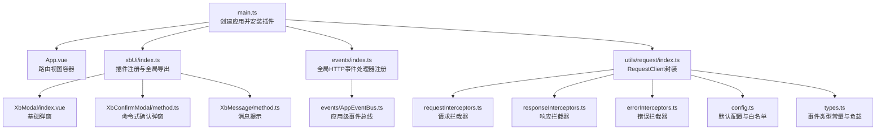
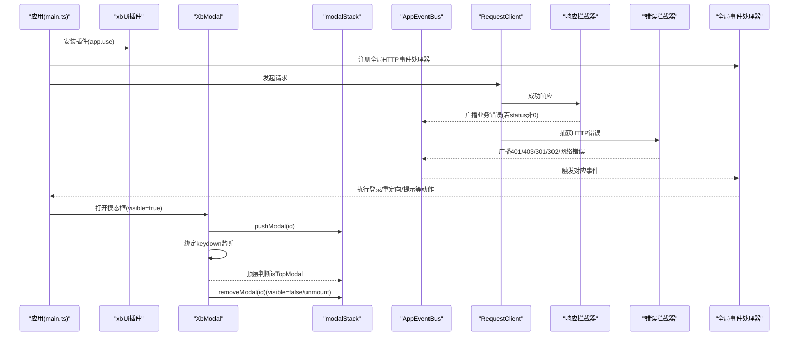
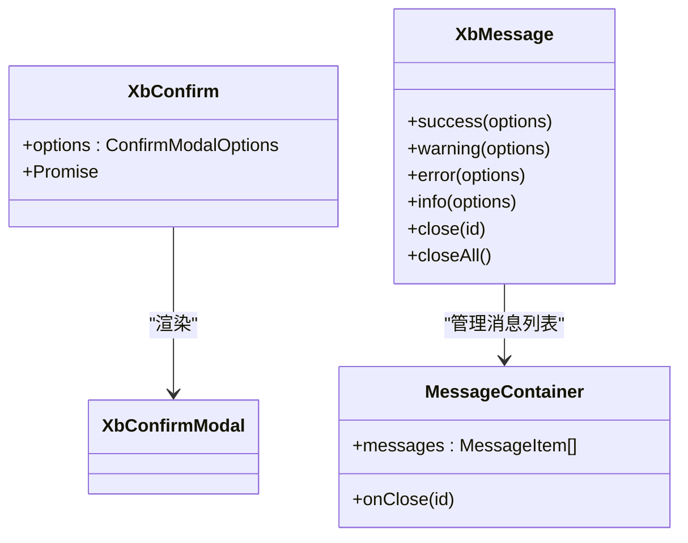
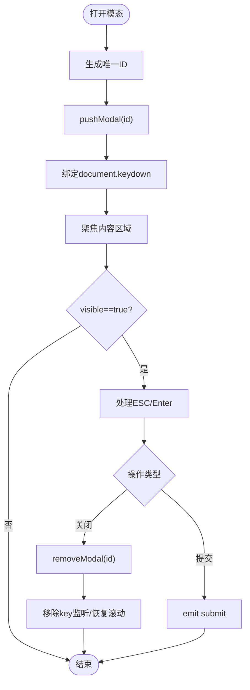
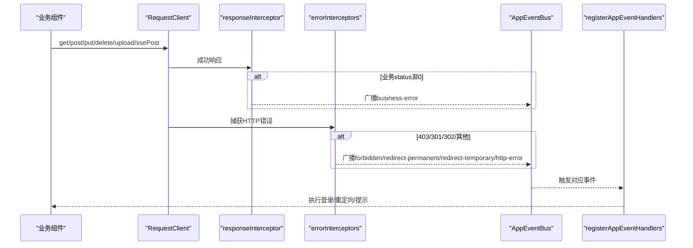
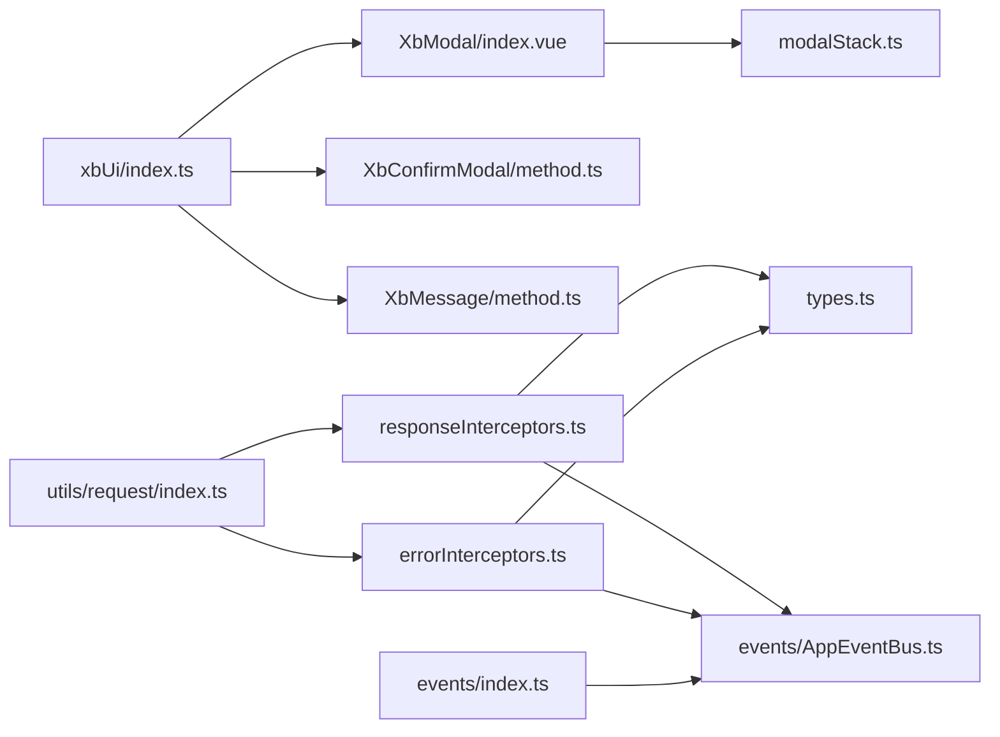

# 组件架构设计

<cite>
**本文引用的文件**   
- [frontend/src/main.ts](file://frontend/src/main.ts)
- [frontend/src/App.vue](file://frontend/src/App.vue)
- [frontend/src/xbUi/index.ts](file://frontend/src/xbUi/index.ts)
- [frontend/src/xbUi/modalStack.ts](file://frontend/src/xbUi/modalStack.ts)
- [frontend/src/xbUi/XbModal/index.vue](file://frontend/src/xbUi/XbModal/index.vue)
- [frontend/src/xbUi/XbConfirmModal/method.ts](file://frontend/src/xbUi/XbConfirmModal/method.ts)
- [frontend/src/xbUi/XbConfirmModal/index.vue](file://frontend/src/xbUi/XbConfirmModal/index.vue)
- [frontend/src/xbUi/XbMessage/method.ts](file://frontend/src/xbUi/XbMessage/method.ts)
- [frontend/src/xbUi/XbMessage/MessageContainer.vue](file://frontend/src/xbUi/XbMessage/MessageContainer.vue)
- [frontend/src/events/AppEventBus.ts](file://frontend/src/events/AppEventBus.ts)
- [frontend/src/events/index.ts](file://frontend/src/events/index.ts)
- [frontend/src/utils/request/types.ts](file://frontend/src/utils/request/types.ts)
- [frontend/src/utils/request/index.ts](file://frontend/src/utils/request/index.ts)
- [frontend/src/utils/request/config.ts](file://frontend/src/utils/request/config.ts)
- [frontend/src/utils/request/requestInterceptors.ts](file://frontend/src/utils/request/requestInterceptors.ts)
- [frontend/src/utils/request/responseInterceptors.ts](file://frontend/src/utils/request/responseInterceptors.ts)
- [frontend/src/utils/request/errorInterceptors.ts](file://frontend/src/utils/request/errorInterceptors.ts)
</cite>

## 目录
1. [简介](#简介)
2. [项目结构](#项目结构)
3. [核心组件](#核心组件)
4. [架构总览](#架构总览)
5. [详细组件分析](#详细组件分析)
6. [依赖关系分析](#依赖关系分析)
7. [性能考量](#性能考量)
8. [故障排查指南](#故障排查指南)
9. [结论](#结论)
10. [附录](#附录)

## 简介
本文件面向积木云AI创作平台的自定义UI组件库与前端基础设施，系统性阐述以下主题：
- 插件注册机制与全局API设计模式
- 模态框栈管理系统与键盘交互策略
- 事件总线设计与HTTP错误统一处理
- 组件生命周期管理、依赖注入与通信模式
- 状态共享策略与主题系统实现思路
- 扩展新组件、配置全局选项、处理组件间交互的实践路径
- 性能优化策略与最佳实践

## 项目结构
前端采用Vue 3 + TypeScript，组件库位于 src/xbUi，事件总线位于 src/events，网络请求封装位于 src/utils/request。应用入口在 main.ts，根组件为 App.vue。

图表来源
- [frontend/src/main.ts:1-21](file://frontend/src/main.ts#L1-L21)
- [frontend/src/App.vue:1-4](file://frontend/src/App.vue#L1-L4)
- [frontend/src/xbUi/index.ts:1-100](file://frontend/src/xbUi/index.ts#L1-L100)
- [frontend/src/xbUi/XbModal/index.vue:1-620](file://frontend/src/xbUi/XbModal/index.vue#L1-L620)
- [frontend/src/xbUi/XbConfirmModal/method.ts:1-150](file://frontend/src/xbUi/XbConfirmModal/method.ts#L1-L150)
- [frontend/src/xbUi/XbMessage/method.ts:1-116](file://frontend/src/xbUi/XbMessage/method.ts#L1-L116)
- [frontend/src/events/index.ts:1-119](file://frontend/src/events/index.ts#L1-L119)
- [frontend/src/events/AppEventBus.ts:1-109](file://frontend/src/events/AppEventBus.ts#L1-L109)
- [frontend/src/utils/request/index.ts:1-237](file://frontend/src/utils/request/index.ts#L1-L237)
- [frontend/src/utils/request/config.ts:1-39](file://frontend/src/utils/request/config.ts#L1-L39)
- [frontend/src/utils/request/requestInterceptors.ts:1-47](file://frontend/src/utils/request/requestInterceptors.ts#L1-L47)
- [frontend/src/utils/request/responseInterceptors.ts:1-24](file://frontend/src/utils/request/responseInterceptors.ts#L1-L24)
- [frontend/src/utils/request/errorInterceptors.ts:1-57](file://frontend/src/utils/request/errorInterceptors.ts#L1-L57)
- [frontend/src/utils/request/types.ts:1-40](file://frontend/src/utils/request/types.ts#L1-L40)

章节来源
- [frontend/src/main.ts:1-21](file://frontend/src/main.ts#L1-L21)
- [frontend/src/App.vue:1-4](file://frontend/src/App.vue#L1-L4)
- [frontend/src/xbUi/index.ts:1-100](file://frontend/src/xbUi/index.ts#L1-L100)

## 核心组件
- 插件注册机制
  - xbUi 作为 Vue 插件，集中导入并批量注册所有 UI 组件，同时提供独立导出与类型导出，便于按需引入与类型推断。
  - 通过 app.use(xbUi) 完成全局注册，简化业务代码使用成本。
- 全局API设计模式
  - XbConfirm：命令式调用，返回 Promise，支持异步 onConfirm 自动 loading。
  - XbMessage：命令式 API，支持 success/warning/error/info 快捷方法与 close/closeAll。
- 模态框栈管理
  - modalStack 维护一个全局栈，记录当前可见的模态框ID，仅顶层模态框响应键盘快捷键（如 ESC 关闭、Enter 提交）。
  - XbModal 在 visible 变化时入栈/出栈，并在卸载时清理监听与滚动锁定。
- 事件总线与HTTP错误统一处理
  - AppEventBus 基于 window CustomEvent 提供 emit/on/off/once 能力，并提供便捷方法用于登录、权限等场景。
  - events/index.ts 注册全局 HTTP 状态码事件处理器，将 401/403/301/302 及业务错误映射到具体行为（跳转、提示、弹出登录框等）。
  - utils/request 层在响应拦截器中根据后端 status 或 HTTP 状态码广播事件，形成“网络层 → 事件总线 → 全局处理器”的统一链路。

章节来源
- [frontend/src/xbUi/index.ts:1-100](file://frontend/src/xbUi/index.ts#L1-L100)
- [frontend/src/xbUi/XbConfirmModal/method.ts:1-150](file://frontend/src/xbUi/XbConfirmModal/method.ts#L1-L150)
- [frontend/src/xbUi/XbMessage/method.ts:1-116](file://frontend/src/xbUi/XbMessage/method.ts#L1-L116)
- [frontend/src/xbUi/modalStack.ts:1-29](file://frontend/src/xbUi/modalStack.ts#L1-L29)
- [frontend/src/xbUi/XbModal/index.vue:1-620](file://frontend/src/xbUi/XbModal/index.vue#L1-L620)
- [frontend/src/events/AppEventBus.ts:1-109](file://frontend/src/events/AppEventBus.ts#L1-L109)
- [frontend/src/events/index.ts:1-119](file://frontend/src/events/index.ts#L1-L119)
- [frontend/src/utils/request/index.ts:1-237](file://frontend/src/utils/request/index.ts#L1-L237)
- [frontend/src/utils/request/responseInterceptors.ts:1-24](file://frontend/src/utils/request/responseInterceptors.ts#L1-L24)
- [frontend/src/utils/request/errorInterceptors.ts:1-57](file://frontend/src/utils/request/errorInterceptors.ts#L1-L57)

## 架构总览
整体架构围绕“插件化组件库 + 命令式API + 事件驱动的全局处理”展开。网络层负责异常分类与事件广播；事件总线解耦各模块；UI 层通过模态栈保证交互一致性。

图表来源
- [frontend/src/main.ts:1-21](file://frontend/src/main.ts#L1-L21)
- [frontend/src/xbUi/index.ts:1-100](file://frontend/src/xbUi/index.ts#L1-L100)
- [frontend/src/xbUi/XbModal/index.vue:1-620](file://frontend/src/xbUi/XbModal/index.vue#L1-L620)
- [frontend/src/xbUi/modalStack.ts:1-29](file://frontend/src/xbUi/modalStack.ts#L1-L29)
- [frontend/src/events/AppEventBus.ts:1-109](file://frontend/src/events/AppEventBus.ts#L1-L109)
- [frontend/src/events/index.ts:1-119](file://frontend/src/events/index.ts#L1-L119)
- [frontend/src/utils/request/index.ts:1-237](file://frontend/src/utils/request/index.ts#L1-L237)
- [frontend/src/utils/request/responseInterceptors.ts:1-24](file://frontend/src/utils/request/responseInterceptors.ts#L1-L24)
- [frontend/src/utils/request/errorInterceptors.ts:1-57](file://frontend/src/utils/request/errorInterceptors.ts#L1-L57)

## 详细组件分析

### 插件注册与全局API
- 插件注册
  - 集中导入组件，遍历注册至 Vue 实例，同时暴露独立命名导出与类型定义，兼顾全局与按需使用。
- 命令式API
  - XbConfirm：动态挂载子应用实例，渲染确认弹窗，支持 Promise 化的 onConfirm 与 loading 状态。
  - XbMessage：单例容器 + 响应式消息列表，支持多位置与多种动画，提供便捷方法。

图表来源
- [frontend/src/xbUi/XbConfirmModal/method.ts:1-150](file://frontend/src/xbUi/XbConfirmModal/method.ts#L1-L150)
- [frontend/src/xbUi/XbMessage/method.ts:1-116](file://frontend/src/xbUi/XbMessage/method.ts#L1-L116)
- [frontend/src/xbUi/XbMessage/MessageContainer.vue:1-618](file://frontend/src/xbUi/XbMessage/MessageContainer.vue#L1-L618)

章节来源
- [frontend/src/xbUi/index.ts:1-100](file://frontend/src/xbUi/index.ts#L1-L100)
- [frontend/src/xbUi/XbConfirmModal/method.ts:1-150](file://frontend/src/xbUi/XbConfirmModal/method.ts#L1-L150)
- [frontend/src/xbUi/XbMessage/method.ts:1-116](file://frontend/src/xbUi/XbMessage/method.ts#L1-L116)
- [frontend/src/xbUi/XbMessage/MessageContainer.vue:1-618](file://frontend/src/xbUi/XbMessage/MessageContainer.vue#L1-L618)

### 模态框栈管理与键盘交互
- 栈结构
  - 使用 ref<string[]> 维护栈，push/remove/isTop 三个核心方法确保只响应最上层模态框的键盘事件。
- 生命周期
  - visible 变为 true 时：生成唯一ID、入栈、选择动画、绑定 keydown、锁定 body 滚动、聚焦内容区域。
  - visible 变为 false 或组件卸载时：出栈、移除监听、恢复滚动。
- 键盘策略
  - 仅在 isTopModal 为真时处理 ESC 关闭与 Enter/Space 提交，避免嵌套模态冲突。

图表来源
- [frontend/src/xbUi/modalStack.ts:1-29](file://frontend/src/xbUi/modalStack.ts#L1-L29)
- [frontend/src/xbUi/XbModal/index.vue:1-620](file://frontend/src/xbUi/XbModal/index.vue#L1-L620)

章节来源
- [frontend/src/xbUi/modalStack.ts:1-29](file://frontend/src/xbUi/modalStack.ts#L1-L29)
- [frontend/src/xbUi/XbModal/index.vue:1-620](file://frontend/src/xbUi/XbModal/index.vue#L1-L620)

### 事件总线与HTTP错误统一处理
- 事件总线
  - AppEventBus 封装 window CustomEvent，提供 emit/on/off/once 与便捷方法（如 emitShowLogin）。
- 全局处理器
  - registerAppEventHandlers 注册对 401/403/301/302/业务错误/网络错误的监听，结合 Router 与可选回调进行统一处理。
- 网络层
  - RequestClient 统一封装 axios，设置请求/响应拦截器；响应拦截器按后端 status 广播业务错误；错误拦截器按 HTTP 状态码广播相应事件。

图表来源
- [frontend/src/events/AppEventBus.ts:1-109](file://frontend/src/events/AppEventBus.ts#L1-L109)
- [frontend/src/events/index.ts:1-119](file://frontend/src/events/index.ts#L1-L119)
- [frontend/src/utils/request/index.ts:1-237](file://frontend/src/utils/request/index.ts#L1-L237)
- [frontend/src/utils/request/responseInterceptors.ts:1-24](file://frontend/src/utils/request/responseInterceptors.ts#L1-L24)
- [frontend/src/utils/request/errorInterceptors.ts:1-57](file://frontend/src/utils/request/errorInterceptors.ts#L1-L57)
- [frontend/src/utils/request/types.ts:1-40](file://frontend/src/utils/request/types.ts#L1-L40)

章节来源
- [frontend/src/events/AppEventBus.ts:1-109](file://frontend/src/events/AppEventBus.ts#L1-L109)
- [frontend/src/events/index.ts:1-119](file://frontend/src/events/index.ts#L1-L119)
- [frontend/src/utils/request/index.ts:1-237](file://frontend/src/utils/request/index.ts#L1-L237)
- [frontend/src/utils/request/responseInterceptors.ts:1-24](file://frontend/src/utils/request/responseInterceptors.ts#L1-L24)
- [frontend/src/utils/request/errorInterceptors.ts:1-57](file://frontend/src/utils/request/errorInterceptors.ts#L1-L57)
- [frontend/src/utils/request/types.ts:1-40](file://frontend/src/utils/request/types.ts#L1-L40)

### 组件生命周期与依赖注入
- 生命周期
  - XbModal 在 visible 变化时完成入栈/出栈、事件绑定/解绑、滚动锁定与焦点管理，确保可访问性与交互一致性。
  - XbConfirm 与 XbMessage 通过 createApp 动态挂载，显式 unmount 与 DOM 清理，避免内存泄漏。
- 依赖注入
  - 通过插件 install 将组件全局注册，减少重复 import。
  - 全局HTTP事件处理器通过 options 注入 router 与 onShowLogin，解耦登录UI与网络层。

章节来源
- [frontend/src/xbUi/XbModal/index.vue:1-620](file://frontend/src/xbUi/XbModal/index.vue#L1-L620)
- [frontend/src/xbUi/XbConfirmModal/method.ts:1-150](file://frontend/src/xbUi/XbConfirmModal/method.ts#L1-L150)
- [frontend/src/xbUi/XbMessage/method.ts:1-116](file://frontend/src/xbUi/XbMessage/method.ts#L1-L116)
- [frontend/src/xbUi/index.ts:1-100](file://frontend/src/xbUi/index.ts#L1-L100)
- [frontend/src/events/index.ts:1-119](file://frontend/src/events/index.ts#L1-L119)

### 组件间通信与状态共享
- 通信模式
  - 跨组件通信优先使用事件总线（AppEventBus），例如登录过期、权限不足等全局事件。
  - 命令式API（XbConfirm/XbMessage）通过 Promise 与回调实现调用方与UI层的解耦。
- 状态共享
  - 模态栈由全局 ref 维护，供所有模态框共享。
  - 消息列表由响应式 state 管理，容器组件订阅更新。

章节来源
- [frontend/src/events/AppEventBus.ts:1-109](file://frontend/src/events/AppEventBus.ts#L1-L109)
- [frontend/src/xbUi/modalStack.ts:1-29](file://frontend/src/xbUi/modalStack.ts#L1-L29)
- [frontend/src/xbUi/XbMessage/method.ts:1-116](file://frontend/src/xbUi/XbMessage/method.ts#L1-L116)

### 主题系统与样式约定
- 主题变量
  - 组件样式广泛使用 CSS 变量（如 --border、--surface-elevated、--content、--danger 等），便于通过根节点切换主题。
- 建议
  - 在根元素或 <html> 上定义主题变量集合，配合 Tailwind 自定义色板，实现一键换肤。
  - 组件内部尽量引用 CSS 变量而非硬编码颜色值，提升可维护性。

章节来源
- [frontend/src/xbUi/XbModal/index.vue:158-212](file://frontend/src/xbUi/XbModal/index.vue#L158-L212)
- [frontend/src/xbUi/XbMessage/MessageContainer.vue:190-272](file://frontend/src/xbUi/XbMessage/MessageContainer.vue#L190-L272)

## 依赖关系分析
- 组件库与插件
  - xbUi/index.ts 聚合所有组件并注册，对外暴露命令式API与类型。
- 模态框与栈
  - XbModal 依赖 modalStack 管理栈与键盘交互。
- 事件与网络
  - request 层依赖 types 中的事件常量，通过 AppEventBus 广播；全局处理器订阅这些事件并执行路由/提示逻辑。

图表来源
- [frontend/src/xbUi/index.ts:1-100](file://frontend/src/xbUi/index.ts#L1-L100)
- [frontend/src/xbUi/XbModal/index.vue:1-620](file://frontend/src/xbUi/XbModal/index.vue#L1-L620)
- [frontend/src/xbUi/modalStack.ts:1-29](file://frontend/src/xbUi/modalStack.ts#L1-L29)
- [frontend/src/xbUi/XbConfirmModal/method.ts:1-150](file://frontend/src/xbUi/XbConfirmModal/method.ts#L1-L150)
- [frontend/src/xbUi/XbMessage/method.ts:1-116](file://frontend/src/xbUi/XbMessage/method.ts#L1-L116)
- [frontend/src/utils/request/index.ts:1-237](file://frontend/src/utils/request/index.ts#L1-L237)
- [frontend/src/utils/request/responseInterceptors.ts:1-24](file://frontend/src/utils/request/responseInterceptors.ts#L1-L24)
- [frontend/src/utils/request/errorInterceptors.ts:1-57](file://frontend/src/utils/request/errorInterceptors.ts#L1-L57)
- [frontend/src/utils/request/types.ts:1-40](file://frontend/src/utils/request/types.ts#L1-L40)
- [frontend/src/events/AppEventBus.ts:1-109](file://frontend/src/events/AppEventBus.ts#L1-L109)
- [frontend/src/events/index.ts:1-119](file://frontend/src/events/index.ts#L1-L119)

章节来源
- [frontend/src/xbUi/index.ts:1-100](file://frontend/src/xbUi/index.ts#L1-L100)
- [frontend/src/xbUi/modalStack.ts:1-29](file://frontend/src/xbUi/modalStack.ts#L1-L29)
- [frontend/src/utils/request/index.ts:1-237](file://frontend/src/utils/request/index.ts#L1-L237)
- [frontend/src/utils/request/responseInterceptors.ts:1-24](file://frontend/src/utils/request/responseInterceptors.ts#L1-L24)
- [frontend/src/utils/request/errorInterceptors.ts:1-57](file://frontend/src/utils/request/errorInterceptors.ts#L1-L57)
- [frontend/src/utils/request/types.ts:1-40](file://frontend/src/utils/request/types.ts#L1-L40)
- [frontend/src/events/AppEventBus.ts:1-109](file://frontend/src/events/AppEventBus.ts#L1-L109)
- [frontend/src/events/index.ts:1-119](file://frontend/src/events/index.ts#L1-L119)

## 性能考量
- 模态框动画
  - 大量动画类定义集中在样式中，建议使用 will-change 与 transform/opacity 组合，避免布局抖动。
  - 随机动画应限制范围，避免频繁计算。
- 事件监听
  - 只在可见时绑定 document.keydown，关闭后立即移除，防止内存泄漏与多余事件分发。
- 网络请求
  - 上传接口禁用超时，避免大文件中断；SSE 流式解析使用缓冲与增量处理，降低峰值内存占用。
- 白名单匹配
  - isWhitelisted 使用正则匹配，建议在高频路径上使用精确匹配以减少正则开销。

[本节为通用指导，不直接分析具体文件]

## 故障排查指南
- 401 未登录
  - 现象：清除本地 token，弹出登录框或跳转登录页。
  - 定位：检查 responseErrorInterceptor 是否触发 UNAUTHORIZED 事件，以及全局处理器是否注册。
- 403 权限不足
  - 现象：提示错误并重定向首页。
  - 定位：检查 FORBIDDEN 事件与全局处理器逻辑。
- 301/302 重定向
  - 现象：根据 location 进行站内或站外跳转。
  - 定位：检查 REDIRECT_PERMANENT/REDIRECT_TEMPORARY 事件与处理器分支。
- 业务错误
  - 现象：后端返回 status 非 0，触发 BUSINESS_ERROR。
  - 定位：检查 responseInterceptor 的事件广播与 onMessage 接入。
- 模态框无法关闭
  - 现象：ESC 无效或 Enter 提交异常。
  - 定位：检查 isTopModal 判定、persistent 与 submitOnEnter 配置。

章节来源
- [frontend/src/utils/request/errorInterceptors.ts:1-57](file://frontend/src/utils/request/errorInterceptors.ts#L1-L57)
- [frontend/src/utils/request/responseInterceptors.ts:1-24](file://frontend/src/utils/request/responseInterceptors.ts#L1-L24)
- [frontend/src/events/index.ts:1-119](file://frontend/src/events/index.ts#L1-L119)
- [frontend/src/xbUi/XbModal/index.vue:1-620](file://frontend/src/xbUi/XbModal/index.vue#L1-L620)

## 结论
本组件架构以插件化注册为基础，通过命令式API与事件总线构建高内聚、低耦合的前端基础设施。模态框栈与键盘策略保障一致的交互体验；网络层与事件体系打通了错误处理的闭环。遵循本文的最佳实践与性能建议，可在保持可扩展性的同时获得良好的用户体验。

[本节为总结性内容，不直接分析具体文件]

## 附录

### 如何扩展新组件
- 步骤
  - 在 src/xbUi 下新建组件目录与 index.vue。
  - 在 xbUi/index.ts 中导入并加入 components 映射，同时补充独立导出与类型导出。
  - 如需命令式API，参考 XbConfirm/XbMessage 的实现模式，在 method.ts 中封装 createApp 挂载与清理逻辑。
- 示例路径
  - 组件注册：[frontend/src/xbUi/index.ts:1-100](file://frontend/src/xbUi/index.ts#L1-L100)
  - 命令式弹窗：[frontend/src/xbUi/XbConfirmModal/method.ts:1-150](file://frontend/src/xbUi/XbConfirmModal/method.ts#L1-L150)
  - 命令式消息：[frontend/src/xbUi/XbMessage/method.ts:1-116](file://frontend/src/xbUi/XbMessage/method.ts#L1-L116)

章节来源
- [frontend/src/xbUi/index.ts:1-100](file://frontend/src/xbUi/index.ts#L1-L100)
- [frontend/src/xbUi/XbConfirmModal/method.ts:1-150](file://frontend/src/xbUi/XbConfirmModal/method.ts#L1-L150)
- [frontend/src/xbUi/XbMessage/method.ts:1-116](file://frontend/src/xbUi/XbMessage/method.ts#L1-L116)

### 如何配置全局选项
- 插件安装
  - 在 main.ts 中通过 app.use(xbUi) 安装组件库。
- 全局事件处理器
  - 在 main.ts 中调用 registerAppEventHandlers，注入 router 与 onShowLogin 回调，必要时接入 onMessage。
- 示例路径
  - 插件安装与事件注册：[frontend/src/main.ts:1-21](file://frontend/src/main.ts#L1-L21)
  - 全局事件处理器：[frontend/src/events/index.ts:1-119](file://frontend/src/events/index.ts#L1-L119)

章节来源
- [frontend/src/main.ts:1-21](file://frontend/src/main.ts#L1-L21)
- [frontend/src/events/index.ts:1-119](file://frontend/src/events/index.ts#L1-L119)

### 如何处理组件间交互
- 使用事件总线
  - 在任意模块中通过 appEventBus.emit/on/off/once 触发与监听事件，适合跨层级、跨模块通信。
- 使用命令式API
  - 通过 XbConfirm/XbMessage 提供 Promise 或回调，实现调用方与UI的解耦。
- 示例路径
  - 事件总线：[frontend/src/events/AppEventBus.ts:1-109](file://frontend/src/events/AppEventBus.ts#L1-L109)
  - 命令式弹窗：[frontend/src/xbUi/XbConfirmModal/method.ts:1-150](file://frontend/src/xbUi/XbConfirmModal/method.ts#L1-L150)
  - 命令式消息：[frontend/src/xbUi/XbMessage/method.ts:1-116](file://frontend/src/xbUi/XbMessage/method.ts#L1-L116)

章节来源
- [frontend/src/events/AppEventBus.ts:1-109](file://frontend/src/events/AppEventBus.ts#L1-L109)
- [frontend/src/xbUi/XbConfirmModal/method.ts:1-150](file://frontend/src/xbUi/XbConfirmModal/method.ts#L1-L150)
- [frontend/src/xbUi/XbMessage/method.ts:1-116](file://frontend/src/xbUi/XbMessage/method.ts#L1-L116)