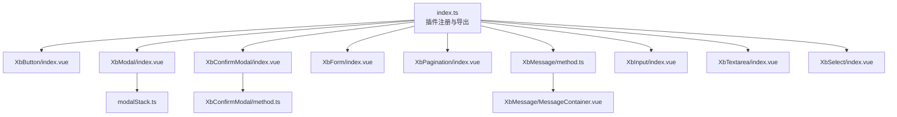
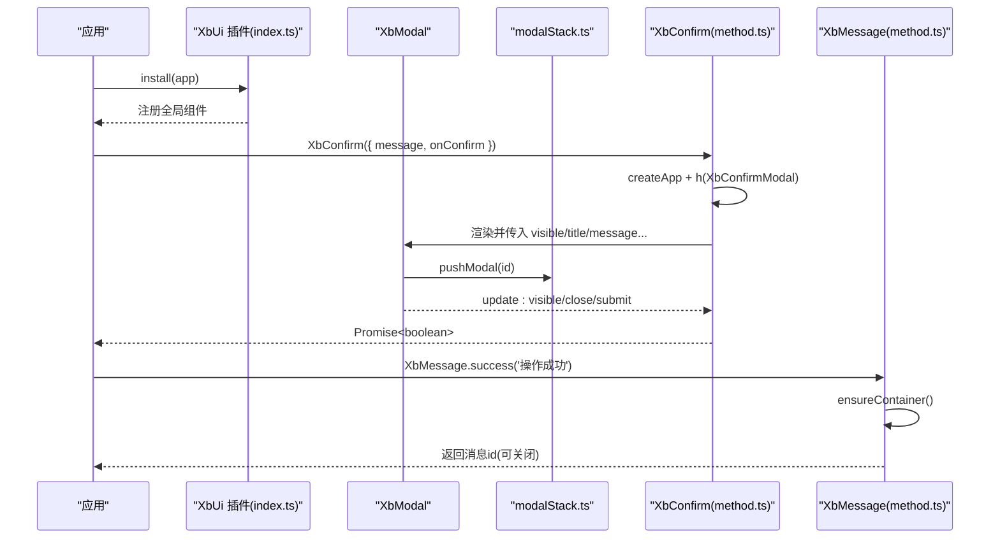
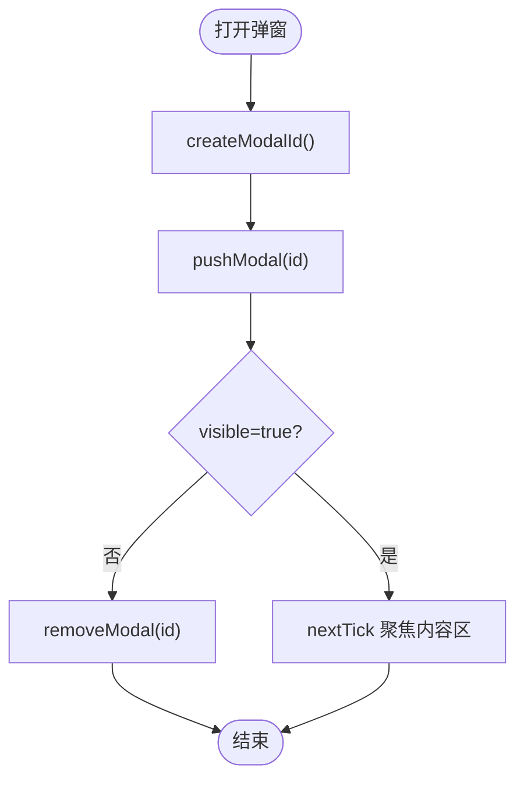
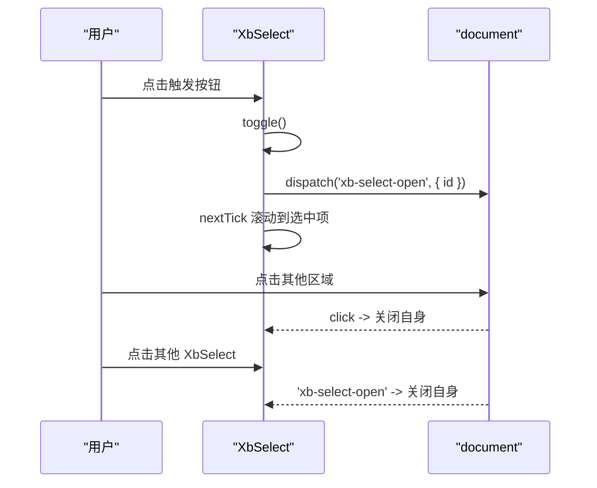
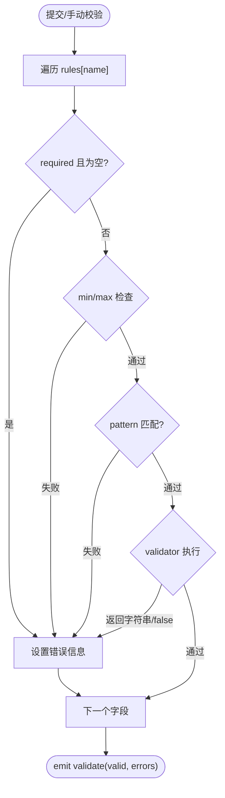
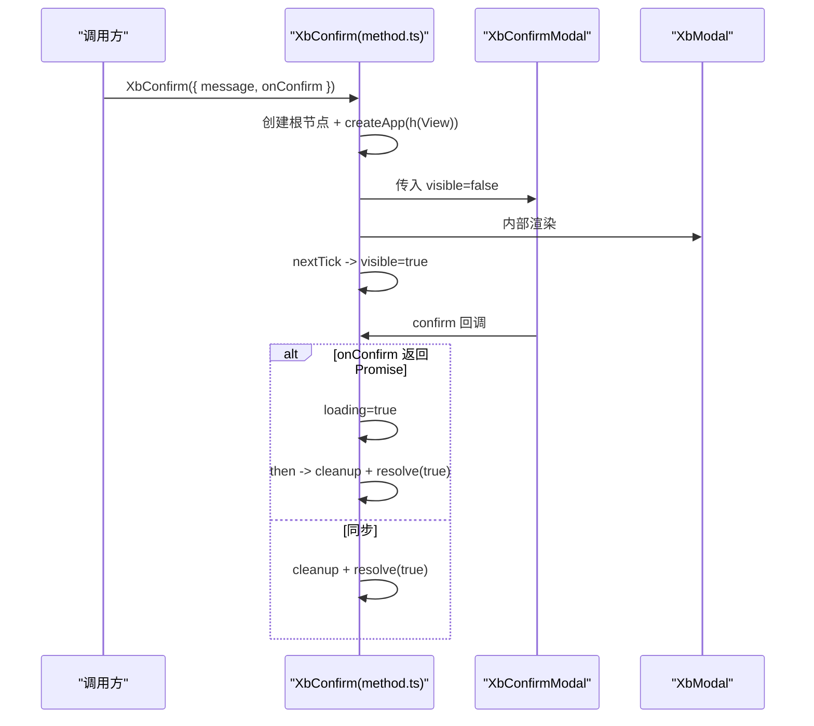
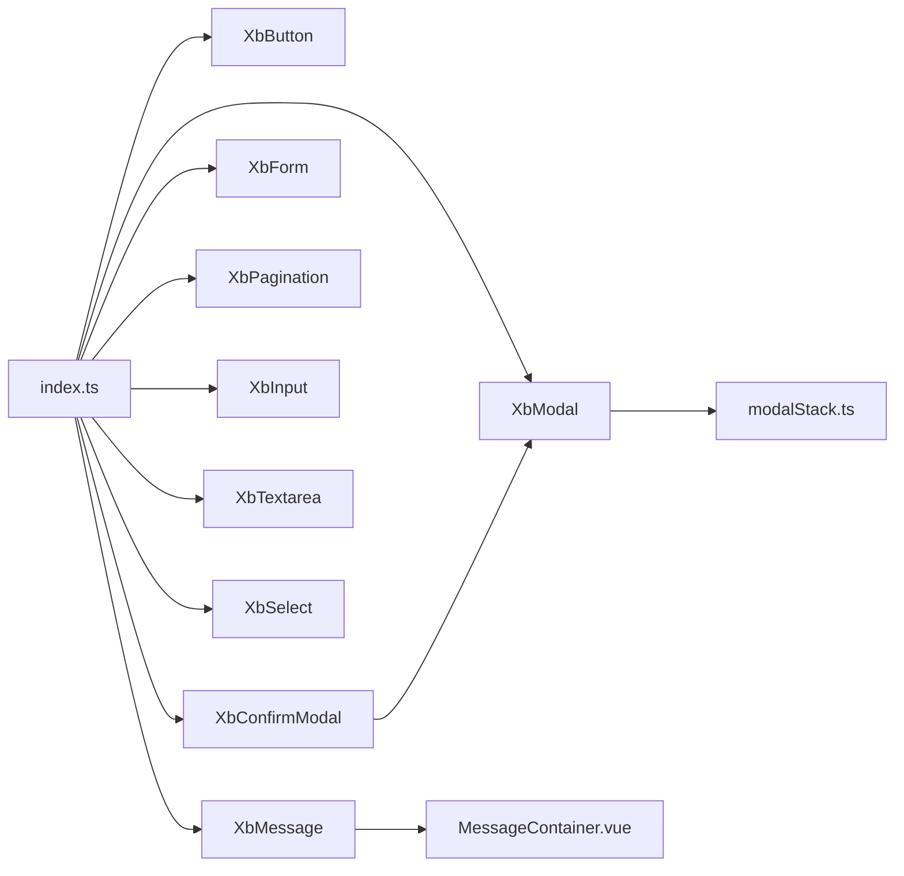

# 组件系统与UI框架

<cite>
**本文引用的文件**
- [frontend/src/xbUi/index.ts](file://frontend/src/xbUi/index.ts)
- [frontend/src/xbUi/modalStack.ts](file://frontend/src/xbUi/modalStack.ts)
- [frontend/src/xbUi/XbButton/index.vue](file://frontend/src/xbUi/XbButton/index.vue)
- [frontend/src/xbUi/XbModal/index.vue](file://frontend/src/xbUi/XbModal/index.vue)
- [frontend/src/xbUi/XbConfirmModal/index.vue](file://frontend/src/xbUi/XbConfirmModal/index.vue)
- [frontend/src/xbUi/XbConfirmModal/method.ts](file://frontend/src/xbUi/XbConfirmModal/method.ts)
- [frontend/src/xbUi/XbForm/index.vue](file://frontend/src/xbUi/XbForm/index.vue)
- [frontend/src/xbUi/XbForm/types.ts](file://frontend/src/xbUi/XbForm/types.ts)
- [frontend/src/xbUi/XbPagination/index.vue](file://frontend/src/xbUi/XbPagination/index.vue)
- [frontend/src/xbUi/XbMessage/method.ts](file://frontend/src/xbUi/XbMessage/method.ts)
- [frontend/src/xbUi/XbMessage/MessageContainer.vue](file://frontend/src/xbUi/XbMessage/MessageContainer.vue)
- [frontend/src/xbUi/XbInput/index.vue](file://frontend/src/xbUi/XbInput/index.vue)
- [frontend/src/xbUi/XbTextarea/index.vue](file://frontend/src/xbUi/XbTextarea/index.vue)
- [frontend/src/xbUi/XbSelect/index.vue](file://frontend/src/xbUi/XbSelect/index.vue)
- [frontend/src/xbUi/XbSelect/types.ts](file://frontend/src/xbUi/XbSelect/types.ts)
</cite>

## 目录
1. [简介](#简介)
2. [项目结构](#项目结构)
3. [核心组件](#核心组件)
4. [架构总览](#架构总览)
5. [详细组件分析](#详细组件分析)
6. [依赖关系分析](#依赖关系分析)
7. [性能与可访问性](#性能与可访问性)
8. [主题定制与响应式适配](#主题定制与响应式适配)
9. [故障排查指南](#故障排查指南)
10. [结论](#结论)

## 简介
本文件面向积木云AI创作平台的自定义UI组件库（XbUi），系统化阐述其设计架构、组件注册机制、全局API、模态框栈管理，以及按钮、表单、弹窗、分页等核心组件的实现原理。文档同时覆盖组件间通信模式、插槽使用、事件系统，并提供开发规范与最佳实践建议，帮助开发者快速上手并高质量扩展组件体系。

## 项目结构
XbUi采用“按功能分目录 + 统一入口”的组织方式：
- 每个组件独立目录，包含 index.vue 与可选的 types.ts / method.ts
- 统一入口 index.ts 负责批量注册为 Vue 插件，并支持按需导出
- 全局能力通过 method.ts 暴露命令式 API（如 XbConfirm、XbMessage）
- 模态框栈 modalStack.ts 提供跨实例的顶层交互控制

图表来源
- [frontend/src/xbUi/index.ts:1-100](file://frontend/src/xbUi/index.ts#L1-L100)
- [frontend/src/xbUi/modalStack.ts:1-29](file://frontend/src/xbUi/modalStack.ts#L1-L29)
- [frontend/src/xbUi/XbButton/index.vue:1-110](file://frontend/src/xbUi/XbButton/index.vue#L1-L110)
- [frontend/src/xbUi/XbModal/index.vue:1-620](file://frontend/src/xbUi/XbModal/index.vue#L1-L620)
- [frontend/src/xbUi/XbConfirmModal/index.vue:1-101](file://frontend/src/xbUi/XbConfirmModal/index.vue#L1-L101)
- [frontend/src/xbUi/XbConfirmModal/method.ts:1-150](file://frontend/src/xbUi/XbConfirmModal/method.ts#L1-L150)
- [frontend/src/xbUi/XbForm/index.vue:1-164](file://frontend/src/xbUi/XbForm/index.vue#L1-L164)
- [frontend/src/xbUi/XbPagination/index.vue:1-103](file://frontend/src/xbUi/XbPagination/index.vue#L1-L103)
- [frontend/src/xbUi/XbMessage/method.ts:1-116](file://frontend/src/xbUi/XbMessage/method.ts#L1-L116)
- [frontend/src/xbUi/XbMessage/MessageContainer.vue:1-618](file://frontend/src/xbUi/XbMessage/MessageContainer.vue#L1-L618)
- [frontend/src/xbUi/XbInput/index.vue:1-177](file://frontend/src/xbUi/XbInput/index.vue#L1-L177)
- [frontend/src/xbUi/XbTextarea/index.vue:1-168](file://frontend/src/xbUi/XbTextarea/index.vue#L1-L168)
- [frontend/src/xbUi/XbSelect/index.vue:1-271](file://frontend/src/xbUi/XbSelect/index.vue#L1-L271)

章节来源
- [frontend/src/xbUi/index.ts:1-100](file://frontend/src/xbUi/index.ts#L1-L100)

## 核心组件
本节概述各组件的职责与关键特性，便于快速定位后续深入分析。

- 按钮 XbButton：多形态（primary/secondary/ghost/danger/outline）、尺寸、加载态、禁用态、块级、自定义主色与渐变、原生 type 透传、图标插槽、键盘可聚焦。
- 输入 XbInput：双向绑定、密码可见切换、清除、前/后缀插槽、错误提示、尺寸、标签、最大长度、焦点/失焦/按键事件。
- 文本域 XbTextarea：多行输入、四角插槽、底部栏计数、清除、错误提示、调整大小方向。
- 选择 XbSelect：选项列表、向上/向下展开自适应、多实例互斥关闭、滚动到选中项、清除、自定义选中/选项渲染。
- 表单 XbForm：集中校验规则、字段状态管理、同步/异步校验器、提交与重置、上下文 provide/inject。
- 分页 XbPagination：可见页码计算、省略号、上一页/下一页、当前页高亮。
- 模态框 XbModal：Teleport 至 body、多种动画、遮罩点击关闭、Esc/Enter 行为、焦点管理与滚动锁定。
- 确认弹窗 XbConfirmModal：基于 XbModal 封装，支持 loading、文案配置、动画、是否显示取消/确认。
- 消息通知 XbMessage：命令式 API、多位置布局、丰富动画、自动关闭、类型化图标与样式。

章节来源
- [frontend/src/xbUi/XbButton/index.vue:1-110](file://frontend/src/xbUi/XbButton/index.vue#L1-L110)
- [frontend/src/xbUi/XbInput/index.vue:1-177](file://frontend/src/xbUi/XbInput/index.vue#L1-L177)
- [frontend/src/xbUi/XbTextarea/index.vue:1-168](file://frontend/src/xbUi/XbTextarea/index.vue#L1-L168)
- [frontend/src/xbUi/XbSelect/index.vue:1-271](file://frontend/src/xbUi/XbSelect/index.vue#L1-L271)
- [frontend/src/xbUi/XbForm/index.vue:1-164](file://frontend/src/xbUi/XbForm/index.vue#L1-L164)
- [frontend/src/xbUi/XbPagination/index.vue:1-103](file://frontend/src/xbUi/XbPagination/index.vue#L1-L103)
- [frontend/src/xbUi/XbModal/index.vue:1-620](file://frontend/src/xbUi/XbModal/index.vue#L1-L620)
- [frontend/src/xbUi/XbConfirmModal/index.vue:1-101](file://frontend/src/xbUi/XbConfirmModal/index.vue#L1-L101)
- [frontend/src/xbUi/XbMessage/method.ts:1-116](file://frontend/src/xbUi/XbMessage/method.ts#L1-L116)

## 架构总览
XbUi 以 Vue 插件形式安装，统一注册全局组件；命令式 API 通过 createApp 动态挂载到 body，实现无侵入调用。模态框栈确保仅最上层弹窗响应键盘快捷键，避免多层弹窗冲突。

图表来源
- [frontend/src/xbUi/index.ts:54-63](file://frontend/src/xbUi/index.ts#L54-L63)
- [frontend/src/xbUi/XbModal/index.vue:94-116](file://frontend/src/xbUi/XbModal/index.vue#L94-L116)
- [frontend/src/xbUi/modalStack.ts:1-29](file://frontend/src/xbUi/modalStack.ts#L1-L29)
- [frontend/src/xbUi/XbConfirmModal/method.ts:68-149](file://frontend/src/xbUi/XbConfirmModal/method.ts#L68-L149)
- [frontend/src/xbUi/XbMessage/method.ts:36-79](file://frontend/src/xbUi/XbMessage/method.ts#L36-L79)

## 详细组件分析

### 组件注册与全局API
- 插件安装：遍历 components 映射，逐一 app.component 注册，支持全局使用。
- 按需导出：除插件外，单独导出各组件与命令式方法，便于 tree-shaking。
- 类型导出：对外暴露 TabItem、MenuItem、FormRule、SelectOption、ModalAnimation、StepItem、MessageOptions 等类型，提升开发体验。

章节来源
- [frontend/src/xbUi/index.ts:30-63](file://frontend/src/xbUi/index.ts#L30-L63)
- [frontend/src/xbUi/index.ts:66-100](file://frontend/src/xbUi/index.ts#L66-L100)

### 模态框栈管理
- 唯一ID生成：createModalId 保证实例唯一。
- 入栈/出栈：pushModal/removeModal 维护栈数组，避免重复入栈。
- 顶层判断：isTopModal 用于键盘事件拦截，确保仅最上层弹窗处理 Esc/Enter。

图表来源
- [frontend/src/xbUi/modalStack.ts:9-29](file://frontend/src/xbUi/modalStack.ts#L9-L29)
- [frontend/src/xbUi/XbModal/index.vue:94-116](file://frontend/src/xbUi/XbModal/index.vue#L94-L116)

章节来源
- [frontend/src/xbUi/modalStack.ts:1-29](file://frontend/src/xbUi/modalStack.ts#L1-L29)
- [frontend/src/xbUi/XbModal/index.vue:78-116](file://frontend/src/xbUi/XbModal/index.vue#L78-L116)

### 按钮 XbButton
- 属性：type/size/loading/disabled/block/color/gradient/nativeType
- 事件：click
- 样式：内置多种 type 类名，支持自定义主色与渐变；loading 时显示旋转指示器
- 无障碍：focus-visible 样式优化，原生 button 语义

章节来源
- [frontend/src/xbUi/XbButton/index.vue:1-110](file://frontend/src/xbUi/XbButton/index.vue#L1-L110)

### 输入 XbInput
- 双向绑定：modelValue/update:modelValue
- 功能：密码可见切换、清除、前/后缀插槽、错误提示、最大长度、尺寸、标签
- 事件：input/focus/blur/clear/keydown

章节来源
- [frontend/src/xbUi/XbInput/index.vue:1-177](file://frontend/src/xbUi/XbInput/index.vue#L1-L177)

### 文本域 XbTextarea
- 双向绑定：modelValue/update:modelValue
- 功能：四角插槽、底部栏（计数/左右插槽）、清除、错误提示、行数、调整方向
- 事件：input/focus/blur/clear

章节来源
- [frontend/src/xbUi/XbTextarea/index.vue:1-168](file://frontend/src/xbUi/XbTextarea/index.vue#L1-L168)

### 选择 XbSelect
- 数据：options 数组，label/value/disabled 扩展字段
- 交互：点击触发下拉、点击外部关闭、多实例互斥关闭（自定义事件）、滚动到选中项
- 定位：根据视口空间决定向上或向下展开，固定定位对齐触发元素
- 事件：update:modelValue/change/clear

图表来源
- [frontend/src/xbUi/XbSelect/index.vue:94-157](file://frontend/src/xbUi/XbSelect/index.vue#L94-L157)

章节来源
- [frontend/src/xbUi/XbSelect/index.vue:1-271](file://frontend/src/xbUi/XbSelect/index.vue#L1-L271)
- [frontend/src/xbUi/XbSelect/types.ts:1-9](file://frontend/src/xbUi/XbSelect/types.ts#L1-L9)

### 表单 XbForm
- 上下文：provide xbFormContext，子项通过 inject 获取 registerField/unregisterField/updateFieldValue/validateField/getFieldError/isFieldTouched 等方法
- 校验：rules 支持 required/min/max/pattern/validator（同步或异步）
- 生命周期：validate 收集错误并 emit validate(valid, errors)；resetFields 清空 touched/error；handleSubmit 校验后 emit submit(model)
- 暴露方法：validate/resetFields handleSubmit

图表来源
- [frontend/src/xbUi/XbForm/index.vue:81-134](file://frontend/src/xbUi/XbForm/index.vue#L81-L134)

章节来源
- [frontend/src/xbUi/XbForm/index.vue:1-164](file://frontend/src/xbUi/XbForm/index.vue#L1-L164)
- [frontend/src/xbUi/XbForm/types.ts:1-15](file://frontend/src/xbUi/XbForm/types.ts#L1-L15)

### 分页 XbPagination
- 算法：计算 visiblePages，当 totalPages > maxVisible 时插入省略号，保持中间区域稳定
- 交互：上一页/下一页禁用态、当前页高亮、点击更新 currentPage

章节来源
- [frontend/src/xbUi/XbPagination/index.vue:1-103](file://frontend/src/xbUi/XbPagination/index.vue#L1-L103)

### 模态框 XbModal
- 展示：Teleport to body，Transition 过渡，支持多种动画
- 交互：遮罩点击关闭、Esc 关闭、Enter 提交（可配置）、持久化 persistent 阻止关闭
- 焦点：进入时聚焦内容区，退出时恢复 body overflow
- 键盘：仅顶层弹窗响应键盘事件（基于 modalStack）

章节来源
- [frontend/src/xbUi/XbModal/index.vue:1-116](file://frontend/src/xbUi/XbModal/index.vue#L1-L116)
- [frontend/src/xbUi/XbModal/index.vue:119-156](file://frontend/src/xbUi/XbModal/index.vue#L119-L156)
- [frontend/src/xbUi/modalStack.ts:25-29](file://frontend/src/xbUi/modalStack.ts#L25-L29)

### 确认弹窗 XbConfirmModal
- 基于 XbModal 封装，提供 title/message/confirmText/cancelText/confirmType/width/showCancel/showConfirm/animation/closeOnOverlay
- 支持 loading 态，onConfirm 返回 Promise 时自动显示 loading，完成后关闭并 resolve(true)
- 命令式 API：XbConfirm(options|string) 返回 Promise<boolean>

图表来源
- [frontend/src/xbUi/XbConfirmModal/method.ts:68-149](file://frontend/src/xbUi/XbConfirmModal/method.ts#L68-L149)
- [frontend/src/xbUi/XbConfirmModal/index.vue:59-101](file://frontend/src/xbUi/XbConfirmModal/index.vue#L59-L101)

章节来源
- [frontend/src/xbUi/XbConfirmModal/index.vue:1-101](file://frontend/src/xbUi/XbConfirmModal/index.vue#L1-L101)
- [frontend/src/xbUi/XbConfirmModal/method.ts:1-150](file://frontend/src/xbUi/XbConfirmModal/method.ts#L1-L150)

### 消息通知 XbMessage
- 命令式 API：XbMessage(options|string)，以及 success/warning/error/info/close/closeAll
- 容器：ensureContainer 首次调用时创建根节点并挂载 MessageContainer
- 状态：state.messages 响应式数组，addMessage 追加并设置自动关闭定时器
- 布局：按 position 分组，支持 top-left/top/top-right/bottom-left/bottom/bottom-right
- 动画：内置 slide-down/slide-up/slide-left/slide-right/fade/scale/bounce/flip/zoom/swing/elastic/rotate/blur/backdrop

章节来源
- [frontend/src/xbUi/XbMessage/method.ts:1-116](file://frontend/src/xbUi/XbMessage/method.ts#L1-L116)
- [frontend/src/xbUi/XbMessage/MessageContainer.vue:1-114](file://frontend/src/xbUi/XbMessage/MessageContainer.vue#L1-L114)

## 依赖关系分析
- 组件内聚：每个组件职责单一，props/emits 清晰，样式与逻辑分离
- 耦合点：
  - XbConfirmModal 依赖 XbModal 与 XbButton
  - XbModal 依赖 modalStack 与 XbIcon
  - XbSelect 通过 document 自定义事件与其他 XbSelect 实例解耦通信
  - XbForm 通过 provide/inject 与 XbFormItem 协作（未在本仓库中展示具体实现）
- 外部依赖：Vue 3 响应式、Teleport、Transition、createApp/h

图表来源
- [frontend/src/xbUi/index.ts:30-63](file://frontend/src/xbUi/index.ts#L30-L63)
- [frontend/src/xbUi/XbConfirmModal/index.vue:1-101](file://frontend/src/xbUi/XbConfirmModal/index.vue#L1-L101)
- [frontend/src/xbUi/XbModal/index.vue:1-116](file://frontend/src/xbUi/XbModal/index.vue#L1-L116)
- [frontend/src/xbUi/modalStack.ts:1-29](file://frontend/src/xbUi/modalStack.ts#L1-L29)
- [frontend/src/xbUi/XbMessage/method.ts:1-116](file://frontend/src/xbUi/XbMessage/method.ts#L1-L116)
- [frontend/src/xbUi/XbMessage/MessageContainer.vue:1-114](file://frontend/src/xbUi/XbMessage/MessageContainer.vue#L1-L114)

章节来源
- [frontend/src/xbUi/index.ts:1-100](file://frontend/src/xbUi/index.ts#L1-L100)

## 性能与可访问性
- 性能
  - Teleport 将弹窗/下拉/消息渲染至 body，减少 DOM 层级对父组件的影响
  - Transition 与 CSS transform/opacity 动画，利用合成层提升流畅度
  - XbSelect 仅在需要时计算定位与滚动，避免频繁重排
- 可访问性
  - 按钮/输入/选择均具备原生语义与 focus-visible 样式
  - 模态框在打开时将焦点移至内容区，关闭时恢复，防止背景表单获得焦点
  - 键盘支持：Esc 关闭非持久弹窗，Enter/Space 触发提交（可配置）

[本节为通用指导，不直接分析具体文件]

## 主题定制与响应式适配
- 主题定制
  - 颜色变量：通过 CSS 变量（如 --brand、--danger、--border、--surface-elevated、--content-*）驱动全局配色
  - 按钮自定义主色：XbButton 支持 color 与 gradient，通过 CSS 变量注入阴影与渐变
  - 消息/模态框边框与背景：使用 hsl(var(--border)) 与 hsl(var(--surface-elevated)) 保持一致风格
- 响应式适配
  - 尺寸系统：sm/md/lg 三档尺寸，配合 Tailwind 工具类实现紧凑/标准/宽松布局
  - 选择下拉自适应：根据视口高度与触发元素位置，自动选择向上/向下展开
  - 模态框宽度：默认 w-[440px]，可通过 width 属性覆盖

章节来源
- [frontend/src/xbUi/XbButton/index.vue:44-76](file://frontend/src/xbUi/XbButton/index.vue#L44-L76)
- [frontend/src/xbUi/XbModal/index.vue:33-56](file://frontend/src/xbUi/XbModal/index.vue#L33-L56)
- [frontend/src/xbUi/XbSelect/index.vue:66-92](file://frontend/src/xbUi/XbSelect/index.vue#L66-L92)

## 故障排查指南
- 模态框无法关闭
  - 检查 closeOnOverlay 与 persistent 组合是否导致点击遮罩无效
  - 确认 isTopModal 判断是否正确（仅顶层弹窗响应键盘）
- 确认弹窗 onConfirm 未触发
  - 若 onConfirm 返回 Promise，需确保 resolve/reject 路径正确，避免 loading 卡住
- 消息未出现
  - 确认 ensureContainer 已执行，body 中存在根节点
  - 检查 duration 是否为 0（不自动关闭）或过短导致立即消失
- 选择下拉错位
  - 窗口 resize/滚动时会自动更新定位，若仍错位，检查是否有固定定位父级影响 getBoundingClientRect

章节来源
- [frontend/src/xbUi/XbModal/index.vue:72-92](file://frontend/src/xbUi/XbModal/index.vue#L72-L92)
- [frontend/src/xbUi/XbConfirmModal/method.ts:93-114](file://frontend/src/xbUi/XbConfirmModal/method.ts#L93-L114)
- [frontend/src/xbUi/XbMessage/method.ts:36-79](file://frontend/src/xbUi/XbMessage/method.ts#L36-L79)
- [frontend/src/xbUi/XbSelect/index.vue:140-157](file://frontend/src/xbUi/XbSelect/index.vue#L140-L157)

## 结论
XbUi 以清晰的插件注册机制、完善的命令式 API 与健壮的模态框栈管理，构建了可扩展、易用的 UI 组件体系。组件遵循统一的 props/emits 约定，结合丰富的动画与主题变量，满足复杂业务场景下的定制化需求。建议在新增组件时沿用现有模式：独立目录、类型定义、按需导出、命令式封装（如需），并关注可访问性与性能优化。